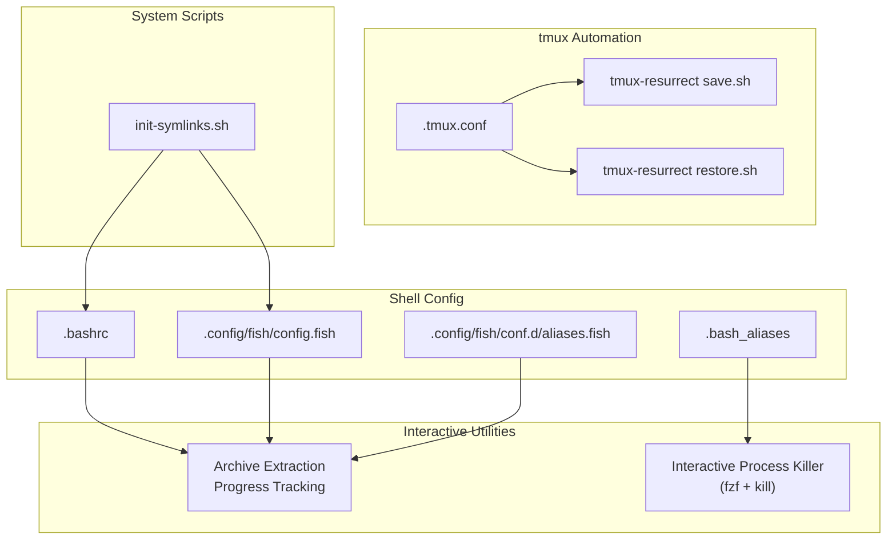
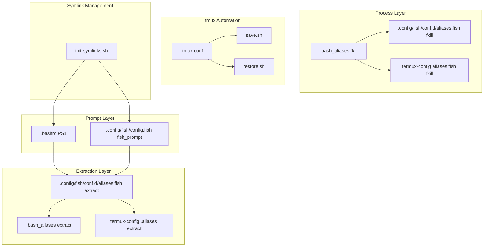
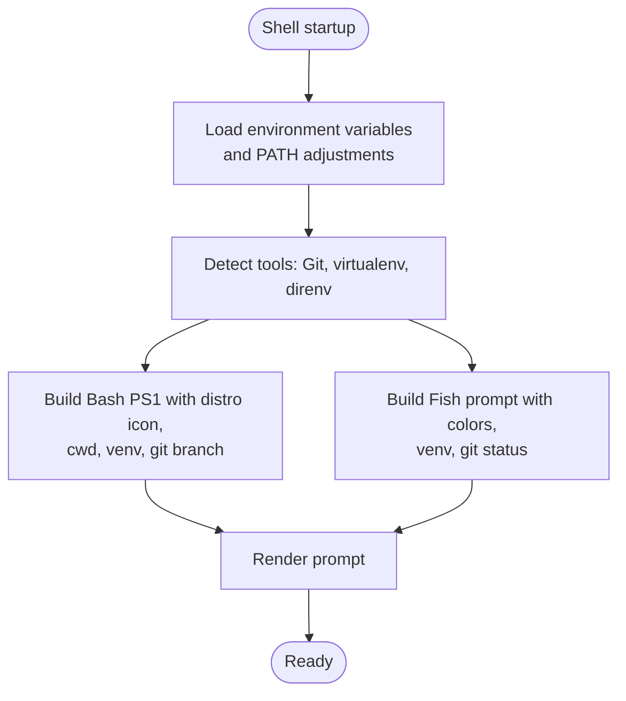
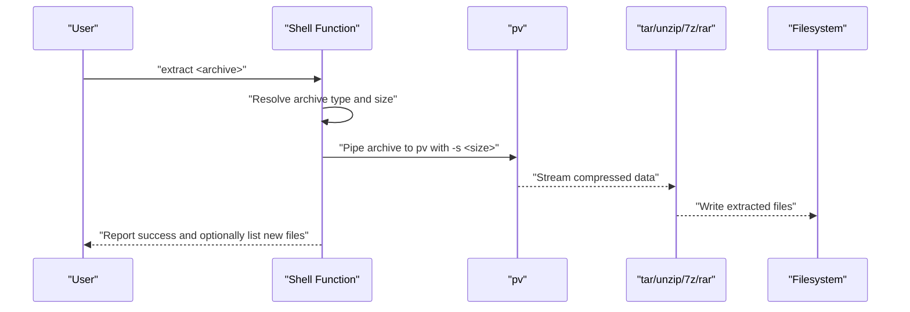
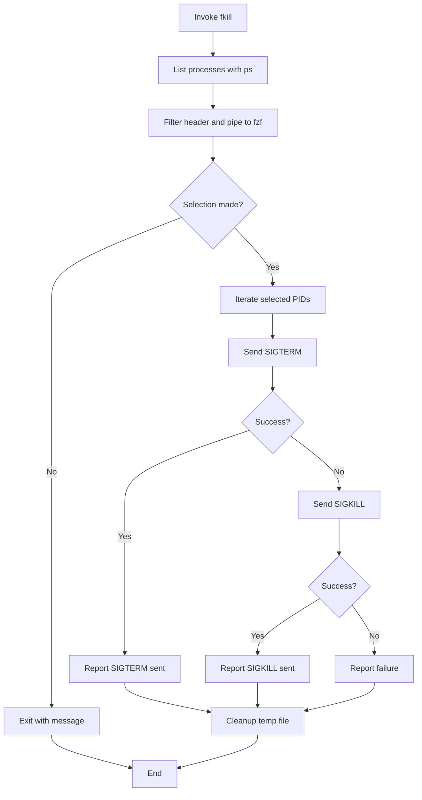
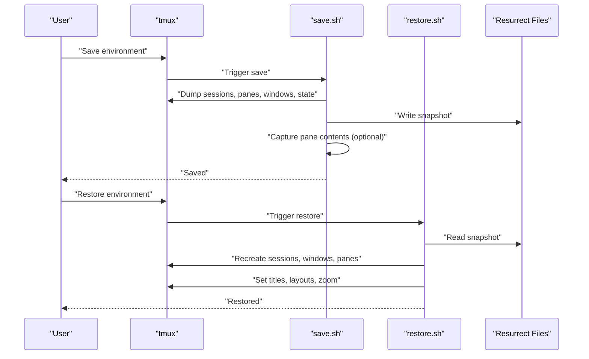
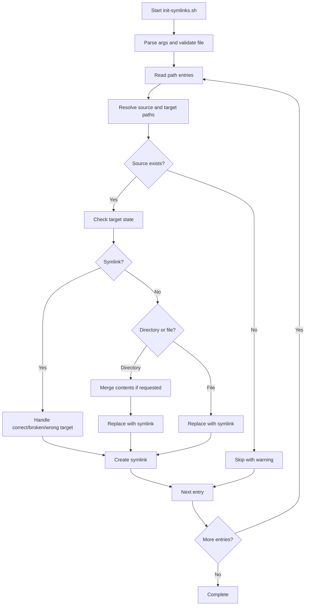
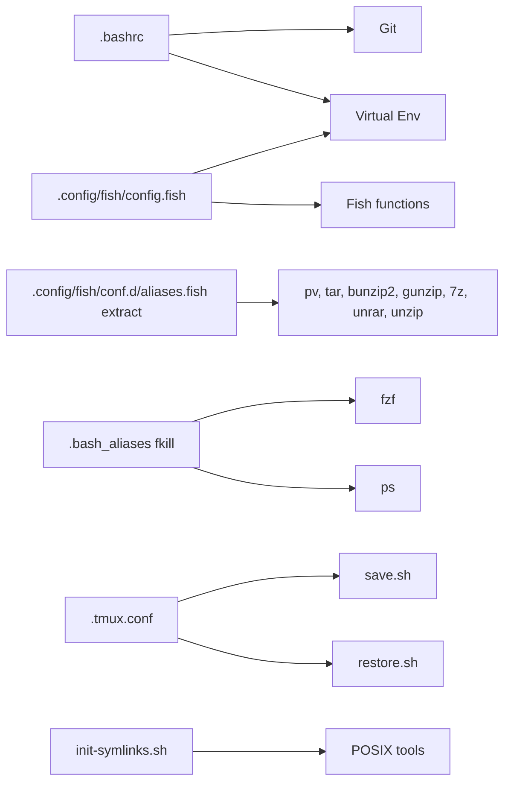

# Advanced Features

<cite>
**Referenced Files in This Document**
- [init-symlinks.sh](file://init-symlinks.sh)
- [.bashrc](file://.bashrc)
- [.config/fish/config.fish](file://.config/fish/config.fish)
- [.config/fish/conf.d/aliases.fish](file://.config/fish/conf.d/aliases.fish)
- [.bash_aliases](file://.bash_aliases)
- [.tmux.conf](file://.tmux.conf)
- [tmux-resurrect save.sh](file://.tmux/plugins/tmux-resurrect/scripts/save.sh)
- [tmux-resurrect restore.sh](file://.tmux/plugins/tmux-resurrect/scripts/restore.sh)
- [termux .aliases](file://termux-config/.aliases)
- [termux aliases.fish](file://termux-config/.config/fish/conf.d/aliases.fish)
</cite>

## Table of Contents
1. [Introduction](#introduction)
2. [Project Structure](#project-structure)
3. [Core Components](#core-components)
4. [Architecture Overview](#architecture-overview)
5. [Detailed Component Analysis](#detailed-component-analysis)
6. [Dependency Analysis](#dependency-analysis)
7. [Performance Considerations](#performance-considerations)
8. [Troubleshooting Guide](#troubleshooting-guide)
9. [Conclusion](#conclusion)
10. [Appendices](#appendices)

## Introduction
This document focuses on advanced features centered around:
- Custom prompt system implementation across Bash and Fish shells
- Interactive process management utilities for quick process selection and termination
- Specialized workflow automation using tmux-resurrect for environment persistence and restoration
- Advanced shell scripting techniques for robust symlink management and archive extraction with progress feedback

The goal is to explain how these systems are implemented, how they integrate, and how to extend them for power-user productivity.

## Project Structure
The advanced features span shell configuration, interactive utilities, and tmux automation:
- Shell prompt customization and environment integration
- Cross-shell archive extraction with progress indicators
- Interactive process killer leveraging fzf
- tmux environment saving/restoration with pane content capture
- Robust symlink initialization and maintenance

**Diagram sources**
- [.bashrc](file://.bashrc#L1-L343)
- [.config/fish/config.fish](file://.config/fish/config.fish#L1-L168)
- [.config/fish/conf.d/aliases.fish](file://.config/fish/conf.d/aliases.fish#L1-L148)
- [.bash_aliases](file://.bash_aliases#L1-L196)
- [.tmux.conf](file://.tmux.conf#L1-L69)
- [tmux-resurrect save.sh](file://.tmux/plugins/tmux-resurrect/scripts/save.sh#L1-L279)
- [tmux-resurrect restore.sh](file://.tmux/plugins/tmux-resurrect/scripts/restore.sh#L1-L388)
- [init-symlinks.sh](file://init-symlinks.sh#L1-L347)

**Section sources**
- [.bashrc](file://.bashrc#L1-L343)
- [.config/fish/config.fish](file://.config/fish/config.fish#L1-L168)
- [.config/fish/conf.d/aliases.fish](file://.config/fish/conf.d/aliases.fish#L1-L148)
- [.bash_aliases](file://.bash_aliases#L1-L196)
- [.tmux.conf](file://.tmux.conf#L1-L69)
- [tmux-resurrect save.sh](file://.tmux/plugins/tmux-resurrect/scripts/save.sh#L1-L279)
- [tmux-resurrect restore.sh](file://.tmux/plugins/tmux-resurrect/scripts/restore.sh#L1-L388)
- [init-symlinks.sh](file://init-symlinks.sh#L1-L347)

## Core Components
- Custom prompt system:
  - Bash two-line prompt with distro icon, working directory, virtual environment, and Git branch
  - Fish prompt with similar metadata and color theming
- Interactive archive extraction:
  - Cross-shell functions to extract archives with progress using pv and format-specific handlers
- Interactive process management:
  - fzf-powered process picker with preview and multi-select, followed by graceful termination
- tmux environment automation:
  - Save and restore sessions, windows, panes, pane contents, zoom state, and grouped sessions
- Advanced symlink management:
  - Safe symlink creation with conflict resolution, backup generation, and batch mode

**Section sources**
- [.bashrc](file://.bashrc#L55-L196)
- [.config/fish/config.fish](file://.config/fish/config.fish#L84-L109)
- [.config/fish/conf.d/aliases.fish](file://.config/fish/conf.d/aliases.fish#L68-L101)
- [.bash_aliases](file://.bash_aliases#L108-L154)
- [tmux-resurrect save.sh](file://.tmux/plugins/tmux-resurrect/scripts/save.sh#L180-L260)
- [tmux-resurrect restore.sh](file://.tmux/plugins/tmux-resurrect/scripts/restore.sh#L264-L388)
- [init-symlinks.sh](file://init-symlinks.sh#L116-L244)

## Architecture Overview
The advanced features form a cohesive ecosystem:
- Shell prompts depend on environment variables and optional tools (e.g., Git, virtual environments)
- Archive extraction utilities rely on external tools (pv, tar, bunzip2, gunzip, 7z, unrar, unzip)
- Process killer integrates with fzf for selection and uses signal-based termination
- tmux-resurrect orchestrates saving and restoring pane layouts, commands, and content
- init-symlinks manages dotfiles deployment with safety checks and backups

**Diagram sources**
- [.bashrc](file://.bashrc#L55-L196)
- [.config/fish/config.fish](file://.config/fish/config.fish#L84-L109)
- [.config/fish/conf.d/aliases.fish](file://.config/fish/conf.d/aliases.fish#L68-L141)
- [.bash_aliases](file://.bash_aliases#L108-L195)
- [termux-config .aliases](file://termux-config/.aliases#L119-L434)
- [termux-config aliases.fish](file://termux-config/.config/fish/conf.d/aliases.fish#L1-L106)
- [.tmux.conf](file://.tmux.conf#L1-L69)
- [tmux-resurrect save.sh](file://.tmux/plugins/tmux-resurrect/scripts/save.sh#L238-L279)
- [tmux-resurrect restore.sh](file://.tmux/plugins/tmux-resurrect/scripts/restore.sh#L366-L388)
- [init-symlinks.sh](file://init-symlinks.sh#L250-L294)

## Detailed Component Analysis

### Custom Prompt System
- Bash prompt:
  - Two-line prompt with distro icon, shortened working directory, virtual environment indicator, and Git branch
  - Uses color sequences and conditional rendering based on terminal capabilities
- Fish prompt:
  - Similar metadata with color theming and emoji icons
  - Integrates virtual environment detection and Git status via Fish functions
- Environment integration:
  - Disables external virtual environment prompt overrides
  - Prepends and appends key directories to PATH
  - Loads optional tools like direnv and NVM/NPM configurations

**Diagram sources**
- [.bashrc](file://.bashrc#L55-L196)
- [.config/fish/config.fish](file://.config/fish/config.fish#L84-L134)

**Section sources**
- [.bashrc](file://.bashrc#L55-L196)
- [.config/fish/config.fish](file://.config/fish/config.fish#L84-L134)

### Interactive Archive Extraction with Progress Tracking
- Cross-shell functions provide unified extraction with progress:
  - Detects archive type and pipes through pv with total size for progress
  - Supports tar.gz, tar.xz, tar.bz2, tar, bz2, gz, 7z, rar, zip, Z
  - Provides user feedback and handles unsupported formats
- Termux-specific extraction:
  - Comprehensive switch statement covering additional formats and post-extraction listing of newly added files
  - Uses temporary files to compare pre/post extraction file lists and prints discovered items

**Diagram sources**
- [.config/fish/conf.d/aliases.fish](file://.config/fish/conf.d/aliases.fish#L68-L101)
- [.bash_aliases](file://.bash_aliases#L108-L154)
- [termux-config .aliases](file://termux-config/.aliases#L119-L325)

**Section sources**
- [.config/fish/conf.d/aliases.fish](file://.config/fish/conf.d/aliases.fish#L68-L101)
- [.bash_aliases](file://.bash_aliases#L108-L154)
- [termux-config .aliases](file://termux-config/.aliases#L119-L325)

### Interactive Process Management
- fzf-based process selection:
  - Lists processes sorted by memory usage with user, pid, and command
  - Multi-select with preview of process details and sorting toggle
- Termination strategy:
  - Sends SIGTERM first; falls back to SIGKILL if needed
  - Cleans up temporary selections and reports outcomes

**Diagram sources**
- [.bash_aliases](file://.bash_aliases#L161-L195)
- [.config/fish/conf.d/aliases.fish](file://.config/fish/conf.d/aliases.fish#L110-L141)
- [termux-config aliases.fish](file://termux-config/.config/fish/conf.d/aliases.fish#L66-L80)

**Section sources**
- [.bash_aliases](file://.bash_aliases#L161-L195)
- [.config/fish/conf.d/aliases.fish](file://.config/fish/conf.d/aliases.fish#L110-L141)
- [termux-config aliases.fish](file://termux-config/.config/fish/conf.d/aliases.fish#L66-L80)

### tmux Workflow Automation
- Save environment:
  - Captures grouped sessions, panes, windows, and client state
  - Optionally captures pane contents and creates an archive
  - Removes old backups based on retention policy
- Restore environment:
  - Detects whether restoring from scratch and whether pane contents are captured
  - Recreates sessions, windows, and panes; sets titles, layouts, and zoom state
  - Restores active windows, grouped session relationships, and client sessions
  - Cleans up temporary pane content files after restoration

**Diagram sources**
- [tmux-resurrect save.sh](file://.tmux/plugins/tmux-resurrect/scripts/save.sh#L238-L279)
- [tmux-resurrect restore.sh](file://.tmux/plugins/tmux-resurrect/scripts/restore.sh#L366-L388)

**Section sources**
- [tmux-resurrect save.sh](file://.tmux/plugins/tmux-resurrect/scripts/save.sh#L180-L260)
- [tmux-resurrect restore.sh](file://.tmux/plugins/tmux-resurrect/scripts/restore.sh#L264-L388)

### Advanced Shell Scripting: Symlink Management
- Safety-first symlink creation:
  - Resolves absolute source paths and normalizes targets
  - Handles existing symlinks (correct link, broken link, wrong target)
  - Handles existing directories and files with user prompts or batch mode
  - Generates timestamped backups and merges directory contents when appropriate
- Robust path handling:
  - Supports special handling for termux-config paths
  - Creates parent directories as needed
  - Reports success or failure for each operation

**Diagram sources**
- [init-symlinks.sh](file://init-symlinks.sh#L250-L294)

**Section sources**
- [init-symlinks.sh](file://init-symlinks.sh#L1-L347)

## Dependency Analysis
- Shell prompt dependencies:
  - Bash depends on Git and virtual environment detection; Fish relies on Fish functions and optional tools
- Extraction utilities depend on external tools (pv, tar, bunzip2, gunzip, 7z, unrar, unzip)
- Process killer depends on fzf and ps; output is piped to less for viewing
- tmux-resurrect depends on tmux and optional pane content capture; integrates with tmux plugins
- init-symlinks depends on standard POSIX tools and user input in interactive mode

**Diagram sources**
- [.bashrc](file://.bashrc#L55-L196)
- [.config/fish/config.fish](file://.config/fish/config.fish#L84-L134)
- [.config/fish/conf.d/aliases.fish](file://.config/fish/conf.d/aliases.fish#L68-L101)
- [.bash_aliases](file://.bash_aliases#L161-L195)
- [.tmux.conf](file://.tmux.conf#L56-L68)
- [tmux-resurrect save.sh](file://.tmux/plugins/tmux-resurrect/scripts/save.sh#L1-L279)
- [tmux-resurrect restore.sh](file://.tmux/plugins/tmux-resurrect/scripts/restore.sh#L1-L388)
- [init-symlinks.sh](file://init-symlinks.sh#L1-L347)

**Section sources**
- [.bashrc](file://.bashrc#L55-L196)
- [.config/fish/config.fish](file://.config/fish/config.fish#L84-L134)
- [.config/fish/conf.d/aliases.fish](file://.config/fish/conf.d/aliases.fish#L68-L101)
- [.bash_aliases](file://.bash_aliases#L161-L195)
- [.tmux.conf](file://.tmux.conf#L56-L68)
- [tmux-resurrect save.sh](file://.tmux/plugins/tmux-resurrect/scripts/save.sh#L1-L279)
- [tmux-resurrect restore.sh](file://.tmux/plugins/tmux-resurrect/scripts/restore.sh#L1-L388)
- [init-symlinks.sh](file://init-symlinks.sh#L1-L347)

## Performance Considerations
- Prompt rendering:
  - Minimize external calls; cache Git branch and virtual environment detection results when possible
  - Use efficient string operations and avoid heavy subprocesses in Fish prompt
- Archive extraction:
  - Prefer streaming extraction with pv to provide accurate progress; avoid decompressing to temporary files unnecessarily
  - Limit post-extraction file listing to newly added files to reduce overhead
- Process killer:
  - Use fzf’s preview efficiently; avoid excessive system calls in preview command
  - Terminate with SIGTERM first to allow graceful shutdown; limit retries for SIGKILL
- tmux automation:
  - Capture pane contents only when needed; disable content capture for faster saves/restores
  - Remove old backups periodically to prevent filesystem bloat
- Symlink management:
  - Batch mode reduces I/O from interactive prompts; ensure backups are timestamped to avoid collisions

[No sources needed since this section provides general guidance]

## Troubleshooting Guide
- Prompt not displaying correctly:
  - Verify terminal color support and ensure PS1/terminal overrides are set appropriately
  - Confirm Git and virtual environment detection scripts are executable and return expected output
- Archive extraction fails:
  - Ensure pv and format-specific tools are installed; check permissions on archive and destination
  - For termux extraction, confirm temporary file handling and pre/post comparison logic
- Process killer does nothing:
  - Verify fzf is installed and accessible; check that ps output is readable
  - Confirm signal availability and permissions for terminating selected processes
- tmux restore issues:
  - Ensure tmux version compatibility and that required hooks are configured
  - Check pane contents capture settings and that archive extraction/cleanup completes
- Symlink creation errors:
  - Review backup generation and replacement logic; ensure sufficient permissions for target directories
  - Use batch mode to bypass interactive prompts when automating deployments

**Section sources**
- [.bashrc](file://.bashrc#L55-L196)
- [.config/fish/config.fish](file://.config/fish/config.fish#L84-L134)
- [.config/fish/conf.d/aliases.fish](file://.config/fish/conf.d/aliases.fish#L68-L101)
- [.bash_aliases](file://.bash_aliases#L161-L195)
- [termux-config .aliases](file://termux-config/.aliases#L119-L325)
- [tmux-resurrect save.sh](file://.tmux/plugins/tmux-resurrect/scripts/save.sh#L229-L260)
- [tmux-resurrect restore.sh](file://.tmux/plugins/tmux-resurrect/scripts/restore.sh#L358-L388)
- [init-symlinks.sh](file://init-symlinks.sh#L116-L244)

## Conclusion
The advanced features demonstrate a cohesive approach to shell customization, interactive productivity, and environment automation. By combining cross-shell prompts, robust extraction utilities, fzf-driven process management, tmux-resurrect workflows, and safe symlink management, users can achieve a highly efficient and reliable development environment. Extending these systems involves careful integration of external tools, thoughtful error handling, and performance-conscious design choices.

[No sources needed since this section summarizes without analyzing specific files]

## Appendices
- Practical usage scenarios:
  - Prompt customization: Tailor Bash and Fish prompts to include project-specific metadata and theme preferences
  - Archive extraction: Use cross-shell extract functions for consistent progress feedback across environments
  - Process management: Employ fzf-based selection for safe and efficient process termination
  - tmux automation: Save and restore complex tmux setups with pane content capture for reproducible sessions
  - Symlink management: Automate dotfiles deployment with conflict resolution and backup strategies

[No sources needed since this section provides general guidance]