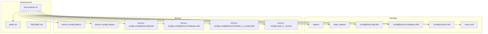
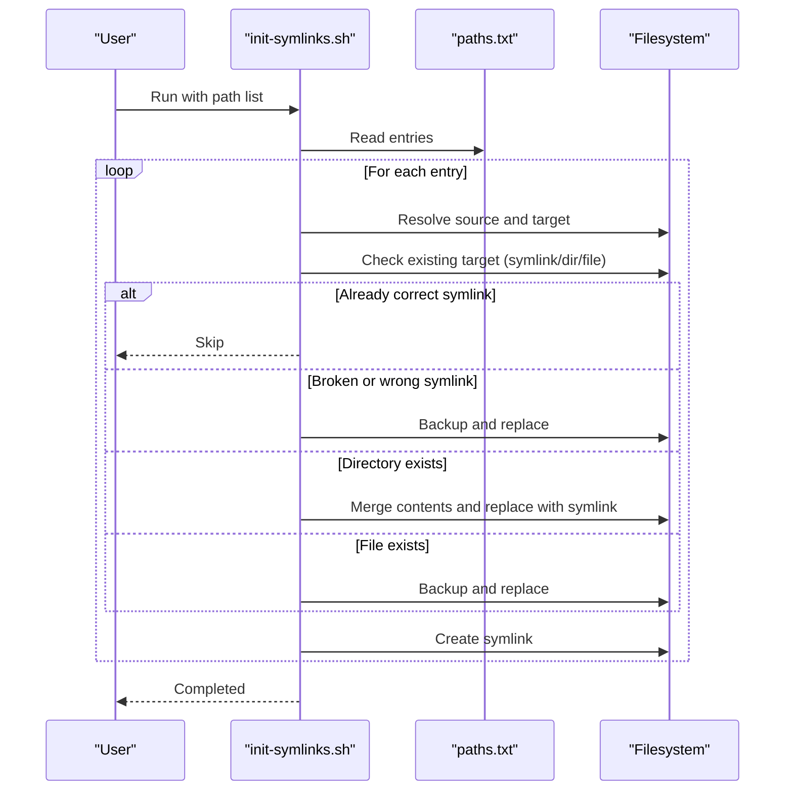
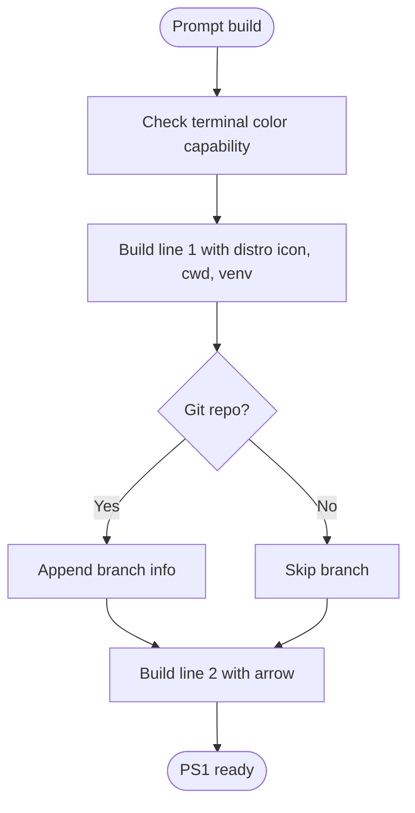
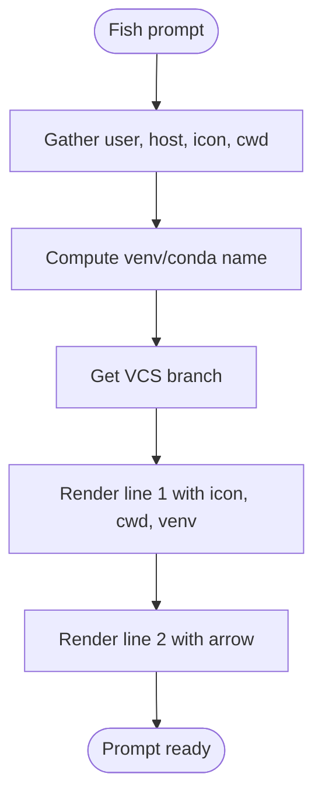
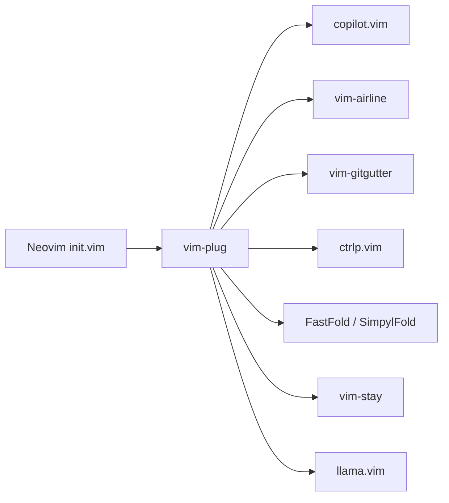
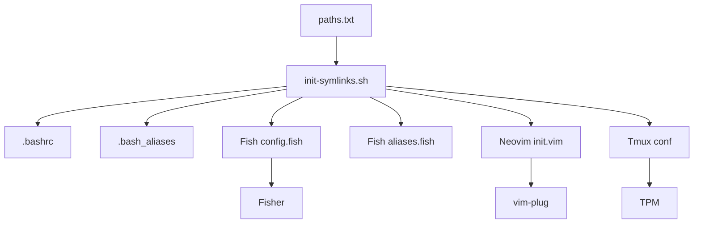

# Customization Guide

<cite>
**Referenced Files in This Document**
- [.bashrc](file://.bashrc)
- [.bash_aliases](file://.bash_aliases)
- [.tmux.conf](file://.tmux.conf)
- [.tmuxline.sh](file://.tmuxline.sh)
- [init-symlinks.sh](file://init-symlinks.sh)
- [paths.txt](file://paths.txt)
- [README.md](file://README.md)
- [.config/fish/config.fish](file://.config/fish/config.fish)
- [.config/fish/conf.d/aliases.fish](file://.config/fish/conf.d/aliases.fish)
- [.config/fish/functions/fisher.fish](file://.config/fish/functions/fisher.fish)
- [.config/nvim/init.vim](file://.config/nvim/init.vim)
- [.local/share/nvim/plugged/copilot.vim/plugin/copilot.vim](file://.local/share/nvim/plugged/copilot.vim/plugin/copilot.vim)
- [.local/share/nvim/plugged/vim-airline/plugin/airline.vim](file://.local/share/nvim/plugged/vim-airline/plugin/airline.vim)
- [termux-config/.config/fish/config.fish](file://termux-config/.config/fish/config.fish)
- [termux-config/.config/fish/conf.d/aliases.fish](file://termux-config/.config/fish/conf.d/aliases.fish)
- [termux-config/.config/fish/conf.d/shell_rc_content.fish](file://termux-config/.config/fish/conf.d/shell_rc_content.fish)
- [termux-config/.aliases](file://termux-config/.aliases)
- [termux-config/.bashrc](file://termux-config/.bashrc)
- [termux-config/.shell_rc_content](file://termux-config/.shell_rc_content)
</cite>

## Table of Contents
1. [Introduction](#introduction)
2. [Project Structure](#project-structure)
3. [Core Components](#core-components)
4. [Architecture Overview](#architecture-overview)
5. [Detailed Component Analysis](#detailed-component-analysis)
6. [Dependency Analysis](#dependency-analysis)
7. [Performance Considerations](#performance-considerations)
8. [Troubleshooting Guide](#troubleshooting-guide)
9. [Conclusion](#conclusion)
10. [Appendices](#appendices)

## Introduction
This customization guide explains how to safely modify and extend the dotfiles system. It focuses on:
- Modifying existing configurations (shell prompts, PATH, environment variables)
- Adding new aliases and functions
- Integrating additional tools and plugins into Bash, Fish, Neovim, and Tmux
- Extending plugin ecosystems (Fish plugins via Fisher, Neovim plugins via vim-plug, Tmux plugins via TPM)
- Managing environment-specific customizations (desktop vs. Termux)
- Maintaining personal customizations while preserving system functionality

The repository provides a robust foundation with symlink-driven setup, layered shell configuration, and plugin-managed environments. This guide leverages those patterns to keep your changes safe, portable, and maintainable.

## Project Structure
The dotfiles are organized around a symlink-first setup controlled by a central script and a path list. The major subsystems are:
- Shell: Bash and Fish configurations with aliases and functions
- Editor: Neovim with a curated plugin ecosystem
- Terminal multiplexer: Tmux with plugin manager integration
- Environment variants: Desktop and Termux configurations

**Diagram sources**
- [init-symlinks.sh](file://init-symlinks.sh#L288-L294)
- [paths.txt](file://paths.txt#L1-L16)
- [.bashrc](file://.bashrc#L1-L343)
- [.bash_aliases](file://.bash_aliases#L1-L196)
- [.config/fish/config.fish](file://.config/fish/config.fish#L1-L168)
- [.config/fish/conf.d/aliases.fish](file://.config/fish/conf.d/aliases.fish#L1-L148)
- [.config/nvim/init.vim](file://.config/nvim/init.vim#L1-L352)
- [.tmux.conf](file://.tmux.conf#L1-L69)
- [termux-config/.config/fish/config.fish](file://termux-config/.config/fish/config.fish)
- [termux-config/.config/fish/conf.d/aliases.fish](file://termux-config/.config/fish/conf.d/aliases.fish)
- [termux-config/.config/fish/conf.d/shell_rc_content.fish](file://termux-config/.config/fish/conf.d/shell_rc_content.fish)
- [termux-config/.bashrc](file://termux-config/.bashrc)
- [termux-config/.aliases](file://termux-config/.aliases)
- [termux-config/.shell_rc_content](file://termux-config/.shell_rc_content)

**Section sources**
- [README.md](file://README.md#L7-L18)
- [paths.txt](file://paths.txt#L1-L16)
- [init-symlinks.sh](file://init-symlinks.sh#L1-L347)

## Core Components
- Bash runtime and prompt: custom two-line prompt with distro icon, virtualenv indicator, and optional Git branch; aliases and functions; PATH prepends/appends; environment variables; NPM/NVM integration; direnv hook.
- Fish runtime and prompt: similar two-line prompt with Fish-native functions; environment variables; PATH prepends/appends; NPM/NVM integration; CLOUDSDK flag; direnv hook.
- Neovim configuration: general settings, backup/swap management, leader mappings, file-type specific settings, and plugin declarations via vim-plug; integrated plugins include airline, git gutter, folds, and Copilot.
- Tmux configuration: default shell selection, tmuxline sourcing, terminal overrides, mouse mode, vi mode, pane/window navigation, and plugin management via TPM.
- Symlink infrastructure: a single script reads a path list and creates/validates symlinks, merging directories and backing up conflicts.

Key customization touchpoints:
- Shell prompt customization: Bash and Fish prompt functions and environment variables
- Aliases and functions: Bash aliases file and Fish aliases/functions
- Plugins: Fish plugins via Fisher, Neovim plugins via vim-plug, Tmux plugins via TPM
- Environment variables and PATH: desktop and Termux variants
- Backup and safety: symlink script’s backup and merge logic

**Section sources**
- [.bashrc](file://.bashrc#L171-L196)
- [.bash_aliases](file://.bash_aliases#L1-L196)
- [.config/fish/config.fish](file://.config/fish/config.fish#L84-L118)
- [.config/fish/conf.d/aliases.fish](file://.config/fish/conf.d/aliases.fish#L1-L148)
- [.config/nvim/init.vim](file://.config/nvim/init.vim#L134-L169)
- [.tmux.conf](file://.tmux.conf#L1-L69)
- [init-symlinks.sh](file://init-symlinks.sh#L116-L223)

## Architecture Overview
The customization architecture centers on a deterministic symlink setup and layered configuration:
- init-symlinks.sh reads paths.txt and ensures targets under $HOME are symlinks to the repository files
- Desktop and Termux share common patterns but diverge for platform-specific tools and prompts
- Shell configurations source aliases/functions and set environment variables
- Plugins are managed by their respective managers and loaded by the applications

**Diagram sources**
- [init-symlinks.sh](file://init-symlinks.sh#L288-L346)
- [paths.txt](file://paths.txt#L1-L16)

**Section sources**
- [init-symlinks.sh](file://init-symlinks.sh#L116-L223)
- [paths.txt](file://paths.txt#L1-L16)

## Detailed Component Analysis

### Shell Prompt Customization (Bash)
Bash prompt is a two-line, color-aware prompt combining:
- Distro icon detection
- Shortened current working directory
- Virtualenv/Conda indicator
- Optional Git branch/status
- Final arrow marker

Customization tips:
- Modify color variables and prompt construction near the prompt block
- Adjust the shortened path function for different directory abbreviations
- Toggle Git status presence by commenting out the Git section
- Control terminal title injection for xterm-compatible terminals

**Diagram sources**
- [.bashrc](file://.bashrc#L171-L196)
- [.bashrc](file://.bashrc#L129-L169)
- [.bashrc](file://.bashrc#L55-L97)

**Section sources**
- [.bashrc](file://.bashrc#L171-L196)
- [.bashrc](file://.bashrc#L55-L97)
- [.bashrc](file://.bashrc#L129-L169)

### Shell Prompt Customization (Fish)
Fish prompt mirrors Bash with:
- Distro icon, cwd, venv, and VCS branch
- Two-line layout with an orange arrow
- Environment variables controlling Python/Conda prompt and direnv logging

Customization tips:
- Edit the Fish prompt function to change colors, order, or included segments
- Adjust environment variables for prompt behavior and logging
- Use the same PATH prepends/appends and NPM/NVM blocks for consistency

**Diagram sources**
- [.config/fish/config.fish](file://.config/fish/config.fish#L84-L109)
- [.config/fish/config.fish](file://.config/fish/config.fish#L15-L45)
- [.config/fish/config.fish](file://.config/fish/config.fish#L53-L81)

**Section sources**
- [.config/fish/config.fish](file://.config/fish/config.fish#L84-L109)
- [.config/fish/config.fish](file://.config/fish/config.fish#L15-L45)
- [.config/fish/config.fish](file://.config/fish/config.fish#L53-L81)

### Aliases and Functions (Bash)
Bash aliases and functions cover:
- System and navigation shortcuts
- File operations with safety flags
- Git helpers
- fzf-powered file previews and editors
- ls/eza/bat integration
- Utility functions for copying/moving/creating directories, extracting archives with progress, text search, and interactive process killing

Customization tips:
- Add new aliases to the dedicated file
- Wrap frequently used commands in functions for convenience
- Use fzf integrations for quick file selection and preview

**Section sources**
- [.bash_aliases](file://.bash_aliases#L1-L196)

### Aliases and Functions (Fish)
Fish aliases and functions mirror Bash with:
- System and navigation shortcuts
- ls/eza/bat integration
- Git helpers
- Functions for copy+go, move+go, mkdir+go, archive extraction with progress, text search, and interactive process killing
- fzf-powered preview and editor launching

Customization tips:
- Add new aliases and functions to the Fish aliases file
- Keep function signatures compatible with Fish scoping rules
- Reuse fzf patterns for consistent UX

**Section sources**
- [.config/fish/conf.d/aliases.fish](file://.config/fish/conf.d/aliases.fish#L1-L148)

### Environment Variables and PATH (Bash)
Bash sets:
- Terminal title injection for xterm-like terminals
- Color prompt enabling
- PATH prepends for local binaries and Cargo
- PATH appends for system binaries
- NPM packages directory and NVM initialization
- Google Cloud SDK auth plugin flag
- Direnv logging suppression and hook

Customization tips:
- Add or adjust PATH entries in the designated blocks
- Set environment variables for tools (e.g., cloud SDK, Python/Conda) consistently across shells

**Section sources**
- [.bashrc](file://.bashrc#L283-L343)

### Environment Variables and PATH (Fish)
Fish sets:
- Terminal type and prompt-related environment variables
- PATH prepends and appends
- NPM packages and NVM directory
- Google Cloud SDK auth plugin flag
- Direnv logging suppression and hook

Customization tips:
- Mirror Bash PATH and environment changes in Fish for consistency
- Use Fish’s native variable scoping and quoting

**Section sources**
- [.config/fish/config.fish](file://.config/fish/config.fish#L112-L168)

### Neovim Plugin Ecosystem
Neovim configuration declares plugins via vim-plug and applies:
- Leader key mappings and common utilities
- File-type specific indentation and syntax behavior
- Plugin-specific settings (e.g., airline tabline, ctrlp ignores, SimpylFold, FastFold, Copilot)
- Backup and swap management with per-directory storage

Customization tips:
- Add new plugins to the vim-plug block and reload Neovim
- Apply plugin-specific settings in the same section as existing ones
- Keep leader mappings and common utilities aligned across environments

**Diagram sources**
- [.config/nvim/init.vim](file://.config/nvim/init.vim#L134-L161)
- [.local/share/nvim/plugged/copilot.vim/plugin/copilot.vim](file://.local/share/nvim/plugged/copilot.vim/plugin/copilot.vim#L1-L115)
- [.local/share/nvim/plugged/vim-airline/plugin/airline.vim](file://.local/share/nvim/plugged/vim-airline/plugin/airline.vim#L1-L321)

**Section sources**
- [.config/nvim/init.vim](file://.config/nvim/init.vim#L134-L161)
- [.config/nvim/init.vim](file://.config/nvim/init.vim#L291-L298)
- [.config/nvim/init.vim](file://.config/nvim/init.vim#L344-L351)
- [.local/share/nvim/plugged/copilot.vim/plugin/copilot.vim](file://.local/share/nvim/plugged/copilot.vim/plugin/copilot.vim#L1-L115)
- [.local/share/nvim/plugged/vim-airline/plugin/airline.vim](file://.local/share/nvim/plugged/vim-airline/plugin/airline.vim#L1-L321)

### Tmux Plugin Ecosystem
Tmux configuration:
- Default shell set to Fish if available
- tmuxline sourcing
- Terminal overrides and mouse mode
- Vi mode and pane/window navigation
- Plugin declarations via TPM and plugin manager initialization

Customization tips:
- Add new Tmux plugins by declaring them and initializing TPM
- Adjust pane/window navigation and mouse behavior to your preference
- Use tmuxline for consistent status/tabline rendering

**Section sources**
- [.tmux.conf](file://.tmux.conf#L1-L69)

### Fish Plugin Manager (Fisher)
Fisher manages Fish plugins:
- Install/remove/update/list plugins
- Parallel fetching and conflict resolution
- Automatic sourcing of plugin files

Customization tips:
- Use Fisher commands to manage plugins
- Keep plugin lists synchronized across environments
- Review plugin events and sourcing behavior

**Section sources**
- [.config/fish/functions/fisher.fish](file://.config/fish/functions/fisher.fish#L1-L241)

### Environment-Specific Customizations (Termux)
Termux provides:
- Separate Bash runtime and aliases
- Fish configuration and aliases tailored for Termux
- Additional Fish rc content for Termux-specific setup

Customization tips:
- Mirror desktop aliases/functions to Termux equivalents
- Keep environment variables and PATH adjustments consistent
- Use Termux-specific prompts and features without breaking desktop parity

**Section sources**
- [termux-config/.bashrc](file://termux-config/.bashrc)
- [termux-config/.aliases](file://termux-config/.aliases)
- [termux-config/.config/fish/config.fish](file://termux-config/.config/fish/config.fish)
- [termux-config/.config/fish/conf.d/aliases.fish](file://termux-config/.config/fish/conf.d/aliases.fish)
- [termux-config/.config/fish/conf.d/shell_rc_content.fish](file://termux-config/.config/fish/conf.d/shell_rc_content.fish)
- [termux-config/.shell_rc_content](file://termux-config/.shell_rc_content)

## Dependency Analysis
The customization system exhibits layered dependencies:
- init-symlinks.sh depends on paths.txt to orchestrate symlink creation
- Shell configurations depend on aliases/functions and environment variables
- Neovim depends on vim-plug and plugin availability
- Tmux depends on TPM and plugin availability
- Fish plugins depend on Fisher and plugin repositories

**Diagram sources**
- [paths.txt](file://paths.txt#L1-L16)
- [init-symlinks.sh](file://init-symlinks.sh#L288-L346)
- [.bashrc](file://.bashrc#L1-L343)
- [.bash_aliases](file://.bash_aliases#L1-L196)
- [.config/fish/config.fish](file://.config/fish/config.fish#L1-L168)
- [.config/fish/conf.d/aliases.fish](file://.config/fish/conf.d/aliases.fish#L1-L148)
- [.config/nvim/init.vim](file://.config/nvim/init.vim#L134-L161)
- [.tmux.conf](file://.tmux.conf#L56-L69)
- [.config/fish/functions/fisher.fish](file://.config/fish/functions/fisher.fish#L1-L241)

**Section sources**
- [paths.txt](file://paths.txt#L1-L16)
- [init-symlinks.sh](file://init-symlinks.sh#L288-L346)
- [.config/nvim/init.vim](file://.config/nvim/init.vim#L134-L161)
- [.tmux.conf](file://.tmux.conf#L56-L69)
- [.config/fish/functions/fisher.fish](file://.config/fish/functions/fisher.fish#L1-L241)

## Performance Considerations
- Prompt computation: Keep prompt functions minimal; avoid heavy checks on each render
- PATH manipulation: Prepend/append only essential paths; deduplicate and avoid redundant checks
- Plugins: Disable unused providers and plugins to reduce startup overhead
- Tmux: Limit plugin autoloading and avoid excessive redraws
- Symlink operations: Use the provided script to batch-create symlinks and avoid manual errors

## Troubleshooting Guide
Common issues and resolutions:
- Broken or incorrect symlinks: The symlink script detects and backs up then replaces them; confirm backups and rerun the script
- Directory conflicts: The script merges existing directories into the repository before replacing with symlinks; review merged contents
- Plugin loading failures: Ensure plugin managers are initialized and plugins are installed; verify plugin availability in the expected directories
- Prompt inconsistencies: Align environment variables and PATH between Bash and Fish; verify terminal capabilities
- Tmux plugin issues: Confirm TPM installation and plugin initialization; reload Tmux configuration

**Section sources**
- [init-symlinks.sh](file://init-symlinks.sh#L116-L223)
- [.tmux.conf](file://.tmux.conf#L66-L69)
- [.config/nvim/init.vim](file://.config/nvim/init.vim#L134-L161)

## Conclusion
By leveraging the symlink-first setup, layered shell configurations, and plugin-managed ecosystems, you can safely customize and extend the dotfiles system. Use the provided patterns to add aliases, functions, and plugins while maintaining environment parity between desktop and Termux. Always back up and test changes incrementally, and rely on the symlink script for consistent deployment.

## Appendices

### Practical Customization Scenarios

- Customize the Bash prompt
  - Adjust colors and segments in the prompt block
  - Modify the shortened path function for preferred directory abbreviations
  - Toggle Git branch inclusion as desired

  **Section sources**
  - [.bashrc](file://.bashrc#L171-L196)
  - [.bashrc](file://.bashrc#L129-L169)

- Customize the Fish prompt
  - Edit the Fish prompt function to change layout, colors, or included segments
  - Keep environment variables aligned with Bash for consistency

  **Section sources**
  - [.config/fish/config.fish](file://.config/fish/config.fish#L84-L109)
  - [.config/fish/config.fish](file://.config/fish/config.fish#L112-L168)

- Add new Bash aliases and functions
  - Place new aliases in the dedicated file
  - Wrap complex workflows in functions for reuse

  **Section sources**
  - [.bash_aliases](file://.bash_aliases#L1-L196)

- Add new Fish aliases and functions
  - Add to the Fish aliases file
  - Use Fish scoping and quoting conventions

  **Section sources**
  - [.config/fish/conf.d/aliases.fish](file://.config/fish/conf.d/aliases.fish#L1-L148)

- Integrate a new Neovim plugin
  - Add the plugin declaration to the vim-plug block
  - Apply plugin-specific settings in the same section
  - Reload Neovim and initialize plugins

  **Section sources**
  - [.config/nvim/init.vim](file://.config/nvim/init.vim#L134-L161)
  - [.config/nvim/init.vim](file://.config/nvim/init.vim#L291-L298)

- Extend the Fish plugin ecosystem
  - Use Fisher commands to install/update/remove plugins
  - Keep plugin lists synchronized across environments

  **Section sources**
  - [.config/fish/functions/fisher.fish](file://.config/fish/functions/fisher.fish#L1-L241)

- Add a Tmux plugin
  - Declare the plugin in the configuration
  - Initialize TPM and reload Tmux configuration

  **Section sources**
  - [.tmux.conf](file://.tmux.conf#L56-L69)

- Manage environment-specific customizations (Termux)
  - Mirror desktop aliases/functions to Termux equivalents
  - Keep environment variables and PATH adjustments consistent

  **Section sources**
  - [termux-config/.bashrc](file://termux-config/.bashrc)
  - [termux-config/.aliases](file://termux-config/.aliases)
  - [termux-config/.config/fish/config.fish](file://termux-config/.config/fish/config.fish)
  - [termux-config/.config/fish/conf.d/aliases.fish](file://termux-config/.config/fish/conf.d/aliases.fish)
  - [termux-config/.config/fish/conf.d/shell_rc_content.fish](file://termux-config/.config/fish/conf.d/shell_rc_content.fish)
  - [termux-config/.shell_rc_content](file://termux-config/.shell_rc_content)

### Template-Based Modifications
- Use the symlink script to stage changes:
  - Update paths.txt to include new files
  - Run the symlink script to deploy changes safely

  **Section sources**
  - [paths.txt](file://paths.txt#L1-L16)
  - [init-symlinks.sh](file://init-symlinks.sh#L288-L346)

- Align shell configurations:
  - Mirror PATH and environment variable changes between Bash and Fish
  - Keep prompt segments and colors consistent

  **Section sources**
  - [.bashrc](file://.bashrc#L283-L343)
  - [.config/fish/config.fish](file://.config/fish/config.fish#L112-L168)

- Plugin integration templates:
  - Neovim: add plugin declaration and settings in the same section
  - Tmux: declare plugin and initialize TPM
  - Fish: use Fisher commands to manage plugins

  **Section sources**
  - [.config/nvim/init.vim](file://.config/nvim/init.vim#L134-L161)
  - [.tmux.conf](file://.tmux.conf#L56-L69)
  - [.config/fish/functions/fisher.fish](file://.config/fish/functions/fisher.fish#L1-L241)

### Best Practices
- Preserve system functionality by keeping core integrations (PATH, environment variables, plugin managers) intact
- Maintain environment parity between desktop and Termux
- Use the symlink script for safe deployments and backups
- Keep prompt logic lightweight and terminal-capability aware
- Disable unused providers and plugins to improve performance