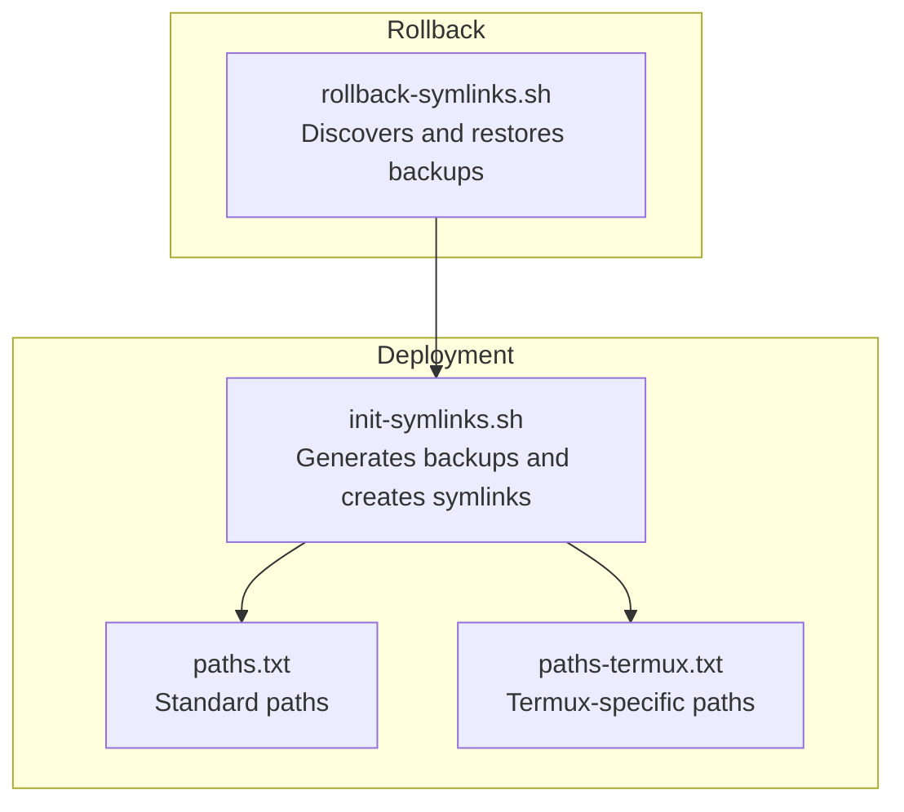
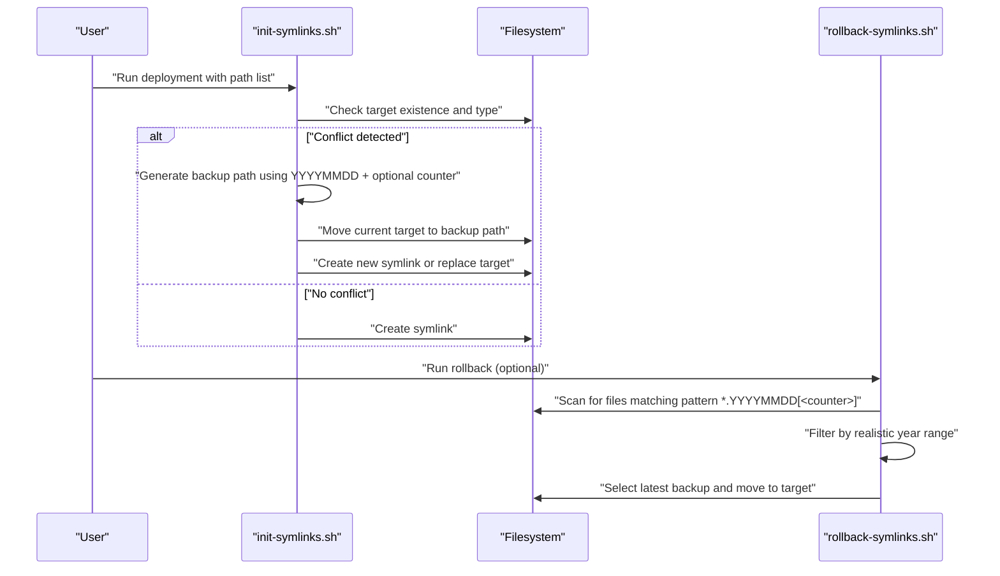
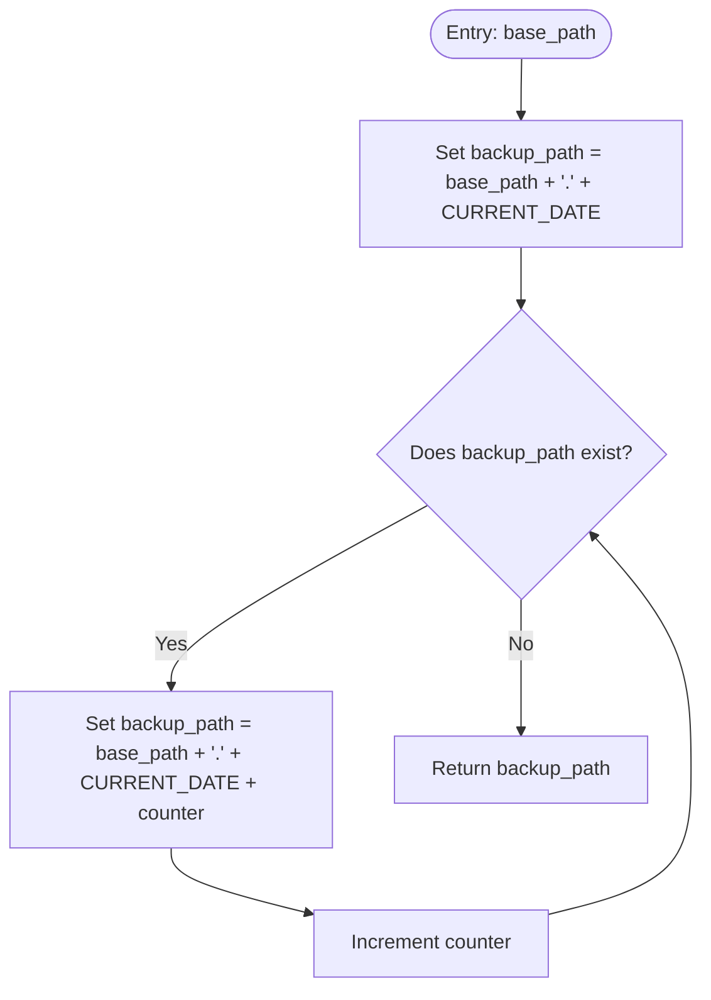
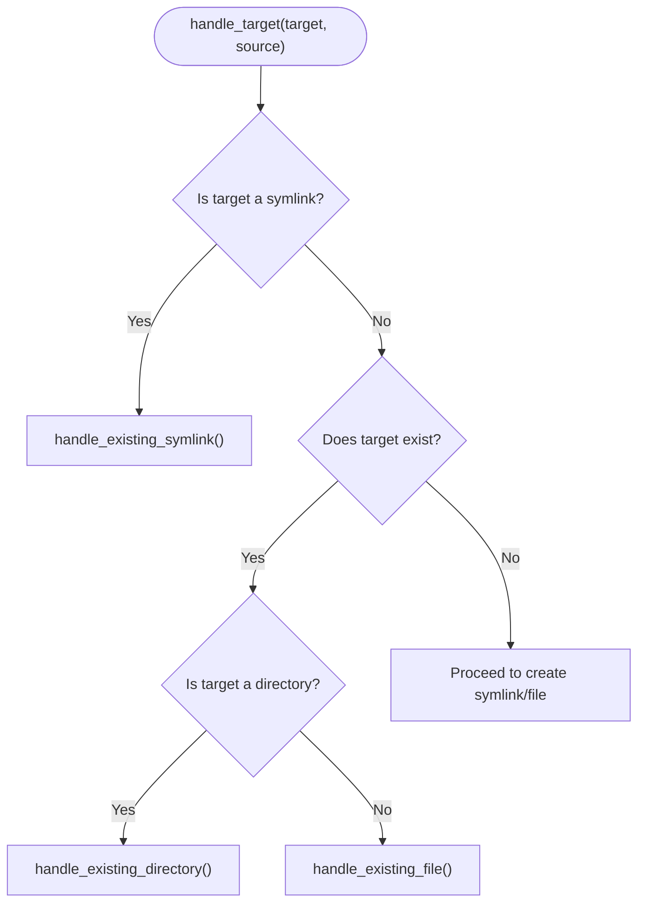
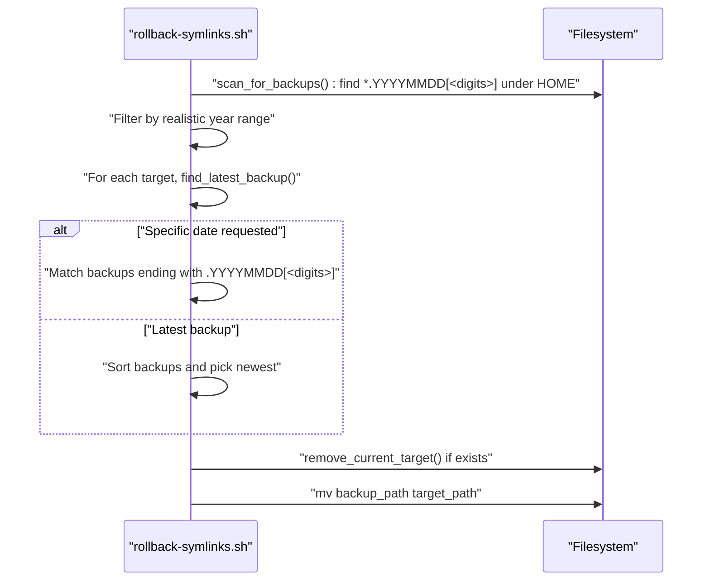

# Backup and Rollback Mechanisms

<cite>
**Referenced Files in This Document**
- [init-symlinks.sh](file://init-symlinks.sh)
- [rollback-symlinks.sh](file://rollback-symlinks.sh)
- [paths.txt](file://paths.txt)
- [paths-termux.txt](file://paths-termux.txt)
</cite>

## Table of Contents
1. [Introduction](#introduction)
2. [Project Structure](#project-structure)
3. [Core Components](#core-components)
4. [Architecture Overview](#architecture-overview)
5. [Detailed Component Analysis](#detailed-component-analysis)
6. [Dependency Analysis](#dependency-analysis)
7. [Performance Considerations](#performance-considerations)
8. [Troubleshooting Guide](#troubleshooting-guide)
9. [Conclusion](#conclusion)

## Introduction
This document explains the backup and rollback system architecture used by the dotfiles repository. It focuses on:
- How backup files are generated during deployment conflicts, including timestamp-based naming and collision handling
- Backup strategies for different file types (symlinks, directories, regular files)
- The automated backup process triggered by the deployment script
- The rollback mechanism provided by the dedicated rollback script, including its discovery and restoration logic
- Examples of backup naming patterns, restoration procedures, and emergency recovery scenarios
- Safety mechanisms designed to prevent accidental data loss

## Project Structure
The backup and rollback system spans two primary scripts and supporting path lists:
- Deployment and backup generator: init-symlinks.sh
- Rollback discovery and restoration: rollback-symlinks.sh
- Path lists defining which files to deploy: paths.txt and paths-termux.txt

**Diagram sources**
- [init-symlinks.sh](file://init-symlinks.sh#L1-L347)
- [rollback-symlinks.sh](file://rollback-symlinks.sh#L1-L316)
- [paths.txt](file://paths.txt#L1-L16)
- [paths-termux.txt](file://paths-termux.txt#L1-L12)

**Section sources**
- [init-symlinks.sh](file://init-symlinks.sh#L1-L347)
- [rollback-symlinks.sh](file://rollback-symlinks.sh#L1-L316)
- [paths.txt](file://paths.txt#L1-L16)
- [paths-termux.txt](file://paths-termux.txt#L1-L12)

## Core Components
- Backup generation during deployment:
  - Timestamp-based naming convention: base_path.YYYYMMDD
  - Collision handling via numeric suffixes: base_path.YYYYMMDD1, base_path.YYYYMMDD2, etc.
  - Triggered automatically when replacing existing targets (symlinks, files, or directories)
- Rollback discovery and restoration:
  - Scans the home directory for files ending with a date-like suffix
  - Filters candidates by validating the year falls within a realistic range
  - Selects the most recent backup by sorting and returns the appropriate backup path
  - Restores by moving the backup back to the target location, removing any current conflicting target first

Key implementation references:
- Backup generation: [generate_backup_path()](file://init-symlinks.sh#L22-L33)
- Backup-triggering conditions: [handle_existing_symlink()](file://init-symlinks.sh#L116-L148), [handle_existing_directory()](file://init-symlinks.sh#L150-L174), [handle_existing_file()](file://init-symlinks.sh#L176-L190)
- Rollback discovery: [find_latest_backup()](file://rollback-symlinks.sh#L39-L67), [scan_for_backups()](file://rollback-symlinks.sh#L69-L97)
- Rollback restoration: [restore_backup()](file://rollback-symlinks.sh#L115-L149)

**Section sources**
- [init-symlinks.sh](file://init-symlinks.sh#L22-L33)
- [init-symlinks.sh](file://init-symlinks.sh#L116-L190)
- [rollback-symlinks.sh](file://rollback-symlinks.sh#L39-L67)
- [rollback-symlinks.sh](file://rollback-symlinks.sh#L69-L97)
- [rollback-symlinks.sh](file://rollback-symlinks.sh#L115-L149)

## Architecture Overview
The system integrates deployment and rollback through predictable file naming and robust discovery logic.

**Diagram sources**
- [init-symlinks.sh](file://init-symlinks.sh#L116-L190)
- [init-symlinks.sh](file://init-symlinks.sh#L222-L244)
- [rollback-symlinks.sh](file://rollback-symlinks.sh#L39-L67)
- [rollback-symlinks.sh](file://rollback-symlinks.sh#L69-L97)
- [rollback-symlinks.sh](file://rollback-symlinks.sh#L115-L149)

## Detailed Component Analysis

### Backup Generation Algorithm: generate_backup_path()
Purpose:
- Produce a deterministic backup filename using today’s date and a collision-resistant suffix.

Behavior:
- Base name: original target path
- Suffix: dot + current date (YYYYMMDD)
- Collision handling: append a counter (1, 2, ...) until the path is unique

**Diagram sources**
- [init-symlinks.sh](file://init-symlinks.sh#L22-L33)

Safety and determinism:
- Uses a fixed date format ensuring lexicographic ordering aligns with chronological order.
- Ensures uniqueness per day by appending a counter.

Collision handling:
- Prevents overwriting existing backups on the same day.
- Supports multiple backups per day when conflicts occur repeatedly.

**Section sources**
- [init-symlinks.sh](file://init-symlinks.sh#L22-L33)

### Automated Backup During Deployment Conflicts
Trigger points:
- Existing symlink differs in target or is broken
- Existing target is a directory or regular file

Actions:
- Generate a backup path using the algorithm above
- Move the current target to the backup path
- Proceed to create the desired symlink or replace the target

**Diagram sources**
- [init-symlinks.sh](file://init-symlinks.sh#L192-L223)
- [init-symlinks.sh](file://init-symlinks.sh#L116-L190)

Backup-triggering functions:
- Symlink conflicts: [handle_existing_symlink()](file://init-symlinks.sh#L116-L148)
- Directory conflicts: [handle_existing_directory()](file://init-symlinks.sh#L150-L174)
- File conflicts: [handle_existing_file()](file://init-symlinks.sh#L176-L190)

**Section sources**
- [init-symlinks.sh](file://init-symlinks.sh#L116-L190)
- [init-symlinks.sh](file://init-symlinks.sh#L192-L223)

### Rollback Discovery and Restoration: rollback-symlinks.sh
Discovery:
- Scans the home directory for files matching the pattern *.YYYYMMDD[<digits>]
- Validates candidate year to be within a realistic range (e.g., 2000–2099)
- Deduplicates and sorts to identify targets requiring rollback

Restoration:
- Removes any current conflicting target (symlink or file/directory)
- Moves the selected backup back to the original target path
- Supports dry-run mode to preview changes

**Diagram sources**
- [rollback-symlinks.sh](file://rollback-symlinks.sh#L69-L97)
- [rollback-symlinks.sh](file://rollback-symlinks.sh#L39-L67)
- [rollback-symlinks.sh](file://rollback-symlinks.sh#L103-L149)

Key functions:
- Discovery: [scan_for_backups()](file://rollback-symlinks.sh#L69-L97)
- Latest selection: [find_latest_backup()](file://rollback-symlinks.sh#L39-L67)
- Removal of current target: [remove_current_target()](file://rollback-symlinks.sh#L103-L113)
- Restoration: [restore_backup()](file://rollback-symlinks.sh#L115-L149)

**Section sources**
- [rollback-symlinks.sh](file://rollback-symlinks.sh#L39-L67)
- [rollback-symlinks.sh](file://rollback-symlinks.sh#L69-L97)
- [rollback-symlinks.sh](file://rollback-symlinks.sh#L103-L149)

### Backup Naming Patterns and Examples
Naming convention:
- base_path.YYYYMMDD
- base_path.YYYYMMDD1
- base_path.YYYYMMDD2
- etc.

Examples derived from typical deployments:
- A conflict on 20250704 might produce:
  - ~/.bashrc.20250704
  - ~/.bashrc.202507041
  - ~/.bashrc.202507042
- A directory replacement on the same day could yield:
  - ~/.config/nvim.20250704
  - ~/.local/share/nvim.202507041

These patterns enable:
- Chronological sorting by filename
- Unambiguous identification of backups per day
- Automatic resolution of collisions via counters

**Section sources**
- [init-symlinks.sh](file://init-symlinks.sh#L22-L33)

### Restoration Procedures and Emergency Recovery
Procedure overview:
- Dry-run first: use the rollback script with the dry-run flag to preview changes
- Specific date rollback: select a particular YYYYMMDD to restore backups from that day
- Targeted rollback: restore a single path only
- Full rollback: restore all discovered backups after confirming

Emergency recovery steps:
- If a deployment caused unintended changes, run the rollback script in dry-run mode to review
- Confirm the intended backup date and target
- Execute the rollback to restore the previous state

Operational safeguards:
- Interactive confirmation for non-dry-run full rollbacks
- Validation that backups exist before attempting restoration
- Removal of current conflicting targets prior to restoration

**Section sources**
- [rollback-symlinks.sh](file://rollback-symlinks.sh#L246-L316)
- [rollback-symlinks.sh](file://rollback-symlinks.sh#L115-L149)

## Dependency Analysis
High-level dependencies:
- init-symlinks.sh depends on the filesystem state and path lists to decide when to back up
- rollback-symlinks.sh depends on the naming convention established by init-symlinks.sh to discover backups
- Both scripts operate within the user’s home directory and rely on standard Unix utilities

**Diagram sources**
- [paths.txt](file://paths.txt#L1-L16)
- [paths-termux.txt](file://paths-termux.txt#L1-L12)
- [init-symlinks.sh](file://init-symlinks.sh#L1-L347)
- [rollback-symlinks.sh](file://rollback-symlinks.sh#L1-L316)

**Section sources**
- [paths.txt](file://paths.txt#L1-L16)
- [paths-termux.txt](file://paths-termux.txt#L1-L12)
- [init-symlinks.sh](file://init-symlinks.sh#L1-L347)
- [rollback-symlinks.sh](file://rollback-symlinks.sh#L1-L316)

## Performance Considerations
- Backup generation is O(1) per conflict due to linear probing with a counter
- Rollback discovery scans the home directory with depth limits and filters by pattern and year, minimizing unnecessary work
- Sorting backups by name is efficient for small to moderate numbers of daily backups
- The system avoids heavy I/O by moving files rather than copying them during restoration

[No sources needed since this section provides general guidance]

## Troubleshooting Guide
Common issues and resolutions:
- No backup found for a target:
  - Verify the target existed and a conflict occurred during deployment
  - Confirm the naming convention matches the expected YYYYMMDD pattern
- Wrong backup selected:
  - Use the specific date option to target a particular YYYYMMDD
  - Use dry-run to preview and confirm the intended backup
- Permission errors:
  - Ensure write permissions to the target directory and the backup location
- Partial merges during directory conflicts:
  - Review merged contents post-deployment and adjust as needed

Safety checks:
- The rollback script validates backup existence before restoration
- Interactive confirmation prevents accidental full rollbacks
- Dry-run mode allows safe previews

**Section sources**
- [rollback-symlinks.sh](file://rollback-symlinks.sh#L115-L149)
- [rollback-symlinks.sh](file://rollback-symlinks.sh#L246-L316)

## Conclusion
The backup and rollback system combines a simple, deterministic naming scheme with robust discovery and restoration logic:
- Backups are generated automatically during deployment conflicts using a date-based suffix and collision handling
- Rollback leverages the same naming convention to locate and restore previous states safely
- Built-in safeguards (validation, dry-run, interactive confirmation) minimize risk and support emergency recovery

[No sources needed since this section summarizes without analyzing specific files]