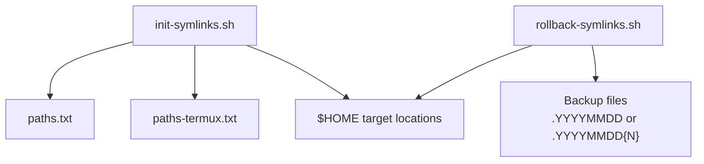
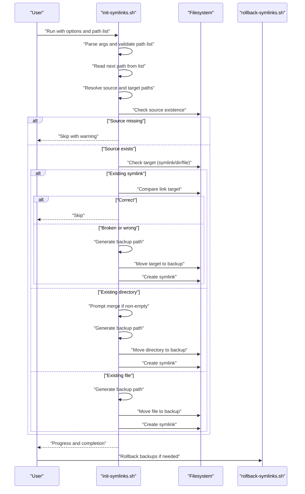
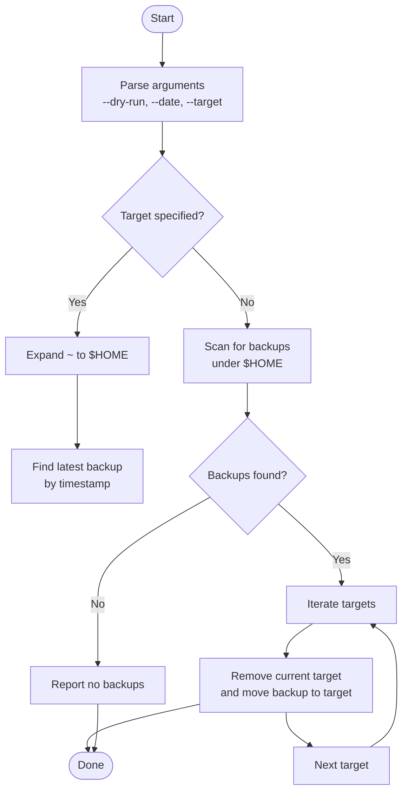
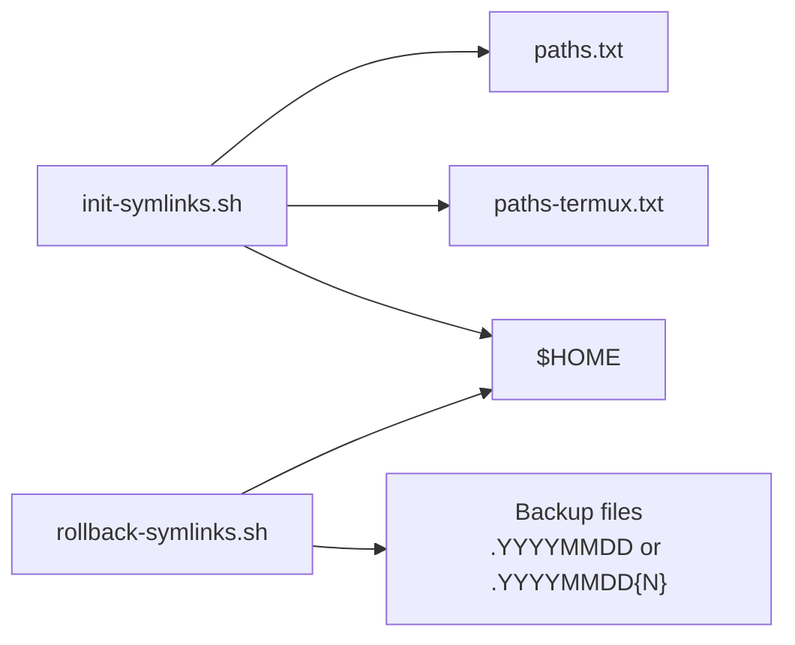

# Core Deployment Engine

<cite>
**Referenced Files in This Document**
- [init-symlinks.sh](file://init-symlinks.sh)
- [paths.txt](file://paths.txt)
- [paths-termux.txt](file://paths-termux.txt)
- [rollback-symlinks.sh](file://rollback-symlinks.sh)
- [README.md](file://README.md)
</cite>

## Table of Contents
1. [Introduction](#introduction)
2. [Project Structure](#project-structure)
3. [Core Components](#core-components)
4. [Architecture Overview](#architecture-overview)
5. [Detailed Component Analysis](#detailed-component-analysis)
6. [Dependency Analysis](#dependency-analysis)
7. [Performance Considerations](#performance-considerations)
8. [Troubleshooting Guide](#troubleshooting-guide)
9. [Conclusion](#conclusion)

## Introduction
This document describes the core deployment engine centered around the main symlink initialization script. It explains the execution flow, argument parsing, processing pipeline, helper functions, and the orchestration of symlink creation with robust backup and rollback capabilities. The system supports both interactive and batch modes, safely handles existing targets, merges directories when appropriate, and provides a companion rollback utility to restore previous states.

## Project Structure
The deployment engine consists of:
- A primary symlink initialization script that reads a path list and creates symlinks
- A path list file that enumerates the dotfiles and directories to symlink
- A companion rollback script that restores backed-up targets
- Optional platform-specific path lists (e.g., Termux)

**Diagram sources**
- [init-symlinks.sh](file://init-symlinks.sh#L312-L346)
- [paths.txt](file://paths.txt#L1-L16)
- [paths-termux.txt](file://paths-termux.txt#L1-L12)
- [rollback-symlinks.sh](file://rollback-symlinks.sh#L246-L315)

**Section sources**
- [init-symlinks.sh](file://init-symlinks.sh#L1-L347)
- [paths.txt](file://paths.txt#L1-L16)
- [paths-termux.txt](file://paths-termux.txt#L1-L12)
- [rollback-symlinks.sh](file://rollback-symlinks.sh#L1-L316)
- [README.md](file://README.md#L1-L35)

## Core Components
- Argument parsing and initialization
- Path list processing loop
- Path resolution (source and target)
- Conflict handling (existing symlink, directory, file)
- Symlink creation with backup
- Helper utilities (usage, backup path generation, prompts, directory merging)
- Rollback subsystem for restoration

**Section sources**
- [init-symlinks.sh](file://init-symlinks.sh#L312-L346)
- [init-symlinks.sh](file://init-symlinks.sh#L250-L294)
- [init-symlinks.sh](file://init-symlinks.sh#L91-L110)
- [init-symlinks.sh](file://init-symlinks.sh#L116-L244)
- [init-symlinks.sh](file://init-symlinks.sh#L14-L80)
- [rollback-symlinks.sh](file://rollback-symlinks.sh#L246-L315)

## Architecture Overview
The engine orchestrates symlink creation by:
1. Parsing command-line arguments to set operational mode
2. Loading a path list file line-by-line
3. Resolving each path into a source and target location
4. Validating the existence of the source
5. Handling conflicts with existing targets (symlink, directory, file)
6. Creating backups and symlinks as needed
7. Reporting progress and completion

**Diagram sources**
- [init-symlinks.sh](file://init-symlinks.sh#L312-L346)
- [init-symlinks.sh](file://init-symlinks.sh#L250-L294)
- [init-symlinks.sh](file://init-symlinks.sh#L91-L110)
- [init-symlinks.sh](file://init-symlinks.sh#L116-L244)
- [rollback-symlinks.sh](file://rollback-symlinks.sh#L246-L315)

## Detailed Component Analysis

### Argument Parsing and Initialization
- Parses options: --no-verify (batch mode), -h/--help
- Validates presence and readability of the path list file
- Prints a header summarizing mode and date used for backups

Key behaviors:
- Batch mode disables interactive prompts
- Unknown options trigger usage and exit
- Missing or invalid path list triggers usage and exit

**Section sources**
- [init-symlinks.sh](file://init-symlinks.sh#L312-L346)

### Path List Processing Loop
- Reads the path list line-by-line
- Trims whitespace and ignores empty lines and comments
- Processes each path through the core pipeline

Operational notes:
- Comments start with a hash character
- Blank lines are skipped

**Section sources**
- [init-symlinks.sh](file://init-symlinks.sh#L288-L294)
- [init-symlinks.sh](file://init-symlinks.sh#L250-L286)

### Path Resolution
- Source path resolution: resolves each path relative to the script’s directory and normalizes trailing slashes
- Target path resolution: maps to $HOME, with special handling for termux-config/ entries

Platform-specific behavior:
- termux-config/ entries are stripped of their prefix and mapped under $HOME

Normalization:
- Removes trailing slashes for consistent comparisons

**Section sources**
- [init-symlinks.sh](file://init-symlinks.sh#L91-L110)
- [init-symlinks.sh](file://init-symlinks.sh#L82-L85)

### Conflict Handling and Symlink Creation
The system distinguishes three conflict scenarios and responds accordingly:

1) Existing symlink
- If pointing to the correct absolute source path: skip
- If broken: back up and replace
- If pointing elsewhere: prompt to replace; back up and replace

2) Existing directory
- If non-empty: prompt to merge existing contents into the source directory
- Prompt to replace directory with symlink; back up and replace

3) Existing file
- Prompt to replace with symlink; back up and replace

Creation:
- Ensures parent directories exist
- Creates the symlink atomically

Backup naming:
- Uses a date-based suffix (.YYYYMMDD) with optional numeric counter for collisions

**Section sources**
- [init-symlinks.sh](file://init-symlinks.sh#L116-L244)
- [init-symlinks.sh](file://init-symlinks.sh#L225-L244)

### Helper Function Ecosystem
- usage(): prints usage and exits
- generate_backup_path(): constructs a unique backup path using current date and optional counter
- prompt_yes_no(): interactive prompt respecting batch mode; returns success/failure
- merge_directories(): copies directory contents (including hidden files) from source to target using shell globbing options

Implementation highlights:
- Batch mode bypasses prompts and assumes “yes”
- Merge preserves existing target contents while prioritizing source contents
- Hidden files are included via shell options

**Section sources**
- [init-symlinks.sh](file://init-symlinks.sh#L14-L80)

### Execution Modes: Interactive vs Batch
- Interactive mode (default): prompts for every decision; allows merging and replacement
- Batch mode (--no-verify): skips prompts; merges and replaces automatically

Practical impact:
- Batch mode is suitable for automated environments or CI
- Interactive mode is safer for manual runs

**Section sources**
- [init-symlinks.sh](file://init-symlinks.sh#L312-L346)
- [init-symlinks.sh](file://init-symlinks.sh#L35-L57)

### Practical Examples
- Running with a path list: the script reads entries from the specified file and processes each line
- Platform-specific entries: termux-config/ entries are handled specially to map under $HOME
- Merging directories: when a target directory is non-empty, the system can merge existing files into the source prior to symlinking

**Section sources**
- [paths.txt](file://paths.txt#L1-L16)
- [paths-termux.txt](file://paths-termux.txt#L1-L12)
- [init-symlinks.sh](file://init-symlinks.sh#L150-L174)

### Error Handling Mechanisms
- Validation failures: usage messages and early exits
- Missing sources: warnings and skipping of the entry
- Symlink creation failures: explicit failure reporting
- Backup collisions: automatic counter-based suffixing
- Rollback safety: dry-run support and confirmation prompts for destructive operations

**Section sources**
- [init-symlinks.sh](file://init-symlinks.sh#L336-L346)
- [init-symlinks.sh](file://init-symlinks.sh#L264-L269)
- [init-symlinks.sh](file://init-symlinks.sh#L236-L243)
- [init-symlinks.sh](file://init-symlinks.sh#L22-L33)
- [rollback-symlinks.sh](file://rollback-symlinks.sh#L292-L307)

### Rollback Subsystem
The companion script discovers backups and restores them:
- Scans $HOME for files/directories with date-based suffixes
- Supports dry-run previews
- Allows targeting a specific path or rolling back all backups
- Validates backups and removes current targets before restoration

**Diagram sources**
- [rollback-symlinks.sh](file://rollback-symlinks.sh#L246-L315)
- [rollback-symlinks.sh](file://rollback-symlinks.sh#L69-L97)
- [rollback-symlinks.sh](file://rollback-symlinks.sh#L155-L209)

**Section sources**
- [rollback-symlinks.sh](file://rollback-symlinks.sh#L1-L316)

## Dependency Analysis
The symlink engine depends on:
- Bash built-ins and POSIX utilities (readlink, ln, mkdir, find, ls)
- Shell globbing options for directory merging
- Filesystem layout and permissions

**Diagram sources**
- [init-symlinks.sh](file://init-symlinks.sh#L312-L346)
- [paths.txt](file://paths.txt#L1-L16)
- [paths-termux.txt](file://paths-termux.txt#L1-L12)
- [rollback-symlinks.sh](file://rollback-symlinks.sh#L69-L97)

**Section sources**
- [init-symlinks.sh](file://init-symlinks.sh#L1-L347)
- [rollback-symlinks.sh](file://rollback-symlinks.sh#L1-L316)

## Performance Considerations
- Directory merging uses shell globbing; for very large directories, consider limiting recursion or using rsync-like strategies
- Backup naming avoids collisions by appending counters; ensure sufficient disk space
- Batch mode reduces I/O overhead by eliminating interactive prompts
- The rollback scanner limits search depth to reduce scanning cost

## Troubleshooting Guide
Common issues and resolutions:
- Unknown option: re-run with supported flags; see usage
- Missing path list: provide a valid file path
- Source not found: verify the path list entries and repository layout
- Permission denied: ensure write access to target locations and script execution privileges
- Conflicts with existing symlinks: review prompts or run in batch mode to auto-proceed
- Rollback failures: confirm backup existence and filesystem permissions

**Section sources**
- [init-symlinks.sh](file://init-symlinks.sh#L322-L337)
- [init-symlinks.sh](file://init-symlinks.sh#L264-L269)
- [rollback-symlinks.sh](file://rollback-symlinks.sh#L119-L148)

## Conclusion
The core deployment engine provides a robust, modular approach to managing dotfiles through symlinks. Its separation of concerns—argument parsing, path resolution, conflict handling, symlink creation, and backup/rollback—enables safe, repeatable deployments across platforms. Interactive and batch modes accommodate diverse operational contexts, while the rollback subsystem ensures recoverability.