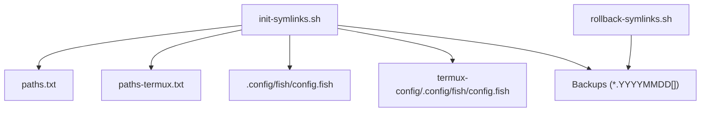
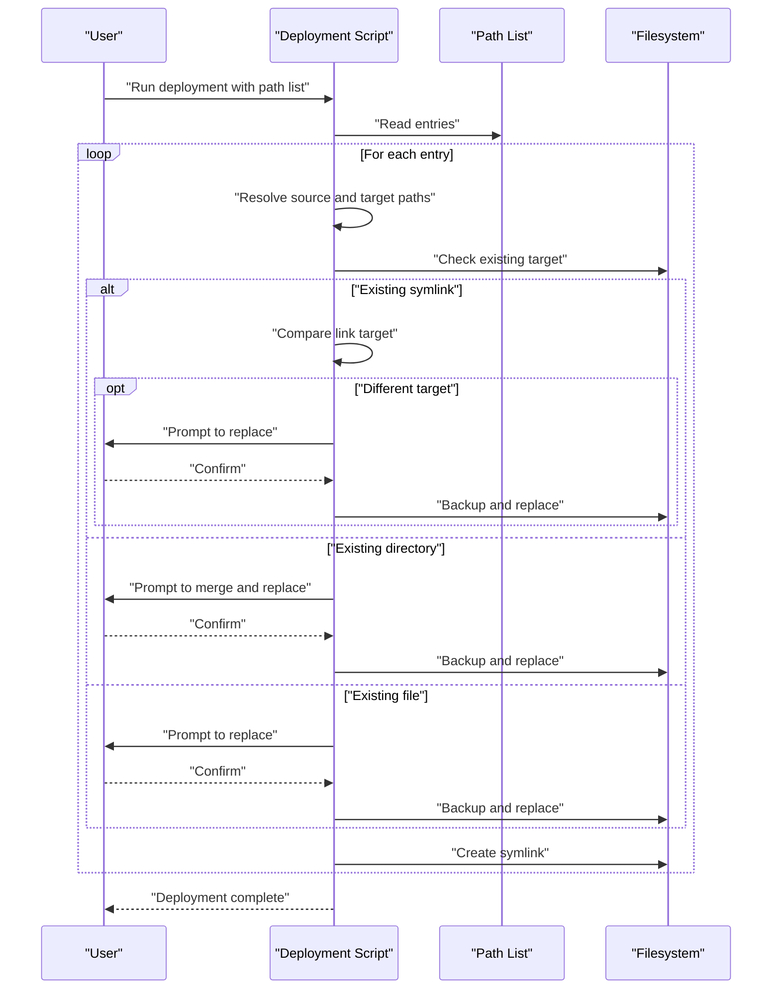
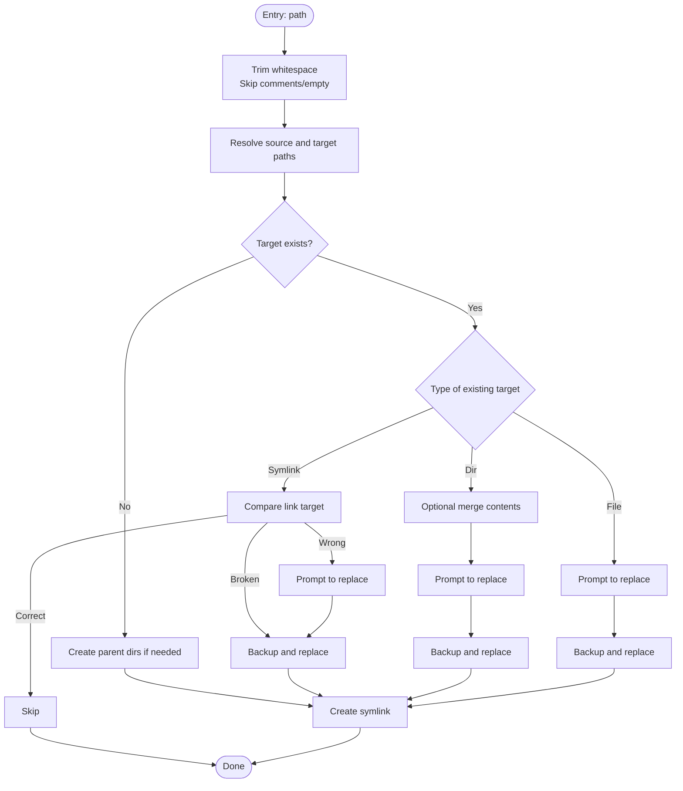
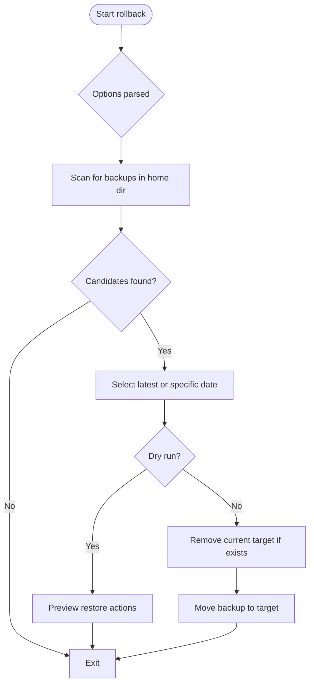
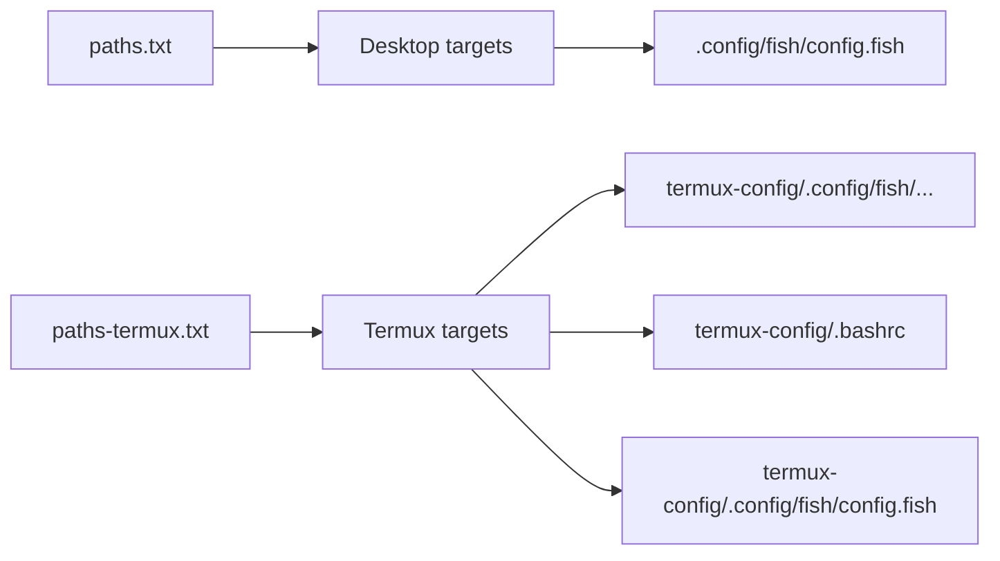
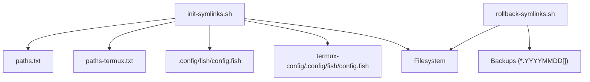

# Deployment System

<cite>
**Referenced Files in This Document**
- [init-symlinks.sh](file://init-symlinks.sh)
- [rollback-symlinks.sh](file://rollback-symlinks.sh)
- [paths.txt](file://paths.txt)
- [paths-termux.txt](file://paths-termux.txt)
- [.config/fish/config.fish](file://.config/fish/config.fish)
- [termux-config/.config/fish/config.fish](file://termux-config/.config/fish/config.fish)
- [README.md](file://README.md)
</cite>

## Table of Contents
1. [Introduction](#introduction)
2. [Project Structure](#project-structure)
3. [Core Components](#core-components)
4. [Architecture Overview](#architecture-overview)
5. [Detailed Component Analysis](#detailed-component-analysis)
6. [Dependency Analysis](#dependency-analysis)
7. [Performance Considerations](#performance-considerations)
8. [Troubleshooting Guide](#troubleshooting-guide)
9. [Conclusion](#conclusion)
10. [Appendices](#appendices)

## Introduction
This document describes the deployment system architecture centered on symlink-based configuration management. It explains how the deployment engine creates and validates symlinks, how backups are generated and used for rollbacks, and how the system supports both desktop and mobile (Termux) environments. It also covers path resolution, conflict detection and handling, interactive prompts, and environment-specific differences.

## Project Structure
The deployment system consists of:
- A primary deployment script that reads a path list and creates symlinks
- A rollback script that discovers backups and restores them
- Two path lists: one for desktop and one for Termux
- Environment-specific configuration files under desktop and Termux directories

**Diagram sources**
- [init-symlinks.sh](file://init-symlinks.sh#L288-L346)
- [paths.txt](file://paths.txt#L1-L16)
- [paths-termux.txt](file://paths-termux.txt#L1-L12)
- [.config/fish/config.fish](file://.config/fish/config.fish#L1-L168)
- [termux-config/.config/fish/config.fish](file://termux-config/.config/fish/config.fish#L1-L184)
- [rollback-symlinks.sh](file://rollback-symlinks.sh#L69-L97)

**Section sources**
- [README.md](file://README.md#L7-L14)
- [paths.txt](file://paths.txt#L1-L16)
- [paths-termux.txt](file://paths-termux.txt#L1-L12)

## Core Components
- Deployment engine: parses path lists, resolves source and target paths, handles conflicts, and creates symlinks with backups
- Rollback engine: discovers backups, optionally filters by date or target, and restores them
- Path lists: define which files/directories to deploy and where to place them
- Environment configs: desktop and Termux-specific Fish configuration files

Key responsibilities:
- Path resolution: map relative entries to absolute source and target locations
- Conflict detection: detect existing symlinks, directories, and files; decide whether to merge, replace, or skip
- Backup generation: create dated backups with collision avoidance
- Interactive prompts: confirm risky operations unless running in batch mode
- Rollback discovery: scan for backups and restore the latest or a specific dated backup

**Section sources**
- [init-symlinks.sh](file://init-symlinks.sh#L91-L110)
- [init-symlinks.sh](file://init-symlinks.sh#L116-L223)
- [init-symlinks.sh](file://init-symlinks.sh#L225-L244)
- [rollback-symlinks.sh](file://rollback-symlinks.sh#L39-L97)
- [rollback-symlinks.sh](file://rollback-symlinks.sh#L115-L149)

## Architecture Overview
The deployment pipeline reads a path list, resolves each entry, checks for conflicts, backs up existing targets when needed, and creates symlinks. Rollback scans for backups and restores them selectively or en masse.

**Diagram sources**
- [init-symlinks.sh](file://init-symlinks.sh#L288-L346)
- [init-symlinks.sh](file://init-symlinks.sh#L250-L286)
- [init-symlinks.sh](file://init-symlinks.sh#L192-L223)
- [init-symlinks.sh](file://init-symlinks.sh#L225-L244)

## Detailed Component Analysis

### Deployment Engine: init-symlinks.sh
Responsibilities:
- Parse CLI options and path list file
- Normalize and resolve source/target paths
- Detect and resolve conflicts with existing targets
- Generate backups and create symlinks
- Provide batch mode to skip prompts

Path resolution:
- Source path: derived from script directory plus path entry
- Target path: derived from HOME plus path entry; special handling for Termux entries by stripping a prefix

Conflict handling:
- Existing correct symlink: skip
- Broken symlink: backup and replace
- Wrong-target symlink: prompt to replace; backup and replace if confirmed
- Existing directory: optional merge of contents into source, then prompt to replace with symlink
- Existing file: prompt to replace with symlink

Backup generation:
- Uses current date and optional counter suffix to avoid collisions

Interactive prompts:
- Controlled by a global flag enabling batch mode
- Prompts appear for merges, replacements, and directory-to-symlink transitions

**Diagram sources**
- [init-symlinks.sh](file://init-symlinks.sh#L250-L286)
- [init-symlinks.sh](file://init-symlinks.sh#L91-L110)
- [init-symlinks.sh](file://init-symlinks.sh#L116-L223)
- [init-symlinks.sh](file://init-symlinks.sh#L225-L244)

**Section sources**
- [init-symlinks.sh](file://init-symlinks.sh#L14-L57)
- [init-symlinks.sh](file://init-symlinks.sh#L22-L33)
- [init-symlinks.sh](file://init-symlinks.sh#L35-L57)
- [init-symlinks.sh](file://init-symlinks.sh#L59-L80)
- [init-symlinks.sh](file://init-symlinks.sh#L82-L85)
- [init-symlinks.sh](file://init-symlinks.sh#L91-L110)
- [init-symlinks.sh](file://init-symlinks.sh#L116-L223)
- [init-symlinks.sh](file://init-symlinks.sh#L225-L244)
- [init-symlinks.sh](file://init-symlinks.sh#L250-L286)
- [init-symlinks.sh](file://init-symlinks.sh#L288-L346)

### Rollback Engine: rollback-symlinks.sh
Responsibilities:
- Discover backups by scanning the home directory for dated suffixes
- Optionally filter by a specific date or target
- Perform dry runs to preview changes
- Remove current target (symlink or file/directory) and restore the backup

Backup discovery:
- Scans recursively up to a depth limit for files/directories/symlinks with a trailing date-like suffix
- Validates candidate backups by extracting the original path and ensuring a reasonable year
- Deduplicates and sorts candidates

Restore process:
- Removes current target if present
- Moves the selected backup to the target path

**Diagram sources**
- [rollback-symlinks.sh](file://rollback-symlinks.sh#L69-L97)
- [rollback-symlinks.sh](file://rollback-symlinks.sh#L115-L149)
- [rollback-symlinks.sh](file://rollback-symlinks.sh#L155-L171)
- [rollback-symlinks.sh](file://rollback-symlinks.sh#L173-L209)

**Section sources**
- [rollback-symlinks.sh](file://rollback-symlinks.sh#L12-L28)
- [rollback-symlinks.sh](file://rollback-symlinks.sh#L30-L33)
- [rollback-symlinks.sh](file://rollback-symlinks.sh#L39-L67)
- [rollback-symlinks.sh](file://rollback-symlinks.sh#L69-L97)
- [rollback-symlinks.sh](file://rollback-symlinks.sh#L103-L113)
- [rollback-symlinks.sh](file://rollback-symlinks.sh#L115-L149)
- [rollback-symlinks.sh](file://rollback-symlinks.sh#L155-L171)
- [rollback-symlinks.sh](file://rollback-symlinks.sh#L173-L209)
- [rollback-symlinks.sh](file://rollback-symlinks.sh#L246-L312)

### Path Lists and Environment-Specific Configurations
- Desktop path list defines standard dotfiles and directories to symlink under the home directory
- Termux path list mirrors desktop entries but also includes a special prefix for Termux-specific configuration
- Desktop and Termux share the same Fish configuration structure, but Termux adds device-specific logic and environment variables

**Diagram sources**
- [paths.txt](file://paths.txt#L1-L16)
- [paths-termux.txt](file://paths-termux.txt#L1-L12)
- [.config/fish/config.fish](file://.config/fish/config.fish#L1-L168)
- [termux-config/.config/fish/config.fish](file://termux-config/.config/fish/config.fish#L1-L184)

**Section sources**
- [paths.txt](file://paths.txt#L1-L16)
- [paths-termux.txt](file://paths-termux.txt#L1-L12)
- [.config/fish/config.fish](file://.config/fish/config.fish#L112-L167)
- [termux-config/.config/fish/config.fish](file://termux-config/.config/fish/config.fish#L127-L183)

## Dependency Analysis
The deployment and rollback scripts depend on:
- POSIX-compliant shell features and utilities (readlink, ln, find, sort, mv, cp)
- The presence of path list files
- Correctly structured environment configuration files

**Diagram sources**
- [init-symlinks.sh](file://init-symlinks.sh#L288-L346)
- [rollback-symlinks.sh](file://rollback-symlinks.sh#L69-L97)
- [paths.txt](file://paths.txt#L1-L16)
- [paths-termux.txt](file://paths-termux.txt#L1-L12)

**Section sources**
- [init-symlinks.sh](file://init-symlinks.sh#L288-L346)
- [rollback-symlinks.sh](file://rollback-symlinks.sh#L69-L97)

## Performance Considerations
- Directory merging uses recursive copy with hidden-file inclusion; ensure source directories are not excessively large to avoid long copy times
- Backup naming uses date plus optional counter; collisions are rare but possible on very busy systems
- Rollback scanning limits depth to reduce filesystem traversal overhead
- Batch mode avoids interactive prompts, reducing total runtime for automated deployments

## Troubleshooting Guide
Common issues and resolutions:
- Source path missing: the deployment engine warns and skips entries that do not exist; verify path list entries and repository contents
- Permission errors when creating symlinks or moving targets: ensure write permissions in target directories and appropriate privileges for system-wide locations
- Conflicts with non-empty directories: the engine offers to merge existing contents into the source before replacing; confirm merges carefully
- Broken symlinks: detected and backed up automatically; choose to replace with correct symlink during prompts
- Rollback failures: verify backups exist and are readable; use dry-run mode to preview changes before applying

Practical examples:
- Deploy desktop configuration: run the deployment script with the desktop path list; confirm prompts if not in batch mode
- Deploy Termux configuration: run the deployment script with the Termux path list; note the special prefix handling for Termux entries
- Rollback a single target: use the rollback script with a specific target path; optionally restrict to a specific date
- Dry-run rollback: preview all restoration actions without modifying the filesystem

Best practices:
- Keep path lists minimal and environment-specific
- Use batch mode for reproducible, automated deployments
- Periodically review and prune old backups
- Test rollback procedures before relying on them

**Section sources**
- [init-symlinks.sh](file://init-symlinks.sh#L264-L269)
- [init-symlinks.sh](file://init-symlinks.sh#L150-L174)
- [rollback-symlinks.sh](file://rollback-symlinks.sh#L173-L209)
- [rollback-symlinks.sh](file://rollback-symlinks.sh#L286-L309)

## Conclusion
The deployment system provides a robust, interactive, and safe mechanism for managing configuration files via symlinks. It supports both desktop and mobile environments, generates reliable backups, and offers flexible rollback capabilities. By following the documented workflows and best practices, users can maintain consistent configurations across diverse environments with confidence.

## Appendices

### Appendix A: Desktop vs Mobile Deployment Paths
- Desktop: standard entries under the home directory
- Mobile (Termux): entries prefixed for Termux-specific configuration, with additional environment variables and device-aware logic

**Section sources**
- [paths.txt](file://paths.txt#L1-L16)
- [paths-termux.txt](file://paths-termux.txt#L1-L12)
- [termux-config/.config/fish/config.fish](file://termux-config/.config/fish/config.fish#L32-L38)
- [termux-config/.config/fish/config.fish](file://termux-config/.config/fish/config.fish#L140-L152)