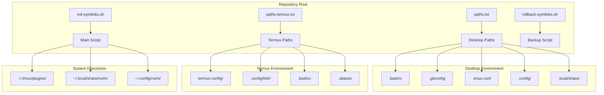
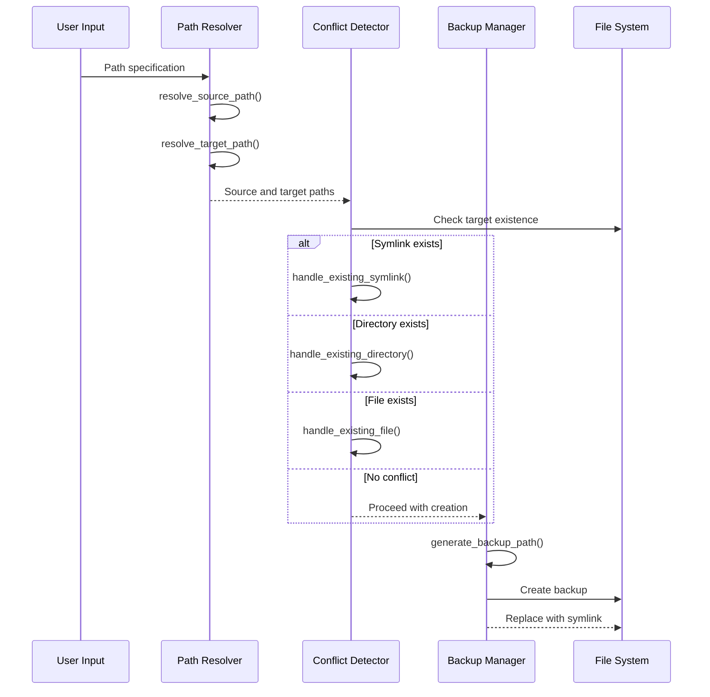
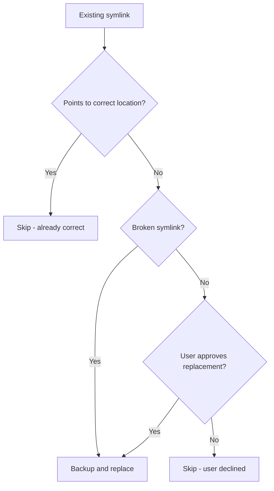
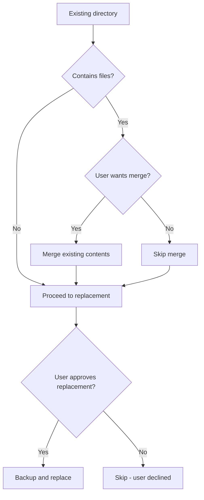
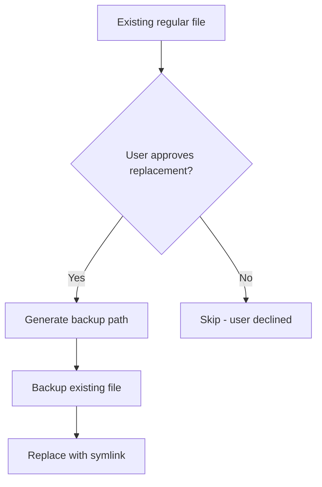
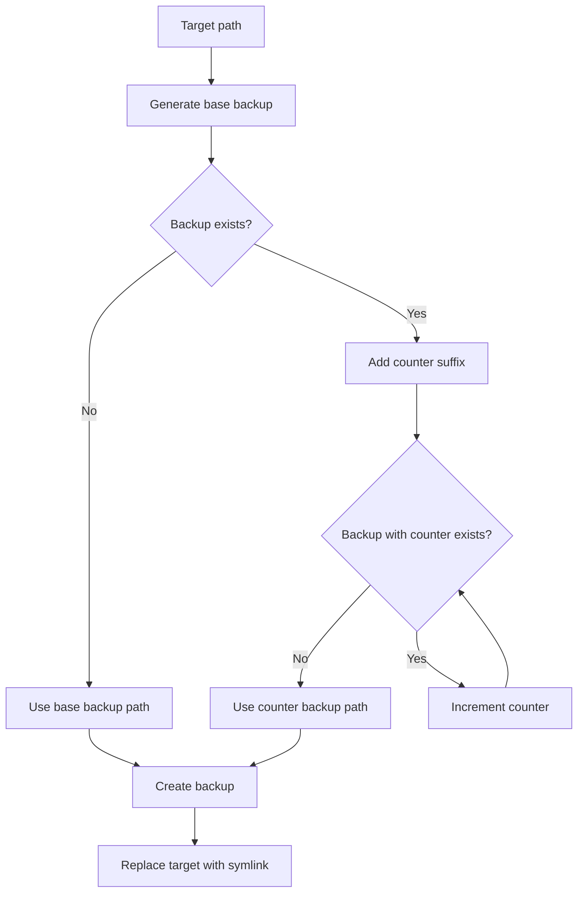
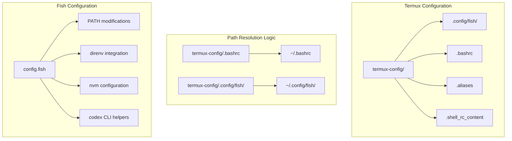
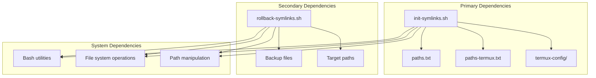

# Path Resolution and Conflict Handling

<cite>
**Referenced Files in This Document**
- [init-symlinks.sh](file://init-symlinks.sh)
- [rollback-symlinks.sh](file://rollback-symlinks.sh)
- [paths.txt](file://paths.txt)
- [paths-termux.txt](file://paths-termux.txt)
- [termux-config/.config/fish/config.fish](file://termux-config/.config/fish/config.fish)
</cite>

## Table of Contents
1. [Introduction](#introduction)
2. [Project Structure](#project-structure)
3. [Core Components](#core-components)
4. [Architecture Overview](#architecture-overview)
5. [Detailed Component Analysis](#detailed-component-analysis)
6. [Dependency Analysis](#dependency-analysis)
7. [Performance Considerations](#performance-considerations)
8. [Troubleshooting Guide](#troubleshooting-guide)
9. [Conclusion](#conclusion)

## Introduction

This document provides comprehensive coverage of the path resolution and conflict handling subsystem used in the dotfiles management system. The subsystem consists of two primary scripts: `init-symlinks.sh` for creating and managing symbolic links, and `rollback-symlinks.sh` for restoring backed-up configurations. The system handles both desktop and mobile environments, with special support for Termux deployments through dedicated path lists and configuration handling.

The path resolution algorithms differentiate between desktop and mobile environments by using separate path configuration files and applying platform-specific logic during target path construction. The conflict detection system provides robust handling for existing symlinks, directories, and files, with intelligent backup generation and user interaction patterns.

## Project Structure

The dotfiles repository organizes configuration files across multiple environments and platforms:



**Diagram sources**
- [paths.txt](file://paths.txt#L1-L16)
- [paths-termux.txt](file://paths-termux.txt#L1-L12)
- [init-symlinks.sh](file://init-symlinks.sh#L1-L347)

**Section sources**
- [paths.txt](file://paths.txt#L1-L16)
- [paths-termux.txt](file://paths-termux.txt#L1-L12)
- [init-symlinks.sh](file://init-symlinks.sh#L1-L347)

## Core Components

The path resolution and conflict handling subsystem comprises several key components that work together to manage dotfile synchronization across different environments:

### Path Resolution Engine

The path resolution system operates through two primary functions that transform relative path specifications into absolute source and target locations:

- **Source Path Resolution**: Converts relative paths to absolute repository locations
- **Target Path Resolution**: Transforms relative paths to absolute home directory locations with platform differentiation

### Conflict Detection System

The conflict handling system provides three specialized handlers for different file types:

- **Symlink Handler**: Manages existing symbolic links with correctness verification
- **Directory Handler**: Handles existing directories with merge capabilities
- **File Handler**: Manages existing regular files with replacement options

### Backup Management System

The backup system generates timestamped backups with collision avoidance and supports selective restoration through the rollback script.

**Section sources**
- [init-symlinks.sh](file://init-symlinks.sh#L82-L244)
- [rollback-symlinks.sh](file://rollback-symlinks.sh#L39-L149)

## Architecture Overview

The path resolution and conflict handling system follows a structured architecture that separates concerns between path resolution, conflict detection, and backup management:



**Diagram sources**
- [init-symlinks.sh](file://init-symlinks.sh#L91-L110)
- [init-symlinks.sh](file://init-symlinks.sh#L116-L223)
- [init-symlinks.sh](file://init-symlinks.sh#L225-L244)

The architecture ensures that path resolution occurs before conflict detection, and backup management is integrated throughout the process to prevent data loss.

## Detailed Component Analysis

### Path Resolution Algorithms

#### Desktop vs Mobile Differentiation

The system implements platform-specific path resolution through conditional logic in the target path resolver:

```mermaid
flowchart TD
A[Input Path] --> B{Starts with "termux-config/"?}
B --> |Yes| C[Remove "termux-config/" prefix]
B --> |No| D[Use path as-is]
C --> E[Normalize path]
D --> E
E --> F[Prepend $HOME]
F --> G[Output target path]
subgraph "Desktop Path Resolution"
H[.bashrc] --> I[~/bashrc]
J[.config/nvim/] --> K[~/.config/nvim/]
end
subgraph "Mobile Path Resolution"
L[termux-config/.bashrc] --> M[~/.bashrc]
N[termux-config/.config/fish/] --> O[~/.config/fish/]
end
```

**Diagram sources**
- [init-symlinks.sh](file://init-symlinks.sh#L97-L110)
- [paths-termux.txt](file://paths-termux.txt#L10-L12)

The desktop resolution uses standard path prefixes, while mobile resolution strips the `termux-config/` prefix before applying home directory expansion.

#### Path Normalization Logic

Both source and target path resolution employ normalization to ensure consistent path handling:

- Removes trailing slashes from path segments
- Ensures proper directory separators
- Maintains relative path semantics

**Section sources**
- [init-symlinks.sh](file://init-symlinks.sh#L82-L95)
- [init-symlinks.sh](file://init-symlinks.sh#L97-L110)

### Conflict Detection System

#### Symlink Conflict Resolution

The symlink handler performs three-way comparison to determine appropriate action:



**Diagram sources**
- [init-symlinks.sh](file://init-symlinks.sh#L116-L148)

The handler checks the actual target of the symlink using `readlink -f` for absolute path resolution, enabling accurate comparison with the intended source location.

#### Directory Conflict Resolution

Directory handling includes intelligent merging capabilities:



**Diagram sources**
- [init-symlinks.sh](file://init-symlinks.sh#L150-L174)

The merge operation preserves existing user data while incorporating new dotfile configurations, prioritizing repository contents during conflicts.

#### File Conflict Resolution

Regular file handling follows a straightforward replacement model:



**Diagram sources**
- [init-symlinks.sh](file://init-symlinks.sh#L176-L190)

**Section sources**
- [init-symlinks.sh](file://init-symlinks.sh#L116-L190)

### Backup Generation Strategies

The backup system implements collision-avoiding timestamped backups:



**Diagram sources**
- [init-symlinks.sh](file://init-symlinks.sh#L22-L33)

The backup naming convention uses the current date (`YYYYMMDD`) with optional numeric suffixes to handle multiple backups of the same file on the same day.

### User Interaction Patterns

The system implements flexible user interaction modes:

- **Interactive Mode**: Prompts user for all decisions
- **Batch Mode**: Automatic approval via `--no-verify` flag
- **Conditional Prompts**: Context-aware questions based on conflict type

**Section sources**
- [init-symlinks.sh](file://init-symlinks.sh#L35-L57)
- [init-symlinks.sh](file://init-symlinks.sh#L192-L223)

### Platform-Specific Path Handling for Termux

The Termux deployment includes specialized configuration handling:



**Diagram sources**
- [paths-termux.txt](file://paths-termux.txt#L10-L12)
- [termux-config/.config/fish/config.fish](file://termux-config/.config/fish/config.fish#L127-L183)

The Termux configuration includes environment-specific PATH modifications, service integrations, and development tool configurations optimized for mobile deployment.

**Section sources**
- [paths-termux.txt](file://paths-termux.txt#L1-L12)
- [termux-config/.config/fish/config.fish](file://termux-config/.config/fish/config.fish#L127-L183)

## Dependency Analysis

The path resolution and conflict handling subsystem exhibits well-structured dependencies:



**Diagram sources**
- [init-symlinks.sh](file://init-symlinks.sh#L1-L347)
- [rollback-symlinks.sh](file://rollback-symlinks.sh#L1-L316)

The system maintains loose coupling between path resolution and conflict handling, allowing independent modification of either component without affecting the other.

**Section sources**
- [init-symlinks.sh](file://init-symlinks.sh#L1-L347)
- [rollback-symlinks.sh](file://rollback-symlinks.sh#L1-L316)

## Performance Considerations

The path resolution and conflict handling system is designed for efficiency and reliability:

- **Minimal File System Operations**: Path resolution avoids unnecessary file system queries
- **Batch Processing**: Single-pass processing of path lists reduces overhead
- **Intelligent Skipping**: Early termination when conflicts are already resolved
- **Memory Efficiency**: Stream-based processing of path files without loading entire files into memory

The system optimizes for typical use cases where most targets require minimal intervention, with backup operations only triggered when conflicts are detected.

## Troubleshooting Guide

### Common Issues and Solutions

#### Path Resolution Failures

**Issue**: Source paths not found
**Cause**: Incorrect path specifications in configuration files
**Solution**: Verify path entries in `paths.txt` or `paths-termux.txt`

#### Conflict Resolution Problems

**Issue**: Symlink pointing to incorrect location
**Cause**: Manual intervention or previous failed operations
**Solution**: Use interactive mode to resolve conflicts or run rollback script

#### Backup Restoration Issues

**Issue**: Cannot find appropriate backup
**Cause**: Modified backup naming or system changes
**Solution**: Use `--date` option to specify exact backup timestamp

#### Termux-Specific Issues

**Issue**: PATH not updating correctly
**Cause**: Fish shell configuration not loaded
**Solution**: Ensure fish shell is properly configured and PATH modifications are applied

**Section sources**
- [init-symlinks.sh](file://init-symlinks.sh#L264-L269)
- [rollback-symlinks.sh](file://rollback-symlinks.sh#L54-L62)

## Conclusion

The path resolution and conflict handling subsystem provides a robust foundation for managing dotfiles across diverse environments. The system's strength lies in its platform-aware design, comprehensive conflict detection, and intelligent backup management. The separation of concerns between path resolution, conflict handling, and backup management creates a maintainable and extensible architecture suitable for both desktop and mobile deployments.

Key achievements include:
- Seamless desktop and mobile environment support
- Intelligent conflict resolution with user-friendly prompts
- Comprehensive backup and rollback capabilities
- Platform-specific optimizations for Termux deployments
- Efficient batch processing for large-scale configuration management

The modular design allows for future enhancements while maintaining backward compatibility and predictable behavior across different deployment scenarios.