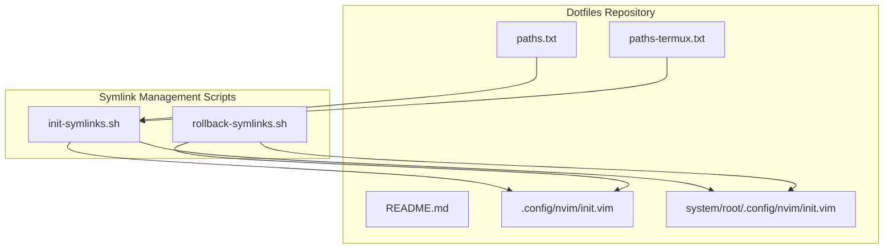
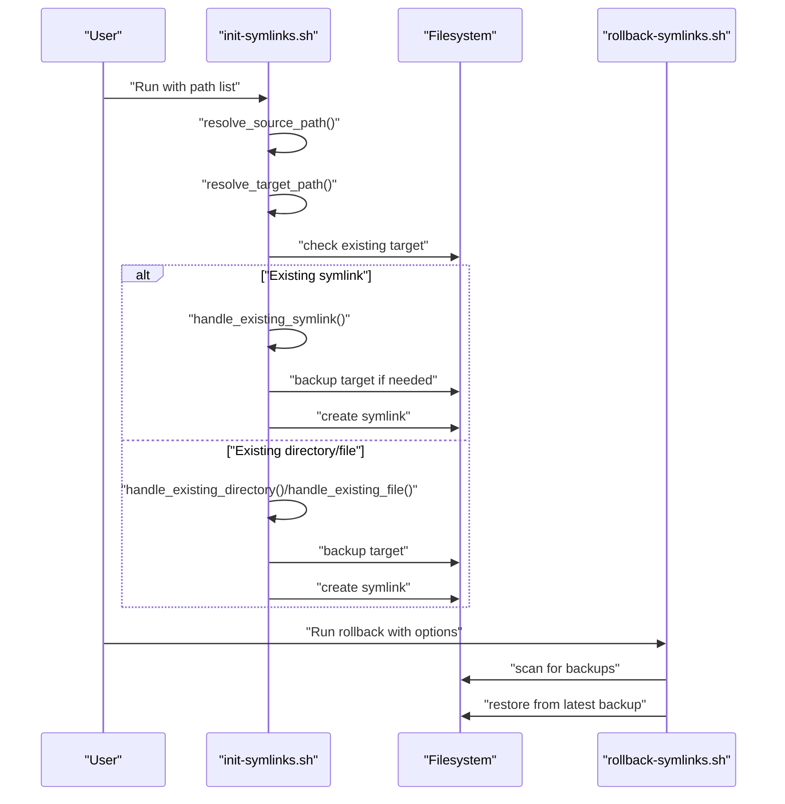
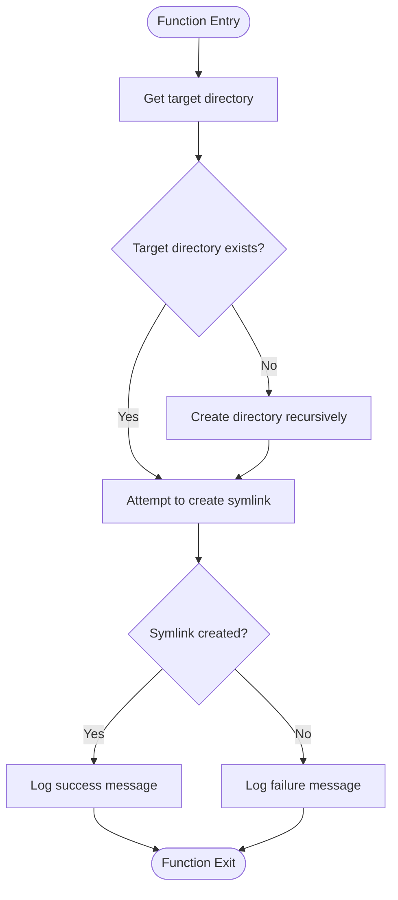
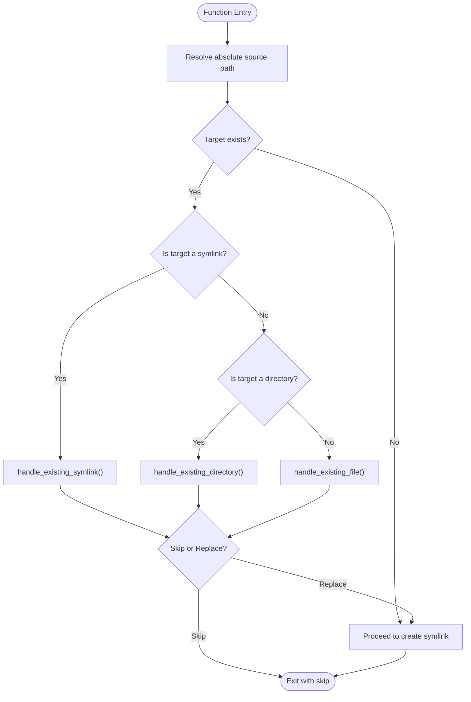
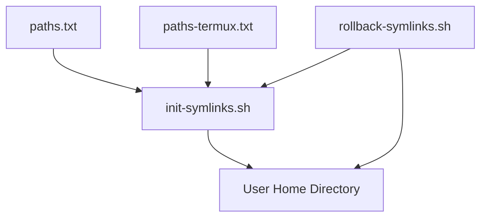

# Symlink Management System

<cite>
**Referenced Files in This Document**
- [init-symlinks.sh](file://init-symlinks.sh)
- [rollback-symlinks.sh](file://rollback-symlinks.sh)
- [paths.txt](file://paths.txt)
- [paths-termux.txt](file://paths-termux.txt)
- [README.md](file://README.md)
- [.config/nvim/init.vim](file://.config/nvim/init.vim)
- [system/root/.config/nvim/init.vim](file://system/root/.config/nvim/init.vim)
</cite>

## Table of Contents
1. [Introduction](#introduction)
2. [Project Structure](#project-structure)
3. [Core Components](#core-components)
4. [Architecture Overview](#architecture-overview)
5. [Detailed Component Analysis](#detailed-component-analysis)
6. [Dependency Analysis](#dependency-analysis)
7. [Performance Considerations](#performance-considerations)
8. [Troubleshooting Guide](#troubleshooting-guide)
9. [Conclusion](#conclusion)
10. [Appendices](#appendices)

## Introduction
This document provides comprehensive technical and practical guidance for the symlink management functionality within the dotfiles repository. It focuses on the create_symlink() function and supporting symlink operations, covering directory preparation, absolute path resolution, error handling, validation mechanisms, broken link detection, replacement strategies, and integration with the broader deployment system. Practical examples, troubleshooting steps, and best practices are included to help maintain symlink integrity across different environments.

## Project Structure
The symlink management system consists of two primary scripts and supporting configuration files:
- init-symlinks.sh: Creates and manages symlinks according to path lists
- rollback-symlinks.sh: Restores targets from timestamped backups
- paths.txt and paths-termux.txt: Lists of paths to symlink for standard and Termux environments
- README.md: Deployment instructions and prerequisites
- Example configuration files under .config/ and system/root/ demonstrate symlink targets

**Diagram sources**
- [init-symlinks.sh](file://init-symlinks.sh#L288-L346)
- [rollback-symlinks.sh](file://rollback-symlinks.sh#L246-L315)
- [paths.txt](file://paths.txt#L1-L16)
- [paths-termux.txt](file://paths-termux.txt#L1-L12)
- [.config/nvim/init.vim](file://.config/nvim/init.vim#L1-L352)
- [system/root/.config/nvim/init.vim](file://system/root/.config/nvim/init.vim#L1-L157)

**Section sources**
- [README.md](file://README.md#L7-L18)
- [paths.txt](file://paths.txt#L1-L16)
- [paths-termux.txt](file://paths-termux.txt#L1-L12)

## Core Components
- create_symlink(): Creates a symlink from a source path to a target path, ensuring parent directories exist and handling creation errors
- handle_target(): Orchestrates symlink creation by checking for existing targets, handling conflicts, and deciding whether to proceed
- resolve_source_path() and resolve_target_path(): Normalize and compute absolute paths for source and target locations
- Backup and restore utilities: generate_backup_path(), find_latest_backup(), restore_backup()

Key responsibilities:
- Directory preparation: Ensures target parent directories exist before creating symlinks
- Absolute path resolution: Uses readlink -f to resolve absolute paths for accurate comparisons
- Validation and replacement: Detects broken symlinks and mismatches, prompting for user consent or operating in batch mode
- Error handling: Provides informative messages and returns appropriate exit codes

**Section sources**
- [init-symlinks.sh](file://init-symlinks.sh#L225-L244)
- [init-symlinks.sh](file://init-symlinks.sh#L192-L223)
- [init-symlinks.sh](file://init-symlinks.sh#L91-L110)

## Architecture Overview
The symlink management system integrates with the deployment workflow as follows:
- Users define target paths in path lists (standard and Termux-specific)
- The init-symlinks.sh script reads the path list, resolves absolute paths, checks existing targets, and creates or replaces symlinks accordingly
- Timestamped backups are generated automatically for any target being replaced
- rollback-symlinks.sh scans for backups and restores targets to previous states

**Diagram sources**
- [init-symlinks.sh](file://init-symlinks.sh#L250-L286)
- [init-symlinks.sh](file://init-symlinks.sh#L116-L148)
- [rollback-symlinks.sh](file://rollback-symlinks.sh#L173-L209)

## Detailed Component Analysis

### create_symlink() Function
Purpose: Create a symlink from source to target, ensuring the target directory exists and handling failures gracefully.

Processing logic:
- Compute target directory from target_path
- If target directory does not exist, create it recursively
- Attempt to create the symlink; log success or failure

**Diagram sources**
- [init-symlinks.sh](file://init-symlinks.sh#L225-L244)

**Section sources**
- [init-symlinks.sh](file://init-symlinks.sh#L225-L244)

### handle_target() Decision Flow
Purpose: Determine whether to skip, replace, or create a symlink based on the current state of the target.

Processing logic:
- Resolve absolute source path using readlink -f when available
- If target is a symlink:
  - Compare with absolute source path; skip if equal
  - If broken (target path does not exist), backup and proceed
  - If mismatched, prompt user (or batch mode) to replace
- If target is a directory or file:
  - Prompt to merge contents (for directories) and replace with symlink
  - Backup existing target and proceed

**Diagram sources**
- [init-symlinks.sh](file://init-symlinks.sh#L192-L223)
- [init-symlinks.sh](file://init-symlinks.sh#L116-L148)
- [init-symlinks.sh](file://init-symlinks.sh#L150-L174)
- [init-symlinks.sh](file://init-symlinks.sh#L176-L190)

**Section sources**
- [init-symlinks.sh](file://init-symlinks.sh#L192-L223)
- [init-symlinks.sh](file://init-symlinks.sh#L116-L148)
- [init-symlinks.sh](file://init-symlinks.sh#L150-L174)
- [init-symlinks.sh](file://init-symlinks.sh#L176-L190)

### Path Resolution and Normalization
Purpose: Convert relative paths to absolute paths and compute target locations in the user’s home directory.

Key functions:
- resolve_source_path(): Prepends script directory to relative path and normalizes trailing slashes
- resolve_target_path(): Handles special prefix for Termux configurations and normalizes path segments

Behavior:
- Termux-specific paths are stripped of the termux-config/ prefix when computing targets
- Paths are normalized to remove trailing separators

**Section sources**
- [init-symlinks.sh](file://init-symlinks.sh#L91-L110)

### Backup Generation and Restoration
Purpose: Safeguard targets by backing them up before replacement and enabling rollback to previous states.

Backup generation:
- generate_backup_path(): Appends current date and optional counter suffix to target path to avoid collisions

Backup discovery and restoration:
- find_latest_backup(): Scans for backups matching the pattern and returns the most recent one
- restore_backup(): Removes current target if present and moves backup to target location
- rollback_all_backups(): Scans for all backups and restores them with progress and summary

Dry-run mode:
- rollback-symlinks.sh supports --dry-run to preview changes without applying them

**Section sources**
- [init-symlinks.sh](file://init-symlinks.sh#L22-L33)
- [rollback-symlinks.sh](file://rollback-symlinks.sh#L39-L67)
- [rollback-symlinks.sh](file://rollback-symlinks.sh#L115-L149)
- [rollback-symlinks.sh](file://rollback-symlinks.sh#L173-L209)

### Integration with Deployment Workflow
- Path lists: paths.txt and paths-termux.txt enumerate files and directories to symlink
- Execution: Users run init-symlinks.sh with a path list; rollback-symlinks.sh can restore targets later
- Environment awareness: Termux-specific paths are handled separately to support mobile development environments

Practical usage:
- Standard environment: Edit paths.txt, run init-symlinks.sh with the path list
- Termux environment: Edit paths-termux.txt, run init-symlinks.sh with the Termux path list
- Rollback: Use rollback-symlinks.sh with optional --dry-run, --date, or --target flags

**Section sources**
- [README.md](file://README.md#L7-L18)
- [paths.txt](file://paths.txt#L1-L16)
- [paths-termux.txt](file://paths-termux.txt#L1-L12)
- [init-symlinks.sh](file://init-symlinks.sh#L312-L343)
- [rollback-symlinks.sh](file://rollback-symlinks.sh#L246-L315)

## Dependency Analysis
The symlink management system exhibits clear separation of concerns:
- init-symlinks.sh depends on:
  - POSIX shell utilities (readlink, ln, mkdir, mv, cp)
  - Path list files (paths.txt, paths-termux.txt)
  - User input prompts (interactive mode)
- rollback-symlinks.sh depends on:
  - POSIX shell utilities (find, sort, rm, mv)
  - Backup naming convention (.YYYYMMDD with optional counters)
  - User input prompts (interactive mode)

**Diagram sources**
- [init-symlinks.sh](file://init-symlinks.sh#L288-L346)
- [rollback-symlinks.sh](file://rollback-symlinks.sh#L173-L209)
- [paths.txt](file://paths.txt#L1-L16)
- [paths-termux.txt](file://paths-termux.txt#L1-L12)

**Section sources**
- [init-symlinks.sh](file://init-symlinks.sh#L288-L346)
- [rollback-symlinks.sh](file://rollback-symlinks.sh#L173-L209)

## Performance Considerations
- Directory creation: mkdir -p is efficient for creating nested paths; ensure minimal redundant calls by checking existence first
- Symlink creation: ln -sn is atomic; failures are rare but should be logged and retried if necessary
- Backup scanning: find with -print0 and sort -z are efficient for large filesystems; consider limiting search depth if needed
- Interactive prompts: Batch mode (--no-verify) reduces I/O overhead by avoiding user prompts

[No sources needed since this section provides general guidance]

## Troubleshooting Guide
Common issues and resolutions:
- Broken symlinks: Detected by comparing target path against absolute source path; the system backs up the broken symlink and recreates it
- Wrong target location: When a symlink points elsewhere, the system prompts to replace it; use --no-verify to bypass prompts in automated environments
- Existing directory with contents: For directories, the system can merge contents into the dotfiles repository before replacing with a symlink
- Permission errors: Ensure the user has write permissions to target directories; run with elevated privileges if necessary
- Backup restoration: Use rollback-symlinks.sh with --dry-run to preview changes; specify --date or --target to restore specific backups

Validation and verification:
- Source existence: The system validates that source paths exist before attempting to create symlinks
- Absolute path comparison: readlink -f ensures accurate comparison of symlink targets

**Section sources**
- [init-symlinks.sh](file://init-symlinks.sh#L116-L148)
- [init-symlinks.sh](file://init-symlinks.sh#L150-L174)
- [init-symlinks.sh](file://init-symlinks.sh#L264-L269)
- [rollback-symlinks.sh](file://rollback-symlinks.sh#L115-L149)

## Conclusion
The symlink management system provides a robust, safe, and flexible mechanism for deploying dotfiles across environments. It emphasizes safety through automatic backups, intelligent conflict resolution, and clear user prompts. By integrating path lists, absolute path resolution, and targeted rollback capabilities, it enables reliable maintenance of symlink integrity across diverse systems and use cases.

[No sources needed since this section summarizes without analyzing specific files]

## Appendices

### Practical Examples
- Creating symlinks for standard desktop environment:
  - Edit paths.txt to include desired files and directories
  - Run init-symlinks.sh with the path list
- Creating symlinks for Termux:
  - Edit paths-termux.txt to include Termux-specific entries
  - Run init-symlinks.sh with the Termux path list
- Rolling back to a specific backup:
  - Use rollback-symlinks.sh with --date to restore to a specific timestamp
  - Use --target to restore a single file or directory

**Section sources**
- [README.md](file://README.md#L7-L18)
- [paths.txt](file://paths.txt#L1-L16)
- [paths-termux.txt](file://paths-termux.txt#L1-L12)
- [rollback-symlinks.sh](file://rollback-symlinks.sh#L246-L315)

### Best Practices
- Keep path lists organized and environment-specific (paths.txt vs paths-termux.txt)
- Use --no-verify in automated deployments to reduce manual intervention
- Periodically review and prune old backups to manage disk usage
- Test rollback procedures with --dry-run before performing live rollbacks
- Validate source paths regularly to prevent broken links

[No sources needed since this section provides general guidance]