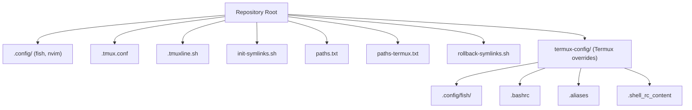
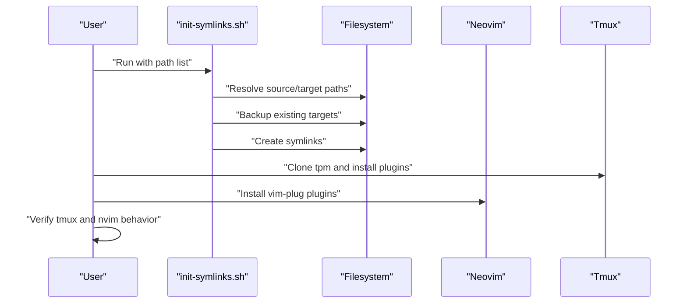
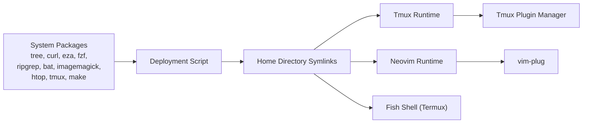
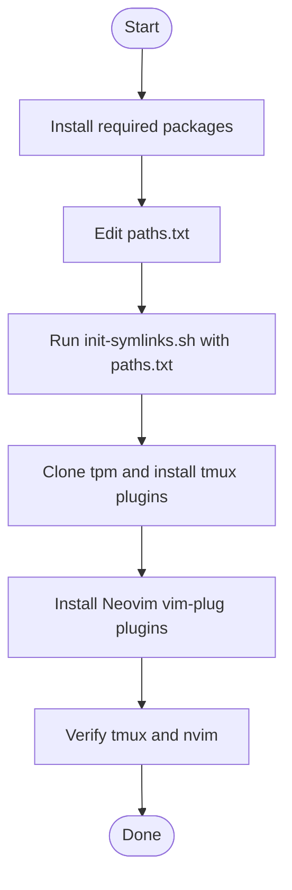
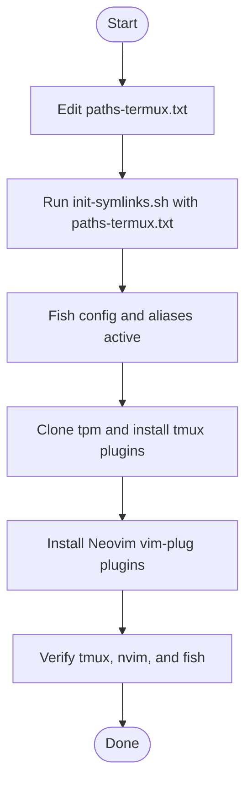

# Getting Started

<cite>
**Referenced Files in This Document**
- [README.md](file://README.md)
- [init-symlinks.sh](file://init-symlinks.sh)
- [rollback-symlinks.sh](file://rollback-symlinks.sh)
- [paths.txt](file://paths.txt)
- [paths-termux.txt](file://paths-termux.txt)
- [.tmux.conf](file://.tmux.conf)
- [.config/nvim/init.vim](file://.config/nvim/init.vim)
- [.local/share/nvim/plugged/copilot.vim/plugin/copilot.vim](file://.local/share/nvim/plugged/copilot.vim/plugin/copilot.vim)
- [termux-config/.config/fish/config.fish](file://termux-config/.config/fish/config.fish)
- [termux-config/.config/fish/conf.d/aliases.fish](file://termux-config/.config/fish/conf.d/aliases.fish)
- [termux-config/.config/fish/conf.d/shell_rc_content.fish](file://termux-config/.config/fish/conf.d/shell_rc_content.fish)
- [termux-config/.bashrc](file://termux-config/.bashrc)
- [termux-config/.aliases](file://termux-config/.aliases)
- [termux-config/.shell_rc_content](file://termux-config/.shell_rc_content)
</cite>

## Table of Contents
1. [Introduction](#introduction)
2. [Project Structure](#project-structure)
3. [Core Components](#core-components)
4. [Architecture Overview](#architecture-overview)
5. [Detailed Component Analysis](#detailed-component-analysis)
6. [Dependency Analysis](#dependency-analysis)
7. [Performance Considerations](#performance-considerations)
8. [Troubleshooting Guide](#troubleshooting-guide)
9. [Conclusion](#conclusion)
10. [Appendices](#appendices)

## Introduction
This guide helps you deploy the dotfiles system and configure your environment quickly. It covers prerequisites, step-by-step installation, platform-specific setup for desktop/Linux and Termux/mobile, verification steps, and initial customization tips.

## Project Structure
At a high level, the repository provides:
- Shell and editor configuration files under .config and home-level dotfiles
- A symlink deployment script that reads a path list and creates symlinks into your home directory
- Platform-specific path lists for desktop/Linux and Termux
- Tmux and Neovim plugin configurations
- Termux-specific Fish shell, aliases, and environment tweaks

**Diagram sources**
- [init-symlinks.sh](file://init-symlinks.sh#L288-L294)
- [paths.txt](file://paths.txt#L1-L16)
- [paths-termux.txt](file://paths-termux.txt#L1-L12)
- [termux-config/.config/fish/config.fish](file://termux-config/.config/fish/config.fish#L127-L152)
- [.tmux.conf](file://.tmux.conf#L1-L69)
- [.config/nvim/init.vim](file://.config/nvim/init.vim#L135-L161)

**Section sources**
- [README.md](file://README.md#L7-L18)
- [init-symlinks.sh](file://init-symlinks.sh#L288-L294)
- [paths.txt](file://paths.txt#L1-L16)
- [paths-termux.txt](file://paths-termux.txt#L1-L12)

## Core Components
- Deployment script: Creates or updates symlinks based on a path list, backing up existing files/directories as needed.
- Path lists: Desktop/Linux and Termux variants define which files/directories are symlinked.
- Tmux configuration: Loads plugins and sets defaults for a modern tmux experience.
- Neovim configuration: Declares plugins and key mappings; relies on vim-plug for plugin management.
- Termux overrides: Fish shell, aliases, and environment variables tailored for mobile/Linux environments.

**Section sources**
- [init-symlinks.sh](file://init-symlinks.sh#L116-L223)
- [paths.txt](file://paths.txt#L1-L16)
- [paths-termux.txt](file://paths-termux.txt#L1-L12)
- [.tmux.conf](file://.tmux.conf#L56-L69)
- [.config/nvim/init.vim](file://.config/nvim/init.vim#L135-L161)
- [termux-config/.config/fish/config.fish](file://termux-config/.config/fish/config.fish#L127-L152)

## Architecture Overview
The deployment pipeline consists of:
- Preparing your system with required packages
- Cloning Tmux plugin manager
- Running the symlink installer against a path list
- Installing Neovim plugins via vim-plug
- Verifying tmux plugins are installed

**Diagram sources**
- [init-symlinks.sh](file://init-symlinks.sh#L288-L294)
- [.tmux.conf](file://.tmux.conf#L56-L69)
- [.config/nvim/init.vim](file://.config/nvim/init.vim#L135-L161)
- [README.md](file://README.md#L9-L13)

## Detailed Component Analysis

### Prerequisites and Required Packages
- Required system packages (desktop/Linux): tree, curl, eza, fzf, ripgrep, bat, imagemagick, htop, tmux, make
- Optional tools: Just, UV, Rust, Docker, Build Tools

Notes:
- The repository documents required packages and optional tools in the setup section.
- These tools enable the plugins and workflows configured in tmux, Neovim, and Fish.

**Section sources**
- [README.md](file://README.md#L20-L35)

### Step-by-Step Installation

1) Clone the repository to your machine.
2) Update the path list:
   - Desktop/Linux: edit paths.txt to include/exclude desired files/directories
   - Termux: edit paths-termux.txt to include Termux-specific overrides
3) Run the symlink installer:
   - Desktop/Linux: run the script with the desktop path list
   - Termux: run the script with the Termux path list
4) Install Tmux plugins:
   - Clone the Tmux Plugin Manager into the expected location
   - Open tmux and install plugins
5) Install Neovim plugins:
   - Open Neovim and install plugins managed by vim-plug

Verification:
- Confirm symlinks point to repository paths
- Launch tmux and Neovim; verify plugins are loaded and functional

**Section sources**
- [README.md](file://README.md#L9-L13)
- [init-symlinks.sh](file://init-symlinks.sh#L312-L343)
- [paths.txt](file://paths.txt#L1-L16)
- [paths-termux.txt](file://paths-termux.txt#L1-L12)
- [.tmux.conf](file://.tmux.conf#L56-L69)
- [.config/nvim/init.vim](file://.config/nvim/init.vim#L135-L161)

### Platform-Specific Setup

#### Desktop/Linux
- Use paths.txt to control which files/directories are symlinked into your home.
- Ensure required packages are installed as documented.
- After deployment, install Tmux plugins and Neovim plugins as described above.

Key files:
- Desktop path list: paths.txt
- Tmux configuration: .tmux.conf
- Neovim configuration: .config/nvim/init.vim

**Section sources**
- [paths.txt](file://paths.txt#L1-L16)
- [.tmux.conf](file://.tmux.conf#L1-L69)
- [.config/nvim/init.vim](file://.config/nvim/init.vim#L135-L161)

#### Termux/Mobile
- Use paths-termux.txt to include Termux-specific overrides (e.g., Fish config and shell rc).
- The Termux config provides:
  - Fish shell configuration and prompt customization
  - Aliases optimized for Termux (e.g., eza, bat, magick)
  - Environment variables and helper aliases
- The script supports a special path segment to map termux-config entries into your home.

Key files:
- Termux path list: paths-termux.txt
- Fish config: termux-config/.config/fish/config.fish
- Fish aliases: termux-config/.config/fish/conf.d/aliases.fish
- Fish runtime content: termux-config/.config/fish/conf.d/shell_rc_content.fish
- Bash rc for Termux: termux-config/.bashrc
- Aliases and helpers: termux-config/.aliases
- Shell runtime content: termux-config/.shell_rc_content

**Section sources**
- [paths-termux.txt](file://paths-termux.txt#L1-L12)
- [termux-config/.config/fish/config.fish](file://termux-config/.config/fish/config.fish#L127-L152)
- [termux-config/.config/fish/conf.d/aliases.fish](file://termux-config/.config/fish/conf.d/aliases.fish#L120-L154)
- [termux-config/.config/fish/conf.d/shell_rc_content.fish](file://termux-config/.config/fish/conf.d/shell_rc_content.fish#L1-L18)
- [termux-config/.bashrc](file://termux-config/.bashrc#L1-L37)
- [termux-config/.aliases](file://termux-config/.aliases#L525-L549)
- [termux-config/.shell_rc_content](file://termux-config/.shell_rc_content#L1-L95)

### Initial Configuration and Environment Setup

- Tmux
  - Default terminal and mouse support are configured.
  - Plugins are declared and initialized at the end of the tmux config.
  - After cloning tpm and installing plugins, tmux should reflect the configured plugins.

- Neovim
  - vim-plug is used to manage plugins.
  - The Neovim config declares a wide set of plugins and key mappings.
  - After installing vim-plug plugins, Neovim should load the plugins and theme-related settings.

- Fish (Termux)
  - Fish prompt includes distro icon, current directory, virtual environment, and VCS branch.
  - Aliases and environment variables are set for convenience and productivity.
  - Interactive initialization includes optional hooks for direnv and nvm.

- Bash (Termux)
  - Provides a colored prompt and aliases for quick navigation and utilities.
  - Sources additional runtime content and aliases.

**Section sources**
- [.tmux.conf](file://.tmux.conf#L1-L69)
- [.config/nvim/init.vim](file://.config/nvim/init.vim#L135-L161)
- [termux-config/.config/fish/config.fish](file://termux-config/.config/fish/config.fish#L54-L84)
- [termux-config/.config/fish/conf.d/aliases.fish](file://termux-config/.config/fish/conf.d/aliases.fish#L120-L154)
- [termux-config/.bashrc](file://termux-config/.bashrc#L30-L37)

## Dependency Analysis
The deployment depends on:
- System packages for tmux, Neovim, and CLI tools
- Tmux Plugin Manager for tmux enhancements
- vim-plug for Neovim plugin management
- Fish shell for Termux prompt and aliases

**Diagram sources**
- [README.md](file://README.md#L20-L35)
- [init-symlinks.sh](file://init-symlinks.sh#L288-L294)
- [.tmux.conf](file://.tmux.conf#L56-L69)
- [.config/nvim/init.vim](file://.config/nvim/init.vim#L135-L161)
- [termux-config/.config/fish/config.fish](file://termux-config/.config/fish/config.fish#L127-L152)

**Section sources**
- [README.md](file://README.md#L20-L35)
- [init-symlinks.sh](file://init-symlinks.sh#L288-L294)
- [.tmux.conf](file://.tmux.conf#L56-L69)
- [.config/nvim/init.vim](file://.config/nvim/init.vim#L135-L161)
- [termux-config/.config/fish/config.fish](file://termux-config/.config/fish/config.fish#L127-L152)

## Performance Considerations
- The symlink installer performs backups and interactive confirmations by default; use the batch flag to automate.
- On Termux, aliases leverage fast tools (e.g., eza, bat) to improve responsiveness.
- Neovim plugin loading can be slower with many plugins; consider disabling non-essential plugins if startup becomes sluggish.

[No sources needed since this section provides general guidance]

## Troubleshooting Guide

Common issues and resolutions:
- Broken or incorrect symlinks
  - The symlink installer detects broken or mispointed symlinks and offers to replace them after backup.
  - Use the rollback script to revert to the latest backup if needed.

- Missing required packages
  - Ensure all required system packages are installed as documented.
  - On Termux, verify that the tools referenced by aliases are available.

- Tmux plugins not loading
  - Confirm Tmux Plugin Manager is cloned into the expected location.
  - Install plugins inside a tmux session.

- Neovim plugins not loading
  - Ensure vim-plug is installed and run the plugin installation command in Neovim.

- Termux-specific issues
  - Verify Fish prompt and aliases are sourced correctly.
  - Confirm environment variables and PATH prepends/appends are applied.

Verification checklist:
- Symlinks point to repository paths and backups are created
- Tmux loads plugins and mouse/terminal settings work
- Neovim loads plugins and key mappings are active
- Fish prompt displays correctly and aliases are usable

**Section sources**
- [init-symlinks.sh](file://init-symlinks.sh#L116-L148)
- [rollback-symlinks.sh](file://rollback-symlinks.sh#L103-L149)
- [README.md](file://README.md#L9-L13)
- [.tmux.conf](file://.tmux.conf#L56-L69)
- [.config/nvim/init.vim](file://.config/nvim/init.vim#L135-L161)
- [termux-config/.config/fish/config.fish](file://termux-config/.config/fish/config.fish#L127-L152)

## Conclusion
With the required packages installed and the deployment script run against the appropriate path list, your environment will be configured with tmux, Neovim, and Fish (Termux) according to the repository’s preferences. Use the verification steps to confirm everything is working, then customize further by editing the relevant configuration files.

[No sources needed since this section summarizes without analyzing specific files]

## Appendices

### Appendix A: Deployment Flow (Desktop/Linux)

**Diagram sources**
- [README.md](file://README.md#L9-L13)
- [init-symlinks.sh](file://init-symlinks.sh#L312-L343)
- [paths.txt](file://paths.txt#L1-L16)
- [.tmux.conf](file://.tmux.conf#L56-L69)
- [.config/nvim/init.vim](file://.config/nvim/init.vim#L135-L161)

### Appendix B: Deployment Flow (Termux)

**Diagram sources**
- [paths-termux.txt](file://paths-termux.txt#L1-L12)
- [init-symlinks.sh](file://init-symlinks.sh#L312-L343)
- [termux-config/.config/fish/config.fish](file://termux-config/.config/fish/config.fish#L127-L152)
- [.tmux.conf](file://.tmux.conf#L56-L69)
- [.config/nvim/init.vim](file://.config/nvim/init.vim#L135-L161)

### Appendix C: Copilot Plugin Notes
- The Neovim configuration includes the Copilot plugin.
- The plugin registers mappings and integrates with insert mode events.
- Ensure the Copilot service is available and configured in your environment.

**Section sources**
- [.config/nvim/init.vim](file://.config/nvim/init.vim#L155-L155)
- [.local/share/nvim/plugged/copilot.vim/plugin/copilot.vim](file://.local/share/nvim/plugged/copilot.vim/plugin/copilot.vim#L1-L115)