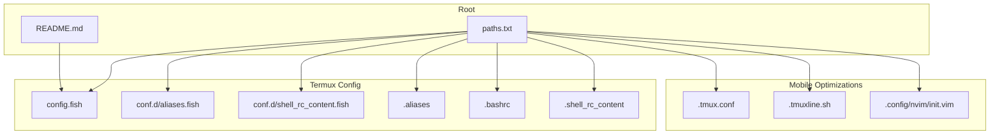
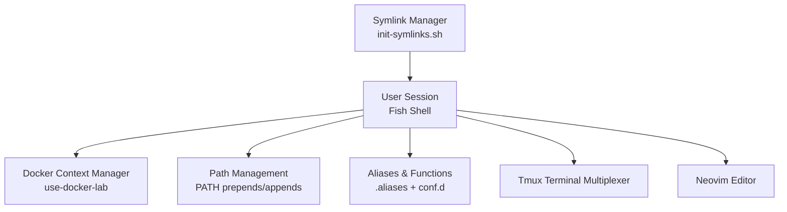
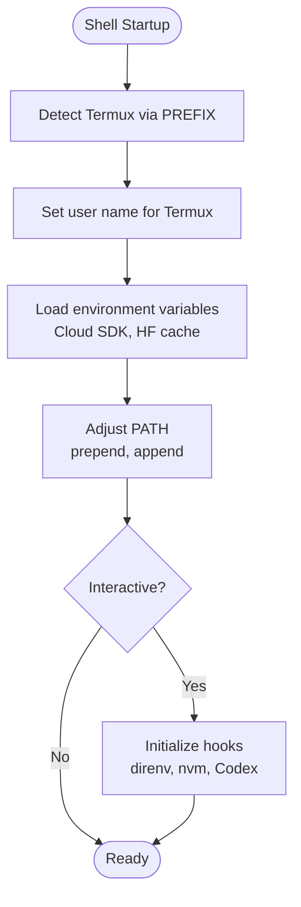
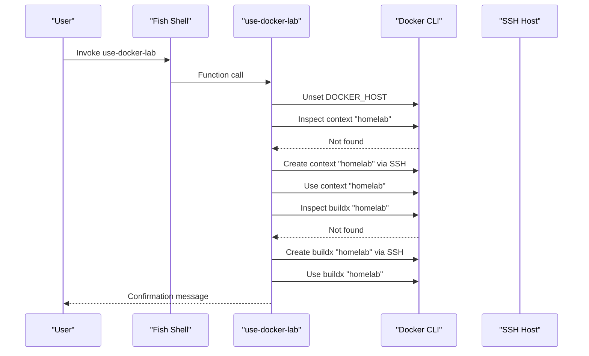
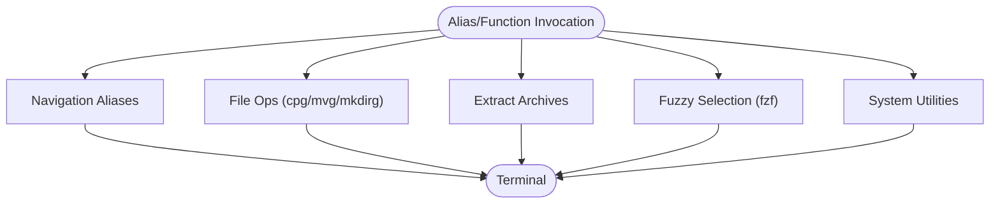
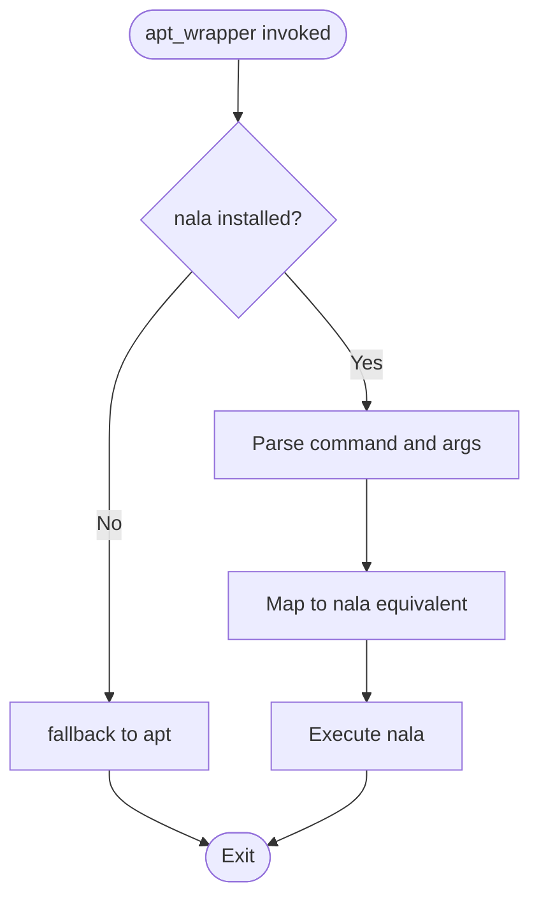
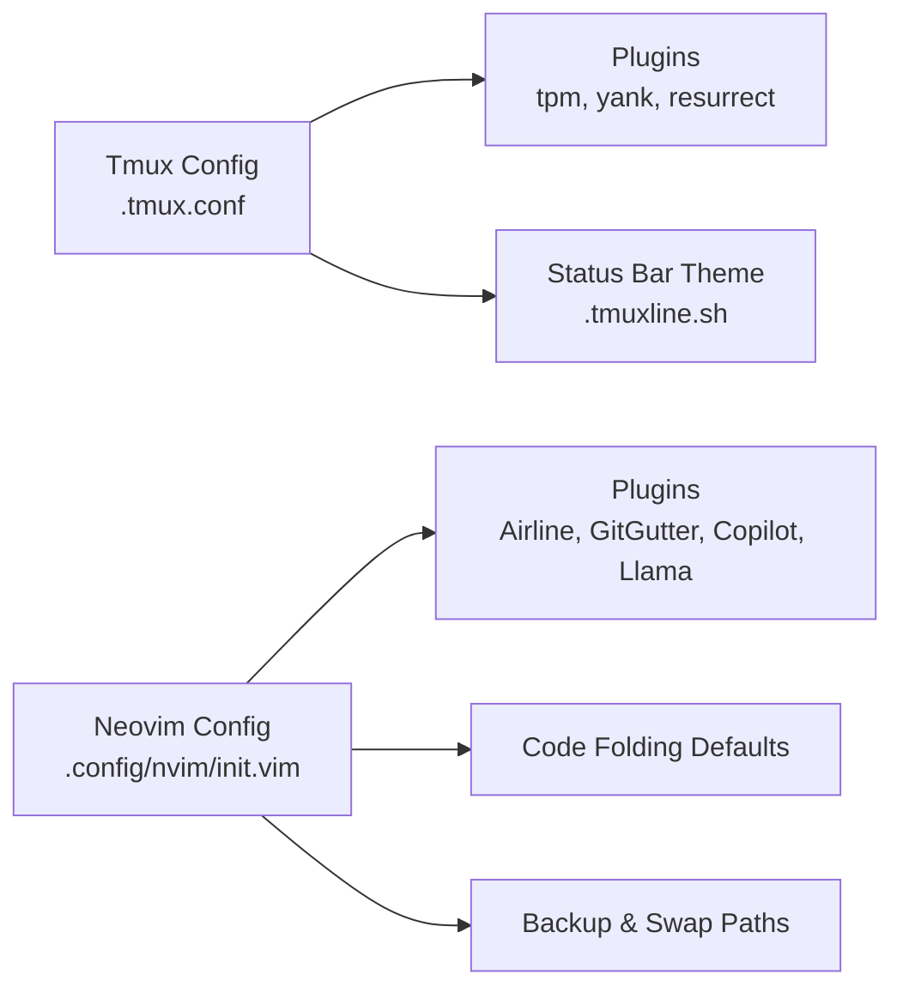
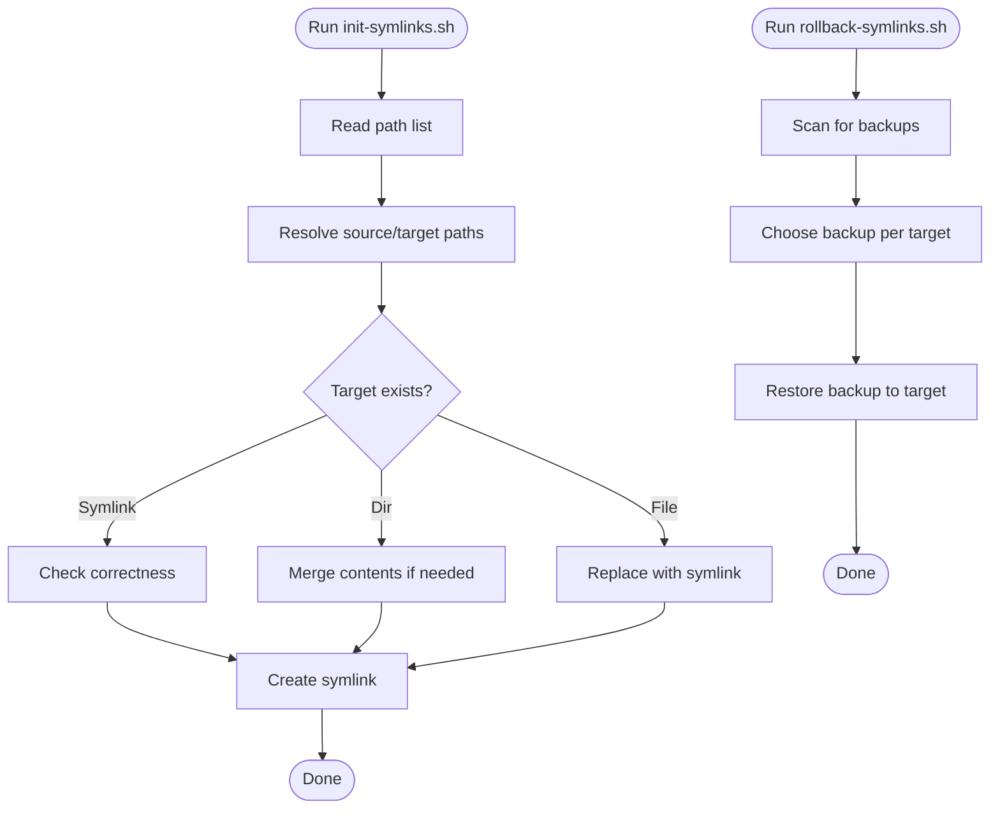
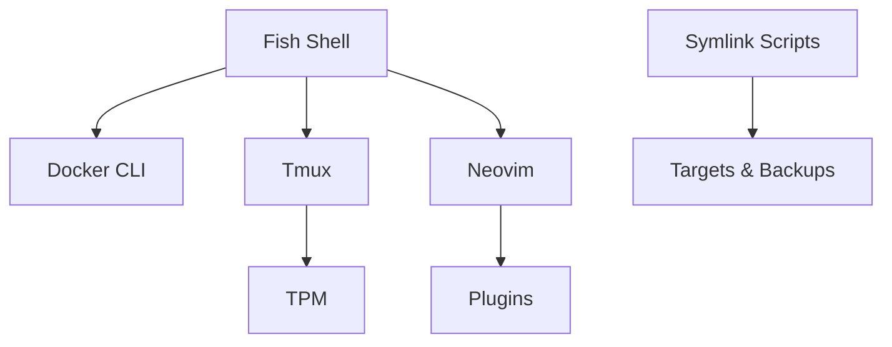

# Mobile Development Environment

<cite>
**Referenced Files in This Document**
- [README.md](file://README.md)
- [init-symlinks.sh](file://init-symlinks.sh)
- [rollback-symlinks.sh](file://rollback-symlinks.sh)
- [paths-termux.txt](file://paths-termux.txt)
- [paths.txt](file://paths.txt)
- [termux-config/.config/fish/config.fish](file://termux-config/.config/fish/config.fish)
- [termux-config/.config/fish/conf.d/aliases.fish](file://termux-config/.config/fish/conf.d/aliases.fish)
- [termux-config/.config/fish/conf.d/shell_rc_content.fish](file://termux-config/.config/fish/conf.d/shell_rc_content.fish)
- [termux-config/.aliases](file://termux-config/.aliases)
- [termux-config/.bashrc](file://termux-config/.bashrc)
- [termux-config/.shell_rc_content](file://termux-config/.shell_rc_content)
- [.tmux.conf](file://.tmux.conf)
- [.tmuxline.sh](file://.tmuxline.sh)
- [.config/nvim/init.vim](file://.config/nvim/init.vim)
</cite>

## Table of Contents
1. [Introduction](#introduction)
2. [Project Structure](#project-structure)
3. [Core Components](#core-components)
4. [Architecture Overview](#architecture-overview)
5. [Detailed Component Analysis](#detailed-component-analysis)
6. [Dependency Analysis](#dependency-analysis)
7. [Performance Considerations](#performance-considerations)
8. [Troubleshooting Guide](#troubleshooting-guide)
9. [Conclusion](#conclusion)
10. [Appendices](#appendices)

## Introduction
This document describes a mobile-focused development environment tailored for Termux. It explains how desktop configurations are adapted for mobile constraints, how Docker contexts are managed remotely, and how mobile-optimized tooling is integrated. It documents Termux-specific environment setup, package management integration, performance optimizations, and mobile-optimized aliases and workflows. Practical examples, troubleshooting guidance, and cross-platform best practices are included to maintain consistent workflows across platforms.

## Project Structure
The repository organizes shared and Termux-specific configurations, with a dedicated Termux subtree and scripts to manage symlinks and rollbacks. The structure supports:
- Shared dotfiles for non-Termux environments
- Termux-specific Fish shell configuration and aliases
- Tmux and Neovim configurations optimized for mobile terminals
- Scripts to initialize and rollback symlinks safely

**Diagram sources**
- [paths.txt](file://paths.txt#L1-L16)
- [termux-config/.config/fish/config.fish](file://termux-config/.config/fish/config.fish#L1-L184)
- [termux-config/.config/fish/conf.d/aliases.fish](file://termux-config/.config/fish/conf.d/aliases.fish#L1-L156)
- [termux-config/.config/fish/conf.d/shell_rc_content.fish](file://termux-config/.config/fish/conf.d/shell_rc_content.fish#L1-L20)
- [termux-config/.aliases](file://termux-config/.aliases#L1-L550)
- [termux-config/.bashrc](file://termux-config/.bashrc#L1-L38)
- [termux-config/.shell_rc_content](file://termux-config/.shell_rc_content#L1-L135)
- [.tmux.conf](file://.tmux.conf#L1-L69)
- [.tmuxline.sh](file://.tmuxline.sh#L1-L22)
- [.config/nvim/init.vim](file://.config/nvim/init.vim#L1-L352)

**Section sources**
- [paths.txt](file://paths.txt#L1-L16)
- [README.md](file://README.md#L1-L35)

## Core Components
- Termux-aware Fish shell configuration with prompt customization, environment variables, and Docker context management
- Mobile-optimized aliases and functions for navigation, extraction, fuzzy selection, and system tasks
- Tmux configuration tuned for mobile terminals and Vi mode
- Neovim setup with plugins and mobile-friendly defaults
- Symlink management scripts to safely apply and rollback dotfiles across platforms

Key capabilities:
- Docker context switching to a remote host via SSH with buildx integration
- Package management abstraction via an apt wrapper that prefers nala when available
- Mobile-friendly file operations and fuzzy workflows
- Persistent tmux sessions and Neovim buffers across device usage

**Section sources**
- [termux-config/.config/fish/config.fish](file://termux-config/.config/fish/config.fish#L101-L124)
- [termux-config/.config/fish/conf.d/aliases.fish](file://termux-config/.config/fish/conf.d/aliases.fish#L1-L156)
- [termux-config/.aliases](file://termux-config/.aliases#L1-L550)
- [termux-config/.shell_rc_content](file://termux-config/.shell_rc_content#L13-L65)
- [.tmux.conf](file://.tmux.conf#L1-L69)
- [.config/nvim/init.vim](file://.config/nvim/init.vim#L1-L352)
- [init-symlinks.sh](file://init-symlinks.sh#L1-L347)
- [rollback-symlinks.sh](file://rollback-symlinks.sh#L1-L316)

## Architecture Overview
The environment architecture centers on Fish shell for interactive sessions, with Tmux for terminal multiplexing and Neovim for editing. Termux-specific adaptations include:
- Prompt detection for Termux and environment variable normalization
- PATH adjustments for mobile tooling and cloud SDKs
- Aliases and functions optimized for small screens and touch input
- Tmux and Neovim configurations designed for mobile terminals

**Diagram sources**
- [termux-config/.config/fish/config.fish](file://termux-config/.config/fish/config.fish#L101-L124)
- [termux-config/.config/fish/config.fish](file://termux-config/.config/fish/config.fish#L127-L152)
- [termux-config/.aliases](file://termux-config/.aliases#L1-L550)
- [termux-config/.config/fish/conf.d/aliases.fish](file://termux-config/.config/fish/conf.d/aliases.fish#L1-L156)
- [.tmux.conf](file://.tmux.conf#L1-L69)
- [.config/nvim/init.vim](file://.config/nvim/init.vim#L1-L352)
- [init-symlinks.sh](file://init-symlinks.sh#L1-L347)

## Detailed Component Analysis

### Termux Shell and Environment
- Prompt customization detects Termux and displays a distro icon, current directory, virtual environment, and VCS branch
- Environment variables include Cloud SDK auth plugin enablement and Hugging Face cache paths
- PATH is adjusted to include mobile-specific binaries and cloud SDKs
- Interactive initialization includes direnv hook, nvm defaults, and Codex CLI helpers

**Diagram sources**
- [termux-config/.config/fish/config.fish](file://termux-config/.config/fish/config.fish#L32-L51)
- [termux-config/.config/fish/config.fish](file://termux-config/.config/fish/config.fish#L154-L162)
- [termux-config/.config/fish/config.fish](file://termux-config/.config/fish/config.fish#L127-L152)
- [termux-config/.config/fish/config.fish](file://termux-config/.config/fish/config.fish#L165-L182)

**Section sources**
- [termux-config/.config/fish/config.fish](file://termux-config/.config/fish/config.fish#L32-L51)
- [termux-config/.config/fish/config.fish](file://termux-config/.config/fish/config.fish#L127-L162)
- [termux-config/.config/fish/config.fish](file://termux-config/.config/fish/config.fish#L165-L182)

### Docker Context Management
A function switches the active Docker context to a remote host via SSH and ensures a buildx builder is configured for that context.

**Diagram sources**
- [termux-config/.config/fish/config.fish](file://termux-config/.config/fish/config.fish#L101-L124)

**Section sources**
- [termux-config/.config/fish/config.fish](file://termux-config/.config/fish/config.fish#L101-L124)

### Mobile-Optimized Aliases and Functions
- Navigation aliases for SD card and common directories
- File operations with safety and convenience (copy/move/go, mkdir/go)
- Extraction function supporting many archive formats with progress indicators
- Fuzzy selection for files and processes
- System utilities (IP lookup, speedtest, large file discovery)
- Termux-specific reload and SSH helpers

**Diagram sources**
- [termux-config/.aliases](file://termux-config/.aliases#L10-L550)
- [termux-config/.config/fish/conf.d/aliases.fish](file://termux-config/.config/fish/conf.d/aliases.fish#L1-L156)

**Section sources**
- [termux-config/.aliases](file://termux-config/.aliases#L10-L550)
- [termux-config/.config/fish/conf.d/aliases.fish](file://termux-config/.config/fish/conf.d/aliases.fish#L1-L156)

### Package Management Wrapper
An apt wrapper abstracts package operations, preferring nala when available and delegating to apt otherwise. It maps common commands to nala equivalents.

**Diagram sources**
- [termux-config/.shell_rc_content](file://termux-config/.shell_rc_content#L13-L65)
- [termux-config/.bashrc](file://termux-config/.bashrc#L13-L65)

**Section sources**
- [termux-config/.shell_rc_content](file://termux-config/.shell_rc_content#L13-L65)
- [termux-config/.bashrc](file://termux-config/.bashrc#L13-L65)

### Tmux and Neovim Mobile Optimizations
- Tmux configured for Vi mode, mouse support, and plugin management
- Status bar theme and glyphs optimized for mobile terminals
- Neovim tuned for mobile editing with folds, plugins, and backup/swap directories

**Diagram sources**
- [.tmux.conf](file://.tmux.conf#L1-L69)
- [.tmuxline.sh](file://.tmuxline.sh#L1-L22)
- [.config/nvim/init.vim](file://.config/nvim/init.vim#L1-L352)

**Section sources**
- [.tmux.conf](file://.tmux.conf#L1-L69)
- [.tmuxline.sh](file://.tmuxline.sh#L1-L22)
- [.config/nvim/init.vim](file://.config/nvim/init.vim#L1-L352)

### Symlink Management and Rollback
- init-symlinks.sh resolves source/target paths, backs up existing targets, and creates symlinks with user prompts or batch mode
- rollback-symlinks.sh discovers backups and restores them selectively or en masse

**Diagram sources**
- [init-symlinks.sh](file://init-symlinks.sh#L288-L294)
- [init-symlinks.sh](file://init-symlinks.sh#L192-L223)
- [rollback-symlinks.sh](file://rollback-symlinks.sh#L69-L97)
- [rollback-symlinks.sh](file://rollback-symlinks.sh#L155-L171)

**Section sources**
- [init-symlinks.sh](file://init-symlinks.sh#L1-L347)
- [rollback-symlinks.sh](file://rollback-symlinks.sh#L1-L316)

## Dependency Analysis
- Fish shell depends on Termux environment variables and PATH adjustments
- Docker context management depends on SSH connectivity and Docker CLI availability
- Tmux relies on plugin manager initialization and terminal overrides
- Neovim depends on plugin installations and backup/swap directories
- Symlink scripts depend on consistent path lists and backup timestamps

**Diagram sources**
- [termux-config/.config/fish/config.fish](file://termux-config/.config/fish/config.fish#L101-L124)
- [.tmux.conf](file://.tmux.conf#L56-L68)
- [.config/nvim/init.vim](file://.config/nvim/init.vim#L134-L161)
- [init-symlinks.sh](file://init-symlinks.sh#L1-L347)
- [rollback-symlinks.sh](file://rollback-symlinks.sh#L1-L316)

**Section sources**
- [termux-config/.config/fish/config.fish](file://termux-config/.config/fish/config.fish#L101-L124)
- [.tmux.conf](file://.tmux.conf#L56-L68)
- [.config/nvim/init.vim](file://.config/nvim/init.vim#L134-L161)
- [init-symlinks.sh](file://init-symlinks.sh#L1-L347)
- [rollback-symlinks.sh](file://rollback-symlinks.sh#L1-L316)

## Performance Considerations
- Prefer nala over apt when available for faster package operations
- Use eza and bat for efficient directory and file previews on constrained devices
- Limit heavy Neovim plugins and rely on mobile-friendly defaults
- Keep Docker context and buildx builders local to reduce network overhead
- Use tmux to persist sessions and avoid repeated setup costs

[No sources needed since this section provides general guidance]

## Troubleshooting Guide
Common issues and resolutions:
- Docker context errors: Verify SSH connectivity and that the remote host exposes the Docker socket
- PATH not updated: Confirm Fish PATH adjustments and that the terminal shell is Fish
- Tmux plugin issues: Reinitialize TPM and ensure the plugin list is loaded
- Neovim plugin failures: Install missing providers and ensure plugin directories exist
- Symlink conflicts: Use rollback-symlinks.sh to restore previous backups

**Section sources**
- [termux-config/.config/fish/config.fish](file://termux-config/.config/fish/config.fish#L101-L124)
- [termux-config/.config/fish/config.fish](file://termux-config/.config/fish/config.fish#L127-L152)
- [.tmux.conf](file://.tmux.conf#L56-L68)
- [.config/nvim/init.vim](file://.config/nvim/init.vim#L72-L81)
- [rollback-symlinks.sh](file://rollback-symlinks.sh#L155-L171)

## Conclusion
This mobile development environment adapts desktop tooling for Termux by streamlining shells, optimizing editors and terminals, and providing robust symlink management. Docker context switching, package management abstraction, and mobile-optimized workflows enable efficient development on constrained devices while maintaining portability across platforms.

[No sources needed since this section summarizes without analyzing specific files]

## Appendices

### Practical Mobile Development Scenarios
- Remote Docker builds: Use the Docker context function to target a lab host and configure buildx
- Rapid file navigation: Use navigation aliases and fuzzy selection to move quickly around projects
- On-the-go editing: Persist sessions with tmux and Neovim, leveraging backup/swap directories
- Package maintenance: Use the apt wrapper to keep packages updated efficiently

**Section sources**
- [termux-config/.config/fish/config.fish](file://termux-config/.config/fish/config.fish#L101-L124)
- [termux-config/.aliases](file://termux-config/.aliases#L10-L550)
- [.tmux.conf](file://.tmux.conf#L1-L69)
- [.config/nvim/init.vim](file://.config/nvim/init.vim#L86-L131)

### Best Practices for Cross-Platform Workflows
- Keep platform-specific adaptations in Termux configs while sharing common dotfiles
- Use scripts to manage symlinks and backups to avoid manual drift
- Prefer lightweight tools and mobile-friendly defaults for constrained devices
- Maintain separate Docker contexts for local and remote builds

**Section sources**
- [paths-termux.txt](file://paths-termux.txt#L1-L12)
- [paths.txt](file://paths.txt#L1-L16)
- [init-symlinks.sh](file://init-symlinks.sh#L1-L347)
- [rollback-symlinks.sh](file://rollback-symlinks.sh#L1-L316)