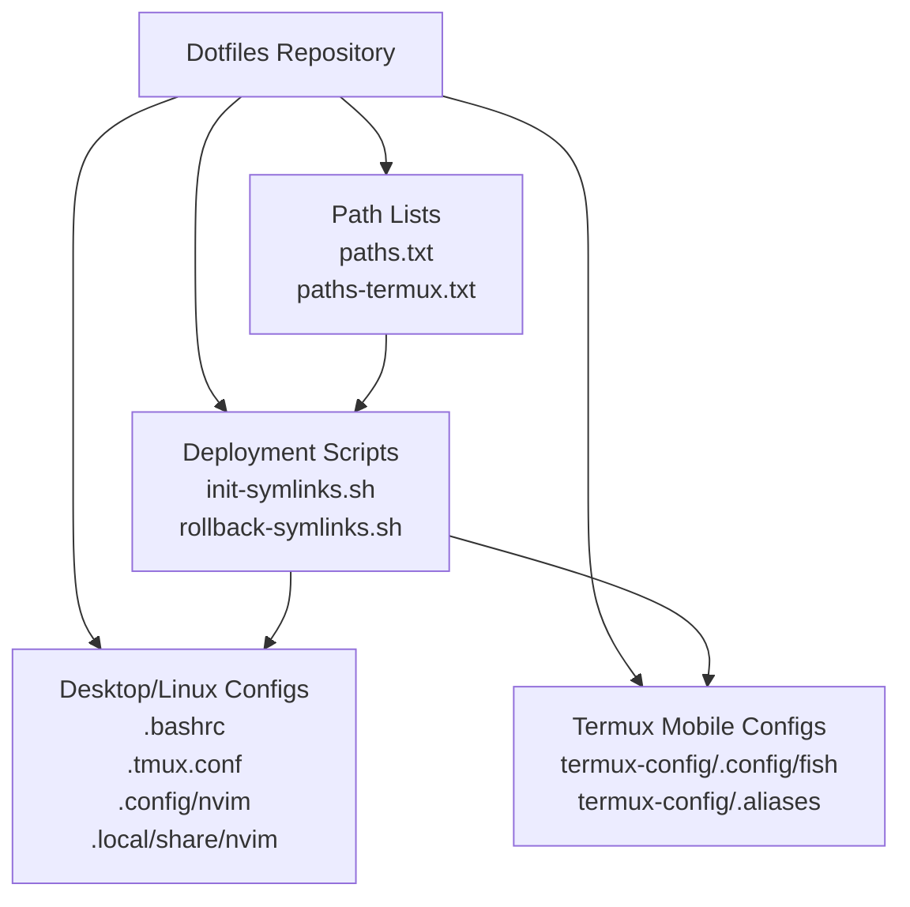
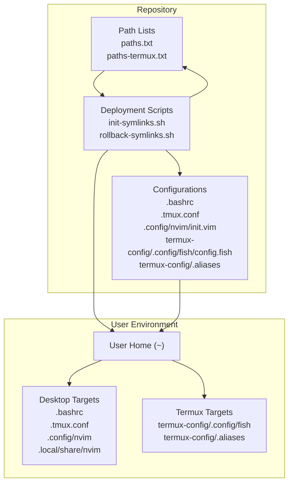
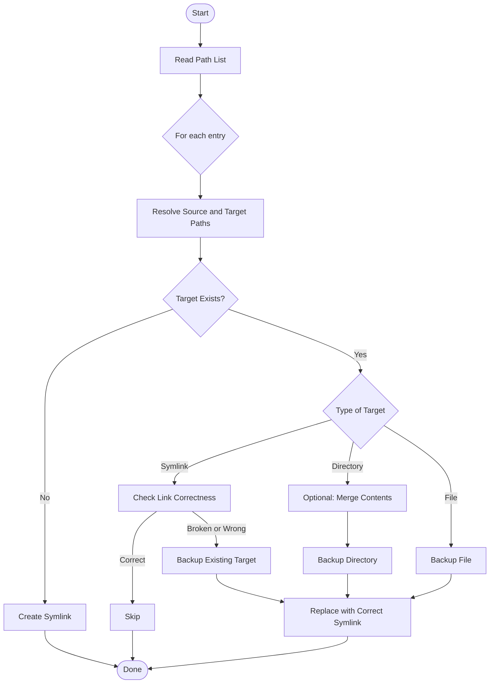
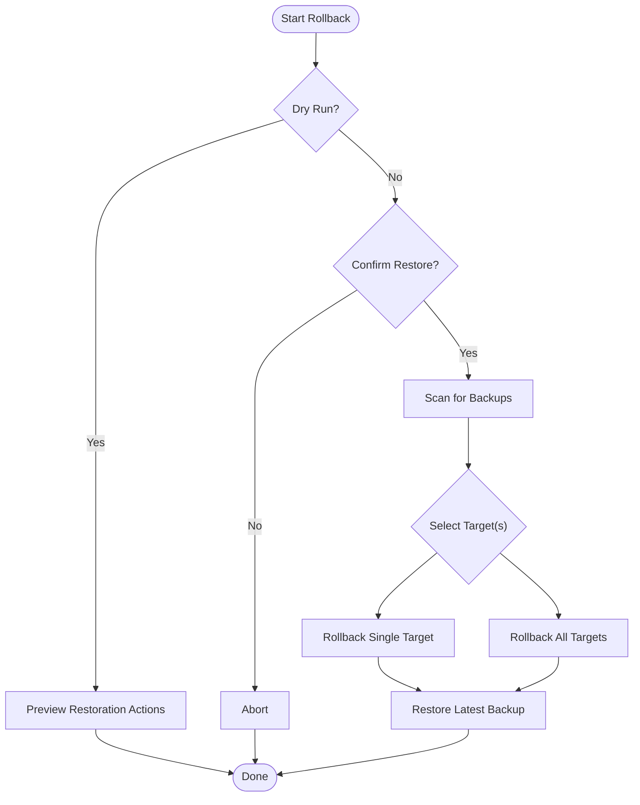
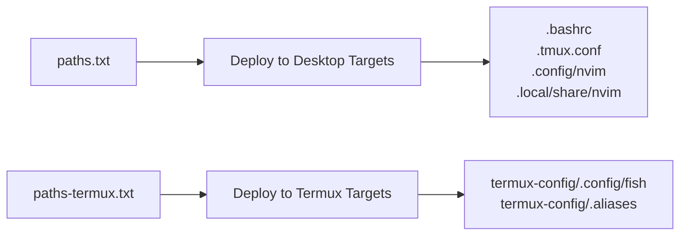
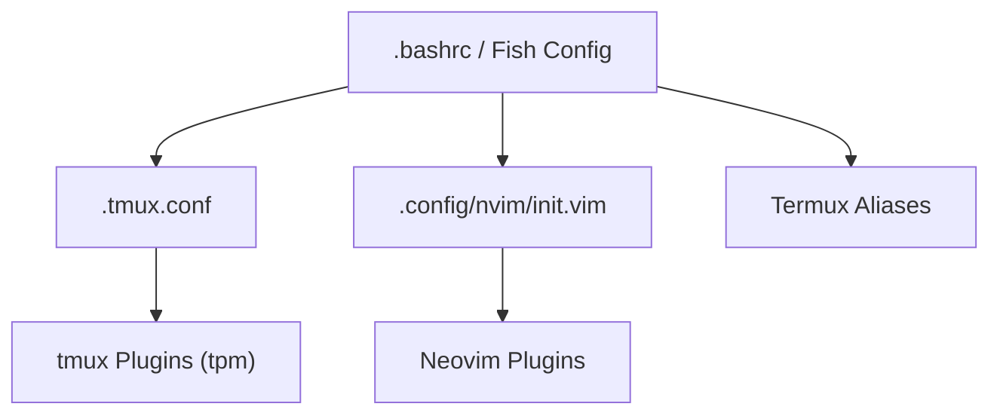
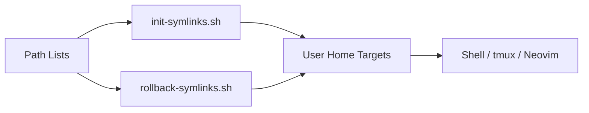

# Project Overview

<cite>
**Referenced Files in This Document**
- [README.md](file://README.md)
- [init-symlinks.sh](file://init-symlinks.sh)
- [rollback-symlinks.sh](file://rollback-symlinks.sh)
- [paths.txt](file://paths.txt)
- [paths-termux.txt](file://paths-termux.txt)
- [.bashrc](file://.bashrc)
- [.tmux.conf](file://.tmux.conf)
- [.config/nvim/init.vim](file://.config/nvim/init.vim)
- [termux-config/.config/fish/config.fish](file://termux-config/.config/fish/config.fish)
- [termux-config/.aliases](file://termux-config/.aliases)
</cite>

## Table of Contents
1. [Introduction](#introduction)
2. [Project Structure](#project-structure)
3. [Core Components](#core-components)
4. [Architecture Overview](#architecture-overview)
5. [Detailed Component Analysis](#detailed-component-analysis)
6. [Dependency Analysis](#dependency-analysis)
7. [Performance Considerations](#performance-considerations)
8. [Troubleshooting Guide](#troubleshooting-guide)
9. [Conclusion](#conclusion)

## Introduction
This dotfiles project is a centralized configuration management system designed to deliver a consistent, portable, and automated development environment across platforms. Its primary goal is to simplify setup and maintenance of cross-platform developer environments by using symlink deployment to place configuration files exactly where operating systems and tools expect them. The system supports desktop/Linux and Termux/mobile setups, enabling a unified workflow whether you are on a traditional desktop or a mobile device.

Key aspects:
- Centralized dotfiles repository with symlink-based deployment to user home directories
- Cross-platform configurations for desktop/Linux and Termux/mobile
- Integrated development environment setup for shells, tmux, Neovim, and related plugins
- Automated symlink creation and safe rollback mechanisms to protect user data
- Practical deployment workflow with minimal manual steps

## Project Structure
The repository organizes configuration files by target location and platform:
- Root-level dotfiles (e.g., shell startup files, tmux configuration)
- Platform-specific directories (e.g., termux-config/) for mobile environments
- Application-specific directories under ~/.config and ~/.local/share for modern Linux conventions
- Scripts for symlink deployment and rollback

**Diagram sources**
- [paths.txt](file://paths.txt#L1-L16)
- [paths-termux.txt](file://paths-termux.txt#L1-L12)
- [init-symlinks.sh](file://init-symlinks.sh#L288-L294)
- [rollback-symlinks.sh](file://rollback-symlinks.sh#L173-L209)

**Section sources**
- [paths.txt](file://paths.txt#L1-L16)
- [paths-termux.txt](file://paths-termux.txt#L1-L12)
- [init-symlinks.sh](file://init-symlinks.sh#L288-L294)
- [rollback-symlinks.sh](file://rollback-symlinks.sh#L173-L209)

## Core Components
- Symlink deployment engine: A robust Bash script orchestrates symlink creation, handles existing targets safely, and supports batch operation and interactive prompts.
- Rollback engine: A companion script discovers backups and restores previous states with dry-run previews and selective restoration.
- Path lists: Two curated lists define which files/directories to deploy for desktop/Linux and Termux/mobile contexts.
- Shell and editor integrations: Shell startup files, tmux configuration, and Neovim configuration demonstrate a cohesive IDE setup with plugins and productivity enhancements.
- Cross-platform configurations: Separate directories and path lists enable tailored setups for desktop and mobile environments.

Practical outcomes:
- Consistent environment across machines and OS variants
- Rapid provisioning with minimal manual intervention
- Safe, reversible changes with automated backup detection and restoration

**Section sources**
- [init-symlinks.sh](file://init-symlinks.sh#L1-L347)
- [rollback-symlinks.sh](file://rollback-symlinks.sh#L1-L316)
- [paths.txt](file://paths.txt#L1-L16)
- [paths-termux.txt](file://paths-termux.txt#L1-L12)
- [.bashrc](file://.bashrc#L1-L343)
- [.tmux.conf](file://.tmux.conf#L1-L69)
- [.config/nvim/init.vim](file://.config/nvim/init.vim#L1-L352)
- [termux-config/.config/fish/config.fish](file://termux-config/.config/fish/config.fish#L1-L184)
- [termux-config/.aliases](file://termux-config/.aliases#L1-L550)

## Architecture Overview
The system’s architecture centers on symlink deployment and cross-platform configuration management:

How it works conceptually:
- The symlink deployment script reads a path list, resolves source and target locations, and creates or updates symlinks while backing up existing targets.
- The rollback script scans for timestamped backups and restores them selectively or en masse.
- Path lists separate desktop/Linux and Termux targets, ensuring appropriate configurations are applied per platform.

**Diagram sources**
- [paths.txt](file://paths.txt#L1-L16)
- [paths-termux.txt](file://paths-termux.txt#L1-L12)
- [init-symlinks.sh](file://init-symlinks.sh#L288-L294)
- [rollback-symlinks.sh](file://rollback-symlinks.sh#L69-L97)

**Section sources**
- [README.md](file://README.md#L7-L18)
- [init-symlinks.sh](file://init-symlinks.sh#L288-L294)
- [rollback-symlinks.sh](file://rollback-symlinks.sh#L69-L97)

## Detailed Component Analysis

### Symlink Deployment Engine
The deployment engine automates symlink creation with safety checks and backups:
- Reads a path list file and processes each entry
- Resolves absolute source and target paths, accounting for platform-specific prefixes
- Handles existing targets: broken symlinks, correct symlinks, directories, and regular files
- Creates backups with timestamps and offers interactive prompts or batch mode
- Supports merging directory contents before replacing with symlinks

**Diagram sources**
- [init-symlinks.sh](file://init-symlinks.sh#L250-L286)
- [init-symlinks.sh](file://init-symlinks.sh#L116-L223)

**Section sources**
- [init-symlinks.sh](file://init-symlinks.sh#L1-L347)
- [paths.txt](file://paths.txt#L1-L16)
- [paths-termux.txt](file://paths-termux.txt#L1-L12)

### Rollback Engine
The rollback engine provides safe recovery:
- Scans for timestamped backups under the home directory
- Finds the latest backup for a given target or a specific date
- Offers dry-run previews and selective restoration
- Confirms destructive operations in non-dry modes

**Diagram sources**
- [rollback-symlinks.sh](file://rollback-symlinks.sh#L246-L312)
- [rollback-symlinks.sh](file://rollback-symlinks.sh#L69-L97)

**Section sources**
- [rollback-symlinks.sh](file://rollback-symlinks.sh#L1-L316)

### Cross-Platform Configurations
- Desktop/Linux: Shell startup files, tmux configuration, Neovim configuration, and related directories are deployed to standard locations.
- Termux/mobile: Separate path list and configuration directory tailor the environment for mobile devices, including Fish shell prompt and aliases optimized for Termux.

**Diagram sources**
- [paths.txt](file://paths.txt#L1-L16)
- [paths-termux.txt](file://paths-termux.txt#L1-L12)

**Section sources**
- [paths.txt](file://paths.txt#L1-L16)
- [paths-termux.txt](file://paths-termux.txt#L1-L12)
- [.bashrc](file://.bashrc#L1-L343)
- [.tmux.conf](file://.tmux.conf#L1-L69)
- [.config/nvim/init.vim](file://.config/nvim/init.vim#L1-L352)
- [termux-config/.config/fish/config.fish](file://termux-config/.config/fish/config.fish#L1-L184)
- [termux-config/.aliases](file://termux-config/.aliases#L1-L550)

### Integrated Development Environment Setup
The repository integrates essential developer tools:
- Shell: Customized prompt, PATH management, and environment hooks
- Terminal multiplexer: tmux configuration with plugin manager and sensible defaults
- Editor: Neovim configuration with plugin ecosystem and productivity features
- Mobile shell: Fish prompt and aliases optimized for Termux

**Diagram sources**
- [.bashrc](file://.bashrc#L1-L343)
- [.tmux.conf](file://.tmux.conf#L1-L69)
- [.config/nvim/init.vim](file://.config/nvim/init.vim#L1-L352)
- [termux-config/.config/fish/config.fish](file://termux-config/.config/fish/config.fish#L1-L184)
- [termux-config/.aliases](file://termux-config/.aliases#L1-L550)

**Section sources**
- [.bashrc](file://.bashrc#L1-L343)
- [.tmux.conf](file://.tmux.conf#L1-L69)
- [.config/nvim/init.vim](file://.config/nvim/init.vim#L1-L352)
- [termux-config/.config/fish/config.fish](file://termux-config/.config/fish/config.fish#L1-L184)
- [termux-config/.aliases](file://termux-config/.aliases#L1-L550)

## Dependency Analysis
The deployment pipeline depends on:
- Path lists to define which files/directories to deploy
- Deployment and rollback scripts to manage symlinks and backups
- Target applications (shell, tmux, Neovim) to consume the configurations

**Diagram sources**
- [paths.txt](file://paths.txt#L1-L16)
- [paths-termux.txt](file://paths-termux.txt#L1-L12)
- [init-symlinks.sh](file://init-symlinks.sh#L288-L294)
- [rollback-symlinks.sh](file://rollback-symlinks.sh#L173-L209)

**Section sources**
- [paths.txt](file://paths.txt#L1-L16)
- [paths-termux.txt](file://paths-termux.txt#L1-L12)
- [init-symlinks.sh](file://init-symlinks.sh#L288-L294)
- [rollback-symlinks.sh](file://rollback-symlinks.sh#L173-L209)

## Performance Considerations
- Symlink deployment is efficient and fast, with minimal overhead compared to copying files
- Backup detection and restoration leverage filesystem metadata and timestamp patterns
- Path lists keep the deployment scope predictable and maintainable
- For large repositories, consider splitting path lists further to reduce unnecessary operations

## Troubleshooting Guide
Common scenarios and resolutions:
- Broken or incorrect symlinks: The deployment script detects and replaces them after backing up the existing target
- Existing directories: The script can merge contents into the repository before replacing with a symlink
- Interactive vs. batch mode: Use the batch flag to automate deployments without prompts
- Rollback previews: Use dry-run mode to preview changes before applying
- Selective restoration: Restore specific targets or specific dates using targeted options

Operational tips:
- Review backup timestamps to choose the correct restoration point
- Confirm destructive operations in non-dry runs before proceeding
- Validate path lists for correctness and platform-appropriate entries

**Section sources**
- [init-symlinks.sh](file://init-symlinks.sh#L116-L223)
- [rollback-symlinks.sh](file://rollback-symlinks.sh#L246-L312)

## Conclusion
This dotfiles project provides a robust, cross-platform configuration management system centered on symlink deployment and safe rollback. It enables rapid, repeatable setup of integrated development environments across desktop/Linux and Termux/mobile contexts. By combining curated path lists, automation scripts, and platform-aware configurations, it delivers a scalable and reliable foundation for consistent developer workflows.