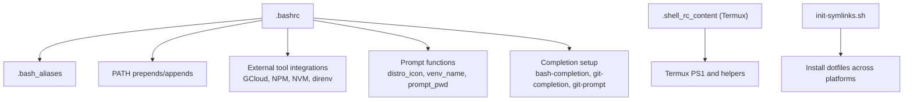
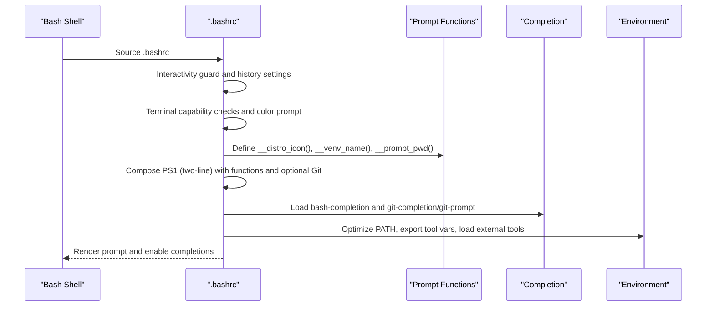
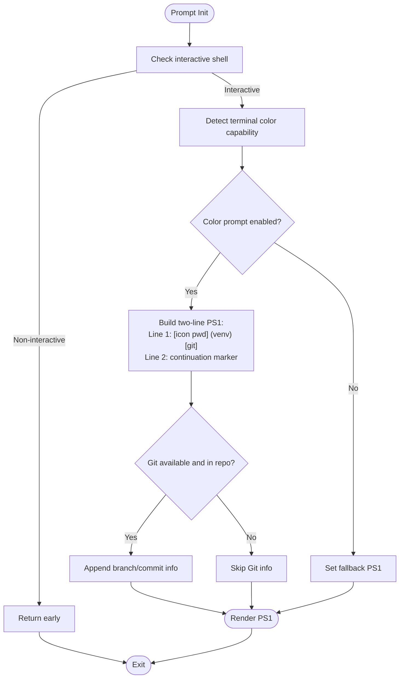
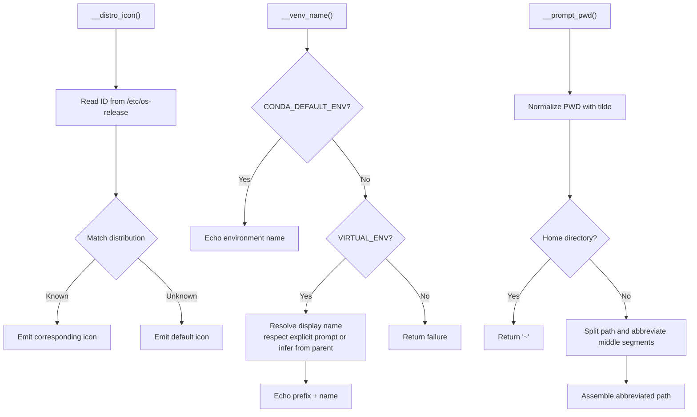
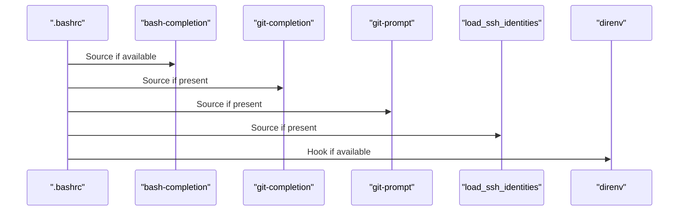
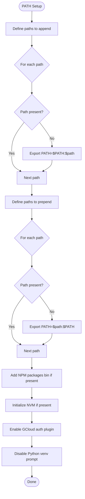
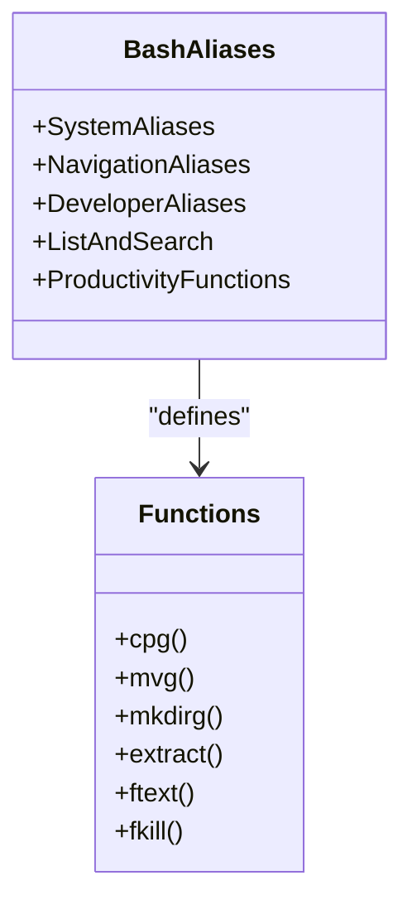
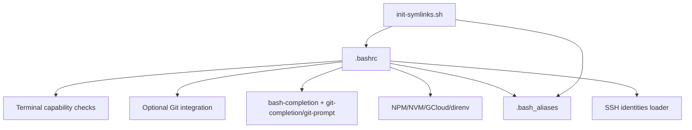

# Bash Configuration

<cite>
**Referenced Files in This Document**
- [.bashrc](file://.bashrc)
- [.bash_aliases](file://.bash_aliases)
- [.shell_rc_content](file://termux-config/.shell_rc_content)
- [.bashrc (Termux)](file://termux-config/.bashrc)
- [init-symlinks.sh](file://init-symlinks.sh)
- [README.md](file://README.md)
</cite>

## Table of Contents
1. [Introduction](#introduction)
2. [Project Structure](#project-structure)
3. [Core Components](#core-components)
4. [Architecture Overview](#architecture-overview)
5. [Detailed Component Analysis](#detailed-component-analysis)
6. [Dependency Analysis](#dependency-analysis)
7. [Performance Considerations](#performance-considerations)
8. [Troubleshooting Guide](#troubleshooting-guide)
9. [Conclusion](#conclusion)
10. [Appendices](#appendices)

## Introduction
This document explains the Bash configuration tailored for desktop Linux environments, focusing on a robust and extensible .bashrc setup. It covers:
- Two-line custom prompt with distro icons, virtual environment detection, and optional Git branch/status integration
- Terminal capability-aware color handling and PS1 composition
- Environment variable management, PATH optimization with prepend/append logic
- External tool integration for Google Cloud SDK, NPM packages, and NVM
- Practical aliases, completion setup, SSH identity loading, and security considerations
- Performance optimizations, compatibility checks, and troubleshooting

## Project Structure
The Bash configuration is organized around a primary .bashrc and a companion .bash_aliases file. A Termux-specific variant exists under termux-config for mobile/desktop parity. A symlink management script automates installation of dotfiles across platforms.

**Diagram sources**
- [.bashrc](file://.bashrc#L1-L343)
- [.bash_aliases](file://.bash_aliases#L1-L196)
- [.shell_rc_content](file://termux-config/.shell_rc_content#L1-L135)
- [init-symlinks.sh](file://init-symlinks.sh#L1-L347)

**Section sources**
- [.bashrc](file://.bashrc#L1-L343)
- [.bash_aliases](file://.bash_aliases#L1-L196)
- [.shell_rc_content](file://termux-config/.shell_rc_content#L1-L135)
- [init-symlinks.sh](file://init-symlinks.sh#L1-L347)
- [README.md](file://README.md#L1-L35)

## Core Components
- Interactivity guard and history tuning
- Color prompt detection and terminal title integration
- Custom prompt functions for distro icon, virtualenv name, and abbreviated path
- Two-line prompt assembly with optional Git integration
- Completion subsystem initialization
- Environment variable management and PATH optimization
- External tool integrations (GCloud, NPM packages, NVM, direnv)
- Aliases and convenience functions for navigation, system info, and developer workflows

**Section sources**
- [.bashrc](file://.bashrc#L5-L343)

## Architecture Overview
The Bash runtime initializes by sourcing .bashrc for non-login shells. It performs capability checks, sets up prompt functions, compiles a two-line prompt, and then configures environment and tool integrations. Aliases and functions augment productivity and safety.

**Diagram sources**
- [.bashrc](file://.bashrc#L5-L343)

## Detailed Component Analysis

### Prompt System and Two-Line Architecture
- Interactivity guard ensures non-interactive shells skip expensive setup.
- Color prompt detection validates terminal capabilities and sets a color-enabled PS1.
- Two-line prompt:
  - Line 1: [distro_icon] (abbreviated path) (virtualenv) [optional Git branch/status]
  - Line 2: Continuation marker with appropriate color
- Terminal title integration updates the xterm/RXVT titlebar to include user, host, and working directory.
- Optional Git integration appends branch or commit information when inside a Git repository and git is available.

**Diagram sources**
- [.bashrc](file://.bashrc#L5-L205)

**Section sources**
- [.bashrc](file://.bashrc#L5-L205)

### Prompt Functions
- Distro icon detection reads os-release and maps to Unicode icons for common distributions.
- Virtual environment detection supports Conda and standard virtualenv, with logic to derive meaningful names from directory structures.
- Path abbreviation mirrors fish’s prompt_pwd behavior, abbreviating intermediate directories while preserving the first and last segments.

**Diagram sources**
- [.bashrc](file://.bashrc#L55-L169)

**Section sources**
- [.bashrc](file://.bashrc#L55-L169)

### Completion and Tooling
- Programmable completion is enabled by sourcing bash-completion if available.
- Git completion and prompt scripts are conditionally sourced if present.
- SSH identities are loaded via a helper script if present.
- GCloud auth plugin is enabled for Kubernetes contexts.
- direnv integration is enabled when available.

**Diagram sources**
- [.bashrc](file://.bashrc#L218-L341)

**Section sources**
- [.bashrc](file://.bashrc#L218-L341)

### Environment Variables and PATH Management
- PATH optimization:
  - Appends system administrative binaries (e.g., /usr/sbin, /sbin) if missing
  - Prepends user-local and tool-specific directories (e.g., ~/.local/bin, ~/.cargo/bin)
- NPM packages directory is added to PATH if present
- NVM is initialized if present, enabling Node.js version management
- GCloud-specific environment variables are exported for modern kube auth behavior
- Python virtualenv prompt is disabled to avoid duplication with the custom prompt

**Diagram sources**
- [.bashrc](file://.bashrc#L283-L321)
- [.bashrc](file://.bashrc#L323-L335)

**Section sources**
- [.bashrc](file://.bashrc#L283-L335)

### Aliases and Functions
- System safety and ergonomics: interactive rm/cp/mv, mkdir with parent creation, convenient navigation shortcuts
- Developer-centric aliases: Git shortcuts, fzf-powered file selection and editor launching
- File listing and search: dircolors-aware ls with eza fallback, bat/batcat integration, grep colorization
- Productivity functions: copy+go, move+go, mkdir+go, archive extraction with progress, text search across files, interactive process killer with fzf

**Diagram sources**
- [.bash_aliases](file://.bash_aliases#L1-L196)

**Section sources**
- [.bash_aliases](file://.bash_aliases#L1-L196)

### Termux Variant
- Lightweight PS1 with distro icon and current working directory
- FZF color overrides and convenience aliases
- Apt wrapper that prefers nala with fallback to apt

**Section sources**
- [.shell_rc_content](file://termux-config/.shell_rc_content#L1-L135)
- [.bashrc (Termux)](file://termux-config/.bashrc#L1-L38)

## Dependency Analysis
- .bashrc depends on:
  - Terminal capability detection for color prompt
  - Presence of git for optional Git integration
  - Availability of bash-completion and optional git-completion/git-prompt
  - Optional presence of NPM packages, NVM, and direnv
  - Optional presence of SSH identity loader script
- .bash_aliases augments .bashrc with productivity-focused aliases and functions
- init-symlinks.sh coordinates installation of dotfiles across platforms, ensuring correct symlink targets

**Diagram sources**
- [.bashrc](file://.bashrc#L1-L343)
- [.bash_aliases](file://.bash_aliases#L1-L196)
- [init-symlinks.sh](file://init-symlinks.sh#L1-L347)

**Section sources**
- [.bashrc](file://.bashrc#L1-L343)
- [.bash_aliases](file://.bash_aliases#L1-L196)
- [init-symlinks.sh](file://init-symlinks.sh#L1-L347)

## Performance Considerations
- Conditional checks: Git integration is gated behind availability checks to avoid overhead in non-Git directories.
- Prompt functions keep logic minimal and avoid heavy subprocess calls; path abbreviation avoids unnecessary expansions.
- History tuning reduces duplicates and controls history size to keep shell responsive.
- PATH optimization avoids redundant prepends/appends and only exports when necessary.
- Completion is loaded once and only when available.

[No sources needed since this section provides general guidance]

## Troubleshooting Guide
Common issues and resolutions:
- Prompt not colored or garbled:
  - Verify TERM type and color capability checks; ensure the terminal supports 256-color or xterm-color.
  - Confirm escape sequences are preserved in PS1 by using proper bracketing for non-printing sequences.
- Virtual environment not indicated:
  - Ensure VIRTUAL_ENV or CONDA_DEFAULT_ENV is set and exported in the environment.
  - Disable Python’s built-in virtualenv prompt to prevent duplication.
- Git branch/status not shown:
  - Confirm git is installed and available on PATH.
  - Ensure git-completion and/or git-prompt are sourced if desired.
- PATH changes not taking effect:
  - Confirm prepend/append logic runs and exports PATH.
  - Check for conflicting environment modifications in other startup files.
- SSH identities not loaded:
  - Verify the identity loader script exists and is executable.
- External tools not available:
  - Confirm NPM packages directory, NVM, or GCloud are installed and initialized as configured.

**Section sources**
- [.bashrc](file://.bashrc#L40-L53)
- [.bashrc](file://.bashrc#L186-L189)
- [.bashrc](file://.bashrc#L283-L335)
- [.bashrc](file://.bashrc#L277-L280)

## Conclusion
This Bash configuration delivers a modern, efficient, and extensible shell experience for desktop Linux. It combines a two-line prompt with distro awareness, virtual environment visibility, and optional Git integration, while maintaining robust PATH management and external tool integrations. The included aliases and functions improve daily workflows, and the setup remains portable across platforms with the provided symlink management script.

[No sources needed since this section summarizes without analyzing specific files]

## Appendices

### Installation and Setup
- Use the symlink manager to install dotfiles across platforms, backing up existing files and handling conflicts.
- Ensure required tools are installed as outlined in the project README.

**Section sources**
- [init-symlinks.sh](file://init-symlinks.sh#L1-L347)
- [README.md](file://README.md#L7-L35)