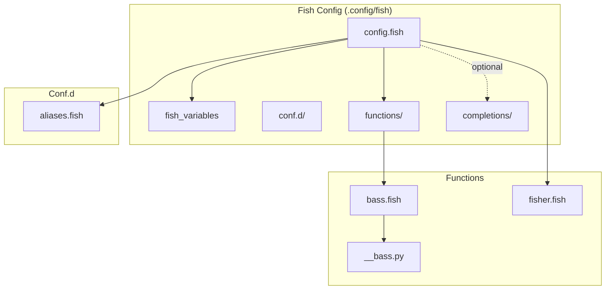
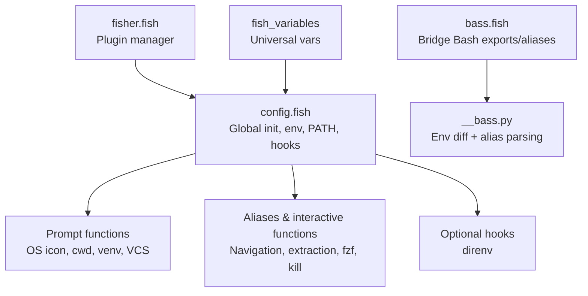
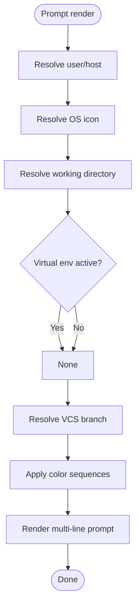
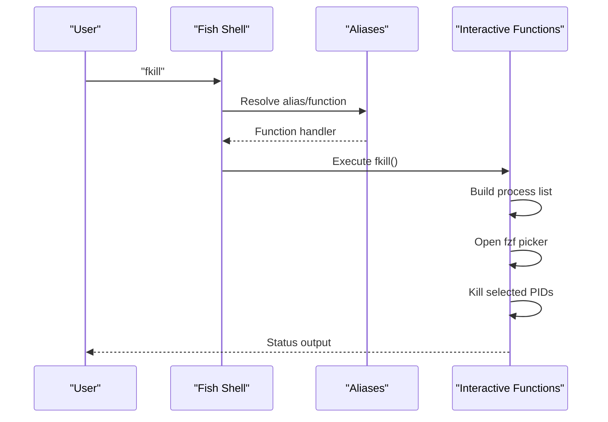
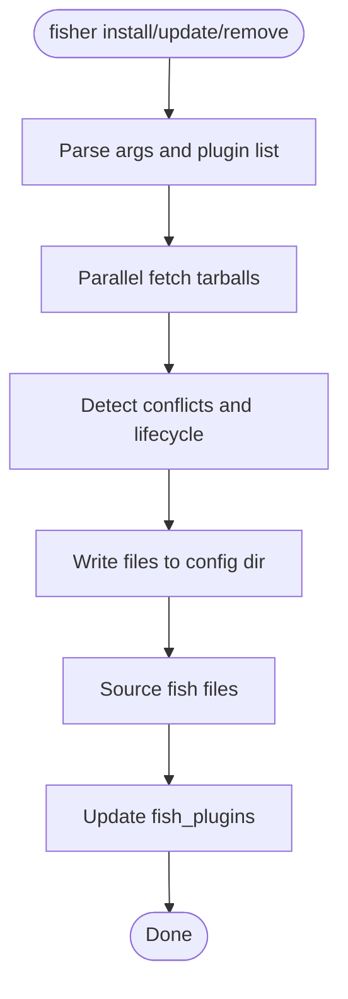
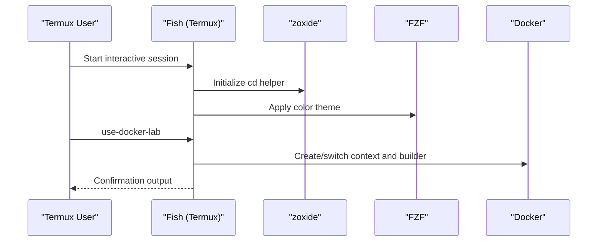
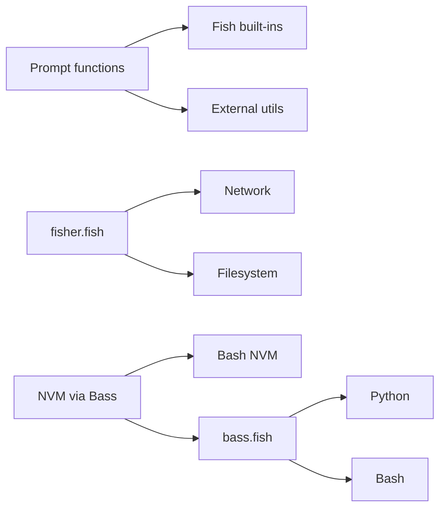

# Fish Shell Configuration

<cite>
**Referenced Files in This Document**
- [config.fish](file://.config/fish/config.fish)
- [aliases.fish](file://.config/fish/conf.d/aliases.fish)
- [fish_variables](file://.config/fish/fish_variables)
- [bass.fish](file://.config/fish/functions/bass.fish)
- [__bass.py](file://.config/fish/functions/__bass.py)
- [fisher.fish](file://.config/fish/functions/fisher.fish)
- [termux-config.fish](file://termux-config/.config/fish/config.fish)
- [termux-aliases.fish](file://termux-config/.config/fish/conf.d/aliases.fish)
- [termux-shell_rc_content.fish](file://termux-config/.config/fish/conf.d/shell_rc_content.fish)
</cite>

## Update Summary
**Changes Made**
- Updated NVM management section to reflect complete overhaul from custom Fish functions to bass integration approach
- Removed references to deprecated NVM-related functions (_nvm_index_update.fish, _nvm_list.fish, _nvm_version_activate.fish, _nvm_version_deactivate.fish)
- Updated architecture diagrams to show new bass-based NVM implementation
- Revised NVM configuration examples to demonstrate bass wrapper pattern
- Enhanced cross-shell bridge documentation with practical NVM integration examples

## Table of Contents
1. [Introduction](#introduction)
2. [Project Structure](#project-structure)
3. [Core Components](#core-components)
4. [Architecture Overview](#architecture-overview)
5. [Detailed Component Analysis](#detailed-component-analysis)
6. [Dependency Analysis](#dependency-analysis)
7. [Performance Considerations](#performance-considerations)
8. [Troubleshooting Guide](#troubleshooting-guide)
9. [Conclusion](#conclusion)
10. [Appendices](#appendices)

## Introduction
This document explains the Fish shell configuration in this repository, focusing on modern shell features and an enhanced user experience. It covers Fish-specific architecture (universal variables, functions, and completions), a custom prompt with Unicode symbols and dynamic content, the alias and function ecosystem, interactive enhancements, and practical examples of autosuggestions, syntax highlighting, and theme integration. It also highlights Fish's advantages over traditional shells, configuration best practices, and migration considerations from other environments.

## Project Structure
The Fish configuration is organized under .config/fish with three primary areas:
- Root configuration: global initialization, environment variables, PATH manipulation, and optional hooks
- Functions: reusable logic for tasks like plugin management, and bridging Bash utilities
- Conf.d: modular aliases and interactive session setup
- Universal variables: cross-session persisted variables



**Diagram sources**
- [.config/fish/config.fish](file://.config/fish/config.fish#L1-L179)
- [.config/fish/fish_variables](file://.config/fish/fish_variables#L1-L5)
- [.config/fish/functions/bass.fish](file://.config/fish/functions/bass.fish#L1-L30)
- [.config/fish/functions/__bass.py](file://.config/fish/functions/__bass.py#L1-L141)
- [.config/fish/functions/fisher.fish](file://.config/fish/functions/fisher.fish#L1-L241)
- [.config/fish/conf.d/aliases.fish](file://.config/fish/conf.d/aliases.fish#L1-L148)

**Section sources**
- [.config/fish/config.fish](file://.config/fish/config.fish#L1-L179)
- [.config/fish/fish_variables](file://.config/fish/fish_variables#L1-L5)
- [.config/fish/conf.d/aliases.fish](file://.config/fish/conf.d/aliases.fish#L1-L148)
- [.config/fish/functions/bass.fish](file://.config/fish/functions/bass.fish#L1-L30)
- [.config/fish/functions/__bass.py](file://.config/fish/functions/__bass.py#L1-L141)
- [.config/fish/functions/fisher.fish](file://.config/fish/functions/fisher.fish#L1-L241)

## Core Components
- Universal variables: Persisted across sessions for environment and runtime state
- Prompt customization: Dynamic, colored prompt with OS icon, working directory, virtual environment, and VCS info
- Aliases and interactive functions: Streamlined navigation, file operations, and developer-centric helpers
- Environment and PATH management: Consistent prepending/appending with safety checks
- Optional hooks: Integration with direnv and other tools
- Plugin management: First-party plugin manager for Fish
- Cross-shell bridge: Bass enables sourcing Bash-side exports and aliases into Fish

**Section sources**
- [.config/fish/config.fish](file://.config/fish/config.fish#L112-L179)
- [.config/fish/fish_variables](file://.config/fish/fish_variables#L1-L5)
- [.config/fish/conf.d/aliases.fish](file://.config/fish/conf.d/aliases.fish#L1-L148)
- [.config/fish/functions/bass.fish](file://.config/fish/functions/bass.fish#L1-L30)
- [.config/fish/functions/fisher.fish](file://.config/fish/functions/fisher.fish#L1-L241)

## Architecture Overview
The Fish configuration composes modular pieces:
- Global initialization sets environment variables, PATH, and optional hooks
- Prompt functions compute dynamic segments and render Unicode glyphs
- Functions encapsulate complex logic (plugin management, cross-shell bridging)
- Conf.d files provide aliases and interactive session setup
- Universal variables persist state across sessions



**Diagram sources**
- [.config/fish/config.fish](file://.config/fish/config.fish#L1-L179)
- [.config/fish/functions/bass.fish](file://.config/fish/functions/bass.fish#L1-L30)
- [.config/fish/functions/__bass.py](file://.config/fish/functions/__bass.py#L1-L141)
- [.config/fish/functions/fisher.fish](file://.config/fish/functions/fisher.fish#L1-L241)
- [.config/fish/fish_variables](file://.config/fish/fish_variables#L1-L5)

## Detailed Component Analysis

### Universal Variables
- Purpose: Persist environment and runtime state across Fish sessions
- Example: Terminal type and initialization marker are exported as universal variables
- Best practice: Keep universal variables minimal and documented; prefer local variables inside functions unless truly global

**Section sources**
- [.config/fish/fish_variables](file://.config/fish/fish_variables#L1-L5)

### Prompt Implementation
- Dynamic segments:
  - OS icon derived from /etc/os-release
  - Current working directory
  - Active virtual environment or Conda environment
  - VCS branch indicator
- Rendering:
  - Uses Fish color sequences for bold, foreground/background hues
  - Unicode glyphs for icons and separators
- Conditional formatting:
  - Environment detection influences prompt content and style
  - VCS prompt integrates with Fish's built-in VCS support



**Diagram sources**
- [.config/fish/config.fish](file://.config/fish/config.fish#L84-L109)

**Section sources**
- [.config/fish/config.fish](file://.config/fish/config.fish#L15-L109)

### Aliases and Interactive Functions
- System and navigation aliases for safer defaults and ergonomic shortcuts
- Developer-centric functions:
  - Archive extraction with progress
  - Text search across files
  - Interactive process killer using fzf
  - fzf-powered file pickers with syntax-highlighted previews



**Diagram sources**
- [.config/fish/conf.d/aliases.fish](file://.config/fish/conf.d/aliases.fish#L109-L141)

**Section sources**
- [.config/fish/conf.d/aliases.fish](file://.config/fish/conf.d/aliases.fish#L1-L148)

### Cross-Shell Bridge (Bass)
- Purpose: Import Bash exports and aliases into Fish
- Mechanism:
  - Fish function invokes a Python helper to compute environment diffs and alias definitions
  - Emits Fish-native set/unset commands and alias statements
- Usage: Wrap Bash invocations to source environment and aliases into Fish

**Updated** The NVM management system now uses bass to source the standard Bash NVM implementation directly, eliminating the need for custom Fish functions.

```mermaid
sequenceDiagram
participant Fish as "Fish"
participant Bass as "bass.fish"
participant Py as "__bass.py"
participant Bash as "Bash"
participant NVM as "NVM (Bash)"
Fish->>Bass : bass source $NVM_DIR/nvm.sh ';' nvm $argv
Bass->>Py : Invoke with args
Py->>Bash : Run eval + env reader
Bash->>NVM : Source nvm.sh and execute commands
NVM-->>Bash : Exported variables and aliases
Bash-->>Py : New env + alias dump
Py-->>Bass : Script with set/unset/alias
Bass->>Fish : source temporary script
Fish-->>Fish : Imported NVM functionality
```

**Diagram sources**
- [.config/fish/functions/bass.fish](file://.config/fish/functions/bass.fish#L1-L30)
- [.config/fish/functions/__bass.py](file://.config/fish/functions/__bass.py#L53-L121)

**Section sources**
- [.config/fish/config.fish](file://.config/fish/config.fish#L148-L167)
- [.config/fish/functions/bass.fish](file://.config/fish/functions/bass.fish#L1-L30)
- [.config/fish/functions/__bass.py](file://.config/fish/functions/__bass.py#L1-L141)

### Plugin Management (Fisher)
- Purpose: Manage Fish plugins from GitHub/GitLab with a single command
- Capabilities:
  - Install/update/remove plugins
  - Parallel fetching and conflict detection
  - Automatic sourcing of fish files and emitting lifecycle events
- Behavior:
  - Persists plugin file lists in universal variables
  - Maintains a fish_plugins file for declarative management



**Diagram sources**
- [.config/fish/functions/fisher.fish](file://.config/fish/functions/fisher.fish#L22-L224)

**Section sources**
- [.config/fish/functions/fisher.fish](file://.config/fish/functions/fisher.fish#L1-L241)

### Optional Hooks and Environment
- direnv integration: Loads direnv-aware Fish hooks when available
- Terminal and environment tuning: Sets terminal capability and related flags
- PATH management: Safely appends/prepends directories with existence checks

**Section sources**
- [.config/fish/config.fish](file://.config/fish/config.fish#L112-L179)

### Termux-Specific Enhancements
- Prompt and environment tailored for Termux
- Additional aliases for Termux-specific paths and utilities
- Interactive session setup for zoxide and FZF color scheme
- Docker context helper for remote development workflows



**Diagram sources**
- [termux-config.fish](file://termux-config/.config/fish/config.fish#L102-L124)
- [termux-shell_rc_content.fish](file://termux-config/.config/fish/conf.d/shell_rc_content.fish#L1-L20)
- [termux-aliases.fish](file://termux-config/.config/fish/conf.d/aliases.fish#L104-L156)

**Section sources**
- [termux-config.fish](file://termux-config/.config/fish/config.fish#L1-L184)
- [termux-aliases.fish](file://termux-config/.config/fish/conf.d/aliases.fish#L1-L156)
- [termux-shell_rc_content.fish](file://termux-config/.config/fish/conf.d/shell_rc_content.fish#L1-L20)

## Dependency Analysis
- Prompt depends on:
  - Fish built-ins for colors and VCS integration
  - External utilities for OS identification and working directory
- Bass depends on:
  - Python interpreter presence
  - Bash compatibility for environment capture
- Fisher depends on:
  - Network access for plugin retrieval
  - Filesystem for plugin installation and sourcing



**Diagram sources**
- [.config/fish/config.fish](file://.config/fish/config.fish#L84-L109)
- [.config/fish/functions/bass.fish](file://.config/fish/functions/bass.fish#L1-L30)
- [.config/fish/functions/fisher.fish](file://.config/fish/functions/fisher.fish#L79-L115)

**Section sources**
- [.config/fish/config.fish](file://.config/fish/config.fish#L84-L179)
- [.config/fish/functions/bass.fish](file://.config/fish/functions/bass.fish#L1-L30)
- [.config/fish/functions/fisher.fish](file://.config/fish/functions/fisher.fish#L1-L241)

## Performance Considerations
- Minimize external calls in prompt: Heavy commands (e.g., VCS queries) should be cached or short-circuited when possible
- Use universal variables sparingly; keep only essential cross-session state
- Avoid repeated filesystem scans in aliases and functions; cache results when safe
- Use Fish's built-in color and string utilities to reduce subprocess usage
- Bass-based NVM integration eliminates redundant Fish function overhead by leveraging optimized Bash implementations

## Troubleshooting Guide
- Prompt rendering issues:
  - Verify terminal supports 256-color and Unicode glyphs
  - Check that Fish color sequences are supported by the terminal
- Bass errors:
  - Ensure Python is available and executable
  - Validate that Bash is installed and compatible
- Fisher conflicts:
  - Remove or relocate conflicting plugin files before re-install
  - Re-run update to reconcile fish_plugins
- NVM issues with bass integration:
  - Verify NVM installation exists at $HOME/.nvm/nvm.sh
  - Ensure bash compatibility and proper permissions
  - Test manual sourcing: bass source $HOME/.nvm/nvm.sh

**Section sources**
- [.config/fish/config.fish](file://.config/fish/config.fish#L112-L179)
- [.config/fish/functions/bass.fish](file://.config/fish/functions/bass.fish#L1-L30)
- [.config/fish/functions/fisher.fish](file://.config/fish/functions/fisher.fish#L169-L173)

## Conclusion
This Fish configuration demonstrates a modern, modular, and user-focused shell setup. It leverages Fish-specific strengths—functions, universal variables, and a powerful plugin ecosystem—while integrating cross-shell capabilities through bass. The prompt is expressive and informative, aliases streamline daily tasks, and interactive enhancements improve productivity. The recent NVM overhaul showcases best practices for integrating external tools through bass rather than maintaining custom wrappers. The included Termux configuration shows how to tailor the setup for mobile and containerized environments.

## Appendices

### Practical Examples
- Autosuggestions and syntax highlighting:
  - Enable Fish's built-in autosuggestion and syntax highlighting in your terminal emulator
  - Use theme-aware aliases for tools like bat and fzf to maintain consistent visuals
- Theme integration:
  - Align prompt colors with your terminal theme
  - Use FZF's configurable color options to match your palette
- Migration tips:
  - Convert Bash aliases to Fish equivalents; note Fish uses ; for chaining and and instead of &&
  - Replace eval with source for Fish scripts
  - Use fisher to manage Fish plugins; keep a fish_plugins file for reproducibility
  - For Bash-dependent tools, wrap them with bass to import environment and aliases
- NVM integration with bass:
  - The configuration demonstrates a clean wrapper pattern: `function nvm; bass source $NVM_DIR/nvm.sh --no-use ';' nvm $argv; end`
  - This approach leverages the mature Bash NVM implementation while maintaining Fish-native command syntax
  - Automatic default version loading ensures consistent Node.js environment across sessions