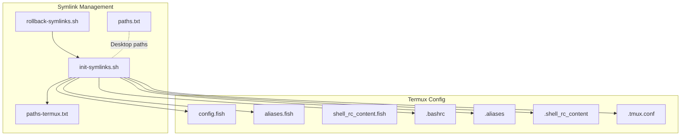
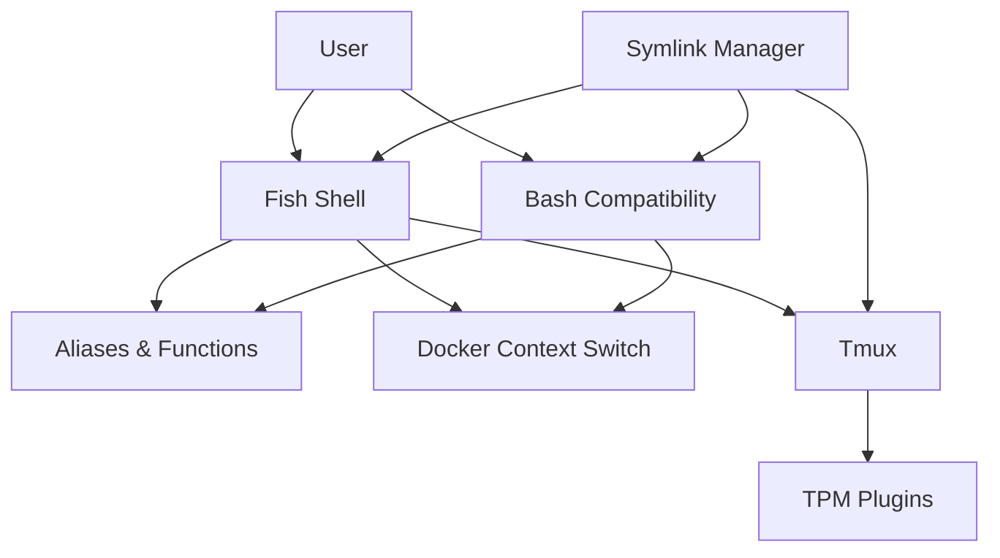
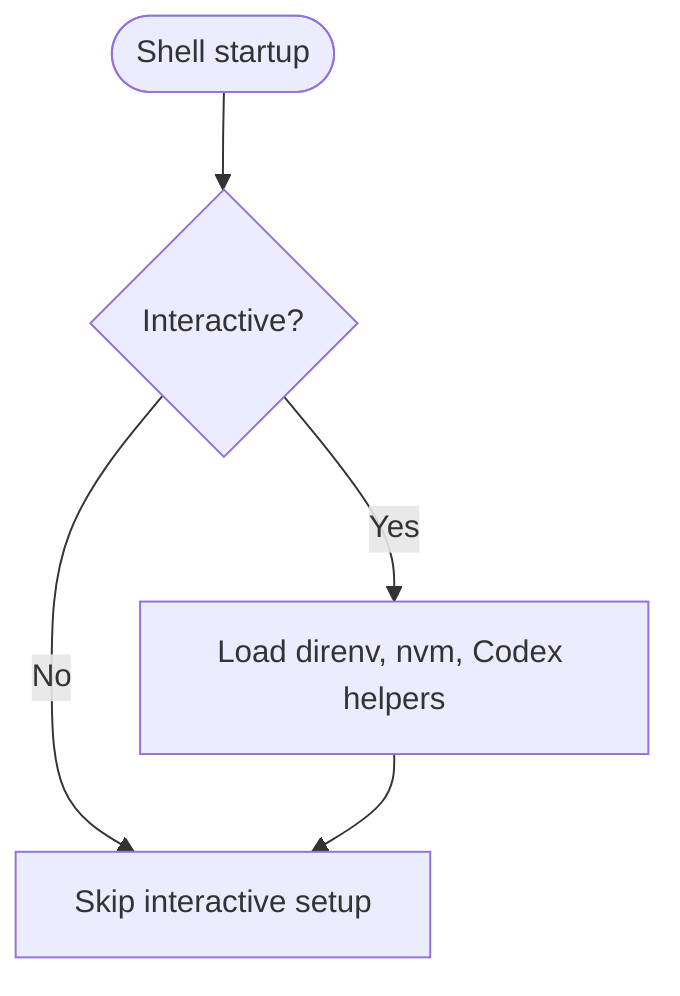
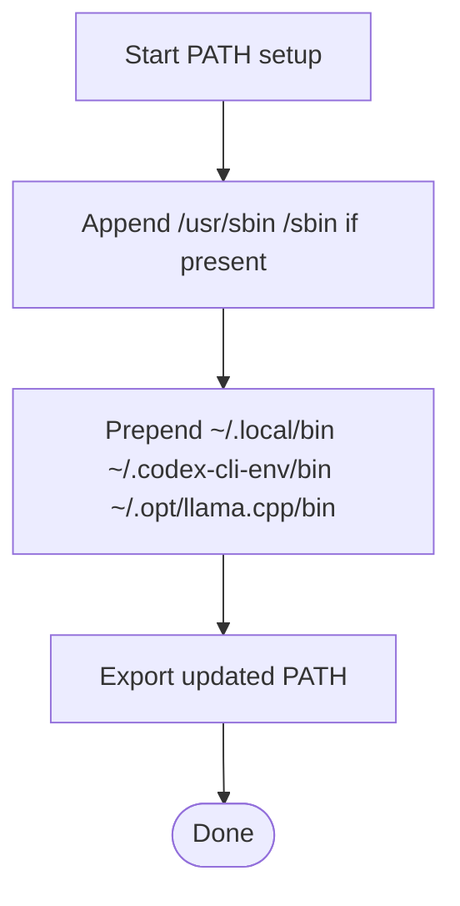
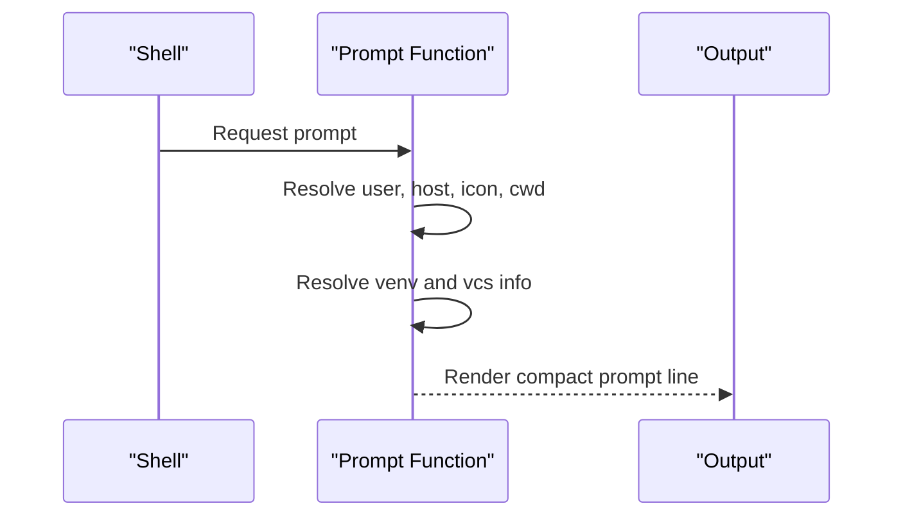
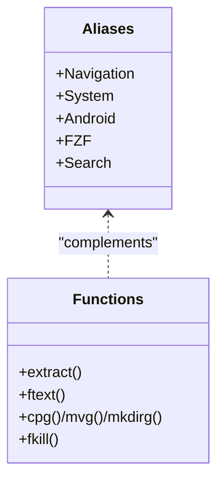
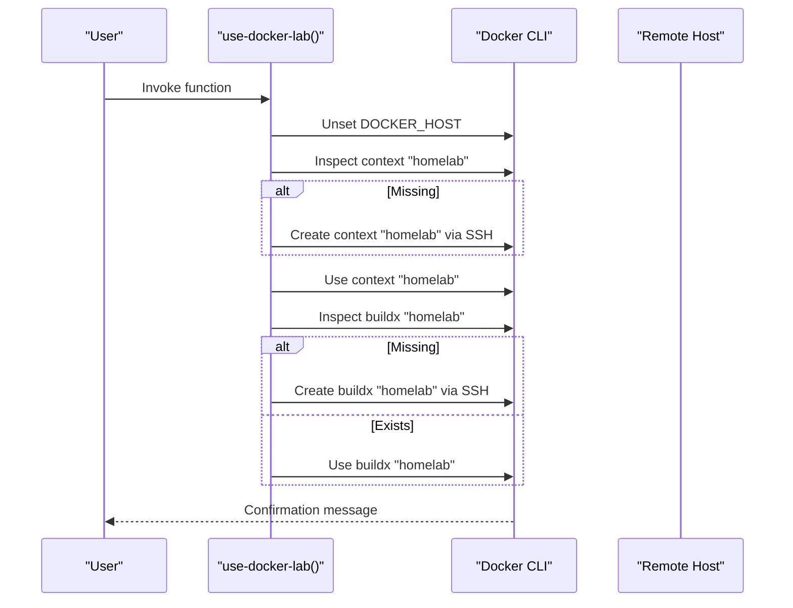
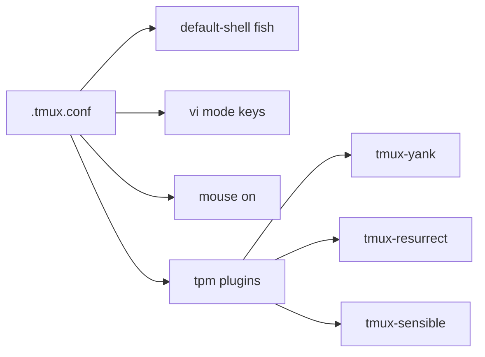
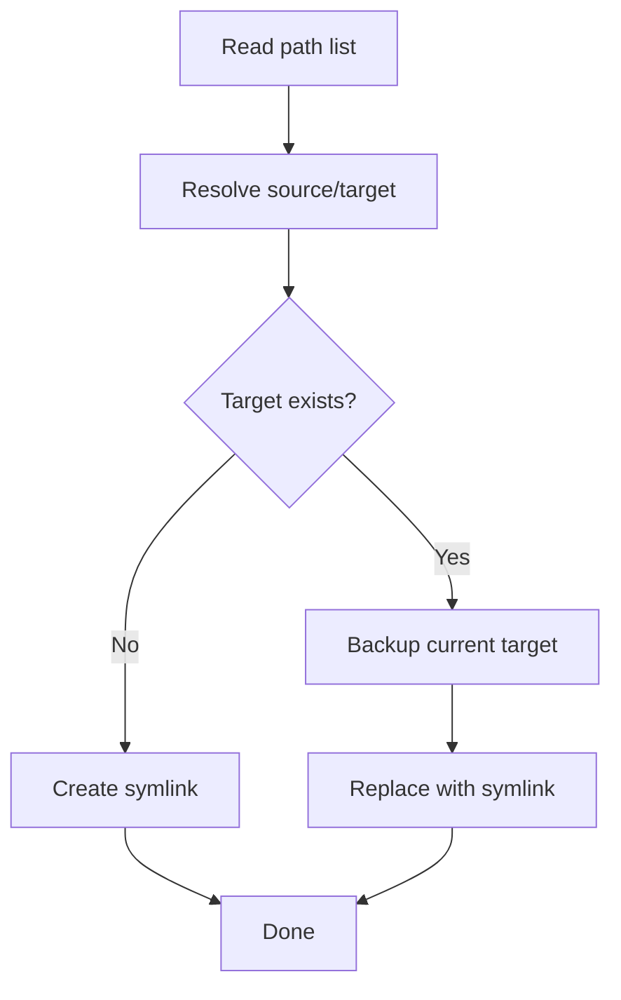
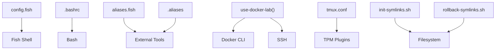

# Mobile Termux Configuration

<cite>
**Referenced Files in This Document**
- [config.fish](file://termux-config/.config/fish/config.fish)
- [aliases.fish](file://termux-config/.config/fish/conf.d/aliases.fish)
- [shell_rc_content.fish](file://termux-config/.config/fish/conf.d/shell_rc_content.fish)
- [.bashrc](file://termux-config/.bashrc)
- [.aliases](file://termux-config/.aliases)
- [.shell_rc_content](file://termux-config/.shell_rc_content)
- [.tmux.conf](file://.tmux.conf)
- [paths-termux.txt](file://paths-termux.txt)
- [paths.txt](file://paths.txt)
- [init-symlinks.sh](file://init-symlinks.sh)
- [rollback-symlinks.sh](file://rollback-symlinks.sh)
- [README.md](file://README.md)
</cite>

## Table of Contents
1. [Introduction](#introduction)
2. [Project Structure](#project-structure)
3. [Core Components](#core-components)
4. [Architecture Overview](#architecture-overview)
5. [Detailed Component Analysis](#detailed-component-analysis)
6. [Dependency Analysis](#dependency-analysis)
7. [Performance Considerations](#performance-considerations)
8. [Troubleshooting Guide](#troubleshooting-guide)
9. [Conclusion](#conclusion)
10. [Appendices](#appendices)

## Introduction
This document explains how to adapt a desktop-oriented shell and editor configuration for Termux on mobile devices. It focuses on mobile-specific adaptations such as constrained PATH, storage-aware behavior, performance considerations for ARM devices, a simplified prompt optimized for small screens, essential aliases for mobile development, and Docker context management for containerized workflows. It also contrasts desktop and mobile environments, highlights available tools, filesystem limitations, and network considerations, and provides practical workflows for remote server management via SSH and integration with Android system features.

## Project Structure
The repository organizes Termux-specific shell configuration under a dedicated directory and provides scripts to manage symlinks and rollbacks. The key Termux configuration files include Fish shell configuration, Bash compatibility files, aliases, Tmux configuration, and symlink management utilities.

**Diagram sources**
- [config.fish](file://termux-config/.config/fish/config.fish#L1-L184)
- [aliases.fish](file://termux-config/.config/fish/conf.d/aliases.fish#L1-L156)
- [shell_rc_content.fish](file://termux-config/.config/fish/conf.d/shell_rc_content.fish#L1-L20)
- [.bashrc](file://termux-config/.bashrc#L1-L38)
- [.aliases](file://termux-config/.aliases#L1-L550)
- [.shell_rc_content](file://termux-config/.shell_rc_content#L1-L135)
- [.tmux.conf](file://.tmux.conf#L1-L69)
- [init-symlinks.sh](file://init-symlinks.sh#L1-L347)
- [rollback-symlinks.sh](file://rollback-symlinks.sh#L1-L316)
- [paths-termux.txt](file://paths-termux.txt#L1-L12)
- [paths.txt](file://paths.txt#L1-L16)

**Section sources**
- [paths-termux.txt](file://paths-termux.txt#L1-L12)
- [paths.txt](file://paths.txt#L1-L16)
- [README.md](file://README.md#L1-L35)

## Core Components
- Shell configuration and prompt
  - Fish prompt with concise information tailored for mobile terminals
  - Bash PS1 compatible prompt for legacy shells
- PATH management
  - Minimal PATH updates to include only necessary directories
  - Prepending user-local and model-serving tooling paths
- Aliases and convenience functions
  - File operations, navigation shortcuts, system info, and Android integration
  - Fuzzy finder integration for files and processes
- Docker context management
  - Function to switch Docker contexts via SSH and initialize buildx builders
- Tmux integration
  - Fish as default shell, vi mode, mouse support, and plugin management
- Symlink management
  - Automated symlink creation and rollback with backup detection

**Section sources**
- [config.fish](file://termux-config/.config/fish/config.fish#L54-L84)
- [.bashrc](file://termux-config/.bashrc#L30-L34)
- [config.fish](file://termux-config/.config/fish/config.fish#L127-L152)
- [aliases.fish](file://termux-config/.config/fish/conf.d/aliases.fish#L1-L156)
- [.aliases](file://termux-config/.aliases#L1-L550)
- [config.fish](file://termux-config/.config/fish/config.fish#L101-L124)
- [.tmux.conf](file://.tmux.conf#L1-L69)
- [init-symlinks.sh](file://init-symlinks.sh#L1-L347)
- [rollback-symlinks.sh](file://rollback-symlinks.sh#L1-L316)

## Architecture Overview
The Termux configuration centers on Fish as the primary interactive shell, with Bash compatibility for legacy scripts. Aliases and functions provide mobile-friendly workflows. Docker context switching integrates with SSH-based remote hosts. Tmux enhances terminal multiplexing with plugins. Symlink scripts automate deployment and rollback.

**Diagram sources**
- [config.fish](file://termux-config/.config/fish/config.fish#L101-L124)
- [.bashrc](file://termux-config/.bashrc#L36-L38)
- [aliases.fish](file://termux-config/.config/fish/conf.d/aliases.fish#L1-L156)
- [.aliases](file://termux-config/.aliases#L1-L550)
- [.tmux.conf](file://.tmux.conf#L57-L68)
- [init-symlinks.sh](file://init-symlinks.sh#L288-L294)

## Detailed Component Analysis

### Shell Prompt and Environment
- Fish prompt
  - Displays concise information: distro icon, current working directory, virtual environment indicator, and VCS branch
  - Optimized for readability on small screens with minimal color usage
- Bash PS1
  - Compatible single-line prompt with distro icon and working directory
- Interactive initialization
  - Enables direnv hook and nvm defaults when present
  - Loads Codex CLI helpers if available

**Diagram sources**
- [config.fish](file://termux-config/.config/fish/config.fish#L165-L183)

**Section sources**
- [config.fish](file://termux-config/.config/fish/config.fish#L54-L84)
- [.bashrc](file://termux-config/.bashrc#L30-L34)
- [config.fish](file://termux-config/.config/fish/config.fish#L165-L183)

### PATH Adaptations for Mobile
- Minimal PATH augmentation
  - Appends system administrative directories only if present
  - Prepends user-local and model-serving tooling paths
- Purpose
  - Reduces PATH bloat and speeds up command resolution on mobile devices
  - Ensures access to locally installed tools and model servers

**Diagram sources**
- [config.fish](file://termux-config/.config/fish/config.fish#L127-L152)

**Section sources**
- [config.fish](file://termux-config/.config/fish/config.fish#L127-L152)

### Simplified Prompt System
- Fish prompt
  - Single-line with distro icon, working directory, optional virtual environment, and VCS branch
- Bash prompt
  - Single-line with distro icon and working directory
- Benefits
  - Faster rendering on mobile CPUs
  - Reduced visual clutter on small screens

**Diagram sources**
- [config.fish](file://termux-config/.config/fish/config.fish#L54-L84)
- [.bashrc](file://termux-config/.bashrc#L30-L34)

**Section sources**
- [config.fish](file://termux-config/.config/fish/config.fish#L54-L84)
- [.bashrc](file://termux-config/.bashrc#L30-L34)

### Essential Aliases for Mobile Development
- Navigation and file operations
  - Shortcuts for SD card, Termux prefix, and common folders
  - Combined copy/move/go and mkdir/go helpers
- System and Android integration
  - Start/stop Termux SSH service, reload settings, show public IP, speedtest
- Fuzzy finder integration
  - Preview-enabled file selection for editors and navigation
- Text search and system info
  - Case-insensitive recursive grep, directory listings with icons, process queries

**Diagram sources**
- [aliases.fish](file://termux-config/.config/fish/conf.d/aliases.fish#L1-L156)
- [.aliases](file://termux-config/.aliases#L1-L550)

**Section sources**
- [aliases.fish](file://termux-config/.config/fish/conf.d/aliases.fish#L1-L156)
- [.aliases](file://termux-config/.aliases#L1-L550)

### Docker Context Management for Containerized Workflows
- Functionality
  - Creates a Docker context via SSH if missing
  - Switches to the named context
  - Initializes/builds a buildx builder for remote builds
- Usage
  - Streamlines containerized development on remote hosts accessed over SSH

**Diagram sources**
- [config.fish](file://termux-config/.config/fish/config.fish#L101-L124)

**Section sources**
- [config.fish](file://termux-config/.config/fish/config.fish#L101-L124)

### Tmux Integration for Mobile Terminals
- Default shell set to Fish when available
- Vi mode, mouse support, and pane/window navigation
- Plugin management via TPM with sensible defaults and yank/resurrect plugins

**Diagram sources**
- [.tmux.conf](file://.tmux.conf#L6-L68)

**Section sources**
- [.tmux.conf](file://.tmux.conf#L1-L69)

### Symlink Management and Rollback
- init-symlinks.sh
  - Reads a path list, resolves source/target locations, backs up existing files, and creates symlinks
  - Handles directories, files, and broken symlinks
- rollback-symlinks.sh
  - Scans for backups with date suffixes, restores to latest or specific date, supports dry-run

**Diagram sources**
- [init-symlinks.sh](file://init-symlinks.sh#L288-L294)
- [rollback-symlinks.sh](file://rollback-symlinks.sh#L69-L97)

**Section sources**
- [init-symlinks.sh](file://init-symlinks.sh#L1-L347)
- [rollback-symlinks.sh](file://rollback-symlinks.sh#L1-L316)
- [paths-termux.txt](file://paths-termux.txt#L1-L12)
- [paths.txt](file://paths.txt#L1-L16)

## Dependency Analysis
- Shell configuration depends on Fish and Bash compatibility layers
- Aliases depend on external tools (eza, bat, fzf, nvim, tmux, mosh, termux-ssh)
- Docker context management depends on Docker CLI and SSH availability
- Tmux relies on TPM-managed plugins
- Symlink scripts depend on POSIX-compliant shell and filesystem permissions

**Diagram sources**
- [config.fish](file://termux-config/.config/fish/config.fish#L101-L124)
- [aliases.fish](file://termux-config/.config/fish/conf.d/aliases.fish#L1-L156)
- [.aliases](file://termux-config/.aliases#L1-L550)
- [.tmux.conf](file://.tmux.conf#L57-L68)
- [init-symlinks.sh](file://init-symlinks.sh#L288-L294)
- [rollback-symlinks.sh](file://rollback-symlinks.sh#L69-L97)

**Section sources**
- [config.fish](file://termux-config/.config/fish/config.fish#L101-L124)
- [aliases.fish](file://termux-config/.config/fish/conf.d/aliases.fish#L1-L156)
- [.aliases](file://termux-config/.aliases#L1-L550)
- [.tmux.conf](file://.tmux.conf#L57-L68)
- [init-symlinks.sh](file://init-symlinks.sh#L288-L294)
- [rollback-symlinks.sh](file://rollback-symlinks.sh#L69-L97)

## Performance Considerations
- Minimize PATH entries to reduce command resolution overhead on mobile CPUs
- Prefer lightweight tools (e.g., eza, bat, fzf) and avoid heavy GUI-dependent utilities
- Use Tmux with vi mode and mouse support to reduce context switching overhead
- Limit concurrent processes and use fzf previews judiciously to preserve battery life
- Keep Docker contexts and buildx builders lean; avoid unnecessary images and caches
- Use SSH-based Docker contexts to offload heavy builds to remote hosts

[No sources needed since this section provides general guidance]

## Troubleshooting Guide
- Aliases not found
  - Ensure external tools are installed and available in PATH
  - Verify Fish/Bash compatibility layers are loaded
- Docker context issues
  - Confirm SSH connectivity to the remote host
  - Re-run the Docker context function to recreate context and buildx builder
- Tmux plugin issues
  - Initialize TPM and install plugins inside a Tmux session
  - Reload configuration and verify plugin activation
- Symlink problems
  - Use rollback script to restore from backups
  - Run init script again to resolve broken symlinks and conflicting targets

**Section sources**
- [config.fish](file://termux-config/.config/fish/config.fish#L101-L124)
- [.tmux.conf](file://.tmux.conf#L57-L68)
- [init-symlinks.sh](file://init-symlinks.sh#L116-L148)
- [rollback-symlinks.sh](file://rollback-symlinks.sh#L115-L149)

## Conclusion
This Termux configuration adapts a powerful desktop-oriented workflow to the constraints and opportunities of mobile computing. By minimizing PATH, simplifying prompts, leveraging aliases and Docker over SSH, and integrating Tmux with plugins, developers can maintain productivity on ARM devices. The symlink management tools provide safe deployment and rollback, ensuring reliability across environments.

[No sources needed since this section summarizes without analyzing specific files]

## Appendices

### Practical Mobile Workflows
- Remote server management via SSH
  - Use built-in aliases to start/stop Termux SSH service and manage connections
  - Combine with Docker context function to develop and build remotely
- Android integration
  - Use aliases to navigate Android storage and reload settings
  - Utilize preview-enabled fuzzy finder for quick file access
- Local development with on-device tools
  - Manage local model servers and toolchains with prepended PATH entries
  - Use Tmux for persistent sessions and multiplexed workflows

**Section sources**
- [aliases.fish](file://termux-config/.config/fish/conf.d/aliases.fish#L111-L112)
- [config.fish](file://termux-config/.config/fish/config.fish#L101-L124)
- [.aliases](file://termux-config/.aliases#L45-L46)
- [config.fish](file://termux-config/.config/fish/config.fish#L127-L152)
- [.tmux.conf](file://.tmux.conf#L1-L69)

### Differences Between Desktop and Mobile Configurations
- Available tools
  - Mobile environment may lack GUI utilities; favor CLI alternatives (eza, bat, fzf)
- Filesystem limitations
  - SD card and internal storage require explicit navigation aliases
  - Use backup and rollback scripts to protect configurations
- Network considerations
  - SSH-based workflows and Docker contexts enable remote compute
  - Prefer lightweight protocols and minimize bandwidth-heavy operations

**Section sources**
- [aliases.fish](file://termux-config/.config/fish/conf.d/aliases.fish#L121-L124)
- [rollback-symlinks.sh](file://rollback-symlinks.sh#L69-L97)
- [config.fish](file://termux-config/.config/fish/config.fish#L101-L124)