# Shell Configurations

<cite>
**Referenced Files in This Document**
- [.bashrc](file://.bashrc)
- [.bash_aliases](file://.bash_aliases)
- [.config/fish/config.fish](file://.config/fish/config.fish)
- [.config/fish/conf.d/aliases.fish](file://.config/fish/conf.d/aliases.fish)
- [termux-config/.bashrc](file://termux-config/.bashrc)
- [termux-config/.aliases](file://termux-config/.aliases)
- [termux-config/.shell_rc_content](file://termux-config/.shell_rc_content)
- [termux-config/.config/fish/config.fish](file://termux-config/.config/fish/config.fish)
- [termux-config/.config/fish/conf.d/aliases.fish](file://termux-config/.config/fish/conf.d/aliases.fish)
- [termux-config/.config/fish/conf.d/shell_rc_content.fish](file://termux-config/.config/fish/conf.d/shell_rc_content.fish)
- [paths.txt](file://paths.txt)
- [paths-termux.txt](file://paths-termux.txt)
- [README.md](file://README.md)
</cite>

## Table of Contents
1. [Introduction](#introduction)
2. [Project Structure](#project-structure)
3. [Core Components](#core-components)
4. [Architecture Overview](#architecture-overview)
5. [Detailed Component Analysis](#detailed-component-analysis)
6. [Dependency Analysis](#dependency-analysis)
7. [Performance Considerations](#performance-considerations)
8. [Troubleshooting Guide](#troubleshooting-guide)
9. [Conclusion](#conclusion)
10. [Appendices](#appendices)

## Introduction
This document explains how shell configuration is managed across dual environments: Bash and Fish shells on desktop Linux and Termux on Android. It covers architecture, prompt customization, environment variable management, PATH optimization, alias and function systems, interactive enhancements, and cross-platform compatibility considerations. Practical examples and diagrams illustrate how desktop and mobile configurations differ and how they are organized for maintainability.

## Project Structure
The repository organizes shell configuration into:
- Desktop Bash and Fish configs under the repository root and under .config/fish
- Termux-specific Bash and Fish configs under termux-config
- A symlink initialization mechanism described by paths.txt and paths-termux.txt
- Supporting documentation in README.md

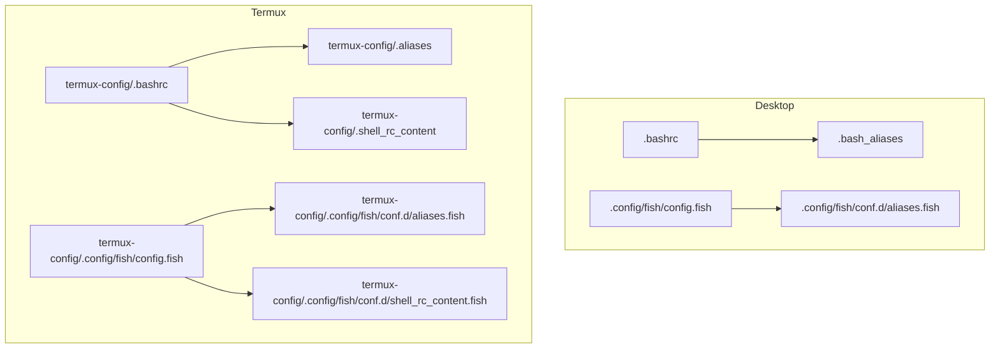

**Diagram sources**
- [.bashrc](file://.bashrc#L1-L343)
- [.bash_aliases](file://.bash_aliases#L1-L196)
- [.config/fish/config.fish](file://.config/fish/config.fish#L1-L168)
- [.config/fish/conf.d/aliases.fish](file://.config/fish/conf.d/aliases.fish#L1-L148)
- [termux-config/.bashrc](file://termux-config/.bashrc#L1-L38)
- [termux-config/.aliases](file://termux-config/.aliases#L1-L550)
- [termux-config/.shell_rc_content](file://termux-config/.shell_rc_content#L1-L135)
- [termux-config/.config/fish/config.fish](file://termux-config/.config/fish/config.fish#L1-L184)
- [termux-config/.config/fish/conf.d/aliases.fish](file://termux-config/.config/fish/conf.d/aliases.fish#L1-L156)
- [termux-config/.config/fish/conf.d/shell_rc_content.fish](file://termux-config/.config/fish/conf.d/shell_rc_content.fish#L1-L20)

**Section sources**
- [paths.txt](file://paths.txt#L1-L16)
- [paths-termux.txt](file://paths-termux.txt#L1-L12)
- [README.md](file://README.md#L1-L35)

## Core Components
- Desktop Bash
  - Interactive detection, history tuning, color prompt, distro icon, virtualenv/conda integration, two-line prompt, PATH updates, NPM/NVM, Google Cloud SDK, and direnv integration.
  - Aliases and functions for navigation, system info, file operations, fzf previews, and process management.
- Desktop Fish
  - Custom greeting, distro icon, virtualenv/conda integration, two-line prompt, environment variables, PATH updates, NPM/NVM, Google Cloud SDK, and direnv integration.
  - Aliases and functions mirroring Bash capabilities.
- Termux Bash
  - Lightweight prompt with distro icon, sourcing shared content and aliases, and Termux-specific integrations.
- Termux Fish
  - Similar prompt and environment setup to desktop Fish, plus Termux-specific PATH prepends and environment variables for desktop-like workflows.

Key implementation patterns:
- Prompt composition via functions and external utilities (e.g., git branch display).
- Environment variable management for Python/Conda, NPM, NVM, Google Cloud SDK, and direnv.
- PATH optimization with deduplication and ordering for user binaries and system directories.
- Cross-shell alias/function parity with shell-specific syntax and idioms.

**Section sources**
- [.bashrc](file://.bashrc#L1-L343)
- [.bash_aliases](file://.bash_aliases#L1-L196)
- [.config/fish/config.fish](file://.config/fish/config.fish#L1-L168)
- [.config/fish/conf.d/aliases.fish](file://.config/fish/conf.d/aliases.fish#L1-L148)
- [termux-config/.bashrc](file://termux-config/.bashrc#L1-L38)
- [termux-config/.aliases](file://termux-config/.aliases#L1-L550)
- [termux-config/.shell_rc_content](file://termux-config/.shell_rc_content#L1-L135)
- [termux-config/.config/fish/config.fish](file://termux-config/.config/fish/config.fish#L1-L184)
- [termux-config/.config/fish/conf.d/aliases.fish](file://termux-config/.config/fish/conf.d/aliases.fish#L1-L156)
- [termux-config/.config/fish/conf.d/shell_rc_content.fish](file://termux-config/.config/fish/conf.d/shell_rc_content.fish#L1-L20)

## Architecture Overview
The shell configuration architecture separates concerns by:
- Shell runtime initialization (.bashrc, Fish config.fish)
- Shared interactive content (.aliases for Bash; conf.d/aliases.fish for Fish)
- Platform-specific content (Termux wrappers and environment)
- Environment variable and PATH management
- Prompt rendering and VCS integration

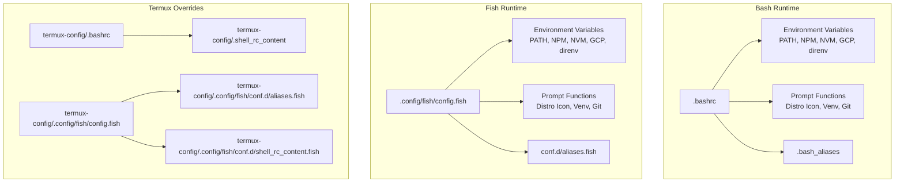

**Diagram sources**
- [.bashrc](file://.bashrc#L1-L343)
- [.config/fish/config.fish](file://.config/fish/config.fish#L1-L168)
- [termux-config/.bashrc](file://termux-config/.bashrc#L1-L38)
- [termux-config/.shell_rc_content](file://termux-config/.shell_rc_content#L1-L135)
- [termux-config/.config/fish/config.fish](file://termux-config/.config/fish/config.fish#L1-L184)
- [termux-config/.config/fish/conf.d/aliases.fish](file://termux-config/.config/fish/conf.d/aliases.fish#L1-L156)
- [termux-config/.config/fish/conf.d/shell_rc_content.fish](file://termux-config/.config/fish/conf.d/shell_rc_content.fish#L1-L20)

## Detailed Component Analysis

### Desktop Bash Configuration
- Interactive guard and history tuning ensure reliable interactive shells.
- Color prompt with distro icon, virtualenv/conda name, and git branch indicator.
- Two-line prompt mimics Fish’s layout for familiarity.
- PATH optimization appends system admin directories and prepends user toolchains.
- Environment variables for Google Cloud SDK, NPM packages, NVM, and direnv.
- Aliases and functions mirror Fish capabilities: navigation, system info, fzf previews, extract archives, process killer, and text search.

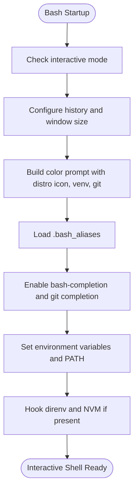

**Diagram sources**
- [.bashrc](file://.bashrc#L5-L343)
- [.bash_aliases](file://.bash_aliases#L1-L196)

**Section sources**
- [.bashrc](file://.bashrc#L1-L343)
- [.bash_aliases](file://.bash_aliases#L1-L196)

### Desktop Fish Configuration
- Custom greeting optionally prints fortunes.
- Prompt functions compute distro icon, virtualenv/conda name, and git branch.
- Environment variables set TERM, disable Python/Conda prompt overrides, silence direnv logs.
- PATH prepended with user toolchains and appended with system admin directories.
- NPM and NVM directories integrated; Google Cloud SDK enabled; direnv hook loaded.

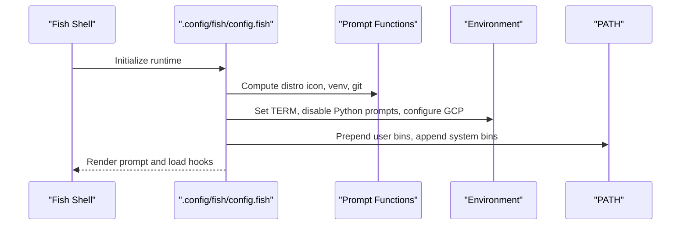

**Diagram sources**
- [.config/fish/config.fish](file://.config/fish/config.fish#L1-L168)

**Section sources**
- [.config/fish/config.fish](file://.config/fish/config.fish#L1-L168)
- [.config/fish/conf.d/aliases.fish](file://.config/fish/conf.d/aliases.fish#L1-L148)

### Termux Bash Configuration
- Detects Linux distribution via /etc/os-release and sets a distro icon.
- Builds a compact prompt with icon and working directory.
- Sources shared content and aliases from Termux home to unify behavior across shells.

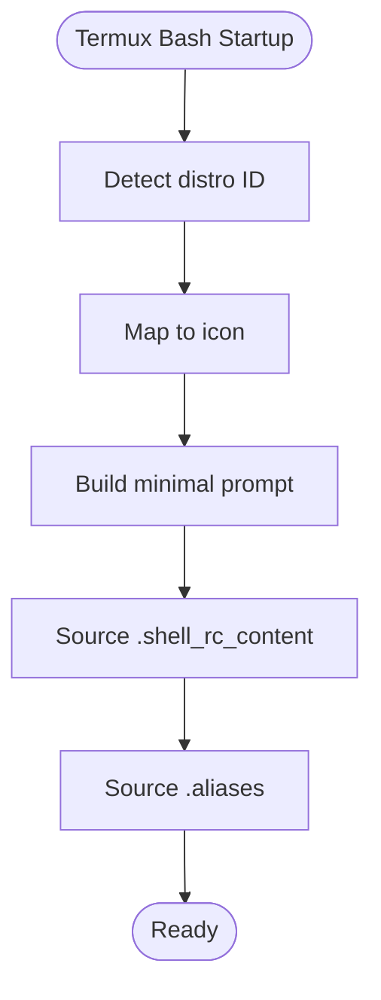

**Diagram sources**
- [termux-config/.bashrc](file://termux-config/.bashrc#L1-L38)
- [termux-config/.aliases](file://termux-config/.aliases#L1-L550)
- [termux-config/.shell_rc_content](file://termux-config/.shell_rc_content#L1-L135)

**Section sources**
- [termux-config/.bashrc](file://termux-config/.bashrc#L1-L38)
- [termux-config/.aliases](file://termux-config/.aliases#L1-L550)
- [termux-config/.shell_rc_content](file://termux-config/.shell_rc_content#L1-L135)

### Termux Fish Configuration
- Prompt mirrors desktop Fish with distro icon, venv, and git branch.
- Adds Termux-specific PATH prepends for tools like codex CLI and llama.cpp.
- Sets Hugging Face cache directories and enables interactive hooks for direnv and nvm.
- Loads Fish-specific shell content for zoxide and FZF colors.

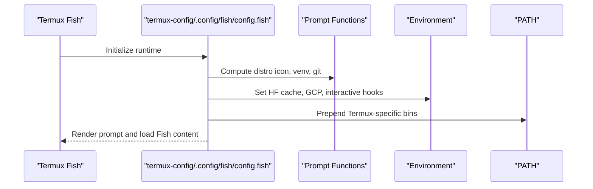

**Diagram sources**
- [termux-config/.config/fish/config.fish](file://termux-config/.config/fish/config.fish#L1-L184)
- [termux-config/.config/fish/conf.d/shell_rc_content.fish](file://termux-config/.config/fish/conf.d/shell_rc_content.fish#L1-L20)

**Section sources**
- [termux-config/.config/fish/config.fish](file://termux-config/.config/fish/config.fish#L1-L184)
- [termux-config/.config/fish/conf.d/aliases.fish](file://termux-config/.config/fish/conf.d/aliases.fish#L1-L156)
- [termux-config/.config/fish/conf.d/shell_rc_content.fish](file://termux-config/.config/fish/conf.d/shell_rc_content.fish#L1-L20)

### Prompt Implementation Details
- Distro icon detection reads /etc/os-release and maps to Unicode icons.
- Virtualenv/Conda name resolution respects explicit prompts and project-aware naming.
- Path abbreviation shortens directories except the last segment.
- Fish prompt uses color tokens and fish_vcs_prompt for branch display.

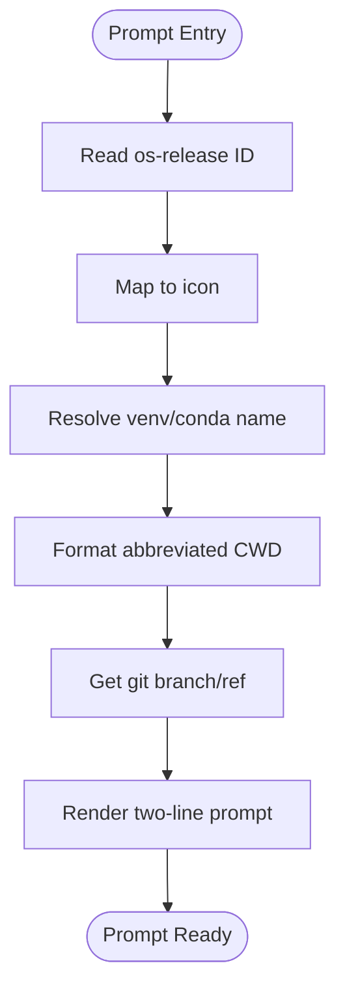

**Diagram sources**
- [.bashrc](file://.bashrc#L55-L196)
- [.config/fish/config.fish](file://.config/fish/config.fish#L15-L109)

**Section sources**
- [.bashrc](file://.bashrc#L55-L196)
- [.config/fish/config.fish](file://.config/fish/config.fish#L15-L109)

### Environment Variable Management and PATH Optimization
- Desktop Bash:
  - Appends /usr/sbin and /sbin if missing.
  - Prepends $HOME/.local/bin and $HOME/.cargo/bin if present.
  - Sets NPM_PACKAGES and NVM_DIR if directories exist.
  - Enables Google Cloud SDK auth plugin and disables Python prompt overrides.
- Desktop Fish:
  - Same PATH strategy with set -gx and contains checks.
  - Sets TERM, VIRTUAL_ENV_DISABLE_PROMPT, CONDA_CHANGEPS1, DIRENV_LOG_FORMAT.
  - Enables Google Cloud SDK auth plugin.
- Termux Fish:
  - Extends PATH with Termux-specific toolchains (e.g., codex CLI, llama.cpp).
  - Sets Hugging Face cache directories.

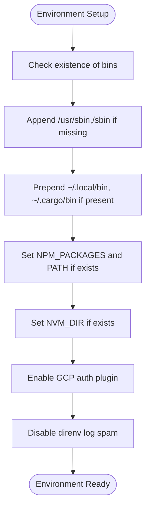

**Diagram sources**
- [.bashrc](file://.bashrc#L283-L335)
- [.config/fish/config.fish](file://.config/fish/config.fish#L123-L162)
- [termux-config/.config/fish/config.fish](file://termux-config/.config/fish/config.fish#L127-L152)

**Section sources**
- [.bashrc](file://.bashrc#L283-L335)
- [.config/fish/config.fish](file://.config/fish/config.fish#L123-L162)
- [termux-config/.config/fish/config.fish](file://termux-config/.config/fish/config.fish#L127-L152)

### Alias Systems and Functions
- Desktop Bash and Fish share aliases for navigation, system info, fzf previews, and text search.
- Functions unify common tasks: copy+go, move+go, mkdir+go, extract archives with progress, interactive process killer, and fuzzy find-and-open editors.
- Termux Bash aliases include Termux-specific shortcuts (e.g., SD card navigation, reload settings).

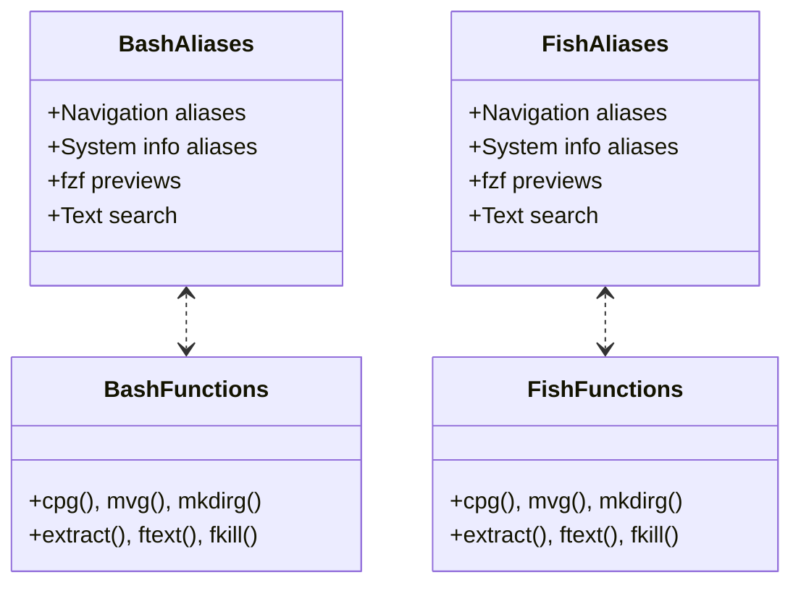

**Diagram sources**
- [.bash_aliases](file://.bash_aliases#L1-L196)
- [.config/fish/conf.d/aliases.fish](file://.config/fish/conf.d/aliases.fish#L1-L148)
- [termux-config/.aliases](file://termux-config/.aliases#L1-L550)
- [termux-config/.config/fish/conf.d/aliases.fish](file://termux-config/.config/fish/conf.d/aliases.fish#L1-L156)

**Section sources**
- [.bash_aliases](file://.bash_aliases#L1-L196)
- [.config/fish/conf.d/aliases.fish](file://.config/fish/conf.d/aliases.fish#L1-L148)
- [termux-config/.aliases](file://termux-config/.aliases#L1-L550)
- [termux-config/.config/fish/conf.d/aliases.fish](file://termux-config/.config/fish/conf.d/aliases.fish#L1-L156)

### Interactive Shell Enhancements
- Bash:
  - Programmable completion and git completion.
  - SSH identities loader hook.
- Fish:
  - Greeting with optional fortune output.
  - Interactive hooks for direnv and nvm.
- Termux:
  - zoxide integration for smarter cd.
  - FZF color theme customization.
  - Termux-specific PATH and environment variables.

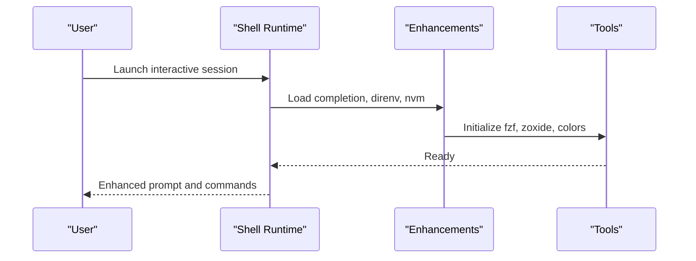

**Diagram sources**
- [.bashrc](file://.bashrc#L218-L236)
- [.config/fish/config.fish](file://.config/fish/config.fish#L164-L167)
- [termux-config/.config/fish/conf.d/shell_rc_content.fish](file://termux-config/.config/fish/conf.d/shell_rc_content.fish#L1-L20)

**Section sources**
- [.bashrc](file://.bashrc#L218-L236)
- [.config/fish/config.fish](file://.config/fish/config.fish#L164-L167)
- [termux-config/.config/fish/conf.d/shell_rc_content.fish](file://termux-config/.config/fish/conf.d/shell_rc_content.fish#L1-L20)

## Dependency Analysis
- Shell runtime depends on:
  - Environment variables for Python/Conda, NPM/NVM, Google Cloud SDK, and direnv.
  - PATH entries for user-installed tools and system binaries.
  - Prompt functions and VCS integration.
- Termux adds platform-specific PATH entries and environment variables for desktop-like workflows.
- Aliases and functions are shared conceptually across Bash and Fish with shell-specific syntax.

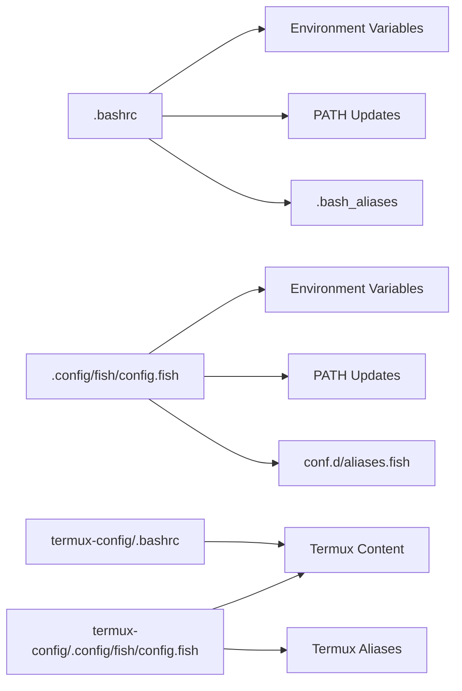

**Diagram sources**
- [.bashrc](file://.bashrc#L283-L335)
- [.config/fish/config.fish](file://.config/fish/config.fish#L123-L162)
- [termux-config/.bashrc](file://termux-config/.bashrc#L1-L38)
- [termux-config/.config/fish/config.fish](file://termux-config/.config/fish/config.fish#L127-L152)

**Section sources**
- [.bashrc](file://.bashrc#L283-L335)
- [.config/fish/config.fish](file://.config/fish/config.fish#L123-L162)
- [termux-config/.bashrc](file://termux-config/.bashrc#L1-L38)
- [termux-config/.config/fish/config.fish](file://termux-config/.config/fish/config.fish#L127-L152)

## Performance Considerations
- Prompt computation:
  - Minimize external calls per prompt render; cache distro icon and venv name where appropriate.
  - Prefer lightweight alternatives to heavy tools (e.g., git branch resolution).
- PATH management:
  - Deduplicate and order PATH entries to reduce shell lookup overhead.
  - Avoid redundant exports and repeated checks.
- Aliases and functions:
  - Use shell-native features (e.g., contains checks in Fish, regex checks in Bash) to avoid extra processes.
- Termux:
  - Limit environment variable proliferation; keep only necessary variables for desktop-like workflows.

[No sources needed since this section provides general guidance]

## Troubleshooting Guide
Common issues and remedies:
- Prompt not rendering correctly:
  - Verify interactive mode guard and color support detection.
  - Ensure required utilities (e.g., git, bat, eza) are installed and available on PATH.
- PATH not updated as expected:
  - Confirm directory existence and that PATH deduplication logic is not preventing updates.
  - Reorder PATH prepends/prepends to ensure precedence.
- Aliases or functions not available:
  - Check that .bash_aliases or Fish conf.d/aliases.fish are sourced and syntax is valid.
  - For Fish, ensure functions are defined with correct signatures and invoked with argv indexing.
- Termux-specific problems:
  - Confirm Termux environment variables (e.g., PREFIX) and that Termux content is sourced.
  - Validate Termux PATH prepends for tools like codex CLI and llama.cpp.

**Section sources**
- [.bashrc](file://.bashrc#L5-L343)
- [.config/fish/config.fish](file://.config/fish/config.fish#L1-L168)
- [termux-config/.bashrc](file://termux-config/.bashrc#L1-L38)
- [termux-config/.aliases](file://termux-config/.aliases#L1-L550)
- [termux-config/.config/fish/conf.d/aliases.fish](file://termux-config/.config/fish/conf.d/aliases.fish#L1-L156)

## Conclusion
The repository provides a robust, cross-platform shell configuration strategy:
- Desktop Bash and Fish share a consistent prompt, environment, and productivity tooling.
- Termux adapts these patterns with platform-specific PATH and environment variables.
- Symlink management via paths.txt and paths-termux.txt streamlines deployment across devices.
Adopting these patterns ensures predictable, maintainable shell environments across diverse platforms.

[No sources needed since this section summarizes without analyzing specific files]

## Appendices

### Practical Examples and Patterns
- Prompt customization:
  - Customize distro icon mapping and prompt segments in both Bash and Fish.
  - Use git branch integration and virtualenv/conda name resolution consistently.
- Environment setup:
  - Centralize environment variables for Google Cloud SDK, NPM, and NVM.
  - Disable shell-specific prompt overrides to rely on custom prompts.
- PATH optimization:
  - Prepend user toolchains and append system admin directories with deduplication.
  - Keep Termux-specific PATH entries minimal and targeted.
- Cross-platform shell compatibility:
  - Mirror aliases and functions across Bash and Fish with shell-specific syntax.
  - Use shared content files where appropriate and source them conditionally.

**Section sources**
- [.bashrc](file://.bashrc#L283-L335)
- [.config/fish/config.fish](file://.config/fish/config.fish#L123-L162)
- [termux-config/.config/fish/config.fish](file://termux-config/.config/fish/config.fish#L127-L152)
- [.bash_aliases](file://.bash_aliases#L1-L196)
- [.config/fish/conf.d/aliases.fish](file://.config/fish/conf.d/aliases.fish#L1-L148)
- [termux-config/.aliases](file://termux-config/.aliases#L1-L550)
- [termux-config/.config/fish/conf.d/aliases.fish](file://termux-config/.config/fish/conf.d/aliases.fish#L1-L156)