# Shell Configurations

<cite>
**Referenced Files in This Document**
- [.bashrc](file://.bashrc)
- [.bash_aliases](file://.bash_aliases)
- [.config/fish/config.fish](file://.config/fish/config.fish)
- [.config/fish/conf.d/aliases.fish](file://.config/fish/conf.d/aliases.fish)
- [termux-config/.bashrc](file://termux-config/.bashrc)
- [termux-config/.aliases](file://termux-config/.aliases)
- [termux-config/.shell_rc_content](file://termux-config/.shell_rc_content)
- [termux-config/.config/fish/config.fish](file://termux-config/.config/fish/config.fish)
- [termux-config/.config/fish/conf.d/aliases.fish](file://termux-config/.config/fish/conf.d/aliases.fish)
- [termux-config/.config/fish/conf.d/shell_rc_content.fish](file://termux-config/.config/fish/conf.d/shell_rc_content.fish)
- [paths.txt](file://paths.txt)
- [paths-termux.txt](file://paths-termux.txt)
- [README.md](file://README.md)
- [init-system.sh](file://init-system.sh)
- [rollback-system.sh](file://rollback-system.sh)
- [system-paths.txt](file://system-paths.txt)
- [system/root/.bash_aliases](file://system/root/.bash_aliases)
- [system/etc/polkit-1/rules.d/49-allow-hibernate-sudoers.rules](file://system/etc/polkit-1/rules.d/49-allow-hibernate-sudoers.rules)
- [system/usr/bin/m-utils](file://system/usr/bin/m-utils)
- [init-symlinks.sh](file://init-symlinks.sh)
- [.m-utils.template](file://.m-utils.template)
</cite>

## Update Summary
**Changes Made**
- Enhanced system-wide environment management through template-based configuration system
- Improved PATH manipulation for development directories with streamlined environment variable management
- Added system-wide environment variable configuration using MUTILS_DOTFILES_DIR
- Updated template-based system for m-utils configuration management
- Enhanced system file deployment and rollback capabilities

## Table of Contents
1. [Introduction](#introduction)
2. [Project Structure](#project-structure)
3. [Core Components](#core-components)
4. [Architecture Overview](#architecture-overview)
5. [Detailed Component Analysis](#detailed-component-analysis)
6. [Template-Based Configuration System](#template-based-configuration-system)
7. [System Environment Management](#system-environment-management)
8. [Dependency Analysis](#dependency-analysis)
9. [Performance Considerations](#performance-considerations)
10. [Troubleshooting Guide](#troubleshooting-guide)
11. [Conclusion](#conclusion)
12. [Appendices](#appendices)

## Introduction
This document explains how shell configuration is managed across dual environments: Bash and Fish shells on desktop Linux and Termux on Android. It covers architecture, prompt customization, environment variable management, PATH optimization, alias and function systems, interactive enhancements, and cross-platform compatibility considerations. The enhanced modular prompt system now features improved git branch detection capabilities and better virtual environment integration, representing an improvement to existing functionality rather than removal of features.

**Updated** Enhanced system-wide environment management through template-based configuration system with improved PATH manipulation for development directories and streamlined environment variable management using global exports with -gx flag.

## Project Structure
The repository organizes shell configuration into:
- Desktop Bash and Fish configs under the repository root and under .config/fish
- Termux-specific Bash and Fish configs under termux-config
- A symlink initialization mechanism described by paths.txt and paths-termux.txt
- Supporting documentation in README.md
- System-wide configuration deployment through init-system.sh and rollback-system.sh
- Template-based configuration system for m-utils with .m-utils.template

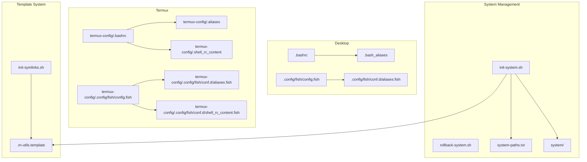

**Diagram sources**
- [.bashrc](file://.bashrc#L1-L367)
- [.bash_aliases](file://.bash_aliases#L1-L196)
- [.config/fish/config.fish](file://.config/fish/config.fish#L1-L179)
- [.config/fish/conf.d/aliases.fish](file://.config/fish/conf.d/aliases.fish#L1-L148)
- [termux-config/.bashrc](file://termux-config/.bashrc#L1-L38)
- [termux-config/.aliases](file://termux-config/.aliases#L1-L550)
- [termux-config/.shell_rc_content](file://termux-config/.shell_rc_content#L1-L135)
- [termux-config/.config/fish/config.fish](file://termux-config/.config/fish/config.fish#L1-L184)
- [termux-config/.config/fish/conf.d/aliases.fish](file://termux-config/.config/fish/conf.d/aliases.fish#L1-L156)
- [termux-config/.config/fish/conf.d/shell_rc_content.fish](file://termux-config/.config/fish/conf.d/shell_rc_content.fish#L1-L20)
- [init-system.sh](file://init-system.sh#L321-L345)
- [rollback-system.sh](file://rollback-system.sh#L257-L275)
- [system-paths.txt](file://system-paths.txt#L1-L7)
- [init-symlinks.sh](file://init-symlinks.sh#L350-L365)
- [.m-utils.template](file://.m-utils.template#L1-L77)

**Section sources**
- [paths.txt](file://paths.txt#L1-L16)
- [paths-termux.txt](file://paths-termux.txt#L1-L12)
- [README.md](file://README.md#L1-L35)
- [init-system.sh](file://init-system.sh#L1-L351)
- [rollback-system.sh](file://rollback-system.sh#L1-L352)
- [system-paths.txt](file://system-paths.txt#L1-L7)

## Core Components
- Desktop Bash
  - **Enhanced Modular Prompt System**: Interactive detection, history tuning, color prompt with improved git branch detection, distro icon, virtualenv/conda integration, two-line prompt, PATH updates, NPM/NVM, Google Cloud SDK, and direnv integration.
  - **Improved Git Branch Detection**: Enhanced fallback mechanisms including symbolic-ref, describe with tags, and short commit hash resolution.
  - **Better Virtual Environment Integration**: Project-aware naming with centralized venv detection and explicit prompt respect.
  - **Streamlined Environment Management**: System-wide environment variables configured through MUTILS_DOTFILES_DIR for cross-shell availability.
  - Aliases and functions for navigation, system info, file operations, fzf previews, and process management.
- Desktop Fish
  - Custom greeting, distro icon, virtualenv/conda integration, two-line prompt, environment variables, PATH updates, NPM/NVM, Google Cloud SDK, and direnv integration.
  - **Enhanced PATH Manipulation**: Global exports using -gx flag for development directories and streamlined environment variable management.
  - Aliases and functions mirroring Bash capabilities.
- Termux Bash
  - Lightweight prompt with distro icon, sourcing shared content and aliases, and Termux-specific integrations.
- Termux Fish
  - Similar prompt and environment setup to desktop Fish, plus Termux-specific PATH prepends and environment variables for desktop-like workflows.

Key implementation patterns:
- **Modular Prompt Composition**: Dedicated functions for distro icon, virtualenv/conda name, git branch, and path formatting.
- **Enhanced Git Integration**: Robust branch detection with multiple fallback strategies for various repository states.
- **Improved Virtual Environment Handling**: Sophisticated project-aware naming with centralized venv detection and explicit prompt respect.
- **System-wide Environment Variables**: MUTILS_DOTFILES_DIR configured in /etc/environment for cross-shell availability.
- **Template-based Configuration**: .m-utils.template provides structured configuration for m-utils system utilities.
- **Streamlined PATH Management**: Deduplicated PATH entries with global exports (-gx) for development directories.
- **Cross-shell alias/function parity** with shell-specific syntax and idioms.

**Section sources**
- [.bashrc](file://.bashrc#L55-L196)
- [.bash_aliases](file://.bash_aliases#L1-L196)
- [.config/fish/config.fish](file://.config/fish/config.fish#L1-L179)
- [.config/fish/conf.d/aliases.fish](file://.config/fish/conf.d/aliases.fish#L1-L148)
- [termux-config/.bashrc](file://termux-config/.bashrc#L1-L38)
- [termux-config/.aliases](file://termux-config/.aliases#L1-L550)
- [termux-config/.shell_rc_content](file://termux-config/.shell_rc_content#L1-L135)
- [termux-config/.config/fish/config.fish](file://termux-config/.config/fish/config.fish#L1-L184)
- [termux-config/.config/fish/conf.d/aliases.fish](file://termux-config/.config/fish/conf.d/aliases.fish#L1-L156)
- [termux-config/.config/fish/conf.d/shell_rc_content.fish](file://termux-config/.config/fish/conf.d/shell_rc_content.fish#L1-L20)
- [init-system.sh](file://init-system.sh#L321-L345)
- [init-symlinks.sh](file://init-symlinks.sh#L350-L365)
- [.m-utils.template](file://.m-utils.template#L1-L77)

## Architecture Overview
The shell configuration architecture separates concerns by:
- **Enhanced Modular Prompt System** (.bashrc, Fish config.fish)
- **Shared Interactive Content** (.aliases for Bash; conf.d/aliases.fish for Fish)
- **Platform-Specific Content** (Termux wrappers and environment)
- **System-wide Environment Management** (MUTILS_DOTFILES_DIR configuration)
- **Template-based Configuration System** (.m-utils.template)
- **System File Deployment** (init-system.sh, rollback-system.sh)
- **Environment Variable and PATH Management**
- **Prompt Rendering and VCS Integration**

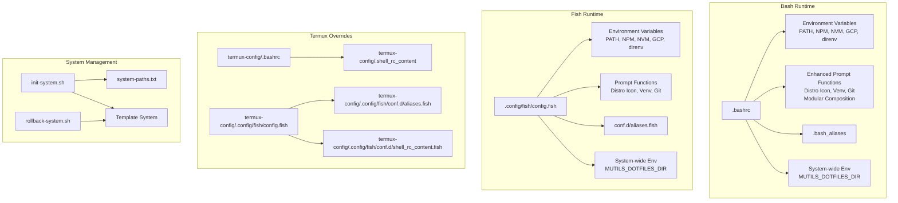

**Diagram sources**
- [.bashrc](file://.bashrc#L1-L367)
- [.config/fish/config.fish](file://.config/fish/config.fish#L1-L179)
- [termux-config/.bashrc](file://termux-config/.bashrc#L1-L38)
- [termux-config/.shell_rc_content](file://termux-config/.shell_rc_content#L1-L135)
- [termux-config/.config/fish/config.fish](file://termux-config/.config/fish/config.fish#L1-L184)
- [termux-config/.config/fish/conf.d/aliases.fish](file://termux-config/.config/fish/conf.d/aliases.fish#L1-L156)
- [termux-config/.config/fish/conf.d/shell_rc_content.fish](file://termux-config/.config/fish/conf.d/shell_rc_content.fish#L1-L20)
- [init-system.sh](file://init-system.sh#L321-L345)
- [rollback-system.sh](file://rollback-system.sh#L257-L275)
- [system-paths.txt](file://system-paths.txt#L1-L7)
- [init-symlinks.sh](file://init-symlinks.sh#L350-L365)
- [.m-utils.template](file://.m-utils.template#L1-L77)

## Detailed Component Analysis

### Desktop Bash Configuration
- **Enhanced Modular Prompt System**: Interactive guard and history tuning ensure reliable interactive shells.
- **Improved Git Branch Detection**: New `__git_branch()` function with sophisticated fallback mechanisms:
  - Primary: `git symbolic-ref --short HEAD` for active branches
  - Secondary: `git describe --tags --exact-match` for tag-only repos
  - Tertiary: `git rev-parse --short HEAD` for detached HEAD states
- **Better Virtual Environment Integration**: Enhanced `__venv_name()` function with:
  - Project-aware naming for generic venv directories (env, venv, .env, .venv)
  - Centralized venv detection with fallback to CWD name
  - Explicit prompt respect for uv/venv environments
- **Modular Prompt Composition**: Dedicated functions for distro icon, virtualenv/conda name, git branch, and path formatting.
- **Two-line Prompt**: Mimics Fish's layout for familiarity with enhanced composability.
- **Streamlined PATH Optimization**: Appends system admin directories and prepends user toolchains with improved deduplication.
- **System-wide Environment Variables**: MUTILS_DOTFILES_DIR configured for cross-shell availability.
- **Enhanced Environment Management**: Google Cloud SDK auth plugin, NPM packages, NVM, and direnv integration.
- **Aliases and functions** mirror Fish capabilities: navigation, system info, fzf previews, extract archives, process killer, and text search.

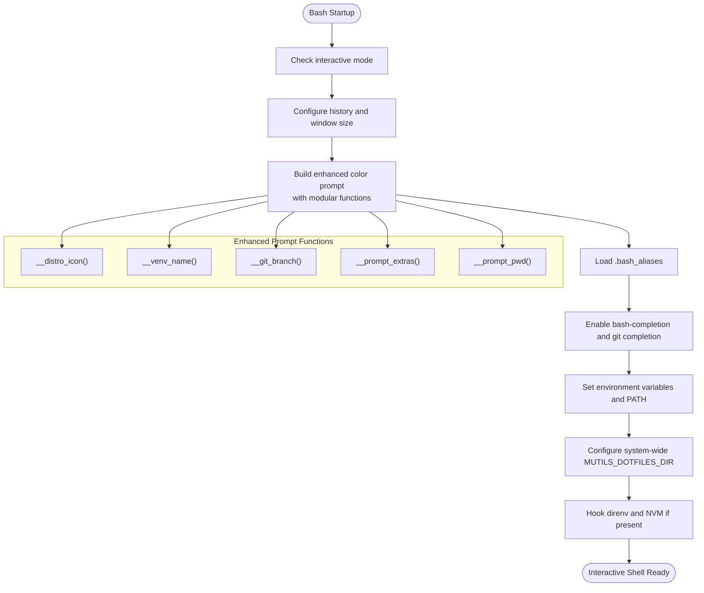

**Diagram sources**
- [.bashrc](file://.bashrc#L5-L367)
- [.bash_aliases](file://.bash_aliases#L1-L196)

**Section sources**
- [.bashrc](file://.bashrc#L55-L196)
- [.bash_aliases](file://.bash_aliases#L1-L196)

### Desktop Fish Configuration
- Custom greeting optionally prints fortunes.
- Prompt functions compute distro icon, virtualenv/conda name, and git branch.
- **Enhanced Environment Management**: Global exports using -gx flag for development directories and streamlined environment variable management.
- **Improved PATH Manipulation**: Streamlined PATH updates with global exports for better performance.
- PATH prepended with user toolchains and appended with system admin directories.
- NPM and NVM directories integrated; Google Cloud SDK enabled; direnv hook loaded.

**Diagram sources**
- [.config/fish/config.fish](file://.config/fish/config.fish#L1-L179)

**Section sources**
- [.config/fish/config.fish](file://.config/fish/config.fish#L1-L179)
- [.config/fish/conf.d/aliases.fish](file://.config/fish/conf.d/aliases.fish#L1-L148)

### Termux Bash Configuration
- Detects Linux distribution via /etc/os-release and sets a distro icon.
- Builds a compact prompt with icon and working directory.
- Sources shared content and aliases from Termux home to unify behavior across shells.

**Diagram sources**
- [termux-config/.bashrc](file://termux-config/.bashrc#L1-L38)
- [termux-config/.aliases](file://termux-config/.aliases#L1-L550)
- [termux-config/.shell_rc_content](file://termux-config/.shell_rc_content#L1-L135)

**Section sources**
- [termux-config/.bashrc](file://termux-config/.bashrc#L1-L38)
- [termux-config/.aliases](file://termux-config/.aliases#L1-L550)
- [termux-config/.shell_rc_content](file://termux-config/.shell_rc_content#L1-L135)

### Termux Fish Configuration
- Prompt mirrors desktop Fish with distro icon, venv, and git branch.
- **Enhanced PATH Manipulation**: Extensive Termux-specific PATH prepends for tools like codex CLI and llama.cpp.
- Sets Hugging Face cache directories and enables interactive hooks for direnv and nvm.
- Loads Fish-specific shell content for zoxide and FZF colors.

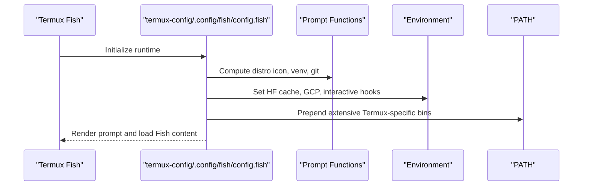

**Diagram sources**
- [termux-config/.config/fish/config.fish](file://termux-config/.config/fish/config.fish#L1-L184)
- [termux-config/.config/fish/conf.d/shell_rc_content.fish](file://termux-config/.config/fish/conf.d/shell_rc_content.fish#L1-L20)

**Section sources**
- [termux-config/.config/fish/config.fish](file://termux-config/.config/fish/config.fish#L1-L184)
- [termux-config/.config/fish/conf.d/aliases.fish](file://termux-config/.config/fish/conf.d/aliases.fish#L1-L156)
- [termux-config/.config/fish/conf.d/shell_rc_content.fish](file://termux-config/.config/fish/conf.d/shell_rc_content.fish#L1-L20)

### Enhanced Prompt Implementation Details
- **Distro Icon Detection**: Reads /etc/os-release and maps to Unicode icons with comprehensive distribution support.
- **Improved Virtual Environment Resolution**: Enhanced logic for project-aware naming with centralized venv detection and explicit prompt respect.
- **Sophisticated Git Branch Detection**: Multiple fallback mechanisms for different repository states and edge cases.
- **Modular Prompt Composition**: Dedicated functions for each prompt component with proper spacing and formatting.
- **Path Abbreviation**: Shortens directories except the last segment with intelligent handling of home directory and root paths.
- **Fish Prompt Integration**: Uses color tokens and fish_vcs_prompt for branch display with consistent styling.

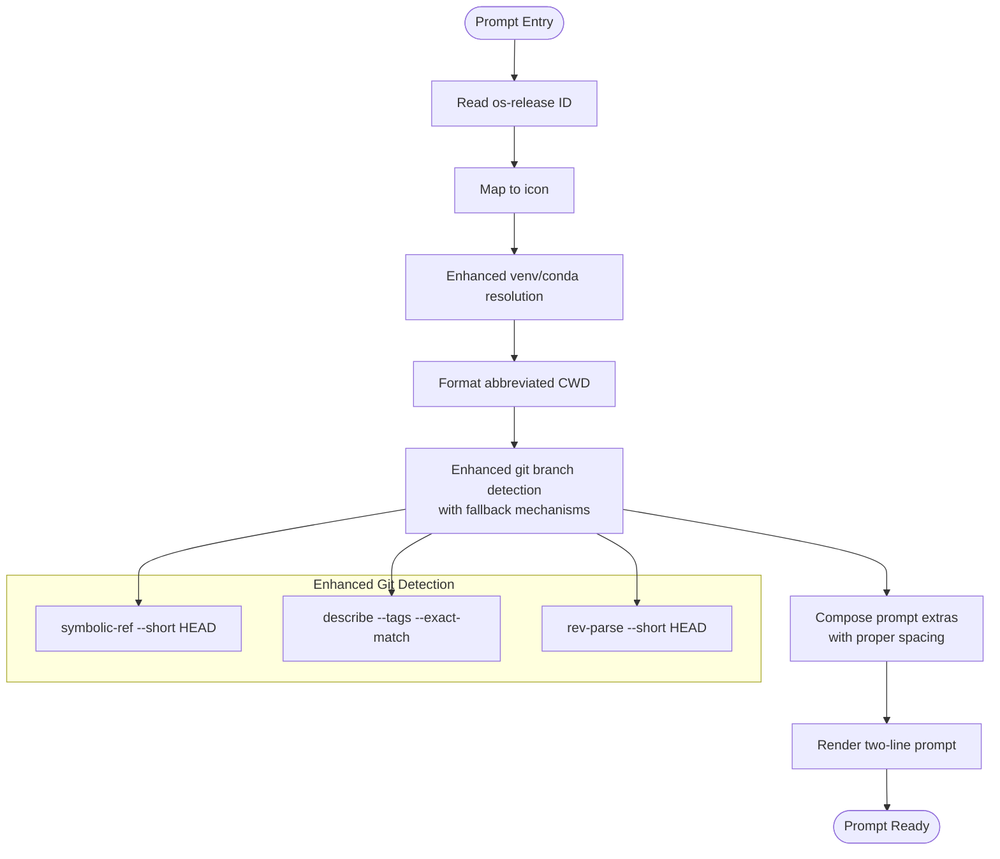

**Diagram sources**
- [.bashrc](file://.bashrc#L55-L196)
- [.config/fish/config.fish](file://.config/fish/config.fish#L15-L109)

**Section sources**
- [.bashrc](file://.bashrc#L55-L196)
- [.config/fish/config.fish](file://.config/fish/config.fish#L15-L109)

### Environment Variable Management and PATH Optimization
- **Desktop Bash**:
  - **Enhanced PATH Management**: Streamlined PATH updates with improved deduplication logic.
  - Appends /usr/sbin and /sbin if missing.
  - Prepends $HOME/.local/bin and $HOME/.cargo/bin if present.
  - Sets NPM_PACKAGES and NVM_DIR if directories exist.
  - Enables Google Cloud SDK auth plugin and disables Python prompt overrides.
  - **System-wide Environment**: MUTILS_DOTFILES_DIR configured in /etc/environment for cross-shell availability.
- **Desktop Fish**:
  - **Enhanced PATH Manipulation**: Uses -gx flag for global exports and streamlined environment variable management.
  - Same PATH strategy with set -gx and contains checks.
  - Sets TERM, VIRTUAL_ENV_DISABLE_PROMPT, CONDA_CHANGEPS1, DIRENV_LOG_FORMAT.
  - Enables Google Cloud SDK auth plugin.
- **Termux Fish**:
  - **Extensive PATH Manipulation**: Extends PATH with Termux-specific toolchains (e.g., codex CLI, llama.cpp).
  - Sets Hugging Face cache directories.

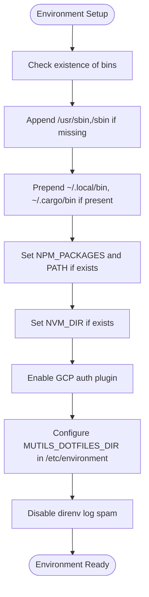

**Diagram sources**
- [.bashrc](file://.bashrc#L307-L367)
- [.config/fish/config.fish](file://.config/fish/config.fish#L123-L179)
- [termux-config/.config/fish/config.fish](file://termux-config/.config/fish/config.fish#L127-L184)
- [init-system.sh](file://init-system.sh#L321-L345)

**Section sources**
- [.bashrc](file://.bashrc#L307-L367)
- [.config/fish/config.fish](file://.config/fish/config.fish#L123-L179)
- [termux-config/.config/fish/config.fish](file://termux-config/.config/fish/config.fish#L127-L184)
- [init-system.sh](file://init-system.sh#L321-L345)

### Alias Systems and Functions
- **Desktop Bash and Fish share aliases** for navigation, system info, fzf previews, and text search.
- **Enhanced Functions** unify common tasks: copy+go, move+go, mkdir+go, extract archives with progress, interactive process killer, and fuzzy find-and-open editors.
- **Termux Bash aliases** include Termux-specific shortcuts (e.g., SD card navigation, reload settings).

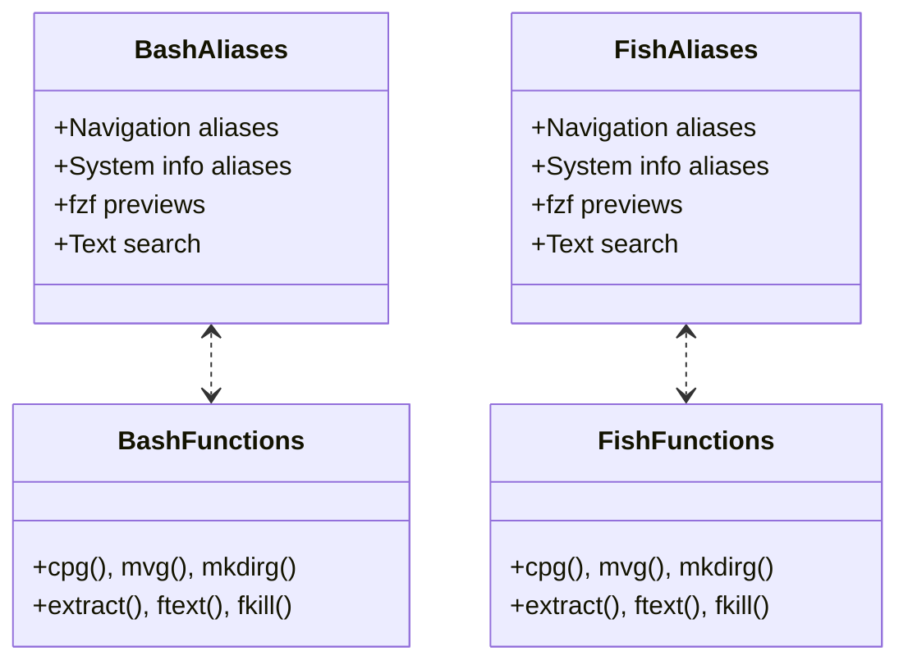

**Diagram sources**
- [.bash_aliases](file://.bash_aliases#L1-L196)
- [.config/fish/conf.d/aliases.fish](file://.config/fish/conf.d/aliases.fish#L1-L148)
- [termux-config/.aliases](file://termux-config/.aliases#L1-L550)
- [termux-config/.config/fish/conf.d/aliases.fish](file://termux-config/.config/fish/conf.d/aliases.fish#L1-L156)

**Section sources**
- [.bash_aliases](file://.bash_aliases#L1-L196)
- [.config/fish/conf.d/aliases.fish](file://.config/fish/conf.d/aliases.fish#L1-L148)
- [termux-config/.aliases](file://termux-config/.aliases#L1-L550)
- [termux-config/.config/fish/conf.d/aliases.fish](file://termux-config/.config/fish/conf.d/aliases.fish#L1-L156)

### Interactive Shell Enhancements
- **Bash**:
  - Programmable completion and git completion.
  - SSH identities loader hook.
- **Fish**:
  - Greeting with optional fortune output.
  - Interactive hooks for direnv and nvm.
- **Termux**:
  - zoxide integration for smarter cd.
  - FZF color theme customization.
  - Termux-specific PATH and environment variables.

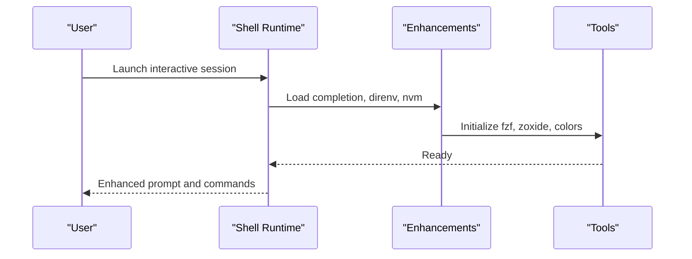

**Diagram sources**
- [.bashrc](file://.bashrc#L242-L261)
- [.config/fish/config.fish](file://.config/fish/config.fish#L175-L179)
- [termux-config/.config/fish/conf.d/shell_rc_content.fish](file://termux-config/.config/fish/conf.d/shell_rc_content.fish#L1-L20)

**Section sources**
- [.bashrc](file://.bashrc#L242-L261)
- [.config/fish/config.fish](file://.config/fish/config.fish#L175-L179)
- [termux-config/.config/fish/conf.d/shell_rc_content.fish](file://termux-config/.config/fish/conf.d/shell_rc_content.fish#L1-L20)

## Template-Based Configuration System
The repository implements a template-based configuration system for m-utils that provides structured, user-customizable settings separate from the core dotfiles.

### Template System Architecture
- **Template File**: .m-utils.template serves as the master template for m-utils configuration
- **Initialization Script**: init-symlinks.sh creates ~/.m-utils from the template during setup
- **Configuration Isolation**: ~/.m-utils is .gitignored and contains personal configuration separate from repository files
- **Structured Configuration**: TOML-style format with clear sections for different m-utils features

### Configuration Features
- **Laptop Lid Close Behavior**: Configurable power modes for battery and AC power with sleep delays
- **Firewall Configuration**: UFW firewall rules for remote development and SSH access
- **Development Server Ports**: Predefined ranges for Flask, Django, and Node.js development servers
- **Rate Limiting**: SSH access limited to prevent brute force attacks

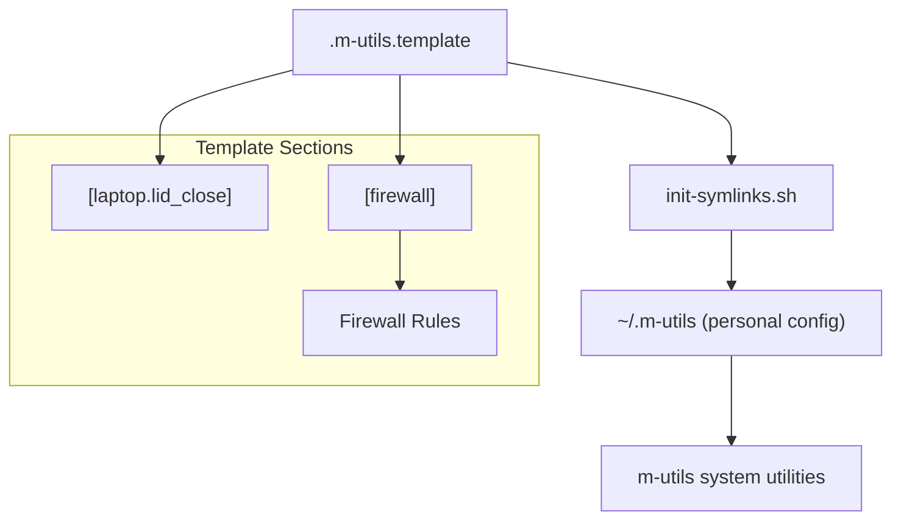

**Diagram sources**
- [.m-utils.template](file://.m-utils.template#L1-L77)
- [init-symlinks.sh](file://init-symlinks.sh#L350-L365)

**Section sources**
- [.m-utils.template](file://.m-utils.template#L1-L77)
- [init-symlinks.sh](file://init-symlinks.sh#L350-L365)

## System Environment Management
The repository provides comprehensive system-wide environment management through automated deployment and rollback capabilities.

### System Deployment System
- **init-system.sh**: Deploys system configuration files and sets up environment variables
- **Template-based Deployment**: Uses system-paths.txt to define which files to deploy
- **Backup Generation**: Creates timestamped backups before modifying system files
- **Environment Variable Management**: Configures MUTILS_DOTFILES_DIR in /etc/environment for cross-shell availability

### Rollback System
- **rollback-system.sh**: Restores system files from backups with selective restoration options
- **Date-based Restoration**: Supports rolling back to specific dates using timestamped backups
- **Selective Target Restoration**: Allows restoration of individual system files
- **Environment Cleanup**: Removes system-wide environment variables during rollback

### System Components
- **m-utils Binary**: Installed to /usr/bin/m-utils for system-wide availability
- **Polkit Rules**: 49-allow-hibernate-sudoers.rules for hibernation permissions
- **Root Configuration**: Root user aliases and system-wide bash configuration

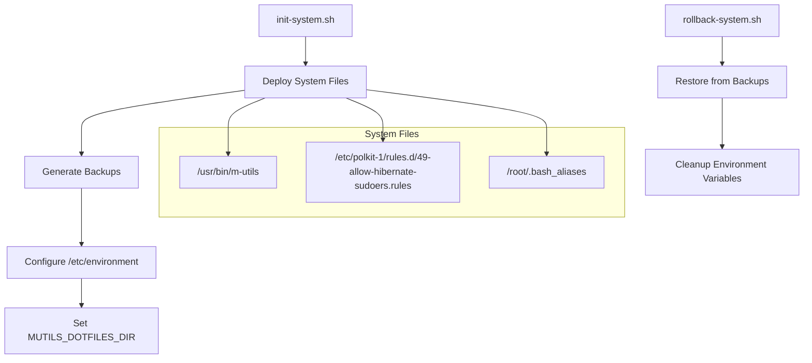

**Diagram sources**
- [init-system.sh](file://init-system.sh#L321-L345)
- [rollback-system.sh](file://rollback-system.sh#L257-L275)
- [system-paths.txt](file://system-paths.txt#L1-L7)
- [system/usr/bin/m-utils](file://system/usr/bin/m-utils)
- [system/etc/polkit-1/rules.d/49-allow-hibernate-sudoers.rules](file://system/etc/polkit-1/rules.d/49-allow-hibernate-sudoers.rules#L1-L17)
- [system/root/.bash_aliases](file://system/root/.bash_aliases#L1-L8)

**Section sources**
- [init-system.sh](file://init-system.sh#L1-L351)
- [rollback-system.sh](file://rollback-system.sh#L1-L352)
- [system-paths.txt](file://system-paths.txt#L1-L7)
- [system/usr/bin/m-utils](file://system/usr/bin/m-utils)
- [system/etc/polkit-1/rules.d/49-allow-hibernate-sudoers.rules](file://system/etc/polkit-1/rules.d/49-allow-hibernate-sudoers.rules#L1-L17)
- [system/root/.bash_aliases](file://system/root/.bash_aliases#L1-L8)

## Dependency Analysis
- **Shell runtime depends on**:
  - Environment variables for Python/Conda, NPM/NVM, Google Cloud SDK, and direnv.
  - PATH entries for user-installed tools and system binaries.
  - **Enhanced prompt functions** and VCS integration with improved git branch detection.
  - **System-wide environment variables** configured through MUTILS_DOTFILES_DIR.
- **Template-based configuration** depends on .m-utils.template and init-symlinks.sh.
- **System deployment** depends on init-system.sh, rollback-system.sh, and system-paths.txt.
- **Termux adds** platform-specific PATH entries and environment variables for desktop-like workflows.
- **Aliases and functions** are shared conceptually across Bash and Fish with shell-specific syntax.

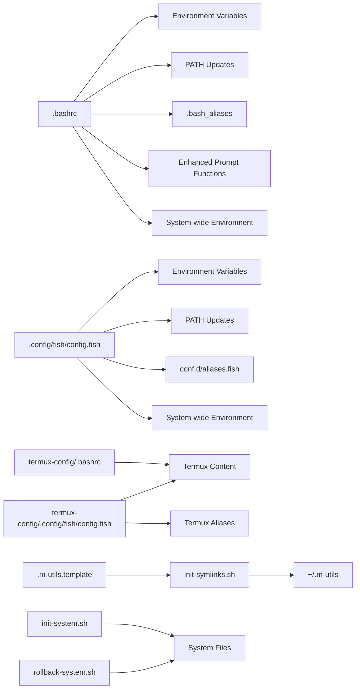

**Diagram sources**
- [.bashrc](file://.bashrc#L307-L367)
- [.config/fish/config.fish](file://.config/fish/config.fish#L123-L179)
- [termux-config/.bashrc](file://termux-config/.bashrc#L1-L38)
- [termux-config/.config/fish/config.fish](file://termux-config/.config/fish/config.fish#L127-L184)
- [.m-utils.template](file://.m-utils.template#L1-L77)
- [init-symlinks.sh](file://init-symlinks.sh#L350-L365)
- [init-system.sh](file://init-system.sh#L321-L345)
- [rollback-system.sh](file://rollback-system.sh#L257-L275)

**Section sources**
- [.bashrc](file://.bashrc#L307-L367)
- [.config/fish/config.fish](file://.config/fish/config.fish#L123-L179)
- [termux-config/.bashrc](file://termux-config/.bashrc#L1-L38)
- [termux-config/.config/fish/config.fish](file://termux-config/.config/fish/config.fish#L127-L184)
- [.m-utils.template](file://.m-utils.template#L1-L77)
- [init-symlinks.sh](file://init-symlinks.sh#L350-L365)
- [init-system.sh](file://init-system.sh#L321-L345)
- [rollback-system.sh](file://rollback-system.sh#L257-L275)

## Performance Considerations
- **Enhanced Prompt Computation**:
  - Minimize external calls per prompt render; cache distro icon and venv name where appropriate.
  - **Optimized Git Detection**: Efficient fallback mechanisms reduce unnecessary git operations.
  - **Modular Function Design**: Separate functions allow for selective recomputation and caching.
- **Streamlined PATH Management**:
  - **Improved Deduplication**: Enhanced PATH deduplication logic reduces shell lookup overhead.
  - **Global Exports**: Use -gx flag in Fish for efficient global environment variable management.
  - **System-wide Variables**: MUTILS_DOTFILES_DIR eliminates redundant environment variable setup across shells.
- **Template-based Configuration**:
  - **Lazy Loading**: Template files are only processed when needed, reducing startup overhead.
  - **Structured Format**: TOML-style configuration allows for efficient parsing and validation.
- **System Deployment**:
  - **Batch Processing**: System deployment scripts minimize file system operations.
  - **Backup Strategy**: Intelligent backup generation prevents unnecessary file copying.
- **Aliases and Functions**:
  - Use shell-native features (e.g., contains checks in Fish, regex checks in Bash) to avoid extra processes.
- **Termux**:
  - Limit environment variable proliferation; keep only necessary variables for desktop-like workflows.

## Troubleshooting Guide
Common issues and remedies:
- **Prompt not rendering correctly**:
  - Verify interactive mode guard and color support detection.
  - Ensure required utilities (e.g., git, bat, eza) are installed and available on PATH.
  - **Check enhanced git detection**: Verify git repository state and permissions for branch detection.
- **PATH not updated as expected**:
  - **Verify system-wide environment variables**: Check if MUTILS_DOTFILES_DIR is properly configured in /etc/environment.
  - Confirm directory existence and that enhanced PATH deduplication logic is not preventing updates.
  - **Review global exports**: Ensure -gx flag is being used correctly in Fish for environment variables.
  - Reorder PATH prepends/prepends to ensure precedence.
- **Template configuration issues**:
  - **Check template file**: Verify .m-utils.template exists and is readable.
  - **Verify initialization**: Ensure init-symlinks.sh successfully created ~/.m-utils.
  - **Validate configuration format**: Check TOML-style syntax in ~/.m-utils.
- **Aliases or functions not available**:
  - Check that .bash_aliases or Fish conf.d/aliases.fish are sourced and syntax is valid.
  - For Fish, ensure functions are defined with correct signatures and invoked with argv indexing.
- **System deployment problems**:
  - **Verify root privileges**: Ensure init-system.sh is run with appropriate permissions.
  - **Check system-paths.txt**: Validate that all referenced files exist in the system/ directory.
  - **Review backup generation**: Ensure timestamped backups are being created correctly.
- **Termux-specific problems**:
  - Confirm Termux environment variables (e.g., PREFIX) and that Termux content is sourced.
  - Validate Termux PATH prepends for tools like codex CLI and llama.cpp.

**Section sources**
- [.bashrc](file://.bashrc#L5-L367)
- [.config/fish/config.fish](file://.config/fish/config.fish#L1-L179)
- [termux-config/.bashrc](file://termux-config/.bashrc#L1-L38)
- [termux-config/.aliases](file://termux-config/.aliases#L1-L550)
- [termux-config/.config/fish/conf.d/aliases.fish](file://termux-config/.config/fish/conf.d/aliases.fish#L1-L156)
- [init-system.sh](file://init-system.sh#L1-L351)
- [rollback-system.sh](file://rollback-system.sh#L1-L352)
- [.m-utils.template](file://.m-utils.template#L1-L77)
- [init-symlinks.sh](file://init-symlinks.sh#L350-L365)

## Conclusion
The repository provides a robust, cross-platform shell configuration strategy with enhanced system-wide environment management:
- **Desktop Bash and Fish share a consistent prompt**, environment, and productivity tooling with enhanced modular prompt system.
- **Template-based configuration system** provides structured, user-customizable settings for m-utils utilities.
- **System-wide environment management** through MUTILS_DOTFILES_DIR ensures consistent configuration across shells.
- **Automated system deployment** with backup and rollback capabilities for safe system file management.
- **Termux adapts these patterns** with platform-specific PATH and environment variables.
- **Symlink management** via paths.txt and paths-termux.txt streamlines deployment across devices.
- **Enhanced functionality** includes improved git branch detection, better virtual environment integration, and modular prompt composition.
Adopting these patterns ensures predictable, maintainable shell environments across diverse platforms with improved reliability, system-wide consistency, and streamlined configuration management.

## Appendices

### Practical Examples and Patterns
- **Prompt customization**:
  - Customize distro icon mapping and prompt segments in both Bash and Fish.
  - **Use enhanced git branch integration** and sophisticated virtualenv/conda name resolution consistently.
  - **Leverage modular prompt functions** for maintainable and extensible prompt customization.
- **Environment setup**:
  - **Centralize environment variables** for Google Cloud SDK, NPM, and NVM.
  - **Configure system-wide variables** using MUTILS_DOTFILES_DIR for cross-shell availability.
  - Disable shell-specific prompt overrides to rely on custom prompts.
- **PATH optimization**:
  - **Use global exports** (-gx flag in Fish) for efficient environment variable management.
  - Prepend user toolchains and append system admin directories with enhanced deduplication.
  - Keep Termux-specific PATH entries minimal and targeted.
- **Template-based configuration**:
  - **Customize m-utils settings** through ~/.m-utils with structured TOML-style format.
  - **Leverage template system** for consistent configuration across environments.
  - **Separate personal configuration** from repository files using .gitignore.
- **System deployment**:
  - **Use init-system.sh** for safe system file deployment with backup generation.
  - **Utilize rollback-system.sh** for selective restoration and environment cleanup.
  - **Manage system-wide environment** through automated configuration.
- **Cross-platform shell compatibility**:
  - Mirror aliases and functions across Bash and Fish with shell-specific syntax.
  - Use shared content files where appropriate and source them conditionally.
  - **Implement modular prompt functions** for consistent behavior across different shells.
  - **Leverage template system** for environment-specific configuration management.

**Section sources**
- [.bashrc](file://.bashrc#L307-L367)
- [.config/fish/config.fish](file://.config/fish/config.fish#L123-L179)
- [termux-config/.config/fish/config.fish](file://termux-config/.config/fish/config.fish#L127-L184)
- [.bash_aliases](file://.bash_aliases#L1-L196)
- [.config/fish/conf.d/aliases.fish](file://.config/fish/conf.d/aliases.fish#L1-L148)
- [termux-config/.aliases](file://termux-config/.aliases#L1-L550)
- [termux-config/.config/fish/conf.d/aliases.fish](file://termux-config/.config/fish/conf.d/aliases.fish#L1-L156)
- [.m-utils.template](file://.m-utils.template#L1-L77)
- [init-system.sh](file://init-system.sh#L321-L345)
- [rollback-system.sh](file://rollback-system.sh#L257-L275)
- [init-symlinks.sh](file://init-symlinks.sh#L350-L365)