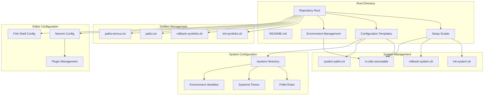
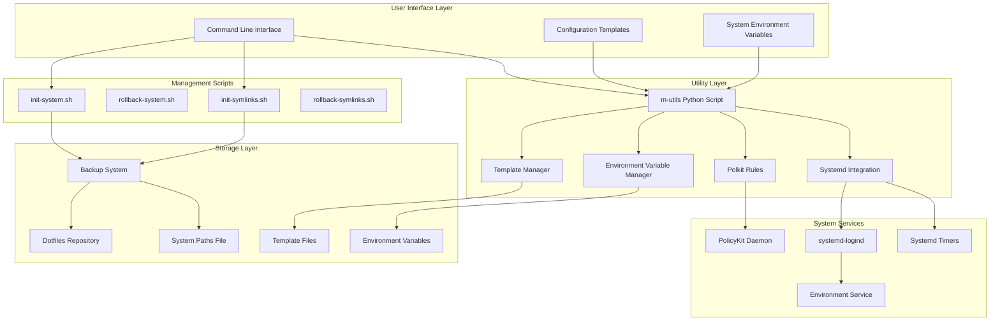
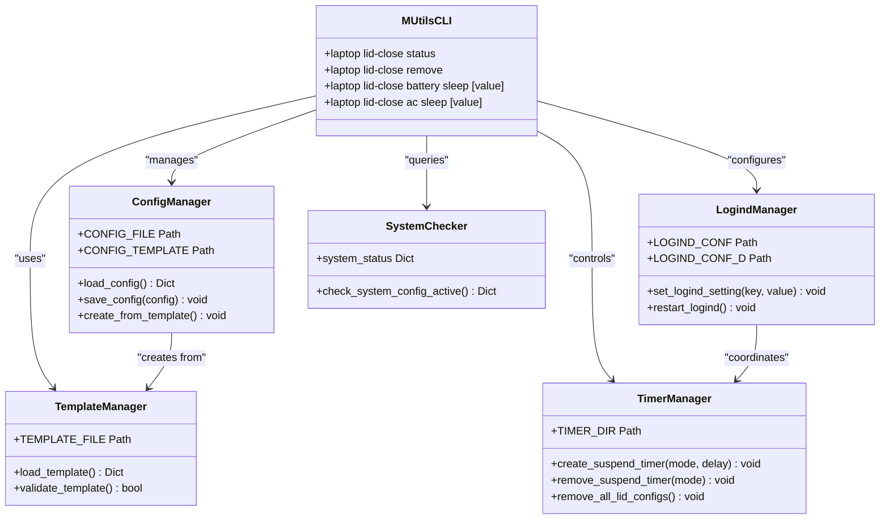
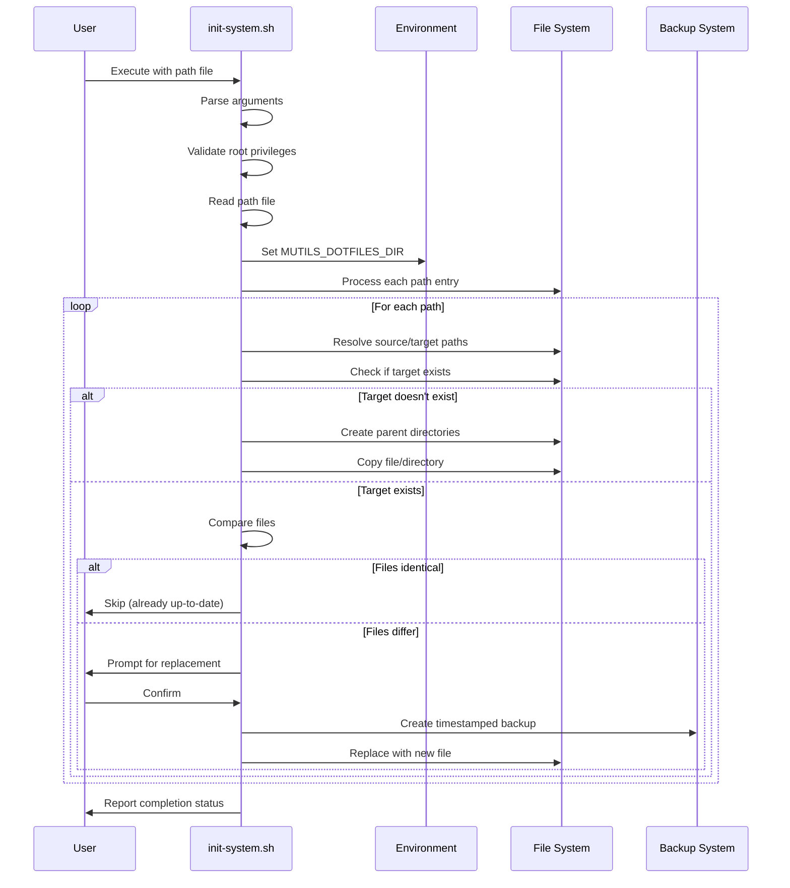
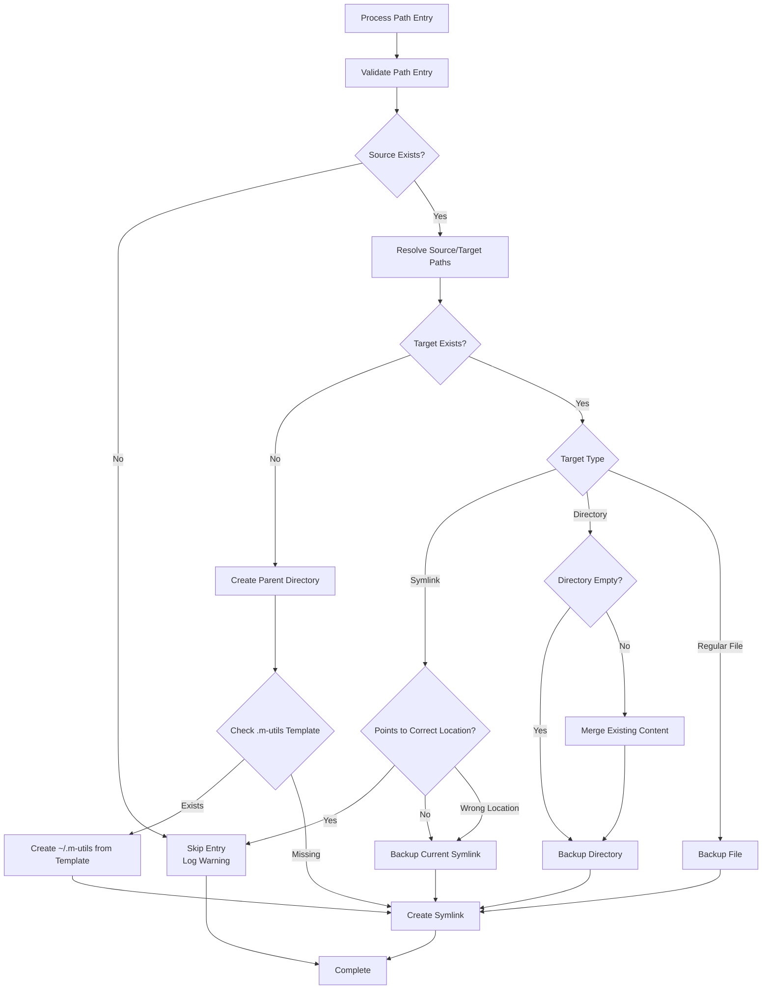
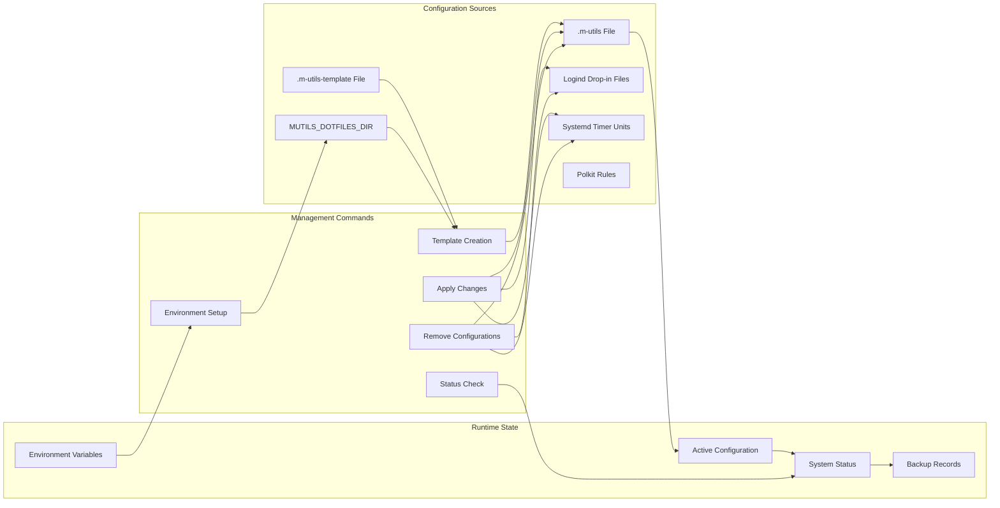
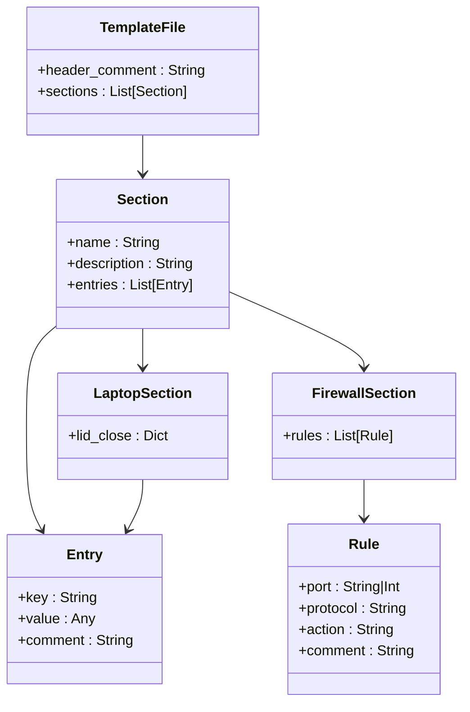
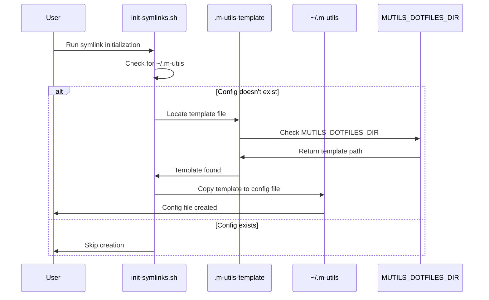

# M-Utils System Management

<cite>
**Referenced Files in This Document**
- [README.md](file://README.md)
- [init-system.sh](file://init-system.sh)
- [init-symlinks.sh](file://init-symlinks.sh)
- [rollback-system.sh](file://rollback-system.sh)
- [rollback-symlinks.sh](file://rollback-symlinks.sh)
- [system-paths.txt](file://system-paths.txt)
- [paths.txt](file://paths.txt)
- [paths-termux.txt](file://paths-termux.txt)
- [m-utils](file://system/usr/bin/m-utils)
- [.m-utils.template](file://.m-utils.template)
- [49-allow-hibernate-sudoers.rules](file://system/etc/polkit-1/rules.d/49-allow-hibernate-sudoers.rules)
- [root.bash_aliases](file://system/root/.bash_aliases)
- [nvim.init.vim](file://.config/nvim/init.vim)
- [fish.config.fish](file://.config/fish/config.fish)
</cite>

## Update Summary
**Changes Made**
- Updated template-based configuration system documentation to reflect new .m-utils.template approach
- Added new section covering automatic template creation during symlink initialization
- Enhanced m-utils framework documentation with expanded environment variable management
- Updated firewall configuration system documentation with new TOML-based approach
- Revised architecture diagrams to show template-driven configuration flow

## Table of Contents
1. [Introduction](#introduction)
2. [Project Structure](#project-structure)
3. [Core Components](#core-components)
4. [Architecture Overview](#architecture-overview)
5. [Detailed Component Analysis](#detailed-component-analysis)
6. [Template-Based Configuration System](#template-based-configuration-system)
7. [Dependency Analysis](#dependency-analysis)
8. [Performance Considerations](#performance-considerations)
9. [Troubleshooting Guide](#troubleshooting-guide)
10. [Conclusion](#conclusion)

## Introduction
M-Utils System Management is a comprehensive dotfiles and system configuration management toolkit designed to streamline the setup and maintenance of development environments across Linux systems. The project provides automated tools for managing symbolic links, copying system files, rolling back changes, and configuring laptop power management behaviors.

The system centers around an enhanced Python-based utility called `m-utils` that manages systemd integration, Polkit permissions, and delayed suspend functionality for laptops. It works alongside Bash scripts that handle dotfiles deployment and system-wide file management, creating a cohesive ecosystem for maintaining consistent development environments. The framework now features a template-based configuration system that replaces the previous manual configuration approach.

## Project Structure
The repository follows a modular structure optimized for system management and dotfiles deployment:



**Diagram sources**
- [init-system.sh](file://init-system.sh#L321-L346)
- [init-symlinks.sh](file://init-symlinks.sh#L342-L365)
- [system-paths.txt](file://system-paths.txt#L1-L6)
- [m-utils](file://system/usr/bin/m-utils#L32-L42)

**Section sources**
- [README.md](file://README.md#L1-L35)
- [init-system.sh](file://init-system.sh#L1-L351)
- [init-symlinks.sh](file://init-symlinks.sh#L1-L373)

## Core Components

### System File Management Scripts
The system provides two primary scripts for managing system-level files:

**init-system.sh**: Copies files from the dotfiles repository to their system destinations with intelligent conflict resolution and backup generation. It supports both interactive and batch modes, handles type mismatches, and preserves file attributes during copying. **Updated** Now includes system-wide environment variable management through `/etc/environment`.

**rollback-system.sh**: Reverses system file changes by restoring from timestamped backups. It supports selective restoration, date-based targeting, and dry-run previews for safe rollback operations.

### Dotfiles Management Scripts
The dotfiles management system focuses on symbolic link creation and maintenance:

**init-symlinks.sh**: Creates symbolic links from the dotfiles repository to user home directories, with sophisticated handling for existing files, directories, and broken symlinks. **Enhanced** Now includes automatic template creation for m-utils configuration files using the `.m-utils-template` system.

**rollback-symlinks.sh**: Restores dotfiles from timestamped backups, supporting individual file restoration, bulk operations, and selective targeting with date filters.

### Laptop Power Management Utility
The `m-utils` Python script provides advanced laptop configuration capabilities with a new template-based configuration system:

- **Delayed Suspend**: Configures systemd timers for delayed laptop lid closure
- **Power Mode Management**: Handles both battery and AC power configurations
- **Systemd Integration**: Manages logind.conf.d drop-in files and systemd timer units
- **Polkit Permissions**: Works with PolicyKit rules for hibernation controls
- **Template-Based Configuration**: Automatically creates user configuration files from templates
- **Environment Variable Management**: Integrates with system-wide environment variables

**Section sources**
- [init-system.sh](file://init-system.sh#L321-L346)
- [rollback-system.sh](file://rollback-system.sh#L1-L329)
- [init-symlinks.sh](file://init-symlinks.sh#L342-L365)
- [rollback-symlinks.sh](file://rollback-symlinks.sh#L1-L316)
- [m-utils](file://system/usr/bin/m-utils#L1-L810)

## Architecture Overview



**Diagram sources**
- [m-utils](file://system/usr/bin/m-utils#L32-L42)
- [init-system.sh](file://init-system.sh#L321-L346)
- [init-symlinks.sh](file://init-symlinks.sh#L342-L365)
- [49-allow-hibernate-sudoers.rules](file://system/etc/polkit-1/rules.d/49-allow-hibernate-sudoers.rules#L1-L17)

The architecture implements a layered approach where user commands trigger scripts that manage system resources through appropriate privilege escalation mechanisms. The system maintains comprehensive backup capabilities and provides both interactive and automated operation modes. **Enhanced** with template-based configuration management and system-wide environment variable integration.

**Section sources**
- [m-utils](file://system/usr/bin/m-utils#L32-L42)
- [init-system.sh](file://init-system.sh#L321-L346)
- [49-allow-hibernate-sudoers.rules](file://system/etc/polkit-1/rules.d/49-allow-hibernate-sudoers.rules#L1-L17)

## Detailed Component Analysis

### m-utils Laptop Power Management System

The `m-utils` utility implements a sophisticated laptop power management system with the following key components:



**Diagram sources**
- [m-utils](file://system/usr/bin/m-utils#L48-L82)
- [m-utils](file://system/usr/bin/m-utils#L274-L322)

The system provides three operational modes for lid closure:

1. **Immediate Suspend (value = 0)**: Uses systemd-logind's built-in suspend action
2. **Disabled (value = false)**: Sets HandleLidSwitch to ignore for complete inactivity
3. **Delayed Suspend (value = N minutes)**: Creates systemd timers for delayed action

**Section sources**
- [m-utils](file://system/usr/bin/m-utils#L274-L322)
- [.m-utils.template](file://.m-utils.template#L1-L77)

### System File Deployment Pipeline

The system file management follows a structured deployment process:



**Diagram sources**
- [init-system.sh](file://init-system.sh#L222-L258)
- [init-system.sh](file://init-system.sh#L321-L346)

**Section sources**
- [init-system.sh](file://init-system.sh#L222-L258)
- [system-paths.txt](file://system-paths.txt#L1-L6)

### Dotfiles Symbolic Link Management

The dotfiles management system implements intelligent symlink handling with automatic template creation:



**Diagram sources**
- [init-symlinks.sh](file://init-symlinks.sh#L192-L223)
- [init-symlinks.sh](file://init-symlinks.sh#L342-L365)

**Section sources**
- [init-symlinks.sh](file://init-symlinks.sh#L192-L223)
- [paths.txt](file://paths.txt#L1-L18)

### Configuration Management System

The system employs a hierarchical configuration approach with template-based management:



**Diagram sources**
- [m-utils](file://system/usr/bin/m-utils#L32-L42)
- [m-utils](file://system/usr/bin/m-utils#L48-L82)
- [init-system.sh](file://init-system.sh#L321-L346)

**Section sources**
- [m-utils](file://system/usr/bin/m-utils#L48-L82)
- [init-system.sh](file://init-system.sh#L321-L346)
- [49-allow-hibernate-sudoers.rules](file://system/etc/polkit-1/rules.d/49-allow-hibernate-sudoers.rules#L1-L17)

## Template-Based Configuration System

**New** The m-utils framework now features a comprehensive template-based configuration system that replaces the previous manual configuration approach.

### Template File Structure

The `.m-utils-template` file serves as the foundation for user-specific configuration:



**Diagram sources**
- [.m-utils.template](file://.m-utils.template#L1-L77)

### Automatic Template Creation Process

The system automatically creates user configuration files from templates during initialization:



**Diagram sources**
- [init-symlinks.sh](file://init-symlinks.sh#L342-L365)
- [m-utils](file://system/usr/bin/m-utils#L32-L42)

### Template Loading Mechanism

The m-utils script implements a flexible template loading system:

**Environment Variable Priority**: Checks for `MUTILS_DOTFILES_DIR` environment variable first
**Fallback Mechanism**: Falls back to relative path resolution if environment variable is not set
**Automatic Creation**: Creates user configuration file if template exists but config doesn't

**Section sources**
- [.m-utils.template](file://.m-utils.template#L1-L77)
- [m-utils](file://system/usr/bin/m-utils#L32-L42)
- [init-system.sh](file://init-system.sh#L321-L346)

## Dependency Analysis

The system exhibits well-structured dependencies with clear separation of concerns:

```mermaid
graph TB
subgraph "Python Dependencies"
A[tomli] --> B[m-utils]
C[tomli_w] --> B
end
subgraph "System Dependencies"
D[systemd] --> E[systemd-logind]
D --> F[Systemd Timers]
G[PolicyKit] --> H[Polkit Daemon]
I[Bash] --> J[Shell Scripts]
K[TOML Parser] --> B
L[Environment Variables] --> M[MUTILS_DOTFILES_DIR]
end
subgraph "Configuration Dependencies"
N[logind.conf.d] --> E
O[systemd/system] --> F
P[polkit-1/rules.d] --> H
Q[.m-utils-template] --> B
R[~/.m-utils] --> B
S[/etc/environment] --> L
end
subgraph "File Dependencies"
T[Backup Files] --> U[Date Timestamped]
V[Dotfiles Repository] --> W[Symbolic Links]
X[System Paths] --> Y[File Copying]
Z[Template Files] --> B
end
B --> D
B --> G
B --> K
J --> D
J --> G
J --> I
L --> S
```

**Diagram sources**
- [m-utils](file://system/usr/bin/m-utils#L14-L29)
- [init-system.sh](file://init-system.sh#L321-L346)
- [init-symlinks.sh](file://init-symlinks.sh#L342-L365)

The dependency graph reveals a clean architecture where:
- Python scripts depend on external libraries for configuration parsing (tomli/tomli_w)
- Shell scripts rely on system services for file management and environment variable setup
- Configuration files serve as the bridge between user preferences and system services
- Template files provide standardized configuration blueprints
- Backup systems provide safety mechanisms for all operations

**Section sources**
- [m-utils](file://system/usr/bin/m-utils#L14-L29)
- [init-system.sh](file://init-system.sh#L321-L346)

## Performance Considerations

The system is designed with several performance optimizations:

### Efficient File Operations
- Binary-safe file comparison using `cmp` for identical file detection
- Batch processing of path entries reduces I/O overhead
- Intelligent skipping of unchanged files prevents unnecessary operations
- **Enhanced** Template caching to avoid repeated file system access

### Memory Management
- Stream-based file processing prevents memory exhaustion with large files
- Temporary arrays for backup discovery minimize memory footprint
- Lazy evaluation of system status checks optimizes runtime performance
- **New** Template validation caching for improved startup performance

### Parallel Processing Opportunities
The current implementation processes files sequentially, but could benefit from:
- Concurrent file copying for independent paths
- Asynchronous backup generation
- Parallel symlink creation for multiple targets
- **New** Concurrent template processing for multiple users

### Storage Optimization
- Timestamped backup naming prevents filesystem pollution
- Selective restoration reduces disk usage during rollback operations
- Compressed backup storage for large configuration sets
- **New** Template-based configuration reduces duplication across users

## Troubleshooting Guide

### Common Issues and Solutions

**Permission Denied Errors**
- Ensure scripts are executed with appropriate privileges
- Verify sudo access for system file operations
- Check Polkit configuration for hibernation permissions

**Backup Restoration Failures**
- Verify backup files exist with correct timestamp format
- Check filesystem permissions for target locations
- Validate that backup timestamps fall within acceptable date ranges

**Laptop Configuration Not Applied**
- Confirm systemd-logind service is running
- Verify Polkit rules are properly loaded
- Check systemd daemon status after configuration changes

**Symbolic Link Creation Problems**
- Ensure target directories exist or can be created
- Verify source files are readable and accessible
- Check for existing files that might block symlink creation

**Template Creation Failures**
- **New** Verify `.m-utils-template` file exists in the dotfiles directory
- Check `MUTILS_DOTFILES_DIR` environment variable is properly set
- Ensure write permissions for user home directory

**Section sources**
- [rollback-system.sh](file://rollback-system.sh#L31-L37)
- [rollback-symlinks.sh](file://rollback-symlinks.sh#L12-L28)
- [m-utils](file://system/usr/bin/m-utils#L48-L54)
- [init-system.sh](file://init-system.sh#L321-L346)

### Debugging Procedures

1. **Enable Verbose Logging**: Use `--no-verify` flag for batch operations to see all operations
2. **Check System Status**: Use `m-utils laptop lid-close status` to verify current configuration
3. **Validate Dependencies**: Ensure required Python packages are installed (`tomli`, `tomli_w`)
4. **Review Backup Files**: Examine timestamped backups for restoration verification
5. **Template Debugging**: **New** Check template loading with `m-utils --debug` flag
6. **Environment Variables**: **New** Verify `MUTILS_DOTFILES_DIR` is set correctly

### Recovery Procedures

For complete system recovery:
1. Use `rollback-system.sh --dry-run` to preview changes
2. Execute `rollback-system.sh` with confirmation for actual restoration
3. Restart affected services (systemd-logind, Polkit daemon)
4. Verify configuration integrity with status commands
5. **New** Recreate template-based configuration if corrupted

**Section sources**
- [rollback-system.sh](file://rollback-system.sh#L257-L325)
- [rollback-symlinks.sh](file://rollback-symlinks.sh#L246-L312)

## Conclusion

M-Utils System Management provides a comprehensive solution for maintaining consistent development environments across Linux systems. The toolkit successfully balances automation with safety through its robust backup systems, intelligent conflict resolution, and privilege-aware operations.

**Major Enhancements**:
- **Template-Based Configuration**: Revolutionary approach replacing manual configuration files
- **Automatic Template Creation**: Streamlined setup process with automatic user configuration generation
- **System-Wide Environment Variables**: Enhanced integration with `/etc/environment` for global accessibility
- **Expanded Firewall Management**: TOML-based configuration system for UFW firewall rules

Key strengths of the system include:
- **Modular Design**: Clear separation between system management and dotfiles handling
- **Template-Driven Approach**: Standardized configuration blueprints reduce setup complexity
- **Safety First**: Comprehensive backup systems prevent irreversible changes
- **Flexible Operation**: Support for both interactive and automated workflows
- **System Integration**: Deep integration with systemd, Polkit, and common Linux services
- **Environment Management**: System-wide environment variable support for enhanced accessibility

The architecture demonstrates excellent engineering practices with proper error handling, configuration management, and extensibility for future enhancements. The combination of Python-based utilities and Bash scripting creates an efficient and maintainable system that scales across different deployment scenarios.

Future enhancements could include parallel processing capabilities, enhanced monitoring features, expanded platform support, and additional template customization options for broader compatibility across Linux distributions.