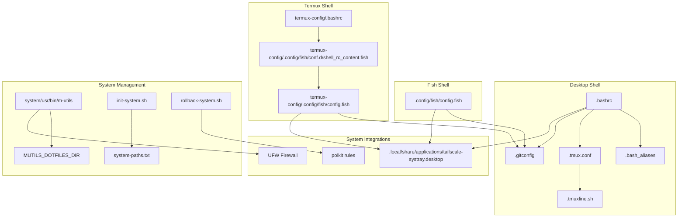
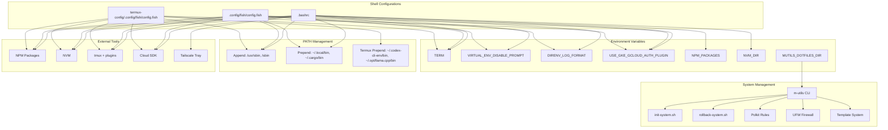
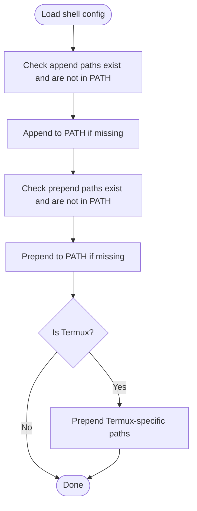
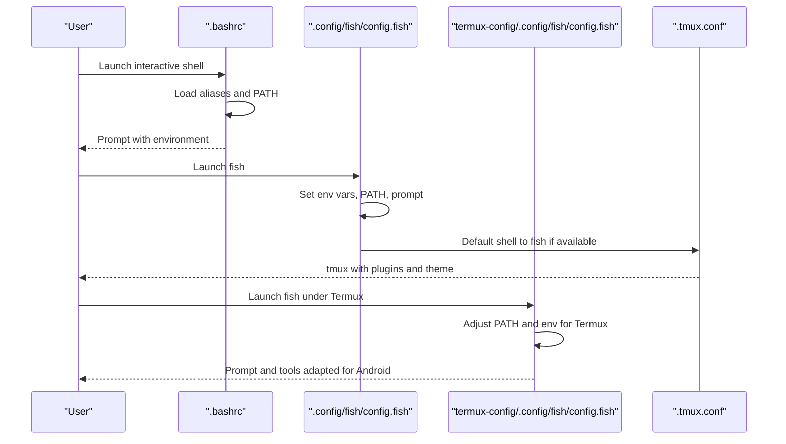
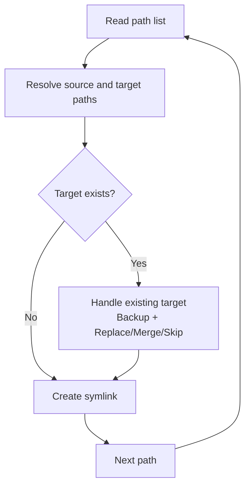
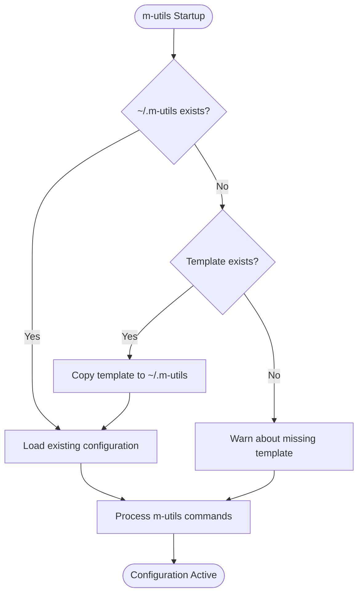
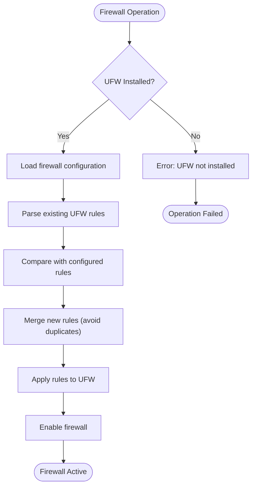
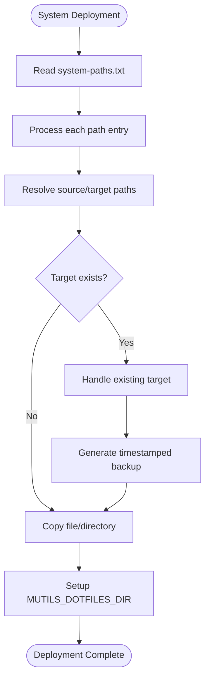
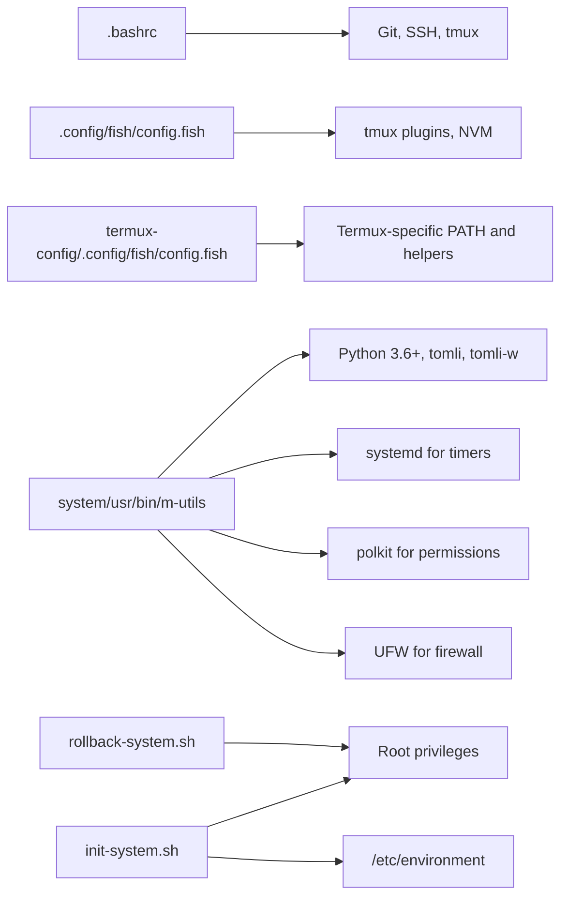

# System Integration

<cite>
**Referenced Files in This Document**
- [.bashrc](file://.bashrc)
- [.bash_aliases](file://.bash_aliases)
- [init-symlinks.sh](file://init-symlinks.sh)
- [rollback-symlinks.sh](file://rollback-symlinks.sh)
- [paths.txt](file://paths.txt)
- [paths-termux.txt](file://paths-termux.txt)
- [.config/fish/config.fish](file://.config/fish/config.fish)
- [termux-config/.config/fish/config.fish](file://termux-config/.config/fish/config.fish)
- [termux-config/.config/fish/conf.d/shell_rc_content.fish](file://termux-config/.config/fish/conf.d/shell_rc_content.fish)
- [termux-config/.bashrc](file://termux-config/.bashrc)
- [.tmux.conf](file://.tmux.conf)
- [.tmuxline.sh](file://.tmuxline.sh)
- [.gitconfig](file://.gitconfig)
- [.local/share/applications/tailscale-systray.desktop](file://.local/share/applications/tailscale-systray.desktop)
- [system/usr/bin/m-utils](file://system/usr/bin/m-utils)
- [init-system.sh](file://init-system.sh)
- [rollback-system.sh](file://rollback-system.sh)
- [system-paths.txt](file://system-paths.txt)
- [system/etc/polkit-1/rules.d/49-allow-hibernate-sudoers.rules](file://system/etc/polkit-1/rules.d/49-allow-hibernate-sudoers.rules)
- [system/root/.bash_aliases](file://system/root/.bash_aliases)
- [system/root/.config/nvim/init.vim](file://system/root/.config/nvim/init.vim)
</cite>

## Update Summary
**Changes Made**
- Enhanced m-utils system management with template-based configuration system
- Expanded firewall management capabilities with UFW integration and rule merging
- Improved environment variable management with system-wide MUTILS_DOTFILES_DIR support
- Added comprehensive system deployment automation with backup/restore operations
- Enhanced system-level configuration management with polkit permissions and rollback capabilities

## Table of Contents
1. [Introduction](#introduction)
2. [Project Structure](#project-structure)
3. [Core Components](#core-components)
4. [Architecture Overview](#architecture-overview)
5. [Detailed Component Analysis](#detailed-component-analysis)
6. [Dependency Analysis](#dependency-analysis)
7. [Performance Considerations](#performance-considerations)
8. [Troubleshooting Guide](#troubleshooting-guide)
9. [Conclusion](#conclusion)
10. [Appendices](#appendices)

## Introduction
This document explains how the dotfiles repository integrates shell environments, PATH configuration, and external tools across desktop and Termux contexts. It covers environment variable management, PATH optimization strategies, and integration with development tools, version control, and system utilities. The system now includes comprehensive m-utils system management capabilities featuring a template-based configuration system, enhanced firewall management with UFW integration, and expanded system deployment automation with backup/restore operations. Practical examples demonstrate environment customization, tool integration patterns, and troubleshooting system-level configuration issues.

## Project Structure
The repository organizes system integration artifacts by shell and platform, now enhanced with advanced system management utilities:
- Bash-based desktop environment: .bashrc, .bash_aliases, tmux configuration, and desktop entries
- Fish-based desktop and Termux environments: .config/fish/config.fish and termux-config/.config/fish/*
- Tool and environment managers: NPM/NVM, Nix/Direnv, and cloud SDK integration
- Deployment and maintenance: init-symlinks.sh and rollback-symlinks.sh for safe dotfiles management
- **New**: m-utils template system for centralized configuration management
- **New**: Enhanced firewall management with UFW integration and rule merging capabilities
- **New**: System-level configuration deployment with automated backup/restore and environment variable management

**Diagram sources**
- [.bashrc](file://.bashrc#L283-L342)
- [.bash_aliases](file://.bash_aliases#L1-L196)
- [.tmux.conf](file://.tmux.conf#L1-L69)
- [.tmuxline.sh](file://.tmuxline.sh#L1-L22)
- [.gitconfig](file://.gitconfig#L1-L16)
- [.config/fish/config.fish](file://.config/fish/config.fish#L112-L167)
- [termux-config/.config/fish/config.fish](file://termux-config/.config/fish/config.fish#L127-L183)
- [termux-config/.config/fish/conf.d/shell_rc_content.fish](file://termux-config/.config/fish/conf.d/shell_rc_content.fish#L1-L20)
- [termux-config/.bashrc](file://termux-config/.bashrc#L1-L38)
- [.local/share/applications/tailscale-systray.desktop](file://.local/share/applications/tailscale-systray.desktop#L1-L9)
- [system/usr/bin/m-utils](file://system/usr/bin/m-utils#L1-L810)
- [init-system.sh](file://init-system.sh#L1-L351)
- [rollback-system.sh](file://rollback-system.sh#L1-L352)
- [system-paths.txt](file://system-paths.txt#L1-L7)
- [system/etc/polkit-1/rules.d/49-allow-hibernate-sudoers.rules](file://system/etc/polkit-1/rules.d/49-allow-hibernate-sudoers.rules#L1-L17)

**Section sources**
- [.bashrc](file://.bashrc#L1-L343)
- [.bash_aliases](file://.bash_aliases#L1-L196)
- [.tmux.conf](file://.tmux.conf#L1-L69)
- [.tmuxline.sh](file://.tmuxline.sh#L1-L22)
- [.gitconfig](file://.gitconfig#L1-L16)
- [.config/fish/config.fish](file://.config/fish/config.fish#L1-L168)
- [termux-config/.config/fish/config.fish](file://termux-config/.config/fish/config.fish#L1-L184)
- [termux-config/.config/fish/conf.d/shell_rc_content.fish](file://termux-config/.config/fish/conf.d/shell_rc_content.fish#L1-L20)
- [termux-config/.bashrc](file://termux-config/.bashrc#L1-L38)
- [.local/share/applications/tailscale-systray.desktop](file://.local/share/applications/tailscale-systray.desktop#L1-L9)
- [system/usr/bin/m-utils](file://system/usr/bin/m-utils#L1-L810)
- [init-system.sh](file://init-system.sh#L1-L351)
- [rollback-system.sh](file://rollback-system.sh#L1-L352)
- [system-paths.txt](file://system-paths.txt#L1-L7)
- [system/etc/polkit-1/rules.d/49-allow-hibernate-sudoers.rules](file://system/etc/polkit-1/rules.d/49-allow-hibernate-sudoers.rules#L1-L17)

## Core Components
- Environment variable management: Desktop and Termux shells set TERM, disable virtual environment prompt interference, silence Direnv logs, and configure cloud SDK auth plugins.
- PATH configuration: Both Bash and Fish append and prepend critical directories, avoiding duplication and ensuring idempotence.
- External tool integration: NPM packages, NVM, and cloud SDK are integrated; tmux plugins and Tailscale tray are configured; Fish-specific helpers and Termux overrides are included.
- Deployment and rollback: init-symlinks.sh creates safe symlinks with backups; rollback-symlinks.sh restores previous states.
- **New**: m-utils template system: Centralized configuration management with TOML-based templates, automatic template creation, and system-wide environment variable support.
- **New**: Enhanced firewall management: UFW integration with rule merging, conflict resolution, and comprehensive firewall configuration management.
- **New**: System configuration deployment: Automated copying of system-level files with backup/restore capabilities, environment variable management, and polkit permission management.

**Section sources**
- [.bashrc](file://.bashrc#L283-L342)
- [.config/fish/config.fish](file://.config/fish/config.fish#L112-L167)
- [termux-config/.config/fish/config.fish](file://termux-config/.config/fish/config.fish#L127-L183)
- [init-symlinks.sh](file://init-symlinks.sh#L340-L373)
- [rollback-symlinks.sh](file://rollback-symlinks.sh#L115-L149)
- [system/usr/bin/m-utils](file://system/usr/bin/m-utils#L1-L810)
- [init-system.sh](file://init-system.sh#L1-L351)
- [rollback-system.sh](file://rollback-system.sh#L1-L352)

## Architecture Overview
The system integrates multiple shells and platforms around shared environment variables and PATH. Desktop and Termux environments converge on common integrations (cloud SDK, NPM/NVM, tmux plugins) while diverging on platform-specific PATH and tool availability. The new m-utils system management layer provides centralized control over system configurations with template-based configuration management, enhanced firewall capabilities, and comprehensive backup/restore operations with system-wide environment variable support.

**Diagram sources**
- [.bashrc](file://.bashrc#L283-L342)
- [.config/fish/config.fish](file://.config/fish/config.fish#L112-L167)
- [termux-config/.config/fish/config.fish](file://termux-config/.config/fish/config.fish#L127-L183)
- [.tmux.conf](file://.tmux.conf#L56-L68)
- [.local/share/applications/tailscale-systray.desktop](file://.local/share/applications/tailscale-systray.desktop#L1-L9)
- [system/usr/bin/m-utils](file://system/usr/bin/m-utils#L1-L810)
- [init-system.sh](file://init-system.sh#L1-L351)
- [rollback-system.sh](file://rollback-system.sh#L1-L352)
- [system/etc/polkit-1/rules.d/49-allow-hibernate-sudoers.rules](file://system/etc/polkit-1/rules.d/49-allow-hibernate-sudoers.rules#L1-L17)

## Detailed Component Analysis

### Environment Variable Management
- TERM: Ensures consistent terminal capabilities across shells.
- Virtual environment prompts: Disabled to prevent conflicts with custom prompts.
- Direnv logging: Suppressed for cleaner output.
- Cloud SDK auth plugin: Enables modern gcloud auth behavior.
- NPM and NVM: Environment variables and sourcing are handled conditionally.
- **New**: MUTILS_DOTFILES_DIR: System-wide environment variable for m-utils template access.

Practical examples:
- Disable Python/Conda prompt modifications and silence Direnv logs in both Bash and Fish.
- Enable cloud SDK auth plugin for Kubernetes versions that require it.
- Configure NPM packages directory and source NVM when present.
- **New**: Access m-utils templates from anywhere in the system using the MUTILS_DOTFILES_DIR environment variable.

**Section sources**
- [.bashrc](file://.bashrc#L311-L342)
- [.config/fish/config.fish](file://.config/fish/config.fish#L112-L167)
- [termux-config/.config/fish/config.fish](file://termux-config/.config/fish/config.fish#L154-L183)
- [init-system.sh](file://init-system.sh#L321-L347)

### PATH Configuration Strategies
Both Bash and Fish implement idempotent PATH updates:
- Append system administrative binaries (/usr/sbin, /sbin) when missing.
- Prepend user tool directories (~/.local/bin, ~/.cargo/bin) when present.
- Termux adds specialized toolchains to the front of PATH.

Optimization patterns:
- Existence checks before appending/prepending.
- Duplicate avoidance using pattern matching or containment checks.
- Conditional logic per platform and environment.

**Diagram sources**
- [.bashrc](file://.bashrc#L283-L308)
- [.config/fish/config.fish](file://.config/fish/config.fish#L123-L145)
- [termux-config/.config/fish/config.fish](file://termux-config/.config/fish/config.fish#L127-L152)

**Section sources**
- [.bashrc](file://.bashrc#L283-L308)
- [.config/fish/config.fish](file://.config/fish/config.fish#L123-L145)
- [termux-config/.config/fish/config.fish](file://termux-config/.config/fish/config.fish#L127-L152)

### External Tool Integration
- NPM and NVM: NPM packages directory is prepended to PATH; NVM is sourced conditionally.
- tmux: Plugins managed via TPM; default shell set to Fish when available; tmuxline theme loaded.
- Version control: Git defaults configured for editor, push behavior, and initial branch.
- System utilities: Tailscale systray desktop entry integrates with system tray.

Integration patterns:
- Conditional existence checks before sourcing or prepending.
- Idempotent PATH manipulation to avoid duplication.
- Shell-specific hooks (e.g., Fish's direnv integration).

**Section sources**
- [.bashrc](file://.bashrc#L323-L335)
- [.config/fish/config.fish](file://.config/fish/config.fish#L148-L156)
- [termux-config/.config/fish/config.fish](file://termux-config/.config/fish/config.fish#L173-L181)
- [.tmux.conf](file://.tmux.conf#L6-L10)
- [.gitconfig](file://.gitconfig#L1-L16)
- [.local/share/applications/tailscale-systray.desktop](file://.local/share/applications/tailscale-systray.desktop#L1-L9)

### Shell Configuration Interactions
- Bash: Loads aliases, completion, and optional SSH identity loader; sets up PATH and environment variables.
- Fish: Provides custom prompt, environment variables, PATH updates, and optional NVM defaults; integrates with tmux and tmux plugins.
- Termux: Adapts prompts and PATH for Android runtime; exposes Fish-specific helpers and environment integration.

**Diagram sources**
- [.bashrc](file://.bashrc#L213-L342)
- [.config/fish/config.fish](file://.config/fish/config.fish#L84-L167)
- [termux-config/.config/fish/config.fish](file://termux-config/.config/fish/config.fish#L54-L183)
- [.tmux.conf](file://.tmux.conf#L6-L10)

**Section sources**
- [.bashrc](file://.bashrc#L208-L342)
- [.config/fish/config.fish](file://.config/fish/config.fish#L84-L167)
- [termux-config/.config/fish/config.fish](file://termux-config/.config/fish/config.fish#L54-L183)
- [.tmux.conf](file://.tmux.conf#L6-L10)

### Dotfiles Deployment and Rollback
- init-symlinks.sh: Creates safe symlinks from a path list, handles existing targets (symlinks, directories, files), merges directories, and backs up originals.
- rollback-symlinks.sh: Scans for backups, supports dry-run, specific date, and specific target restoration, and prints a summary.
- **New**: Template system initialization: Automatically creates ~/.m-utils from .m-utils-template if it doesn't exist.

**Diagram sources**
- [init-symlinks.sh](file://init-symlinks.sh#L250-L294)
- [rollback-symlinks.sh](file://rollback-symlinks.sh#L173-L209)

**Section sources**
- [init-symlinks.sh](file://init-symlinks.sh#L1-L373)
- [rollback-symlinks.sh](file://rollback-symlinks.sh#L1-L316)
- [paths.txt](file://paths.txt#L1-L16)
- [paths-termux.txt](file://paths-termux.txt#L1-L12)

### **New** m-utils Template System
The m-utils system provides centralized configuration management through a sophisticated template-based approach with TOML configuration support and system-wide environment variable integration.

#### Template-Based Configuration Management
- **Automatic Template Creation**: When ~/.m-utils doesn't exist, m-utils automatically creates it from the template stored in MUTILS_DOTFILES_DIR/.m-utils-template
- **Environment Variable Integration**: Uses MUTILS_DOTFILES_DIR to locate templates regardless of installation location
- **Fallback Mechanism**: Falls back to script-relative path if MUTILS_DOTFILES_DIR is not set
- **TOML Configuration**: Supports structured configuration with validation and error handling

#### System-Wide Environment Variable Support
- **MUTILS_DOTFILES_DIR**: System-wide environment variable set in /etc/environment for global template access
- **Dynamic Resolution**: Templates can be accessed from any shell session with proper environment setup
- **Cross-Platform Compatibility**: Works whether m-utils is installed in system path or kept in dotfiles directory

#### Configuration Persistence and Management
- **Structured Storage**: TOML format for human-readable and machine-parsable configuration
- **Validation**: Comprehensive error checking for missing dependencies and invalid configurations
- **Backup Integration**: Seamlessly integrates with system deployment and rollback processes

**Diagram sources**
- [system/usr/bin/m-utils](file://system/usr/bin/m-utils#L48-L82)
- [init-system.sh](file://init-system.sh#L321-L347)

**Section sources**
- [system/usr/bin/m-utils](file://system/usr/bin/m-utils#L1-L810)
- [init-system.sh](file://init-system.sh#L321-L347)

### **New** Enhanced Firewall Management
The m-utils system now includes comprehensive firewall management capabilities through UFW integration with advanced rule merging and conflict resolution.

#### UFW Integration and Management
- **Complete UFW Control**: Full lifecycle management of UFW firewall including enable/disable/reset operations
- **Rule Application**: Applies firewall rules from TOML configuration with validation and error handling
- **Conflict Resolution**: Intelligent merging of existing UFW rules with new configurations
- **Safety Mechanisms**: Interactive prompts for risky operations like rule resets and overrides

#### Advanced Rule Management
- **Rule Parsing**: Extracts existing UFW rules from system status output with protocol and action parsing
- **Duplicate Detection**: Prevents adding duplicate rules by comparing ports and protocols
- **Comment Preservation**: Maintains comments from existing rules during merge operations
- **Action Mapping**: Converts UFW status actions (ALLOW/LIMIT/DENY) to internal rule representations

#### Firewall Configuration Workflow
- **Default Policies**: Sets secure defaults (deny incoming, allow outgoing) with configurable exceptions
- **Rule Validation**: Validates port ranges and protocol specifications before application
- **Atomic Operations**: Resets and re-applies rules atomically to prevent partial configurations
- **Status Reporting**: Comprehensive status reporting showing both UFW state and configured rules

**Diagram sources**
- [system/usr/bin/m-utils](file://system/usr/bin/m-utils#L527-L652)

**Section sources**
- [system/usr/bin/m-utils](file://system/usr/bin/m-utils#L375-L805)

### **New** System-Level Configuration Management
The system now includes comprehensive management of system-level configurations with enhanced deployment automation and rollback capabilities.

#### Root User Configuration
- **Enhanced Aliases**: Interactive rm/cp/mv with safety measures
- **System-wide Neovim**: Root user development environment with custom keybindings and settings

#### Polkit Rule Management
- **Hibernate Controls**: Grants sudo/wheel group members permission to hibernate
- **Lid Switch Handling**: Enables lid close to trigger hibernation
- **Security Context**: Restricts permissions to local, active sessions only

#### System Binary Distribution
- **Centralized Utility**: Single m-utils binary accessible system-wide
- **Python Dependencies**: Requires tomli and tomli-w for TOML configuration management
- **Root Privilege Handling**: Automatic elevation with preserved environment

#### Environment Variable Management
- **MUTILS_DOTFILES_DIR**: System-wide environment variable for template access
- **/etc/environment Integration**: Automatic setup during system deployment
- **Cross-shell Compatibility**: Works with Bash, Fish, and other POSIX-compliant shells

**Section sources**
- [system/root/.bash_aliases](file://system/root/.bash_aliases#L1-L8)
- [system/root/.config/nvim/init.vim](file://system/root/.config/nvim/init.vim#L1-L157)
- [system/etc/polkit-1/rules.d/49-allow-hibernate-sudoers.rules](file://system/etc/polkit-1/rules.d/49-allow-hibernate-sudoers.rules#L1-L17)
- [system/usr/bin/m-utils](file://system/usr/bin/m-utils#L14-L21)
- [init-system.sh](file://init-system.sh#L321-L347)

### **New** System Deployment and Rollback Automation
The system now provides comprehensive deployment and rollback automation for system-level configurations with intelligent backup management and environment variable handling.

#### Deployment Automation
- **Path List Management**: Centralized system-paths.txt defines all system-level files to deploy
- **Intelligent Copying**: Handles files, directories, and symlinks with type-aware processing
- **Collision Handling**: Automatic backup generation with timestamp-based naming and counter support
- **Interactive Prompts**: Safe replacement with user confirmation for manual verification

#### Rollback Automation
- **Backup Discovery**: Scans common system directories for timestamped backups
- **Selective Restoration**: Supports single-target and bulk rollback operations
- **Dry Run Mode**: Preview changes before execution for safe testing
- **Environment Cleanup**: Removes system-wide environment variables during rollback

#### Environment Variable Integration
- **MUTILS_DOTFILES_DIR Setup**: Automatically configures system-wide template access
- **Cross-session Availability**: Environment variables persist across shell sessions
- **Cleanup Support**: Removes environment variables during rollback operations

**Diagram sources**
- [init-system.sh](file://init-system.sh#L222-L347)
- [rollback-system.sh](file://rollback-system.sh#L166-L348)

**Section sources**
- [init-system.sh](file://init-system.sh#L1-L351)
- [rollback-system.sh](file://rollback-system.sh#L1-L352)
- [system-paths.txt](file://system-paths.txt#L1-L7)

## Dependency Analysis
- Shell-to-tool dependencies:
  - Bash depends on system completion, optional git completion/prompt, and optional SSH identity loader.
  - Fish integrates with tmux and tmux plugins; optionally sources NVM and sets environment variables.
  - Termux adds platform-specific PATH and environment helpers.
- Cross-platform considerations:
  - PATH differences between desktop and Termux; TERM and display settings vary.
  - Optional tools (e.g., NPM packages, NVM, tmux plugins) are conditionally activated.
- **New**: m-utils dependencies:
  - Python 3.6+ with tomli and tomli-w packages for configuration management
  - systemd for lid close timer functionality
  - polkit for permission management
  - root privileges for system-level operations
  - UFW for firewall management
  - /etc/environment for system-wide configuration

**Diagram sources**
- [.bashrc](file://.bashrc#L213-L342)
- [.config/fish/config.fish](file://.config/fish/config.fish#L148-L167)
- [termux-config/.config/fish/config.fish](file://termux-config/.config/fish/config.fish#L173-L183)
- [.tmux.conf](file://.tmux.conf#L56-L68)
- [.gitconfig](file://.gitconfig#L1-L16)
- [system/usr/bin/m-utils](file://system/usr/bin/m-utils#L14-L21)
- [init-system.sh](file://init-system.sh#L65-L71)
- [rollback-system.sh](file://rollback-system.sh#L31-L37)

**Section sources**
- [.bashrc](file://.bashrc#L213-L342)
- [.config/fish/config.fish](file://.config/fish/config.fish#L148-L167)
- [termux-config/.config/fish/config.fish](file://termux-config/.config/fish/config.fish#L173-L183)
- [.tmux.conf](file://.tmux.conf#L56-L68)
- [.gitconfig](file://.gitconfig#L1-L16)
- [system/usr/bin/m-utils](file://system/usr/bin/m-utils#L14-L21)
- [init-system.sh](file://init-system.sh#L65-L71)
- [rollback-system.sh](file://rollback-system.sh#L31-L37)

## Performance Considerations
- PATH operations are O(n) per path with containment checks; keep the number of appended/prepended paths minimal and guarded by existence checks.
- Shell initialization benefits from conditional sourcing to avoid unnecessary overhead.
- tmux plugin loading occurs at the end of configuration to minimize startup delays.
- **New**: m-utils operations are lightweight Python scripts with minimal overhead; systemd timer creation is performed once during configuration changes.
- **New**: System deployment scripts use efficient file comparison and backup generation with collision handling.
- **New**: Template system uses lazy loading with fallback mechanisms to minimize startup overhead.
- **New**: Firewall operations use atomic transactions to prevent partial configurations and reduce cleanup overhead.

## Troubleshooting Guide
Common issues and resolutions:
- PATH not updated:
  - Verify existence checks and idempotent logic in shell configs.
  - Confirm paths are not already present using the same duplication detection method.
- Tool not found:
  - Ensure prepend order precedes system directories and that paths exist.
  - On Termux, confirm Termux-specific prepend paths are correct.
- tmux plugin issues:
  - Confirm TPM is initialized at the end of .tmux.conf.
  - Validate plugin names and network access for plugin downloads.
- Dotfiles symlink problems:
  - Use init-symlinks.sh to safely create symlinks and back up existing targets.
  - Use rollback-symlinks.sh to restore from backups with dry-run previews.
- **New**: m-utils template issues:
  - Verify MUTILS_DOTFILES_DIR environment variable is set correctly.
  - Check that .m-utils-template exists in the dotfiles directory.
  - Ensure tomli and tomli-w Python packages are installed for configuration management.
- **New**: Firewall configuration problems:
  - Verify UFW is installed and functioning properly.
  - Check that firewall rules are valid (correct ports, protocols, and actions).
  - Review merge conflicts and resolve them manually if needed.
- **New**: System deployment failures:
  - Confirm root privileges are available for system file operations.
  - Verify backup directories are writable and have sufficient space.
  - Check file permissions and ownership for target locations.
  - Ensure /etc/environment is writable for environment variable setup.
- **New**: Environment variable issues:
  - Restart shells to pick up new environment variables.
  - Verify MUTILS_DOTFILES_DIR points to the correct dotfiles directory.
  - Check that /etc/environment contains the expected configuration.

**Section sources**
- [.bashrc](file://.bashrc#L283-L308)
- [.config/fish/config.fish](file://.config/fish/config.fish#L123-L145)
- [termux-config/.config/fish/config.fish](file://termux-config/.config/fish/config.fish#L127-L152)
- [.tmux.conf](file://.tmux.conf#L56-L68)
- [init-symlinks.sh](file://init-symlinks.sh#L116-L244)
- [rollback-symlinks.sh](file://rollback-symlinks.sh#L115-L149)
- [system/usr/bin/m-utils](file://system/usr/bin/m-utils#L14-L21)
- [init-system.sh](file://init-system.sh#L65-L71)
- [rollback-system.sh](file://rollback-system.sh#L31-L37)

## Conclusion
The dotfiles repository provides robust, cross-platform system integration centered on environment variables, PATH management, and external tool orchestration. The addition of m-utils system management capabilities enhances the repository with centralized control over laptop lid close behavior, automated system configuration deployment, comprehensive backup/restore operations, and advanced firewall management with UFW integration. The new template-based configuration system provides professional-grade configuration management with system-wide environment variable support, while the enhanced deployment automation ensures safe maintenance across desktop and Termux environments. Shell configurations remain modular, idempotent, and conditionally activated, delivering a comprehensive system administration solution.

## Appendices
- Example customizations:
  - Add a new tool to PATH: prepend its bin directory in the appropriate shell config.
  - Integrate a new cloud tool: export required environment variables and ensure PATH precedence.
  - Customize tmux: add plugin names to .tmux.conf and adjust .tmuxline.sh for desired appearance.
  - **New**: Configure m-utils template: create ~/.m-utils from .m-utils-template and customize settings.
  - **New**: Deploy system configurations: run `sudo ./init-system.sh` to copy system-level files with automatic backups and environment variable setup.
  - **New**: Manage firewall: use `m-utils firewall update` to apply UFW rules from configuration with conflict resolution.
  - **New**: Configure laptop lid behavior: use `m-utils laptop lid-close battery sleep 15` for delayed sleep on battery power.
- Cross-platform tips:
  - Prefer Fish for interactive sessions; set tmux default shell to Fish when available.
  - On Termux, rely on Termux-specific PATH and environment helpers; avoid assuming desktop-only paths.
  - **New**: Use m-utils for consistent system behavior across different Linux distributions.
  - **New**: Leverage template system for portable configuration management across multiple machines.
  - **New**: Utilize MUTILS_DOTFILES_DIR for system-wide access to configuration templates.
  - **New**: Use rollback-system.sh for safe system configuration recovery with selective restoration.