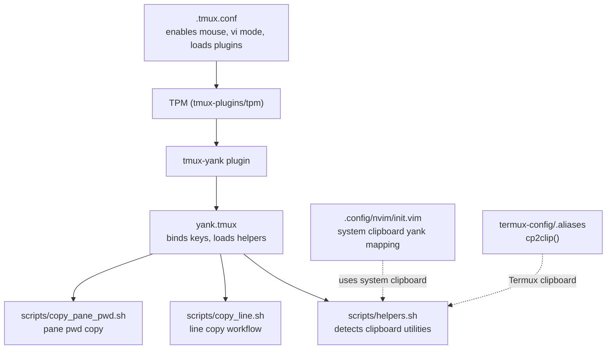
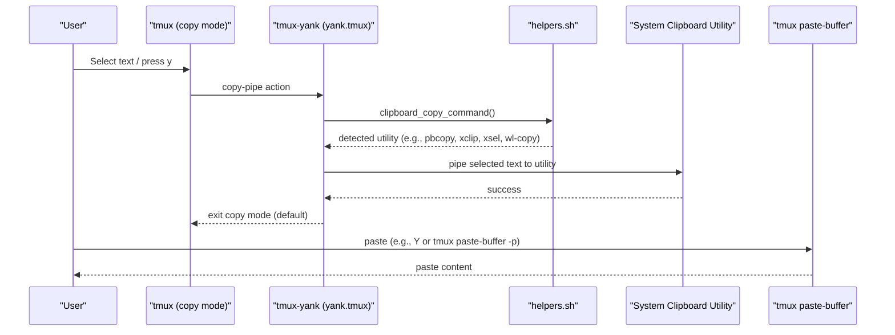
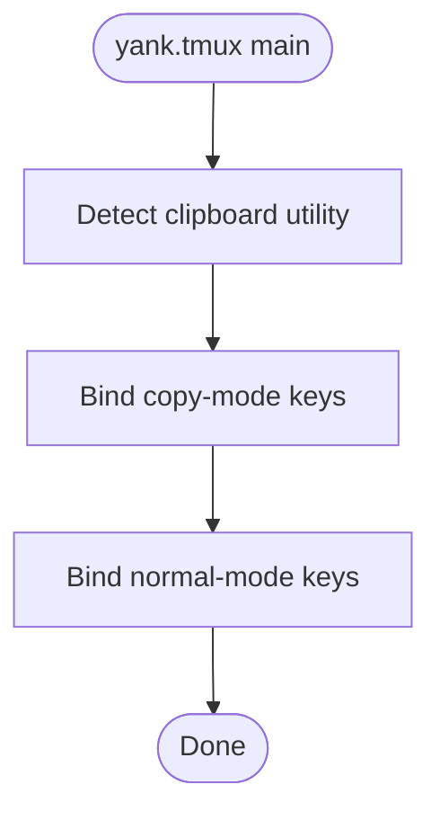
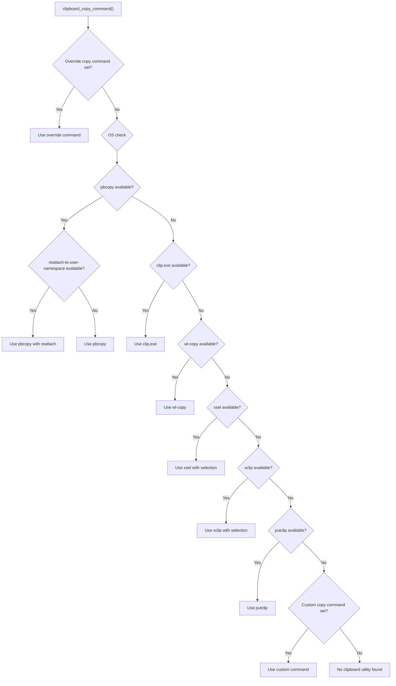
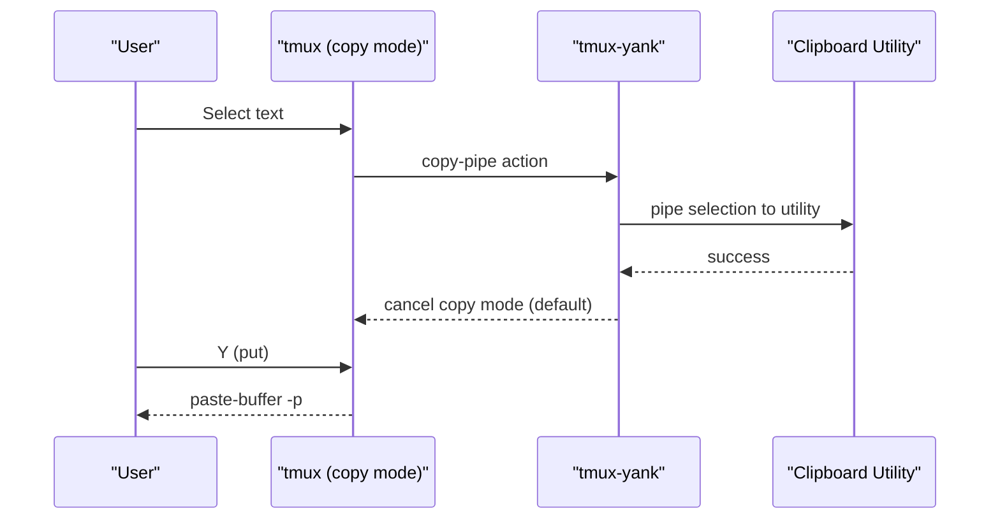
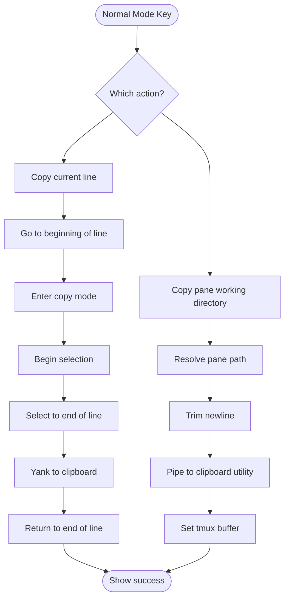
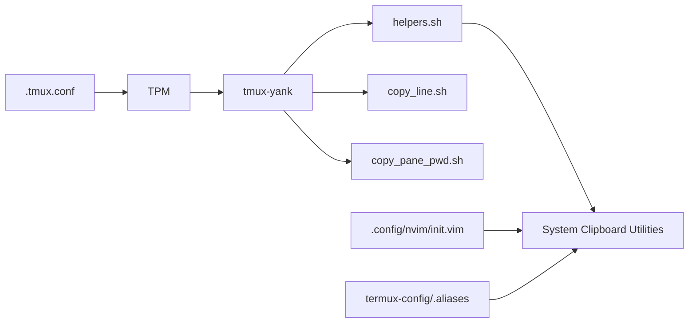

# Clipboard Integration and Copy-Paste

<cite>
**Referenced Files in This Document**
- [.tmux.conf](file://.tmux.conf)
- [tmux-yank README](file://.tmux/plugins/tmux-yank/README.md)
- [yank.tmux](file://.tmux/plugins/tmux-yank/yank.tmux)
- [helpers.sh](file://.tmux/plugins/tmux-yank/scripts/helpers.sh)
- [copy_line.sh](file://.tmux/plugins/tmux-yank/scripts/copy_line.sh)
- [copy_pane_pwd.sh](file://.tmux/plugins/tmux-yank/scripts/copy_pane_pwd.sh)
- [init.vim](file://.config/nvim/init.vim)
- [termux .aliases](file://termux-config/.aliases)
</cite>

## Table of Contents
1. [Introduction](#introduction)
2. [Project Structure](#project-structure)
3. [Core Components](#core-components)
4. [Architecture Overview](#architecture-overview)
5. [Detailed Component Analysis](#detailed-component-analysis)
6. [Dependency Analysis](#dependency-analysis)
7. [Performance Considerations](#performance-considerations)
8. [Troubleshooting Guide](#troubleshooting-guide)
9. [Conclusion](#conclusion)
10. [Appendices](#appendices)

## Introduction
This document explains how clipboard integration is implemented using the tmux-yank plugin within this dotfiles configuration. It covers:
- How Tmux selections synchronize with the system clipboard
- Copy mode configuration and paste buffer management
- Integration with system clipboard utilities across platforms
- Cross-platform compatibility and provider selection
- Practical workflows for efficient text manipulation
- Troubleshooting clipboard issues
- Optimizing clipboard performance

## Project Structure
The clipboard integration relies on:
- Tmux configuration enabling mouse and vi mode
- Tmux plugin manager (TPM) loading tmux-yank
- tmux-yank’s Bash scripts that bind keys, detect clipboard utilities, and pipe selections to the system clipboard
- Neovim configuration that supports system clipboard yanks
- Optional Termux-specific clipboard utilities

**Diagram sources**
- [.tmux.conf](file://.tmux.conf#L24-L32)
- [yank.tmux](file://.tmux/plugins/tmux-yank/yank.tmux#L85-L92)
- [helpers.sh](file://.tmux/plugins/tmux-yank/scripts/helpers.sh#L138-L174)
- [copy_line.sh](file://.tmux/plugins/tmux-yank/scripts/copy_line.sh#L96-L105)
- [copy_pane_pwd.sh](file://.tmux/plugins/tmux-yank/scripts/copy_pane_pwd.sh#L17-L28)
- [init.vim](file://.config/nvim/init.vim#L238-L240)
- [termux .aliases](file://termux-config/.aliases#L525-L549)

**Section sources**
- [.tmux.conf](file://.tmux.conf#L24-L32)
- [yank.tmux](file://.tmux/plugins/tmux-yank/yank.tmux#L85-L92)
- [helpers.sh](file://.tmux/plugins/tmux-yank/scripts/helpers.sh#L138-L174)
- [copy_line.sh](file://.tmux/plugins/tmux-yank/scripts/copy_line.sh#L96-L105)
- [copy_pane_pwd.sh](file://.tmux/plugins/tmux-yank/scripts/copy_pane_pwd.sh#L17-L28)
- [init.vim](file://.config/nvim/init.vim#L238-L240)
- [termux .aliases](file://termux-config/.aliases#L525-L549)

## Core Components
- Tmux configuration enables mouse and vi mode, and loads tmux-yank via TPM.
- tmux-yank binds keys for copy mode and normal mode, detects clipboard utilities, and integrates with the system clipboard.
- Neovim is configured to use the system clipboard for yanks.
- Termux provides a convenience alias to copy file contents to the device clipboard.

Key responsibilities:
- Clipboard utility detection and selection across macOS, Linux (X11/Wayland), Cygwin, WSL, and fallbacks
- Copy mode bindings for yank, put, and combined actions
- Normal mode bindings for quick line and pane directory copying
- Paste buffer management via tmux paste-buffer and set-buffer

**Section sources**
- [.tmux.conf](file://.tmux.conf#L24-L32)
- [yank.tmux](file://.tmux/plugins/tmux-yank/yank.tmux#L39-L78)
- [helpers.sh](file://.tmux/plugins/tmux-yank/scripts/helpers.sh#L138-L174)
- [copy_line.sh](file://.tmux/plugins/tmux-yank/scripts/copy_line.sh#L96-L105)
- [copy_pane_pwd.sh](file://.tmux/plugins/tmux-yank/scripts/copy_pane_pwd.sh#L17-L28)
- [init.vim](file://.config/nvim/init.vim#L238-L240)

## Architecture Overview
The clipboard pipeline connects Tmux copy mode and normal mode to system clipboard utilities through tmux-yank.

**Diagram sources**
- [yank.tmux](file://.tmux/plugins/tmux-yank/yank.tmux#L39-L78)
- [helpers.sh](file://.tmux/plugins/tmux-yank/scripts/helpers.sh#L138-L174)
- [copy_line.sh](file://.tmux/plugins/tmux-yank/scripts/copy_line.sh#L79-L86)

## Detailed Component Analysis

### tmux-yank plugin entry and bindings
- Loads helper functions and sets copy mode bindings for vi and emacs modes.
- Binds normal mode keys for quick line and pane directory copying.
- Handles missing dependencies by displaying an error message in copy mode.

**Diagram sources**
- [yank.tmux](file://.tmux/plugins/tmux-yank/yank.tmux#L85-L92)

**Section sources**
- [yank.tmux](file://.tmux/plugins/tmux-yank/yank.tmux#L39-L78)
- [yank.tmux](file://.tmux/plugins/tmux-yank/yank.tmux#L85-L92)

### Clipboard utility detection and selection
- Detects platform-specific utilities in precedence order and falls back to custom or override commands.
- Supports macOS pbcopy with optional reattach-to-user-namespace, Linux xclip/xsel, Wayland wl-copy, Cygwin putclip, and WSL clip.exe.
- Allows overriding or customizing the copy command via tmux options.

**Diagram sources**
- [helpers.sh](file://.tmux/plugins/tmux-yank/scripts/helpers.sh#L138-L174)

**Section sources**
- [helpers.sh](file://.tmux/plugins/tmux-yank/scripts/helpers.sh#L138-L174)

### Copy mode configuration and actions
- Binds y (yank), Y (put), M-y (yank-then-put), and newline-trimming variant.
- Supports vi and emacs copy modes, with mouse drag-to-yank when enabled.
- Uses copy-pipe-and-cancel by default to exit copy mode after yank.

**Diagram sources**
- [yank.tmux](file://.tmux/plugins/tmux-yank/yank.tmux#L39-L78)

**Section sources**
- [yank.tmux](file://.tmux/plugins/tmux-yank/yank.tmux#L39-L78)

### Normal mode workflows
- Line copy: moves to beginning/end of line, enters copy mode, selects current line, yanks to clipboard, and reports success.
- Pane working directory copy: resolves pane path, removes newlines, pipes to clipboard utility, sets tmux buffer, and reports success.

**Diagram sources**
- [copy_line.sh](file://.tmux/plugins/tmux-yank/scripts/copy_line.sh#L96-L105)
- [copy_pane_pwd.sh](file://.tmux/plugins/tmux-yank/scripts/copy_pane_pwd.sh#L17-L28)

**Section sources**
- [copy_line.sh](file://.tmux/plugins/tmux-yank/scripts/copy_line.sh#L96-L105)
- [copy_pane_pwd.sh](file://.tmux/plugins/tmux-yank/scripts/copy_pane_pwd.sh#L17-L28)

### Paste buffer management
- tmux paste-buffer retrieves the current selection for pasting into the command line.
- tmux set-buffer stores arbitrary text into the internal buffer for later retrieval.

Practical tips:
- Use paste-buffer -p to paste the current selection into the command line.
- Use set-buffer to populate buffers for scripts or macros.

**Section sources**
- [copy_pane_pwd.sh](file://.tmux/plugins/tmux-yank/scripts/copy_pane_pwd.sh#L25-L26)

### Cross-platform compatibility
- macOS: pbcopy with optional reattach-to-user-namespace for modern macOS versions.
- Linux (X11): xclip or xsel; selection type configurable via options.
- Linux (Wayland): wl-copy from wl-clipboard.
- Cygwin: putclip.
- WSL: clip.exe.
- Fallbacks: custom or override copy command options.

**Section sources**
- [helpers.sh](file://.tmux/plugins/tmux-yank/scripts/helpers.sh#L138-L174)
- [tmux-yank README](file://.tmux/plugins/tmux-yank/README.md#L67-L149)

### Integration with Neovim
- Leader mapping for yank to system clipboard uses the “+ register.
- Works seamlessly with tmux-yank’s system clipboard integration.

**Section sources**
- [init.vim](file://.config/nvim/init.vim#L238-L240)

### Integration with Termux
- Convenience alias cp2clip() copies file contents to the Termux clipboard or falls back to xclip/xsel if available.

**Section sources**
- [termux .aliases](file://termux-config/.aliases#L525-L549)

## Dependency Analysis
- Tmux configuration depends on:
  - Mouse mode enabled for copy mode and mouse drag-to-yank
  - Vi mode for consistent keybindings
  - TPM to load tmux-yank
- tmux-yank depends on:
  - helpers.sh for option resolution and clipboard utility detection
  - Platform-specific clipboard utilities
  - tmux paste-buffer for paste operations

**Diagram sources**
- [.tmux.conf](file://.tmux.conf#L24-L32)
- [yank.tmux](file://.tmux/plugins/tmux-yank/yank.tmux#L85-L92)
- [helpers.sh](file://.tmux/plugins/tmux-yank/scripts/helpers.sh#L138-L174)
- [copy_line.sh](file://.tmux/plugins/tmux-yank/scripts/copy_line.sh#L96-L105)
- [copy_pane_pwd.sh](file://.tmux/plugins/tmux-yank/scripts/copy_pane_pwd.sh#L17-L28)
- [init.vim](file://.config/nvim/init.vim#L238-L240)
- [termux .aliases](file://termux-config/.aliases#L525-L549)

**Section sources**
- [.tmux.conf](file://.tmux.conf#L24-L32)
- [yank.tmux](file://.tmux/plugins/tmux-yank/yank.tmux#L85-L92)
- [helpers.sh](file://.tmux/plugins/tmux-yank/scripts/helpers.sh#L138-L174)
- [copy_line.sh](file://.tmux/plugins/tmux-yank/scripts/copy_line.sh#L96-L105)
- [copy_pane_pwd.sh](file://.tmux/plugins/tmux-yank/scripts/copy_pane_pwd.sh#L17-L28)
- [init.vim](file://.config/nvim/init.vim#L238-L240)
- [termux .aliases](file://termux-config/.aliases#L525-L549)

## Performance Considerations
- Prefer wl-copy on Wayland for lower overhead compared to xclip/xsel.
- On macOS, ensure reattach-to-user-namespace is installed to avoid permission-related delays.
- For remote shells (SSH/Mosh), copy_line.sh adds a small delay to account for latency; keep this in mind when automating workflows.
- Avoid excessive use of copy-pipe-and-cancel if you intend to continue selecting; adjust @yank_action accordingly.

[No sources needed since this section provides general guidance]

## Troubleshooting Guide
Common issues and resolutions:
- No clipboard utility detected
  - Ensure a supported utility is installed (pbcopy on macOS, xclip/xsel on Linux, wl-copy on Wayland, putclip on Cygwin, clip.exe on WSL).
  - Optionally set @custom_copy_command or @override_copy_command to force a specific command.
- macOS permission errors
  - Install and configure reattach-to-user-namespace as documented.
- Remote shell latency
  - copy_line.sh introduces a short delay for SSH/Mosh; if you need deterministic timing, consider adjusting the wait constant or invoking copy mode manually.
- Mouse drag-to-yank not working
  - Confirm mouse is enabled in tmux and @yank_with_mouse is set appropriately.
- Paste buffer not updating
  - Verify that the yank action exits copy mode and that you are pasting with the appropriate keybinding (e.g., Y or tmux paste-buffer -p).

**Section sources**
- [helpers.sh](file://.tmux/plugins/tmux-yank/scripts/helpers.sh#L138-L174)
- [yank.tmux](file://.tmux/plugins/tmux-yank/yank.tmux#L15-L35)
- [copy_line.sh](file://.tmux/plugins/tmux-yank/scripts/copy_line.sh#L19-L25)
- [tmux-yank README](file://.tmux/plugins/tmux-yank/README.md#L67-L149)

## Conclusion
The tmux-yank plugin integrates Tmux copy mode and normal mode with the system clipboard across platforms. With proper configuration—mouse and vi mode enabled, TPM loading tmux-yank, and platform-appropriate clipboard utilities—you gain reliable, cross-platform clipboard synchronization. Combine this with Neovim’s system clipboard mapping and Termux’s convenience alias for a complete workflow spanning terminals, editors, and mobile environments.

[No sources needed since this section summarizes without analyzing specific files]

## Appendices

### Practical Workflows
- Copy current line: Press the normal mode key bound by tmux-yank to copy the current command line to the system clipboard.
- Copy pane working directory: Press the normal mode key bound by tmux-yank to copy the pane’s current directory to the system clipboard.
- Copy selection in copy mode: Select text in copy mode and press the y key to copy to the system clipboard; press Y to paste into the command line.

**Section sources**
- [copy_line.sh](file://.tmux/plugins/tmux-yank/scripts/copy_line.sh#L96-L105)
- [copy_pane_pwd.sh](file://.tmux/plugins/tmux-yank/scripts/copy_pane_pwd.sh#L17-L28)
- [yank.tmux](file://.tmux/plugins/tmux-yank/yank.tmux#L39-L78)

### Configuration Options Reference
- @yank_selection: Clipboard selection type for keyboard yank (primary, secondary, clipboard)
- @yank_selection_mouse: Clipboard selection type for mouse drag-to-yank
- @yank_with_mouse: Enable/disable mouse drag-to-yank
- @yank_action: Action after yank (copy-pipe or copy-pipe-and-cancel)
- @shell_mode: Shell mode for older tmux versions (vi or emacs)
- @custom_copy_command: Custom clipboard command
- @override_copy_command: Force a specific clipboard command

**Section sources**
- [helpers.sh](file://.tmux/plugins/tmux-yank/scripts/helpers.sh#L44-L106)
- [tmux-yank README](file://.tmux/plugins/tmux-yank/README.md#L202-L270)