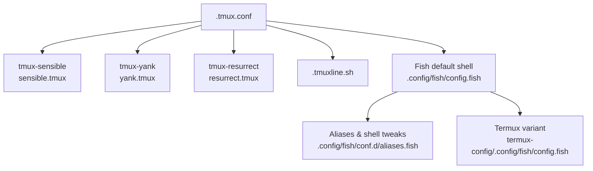
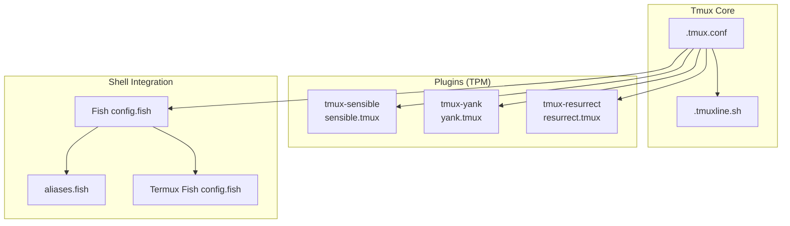
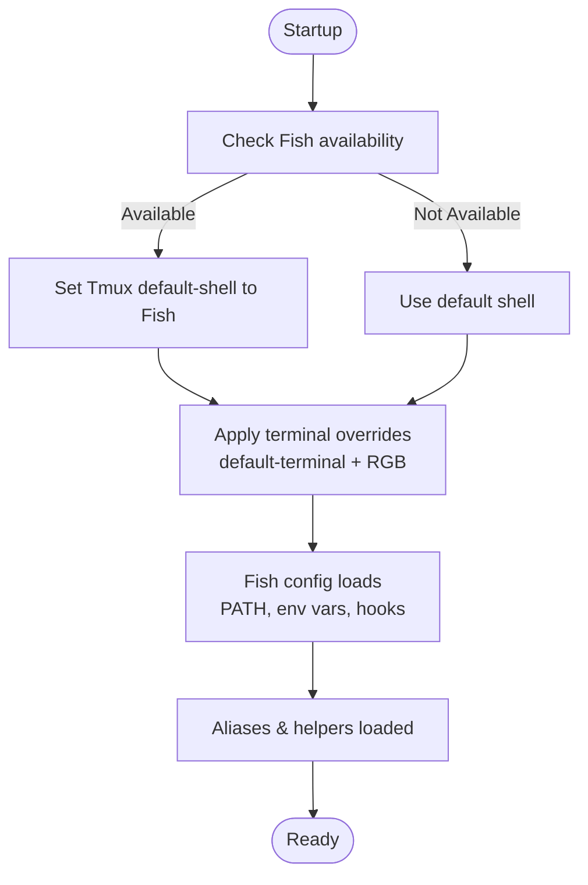
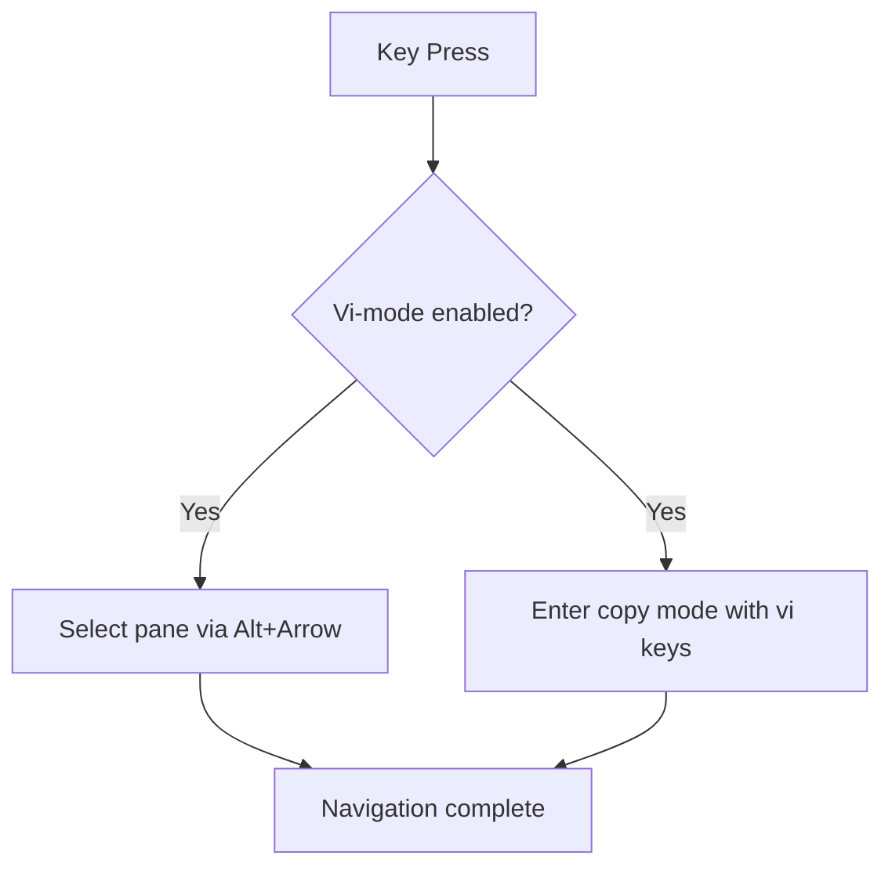
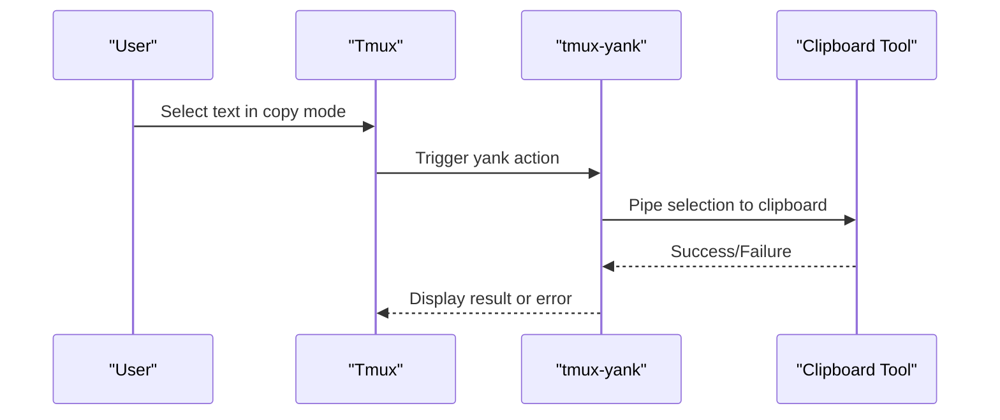
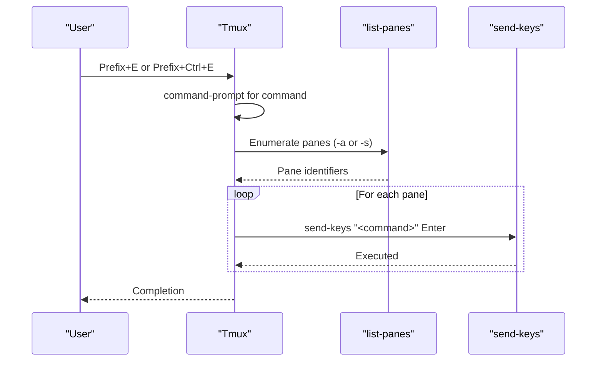
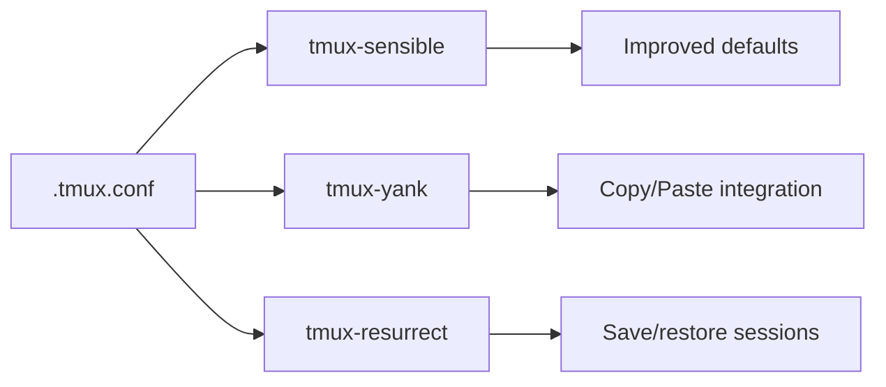
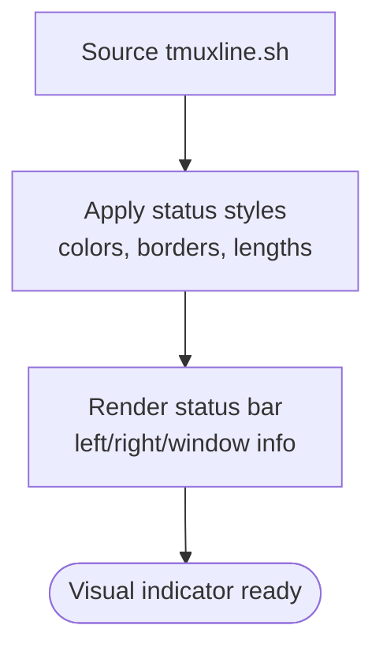
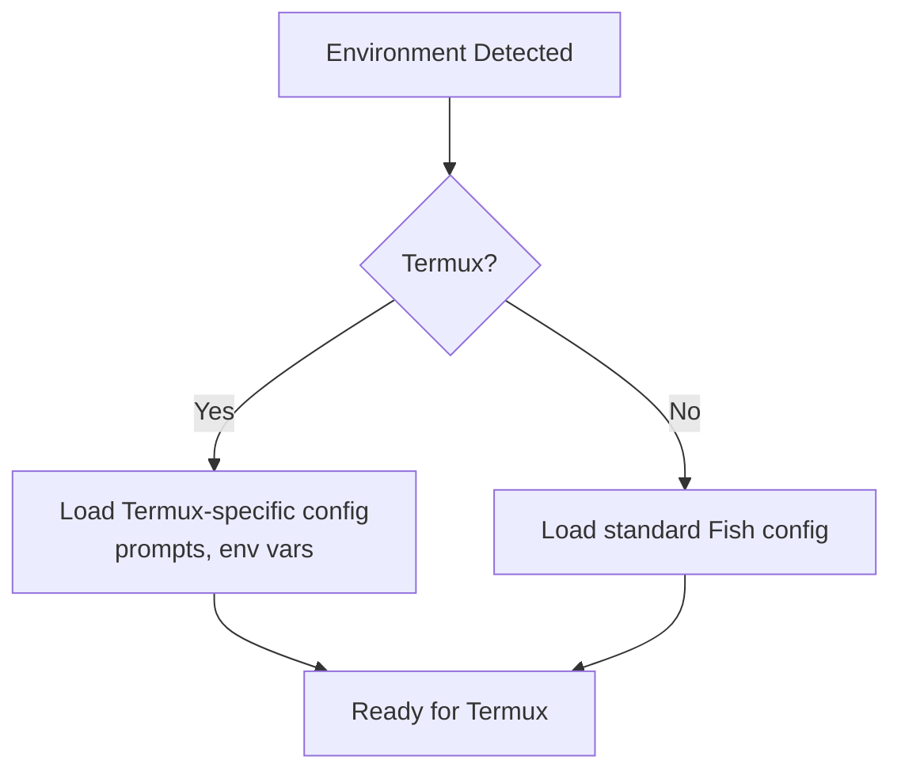
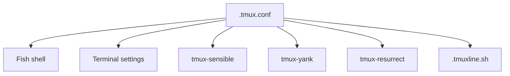

# Core Tmux Configuration

<cite>
**Referenced Files in This Document**
- [.tmux.conf](file://.tmux.conf)
- [.tmuxline.sh](file://.tmuxline.sh)
- [tmux-sensible/sensible.tmux](file://.tmux/plugins/tmux-sensible/sensible.tmux)
- [tmux-yank/yank.tmux](file://.tmux/plugins/tmux-yank/yank.tmux)
- [tmux-resurrect/resurrect.tmux](file://.tmux/plugins/tmux-resurrect/resurrect.tmux)
- [Fish config.fish](file://.config/fish/config.fish)
- [Fish aliases.fish](file://.config/fish/conf.d/aliases.fish)
- [Termux Fish config.fish](file://termux-config/.config/fish/config.fish)
</cite>

## Table of Contents
1. [Introduction](#introduction)
2. [Project Structure](#project-structure)
3. [Core Components](#core-components)
4. [Architecture Overview](#architecture-overview)
5. [Detailed Component Analysis](#detailed-component-analysis)
6. [Dependency Analysis](#dependency-analysis)
7. [Performance Considerations](#performance-considerations)
8. [Troubleshooting Guide](#troubleshooting-guide)
9. [Conclusion](#conclusion)
10. [Appendices](#appendices)

## Introduction
This document explains the core Tmux configuration in this repository, focusing on fundamental settings, key bindings, and shell integration. It covers:
- Default shell selection (Fish)
- Terminal compatibility settings
- Mouse mode enablement
- Vi-mode key bindings
- Pane navigation and window management
- Multi-pane synchronization
- Command prompt broadcasting across panes and windows
- Practical workflows, customization options, and environment-specific adaptations
- Configuration reload procedures and troubleshooting terminal compatibility issues

## Project Structure
The Tmux configuration centers around a primary configuration file and a separate status bar script. Plugins are managed via the Tmux Plugin Manager (TPM) and include sensible defaults, clipboard/yank integration, and resurrection capabilities. Shell integration is handled by Fish configuration files, with a dedicated Termux variant.

**Diagram sources**
- [.tmux.conf](file://.tmux.conf#L56-L68)
- [tmux-sensible/sensible.tmux](file://.tmux/plugins/tmux-sensible/sensible.tmux#L78-L169)
- [tmux-yank/yank.tmux](file://.tmux/plugins/tmux-yank/yank.tmux#L85-L93)
- [tmux-resurrect/resurrect.tmux](file://.tmux/plugins/tmux-resurrect/resurrect.tmux#L34-L41)
- [.tmuxline.sh](file://.tmuxline.sh#L1-L22)
- [Fish config.fish](file://.config/fish/config.fish#L112-L168)
- [Fish aliases.fish](file://.config/fish/conf.d/aliases.fish#L1-L148)
- [Termux Fish config.fish](file://termux-config/.config/fish/config.fish#L1-L184)

**Section sources**
- [.tmux.conf](file://.tmux.conf#L1-L69)
- [.tmuxline.sh](file://.tmuxline.sh#L1-L22)
- [tmux-sensible/sensible.tmux](file://.tmux/plugins/tmux-sensible/sensible.tmux#L78-L169)
- [tmux-yank/yank.tmux](file://.tmux/plugins/tmux-yank/yank.tmux#L85-L93)
- [tmux-resurrect/resurrect.tmux](file://.tmux/plugins/tmux-resurrect/resurrect.tmux#L34-L41)
- [Fish config.fish](file://.config/fish/config.fish#L112-L168)
- [Fish aliases.fish](file://.config/fish/conf.d/aliases.fish#L1-L148)
- [Termux Fish config.fish](file://termux-config/.config/fish/config.fish#L1-L184)

## Core Components
- Default shell: Fish is selected when available.
- Terminal compatibility: Sets default terminal and terminal overrides for 256-color and RGB support.
- Status bar: Loads a tmuxline theme script for a polished status line.
- Mouse mode: Enabled globally for improved interaction.
- Vi-mode: Enables vi-style keys for pane selection and copy mode.
- Pane/window navigation: Alt-arrow keys switch panes; H/L bindings shift windows.
- Broadcast commands: Prompt-based commands broadcast to all panes across sessions or within the current session.
- Plugins: TPM-managed plugins for sensible defaults, yank/copy integration, and resurrect/reload.

**Section sources**
- [.tmux.conf](file://.tmux.conf#L6-L25)
- [.tmux.conf](file://.tmux.conf#L28-L43)
- [.tmux.conf](file://.tmux.conf#L44-L54)
- [.tmuxline.sh](file://.tmuxline.sh#L4-L21)
- [tmux-sensible/sensible.tmux](file://.tmux/plugins/tmux-sensible/sensible.tmux#L82-L120)
- [tmux-yank/yank.tmux](file://.tmux/plugins/tmux-yank/yank.tmux#L39-L91)
- [tmux-resurrect/resurrect.tmux](file://.tmux/plugins/tmux-resurrect/resurrect.tmux#L8-L32)

## Architecture Overview
The configuration composes Tmux options, key bindings, and plugin scripts. The Fish shell provides a modern interactive environment and PATH adjustments, while the Termux variant adapts prompts and environment variables for mobile contexts.

**Diagram sources**
- [.tmux.conf](file://.tmux.conf#L56-L68)
- [tmux-sensible/sensible.tmux](file://.tmux/plugins/tmux-sensible/sensible.tmux#L78-L169)
- [tmux-yank/yank.tmux](file://.tmux/plugins/tmux-yank/yank.tmux#L85-L93)
- [tmux-resurrect/resurrect.tmux](file://.tmux/plugins/tmux-resurrect/resurrect.tmux#L34-L41)
- [.tmuxline.sh](file://.tmuxline.sh#L1-L22)
- [Fish config.fish](file://.config/fish/config.fish#L112-L168)
- [Fish aliases.fish](file://.config/fish/conf.d/aliases.fish#L1-L148)
- [Termux Fish config.fish](file://termux-config/.config/fish/config.fish#L1-L184)

## Detailed Component Analysis

### Terminal Compatibility and Default Shell
- Default shell: The configuration conditionally sets Tmux’s default shell to Fish if present.
- Terminal settings: Sets default terminal to a 256-color screen variant and adds terminal overrides for RGB support.
- Fish shell: The Fish configuration sets TERM, adjusts PATH, and integrates NPM/NVM/cloud SDK configurations. An aliases file enhances day-to-day workflows.

**Diagram sources**
- [.tmux.conf](file://.tmux.conf#L6-L16)
- [Fish config.fish](file://.config/fish/config.fish#L112-L168)
- [Fish aliases.fish](file://.config/fish/conf.d/aliases.fish#L1-L148)

**Section sources**
- [.tmux.conf](file://.tmux.conf#L6-L16)
- [Fish config.fish](file://.config/fish/config.fish#L112-L168)
- [Fish aliases.fish](file://.config/fish/conf.d/aliases.fish#L1-L148)

### Vi-Mode Key Bindings and Pane Navigation
- Vi-mode: Enables vi-style keys for pane selection and copy mode.
- Pane switching: Alt-arrow keys switch panes without requiring the prefix key.
- Window shifting: Repeated H/L keys cycle windows left/right.

**Diagram sources**
- [.tmux.conf](file://.tmux.conf#L31-L42)

**Section sources**
- [.tmux.conf](file://.tmux.conf#L31-L42)

### Mouse Mode and Copy/Yank Integration
- Mouse mode: Enabled globally for scrolling, clicking to select panes/windows, and selecting text.
- Copy/yank: The yank plugin binds vi and emacs copy modes, supports mouse selection, and handles error feedback when clipboard tools are missing.

**Diagram sources**
- [.tmux.conf](file://.tmux.conf#L24-L25)
- [tmux-yank/yank.tmux](file://.tmux/plugins/tmux-yank/yank.tmux#L39-L91)

**Section sources**
- [.tmux.conf](file://.tmux.conf#L24-L25)
- [tmux-yank/yank.tmux](file://.tmux/plugins/tmux-yank/yank.tmux#L39-L91)

### Broadcast Commands Across Panes and Windows
- Broadcast to all panes across all sessions: Prompts for a command and sends it to every pane identifier discovered.
- Broadcast to all panes in all windows of the current session: Similar mechanism scoped to the current session.

**Diagram sources**
- [.tmux.conf](file://.tmux.conf#L44-L54)

**Section sources**
- [.tmux.conf](file://.tmux.conf#L44-L54)

### Window Management and Pane Synchronization
- Window shifting: H/L keys rotate windows left/right.
- Pane synchronization: While not explicitly configured here, Tmux supports pane synchronization via built-in commands; enable as needed per workflow.

Practical tips:
- Use H/L to quickly reorder windows during multi-session work.
- For synchronized editing across panes, toggle pane sync in your workflow after splitting panes.

**Section sources**
- [.tmux.conf](file://.tmux.conf#L21-L22)

### Plugins: Sensible Defaults, Yank, and Resurrection
- Sensible defaults: Adjusts escape-time, history size, message duration, status interval, terminal upgrades, and key bindings for smoother operation.
- Yank: Provides robust copy/paste integration with vi/emacs copy modes, mouse support, and error handling.
- Resurrection: Sets up save/restore key bindings and default strategies for process restoration.

**Diagram sources**
- [.tmux.conf](file://.tmux.conf#L56-L68)
- [tmux-sensible/sensible.tmux](file://.tmux/plugins/tmux-sensible/sensible.tmux#L78-L169)
- [tmux-yank/yank.tmux](file://.tmux/plugins/tmux-yank/yank.tmux#L85-L93)
- [tmux-resurrect/resurrect.tmux](file://.tmux/plugins/tmux-resurrect/resurrect.tmux#L34-L41)

**Section sources**
- [tmux-sensible/sensible.tmux](file://.tmux/plugins/tmux-sensible/sensible.tmux#L82-L120)
- [tmux-yank/yank.tmux](file://.tmux/plugins/tmux-yank/yank.tmux#L39-L91)
- [tmux-resurrect/resurrect.tmux](file://.tmux/plugins/tmux-resurrect/resurrect.tmux#L8-L32)

### Status Bar Theming
- The tmuxline script defines status bar styles, colors, and content for left/right sections and window status indicators.

**Diagram sources**
- [.tmuxline.sh](file://.tmuxline.sh#L4-L21)

**Section sources**
- [.tmuxline.sh](file://.tmuxline.sh#L4-L21)

### Environment-Specific Adaptations
- Termux variant: The Termux Fish configuration includes device-specific logic, prompt enhancements, and environment variables tailored for Android environments.

**Diagram sources**
- [Termux Fish config.fish](file://termux-config/.config/fish/config.fish#L1-L184)

**Section sources**
- [Termux Fish config.fish](file://termux-config/.config/fish/config.fish#L1-L184)

## Dependency Analysis
- Tmux configuration depends on:
  - Default shell (Fish) for interactive features and PATH management.
  - Terminal compatibility settings for proper color and glyph rendering.
  - Plugins for sensible defaults, yank integration, and session resurrection.
  - Status bar script for visual polish.

**Diagram sources**
- [.tmux.conf](file://.tmux.conf#L6-L25)
- [.tmux.conf](file://.tmux.conf#L56-L68)
- [.tmuxline.sh](file://.tmuxline.sh#L1-L22)

**Section sources**
- [.tmux.conf](file://.tmux.conf#L6-L25)
- [.tmux.conf](file://.tmux.conf#L56-L68)
- [.tmuxline.sh](file://.tmuxline.sh#L1-L22)

## Performance Considerations
- Increase scrollback buffer size and status refresh interval for responsiveness.
- Use efficient terminal overrides to reduce rendering overhead.
- Keep plugin scripts minimal and avoid excessive external dependencies for copy/paste operations.

[No sources needed since this section provides general guidance]

## Troubleshooting Guide
- Terminal compatibility issues:
  - Ensure default-terminal matches your terminal emulator’s capabilities.
  - Add terminal overrides for RGB support if glyphs or colors appear incorrect.
- Clipboard/yank errors:
  - The yank plugin displays an error message when clipboard tools are missing; install and configure clipboard utilities accordingly.
- Reloading configuration:
  - The sensible plugin binds a key to source the configuration file; use it to reload settings without restarting Tmux.
- Mouse mode:
  - If mouse actions do not behave as expected, verify mouse is enabled and your terminal supports mouse reporting.

**Section sources**
- [tmux-sensible/sensible.tmux](file://.tmux/plugins/tmux-sensible/sensible.tmux#L117-L120)
- [tmux-sensible/sensible.tmux](file://.tmux/plugins/tmux-sensible/sensible.tmux#L159-L166)
- [tmux-yank/yank.tmux](file://.tmux/plugins/tmux-yank/yank.tmux#L15-L35)
- [.tmux.conf](file://.tmux.conf#L24-L25)

## Conclusion
This Tmux configuration establishes a modern, efficient terminal multiplexer environment centered on Fish shell integration, robust vi-mode navigation, and practical plugin-driven enhancements. It provides mechanisms to broadcast commands across panes, manage windows effectively, and adapt to diverse environments, including Termux. By leveraging the included scripts and plugins, users can streamline workflows and maintain a consistent, visually appealing status bar.

[No sources needed since this section summarizes without analyzing specific files]

## Appendices

### Quick Reference: Key Bindings and Commands
- Vi-mode pane selection and copy mode
- Alt-arrow to switch panes
- H/L to shift windows
- Broadcast to all panes across sessions: Prefix+E
- Broadcast to all panes in current session: Prefix+Ctrl+E
- Reload configuration: Prefix+R (via sensible plugin)
- Mouse mode: On

**Section sources**
- [.tmux.conf](file://.tmux.conf#L31-L54)
- [tmux-sensible/sensible.tmux](file://.tmux/plugins/tmux-sensible/sensible.tmux#L159-L166)