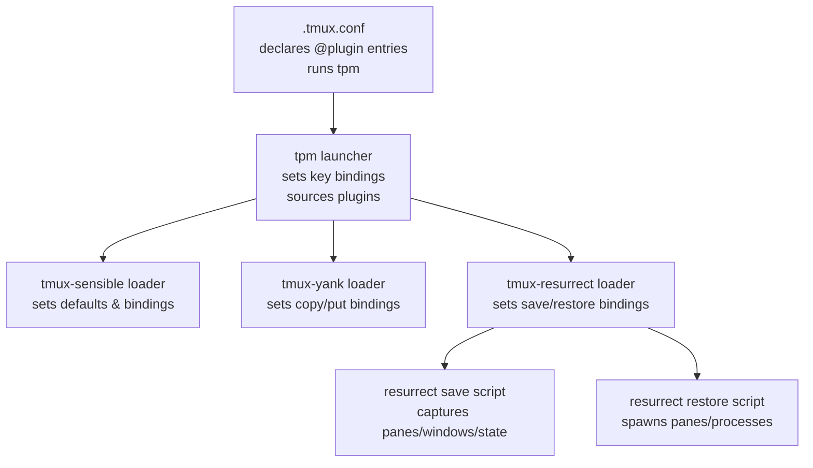
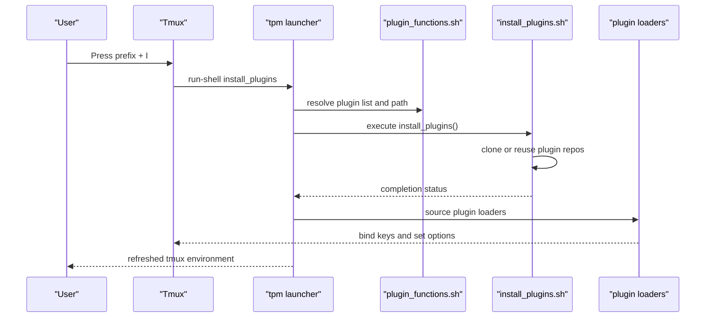
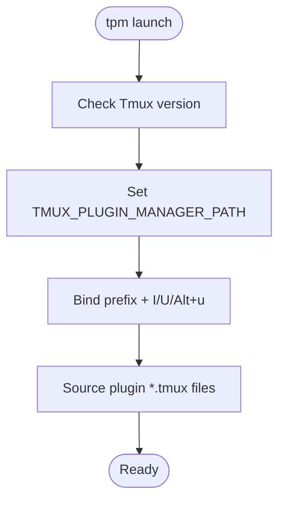
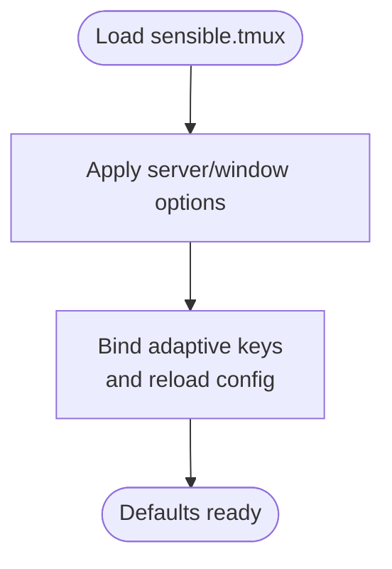
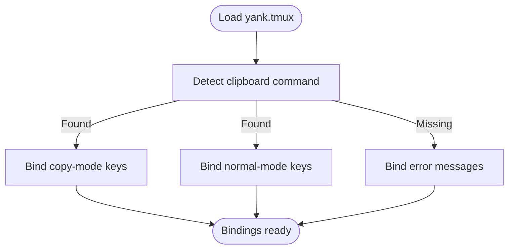
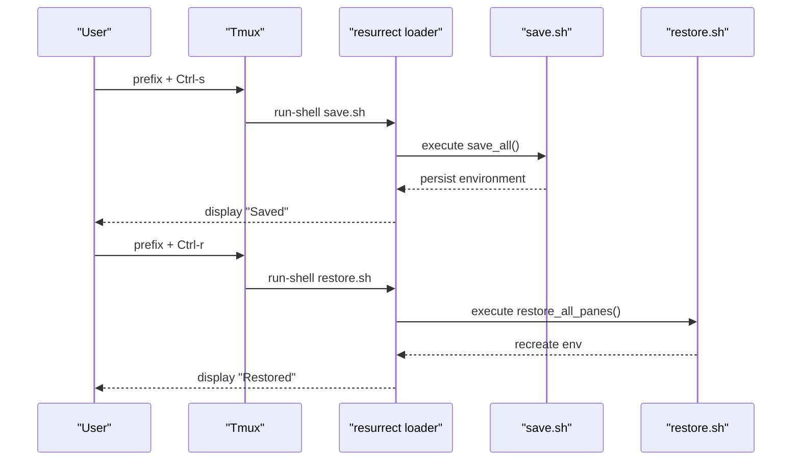
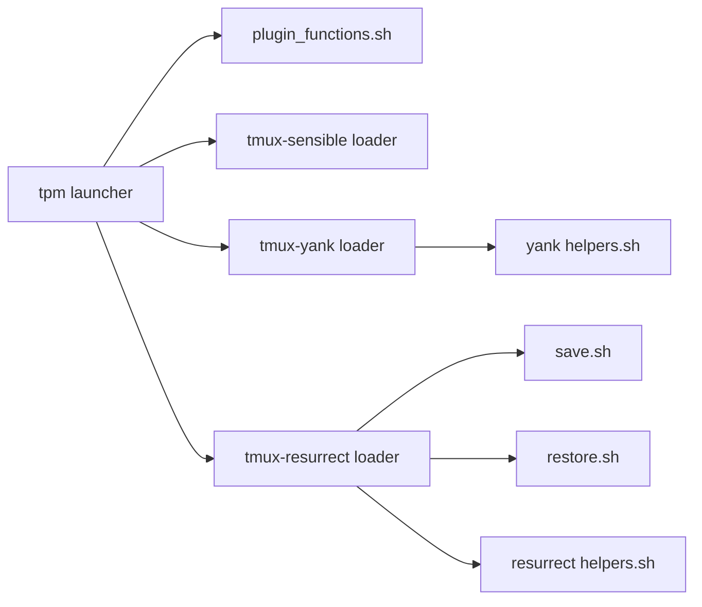

# Plugin Management System

<cite>
**Referenced Files in This Document**
- [.tmux.conf](file://.tmux.conf)
- [tpm README](file://.tmux/plugins/tpm/README.md)
- [tpm launcher](file://.tmux/plugins/tpm/tpm)
- [tpm install script](file://.tmux/plugins/tpm/scripts/install_plugins.sh)
- [tpm clean script](file://.tmux/plugins/tpm/scripts/clean_plugins.sh)
- [plugin functions helper](file://.tmux/plugins/tpm/scripts/helpers/plugin_functions.sh)
- [tmux-sensible README](file://.tmux/plugins/tmux-sensible/README.md)
- [tmux-sensible loader](file://.tmux/plugins/tmux-sensible/sensible.tmux)
- [tmux-yank README](file://.tmux/plugins/tmux-yank/README.md)
- [tmux-yank loader](file://.tmux/plugins/tmux-yank/yank.tmux)
- [tmux-yank helpers](file://.tmux/plugins/tmux-yank/scripts/helpers.sh)
- [tmux-resurrect README](file://.tmux/plugins/tmux-resurrect/README.md)
- [tmux-resurrect loader](file://.tmux/plugins/tmux-resurrect/resurrect.tmux)
- [tmux-resurrect save script](file://.tmux/plugins/tmux-resurrect/scripts/save.sh)
- [tmux-resurrect restore script](file://.tmux/plugins/tmux-resurrect/scripts/restore.sh)
- [tmux-resurrect helpers](file://.tmux/plugins/tmux-resurrect/scripts/helpers.sh)
</cite>

## Table of Contents
1. [Introduction](#introduction)
2. [Project Structure](#project-structure)
3. [Core Components](#core-components)
4. [Architecture Overview](#architecture-overview)
5. [Detailed Component Analysis](#detailed-component-analysis)
6. [Dependency Analysis](#dependency-analysis)
7. [Performance Considerations](#performance-considerations)
8. [Troubleshooting Guide](#troubleshooting-guide)
9. [Conclusion](#conclusion)

## Introduction
This document explains how the Tmux Plugin Manager (TPM) orchestrates plugin installation, activation, and lifecycle management in this repository. It covers the plugin ecosystem used here: tmux-sensible defaults, tmux-yank clipboard integration, and tmux-resurrect session persistence. You will learn how to install, configure, update, and troubleshoot plugins, along with practical examples for extending Tmux functionality and maintaining compatibility across Tmux versions.

## Project Structure
The Tmux configuration and plugin stack are organized as follows:
- The main Tmux configuration declares plugin entries and initializes TPM.
- TPM is responsible for discovering plugins, downloading them, and sourcing their tmux loaders.
- Each plugin contributes tmux key bindings and options via its loader script.
- tmux-resurrect provides save/restore scripts and hooks for session persistence.

**Diagram sources**
- [.tmux.conf](file://.tmux.conf#L56-L68)
- [tpm launcher](file://.tmux/plugins/tpm/tpm#L56-L78)
- [tmux-sensible loader](file://.tmux/plugins/tmux-sensible/sensible.tmux#L127-L166)
- [tmux-yank loader](file://.tmux/plugins/tmux-yank/yank.tmux#L80-L91)
- [tmux-resurrect loader](file://.tmux/plugins/tmux-resurrect/resurrect.tmux#L8-L39)
- [tmux-resurrect save script](file://.tmux/plugins/tmux-resurrect/scripts/save.sh#L238-L260)
- [tmux-resurrect restore script](file://.tmux/plugins/tmux-resurrect/scripts/restore.sh#L366-L385)

**Section sources**
- [.tmux.conf](file://.tmux.conf#L56-L68)
- [tpm README](file://.tmux/plugins/tpm/README.md#L11-L46)

## Core Components
- Tmux configuration: Declares plugin list and runs TPM at the bottom.
- TPM: Discovers plugins, installs missing ones, cleans unused ones, and sources plugin loaders.
- tmux-sensible: Provides sensible defaults and ergonomic key bindings.
- tmux-yank: Integrates system clipboard for copy/put actions.
- tmux-resurrect: Persists and restores tmux sessions, windows, panes, and programs.

Key configuration and activation points:
- Plugin declarations in Tmux configuration.
- TPM initialization via a run command at the bottom of the config.
- Plugin loaders sourced by TPM to set key bindings and options.

**Section sources**
- [.tmux.conf](file://.tmux.conf#L56-L68)
- [tpm README](file://.tmux/plugins/tpm/README.md#L24-L46)
- [tmux-sensible README](file://.tmux/plugins/tmux-sensible/README.md#L85-L93)
- [tmux-yank README](file://.tmux/plugins/tmux-yank/README.md#L28-L36)
- [tmux-resurrect README](file://.tmux/plugins/tmux-resurrect/README.md#L64-L71)

## Architecture Overview
The plugin management architecture centers on TPM’s launcher, which:
- Validates Tmux version compatibility.
- Sets environment variables for plugin installation path.
- Binds key sequences for install, update, and cleanup.
- Sources plugin loaders that define their own key bindings and options.

**Diagram sources**
- [tpm launcher](file://.tmux/plugins/tpm/tpm#L56-L78)
- [plugin functions helper](file://.tmux/plugins/tpm/scripts/helpers/plugin_functions.sh#L71-L78)
- [tpm install script](file://.tmux/plugins/tpm/scripts/install_plugins.sh#L53-L59)

**Section sources**
- [tpm launcher](file://.tmux/plugins/tpm/tpm#L56-L78)
- [tpm install script](file://.tmux/plugins/tpm/scripts/install_plugins.sh#L15-L51)
- [plugin functions helper](file://.tmux/plugins/tpm/scripts/helpers/plugin_functions.sh#L63-L105)

## Detailed Component Analysis

### TPM Launcher and Activation
- Reads Tmux options and environment to determine plugin path.
- Sets key bindings for install, update, and cleanup.
- Sources plugin loaders after verifying Tmux version.

**Diagram sources**
- [tpm launcher](file://.tmux/plugins/tpm/tpm#L70-L80)
- [tpm launcher](file://.tmux/plugins/tpm/tpm#L41-L54)

**Section sources**
- [tpm launcher](file://.tmux/plugins/tpm/tpm#L20-L45)
- [tpm launcher](file://.tmux/plugins/tpm/tpm#L56-L68)

### tmux-sensible Defaults and Key Bindings
- Provides sensible defaults for escape-time, history limit, display time, status interval, terminal, and focus events.
- Adds ergonomic key bindings for window navigation and reloading configuration.
- Adapts bindings based on the current prefix.

**Diagram sources**
- [tmux-sensible loader](file://.tmux/plugins/tmux-sensible/sensible.tmux#L78-L126)
- [tmux-sensible loader](file://.tmux/plugins/tmux-sensible/sensible.tmux#L127-L166)

**Section sources**
- [tmux-sensible loader](file://.tmux/plugins/tmux-sensible/sensible.tmux#L81-L125)
- [tmux-sensible loader](file://.tmux/plugins/tmux-sensible/sensible.tmux#L147-L166)

### tmux-yank Clipboard Integration
- Detects available clipboard utilities per platform and sets copy/put bindings.
- Supports copy mode and normal mode actions, with optional mouse support.
- Uses Tmux options to customize selection type, action behavior, and shell mode.

**Diagram sources**
- [tmux-yank loader](file://.tmux/plugins/tmux-yank/yank.tmux#L85-L91)
- [tmux-yank helpers](file://.tmux/plugins/tmux-yank/scripts/helpers.sh#L138-L174)

**Section sources**
- [tmux-yank loader](file://.tmux/plugins/tmux-yank/yank.tmux#L37-L78)
- [tmux-yank loader](file://.tmux/plugins/tmux-yank/yank.tmux#L80-L91)
- [tmux-yank helpers](file://.tmux/plugins/tmux-yank/scripts/helpers.sh#L44-L106)

### tmux-resurrect Session Persistence
- Loads save and restore key bindings and sets default strategies.
- Save captures panes, windows, grouped sessions, and optional pane contents.
- Restore recreates sessions/windows/panes, launches processes, and restores focus and zoom.

**Diagram sources**
- [tmux-resurrect loader](file://.tmux/plugins/tmux-resurrect/resurrect.tmux#L8-L39)
- [tmux-resurrect save script](file://.tmux/plugins/tmux-resurrect/scripts/save.sh#L238-L260)
- [tmux-resurrect restore script](file://.tmux/plugins/tmux-resurrect/scripts/restore.sh#L366-L385)

**Section sources**
- [tmux-resurrect loader](file://.tmux/plugins/tmux-resurrect/resurrect.tmux#L8-L39)
- [tmux-resurrect save script](file://.tmux/plugins/tmux-resurrect/scripts/save.sh#L238-L260)
- [tmux-resurrect restore script](file://.tmux/plugins/tmux-resurrect/scripts/restore.sh#L264-L275)

## Dependency Analysis
- TPM depends on Tmux version checks and environment variables to locate plugin directories.
- Plugin loaders depend on Tmux options and keymap state to avoid conflicts.
- tmux-resurrect depends on Tmux scripting features and optional pane contents capture.

**Diagram sources**
- [tpm launcher](file://.tmux/plugins/tpm/tpm#L70-L80)
- [plugin functions helper](file://.tmux/plugins/tpm/scripts/helpers/plugin_functions.sh#L71-L78)
- [tmux-sensible loader](file://.tmux/plugins/tmux-sensible/sensible.tmux#L127-L166)
- [tmux-yank loader](file://.tmux/plugins/tmux-yank/yank.tmux#L80-L91)
- [tmux-resurrect loader](file://.tmux/plugins/tmux-resurrect/resurrect.tmux#L8-L39)
- [tmux-resurrect save script](file://.tmux/plugins/tmux-resurrect/scripts/save.sh#L238-L260)
- [tmux-resurrect restore script](file://.tmux/plugins/tmux-resurrect/scripts/restore.sh#L366-L385)
- [tmux-yank helpers](file://.tmux/plugins/tmux-yank/scripts/helpers.sh#L44-L106)
- [tmux-resurrect helpers](file://.tmux/plugins/tmux-resurrect/scripts/helpers.sh#L17-L26)

**Section sources**
- [tpm launcher](file://.tmux/plugins/tpm/tpm#L70-L80)
- [plugin functions helper](file://.tmux/plugins/tpm/scripts/helpers/plugin_functions.sh#L63-L105)
- [tmux-resurrect helpers](file://.tmux/plugins/tmux-resurrect/scripts/helpers.sh#L54-L56)

## Performance Considerations
- tmux-resurrect save/restore operations can be intensive on large environments. Consider disabling pane contents capture if not needed.
- Frequent updates or large histories can slow down save/restore cycles; tune history limits via tmux-sensible defaults.
- Using mouse-based yank actions can reduce keystrokes but may trigger additional Tmux capture operations.

[No sources needed since this section provides general guidance]

## Troubleshooting Guide
Common issues and resolutions:
- TPM not working: Verify Tmux version meets minimum requirements and that the TPM initialization line is present at the bottom of the configuration.
- Plugins not loading: Ensure plugin entries are declared and press the install key binding to fetch and source plugins.
- Clipboard integration failing: Confirm platform-specific clipboard utilities are installed and available in PATH; tmux-yank will bind error messages if missing.
- Resurrect save/restore failures: Check that the required Tmux version is met and that the resurrection directory is writable.

**Section sources**
- [tpm README](file://.tmux/plugins/tpm/README.md#L11-L46)
- [tpm README](file://.tmux/plugins/tpm/README.md#L63-L74)
- [tmux-yank README](file://.tmux/plugins/tmux-yank/README.md#L61-L91)
- [tmux-resurrect README](file://.tmux/plugins/tmux-resurrect/README.md#L54-L56)

## Conclusion
This repository demonstrates a robust Tmux plugin management setup centered on TPM. By declaring plugins in the configuration, initializing TPM at the bottom, and leveraging tmux-sensible defaults, tmux-yank clipboard integration, and tmux-resurrect persistence, users can extend Tmux functionality while maintaining a clean, compatible, and maintainable configuration. Use the provided key bindings and scripts to install, update, and manage plugins efficiently, and consult the troubleshooting guidance for common issues.