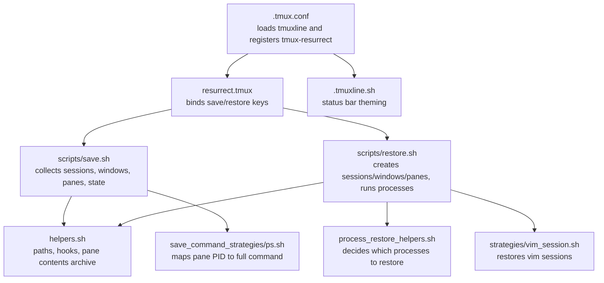
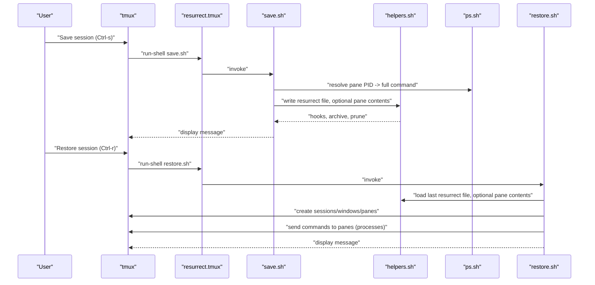
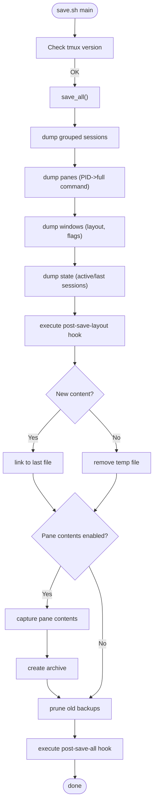
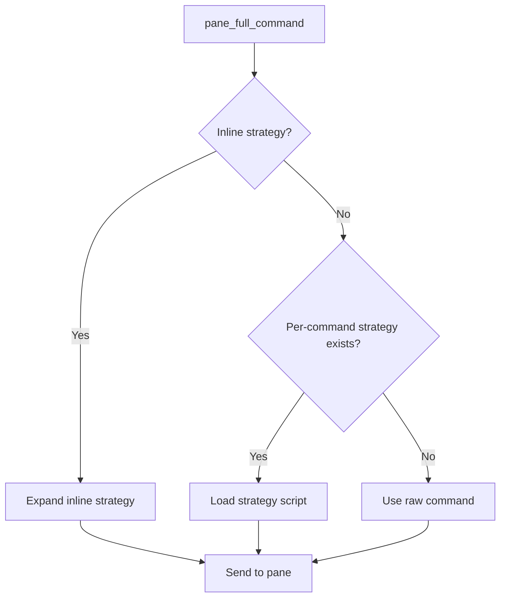
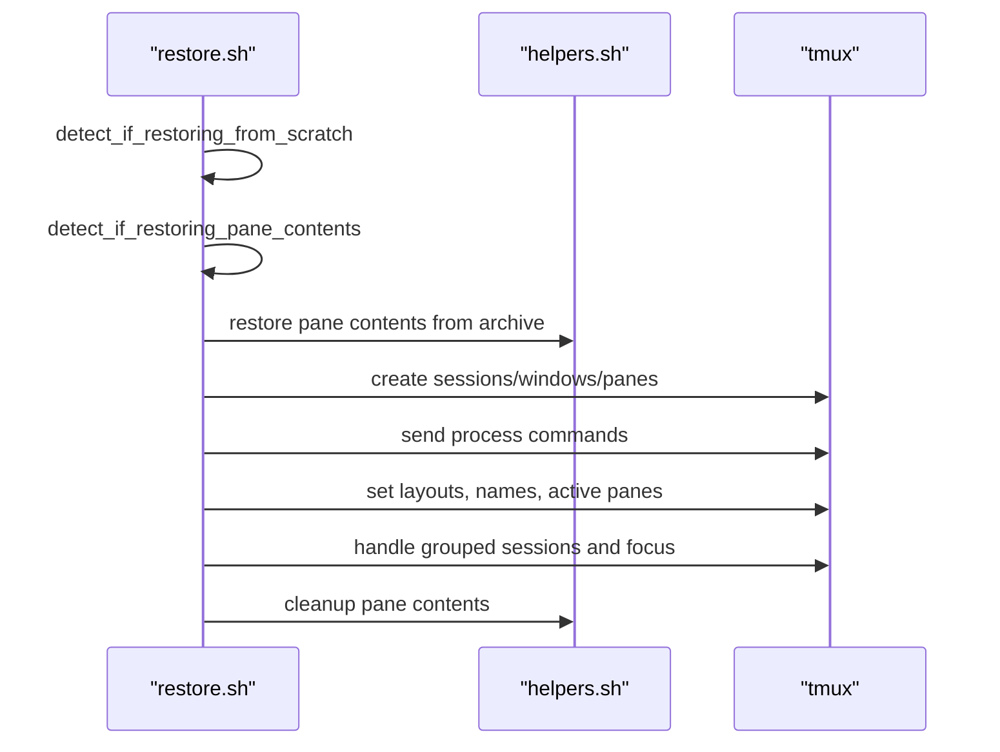
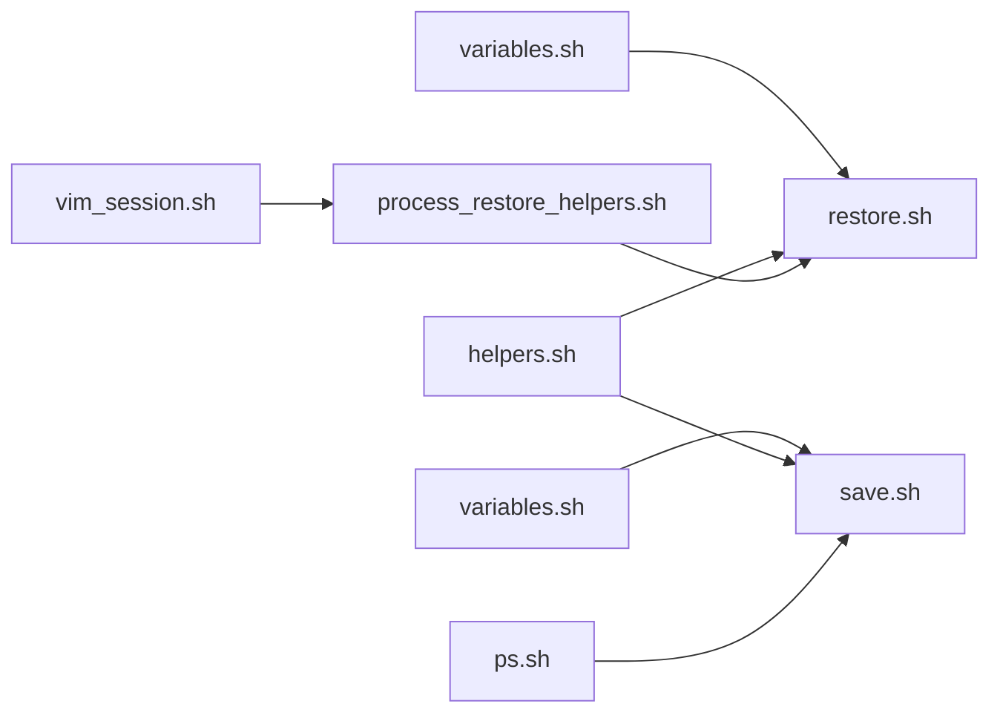

# Session Persistence and Restoration

<cite>
**Referenced Files in This Document**
- [.tmux.conf](file://.tmux.conf)
- [.tmuxline.sh](file://.tmuxline.sh)
- [resurrect.tmux](file://.tmux/plugins/tmux-resurrect/resurrect.tmux)
- [save.sh](file://.tmux/plugins/tmux-resurrect/scripts/save.sh)
- [restore.sh](file://.tmux/plugins/tmux-resurrect/scripts/restore.sh)
- [variables.sh](file://.tmux/plugins/tmux-resurrect/scripts/variables.sh)
- [helpers.sh](file://.tmux/plugins/tmux-resurrect/scripts/helpers.sh)
- [process_restore_helpers.sh](file://.tmux/plugins/tmux-resurrect/scripts/process_restore_helpers.sh)
- [ps.sh](file://.tmux/plugins/tmux-resurrect/save_command_strategies/ps.sh)
- [vim_session.sh](file://.tmux/plugins/tmux-resurrect/strategies/vim_session.sh)
- [README.md](file://.tmux/plugins/tmux-resurrect/README.md)
- [save_dir.md](file://.tmux/plugins/tmux-resurrect/docs/save_dir.md)
</cite>

## Table of Contents
1. [Introduction](#introduction)
2. [Project Structure](#project-structure)
3. [Core Components](#core-components)
4. [Architecture Overview](#architecture-overview)
5. [Detailed Component Analysis](#detailed-component-analysis)
6. [Dependency Analysis](#dependency-analysis)
7. [Performance Considerations](#performance-considerations)
8. [Troubleshooting Guide](#troubleshooting-guide)
9. [Conclusion](#conclusion)
10. [Appendices](#appendices)

## Introduction
This document explains how Tmux session persistence and restoration works in this repository using tmux-resurrect. It covers how sessions are saved, how programs and environments are detected and restored, how tmuxline status bar theming integrates with the environment, and how to manage and troubleshoot restoration. It also provides guidance on selective restoration, emergency recovery, and performance/storage optimization.

## Project Structure
The tmux-resurrect plugin is integrated via TPM and configured through the main tmux configuration. The tmuxline theme is sourced separately to provide a consistent status bar appearance across sessions.

**Diagram sources**
- [.tmux.conf](file://.tmux.conf#L1-L69)
- [resurrect.tmux](file://.tmux/plugins/tmux-resurrect/resurrect.tmux#L1-L41)
- [save.sh](file://.tmux/plugins/tmux-resurrect/scripts/save.sh#L1-L279)
- [restore.sh](file://.tmux/plugins/tmux-resurrect/scripts/restore.sh#L1-L388)
- [helpers.sh](file://.tmux/plugins/tmux-resurrect/scripts/helpers.sh#L1-L160)
- [ps.sh](file://.tmux/plugins/tmux-resurrect/save_command_strategies/ps.sh#L1-L25)
- [process_restore_helpers.sh](file://.tmux/plugins/tmux-resurrect/scripts/process_restore_helpers.sh#L1-L199)
- [vim_session.sh](file://.tmux/plugins/tmux-resurrect/strategies/vim_session.sh#L1-L24)
- [.tmuxline.sh](file://.tmuxline.sh#L1-L22)

**Section sources**
- [.tmux.conf](file://.tmux.conf#L1-L69)
- [.tmuxline.sh](file://.tmuxline.sh#L1-L22)
- [resurrect.tmux](file://.tmux/plugins/tmux-resurrect/resurrect.tmux#L1-L41)

## Core Components
- Key bindings and activation: tmux-resurrect is loaded and bound to save/restore actions via the plugin manager and a bootstrap script.
- Save pipeline: Collects sessions, windows, panes, grouped sessions, and state; optionally captures pane contents; archives and prunes backups.
- Restore pipeline: Recreates sessions/windows/panes, restores vim/neovim sessions, sends commands to panes, and restores layout and focus.
- Environment and process detection: Uses a strategy to resolve pane PID to full command; supports per-application strategies and inline strategies.
- Storage and hooks: Stores data under a configurable directory and exposes pre/post hooks for customization.

**Section sources**
- [resurrect.tmux](file://.tmux/plugins/tmux-resurrect/resurrect.tmux#L1-L41)
- [save.sh](file://.tmux/plugins/tmux-resurrect/scripts/save.sh#L1-L279)
- [restore.sh](file://.tmux/plugins/tmux-resurrect/scripts/restore.sh#L1-L388)
- [variables.sh](file://.tmux/plugins/tmux-resurrect/scripts/variables.sh#L1-L49)
- [helpers.sh](file://.tmux/plugins/tmux-resurrect/scripts/helpers.sh#L1-L160)
- [process_restore_helpers.sh](file://.tmux/plugins/tmux-resurrect/scripts/process_restore_helpers.sh#L1-L199)
- [ps.sh](file://.tmux/plugins/tmux-resurrect/save_command_strategies/ps.sh#L1-L25)
- [vim_session.sh](file://.tmux/plugins/tmux-resurrect/strategies/vim_session.sh#L1-L24)

## Architecture Overview
The system orchestrates persistence and restoration through tmux’s scripting APIs and external strategies.

**Diagram sources**
- [resurrect.tmux](file://.tmux/plugins/tmux-resurrect/resurrect.tmux#L8-L22)
- [save.sh](file://.tmux/plugins/tmux-resurrect/scripts/save.sh#L238-L260)
- [helpers.sh](file://.tmux/plugins/tmux-resurrect/scripts/helpers.sh#L143-L159)
- [ps.sh](file://.tmux/plugins/tmux-resurrect/save_command_strategies/ps.sh#L13-L18)
- [restore.sh](file://.tmux/plugins/tmux-resurrect/scripts/restore.sh#L366-L386)

## Detailed Component Analysis

### Save Mechanism
- Data collected:
  - Grouped sessions and their relationships.
  - Panes: per-pane metadata, current path, command, PID, history size.
  - Windows: indices, flags, layout, automatic-rename setting.
  - State: active and last client sessions.
  - Optional: pane contents captured and archived.
- Storage:
  - Writes a timestamped file into the resurrect directory and maintains a symlink to the latest.
  - Archives pane contents and prunes old backups based on a retention policy.
- Hooks:
  - Executes post-save-layout and post-save-all hooks for extensibility.

**Diagram sources**
- [save.sh](file://.tmux/plugins/tmux-resurrect/scripts/save.sh#L238-L260)
- [helpers.sh](file://.tmux/plugins/tmux-resurrect/scripts/helpers.sh#L230-L236)
- [ps.sh](file://.tmux/plugins/tmux-resurrect/save_command_strategies/ps.sh#L13-L18)

**Section sources**
- [save.sh](file://.tmux/plugins/tmux-resurrect/scripts/save.sh#L16-L227)
- [helpers.sh](file://.tmux/plugins/tmux-resurrect/scripts/helpers.sh#L83-L160)
- [ps.sh](file://.tmux/plugins/tmux-resurrect/save_command_strategies/ps.sh#L1-L25)

### Program Detection and Restoration
- Pane PID resolution:
  - Uses a strategy script to translate pane PID to the full command executed in the pane.
- Process restoration:
  - Decides whether to restore a process based on configuration:
    - Restore all (:all), none (false), or a combined default and user list.
    - Supports inline strategies and per-command strategy overrides.
  - Sends the determined command to the appropriate pane.
- Application-specific strategies:
  - Example: vim session strategy checks for a session file and either restores it or falls back to the original command.

**Diagram sources**
- [process_restore_helpers.sh](file://.tmux/plugins/tmux-resurrect/scripts/process_restore_helpers.sh#L10-L40)
- [vim_session.sh](file://.tmux/plugins/tmux-resurrect/strategies/vim_session.sh#L12-L22)

**Section sources**
- [process_restore_helpers.sh](file://.tmux/plugins/tmux-resurrect/scripts/process_restore_helpers.sh#L1-L199)
- [variables.sh](file://.tmux/plugins/tmux-resurrect/scripts/variables.sh#L10-L31)
- [vim_session.sh](file://.tmux/plugins/tmux-resurrect/strategies/vim_session.sh#L1-L24)

### Environment Variable Preservation
- Working directory:
  - Saved per-pane and restored on creation, ensuring programs start in the correct location.
- Shell defaults:
  - Default shell and command are cached and reused to maintain consistent interactive shells.
- Pane contents capture:
  - Optional capture of pane contents allows restoring visible or full buffer content, aiding environment continuity.

**Section sources**
- [restore.sh](file://.tmux/plugins/tmux-resurrect/scripts/restore.sh#L109-L124)
- [restore.sh](file://.tmux/plugins/tmux-resurrect/scripts/restore.sh#L126-L174)
- [save.sh](file://.tmux/plugins/tmux-resurrect/scripts/save.sh#L221-L227)
- [helpers.sh](file://.tmux/plugins/tmux-resurrect/scripts/helpers.sh#L83-L95)

### Integration with tmuxline Status Bar Theming
- tmuxline theme is sourced from a dedicated script and applied globally, ensuring consistent status bar appearance across sessions and after restoration.
- The status bar configuration defines colors, separators, and active/inactive window styles.

**Section sources**
- [.tmux.conf](file://.tmux.conf#L9-L10)
- [.tmuxline.sh](file://.tmuxline.sh#L1-L22)

### Custom Session Naming Conventions
- Automatic rename behavior:
  - Window automatic-rename option and window names are saved/restored to preserve user-defined naming conventions.
- Grouped sessions:
  - Original and alternate windows are tracked and restored to maintain focus and context across grouped sessions.

**Section sources**
- [save.sh](file://.tmux/plugins/tmux-resurrect/scripts/save.sh#L203-L215)
- [restore.sh](file://.tmux/plugins/tmux-resurrect/scripts/restore.sh#L287-L304)
- [restore.sh](file://.tmux/plugins/tmux-resurrect/scripts/restore.sh#L217-L238)

### Restoration Procedures
- Full restoration flow:
  - Detect if restoring from scratch (single-pane scenario).
  - Optionally restore pane contents from archive.
  - Recreate sessions, windows, and panes in the correct order and directories.
  - Send commands to panes to restore running programs.
  - Restore window layouts, active panes, zoomed state, grouped sessions, and active/alternate windows/sessions.
  - Clean up temporary pane contents.

**Diagram sources**
- [restore.sh](file://.tmux/plugins/tmux-resurrect/scripts/restore.sh#L264-L386)
- [helpers.sh](file://.tmux/plugins/tmux-resurrect/scripts/helpers.sh#L88-L95)

**Section sources**
- [restore.sh](file://.tmux/plugins/tmux-resurrect/scripts/restore.sh#L1-L388)

### Selective Session Restoration
- Choose what to restore:
  - Restore all (:all), disable restoration (false), or specify a custom list.
  - Combine with default process list or override with per-command strategies.
- Inline strategies:
  - Define match and replacement tokens to tailor how commands are sent to panes.

**Section sources**
- [variables.sh](file://.tmux/plugins/tmux-resurrect/scripts/variables.sh#L10-L31)
- [process_restore_helpers.sh](file://.tmux/plugins/tmux-resurrect/scripts/process_restore_helpers.sh#L141-L170)

### Handling Complex Application States
- Vim/Neovim sessions:
  - Strategy checks for a session file and restores it; otherwise falls back to the original command.
- Pane contents:
  - Optional capture of visible or full pane buffers helps restore complex editor states and logs.
- Zoomed windows and layouts:
  - Zoom state and exact window layouts are preserved and restored.

**Section sources**
- [vim_session.sh](file://.tmux/plugins/tmux-resurrect/strategies/vim_session.sh#L1-L24)
- [restore.sh](file://.tmux/plugins/tmux-resurrect/scripts/restore.sh#L326-L331)
- [restore.sh](file://.tmux/plugins/tmux-resurrect/scripts/restore.sh#L287-L304)

### Practical Examples

- Automated session management:
  - Use the provided key bindings to save and restore sessions without manual intervention.
  - Integrate with a session manager or automation tool to trigger save/restore at boot or idle periods.

- Emergency recovery procedure:
  - If tmux fails to start cleanly, restore from the last saved file using the restore binding.
  - Verify that the resurrect directory exists and contains a recent file; if not, recreate a minimal environment and re-save.

- Storage optimization:
  - Adjust the resurrect directory to a fast disk or network location as needed.
  - Tune backup retention to balance safety and disk usage.

**Section sources**
- [README.md](file://.tmux/plugins/tmux-resurrect/README.md#L27-L31)
- [helpers.sh](file://.tmux/plugins/tmux-resurrect/scripts/helpers.sh#L229-L236)
- [save_dir.md](file://.tmux/plugins/tmux-resurrect/docs/save_dir.md#L1-L16)

## Dependency Analysis
The save and restore scripts depend on shared helpers for paths, hooks, and pane contents. Strategies and process helpers provide extensibility for application-specific restoration.

**Diagram sources**
- [variables.sh](file://.tmux/plugins/tmux-resurrect/scripts/variables.sh#L1-L49)
- [save.sh](file://.tmux/plugins/tmux-resurrect/scripts/save.sh#L1-L279)
- [restore.sh](file://.tmux/plugins/tmux-resurrect/scripts/restore.sh#L1-L388)
- [helpers.sh](file://.tmux/plugins/tmux-resurrect/scripts/helpers.sh#L1-L160)
- [process_restore_helpers.sh](file://.tmux/plugins/tmux-resurrect/scripts/process_restore_helpers.sh#L1-L199)
- [ps.sh](file://.tmux/plugins/tmux-resurrect/save_command_strategies/ps.sh#L1-L25)
- [vim_session.sh](file://.tmux/plugins/tmux-resurrect/strategies/vim_session.sh#L1-L24)

**Section sources**
- [variables.sh](file://.tmux/plugins/tmux-resurrect/scripts/variables.sh#L1-L49)
- [helpers.sh](file://.tmux/plugins/tmux-resurrect/scripts/helpers.sh#L1-L160)
- [process_restore_helpers.sh](file://.tmux/plugins/tmux-resurrect/scripts/process_restore_helpers.sh#L1-L199)

## Performance Considerations
- Pane contents capture:
  - Enabling pane contents capture increases I/O and storage usage. Consider disabling for frequent saves or enabling only for critical sessions.
- Backup pruning:
  - The default policy keeps at least a minimum number of backups while removing older ones; tune retention to balance recovery needs and disk usage.
- Process restoration:
  - Restoring many processes can be slow. Use selective restoration to reduce overhead.
- Strategy selection:
  - Using heavier strategies (e.g., capturing full pane buffers) impacts performance; choose “visible” capture when appropriate.

[No sources needed since this section provides general guidance]

## Troubleshooting Guide
- No saved file found:
  - Ensure the resurrect directory exists and contains a recent file; if not, save a session first.
- Overwrite protection:
  - If restoring into an existing environment, tmux-resurrect avoids overwriting panes by default. Use the appropriate configuration to allow overwrites if needed.
- Pane contents not restored:
  - Confirm pane contents capture is enabled and that the archive exists; verify permissions and available disk space.
- Programs not restored:
  - Check the process list configuration and inline/per-command strategies; ensure the commands are executable and the working directory is correct.
- Status bar theming mismatch:
  - Verify that the tmuxline script is sourced and that tmux is restarted after changes.

**Section sources**
- [restore.sh](file://.tmux/plugins/tmux-resurrect/scripts/restore.sh#L30-L36)
- [restore.sh](file://.tmux/plugins/tmux-resurrect/scripts/restore.sh#L240-L253)
- [helpers.sh](file://.tmux/plugins/tmux-resurrect/scripts/helpers.sh#L83-L95)
- [variables.sh](file://.tmux/plugins/tmux-resurrect/scripts/variables.sh#L33-L42)
- [.tmux.conf](file://.tmux.conf#L9-L10)

## Conclusion
This repository integrates tmux-resurrect for robust session persistence and restoration, complemented by tmuxline for consistent status bar theming. The system captures sessions, windows, panes, and state, and can optionally restore pane contents and vim/neovim sessions. With configurable strategies and hooks, it supports selective restoration and can be tuned for performance and storage needs.

[No sources needed since this section summarizes without analyzing specific files]

## Appendices

### Key Bindings and Activation
- Save: Control-s
- Restore: Control-r
- Activation: Loaded via tmux-resurrect and TPM bootstrap.

**Section sources**
- [README.md](file://.tmux/plugins/tmux-resurrect/README.md#L27-L31)
- [resurrect.tmux](file://.tmux/plugins/tmux-resurrect/resurrect.tmux#L8-L22)
- [.tmux.conf](file://.tmux.conf#L56-L68)

### Configurable Options
- Resurrect directory: Change via a dedicated option with supported variable substitutions.
- Pane contents capture: Toggle and set area (visible/full).
- Backup retention: Days after which old backups are removed.
- Process restoration: Enable all, disable, or customize lists and strategies.

**Section sources**
- [save_dir.md](file://.tmux/plugins/tmux-resurrect/docs/save_dir.md#L1-L16)
- [variables.sh](file://.tmux/plugins/tmux-resurrect/scripts/variables.sh#L33-L49)
- [helpers.sh](file://.tmux/plugins/tmux-resurrect/scripts/helpers.sh#L229-L236)
- [process_restore_helpers.sh](file://.tmux/plugins/tmux-resurrect/scripts/process_restore_helpers.sh#L1-L8)