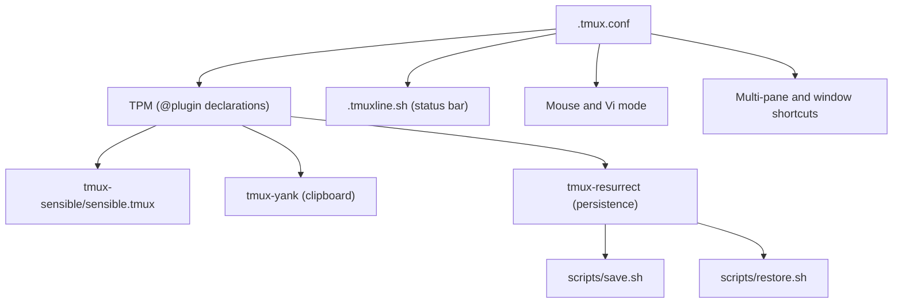
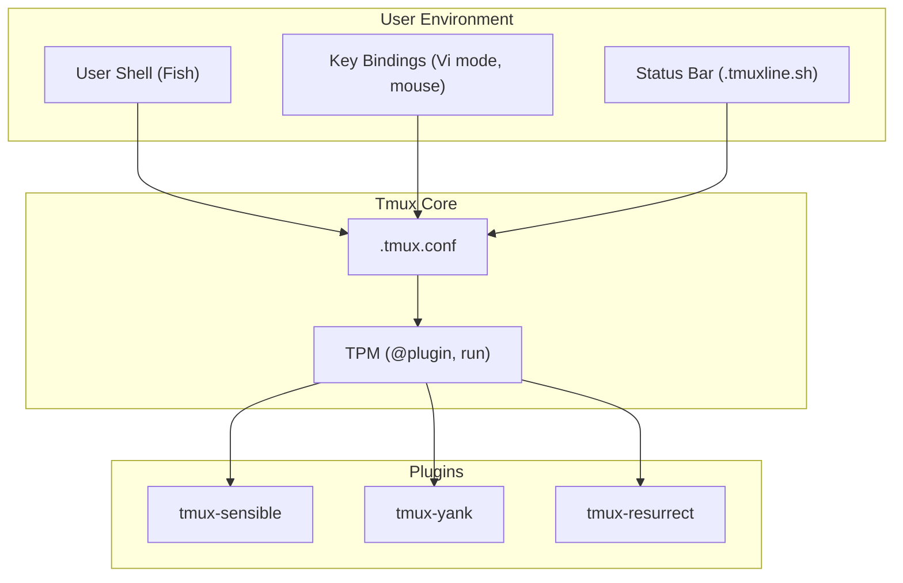
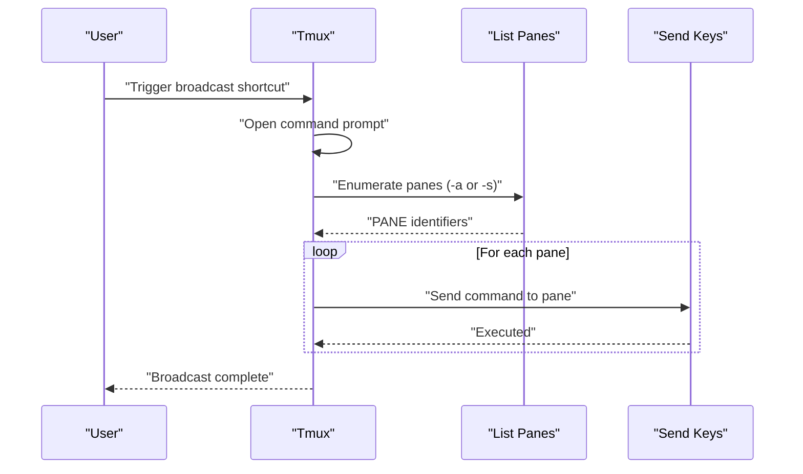
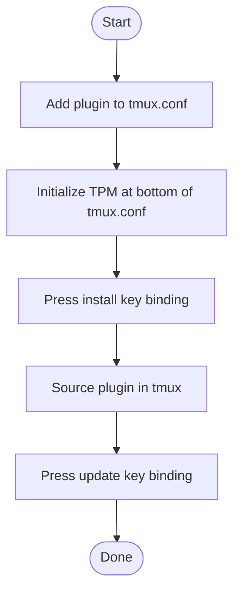
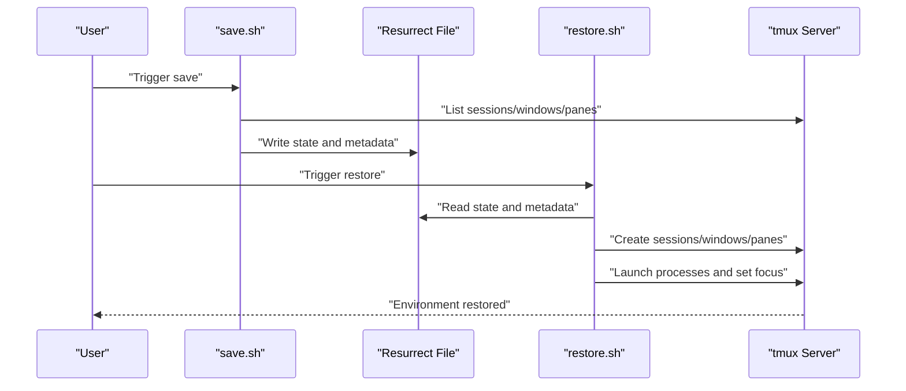
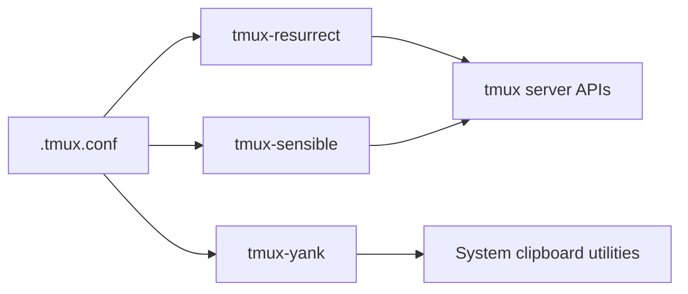

# Terminal Multiplexer (Tmux)

<cite>
**Referenced Files in This Document**
- [.tmux.conf](file://.tmux.conf)
- [.tmuxline.sh](file://.tmuxline.sh)
- [tmux-sensible/sensible.tmux](file://.tmux/plugins/tmux-sensible/sensible.tmux)
- [tmux-yank/README.md](file://.tmux/plugins/tmux-yank/README.md)
- [tmux-resurrect/README.md](file://.tmux/plugins/tmux-resurrect/README.md)
- [tmux-resurrect/scripts/save.sh](file://.tmux/plugins/tmux-resurrect/scripts/save.sh)
- [tmux-resurrect/scripts/restore.sh](file://.tmux/plugins/tmux-resurrect/scripts/restore.sh)
- [tpm/README.md](file://.tmux/plugins/tpm/README.md)
</cite>

## Table of Contents
1. [Introduction](#introduction)
2. [Project Structure](#project-structure)
3. [Core Components](#core-components)
4. [Architecture Overview](#architecture-overview)
5. [Detailed Component Analysis](#detailed-component-analysis)
6. [Dependency Analysis](#dependency-analysis)
7. [Performance Considerations](#performance-considerations)
8. [Troubleshooting Guide](#troubleshooting-guide)
9. [Conclusion](#conclusion)
10. [Appendices](#appendices)

## Introduction
This document explains the Tmux terminal multiplexer configuration in this repository, focusing on session management, the plugin ecosystem, and enhanced terminal workflow. It documents the core Tmux configuration, key binding system, status line customization, and integrations with external tools. It also covers the plugin management system using TPM (Tmux Plugin Manager), including session persistence with tmux-resurrect, clipboard integration with tmux-yank, and other productivity-enhancing plugins. Practical workflows, window management patterns, and troubleshooting session-related issues are included.

## Project Structure
The Tmux configuration centers around a minimal and extensible tmux.conf that:
- Sets the shell to Fish when available
- Sources a separate status bar script (.tmuxline.sh) for theme and layout
- Enables mouse mode and vi editing mode
- Adds convenient multi-pane and window manipulation shortcuts
- Declares plugins via TPM and initializes the plugin manager at the bottom of the file

The plugin ecosystem resides under .tmux/plugins and includes:
- tmux-sensible: sensible defaults and ergonomic key bindings
- tmux-yank: clipboard integration across platforms
- tmux-resurrect: session persistence and restoration
- tpm: the plugin manager itself

**Diagram sources**
- [.tmux.conf](file://.tmux.conf#L1-L69)
- [.tmuxline.sh](file://.tmuxline.sh#L1-L22)
- [tmux-sensible/sensible.tmux](file://.tmux/plugins/tmux-sensible/sensible.tmux#L1-L169)
- [tmux-yank/README.md](file://.tmux/plugins/tmux-yank/README.md#L1-L291)
- [tmux-resurrect/README.md](file://.tmux/plugins/tmux-resurrect/README.md#L1-L130)
- [tmux-resurrect/scripts/save.sh](file://.tmux/plugins/tmux-resurrect/scripts/save.sh#L1-L279)
- [tmux-resurrect/scripts/restore.sh](file://.tmux/plugins/tmux-resurrect/scripts/restore.sh#L1-L388)

**Section sources**
- [.tmux.conf](file://.tmux.conf#L1-L69)
- [.tmuxline.sh](file://.tmuxline.sh#L1-L22)

## Core Components
- General configuration and environment
  - Shell selection and terminal compatibility
  - Mouse mode and vi editing mode
  - Multi-pane broadcasting and window swapping
- Plugin management via TPM
  - Declaring plugins and initializing the manager
- Status line customization
  - Left/right segments, styles, and window status formatting

Key behaviors:
- The configuration conditionally sets the default shell to Fish if present.
- The TERM variable is configured for 256-color support with RGB overrides.
- Mouse mode is enabled for improved usability.
- Vi mode is enabled for copy mode and command prompt editing.
- Shortcuts for pane selection and multi-pane command broadcasting are bound without requiring the prefix key.
- Plugins are declared and initialized at the bottom of the file to ensure sourcing order.

**Section sources**
- [.tmux.conf](file://.tmux.conf#L6-L25)
- [.tmux.conf](file://.tmux.conf#L38-L54)
- [.tmux.conf](file://.tmux.conf#L56-L68)

## Architecture Overview
The Tmux runtime integrates three layers:
- User configuration (.tmux.conf): defines environment, key bindings, and plugin declarations
- Plugin manager (tpm): installs, updates, and sources plugins
- Plugins: tmux-sensible (defaults and bindings), tmux-yank (clipboard), tmux-resurrect (session persistence)

**Diagram sources**
- [.tmux.conf](file://.tmux.conf#L6-L25)
- [.tmux.conf](file://.tmux.conf#L38-L54)
- [.tmuxline.sh](file://.tmuxline.sh#L1-L22)
- [tmux-sensible/sensible.tmux](file://.tmux/plugins/tmux-sensible/sensible.tmux#L78-L169)
- [tmux-yank/README.md](file://.tmux/plugins/tmux-yank/README.md#L20-L58)
- [tmux-resurrect/README.md](file://.tmux/plugins/tmux-resurrect/README.md#L64-L84)
- [tpm/README.md](file://.tmux/plugins/tpm/README.md#L11-L46)

## Detailed Component Analysis

### Key Binding System
The key binding system enhances productivity by:
- Enabling vi editing mode for copy mode and command prompts
- Allowing pane selection via Alt + arrow keys without the prefix
- Broadcasting commands to all panes or all panes in the current session
- Enabling mouse mode for selections and clicks

Operational flow for broadcasting to all panes:
- A prompt asks for a command
- The system enumerates panes across sessions and windows
- Sends the command to each pane’s input stream

**Diagram sources**
- [.tmux.conf](file://.tmux.conf#L46-L54)

**Section sources**
- [.tmux.conf](file://.tmux.conf#L31-L32)
- [.tmux.conf](file://.tmux.conf#L38-L43)
- [.tmux.conf](file://.tmux.conf#L46-L54)

### Status Line Customization
The status line is customized via a dedicated script that:
- Sets alignment, visibility, and length for left/right regions
- Defines border and message styles
- Formats session, host, date/time, and window lists with glyphs and colors
- Uses window status separators and activity styles

Practical effects:
- Distinctive glyphs separate segments
- Color-coded foreground/background pairs for readability
- Window index and name formatting for quick identification

**Section sources**
- [.tmuxline.sh](file://.tmuxline.sh#L4-L21)

### Plugin Management with TPM
TPM manages plugin lifecycle:
- Declares plugins in tmux.conf
- Initializes the plugin manager at the bottom of the file
- Provides key bindings for installing, updating, and uninstalling plugins

Installation and update workflow:
- Add a plugin declaration to tmux.conf
- Press the install key binding to fetch and source the plugin
- Use the update key binding to refresh plugins

**Diagram sources**
- [tpm/README.md](file://.tmux/plugins/tpm/README.md#L48-L74)
- [.tmux.conf](file://.tmux.conf#L56-L68)

**Section sources**
- [.tmux.conf](file://.tmux.conf#L56-L68)
- [tpm/README.md](file://.tmux/plugins/tpm/README.md#L11-L46)

### Clipboard Integration with tmux-yank
tmux-yank integrates system clipboard across platforms:
- Normal mode bindings for copying command line and pane working directory
- Copy mode bindings for selecting and “putting” selections
- Platform-specific clipboard utilities (macOS, Linux, WSL)
- Optional configuration for selection type and mouse behavior

Key capabilities:
- Copies selected text to the system clipboard
- Supports mouse selections when mouse mode is enabled
- Allows overriding default clipboard programs via tmux options

**Section sources**
- [tmux-yank/README.md](file://.tmux/plugins/tmux-yank/README.md#L150-L257)

### Session Persistence with tmux-resurrect
tmux-resurrect persists and restores:
- Sessions, windows, panes, and their order
- Working directories per pane
- Pane layouts and zoom state
- Active and alternate sessions and windows
- Program processes running in panes
- Optional restoration of Vim/Neovim sessions and pane contents

Save and restore flow:
- Save captures grouped sessions, panes, windows, and state
- Restore reconstructs sessions/windows/panes and launches processes
- Honors existing panes to avoid duplication

**Diagram sources**
- [tmux-resurrect/scripts/save.sh](file://.tmux/plugins/tmux-resurrect/scripts/save.sh#L238-L279)
- [tmux-resurrect/scripts/restore.sh](file://.tmux/plugins/tmux-resurrect/scripts/restore.sh#L366-L388)

**Section sources**
- [tmux-resurrect/README.md](file://.tmux/plugins/tmux-resurrect/README.md#L27-L56)
- [tmux-resurrect/scripts/save.sh](file://.tmux/plugins/tmux-resurrect/scripts/save.sh#L1-L279)
- [tmux-resurrect/scripts/restore.sh](file://.tmux/plugins/tmux-resurrect/scripts/restore.sh#L1-L388)

### Sensible Defaults and Ergonomic Key Bindings (tmux-sensible)
tmux-sensible provides:
- Reduced escape-time for responsive vi mode switching
- Larger scrollback buffer and extended status refresh interval
- macOS-specific default command wrapper when available
- Upgraded terminal defaults for 256-color support
- Improved key bindings for prefix handling, window navigation, and reloading configuration

These defaults reduce friction and improve ergonomics out of the box.

**Section sources**
- [tmux-sensible/sensible.tmux](file://.tmux/plugins/tmux-sensible/sensible.tmux#L78-L169)

## Dependency Analysis
The configuration exhibits clear layering:
- tmux.conf depends on tmux-sensible for defaults and bindings
- tmux-resurrect depends on tmux APIs for listing and creating sessions/windows/panes
- tmux-yank depends on platform clipboard utilities and tmux’s set-clipboard capability
- TPM orchestrates plugin discovery, installation, and sourcing

**Diagram sources**
- [.tmux.conf](file://.tmux.conf#L56-L68)
- [tmux-resurrect/scripts/save.sh](file://.tmux/plugins/tmux-resurrect/scripts/save.sh#L84-L90)
- [tmux-resurrect/scripts/restore.sh](file://.tmux/plugins/tmux-resurrect/scripts/restore.sh#L126-L152)
- [tmux-yank/README.md](file://.tmux/plugins/tmux-yank/README.md#L61-L148)
- [tmux-sensible/sensible.tmux](file://.tmux/plugins/tmux-sensible/sensible.tmux#L101-L125)

**Section sources**
- [.tmux.conf](file://.tmux.conf#L56-L68)
- [tmux-resurrect/scripts/save.sh](file://.tmux/plugins/tmux-resurrect/scripts/save.sh#L84-L90)
- [tmux-resurrect/scripts/restore.sh](file://.tmux/plugins/tmux-resurrect/scripts/restore.sh#L126-L152)
- [tmux-yank/README.md](file://.tmux/plugins/tmux-yank/README.md#L61-L148)
- [tmux-sensible/sensible.tmux](file://.tmux/plugins/tmux-sensible/sensible.tmux#L101-L125)

## Performance Considerations
- Increase scrollback buffer and adjust status refresh interval for smoother status updates
- Use pane contents capture selectively to balance fidelity and overhead
- Limit the number of concurrently running processes in panes to reduce restore time
- Prefer grouped sessions for multi-monitor setups to minimize recreation overhead

[No sources needed since this section provides general guidance]

## Troubleshooting Guide
Common issues and resolutions:
- TPM not working
  - Ensure the plugin manager is initialized at the bottom of tmux.conf
  - Use the install/update key bindings to fetch and source plugins
- Clipboard integration issues
  - Verify platform clipboard utilities are installed and accessible
  - Confirm tmux’s set-clipboard option is enabled when appropriate
- Session restoration anomalies
  - Confirm the resurrect file exists and is readable
  - Review restore logs and hooks for errors
  - Consider disabling pane contents capture if restoring large environments

**Section sources**
- [tpm/README.md](file://.tmux/plugins/tpm/README.md#L75-L85)
- [tmux-yank/README.md](file://.tmux/plugins/tmux-yank/README.md#L61-L148)
- [tmux-resurrect/README.md](file://.tmux/plugins/tmux-resurrect/README.md#L86-L100)

## Conclusion
This Tmux configuration emphasizes reliability, ergonomics, and productivity. By combining sensible defaults, robust plugin management, and powerful persistence and clipboard features, it supports efficient terminal workflows across sessions and systems. The modular design allows incremental enhancements while maintaining stability.

[No sources needed since this section summarizes without analyzing specific files]

## Appendices

### Practical Workflows
- Save current environment: use the save key binding to persist sessions, windows, panes, and processes
- Restore environment: use the restore key binding to recreate sessions and relaunch processes
- Broadcast commands: send the same command to all panes or all panes in the current session
- Switch panes: use Alt + arrow keys for quick navigation without typing the prefix
- Copy to clipboard: use normal mode bindings to copy command lines and pane directories, and copy mode bindings for selections

**Section sources**
- [tmux-resurrect/README.md](file://.tmux/plugins/tmux-resurrect/README.md#L27-L31)
- [.tmux.conf](file://.tmux.conf#L46-L54)
- [.tmux.conf](file://.tmux.conf#L38-L43)
- [tmux-yank/README.md](file://.tmux/plugins/tmux-yank/README.md#L153-L176)