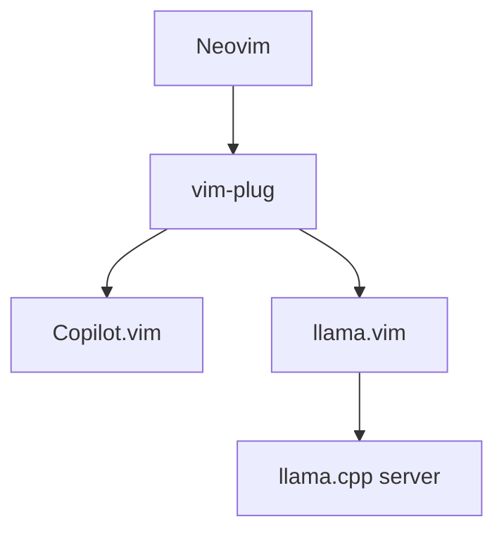
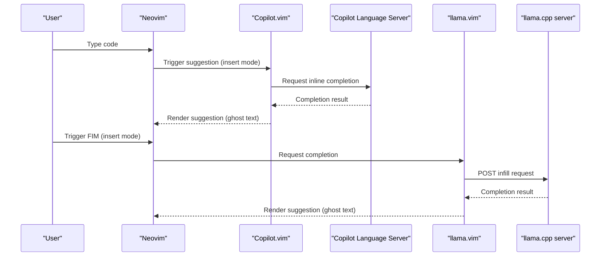
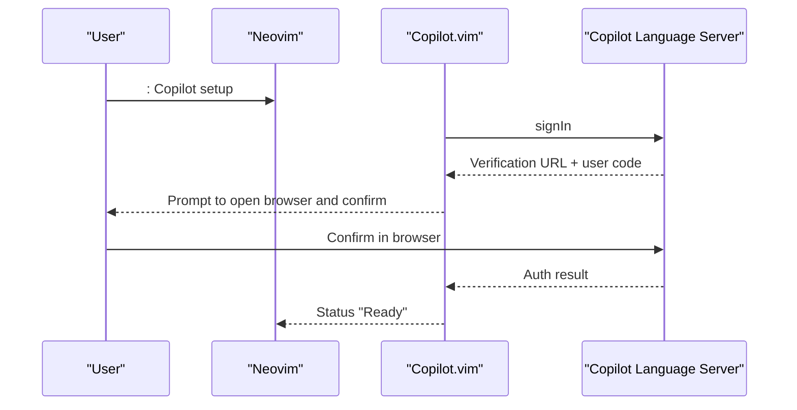
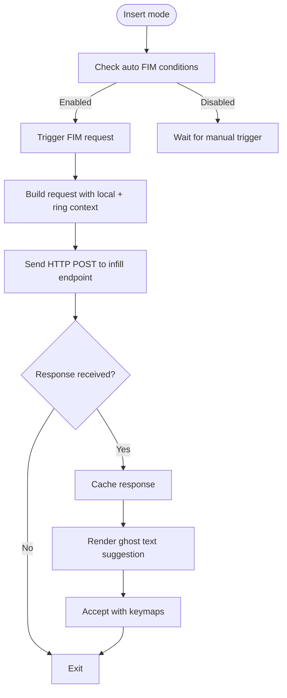
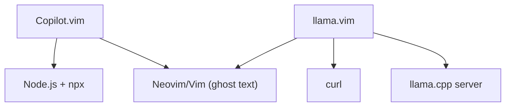

# AI Assistant Integration

<cite>
**Referenced Files in This Document**
- [init.vim](file://.config/nvim/init.vim)
- [copilot.vim](file://.local/share/nvim/plugged/copilot.vim/plugin/copilot.vim)
- [copilot.vim (autoload)](file://.local/share/nvim/plugged/copilot.vim/autoload/copilot.vim)
- [copilot.txt](file://.local/share/nvim/plugged/copilot.vim/doc/copilot.txt)
- [llama.vim](file://.local/share/nvim/plugged/llama.vim/plugin/llama.vim)
- [llama.vim (autoload)](file://.local/share/nvim/plugged/llama.vim/autoload/llama.vim)
- [llama.txt](file://.local/share/nvim/plugged/llama.vim/doc/llama.txt)
- [llama_debug.vim](file://.local/share/nvim/plugged/llama.vim/autoload/llama_debug.vim)
</cite>

## Table of Contents
1. [Introduction](#introduction)
2. [Project Structure](#project-structure)
3. [Core Components](#core-components)
4. [Architecture Overview](#architecture-overview)
5. [Detailed Component Analysis](#detailed-component-analysis)
6. [Dependency Analysis](#dependency-analysis)
7. [Performance Considerations](#performance-considerations)
8. [Troubleshooting Guide](#troubleshooting-guide)
9. [Conclusion](#conclusion)

## Introduction
This document explains how AI assistants are integrated into Neovim via two plugins:
- Copilot.vim: GitHub Copilot integration for AI-powered code suggestions and inline completions.
- llama.vim: Local AI assistance powered by a llama.cpp server, providing Fill-in-Middle (FIM) completions and instruction-based editing.

It covers configuration, authentication, usage patterns, local server setup, performance tuning, integration workflows, command mappings, and troubleshooting.

## Project Structure
The Neovim configuration integrates both plugins through vim-plug and exposes a minimal set of user-facing settings. The Copilot.vim plugin is loaded via vim-plug and initializes automatically. The llama.vim plugin is also loaded via vim-plug and initializes on startup by default.

**Diagram sources**
- [init.vim](file://.config/nvim/init.vim#L137-L161)
- [copilot.vim](file://.local/share/nvim/plugged/copilot.vim/plugin/copilot.vim#L1-L115)
- [llama.vim](file://.local/share/nvim/plugged/llama.vim/plugin/llama.vim#L1-L2)

**Section sources**
- [init.vim](file://.config/nvim/init.vim#L137-L161)

## Core Components
- Copilot.vim
  - Provides inline code suggestions and accepts them via keymaps.
  - Exposes commands for setup, status, model selection, panel, version, restart, and upgrade.
  - Integrates with the Copilot Language Server via Node.js and npx.
- llama.vim
  - Provides Fill-in-Middle (FIM) completions and instruction-based editing.
  - Sends HTTP requests to a local llama.cpp server endpoint.
  - Offers configurable endpoints, models, caching, and performance metrics.

**Section sources**
- [copilot.vim](file://.local/share/nvim/plugged/copilot.vim/plugin/copilot.vim#L1-L115)
- [copilot.vim (autoload)](file://.local/share/nvim/plugged/copilot.vim/autoload/copilot.vim#L26-L88)
- [copilot.txt](file://.local/share/nvim/plugged/copilot.vim/doc/copilot.txt#L11-L44)
- [llama.vim](file://.local/share/nvim/plugged/llama.vim/plugin/llama.vim#L1-L2)
- [llama.vim (autoload)](file://.local/share/nvim/plugged/llama.vim/autoload/llama.vim#L65-L96)
- [llama.txt](file://.local/share/nvim/plugged/llama.vim/doc/llama.txt#L31-L63)

## Architecture Overview
The AI assistant architecture consists of:
- Neovim editor with vim-plug managing plugins.
- Copilot.vim communicating with the Copilot Language Server (via Node.js and npx).
- llama.vim communicating with a local llama.cpp server over HTTP endpoints.

**Diagram sources**
- [copilot.vim](file://.local/share/nvim/plugged/copilot.vim/plugin/copilot.vim#L45-L69)
- [copilot.vim (autoload)](file://.local/share/nvim/plugged/copilot.vim/autoload/copilot.vim#L155-L187)
- [llama.vim (autoload)](file://.local/share/nvim/plugged/llama.vim/autoload/llama.vim#L701-L891)

## Detailed Component Analysis

### Copilot.vim Integration
- Initialization and keymaps
  - The plugin sets up color schemes, keymaps, and autocmds for insert mode events.
  - It defines accept, cycle, suggest, and dismiss actions via <Plug> mappings and expressions.
- Commands and authentication
  - :Copilot setup initiates sign-in and waits for browser verification.
  - :Copilot status reports readiness and any warnings or errors.
  - :Copilot model lets you select a completion model if multiple are available.
  - :Copilot panel opens a window to browse suggestions.
  - :Copilot version shows versions of editor, language server, and runtime.
  - :Copilot upgrade upgrades the language server to latest or a pinned version.
  - :Copilot disable/:Copilot enable toggles global enablement.
  - :Copilot signout signs out of Copilot.
- Configuration options
  - g:copilot_version controls language server version constraint.
  - g:copilot_filetypes controls per-filetype enablement.
  - g:copilot_node_command, g:copilot_enterprise_uri, g:copilot_proxy, g:copilot_proxy_strict_ssl influence connectivity and environment.
  - g:copilot_workspace_folders influences workspace roots for suggestions.
- Usage patterns
  - Inline suggestions appear in insert mode; accept with Tab or mapped keys.
  - Use :Copilot status to diagnose issues if suggestions do not appear.

**Diagram sources**
- [copilot.vim (autoload)](file://.local/share/nvim/plugged/copilot.vim/autoload/copilot.vim#L631-L684)
- [copilot.txt](file://.local/share/nvim/plugged/copilot.vim/doc/copilot.txt#L19-L27)

**Section sources**
- [copilot.vim](file://.local/share/nvim/plugged/copilot.vim/plugin/copilot.vim#L23-L109)
- [copilot.vim (autoload)](file://.local/share/nvim/plugged/copilot.vim/autoload/copilot.vim#L26-L88)
- [copilot.txt](file://.local/share/nvim/plugged/copilot.vim/doc/copilot.txt#L11-L44)

### llama.vim Integration
- Initialization and configuration
  - The plugin initializes on startup by default and sets up keymaps and autocmds.
  - g:llama_config controls endpoints, models, context sizes, prediction limits, caching, and keymaps.
- Fill-in-Middle (FIM) completions
  - Automatically triggers on cursor movement in insert mode when conditions are met.
  - Manually trigger with a configured keymap.
  - Accept suggestions with Tab, Shift+Tab (line), or leader+word.
- Instruction-based editing
  - Select text and run :LlamaInstruct to edit via chat-style instructions.
  - Supports rerun, continue, accept, and cancel operations.
- Performance and caching
  - Maintains a ring buffer of context chunks from open files and yanked text.
  - Uses a hash-based cache keyed by context to avoid recomputation.
  - Displays performance metrics inline or in statusline.
- Debugging
  - Toggle a debug pane to inspect logs and request details.

**Diagram sources**
- [llama.vim (autoload)](file://.local/share/nvim/plugged/llama.vim/autoload/llama.vim#L325-L350)
- [llama.vim (autoload)](file://.local/share/nvim/plugged/llama.vim/autoload/llama.vim#L701-L891)
- [llama.vim (autoload)](file://.local/share/nvim/plugged/llama.vim/autoload/llama.vim#L941-L950)

**Section sources**
- [llama.vim](file://.local/share/nvim/plugged/llama.vim/plugin/llama.vim#L1-L2)
- [llama.vim (autoload)](file://.local/share/nvim/plugged/llama.vim/autoload/llama.vim#L65-L96)
- [llama.vim (autoload)](file://.local/share/nvim/plugged/llama.vim/autoload/llama.vim#L259-L323)
- [llama.txt](file://.local/share/nvim/plugged/llama.vim/doc/llama.txt#L17-L29)
- [llama.txt](file://.local/share/nvim/plugged/llama.vim/doc/llama.txt#L100-L139)

## Dependency Analysis
- Copilot.vim depends on:
  - Node.js and npx to run the Copilot Language Server.
  - Editor capabilities for ghost text (Neovim 0.8+ or Vim 9.0.0185+).
- llama.vim depends on:
  - curl for HTTP requests.
  - A running llama.cpp server exposing infill and chat endpoints.
  - Neovim or Vim 9.1+ for ghost text rendering.

**Diagram sources**
- [copilot.txt](file://.local/share/nvim/plugged/copilot.vim/doc/copilot.txt#L51-L127)
- [llama.txt](file://.local/share/nvim/plugged/llama.vim/doc/llama.txt#L6-L14)

**Section sources**
- [copilot.txt](file://.local/share/nvim/plugged/copilot.vim/doc/copilot.txt#L51-L127)
- [llama.txt](file://.local/share/nvim/plugged/llama.vim/doc/llama.txt#L6-L14)

## Performance Considerations
- Copilot.vim
  - Use :Copilot upgrade to keep the language server up to date.
  - Limit suggestions to specific filetypes via g:copilot_filetypes to reduce overhead.
  - Consider proxy settings and strict SSL options if behind corporate infrastructure.
- llama.vim
  - Tune g:llama_config.n_prefix and g:llama_config.n_suffix to balance context size and latency.
  - Adjust g:llama_config.n_predict to limit generation time.
  - Increase g:llama_config.ring_n_chunks and g:llama_config.ring_chunk_size cautiously to leverage global context reuse.
  - Use g:llama_config.show_info=1 to monitor prompt and generation timings in the statusline.
  - Prefer smaller models or quantization for constrained hardware; llama.cpp server settings impact throughput and latency.

[No sources needed since this section provides general guidance]

## Troubleshooting Guide
- Copilot.vim
  - Run :Copilot status to verify readiness and detect warnings or errors.
  - If authentication fails, re-run :Copilot setup and confirm in the browser.
  - If suggestions do not appear, check g:copilot_enabled and buffer-specific flags (b:copilot_enabled/b:copilot_disabled).
  - For enterprise environments, configure g:copilot_enterprise_uri and g:copilot_proxy settings.
- llama.vim
  - Ensure curl is installed and reachable in PATH.
  - Verify llama.cpp server is running and listening on the configured endpoints.
  - Use :LlamaDebugToggle to inspect logs and request details.
  - If performance is poor, reduce n_prefix/n_suffix, n_predict, or ring buffer sizes.
  - If suggestions repeat existing text, adjust stop_strings or review context reuse behavior.

**Section sources**
- [copilot.txt](file://.local/share/nvim/plugged/copilot.vim/doc/copilot.txt#L25-L27)
- [copilot.vim (autoload)](file://.local/share/nvim/plugged/copilot.vim/autoload/copilot.vim#L606-L624)
- [llama_debug.vim](file://.local/share/nvim/plugged/llama.vim/autoload/llama_debug.vim#L106-L123)
- [llama.txt](file://.local/share/nvim/plugged/llama.vim/doc/llama.txt#L169-L180)

## Conclusion
Neovim’s AI assistant integration combines Copilot.vim for cloud-backed suggestions and llama.vim for local, privacy-preserving assistance. With minimal configuration, both plugins offer powerful, efficient workflows:
- Copilot.vim: seamless inline completions with authentication and model selection.
- llama.vim: flexible FIM and instruction-based editing with tunable performance and rich diagnostics.

By aligning plugin settings with your environment and hardware, you can optimize responsiveness and accuracy for diverse development scenarios.