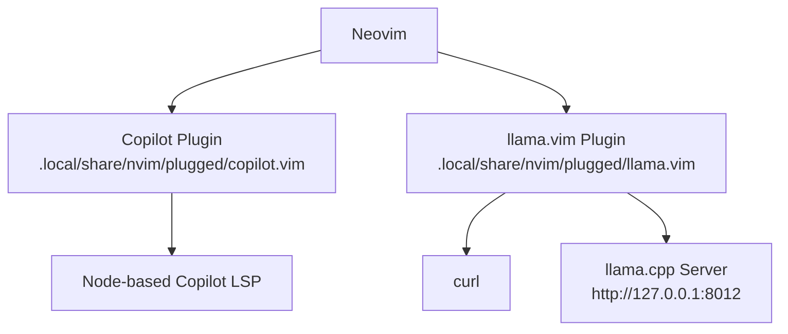
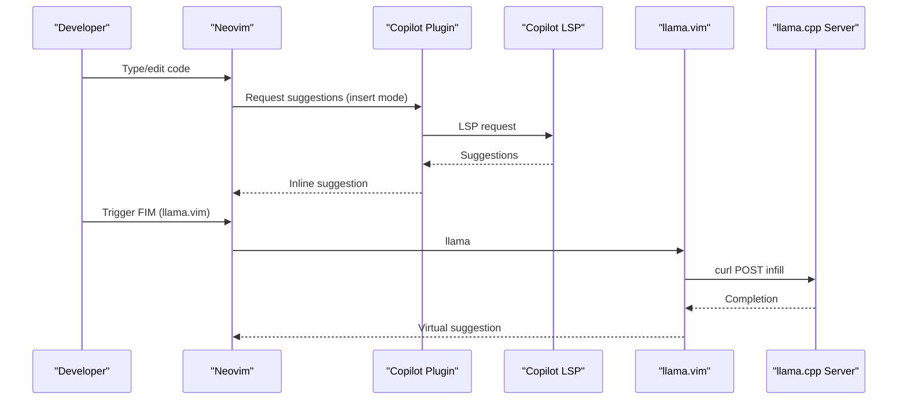
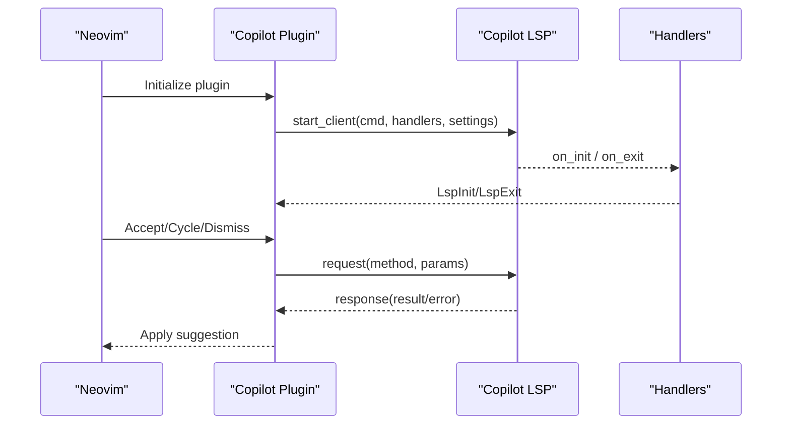
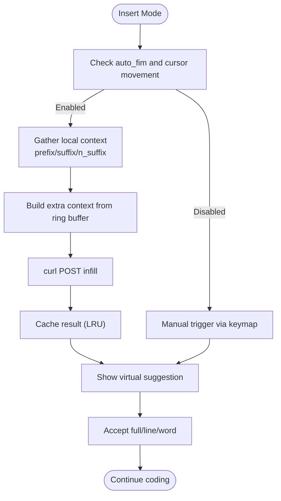
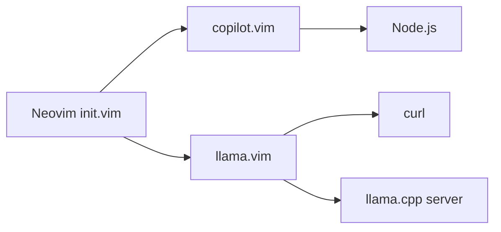

# AI-Assisted Development Workflows

<cite>
**Referenced Files in This Document**
- [init.vim](file://.config/nvim/init.vim)
- [copilot.vim plugin](file://.local/share/nvim/plugged/copilot.vim/plugin/copilot.vim)
- [copilot.txt](file://.local/share/nvim/plugged/copilot.vim/doc/copilot.txt)
- [_copilot.lua](file://.local/share/nvim/plugged/copilot.vim/lua/_copilot.lua)
- [llama.vim plugin](file://.local/share/nvim/plugged/llama.vim/plugin/llama.vim)
- [llama.vim autoload](file://.local/share/nvim/plugged/llama.vim/autoload/llama.vim)
- [llama.vim autoload debug](file://.local/share/nvim/plugged/llama.vim/autoload/llama_debug.vim)
- [llama.txt](file://.local/share/nvim/plugged/llama.vim/doc/llama.txt)
- [llama README](file://.local/share/nvim/plugged/llama.vim/README.md)
- [fish config](file://.config/fish/config.fish)
- [bashrc](file://.bashrc)
- [README](file://README.md)
</cite>

## Table of Contents
1. [Introduction](#introduction)
2. [Project Structure](#project-structure)
3. [Core Components](#core-components)
4. [Architecture Overview](#architecture-overview)
5. [Detailed Component Analysis](#detailed-component-analysis)
6. [Dependency Analysis](#dependency-analysis)
7. [Performance Considerations](#performance-considerations)
8. [Troubleshooting Guide](#troubleshooting-guide)
9. [Conclusion](#conclusion)
10. [Appendices](#appendices)

## Introduction
This document explains how to integrate AI assistants into daily development workflows using the included Neovim configuration and plugins. It focuses on combining Copilot (cloud-based) and a local LLM (via llama.cpp) to optimize productivity, manage context effectively, engineer prompts for best results, and maintain privacy. It also covers performance tuning, cost awareness for cloud services, and practical tips for version control and collaboration.

## Project Structure
The repository provides a complete Neovim-centric environment with:
- Neovim configuration enabling Copilot and llama.vim
- Copilot plugin with LSP integration and keyboard shortcuts
- Local LLM plugin with fill-in-middle (FIM) and instruction-based editing
- Shell configurations for consistent environment setup
- Documentation for both plugins

**Diagram sources**
- [init.vim](file://.config/nvim/init.vim#L155-L158)
- [copilot.vim plugin](file://.local/share/nvim/plugged/copilot.vim/plugin/copilot.vim#L1-L115)
- [llama.vim plugin](file://.local/share/nvim/plugged/llama.vim/plugin/llama.vim#L1-L2)
- [llama.txt](file://.local/share/nvim/plugged/llama.vim/doc/llama.txt#L65-L98)

**Section sources**
- [init.vim](file://.config/nvim/init.vim#L137-L161)
- [README](file://README.md#L1-L35)

## Core Components
- Copilot integration for cloud-based suggestions and inline completions
- Local LLM via llama.vim for offline, privacy-preserving assistance
- Shell environments configured for consistent tooling and prompt integration

Key capabilities:
- Copilot: inline suggestions, acceptance, cycling, and panel of alternatives
- llama.vim: auto-FIM on cursor movement, manual triggers, instruction-based editing, debug pane, and configurable context windows

**Section sources**
- [copilot.txt](file://.local/share/nvim/plugged/copilot.vim/doc/copilot.txt#L11-L44)
- [llama.txt](file://.local/share/nvim/plugged/llama.vim/doc/llama.txt#L17-L63)
- [fish config](file://.config/fish/config.fish#L84-L109)
- [bashrc](file://.bashrc#L171-L195)

## Architecture Overview
The AI-assisted workflow combines two complementary engines:
- Cloud-based Copilot: invoked via Neovim plugin with LSP, supports inline suggestions and a panel of alternatives
- Local llama.cpp: invoked via curl from Neovim, supports FIM and instruction-based editing

**Diagram sources**
- [_copilot.lua](file://.local/share/nvim/plugged/copilot.vim/lua/_copilot.lua#L12-L53)
- [copilot.vim plugin](file://.local/share/nvim/plugged/copilot.vim/plugin/copilot.vim#L45-L69)
- [llama.vim autoload](file://.local/share/nvim/plugged/llama.vim/autoload/llama.vim#L701-L799)

## Detailed Component Analysis

### Copilot Integration
- Plugin lifecycle and key mappings are initialized in the plugin script
- LSP client is started and handlers are registered to bridge Neovim and the Copilot language server
- Keyboard shortcuts enable accepting, cycling, dismissing, and requesting suggestions
- Workspace folders and proxy settings can be configured for enterprise or restricted networks

**Diagram sources**
- [copilot.vim plugin](file://.local/share/nvim/plugged/copilot.vim/plugin/copilot.vim#L45-L109)
- [_copilot.lua](file://.local/share/nvim/plugged/copilot.vim/lua/_copilot.lua#L12-L102)

**Section sources**
- [copilot.vim plugin](file://.local/share/nvim/plugged/copilot.vim/plugin/copilot.vim#L1-L115)
- [copilot.txt](file://.local/share/nvim/plugged/copilot.vim/doc/copilot.txt#L51-L139)
- [_copilot.lua](file://.local/share/nvim/plugged/copilot.vim/lua/_copilot.lua#L1-L105)

### Local LLM via llama.vim
- Auto-FIM on cursor movement and manual triggers
- Instruction-based editing with accept/rerun/continue/cancel
- Configurable context window (prefix/suffix lines), prediction limits, and stop strings
- Ring buffer of chunks from open buffers, yanked text, and writes to augment context
- Debug pane for logging and performance insights

**Diagram sources**
- [llama.vim autoload](file://.local/share/nvim/plugged/llama.vim/autoload/llama.vim#L325-L350)
- [llama.vim autoload](file://.local/share/nvim/plugged/llama.vim/autoload/llama.vim#L701-L799)
- [llama.vim autoload](file://.local/share/nvim/plugged/llama.vim/autoload/llama.vim#L135-L165)

**Section sources**
- [llama.vim autoload](file://.local/share/nvim/plugged/llama.vim/autoload/llama.vim#L1-L1889)
- [llama.txt](file://.local/share/nvim/plugged/llama.vim/doc/llama.txt#L100-L279)
- [llama README](file://.local/share/nvim/plugged/llama.vim/README.md#L1-L196)

### Shell Environments and Prompts
- Fish and Bash prompts display environment, working directory, and VCS status to keep focus on code
- These prompts complement AI-assisted editing by maintaining situational awareness

**Section sources**
- [fish config](file://.config/fish/config.fish#L84-L109)
- [bashrc](file://.bashrc#L171-L195)

## Dependency Analysis
- Neovim loads vim-plug-managed plugins and enables Copilot and llama.vim
- Copilot relies on Node.js and a language server managed by the plugin
- llama.vim requires curl and a running llama.cpp server
- Both plugins expose commands and keymaps for seamless workflow integration

**Diagram sources**
- [init.vim](file://.config/nvim/init.vim#L137-L161)
- [copilot.txt](file://.local/share/nvim/plugged/copilot.vim/doc/copilot.txt#L92-L98)
- [llama.txt](file://.local/share/nvim/plugged/llama.vim/doc/llama.txt#L65-L98)

**Section sources**
- [init.vim](file://.config/nvim/init.vim#L137-L161)
- [copilot.txt](file://.local/share/nvim/plugged/copilot.vim/doc/copilot.txt#L92-L98)
- [llama.txt](file://.local/share/nvim/plugged/llama.vim/doc/llama.txt#L65-L98)

## Performance Considerations
- Copilot
  - Use the panel to cycle through alternatives when the inline suggestion is not ideal
  - Configure workspace folders to improve context relevance
  - Proxy strict SSL settings if corporate proxies require it
- Local LLM (llama.vim)
  - Tune n_prefix/n_suffix to balance context and latency
  - Adjust n_predict and stop_strings to control output length and stopping
  - Use ring buffer settings to include relevant cross-file context without exceeding model capacity
  - Monitor the debug pane for latency and token counts to guide tuning
  - Prefer single-line FIM when you need concise completions

Practical tips:
- Reduce context size for faster inference on constrained hardware
- Limit auto-FIM to avoid frequent network or local server calls
- Use instruction-based editing for complex refactors or explanations

**Section sources**
- [copilot.txt](file://.local/share/nvim/plugged/copilot.vim/doc/copilot.txt#L128-L138)
- [llama.txt](file://.local/share/nvim/plugged/llama.vim/doc/llama.txt#L100-L279)
- [llama.vim autoload debug](file://.local/share/nvim/plugged/llama.vim/autoload/llama_debug.vim#L1-L140)

## Troubleshooting Guide
- Copilot
  - Verify setup and status via dedicated commands
  - Ensure Node.js is available and compatible
  - Check proxy and SSL settings if behind a corporate firewall
- Local LLM
  - Confirm curl availability and llama.cpp server is reachable at the configured endpoint
  - Use the debug pane to inspect logs and performance metrics
  - Temporarily disable auto-FIM to isolate performance issues

**Section sources**
- [copilot.txt](file://.local/share/nvim/plugged/copilot.vim/doc/copilot.txt#L19-L27)
- [llama.txt](file://.local/share/nvim/plugged/llama.vim/doc/llama.txt#L65-L98)
- [llama.vim autoload debug](file://.local/share/nvim/plugged/llama.vim/autoload/llama_debug.vim#L106-L140)

## Conclusion
By combining Copilot’s cloud-based suggestions with a local llama.cpp server through llama.vim, developers can achieve a flexible, privacy-conscious, and efficient AI-assisted workflow. Copilot excels at broad, multi-language suggestions, while llama.vim offers precise, context-aware completions and instruction-based editing. Tuning context windows, prediction limits, and auto-FIM behavior ensures responsiveness and accuracy tailored to your environment and workload.

## Appendices

### Best Practices for Cloud vs Local AI
- Use Copilot for:
  - Broad, multi-language suggestions
  - Quick fixes and boilerplate
  - When privacy-sensitive code should stay off-device
- Use local LLM (llama.vim) for:
  - Repetitive tasks within a large, personal codebase
  - Privacy-sensitive or offline scenarios
  - Fine-grained control over context and output

### Prompt Engineering Strategies
- For Copilot: write clear comments and method names; leverage the panel to compare alternatives
- For llama.vim: use instruction-based editing to request refactors, summaries, or explanations; combine with context windows to anchor intent precisely

### Version Control and Collaboration
- Keep local edits focused and incremental; use instruction-based editing to record intent as comments
- Commit frequently and keep diffs small to maximize the effectiveness of AI suggestions
- Share configurations for team members to align on keymaps and performance settings

### Cost Optimization (Cloud Services)
- Monitor usage and adjust model preferences if available
- Prefer shorter sessions for quick tasks; rely on local LLM for extended editing
- Use proxy and enterprise settings to minimize unnecessary traffic

### Privacy Considerations
- Prefer local LLM for sensitive or proprietary code
- Restrict Copilot to non-sensitive files or disable it in private repositories
- Review proxy and SSL settings carefully in enterprise environments