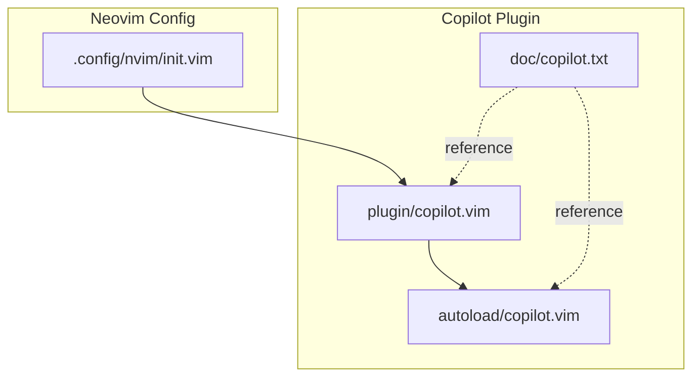
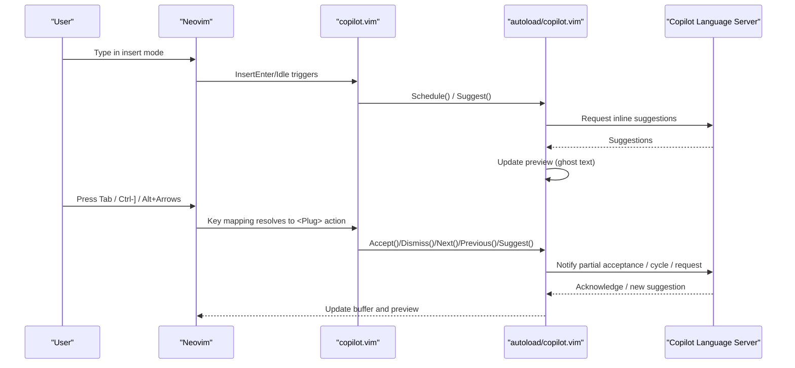
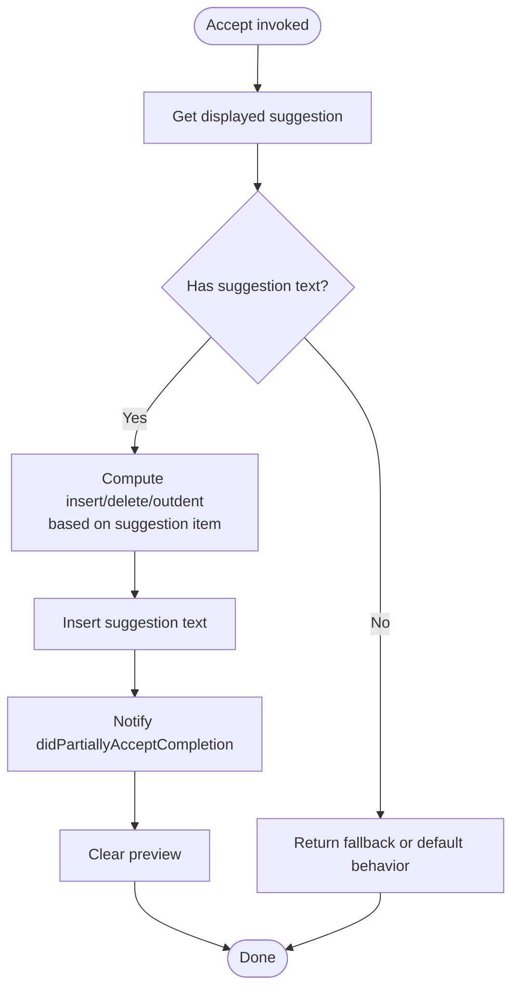
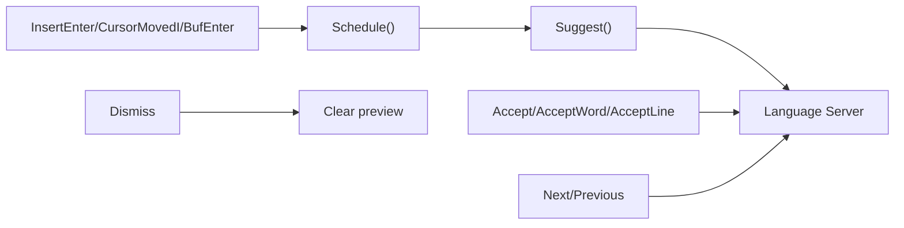

# Copilot Key Mappings and Commands

<cite>
**Referenced Files in This Document**
- [copilot.vim](file://.local/share/nvim/plugged/copilot.vim/plugin/copilot.vim)
- [copilot.txt](file://.local/share/nvim/plugged/copilot.vim/doc/copilot.txt)
- [autoload/copilot.vim](file://.local/share/nvim/plugged/copilot.vim/autoload/copilot.vim)
- [init.vim](file://.config/nvim/init.vim)
</cite>

## Table of Contents
1. [Introduction](#introduction)
2. [Project Structure](#project-structure)
3. [Core Components](#core-components)
4. [Architecture Overview](#architecture-overview)
5. [Detailed Component Analysis](#detailed-component-analysis)
6. [Dependency Analysis](#dependency-analysis)
7. [Performance Considerations](#performance-considerations)
8. [Troubleshooting Guide](#troubleshooting-guide)
9. [Conclusion](#conclusion)

## Introduction
This document explains Copilot key mappings and commands in Neovim as implemented by the official copilot.vim plugin. It covers built-in keyboard shortcuts, command palette integration, custom mapping configuration, and conflict resolution with existing key bindings. Practical commands such as Accept Word and Accept Line are explained alongside navigation controls and advanced Meta-based features. Best practices for efficient AI-assisted coding workflows are included, along with customization tips for different development styles.

## Project Structure
The Copilot integration in this repository centers on the copilot.vim plugin installed via vim-plug. The relevant files are:
- Plugin loader and key mappings: plugin/copilot.vim
- Help documentation and key mapping reference: doc/copilot.txt
- Core runtime functions (commands, acceptance logic, cycling): autoload/copilot.vim
- Neovim configuration (plugin loading and general editor settings): .config/nvim/init.vim

**Diagram sources**
- [copilot.vim](file://.local/share/nvim/plugged/copilot.vim/plugin/copilot.vim#L1-L115)
- [copilot.txt](file://.local/share/nvim/plugged/copilot.vim/doc/copilot.txt#L1-L229)
- [autoload/copilot.vim](file://.local/share/nvim/plugged/copilot.vim/autoload/copilot.vim#L1-L120)
- [init.vim](file://.config/nvim/init.vim#L137-L161)

**Section sources**
- [copilot.vim](file://.local/share/nvim/plugged/copilot.vim/plugin/copilot.vim#L1-L115)
- [copilot.txt](file://.local/share/nvim/plugged/copilot.vim/doc/copilot.txt#L1-L229)
- [autoload/copilot.vim](file://.local/share/nvim/plugged/copilot.vim/autoload/copilot.vim#L1-L120)
- [init.vim](file://.config/nvim/init.vim#L137-L161)

## Core Components
- Built-in key mappings in insert mode:
  - Tab: Accept current suggestion
  - Ctrl-]: Dismiss current suggestion
  - Alt-]: Next suggestion
  - Alt-[: Previous suggestion
  - Alt-\: Explicitly request a suggestion
  - Alt-Right: Accept next word
  - Alt-Ctrl-Right: Accept next line
- Command palette integration:
  - :Copilot command family supports setup, status, panel, model selection, version, and restart.
- Acceptance and navigation functions:
  - copilot#Accept(), copilot#AcceptWord(), copilot#AcceptLine(), copilot#Next(), copilot#Previous(), copilot#Suggest(), copilot#Dismiss()

Practical usage examples and customization are documented in the plugin’s help and autoload functions.

**Section sources**
- [copilot.vim](file://.local/share/nvim/plugged/copilot.vim/plugin/copilot.vim#L73-L109)
- [copilot.txt](file://.local/share/nvim/plugged/copilot.vim/doc/copilot.txt#L140-L204)
- [autoload/copilot.vim](file://.local/share/nvim/plugged/copilot.vim/autoload/copilot.vim#L483-L537)

## Architecture Overview
The Copilot plugin sets up key mappings and commands during initialization. It integrates with Neovim/Vim insert-mode events and uses a language server client to fetch and render inline suggestions. Acceptance and navigation functions coordinate with the language server and update ghost text previews.

**Diagram sources**
- [copilot.vim](file://.local/share/nvim/plugged/copilot.vim/plugin/copilot.vim#L53-L69)
- [autoload/copilot.vim](file://.local/share/nvim/plugged/copilot.vim/autoload/copilot.vim#L412-L421)
- [autoload/copilot.vim](file://.local/share/nvim/plugged/copilot.vim/autoload/copilot.vim#L391-L401)
- [autoload/copilot.vim](file://.local/share/nvim/plugged/copilot.vim/autoload/copilot.vim#L483-L537)

## Detailed Component Analysis

### Built-in Key Mappings and Behavior
- Tab: Accepts the current suggestion. If Tab is already mapped for completion, the existing mapping acts as fallback when no suggestion is displayed.
- Ctrl-]: Dismisses the current suggestion and optionally invokes the original mapping if present.
- Alt-]: Cycles to the next suggestion.
- Alt-[: Cycles to the previous suggestion.
- Alt-\: Requests a suggestion explicitly, even if suggestions are otherwise disabled.
- Alt-Right: Accepts the next word of the current suggestion.
- Alt-Ctrl-Right: Accepts the next line of the current suggestion.

These mappings are registered conditionally and avoid overriding existing user maps unless intentionally configured.

**Section sources**
- [copilot.vim](file://.local/share/nvim/plugged/copilot.vim/plugin/copilot.vim#L73-L109)
- [copilot.txt](file://.local/share/nvim/plugged/copilot.vim/doc/copilot.txt#L140-L204)

### Acceptance Functions: Accept, AcceptWord, AcceptLine
- copilot#Accept(): Inserts the suggested text, handles deletions for inlay adjustments, and supports a fallback for when no suggestion is displayed.
- copilot#AcceptWord(): Accepts the next word fragment based on a regex boundary.
- copilot#AcceptLine(): Accepts the next line fragment based on newline boundaries.

These functions compute the appropriate text to insert, adjust for indentation and deletions, and notify the language server of partial acceptance.

**Diagram sources**
- [autoload/copilot.vim](file://.local/share/nvim/plugged/copilot.vim/autoload/copilot.vim#L483-L537)

**Section sources**
- [autoload/copilot.vim](file://.local/share/nvim/plugged/copilot.vim/autoload/copilot.vim#L483-L537)

### Navigation and Cycling: Next, Previous, Suggest, Dismiss
- copilot#Next() / copilot#Previous(): Cycle through multiple suggestions for the current position.
- copilot#Suggest(): Explicitly request a suggestion.
- copilot#Dismiss(): Clear the current suggestion and preview.

These functions coordinate with the language server and update the ghost text preview accordingly.

**Section sources**
- [autoload/copilot.vim](file://.local/share/nvim/plugged/copilot.vim/autoload/copilot.vim#L278-L284)
- [autoload/copilot.vim](file://.local/share/nvim/plugged/copilot.vim/autoload/copilot.vim#L391-L401)
- [autoload/copilot.vim](file://.local/share/nvim/plugged/copilot.vim/autoload/copilot.vim#L107-L111)

### Command Palette Integration
The :Copilot command routes to internal handlers for setup, status, panel, model selection, version, restart, and logging. It also supports dynamic completion of subcommands.

Key behaviors:
- :Copilot setup: Initiates authentication flow and opens the browser if needed.
- :Copilot status: Reports readiness and any configuration warnings or errors.
- :Copilot panel: Opens a window with up to 10 completions for the current buffer.
- :Copilot model: Interactively selects a completion model when multiple are available.
- :Copilot version: Prints plugin/editor/language server versions.
- :Copilot restart: Restarts the language server.
- :Copilot disable/enable: Global toggles for Copilot.

**Section sources**
- [autoload/copilot.vim](file://.local/share/nvim/plugged/copilot.vim/autoload/copilot.vim#L825-L859)
- [autoload/copilot.vim](file://.local/share/nvim/plugged/copilot.vim/autoload/copilot.vim#L606-L624)
- [autoload/copilot.vim](file://.local/share/nvim/plugged/copilot.vim/autoload/copilot.vim#L770-L774)
- [autoload/copilot.vim](file://.local/share/nvim/plugged/copilot.vim/autoload/copilot.vim#L780-L809)
- [autoload/copilot.vim](file://.local/share/nvim/plugged/copilot.vim/autoload/copilot.vim#L729-L733)
- [copilot.txt](file://.local/share/nvim/plugged/copilot.vim/doc/copilot.txt#L11-L50)

### Custom Mapping Configuration and Conflict Resolution
- Disable default Tab mapping and use a custom key (for example, Ctrl-J) by setting a flag and mapping an expression to copilot#Accept().
- Preserve existing Tab behavior by passing a fallback to copilot#Accept().
- Map Meta-based actions to different keys if your terminal does not support Meta sequences.
- The plugin checks for existing maps and avoids overriding unless the map is unrelated to Copilot.

Examples and guidance are documented in the plugin help.

**Section sources**
- [copilot.vim](file://.local/share/nvim/plugged/copilot.vim/plugin/copilot.vim#L23-L43)
- [copilot.txt](file://.local/share/nvim/plugged/copilot.vim/doc/copilot.txt#L140-L179)

### Terminal Compatibility Notes
Meta-based mappings (Alt-Right, Alt-Ctrl-Right, etc.) depend on terminal support. The plugin documents that Meta maps are terminal-dependent and suggests using custom maps that invoke the <Plug> actions instead.

**Section sources**
- [copilot.txt](file://.local/share/nvim/plugged/copilot.vim/doc/copilot.txt#L166-L179)
- [copilot.vim](file://.local/share/nvim/plugged/copilot.vim/plugin/copilot.vim#L83-L108)

## Dependency Analysis
The Copilot plugin depends on:
- Neovim/Vim insert-mode events and autocmds to trigger suggestion requests and updates.
- The Copilot language server for suggestions and command execution.
- The runtime module for scheduling, preview updates, and acceptance logic.

**Diagram sources**
- [copilot.vim](file://.local/share/nvim/plugged/copilot.vim/plugin/copilot.vim#L53-L69)
- [autoload/copilot.vim](file://.local/share/nvim/plugged/copilot.vim/autoload/copilot.vim#L412-L421)
- [autoload/copilot.vim](file://.local/share/nvim/plugged/copilot.vim/autoload/copilot.vim#L391-L401)
- [autoload/copilot.vim](file://.local/share/nvim/plugged/copilot.vim/autoload/copilot.vim#L483-L537)
- [autoload/copilot.vim](file://.local/share/nvim/plugged/copilot.vim/autoload/copilot.vim#L278-L284)
- [autoload/copilot.vim](file://.local/share/nvim/plugged/copilot.vim/autoload/copilot.vim#L107-L111)

**Section sources**
- [copilot.vim](file://.local/share/nvim/plugged/copilot.vim/plugin/copilot.vim#L53-L69)
- [autoload/copilot.vim](file://.local/share/nvim/plugged/copilot.vim/autoload/copilot.vim#L412-L421)
- [autoload/copilot.vim](file://.local/share/nvim/plugged/copilot.vim/autoload/copilot.vim#L391-L401)
- [autoload/copilot.vim](file://.local/share/nvim/plugged/copilot.vim/autoload/copilot.vim#L483-L537)
- [autoload/copilot.vim](file://.local/share/nvim/plugged/copilot.vim/autoload/copilot.vim#L278-L284)
- [autoload/copilot.vim](file://.local/share/nvim/plugged/copilot.vim/autoload/copilot.vim#L107-L111)

## Performance Considerations
- Suggestions are requested after an idle delay and only when ghost text is supported and Copilot is enabled.
- The plugin clears previews and cancels pending requests when leaving insert mode or when completion menus are visible, reducing unnecessary work.
- Buffer-level and global toggles allow disabling Copilot for specific buffers or file types to reduce overhead.

**Section sources**
- [autoload/copilot.vim](file://.local/share/nvim/plugged/copilot.vim/autoload/copilot.vim#L412-L421)
- [autoload/copilot.vim](file://.local/share/nvim/plugged/copilot.vim/autoload/copilot.vim#L448-L463)
- [autoload/copilot.vim](file://.local/share/nvim/plugged/copilot.vim/autoload/copilot.vim#L113-L145)

## Troubleshooting Guide
- If suggestions do not appear, use :Copilot status to check readiness and any warnings or errors.
- If authentication is required, use :Copilot setup to initiate the sign-in flow.
- If Meta keys do not work, configure custom maps to invoke the <Plug> actions instead.
- To disable Copilot globally or per buffer, use :Copilot disable or set buffer-local options.
- To change the completion model, use :Copilot model to select among available options.

**Section sources**
- [autoload/copilot.vim](file://.local/share/nvim/plugged/copilot.vim/autoload/copilot.vim#L606-L624)
- [autoload/copilot.vim](file://.local/share/nvim/plugged/copilot.vim/autoload/copilot.vim#L631-L684)
- [copilot.txt](file://.local/share/nvim/plugged/copilot.vim/doc/copilot.txt#L11-L50)

## Conclusion
The copilot.vim plugin provides a comprehensive set of key mappings and commands for efficient AI-assisted editing in Neovim. With built-in acceptance, navigation, and explicit suggestion controls, plus a robust command palette, it integrates seamlessly into daily workflows. Customization options allow adapting to different terminals and preferences, while built-in conflict resolution preserves existing key bindings. Use the provided commands and mappings to streamline coding tasks and tailor Copilot to your development style.