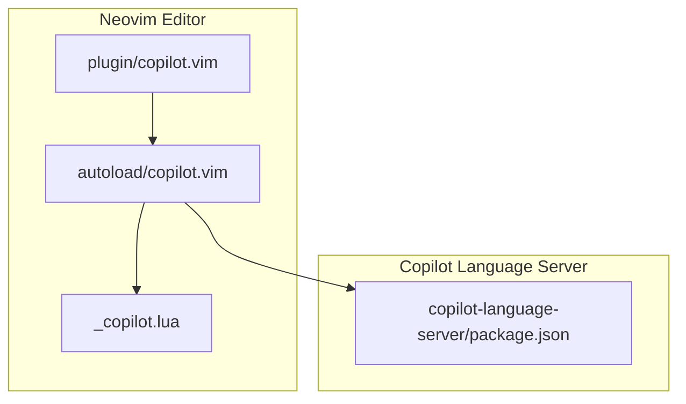
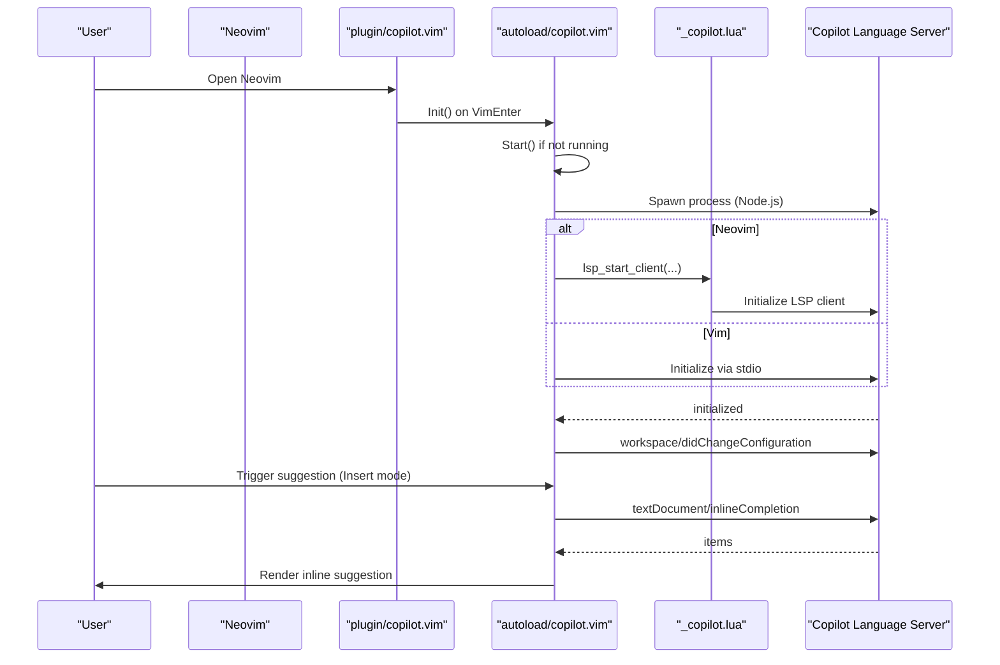
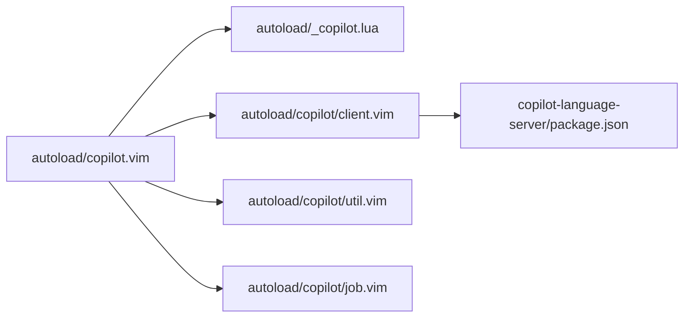

# Copilot Plugin Setup

<cite>
**Referenced Files in This Document**
- [plugin/copilot.vim](file://.local/share/nvim/plugged/copilot.vim/plugin/copilot.vim)
- [autoload/copilot.vim](file://.local/share/nvim/plugged/copilot.vim/autoload/copilot.vim)
- [autoload/copilot/client.vim](file://.local/share/nvim/plugged/copilot.vim/autoload/copilot/client.vim)
- [autoload/_copilot.lua](file://.local/share/nvim/plugged/copilot.vim/lua/_copilot.lua)
- [doc/copilot.txt](file://.local/share/nvim/plugged/copilot.vim/doc/copilot.txt)
- [copilot-language-server/package.json](file://.local/share/nvim/plugged/copilot.vim/copilot-language-server/package.json)
- [autoload/copilot/job.vim](file://.local/share/nvim/plugged/copilot.vim/autoload/copilot/job.vim)
- [autoload/copilot/util.vim](file://.local/share/nvim/plugged/copilot.vim/autoload/copilot/util.vim)
</cite>

## Table of Contents
1. [Introduction](#introduction)
2. [Project Structure](#project-structure)
3. [Core Components](#core-components)
4. [Architecture Overview](#architecture-overview)
5. [Detailed Component Analysis](#detailed-component-analysis)
6. [Dependency Analysis](#dependency-analysis)
7. [Performance Considerations](#performance-considerations)
8. [Troubleshooting Guide](#troubleshooting-guide)
9. [Conclusion](#conclusion)
10. [Appendices](#appendices)

## Introduction
This document explains how to set up and configure the GitHub Copilot plugin for Neovim. It covers plugin initialization, authentication with GitHub, configuration of the Copilot language server, client-server architecture, network and proxy settings, installation and loading order, and practical troubleshooting. It also documents the available commands, key mappings, and how Copilot integrates with Neovim’s completion system.

## Project Structure
The Copilot plugin for Neovim is organized into:
- A plugin loader that registers commands, autocommands, and key mappings
- An autoload layer implementing the core runtime logic and integration with Neovim’s LSP client
- A Lua bridge for Neovim LSP client management
- A bundled Copilot language server distribution
- Documentation and help topics

**Diagram sources**
- [plugin/copilot.vim](file://.local/share/nvim/plugged/copilot.vim/plugin/copilot.vim#L1-L115)
- [autoload/copilot.vim](file://.local/share/nvim/plugged/copilot.vim/autoload/copilot.vim#L1-L120)
- [autoload/_copilot.lua](file://.local/share/nvim/plugged/copilot.vim/lua/_copilot.lua#L1-L105)
- [copilot-language-server/package.json](file://.local/share/nvim/plugged/copilot.vim/copilot-language-server/package.json#L1-L49)

**Section sources**
- [plugin/copilot.vim](file://.local/share/nvim/plugged/copilot.vim/plugin/copilot.vim#L1-L115)
- [doc/copilot.txt](file://.local/share/nvim/plugged/copilot.vim/doc/copilot.txt#L1-L229)

## Core Components
- Plugin loader: Registers commands, autocommands, color scheme, and key mappings; initializes on VimEnter.
- Autoload runtime: Implements suggestion engine, completion pipeline, buffer lifecycle, and command dispatch.
- Lua bridge: Starts/stops Neovim LSP client, forwards requests, and handles handlers.
- Language server: Bundled distribution packaged as a Node.js app with platform-specific binaries.

Key responsibilities:
- Initialization and startup of the language server
- Inline suggestion display and acceptance
- Authentication via sign-in/sign-out
- Workspace and configuration propagation
- Logging and diagnostics

**Section sources**
- [plugin/copilot.vim](file://.local/share/nvim/plugged/copilot.vim/plugin/copilot.vim#L1-L115)
- [autoload/copilot.vim](file://.local/share/nvim/plugged/copilot.vim/autoload/copilot.vim#L26-L88)
- [autoload/_copilot.lua](file://.local/share/nvim/plugged/copilot.vim/lua/_copilot.lua#L12-L53)
- [copilot-language-server/package.json](file://.local/share/nvim/plugged/copilot.vim/copilot-language-server/package.json#L1-L49)

## Architecture Overview
The plugin runs a Copilot language server process and communicates with it via stdin/stdout (Vim) or Neovim’s LSP client (Neovim). The server exposes an LSP interface for inline completions and status notifications.

**Diagram sources**
- [plugin/copilot.vim](file://.local/share/nvim/plugged/copilot.vim/plugin/copilot.vim#L63-L69)
- [autoload/copilot.vim](file://.local/share/nvim/plugged/copilot.vim/autoload/copilot.vim#L26-L51)
- [autoload/_copilot.lua](file://.local/share/nvim/plugged/copilot.vim/lua/_copilot.lua#L12-L53)
- [autoload/copilot/client.vim](file://.local/share/nvim/plugged/copilot.vim/autoload/copilot/client.vim#L746-L798)

## Detailed Component Analysis

### Plugin Loader (plugin/copilot.vim)
- Registers the :Copilot command and completion
- Sets up autocommands for buffer and insert mode events
- Defines color scheme and highlight groups for suggestions
- Creates key mappings for dismissal, cycling, requesting suggestions, and accepting words/lines
- Initializes on VimEnter and sets up tab mapping behavior

Key behaviors:
- Event-driven lifecycle: InsertEnter, InsertLeavePre, BufEnter, BufLeave, CursorMovedI, CompleteChanged
- Conditional mapping: Respects existing <Tab> mappings and falls back appropriately
- Help tags generation for documentation

**Section sources**
- [plugin/copilot.vim](file://.local/share/nvim/plugged/copilot.vim/plugin/copilot.vim#L8-L115)

### Autoload Runtime (autoload/copilot.vim)
- Provides public APIs: Init, Request, Call, Notify, Enabled, Complete, Accept, Suggest, Next, Previous, Clear, Browser
- Manages suggestion lifecycle: schedules idle triggers, updates preview, cancels pending requests
- Implements command dispatch: :Copilot setup, status, signout, version, upgrade, model, panel, disable, enable
- Handles buffer enable/disable logic and file type filtering
- Integrates with Neovim/Vim completion and ghost text

Highlights:
- Completion pipeline: textDocument/inlineCompletion with automatic and explicit triggers
- Preview rendering: overlay virtual text (Neovim) or text properties (Vim)
- Status reporting and warnings for editor compatibility

**Section sources**
- [autoload/copilot.vim](file://.local/share/nvim/plugged/copilot.vim/autoload/copilot.vim#L26-L187)
- [autoload/copilot.vim](file://.local/share/nvim/plugged/copilot.vim/autoload/copilot.vim#L391-L481)
- [autoload/copilot.vim](file://.local/share/nvim/plugged/copilot.vim/autoload/copilot.vim#L562-L727)

### Lua Bridge (autoload/_copilot.lua)
- Bridges Neovim LSP client to the plugin:
  - lsp_start_client: starts LSP client, sets handlers, on_init/on_exit callbacks
  - lsp_request/rpc_request/rpc_notify: wraps Neovim LSP request/notification
  - did_change_configuration: updates LSP settings
- Delegates window/showDocument to plugin handlers when appropriate

**Section sources**
- [autoload/_copilot.lua](file://.local/share/nvim/plugged/copilot.vim/lua/_copilot.lua#L12-L102)

### Language Server Client (autoload/copilot/client.vim)
- Determines command to launch the server (npx, embedded, or custom)
- Builds initialization options (editor info, plugin info, optional integration ID)
- Configures workspace folders and settings (HTTP proxy, strict SSL, enterprise URI, custom settings)
- Spawns process and manages lifecycle:
  - Vim: stdio job with callbacks for messages, errors, and exit
  - Neovim: delegates to Lua bridge for LSP client
- Handles progress/status notifications and configuration changes

Important settings:
- g:copilot_version controls server version resolution
- g:copilot_node_command selects Node.js binary
- g:copilot_proxy and g:copilot_proxy_strict_ssl control HTTP behavior
- g:copilot_enterprise_uri enables GitHub Enterprise
- g:copilot_workspace_folders defines workspace roots

**Section sources**
- [autoload/copilot/client.vim](file://.local/share/nvim/plugged/copilot.vim/autoload/copilot/client.vim#L514-L568)
- [autoload/copilot/client.vim](file://.local/share/nvim/plugged/copilot.vim/autoload/copilot/client.vim#L589-L606)
- [autoload/copilot/client.vim](file://.local/share/nvim/plugged/copilot.vim/autoload/copilot/client.vim#L684-L798)

### Language Server Distribution (copilot-language-server/package.json)
- Declares the packaged language server and its Node.js dependencies
- Includes platform-specific optional binaries for Windows/macOS/Linux
- Exposes main entrypoint and TypeScript types

**Section sources**
- [copilot-language-server/package.json](file://.local/share/nvim/plugged/copilot.vim/copilot-language-server/package.json#L1-L49)

### Utilities (autoload/copilot/util.vim)
- UTF-16 width and index conversions for accurate cursor positioning
- Deferred execution to avoid blocking the event loop

**Section sources**
- [autoload/copilot/util.vim](file://.local/share/nvim/plugged/copilot.vim/autoload/copilot/util.vim#L21-L61)

### Job Management (autoload/copilot/job.vim)
- Cross-editor job launching and waiting
- Stream handling for stdout/stderr and exit callbacks

**Section sources**
- [autoload/copilot/job.vim](file://.local/share/nvim/plugged/copilot.vim/autoload/copilot/job.vim#L68-L107)

## Dependency Analysis
- Vim/Neovim integration:
  - Vim uses stdio job communication with callbacks for messages and exit
  - Neovim uses built-in LSP client via the Lua bridge
- Language server selection:
  - Uses npx with version constraints or embedded distribution
  - Falls back to custom Node.js path if configured
- Settings propagation:
  - HTTP proxy and SSL strictness, enterprise URI, and custom settings are forwarded to the server

**Diagram sources**
- [autoload/copilot.vim](file://.local/share/nvim/plugged/copilot.vim/autoload/copilot.vim#L1-L120)
- [autoload/_copilot.lua](file://.local/share/nvim/plugged/copilot.vim/lua/_copilot.lua#L1-L105)
- [autoload/copilot/client.vim](file://.local/share/nvim/plugged/copilot.vim/autoload/copilot/client.vim#L684-L798)
- [copilot-language-server/package.json](file://.local/share/nvim/plugged/copilot.vim/copilot-language-server/package.json#L1-L49)

**Section sources**
- [autoload/copilot/client.vim](file://.local/share/nvim/plugged/copilot.vim/autoload/copilot/client.vim#L589-L606)
- [autoload/_copilot.lua](file://.local/share/nvim/plugged/copilot.vim/lua/_copilot.lua#L12-L53)

## Performance Considerations
- Idle suggestion delay: Controlled by a configurable delay; reduces unnecessary requests during typing.
- Ghost text rendering: Uses overlay virtual text (Neovim) or text properties (Vim) to minimize redraw overhead.
- Request cancellation: Pending requests are canceled when moving cursor or switching buffers.
- Deferred execution: Non-blocking scheduling prevents UI stalls.

Recommendations:
- Keep g:copilot_idle_delay at a reasonable value to balance responsiveness and performance.
- Disable file types selectively via g:copilot_filetypes to reduce noise.
- Ensure a compatible Node.js version is selected via g:copilot_node_command.

**Section sources**
- [autoload/copilot.vim](file://.local/share/nvim/plugged/copilot.vim/autoload/copilot.vim#L412-L421)
- [autoload/copilot.vim](file://.local/share/nvim/plugged/copilot.vim/autoload/copilot.vim#L297-L304)
- [autoload/copilot/util.vim](file://.local/share/nvim/plugged/copilot.vim/autoload/copilot/util.vim#L7-L19)

## Troubleshooting Guide

Common issues and resolutions:
- Authentication failures:
  - Use :Copilot setup to sign in; the plugin prints a one-time code and opens the verification URL. If the browser does not open, follow the prompt or use the bang variant to skip auto-opening.
  - After successful sign-in, the plugin reports the authenticated user.
- Language server startup errors:
  - Check :Copilot status for startup errors. Common causes include missing Node.js, incompatible Node version, or inability to spawn the process.
  - Verify g:copilot_node_command points to a supported Node.js binary.
  - If using npx, ensure network access or pin g:copilot_version to a fixed value.
- Proxy and SSL problems:
  - Configure g:copilot_proxy and optionally g:copilot_proxy_strict_ssl. The plugin forwards these settings to the server.
  - For corporate environments with MITM certificates, disabling strict SSL may be necessary.
- Suggestions not appearing:
  - Ensure the buffer is not disabled by file type or buffer-local flags.
  - Use :Copilot status to confirm readiness and check for warnings.
  - Try :Copilot suggest to explicitly request a suggestion.
- Network connectivity:
  - The server requires outbound HTTPS access to GitHub Copilot endpoints. Configure proxy settings accordingly.
- Performance issues:
  - Reduce suggestion frequency by increasing g:copilot_idle_delay.
  - Disable Copilot globally with :Copilot disable or per-buffer with b:copilot_enabled.

**Section sources**
- [autoload/copilot.vim](file://.local/share/nvim/plugged/copilot.vim/autoload/copilot.vim#L626-L684)
- [autoload/copilot.vim](file://.local/share/nvim/plugged/copilot.vim/autoload/copilot.vim#L591-L624)
- [autoload/copilot/client.vim](file://.local/share/nvim/plugged/copilot.vim/autoload/copilot/client.vim#L395-L398)
- [doc/copilot.txt](file://.local/share/nvim/plugged/copilot.vim/doc/copilot.txt#L107-L127)

## Conclusion
The Copilot plugin for Neovim integrates seamlessly with both Vim and Neovim through a robust client-server architecture. With proper configuration—authentication, proxy, and Node.js selection—you can enjoy inline completions powered by the Copilot language server. Use the documented commands and mappings to manage suggestions and troubleshoot common issues.

## Appendices

### Installation and Loading Sequence
- Install the plugin into your Neovim plugin directory (already present under .local/share/nvim/plugged/copilot.vim).
- On VimEnter, the plugin loader initializes the runtime and registers key mappings and autocommands.
- The first trigger in insert mode starts the language server and requests suggestions.

**Section sources**
- [plugin/copilot.vim](file://.local/share/nvim/plugged/copilot.vim/plugin/copilot.vim#L63-L69)

### Authentication Procedures
- :Copilot setup initiates sign-in, prints a one-time user code, and optionally opens the browser to the verification URL.
- :Copilot signout signs out the current user.
- :Copilot status checks readiness and displays warnings or errors.

**Section sources**
- [autoload/copilot.vim](file://.local/share/nvim/plugged/copilot.vim/autoload/copilot.vim#L626-L684)
- [doc/copilot.txt](file://.local/share/nvim/plugged/copilot.vim/doc/copilot.txt#L19-L27)

### API Key and Enterprise Configuration
- The plugin authenticates via GitHub accounts using the sign-in flow. There is no separate API key configuration in this plugin.
- For GitHub Enterprise, set g:copilot_enterprise_uri to your enterprise domain.

**Section sources**
- [autoload/copilot/client.vim](file://.local/share/nvim/plugged/copilot.vim/autoload/copilot/client.vim#L589-L606)
- [doc/copilot.txt](file://.local/share/nvim/plugged/copilot.vim/doc/copilot.txt#L100-L106)

### Client-Server Architecture and Network Connectivity
- Vim: stdio-based communication with the language server process
- Neovim: LSP client managed via the Lua bridge
- Proxy and SSL: Controlled via g:copilot_proxy and g:copilot_proxy_strict_ssl; enterprise via g:copilot_enterprise_uri

**Section sources**
- [autoload/_copilot.lua](file://.local/share/nvim/plugged/copilot.vim/lua/_copilot.lua#L12-L53)
- [autoload/copilot/client.vim](file://.local/share/nvim/plugged/copilot.vim/autoload/copilot/client.vim#L589-L606)

### Proxy Configuration Options
- g:copilot_proxy: HTTP proxy URL (plugin ensures it includes a scheme if omitted)
- g:copilot_proxy_strict_ssl: Disable strict SSL verification for corporate proxies

**Section sources**
- [autoload/copilot/client.vim](file://.local/share/nvim/plugged/copilot.vim/autoload/copilot/client.vim#L589-L606)
- [doc/copilot.txt](file://.local/share/nvim/plugged/copilot.vim/doc/copilot.txt#L107-L127)

### Installation and Dependency Management
- The plugin bundles a distribution of the Copilot language server.
- Version control: g:copilot_version supports constraints and “latest”; defaults to a minor-version constraint.
- Node.js selection: g:copilot_node_command can override the Node binary used to start the server.

**Section sources**
- [copilot-language-server/package.json](file://.local/share/nvim/plugged/copilot.vim/copilot-language-server/package.json#L1-L49)
- [autoload/copilot/client.vim](file://.local/share/nvim/plugged/copilot.vim/autoload/copilot/client.vim#L516-L568)
- [doc/copilot.txt](file://.local/share/nvim/plugged/copilot.vim/doc/copilot.txt#L53-L68)

### Commands and Key Mappings
- Commands:
  - :Copilot setup, signout, status, version, upgrade, model, panel, disable, enable
- Key mappings (insert mode):
  - <C-]> Dismiss suggestion
  - <M-]> Next suggestion
  - <M-[> Previous suggestion
  - <M-\> Explicitly request suggestion
  - <M-Right> Accept next word
  - <M-C-Right> Accept next line
  - <Tab> Accept current suggestion (with fallback behavior)

**Section sources**
- [doc/copilot.txt](file://.local/share/nvim/plugged/copilot.vim/doc/copilot.txt#L11-L50)
- [plugin/copilot.vim](file://.local/share/nvim/plugged/copilot.vim/plugin/copilot.vim#L73-L109)

### Integration with Neovim Completion System
- Inline completions are requested via textDocument/inlineCompletion and rendered as ghost text (virtual text or text properties).
- The plugin integrates with Neovim’s LSP client when available, forwarding requests and responses.

**Section sources**
- [autoload/copilot.vim](file://.local/share/nvim/plugged/copilot.vim/autoload/copilot.vim#L155-L187)
- [autoload/_copilot.lua](file://.local/share/nvim/plugged/copilot.vim/lua/_copilot.lua#L55-L93)