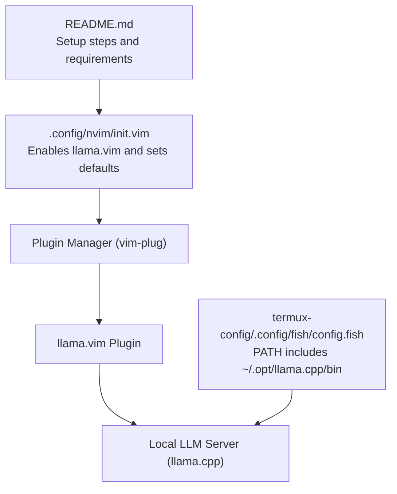
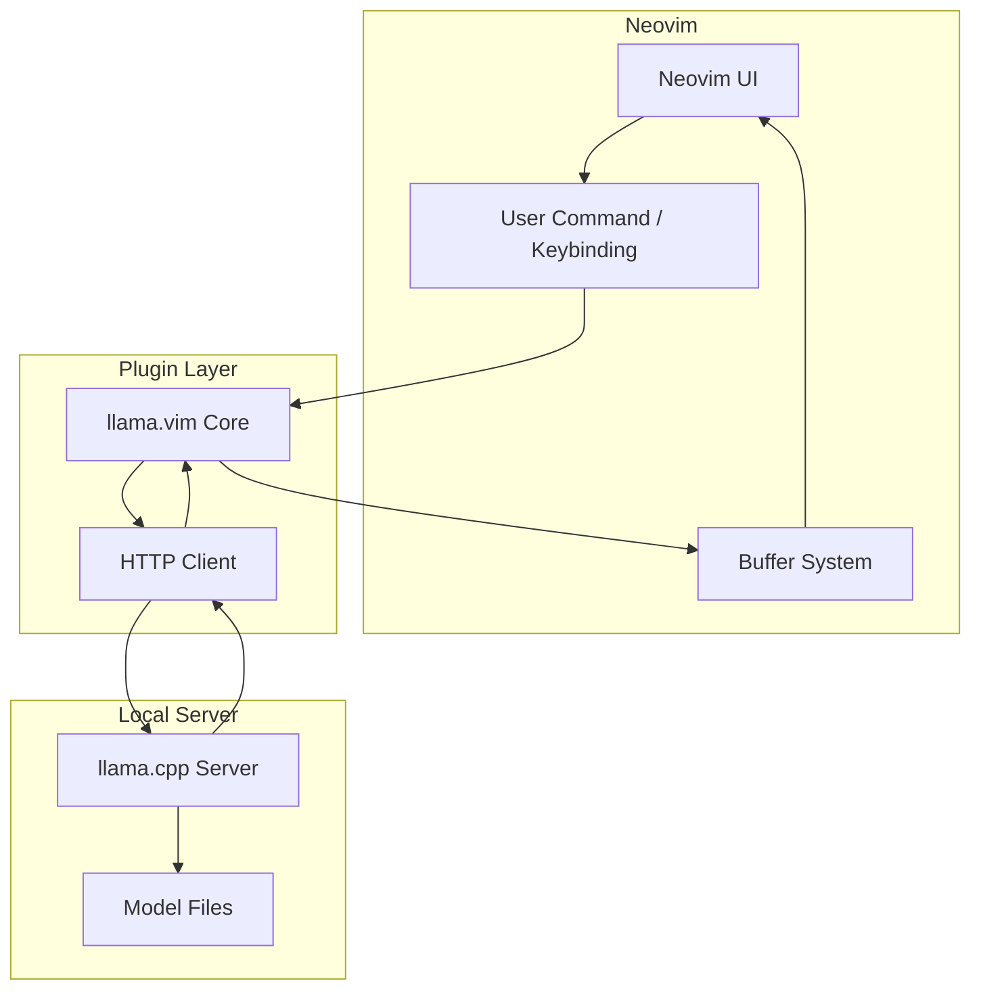
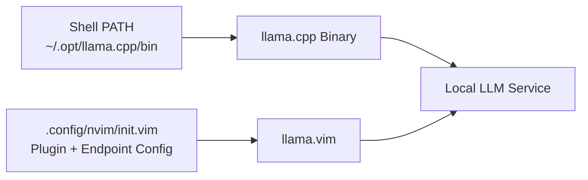

# Local LLM Setup

<cite>
**Referenced Files in This Document**
- [init.vim](file://.config/nvim/init.vim)
- [config.fish](file://termux-config/.config/fish/config.fish)
- [README.md](file://README.md)
</cite>

## Table of Contents
1. [Introduction](#introduction)
2. [Project Structure](#project-structure)
3. [Core Components](#core-components)
4. [Architecture Overview](#architecture-overview)
5. [Detailed Component Analysis](#detailed-component-analysis)
6. [Dependency Analysis](#dependency-analysis)
7. [Performance Considerations](#performance-considerations)
8. [Troubleshooting Guide](#troubleshooting-guide)
9. [Conclusion](#conclusion)
10. [Appendices](#appendices)

## Introduction
This document explains how to set up and integrate a local Large Language Model (LLM) using the llama.vim plugin within Neovim. It covers server prerequisites, endpoint configuration, model selection, and performance tuning. It also documents the plugin’s architecture for connecting to a local AI server via HTTP APIs and how it interacts with Neovim’s buffer system for real-time responses.

The repository enables the llama.vim plugin and references a local llama.cpp server installation path, indicating that a compatible local LLM server is expected to be running alongside Neovim.

**Section sources**
- file://.config/nvim/init.vim#L157-L158
- file://.config/nvim/init.vim#L344-L350
- file://termux-config/.config/fish/config.fish#L140-L152

## Project Structure
The relevant parts of the repository for local LLM integration are:
- Neovim configuration enabling the llama.vim plugin and conditional settings
- Shell configuration pointing to a local llama.cpp binary path
- General repository setup instructions

**Diagram sources**
- [init.vim](file://.config/nvim/init.vim#L137-L161)
- [init.vim](file://.config/nvim/init.vim#L344-L350)
- [config.fish](file://termux-config/.config/fish/config.fish#L140-L152)
- [README.md](file://README.md#L7-L14)

**Section sources**
- file://.config/nvim/init.vim#L137-L161
- file://.config/nvim/init.vim#L344-L350
- file://termux-config/.config/fish/config.fish#L140-L152
- file://README.md#L7-L14

## Core Components
- Neovim plugin configuration: The Neovim init file declares the llama.vim plugin and includes a commented note about endpoint configuration and a fallback default endpoint.
- Local server path: The Fish shell configuration adds a local llama.cpp installation directory to PATH, implying a local server binary is available.
- Setup prerequisites: The repository README outlines initial setup steps, including installing Neovim plugins.

Key configuration references:
- Plugin declaration and conditional block for llama.vim settings
- Endpoint comment referencing a default address and port
- PATH extension for llama.cpp binaries

**Section sources**
- file://.config/nvim/init.vim#L157-L158
- file://.config/nvim/init.vim#L344-L350
- file://termux-config/.config/fish/config.fish#L140-L152
- file://README.md#L7-L14

## Architecture Overview
The llama.vim plugin integrates with Neovim to send prompts to a local LLM server and stream responses back into Neovim buffers. The server is expected to expose an HTTP endpoint compatible with the plugin’s expectations.

**Diagram sources**
- [init.vim](file://.config/nvim/init.vim#L344-L350)
- [config.fish](file://termux-config/.config/fish/config.fish#L140-L152)

## Detailed Component Analysis

### Neovim Plugin Integration (llama.vim)
- Purpose: Bridges Neovim with a local LLM server to enable on-demand completions and infill-style editing.
- Activation: Declared via the plugin manager and guarded by a conditional block to avoid errors if the plugin is not present.
- Endpoint configuration: The configuration includes a commented note referencing a default endpoint address and port, indicating the plugin expects an HTTP endpoint for inference requests.

Behavioral implications:
- The plugin likely sends structured HTTP requests to the configured endpoint and streams responses back into Neovim buffers.
- The conditional block allows users to override defaults by defining global variables before the plugin initializes.

**Section sources**
- file://.config/nvim/init.vim#L157-L158
- file://.config/nvim/init.vim#L344-L350

### Local Server Path and Model Availability
- The Fish shell configuration prepends a local llama.cpp binary path to PATH, suggesting the server binary is installed locally.
- This setup implies that a compatible local LLM server (e.g., llama.cpp) is expected to be running and reachable by the plugin.

Operational notes:
- Ensure the server is started and listening on the configured endpoint before using the plugin.
- Model files referenced by the server should be placed according to the server’s expectations.

**Section sources**
- file://termux-config/.config/fish/config.fish#L140-L152

### Buffer System and Real-Time Responses
- The plugin streams responses back into Neovim buffers, enabling incremental updates during generation.
- Users can trigger actions via keybindings or commands defined by the plugin, which then communicate with the local server.

Note: The exact command names and keybindings are defined by the plugin itself and are not present in the repository snapshot.

**Section sources**
- file://.config/nvim/init.vim#L344-L350

## Dependency Analysis
The integration depends on:
- A local LLM server (llama.cpp) reachable via HTTP
- The llama.vim plugin loaded by Neovim
- Proper PATH configuration to locate the server binary

**Diagram sources**
- [config.fish](file://termux-config/.config/fish/config.fish#L140-L152)
- [init.vim](file://.config/nvim/init.vim#L157-L158)
- [init.vim](file://.config/nvim/init.vim#L344-L350)

**Section sources**
- file://termux-config/.config/fish/config.fish#L140-L152
- file://.config/nvim/init.vim#L157-L158
- file://.config/nvim/init.vim#L344-L350

## Performance Considerations
- Server-side model selection: Choose a model size appropriate for your hardware. Larger models require more memory and CPU/GPU resources.
- Endpoint configuration: Ensure the endpoint is reachable locally to minimize latency.
- Streaming behavior: The plugin streams responses; keep Neovim responsive by avoiding excessive redraws during long generations.
- Resource limits: Monitor memory and CPU usage when generating longer responses. Consider reducing generation parameters (e.g., max tokens) for constrained environments.

[No sources needed since this section provides general guidance]

## Troubleshooting Guide
Common issues and resolutions:

- Server not reachable
  - Symptom: Plugin reports connection failures or timeouts.
  - Action: Verify the local server is running and listening on the configured endpoint. Confirm the endpoint address and port match the plugin’s expectation.
  - Reference: The configuration includes a commented note about a default endpoint address and port.

- Model loading failures
  - Symptom: Server starts but fails to load the selected model.
  - Action: Ensure the model file exists and is readable by the server process. Check server logs for model path errors.

- Slow or blocked responses
  - Symptom: Generations take a long time or appear stuck.
  - Action: Reduce generation parameters (e.g., max tokens). Close other memory-intensive applications. Consider switching to a smaller model.

- Plugin not activating
  - Symptom: No commands or keybindings from the plugin are available.
  - Action: Confirm the plugin is installed and enabled. The Neovim configuration conditionally checks for the plugin directory before applying settings.

- PATH issues preventing server startup
  - Symptom: Cannot start the server or missing binaries.
  - Action: Ensure the local llama.cpp binary path is included in PATH. The Fish shell configuration demonstrates adding the path.

**Section sources**
- file://.config/nvim/init.vim#L344-L350
- file://termux-config/.config/fish/config.fish#L140-L152

## Conclusion
The repository enables the llama.vim plugin and references a local llama.cpp installation path, indicating a local LLM server is expected. The Neovim configuration declares the plugin and includes a commented note about endpoint configuration. To complete the setup, ensure the server is running and reachable, select an appropriate model, and tune performance parameters as needed. The plugin streams responses into Neovim buffers, enabling real-time interaction.

[No sources needed since this section summarizes without analyzing specific files]

## Appendices

### Setup Checklist
- Install Neovim plugins as outlined in the repository setup steps.
- Ensure the local llama.cpp server is installed and added to PATH.
- Start the server and confirm it listens on the expected endpoint.
- Configure the plugin endpoint in Neovim if overriding the default is desired.
- Test streaming responses in Neovim buffers.

**Section sources**
- file://README.md#L7-L14
- file://termux-config/.config/fish/config.fish#L140-L152
- file://.config/nvim/init.vim#L344-L350