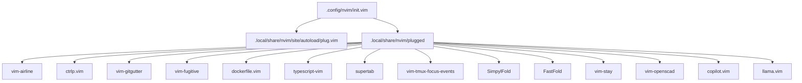
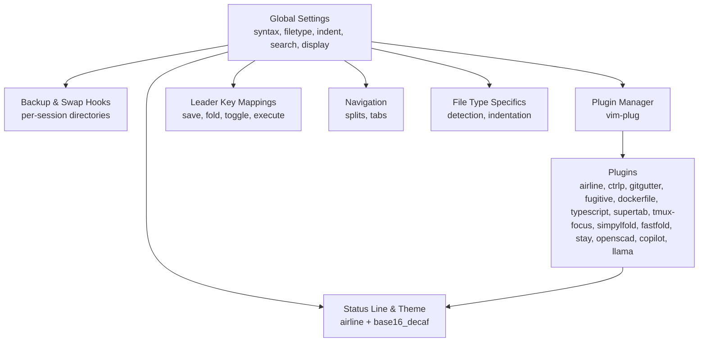
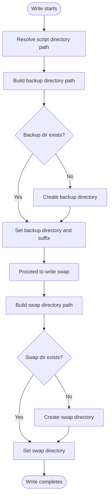
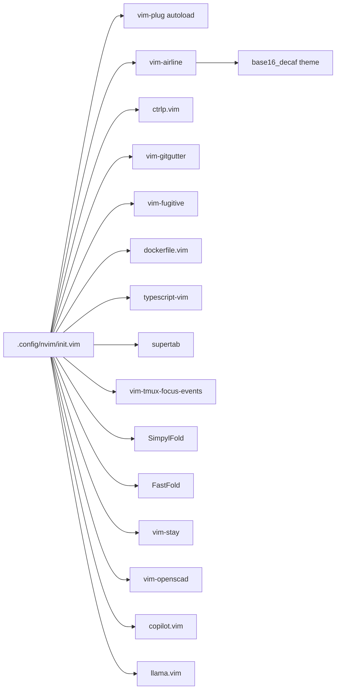

# Core Editor Configuration

<cite>
**Referenced Files in This Document**
- [init.vim](file://.config/nvim/init.vim)
- [airline.vim](file://.local/share/nvim/plugged/vim-airline/plugin/airline.vim)
- [ctrlp.vim](file://.local/share/nvim/plugged/ctrlp.vim/plugin/ctrlp.vim)
- [copilot.vim](file://.local/share/nvim/plugged/copilot.vim/plugin/copilot.vim)
- [base16_decaf.vim](file://.local/share/nvim/plugged/vim-airline-themes/autoload/airline/themes/base16_decaf.vim)
- [fastfold.vim](file://.local/share/nvim/plugged/FastFold/plugin/fastfold.vim)
- [SimpylFold.vim](file://.local/share/nvim/plugged/SimpylFold/plugin/SimpylFold.vim)
</cite>

## Table of Contents
1. [Introduction](#introduction)
2. [Project Structure](#project-structure)
3. [Core Components](#core-components)
4. [Architecture Overview](#architecture-overview)
5. [Detailed Component Analysis](#detailed-component-analysis)
6. [Dependency Analysis](#dependency-analysis)
7. [Performance Considerations](#performance-considerations)
8. [Troubleshooting Guide](#troubleshooting-guide)
9. [Conclusion](#conclusion)

## Introduction
This document explains the core Neovim configuration system implemented in the repository. It covers fundamental editor settings (syntax, file type detection, indentation, search, display), backup and swap management, plugin architecture via vim-plug, leader key mappings, split/tab navigation, status line customization, and practical integration patterns with external tools. The goal is to help both new and experienced users understand how the editor is configured and how to extend or troubleshoot it effectively.

## Project Structure
The Neovim configuration centers on a single initialization file that enables general settings, manages backups/swaps, loads plugins, defines leader-key mappings, and sets up file-type-specific behaviors. Plugins are installed under the Neovim site directory and are activated conditionally based on availability.

**Diagram sources**
- [.config/nvim/init.vim](file://.config/nvim/init.vim#L137-L161)
- [.local/share/nvim/site/autoload/plug.vim](file://.local/share/nvim/site/autoload/plug.vim)

**Section sources**
- [.config/nvim/init.vim](file://.config/nvim/init.vim#L1-L352)

## Core Components
This section outlines the primary configuration areas and their roles.

- General settings: enable syntax, file type detection, indentation, search, and display options.
- Backup and swap management: centralized directories and pre-write hooks to organize backups and swap files by editing session.
- Plugin management: vim-plug installation and configuration of popular plugins.
- Leader key mappings: productivity shortcuts for saving, folding, navigation, and toggles.
- Split and tab management: ergonomic navigation and tab controls.
- Status line customization: persistent status line and theme selection.
- File type specifics: tailored indentation and detection for various languages.

**Section sources**
- [.config/nvim/init.vim](file://.config/nvim/init.vim#L5-L83)
- [.config/nvim/init.vim](file://.config/nvim/init.vim#L86-L131)
- [.config/nvim/init.vim](file://.config/nvim/init.vim#L134-L169)
- [.config/nvim/init.vim](file://.config/nvim/init.vim#L171-L197)
- [.config/nvim/init.vim](file://.config/nvim/init.vim#L199-L265)

## Architecture Overview
The configuration follows a layered approach:
- Global editor behavior is set early to establish defaults for all sessions.
- Backup and swap hooks are attached to write events to keep data safe and organized.
- vim-plug initializes only when present, then loads optional plugins with their own settings.
- Leader key mappings and navigation shortcuts provide ergonomic workflows.
- Status line and theme are applied consistently across windows and modes.

**Diagram sources**
- [.config/nvim/init.vim](file://.config/nvim/init.vim#L5-L83)
- [.config/nvim/init.vim](file://.config/nvim/init.vim#L86-L131)
- [.config/nvim/init.vim](file://.config/nvim/init.vim#L134-L169)
- [.config/nvim/init.vim](file://.config/nvim/init.vim#L171-L197)
- [.config/nvim/init.vim](file://.config/nvim/init.vim#L199-L265)
- [.local/share/nvim/plugged/vim-airline/plugin/airline.vim](file://.local/share/nvim/plugged/vim-airline/plugin/airline.vim#L1-L321)
- [.local/share/nvim/plugged/vim-airline-themes/autoload/airline/themes/base16_decaf.vim](file://.local/share/nvim/plugged/vim-airline-themes/autoload/airline/themes/base16_decaf.vim#L1-L86)

## Detailed Component Analysis

### General Settings
Key behaviors enabled:
- Syntax highlighting, file type detection, and smart indentation.
- Search enhancements: incremental search, ignore-case with smart-case, and highlighted searches.
- Display options: line numbers, ruler, color column, list characters, and line break indicators.
- Scrolling and completion behavior aligned with “sensible” defaults.
- Folding defaults for common languages.

Practical implications:
- Improved readability with color column and list characters.
- Faster editing with smart indentation and incremental search.
- Reduced accidental overflows by limiting text width and showing breaks.

**Section sources**
- [.config/nvim/init.vim](file://.config/nvim/init.vim#L5-L53)

### Backup and Swap Management
Behavior:
- Centralized backup and swap directories under user home.
- Pre-write hooks compute per-file session paths and set backup and swap locations accordingly.
- Ensures daily-minute granularity for backups and organized swap storage.

Operational flow:

**Diagram sources**
- [.config/nvim/init.vim](file://.config/nvim/init.vim#L86-L131)

**Section sources**
- [.config/nvim/init.vim](file://.config/nvim/init.vim#L86-L131)

### Plugin Management with vim-plug
Configuration pattern:
- Detect presence of vim-plug autoload directory.
- Begin plugin block, declare desired plugins, then end the block.
- Conditional activation of plugin-specific settings when plugins are present.

Installed plugins include:
- Version control: vim-fugitive, vim-gitgutter
- Navigation and fuzzy finding: ctrlp.vim
- Language support: dockerfile.vim, typescript-vim
- Folding: SimpylFold, FastFold
- Productivity: vim-stay, vim-tmux-focus-events, vim-openscad
- AI assistance: copilot.vim, llama.vim

Integration:
- vim-plug ensures plugins are sourced only when available.
- Subsequent sections configure each plugin’s behavior if detected.

**Section sources**
- [.config/nvim/init.vim](file://.config/nvim/init.vim#L134-L169)

### Leader Key Mappings
Purpose-built shortcuts bound to the leader key (space):
- Save and reload buffers, clear search highlights, redraw screen.
- Toggle background, fold method shortcuts, open file explorer, show current directory, quit safely.
- Execute current Python file and yank to system clipboard in visual mode.

Example bindings:
- Save current buffer: leader-w
- Reload buffer: leader-rb
- Clear search highlights: leader-c
- Toggle background: leader-bd / leader-bl
- Fold method shortcuts: leader-fi / leader-fs / leader-fm / leader-fc
- Open file explorer: leader-t
- Show current directory: leader-p
- Quit: leader-qq
- Execute Python file: leader-xP
- Yank to system clipboard: leader-yy

These mappings streamline common tasks and reduce reliance on modal navigation for frequent actions.

**Section sources**
- [.config/nvim/init.vim](file://.config/nvim/init.vim#L199-L240)

### Split Screen Navigation
Bindings:
- Control-j/k/h/l move focus between splits and resize active window.

Usage:
- Move down: control-j
- Move up: control-k
- Move left: control-h
- Move right: control-l

These keys provide quick directional navigation without reaching for arrow keys.

**Section sources**
- [.config/nvim/init.vim](file://.config/nvim/init.vim#L244-L249)

### Tab Management
Commands:
- Previous tab: th
- Next tab: tl
- New tab: tn
- Edit in new tab: tt
- Close tab: td
- Move tab right: tL
- Move tab left: tH

These commands integrate with file monitoring to refresh file lists after switching tabs.

**Section sources**
- [.config/nvim/init.vim](file://.config/nvim/init.vim#L251-L260)

### Status Line Customization
- Persistent status line is enabled by setting the last status line level.
- vim-airline is configured to show tabline, use a Powerline-style formatter, and apply a theme.
- The theme selection is set to a base16 variant.

Effect:
- Consistent status line across windows and modes.
- Optional tabline for buffer navigation.

**Section sources**
- [.config/nvim/init.vim](file://.config/nvim/init.vim#L262-L265)
- [.local/share/nvim/plugged/vim-airline/plugin/airline.vim](file://.local/share/nvim/plugged/vim-airline/plugin/airline.vim#L1-L321)
- [.local/share/nvim/plugged/vim-airline-themes/autoload/airline/themes/base16_decaf.vim](file://.local/share/nvim/plugged/vim-airline-themes/autoload/airline/themes/base16_decaf.vim#L1-L86)

### File Type Detection and Indentation
- Explicit file type associations for specific files (e.g., Kivy atlas/md/kv, Vagrantfile).
- Per-language indentation rules for JavaScript, HTML, CSS, JSON, Markdown, Shell, Robot Framework, and others.

Examples:
- JavaScript/HTML/CSS/JSON/Markdown/Shell: tabstop and shiftwidth set to 2.
- Robot Framework: disables expandtab with tabstop and shiftwidth set to 4.
- Markdown: tabstop and shiftwidth set to 2.

These rules ensure consistent indentation across file types and improve readability.

**Section sources**
- [.config/nvim/init.vim](file://.config/nvim/init.vim#L171-L197)

### Plugin-Specific Configurations

#### vim-airline
- Enables tabline extension, sets a unique tail formatter, and activates Powerline fonts.
- Applies a base16 theme programmatically and reacts to color scheme changes.

**Section sources**
- [.config/nvim/init.vim](file://.config/nvim/init.vim#L291-L298)
- [.local/share/nvim/plugged/vim-airline/plugin/airline.vim](file://.local/share/nvim/plugged/vim-airline/plugin/airline.vim#L1-L321)
- [.local/share/nvim/plugged/vim-airline-themes/autoload/airline/themes/base16_decaf.vim](file://.local/share/nvim/plugged/vim-airline-themes/autoload/airline/themes/base16_decaf.vim#L1-L86)

#### ctrlp.vim
- Defines a default mapping and command set for fuzzy finding.
- Ignores common binary and versioned files by default.

**Section sources**
- [.config/nvim/init.vim](file://.config/nvim/init.vim#L273-L289)
- [.local/share/nvim/plugged/ctrlp.vim/plugin/ctrlp.vim](file://.local/share/nvim/plugged/ctrlp.vim/plugin/ctrlp.vim#L1-L73)

#### copilot.vim
- Initializes mappings for suggestion acceptance and navigation.
- Applies a subtle suggestion color and integrates with insert mode events.

**Section sources**
- [.config/nvim/init.vim](file://.config/nvim/init.vim#L155-L155)
- [.local/share/nvim/plugged/copilot.vim/plugin/copilot.vim](file://.local/share/nvim/plugged/copilot.vim/plugin/copilot.vim#L1-L115)

#### FastFold and SimpylFold
- FastFold keeps folds updated efficiently by switching foldmethod to manual during editing and restoring it afterward.
- SimpylFold allows toggling folding of docstrings and imports for Python.

**Section sources**
- [.config/nvim/init.vim](file://.config/nvim/init.vim#L331-L336)
- [.config/nvim/init.vim](file://.config/nvim/init.vim#L323-L329)
- [.local/share/nvim/plugged/FastFold/plugin/fastfold.vim](file://.local/share/nvim/plugged/FastFold/plugin/fastfold.vim#L1-L244)
- [.local/share/nvim/plugged/SimpylFold/plugin/SimpylFold.vim](file://.local/share/nvim/plugged/SimpylFold/plugin/SimpylFold.vim#L1-L8)

## Dependency Analysis
The configuration exhibits a modular dependency graph:
- init.vim depends on vim-plug for plugin orchestration.
- Plugins depend on Neovim’s runtime path and may depend on each other (e.g., airline theme).
- Backup/swap hooks depend on filesystem availability and directory creation.
- Leader mappings and navigation rely on global settings and plugin availability.

**Diagram sources**
- [.config/nvim/init.vim](file://.config/nvim/init.vim#L134-L169)
- [.local/share/nvim/plugged/vim-airline-themes/autoload/airline/themes/base16_decaf.vim](file://.local/share/nvim/plugged/vim-airline-themes/autoload/airline/themes/base16_decaf.vim#L1-L86)

**Section sources**
- [.config/nvim/init.vim](file://.config/nvim/init.vim#L134-L169)

## Performance Considerations
- Backup and swap hooks compute paths per write; ensure target directories exist to avoid overhead.
- vim-airline initializes lazily and updates status lines on mode/window changes; this is efficient but can be tuned if needed.
- FastFold minimizes fold recalculation by switching foldmethod temporarily; consider adjusting thresholds for very large files.
- ctrlp ignores binaries and versioned files by default; customize ignore patterns for large repositories.

[No sources needed since this section provides general guidance]

## Troubleshooting Guide
Common issues and resolutions:
- Plugins not loading: verify vim-plug autoload exists and re-run plugin installation/update.
- Backup/swap directories missing: ensure the configured paths exist or allow the configuration to create them automatically.
- Leader key conflicts: change the leader key or remap conflicting keys.
- Status line not visible: confirm laststatus is set and airline is enabled.
- Python provider issues: ensure the configured interpreter path exists and is executable.

**Section sources**
- [.config/nvim/init.vim](file://.config/nvim/init.vim#L72-L81)
- [.config/nvim/init.vim](file://.config/nvim/init.vim#L86-L131)
- [.config/nvim/init.vim](file://.config/nvim/init.vim#L199-L240)
- [.config/nvim/init.vim](file://.config/nvim/init.vim#L262-L265)

## Conclusion
This configuration establishes a robust, extensible Neovim environment with strong defaults for syntax, indentation, search, and display. It centralizes backup and swap management, leverages vim-plug for plugin lifecycle, and provides ergonomic leader-key mappings, split/tab navigation, and a polished status line. The modular structure makes it straightforward to adapt settings for specific workflows and integrate external tools.