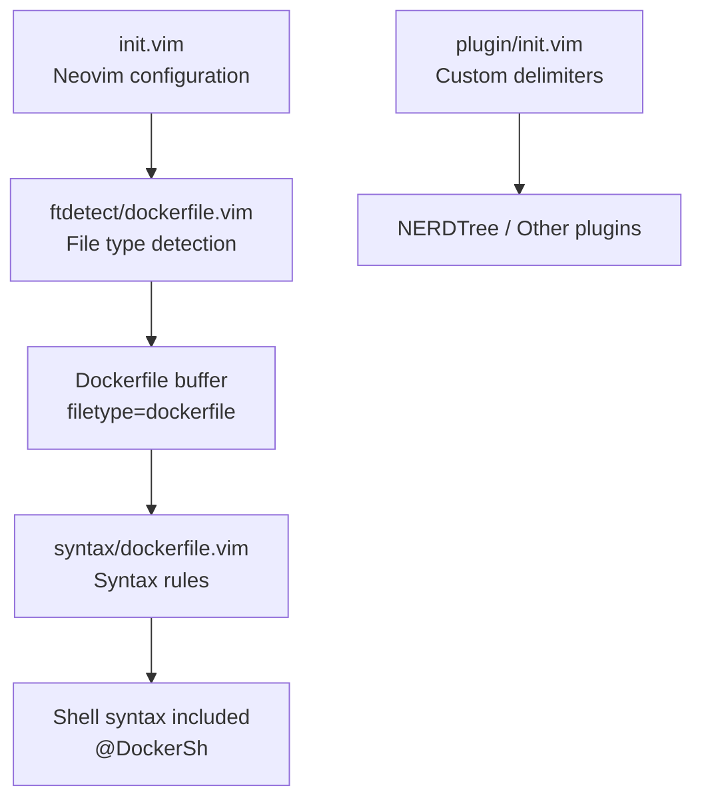
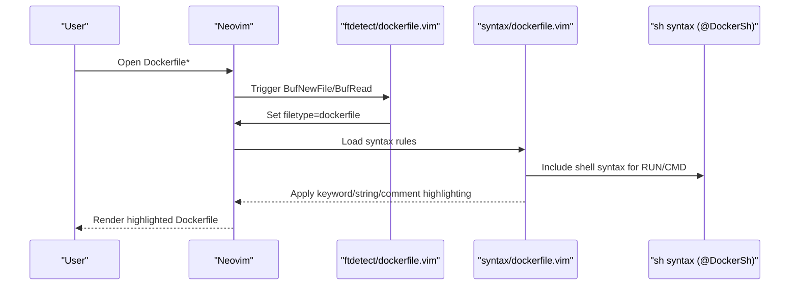
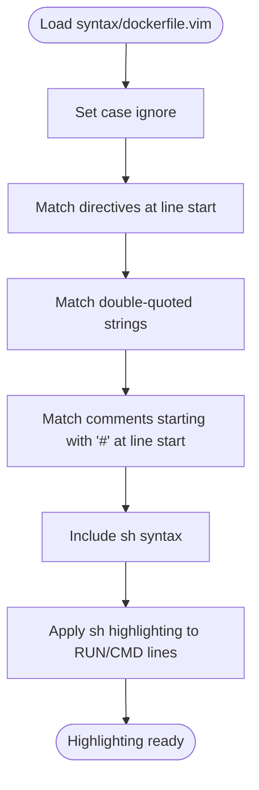
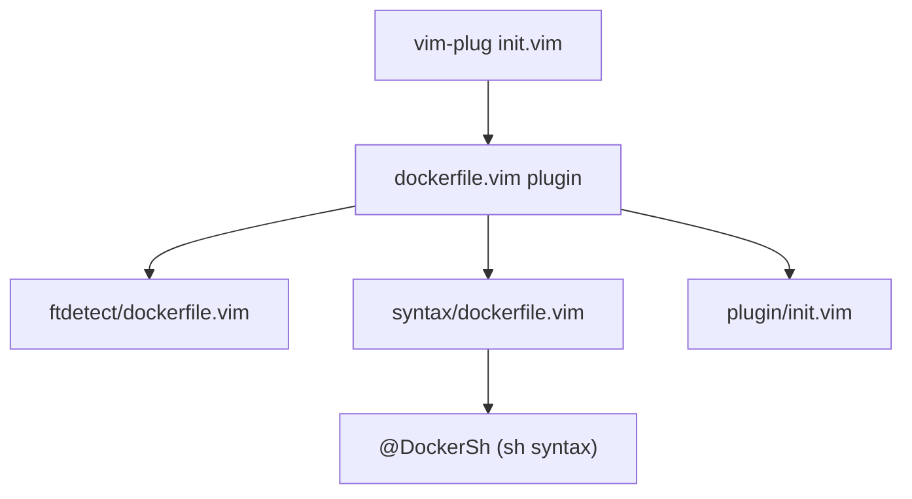

# Dockerfile Syntax Support

<cite>
**Referenced Files in This Document**
- [syntax/dockerfile.vim](file://.local/share/nvim/plugged/dockerfile.vim/syntax/dockerfile.vim)
- [ftdetect/dockerfile.vim](file://.local/share/nvim/plugged/dockerfile.vim/ftdetect/dockerfile.vim)
- [plugin/init.vim](file://.local/share/nvim/plugged/dockerfile.vim/plugin/init.vim)
- [doc/dockerfile.txt](file://.local/share/nvim/plugged/dockerfile.vim/doc/dockerfile.txt)
- [README.md](file://.local/share/nvim/plugged/dockerfile.vim/README.md)
- [init.vim](file://.config/nvim/init.vim)
</cite>

## Table of Contents
1. [Introduction](#introduction)
2. [Project Structure](#project-structure)
3. [Core Components](#core-components)
4. [Architecture Overview](#architecture-overview)
5. [Detailed Component Analysis](#detailed-component-analysis)
6. [Dependency Analysis](#dependency-analysis)
7. [Performance Considerations](#performance-considerations)
8. [Troubleshooting Guide](#troubleshooting-guide)
9. [Conclusion](#conclusion)
10. [Appendices](#appendices)

## Introduction
This document explains how Dockerfile syntax highlighting and support are implemented in Neovim using the dockerfile.vim plugin. It covers directive highlighting, string parsing, comment handling, file type detection, syntax file structure, and integration with Docker-specific workflows. It also provides customization options, troubleshooting tips, and best practices for developing Dockerfiles with accurate syntax highlighting.

## Project Structure
The dockerfile.vim plugin is organized into three primary areas:
- File type detection: associates filenames with the Dockerfile filetype
- Syntax highlighting: defines keywords, strings, comments, and embedded shell syntax
- Plugin integration: registers custom delimiters for external plugins

**Diagram sources**
- [init.vim](file://.config/nvim/init.vim#L137-L161)
- [ftdetect/dockerfile.vim](file://.local/share/nvim/plugged/dockerfile.vim/ftdetect/dockerfile.vim#L1-L2)
- [syntax/dockerfile.vim](file://.local/share/nvim/plugged/dockerfile.vim/syntax/dockerfile.vim#L1-L32)
- [plugin/init.vim](file://.local/share/nvim/plugged/dockerfile.vim/plugin/init.vim#L1-L8)

**Section sources**
- [ftdetect/dockerfile.vim](file://.local/share/nvim/plugged/dockerfile.vim/ftdetect/dockerfile.vim#L1-L2)
- [syntax/dockerfile.vim](file://.local/share/nvim/plugged/dockerfile.vim/syntax/dockerfile.vim#L1-L32)
- [plugin/init.vim](file://.local/share/nvim/plugged/dockerfile.vim/plugin/init.vim#L1-L8)
- [init.vim](file://.config/nvim/init.vim#L137-L161)

## Core Components
- File type detection: Automatically sets filetype=dockerfile for files named Dockerfile*.
- Syntax highlighting:
  - Keywords: Highlights Dockerfile directives at line start.
  - Strings: Highlights double-quoted strings.
  - Comments: Highlights comments starting with # at line start.
  - Embedded shell: Includes sh syntax for RUN and CMD lines to improve highlighting inside those directives.
- Plugin integration: Registers a custom delimiter for NERDTree and similar plugins.

**Section sources**
- [ftdetect/dockerfile.vim](file://.local/share/nvim/plugged/dockerfile.vim/ftdetect/dockerfile.vim#L1-L2)
- [syntax/dockerfile.vim](file://.local/share/nvim/plugged/dockerfile.vim/syntax/dockerfile.vim#L10-L31)
- [plugin/init.vim](file://.local/share/nvim/plugged/dockerfile.vim/plugin/init.vim#L1-L8)

## Architecture Overview
The Dockerfile support pipeline consists of Neovim loading the plugin, detecting the file type, and applying syntax rules. The syntax file includes shell syntax for RUN/CMD lines to enrich highlighting.

**Diagram sources**
- [ftdetect/dockerfile.vim](file://.local/share/nvim/plugged/dockerfile.vim/ftdetect/dockerfile.vim#L1-L2)
- [syntax/dockerfile.vim](file://.local/share/nvim/plugged/dockerfile.vim/syntax/dockerfile.vim#L22-L29)

## Detailed Component Analysis

### File Type Detection
- Mechanism: An autocommand sets filetype=dockerfile for any file matching Dockerfile* during new or read events.
- Integration: This enables Neovim to load the dockerfile syntax file automatically.

**Section sources**
- [ftdetect/dockerfile.vim](file://.local/share/nvim/plugged/dockerfile.vim/ftdetect/dockerfile.vim#L1-L2)
- [init.vim](file://.config/nvim/init.vim#L137-L161)

### Syntax File Structure and Rules
- Case handling: Ignores case differences for keywords.
- Directive highlighting: Keywords are matched at line start, ensuring proper Dockerfile directive recognition.
- String parsing: Double-quoted strings are recognized, including escaped characters.
- Comments: Lines starting with # are treated as comments.
- Embedded shell syntax: Shell syntax is included and applied to RUN and CMD lines to improve command highlighting.

**Diagram sources**
- [syntax/dockerfile.vim](file://.local/share/nvim/plugged/dockerfile.vim/syntax/dockerfile.vim#L10-L31)

**Section sources**
- [syntax/dockerfile.vim](file://.local/share/nvim/plugged/dockerfile.vim/syntax/dockerfile.vim#L10-L31)

### Plugin Integration for Delimiters
- Purpose: Registers a custom delimiter for NERDTree and similar plugins to recognize Dockerfile comments as foldable regions.
- Behavior: Extends global delimiter configuration if present; otherwise initializes it.

**Section sources**
- [plugin/init.vim](file://.local/share/nvim/plugged/dockerfile.vim/plugin/init.vim#L1-L8)

### Supported Dockerfile Constructs
- Directives: FROM, MAINTAINER, RUN, CMD, EXPOSE, ENV, ADD, ENTRYPOINT, VOLUME, USER, WORKDIR, COPY.
- Strings: Double-quoted strings with escaped characters.
- Comments: Lines starting with #.
- Embedded shell: Shell syntax included for RUN and CMD lines.

**Section sources**
- [syntax/dockerfile.vim](file://.local/share/nvim/plugged/dockerfile.vim/syntax/dockerfile.vim#L12-L29)
- [doc/dockerfile.txt](file://.local/share/nvim/plugged/dockerfile.vim/doc/dockerfile.txt#L10-L17)

## Dependency Analysis
- Neovim loads the plugin via vim-plug.
- File type detection depends on the presence of Dockerfile* filenames.
- Syntax highlighting relies on the sh syntax engine for embedded shell contexts.
- Plugin-level delimiter registration integrates with external plugins.

**Diagram sources**
- [init.vim](file://.config/nvim/init.vim#L137-L161)
- [ftdetect/dockerfile.vim](file://.local/share/nvim/plugged/dockerfile.vim/ftdetect/dockerfile.vim#L1-L2)
- [syntax/dockerfile.vim](file://.local/share/nvim/plugged/dockerfile.vim/syntax/dockerfile.vim#L22-L29)
- [plugin/init.vim](file://.local/share/nvim/plugged/dockerfile.vim/plugin/init.vim#L1-L8)

**Section sources**
- [init.vim](file://.config/nvim/init.vim#L137-L161)
- [syntax/dockerfile.vim](file://.local/share/nvim/plugged/dockerfile.vim/syntax/dockerfile.vim#L22-L29)

## Performance Considerations
- Syntax inclusion: Including sh syntax for RUN/CMD lines enhances accuracy but may add minor overhead. This is generally negligible for typical Dockerfile sizes.
- Case handling: Using case-insensitive matching for keywords is efficient and recommended for readability.
- Minimal regex: The syntax rules use straightforward patterns suited for small to medium-sized Dockerfiles.

## Troubleshooting Guide
- Dockerfile not highlighted:
  - Ensure the filename matches Dockerfile* pattern; otherwise, the autocommand will not set filetype=dockerfile.
  - Verify that the dockerfile.vim plugin is loaded via vim-plug.
- Keywords not highlighted:
  - Confirm directives appear at line start; the syntax rules require directives to be at the beginning of a line.
- Strings not highlighted:
  - Ensure double quotes are properly balanced; escaped characters are supported within strings.
- Comments not highlighted:
  - Ensure comments start with # at the beginning of the line.
- Embedded shell highlighting missing:
  - Confirm that sh syntax is available; the syntax file attempts to include it for RUN/CMD lines.
- NERDTree fold behavior:
  - If folds do not behave as expected, check whether the plugin’s delimiter registration is taking effect.

**Section sources**
- [ftdetect/dockerfile.vim](file://.local/share/nvim/plugged/dockerfile.vim/ftdetect/dockerfile.vim#L1-L2)
- [syntax/dockerfile.vim](file://.local/share/nvim/plugged/dockerfile.vim/syntax/dockerfile.vim#L10-L31)
- [plugin/init.vim](file://.local/share/nvim/plugged/dockerfile.vim/plugin/init.vim#L1-L8)

## Conclusion
The dockerfile.vim plugin provides robust Dockerfile syntax highlighting in Neovim by combining file type detection, keyword, string, and comment rules, and embedding shell syntax for RUN and CMD. With minimal configuration, it improves readability and reduces errors in Dockerfile authoring. For advanced scenarios, consider adjusting delimiter settings for compatible plugins and ensuring file naming conventions align with the autocommand rules.

## Appendices

### Configuration Recommendations
- Keep Dockerfile filenames as Dockerfile* to benefit from automatic filetype detection.
- Use double quotes for multi-word string arguments and escape special characters as needed.
- Place comments at the beginning of lines starting with # for consistent highlighting.
- Leverage embedded shell highlighting for RUN/CMD by writing shell commands that the sh syntax engine recognizes.

### Related Documentation
- Plugin documentation and features overview are available in the plugin’s help and README.

**Section sources**
- [doc/dockerfile.txt](file://.local/share/nvim/plugged/dockerfile.vim/doc/dockerfile.txt#L6-L18)
- [README.md](file://.local/share/nvim/plugged/dockerfile.vim/README.md#L13-L34)