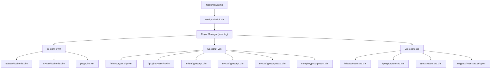
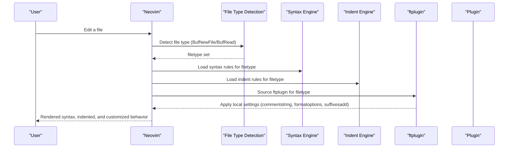
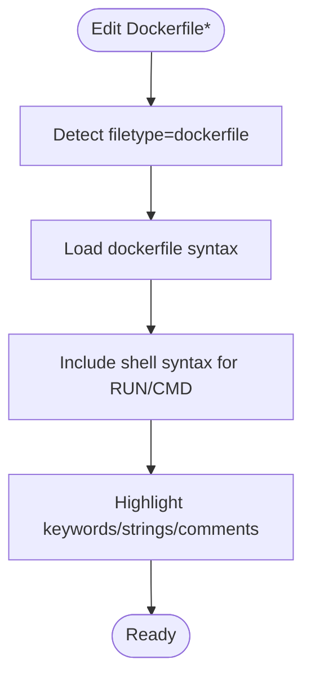
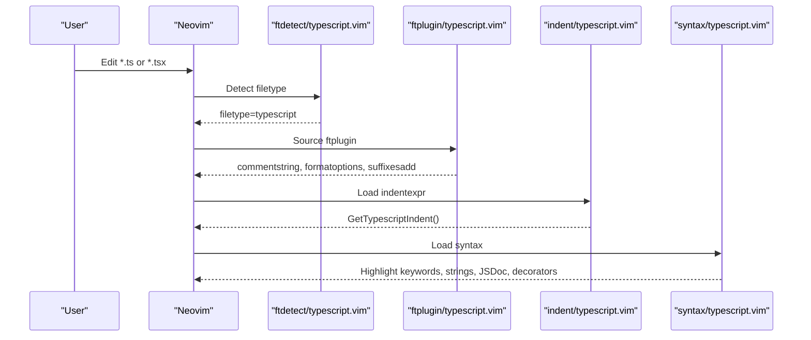
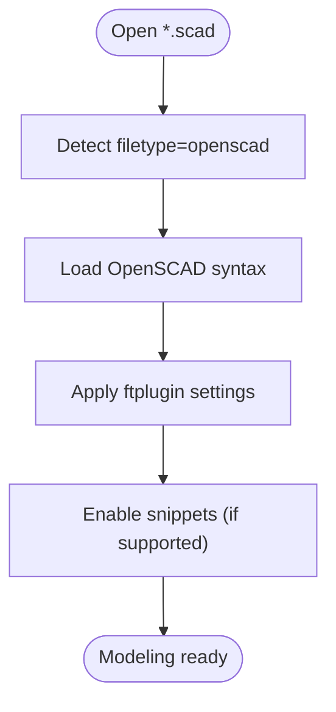
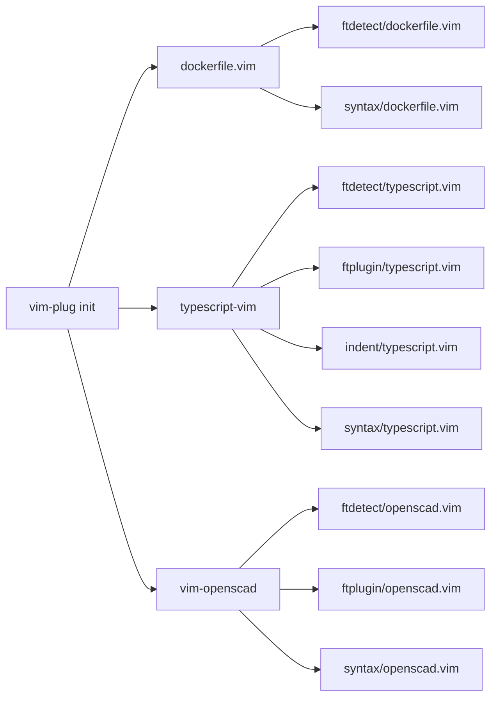

# Language Support Plugins

<cite>
**Referenced Files in This Document**
- [init.vim](file://.config/nvim/init.vim)
- [dockerfile.vim](file://.local/share/nvim/plugged/dockerfile.vim/ftdetect/dockerfile.vim)
- [dockerfile.vim](file://.local/share/nvim/plugged/dockerfile.vim/syntax/dockerfile.vim)
- [dockerfile_init.vim](file://.local/share/nvim/plugged/dockerfile.vim/plugin/init.vim)
- [typescript.vim](file://.local/share/nvim/plugged/typescript-vim/ftdetect/typescript.vim)
- [typescript_ftplugin.vim](file://.local/share/nvim/plugged/typescript-vim/ftplugin/typescript.vim)
- [typescript_indent.vim](file://.local/share/nvim/plugged/typescript-vim/indent/typescript.vim)
- [typescript_syntax.vim](file://.local/share/nvim/plugged/typescript-vim/syntax/typescript.vim)
- [typescriptreact_runtime.vim](file://.local/share/nvim/plugged/typescript-vim/syntax/typescriptreact.vim)
- [typescriptreact_ftplugin.vim](file://.local/share/nvim/plugged/typescript-vim/ftplugin/typescriptreact.vim)
- [openscad_ftdetect.vim](file://.local/share/nvim/plugged/vim-openscad/ftdetect/openscad.vim)
- [openscad_ftplugin.vim](file://.local/share/nvim/plugged/vim-openscad/ftplugin/openscad.vim)
- [openscad_syntax.vim](file://.local/share/nvim/plugged/vim-openscad/syntax/openscad.vim)
- [openscad_snippets](file://.local/share/nvim/plugged/vim-openscad/snippets/openscad.snippets)
</cite>

## Table of Contents
1. [Introduction](#introduction)
2. [Project Structure](#project-structure)
3. [Core Components](#core-components)
4. [Architecture Overview](#architecture-overview)
5. [Detailed Component Analysis](#detailed-component-analysis)
6. [Dependency Analysis](#dependency-analysis)
7. [Performance Considerations](#performance-considerations)
8. [Troubleshooting Guide](#troubleshooting-guide)
9. [Conclusion](#conclusion)

## Introduction
This document explains the language-specific support plugins configured for Neovim in this repository. It focuses on:
- Dockerfile syntax highlighting and completion integration
- TypeScript language support including JSX/TSX handling
- OpenSCAD modeling tools (syntax, indentation, snippets)

It covers file type detection, custom syntax rules, indentation settings, and language-specific key mappings. It also outlines plugin-specific features, configuration options, and integration points with language servers where applicable.

## Project Structure
The Neovim configuration enables three primary language plugins:
- Dockerfile support via a dedicated plugin
- TypeScript/TSX support via a dedicated plugin
- OpenSCAD support via a dedicated plugin

These plugins contribute file type detection, syntax highlighting, indentation, and optional snippets.

**Diagram sources**
- [.config/nvim/init.vim](file://.config/nvim/init.vim#L137-L161)
- [.local/share/nvim/plugged/dockerfile.vim/ftdetect/dockerfile.vim](file://.local/share/nvim/plugged/dockerfile.vim/ftdetect/dockerfile.vim#L1-L2)
- [.local/share/nvim/plugged/dockerfile.vim/syntax/dockerfile.vim](file://.local/share/nvim/plugged/dockerfile.vim/syntax/dockerfile.vim#L1-L32)
- [.local/share/nvim/plugged/dockerfile.vim/plugin/init.vim](file://.local/share/nvim/plugged/dockerfile.vim/plugin/init.vim#L1-L8)
- [.local/share/nvim/plugged/typescript-vim/ftdetect/typescript.vim](file://.local/share/nvim/plugged/typescript-vim/ftdetect/typescript.vim#L1-L5)
- [.local/share/nvim/plugged/typescript-vim/ftplugin/typescript.vim](file://.local/share/nvim/plugged/typescript-vim/ftplugin/typescript.vim#L1-L22)
- [.local/share/nvim/plugged/typescript-vim/indent/typescript.vim](file://.local/share/nvim/plugged/typescript-vim/indent/typescript.vim#L1-L361)
- [.local/share/nvim/plugged/typescript-vim/syntax/typescript.vim](file://.local/share/nvim/plugged/typescript-vim/syntax/typescript.vim#L1-L337)
- [.local/share/nvim/plugged/typescript-vim/syntax/typescriptreact.vim](file://.local/share/nvim/plugged/typescript-vim/syntax/typescriptreact.vim#L1-L2)
- [.local/share/nvim/plugged/typescript-vim/ftplugin/typescriptreact.vim](file://.local/share/nvim/plugged/typescript-vim/ftplugin/typescriptreact.vim#L1-L2)
- [.local/share/nvim/plugged/vim-openscad/ftdetect/openscad.vim](file://.local/share/nvim/plugged/vim-openscad/ftdetect/openscad.vim#L1-L3)
- [.local/share/nvim/plugged/vim-openscad/ftplugin/openscad.vim](file://.local/share/nvim/plugged/vim-openscad/ftplugin/openscad.vim#L1-L15)
- [.local/share/nvim/plugged/vim-openscad/syntax/openscad.vim](file://.local/share/nvim/plugged/vim-openscad/syntax/openscad.vim#L1-L90)
- [.local/share/nvim/plugged/vim-openscad/snippets/openscad.snippets](file://.local/share/nvim/plugged/vim-openscad/snippets/openscad.snippets#L1-L25)

**Section sources**
- [.config/nvim/init.vim](file://.config/nvim/init.vim#L137-L161)

## Core Components
- Dockerfile plugin
  - File type detection for Dockerfiles
  - Syntax highlighting for keywords, strings, comments
  - Embedded shell syntax highlighting for RUN/CMD lines
  - Optional NERDTree delimiter customization
- TypeScript plugin
  - File type detection for .ts and .tsx
  - ftplugin for commentstring, formatoptions, suffixesadd
  - Indentation engine tuned for TypeScript/JS-like constructs
  - Comprehensive syntax highlighting including decorators, JSDoc, DOM/HTML/CSS contexts
  - JSX/TSX support via runtime inclusion of TypeScript syntax
- OpenSCAD plugin
  - File type detection for .scad
  - Syntax highlighting for functions, modules, statements, primitives, transforms
  - ftplugin for comment formatting and GUI file filtering
  - Snippets for common constructs

**Section sources**
- [.local/share/nvim/plugged/dockerfile.vim/ftdetect/dockerfile.vim](file://.local/share/nvim/plugged/dockerfile.vim/ftdetect/dockerfile.vim#L1-L2)
- [.local/share/nvim/plugged/dockerfile.vim/syntax/dockerfile.vim](file://.local/share/nvim/plugged/dockerfile.vim/syntax/dockerfile.vim#L10-L31)
- [.local/share/nvim/plugged/dockerfile.vim/plugin/init.vim](file://.local/share/nvim/plugged/dockerfile.vim/plugin/init.vim#L1-L8)
- [.local/share/nvim/plugged/typescript-vim/ftdetect/typescript.vim](file://.local/share/nvim/plugged/typescript-vim/ftdetect/typescript.vim#L1-L5)
- [.local/share/nvim/plugged/typescript-vim/ftplugin/typescript.vim](file://.local/share/nvim/plugged/typescript-vim/ftplugin/typescript.vim#L9-L18)
- [.local/share/nvim/plugged/typescript-vim/indent/typescript.vim](file://.local/share/nvim/plugged/typescript-vim/indent/typescript.vim#L12-L16)
- [.local/share/nvim/plugged/typescript-vim/syntax/typescript.vim](file://.local/share/nvim/plugged/typescript-vim/syntax/typescript.vim#L30-L55)
- [.local/share/nvim/plugged/typescript-vim/syntax/typescriptreact.vim](file://.local/share/nvim/plugged/typescript-vim/syntax/typescriptreact.vim#L1-L2)
- [.local/share/nvim/plugged/vim-openscad/ftdetect/openscad.vim](file://.local/share/nvim/plugged/vim-openscad/ftdetect/openscad.vim#L1-L3)
- [.local/share/nvim/plugged/vim-openscad/ftplugin/openscad.vim](file://.local/share/nvim/plugged/vim-openscad/ftplugin/openscad.vim#L3-L14)
- [.local/share/nvim/plugged/vim-openscad/syntax/openscad.vim](file://.local/share/nvim/plugged/vim-openscad/syntax/openscad.vim#L13-L77)
- [.local/share/nvim/plugged/vim-openscad/snippets/openscad.snippets](file://.local/share/nvim/plugged/vim-openscad/snippets/openscad.snippets#L1-L25)

## Architecture Overview
The language support architecture relies on Neovim’s file type detection, ftplugin, indent, and syntax subsystems. Plugins are loaded via vim-plug and contribute language-specific behaviors.

**Diagram sources**
- [.config/nvim/init.vim](file://.config/nvim/init.vim#L137-L161)
- [.local/share/nvim/plugged/dockerfile.vim/ftdetect/dockerfile.vim](file://.local/share/nvim/plugged/dockerfile.vim/ftdetect/dockerfile.vim#L1-L2)
- [.local/share/nvim/plugged/typescript-vim/ftdetect/typescript.vim](file://.local/share/nvim/plugged/typescript-vim/ftdetect/typescript.vim#L1-L5)
- [.local/share/nvim/plugged/typescript-vim/ftplugin/typescript.vim](file://.local/share/nvim/plugged/typescript-vim/ftplugin/typescript.vim#L9-L18)
- [.local/share/nvim/plugged/typescript-vim/indent/typescript.vim](file://.local/share/nvim/plugged/typescript-vim/indent/typescript.vim#L12-L16)
- [.local/share/nvim/plugged/vim-openscad/ftdetect/openscad.vim](file://.local/share/nvim/plugged/vim-openscad/ftdetect/openscad.vim#L1-L3)
- [.local/share/nvim/plugged/vim-openscad/ftplugin/openscad.vim](file://.local/share/nvim/plugged/vim-openscad/ftplugin/openscad.vim#L3-L14)

## Detailed Component Analysis

### Dockerfile Plugin
- File type detection
  - Detects files named Dockerfile* and sets filetype=dockerfile
- Syntax highlighting
  - Highlights Dockerfile keywords at line start
  - Highlights strings and comments
  - Includes shell syntax for RUN/CMD lines
- Completion integration
  - Registers a custom delimiter for NERDTree to treat “#” as a block delimiter
- Practical workflow
  - Open any Dockerfile* to get keyword highlighting and embedded shell syntax
  - Use NERDTree with the configured delimiter for improved navigation

**Diagram sources**
- [.local/share/nvim/plugged/dockerfile.vim/ftdetect/dockerfile.vim](file://.local/share/nvim/plugged/dockerfile.vim/ftdetect/dockerfile.vim#L1-L2)
- [.local/share/nvim/plugged/dockerfile.vim/syntax/dockerfile.vim](file://.local/share/nvim/plugged/dockerfile.vim/syntax/dockerfile.vim#L10-L31)
- [.local/share/nvim/plugged/dockerfile.vim/plugin/init.vim](file://.local/share/nvim/plugged/dockerfile.vim/plugin/init.vim#L1-L8)

**Section sources**
- [.local/share/nvim/plugged/dockerfile.vim/ftdetect/dockerfile.vim](file://.local/share/nvim/plugged/dockerfile.vim/ftdetect/dockerfile.vim#L1-L2)
- [.local/share/nvim/plugged/dockerfile.vim/syntax/dockerfile.vim](file://.local/share/nvim/plugged/dockerfile.vim/syntax/dockerfile.vim#L10-L31)
- [.local/share/nvim/plugged/dockerfile.vim/plugin/init.vim](file://.local/share/nvim/plugged/dockerfile.vim/plugin/init.vim#L1-L8)

### TypeScript Plugin (including JSX/TSX)
- File type detection
  - .ts files: sets filetype=typescript
  - .tsx files: sets filetype=typescript via setfiletype to avoid conflicts
- ftplugin
  - Sets commentstring to // %s
  - Configures formatoptions for comment lines
  - Adds .ts and .tsx to suffixesadd for compiler integration
- Indentation
  - Provides GetTypescriptIndent() with sophisticated rules for parentheses, braces, ternary, labels, and operator-first lines
  - Uses syntax-aware skipping to avoid mis-indentation inside strings/comments
- Syntax
  - Comprehensive highlighting for comments, strings, numbers, regex, decorators, JSDoc
  - DOM/HTML/CSS contexts controlled by feature flags
  - Sync and folding regions for blocks
- JSX/TSX
  - Runtime includes TypeScript syntax for JSX/TSX contexts
  - ftplugin for TSX delegates to TypeScript ftplugin

**Diagram sources**
- [.local/share/nvim/plugged/typescript-vim/ftdetect/typescript.vim](file://.local/share/nvim/plugged/typescript-vim/ftdetect/typescript.vim#L1-L5)
- [.local/share/nvim/plugged/typescript-vim/ftplugin/typescript.vim](file://.local/share/nvim/plugged/typescript-vim/ftplugin/typescript.vim#L9-L18)
- [.local/share/nvim/plugged/typescript-vim/indent/typescript.vim](file://.local/share/nvim/plugged/typescript-vim/indent/typescript.vim#L12-L16)
- [.local/share/nvim/plugged/typescript-vim/syntax/typescript.vim](file://.local/share/nvim/plugged/typescript-vim/syntax/typescript.vim#L30-L55)

**Section sources**
- [.local/share/nvim/plugged/typescript-vim/ftdetect/typescript.vim](file://.local/share/nvim/plugged/typescript-vim/ftdetect/typescript.vim#L1-L5)
- [.local/share/nvim/plugged/typescript-vim/ftplugin/typescript.vim](file://.local/share/nvim/plugged/typescript-vim/ftplugin/typescript.vim#L9-L18)
- [.local/share/nvim/plugged/typescript-vim/indent/typescript.vim](file://.local/share/nvim/plugged/typescript-vim/indent/typescript.vim#L261-L356)
- [.local/share/nvim/plugged/typescript-vim/syntax/typescript.vim](file://.local/share/nvim/plugged/typescript-vim/syntax/typescript.vim#L30-L55)
- [.local/share/nvim/plugged/typescript-vim/syntax/typescriptreact.vim](file://.local/share/nvim/plugged/typescript-vim/syntax/typescriptreact.vim#L1-L2)
- [.local/share/nvim/plugged/typescript-vim/ftplugin/typescriptreact.vim](file://.local/share/nvim/plugged/typescript-vim/ftplugin/typescriptreact.vim#L1-L2)

### OpenSCAD Plugin
- File type detection
  - Detects *.scad and sets filetype=openscad
  - Includes a manual syntax call for compatibility
- ftplugin
  - Adjusts formatoptions and comments for OpenSCAD-style comments
  - Adds GUI file filter for .scad files
- Syntax
  - Highlights functions/modules, statements, conditionals, loops, CSG keywords, transforms, primitives, imports, built-ins
  - Numbers, strings, booleans, special variables, and comments
- Snippets
  - Provides snippet triggers for common constructs (var, rotate, scale, translate, cube, cylinder, difference, union, intersection)

**Diagram sources**
- [.local/share/nvim/plugged/vim-openscad/ftdetect/openscad.vim](file://.local/share/nvim/plugged/vim-openscad/ftdetect/openscad.vim#L1-L3)
- [.local/share/nvim/plugged/vim-openscad/ftplugin/openscad.vim](file://.local/share/nvim/plugged/vim-openscad/ftplugin/openscad.vim#L3-L14)
- [.local/share/nvim/plugged/vim-openscad/syntax/openscad.vim](file://.local/share/nvim/plugged/vim-openscad/syntax/openscad.vim#L13-L77)
- [.local/share/nvim/plugged/vim-openscad/snippets/openscad.snippets](file://.local/share/nvim/plugged/vim-openscad/snippets/openscad.snippets#L1-L25)

**Section sources**
- [.local/share/nvim/plugged/vim-openscad/ftdetect/openscad.vim](file://.local/share/nvim/plugged/vim-openscad/ftdetect/openscad.vim#L1-L3)
- [.local/share/nvim/plugged/vim-openscad/ftplugin/openscad.vim](file://.local/share/nvim/plugged/vim-openscad/ftplugin/openscad.vim#L3-L14)
- [.local/share/nvim/plugged/vim-openscad/syntax/openscad.vim](file://.local/share/nvim/plugged/vim-openscad/syntax/openscad.vim#L13-L77)
- [.local/share/nvim/plugged/vim-openscad/snippets/openscad.snippets](file://.local/share/nvim/plugged/vim-openscad/snippets/openscad.snippets#L1-L25)

## Dependency Analysis
- Plugin loading order and coupling
  - vim-plug loads dockerfile.vim, typescript-vim, and vim-openscad during startup
  - No explicit dependencies declared among these plugins; they operate independently
- File type detection dependencies
  - Dockerfile detection precedes syntax loading
  - TypeScript detection sets filetype=typescript, which triggers ftplugin and indent
  - OpenSCAD detection sets filetype=openscad, which triggers ftplugin and syntax
- Indirect dependencies
  - TypeScript indentation depends on syntax awareness to skip strings/comments
  - OpenSCAD syntax links to standard groups for consistent highlighting

**Diagram sources**
- [.config/nvim/init.vim](file://.config/nvim/init.vim#L137-L161)
- [.local/share/nvim/plugged/dockerfile.vim/ftdetect/dockerfile.vim](file://.local/share/nvim/plugged/dockerfile.vim/ftdetect/dockerfile.vim#L1-L2)
- [.local/share/nvim/plugged/dockerfile.vim/syntax/dockerfile.vim](file://.local/share/nvim/plugged/dockerfile.vim/syntax/dockerfile.vim#L10-L31)
- [.local/share/nvim/plugged/typescript-vim/ftdetect/typescript.vim](file://.local/share/nvim/plugged/typescript-vim/ftdetect/typescript.vim#L1-L5)
- [.local/share/nvim/plugged/typescript-vim/ftplugin/typescript.vim](file://.local/share/nvim/plugged/typescript-vim/ftplugin/typescript.vim#L9-L18)
- [.local/share/nvim/plugged/typescript-vim/indent/typescript.vim](file://.local/share/nvim/plugged/typescript-vim/indent/typescript.vim#L12-L16)
- [.local/share/nvim/plugged/typescript-vim/syntax/typescript.vim](file://.local/share/nvim/plugged/typescript-vim/syntax/typescript.vim#L30-L55)
- [.local/share/nvim/plugged/vim-openscad/ftdetect/openscad.vim](file://.local/share/nvim/plugged/vim-openscad/ftdetect/openscad.vim#L1-L3)
- [.local/share/nvim/plugged/vim-openscad/ftplugin/openscad.vim](file://.local/share/nvim/plugged/vim-openscad/ftplugin/openscad.vim#L3-L14)
- [.local/share/nvim/plugged/vim-openscad/syntax/openscad.vim](file://.local/share/nvim/plugged/vim-openscad/syntax/openscad.vim#L13-L77)

**Section sources**
- [.config/nvim/init.vim](file://.config/nvim/init.vim#L137-L161)

## Performance Considerations
- TypeScript indentation
  - Uses syntax-aware skipping and caching to reduce overhead
  - Employs searchpair and synstack to compute accurate indentation
- OpenSCAD syntax
  - Uses transparent regions and folds for blocks and vectors to improve rendering performance
- Dockerfile shell inclusion
  - Includes shell syntax for RUN/CMD lines; keep in mind this adds parsing overhead for those lines

[No sources needed since this section provides general guidance]

## Troubleshooting Guide
- Dockerfile syntax highlighting not applied
  - Ensure the file is named Dockerfile* so the ftdetect rule matches
  - Verify the syntax file is loaded and b:current_syntax is set
- Dockerfile embedded shell highlighting missing
  - Confirm the plugin included shell syntax and that the include path resolves
- TypeScript syntax highlighting incomplete
  - Check that syntax is loaded and b:current_syntax is set
  - For JSX/TSX, ensure .tsx files are detected as filetype=typescript
- TypeScript indentation incorrect
  - Verify indentexpr is set and GetTypescriptIndent() is active
  - Ensure syntax is current to avoid mis-indentation inside strings/comments
- OpenSCAD syntax highlighting issues
  - Confirm filetype=openscad is set and syntax file is loaded
  - Check that special variables and comments are highlighted as expected
- OpenSCAD snippets not triggering
  - Ensure snippet engine support is enabled and the snippet file is present

**Section sources**
- [.local/share/nvim/plugged/dockerfile.vim/ftdetect/dockerfile.vim](file://.local/share/nvim/plugged/dockerfile.vim/ftdetect/dockerfile.vim#L1-L2)
- [.local/share/nvim/plugged/dockerfile.vim/syntax/dockerfile.vim](file://.local/share/nvim/plugged/dockerfile.vim/syntax/dockerfile.vim#L22-L31)
- [.local/share/nvim/plugged/typescript-vim/ftdetect/typescript.vim](file://.local/share/nvim/plugged/typescript-vim/ftdetect/typescript.vim#L1-L5)
- [.local/share/nvim/plugged/typescript-vim/indent/typescript.vim](file://.local/share/nvim/plugged/typescript-vim/indent/typescript.vim#L12-L16)
- [.local/share/nvim/plugged/vim-openscad/ftdetect/openscad.vim](file://.local/share/nvim/plugged/vim-openscad/ftdetect/openscad.vim#L1-L3)
- [.local/share/nvim/plugged/vim-openscad/syntax/openscad.vim](file://.local/share/nvim/plugged/vim-openscad/syntax/openscad.vim#L13-L77)

## Conclusion
This configuration integrates robust language support for Dockerfiles, TypeScript/TSX, and OpenSCAD in Neovim. File type detection, syntax highlighting, indentation, and ftplugin customizations are provided by dedicated plugins. For advanced workflows, consider integrating language servers (e.g., tsserver for TypeScript) and ensuring snippet engines are configured for OpenSCAD.

[No sources needed since this section summarizes without analyzing specific files]