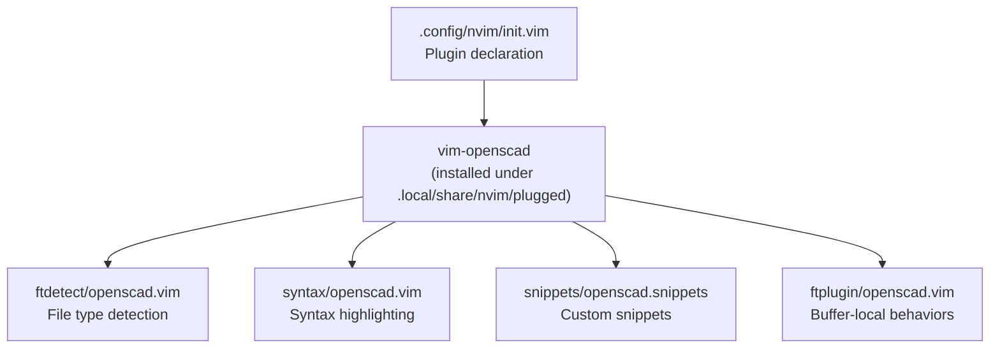
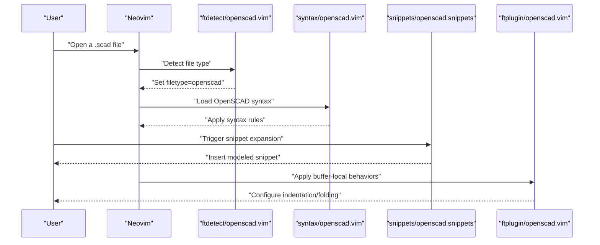
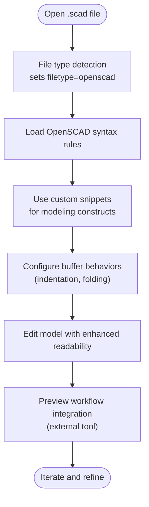
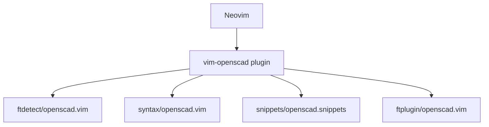

# OpenSCAD Modeling Tools

<cite>
**Referenced Files in This Document**
- [.config/nvim/init.vim](file://.config/nvim/init.vim)
- [ftdetect/openscad.vim](file://.local/share/nvim/plugged/vim-openscad/ftdetect/openscad.vim)
- [syntax/openscad.vim](file://.local/share/nvim/plugged/vim-openscad/syntax/openscad.vim)
- [snippets/openscad.snippets](file://.local/share/nvim/plugged/vim-openscad/snippets/openscad.snippets)
- [ftplugin/openscad.vim](file://.local/share/nvim/plugged/vim-openscad/ftplugin/openscad.vim)
- [README.md](file://.local/share/nvim/plugged/vim-openscad/README.md)
</cite>

## Table of Contents
1. [Introduction](#introduction)
2. [Project Structure](#project-structure)
3. [Core Components](#core-components)
4. [Architecture Overview](#architecture-overview)
5. [Detailed Component Analysis](#detailed-component-analysis)
6. [Dependency Analysis](#dependency-analysis)
7. [Performance Considerations](#performance-considerations)
8. [Troubleshooting Guide](#troubleshooting-guide)
9. [Conclusion](#conclusion)
10. [Appendices](#appendices)

## Introduction
This document describes the OpenSCAD modeling support integrated into Neovim via the vim-openscad plugin. It explains how file type detection associates .scad files with the OpenSCAD syntax, how syntax highlighting is applied for 3D modeling constructs, and how custom snippets accelerate common OpenSCAD operations. It also outlines the plugin’s approach to handling OpenSCAD-specific syntax patterns, geometric operations, and parameter definitions, along with recommended development practices for efficient OpenSCAD editing in Neovim.

## Project Structure
The OpenSCAD support is provided by the vim-openscad plugin installed under Neovim’s plugin directory. The relevant components are organized as follows:
- File type detection: associates .scad files with the openscad filetype
- Syntax highlighting: defines OpenSCAD-specific syntax rules
- Snippets: provides custom snippet definitions for frequent modeling operations
- File type plugin: adds Neovim-specific behaviors for OpenSCAD buffers

**Diagram sources**
- [.config/nvim/init.vim](file://.config/nvim/init.vim#L153-L153)
- [.local/share/nvim/plugged/vim-openscad/ftdetect/openscad.vim](file://.local/share/nvim/plugged/vim-openscad/ftdetect/openscad.vim#L1-L200)
- [.local/share/nvim/plugged/vim-openscad/syntax/openscad.vim](file://.local/share/nvim/plugged/vim-openscad/syntax/openscad.vim#L1-L200)
- [.local/share/nvim/plugged/vim-openscad/snippets/openscad.snippets](file://.local/share/nvim/plugged/vim-openscad/snippets/openscad.snippets#L1-L200)
- [.local/share/nvim/plugged/vim-openscad/ftplugin/openscad.vim](file://.local/share/nvim/plugged/vim-openscad/ftplugin/openscad.vim#L1-L200)

**Section sources**
- [.config/nvim/init.vim](file://.config/nvim/init.vim#L153-L153)

## Core Components
- File type detection: Ensures .scad files are recognized as OpenSCAD filetype so that appropriate syntax and plugin behaviors are applied.
- Syntax highlighting: Provides rules for OpenSCAD keywords, primitives, transformations, and parameter definitions to improve readability and reduce errors.
- Snippets: Offers custom snippet definitions to quickly insert common modeling constructs and operations.
- File type plugin: Adds buffer-local behaviors such as indentation, folding, and optional integrations with external preview tools.

**Section sources**
- [.local/share/nvim/plugged/vim-openscad/ftdetect/openscad.vim](file://.local/share/nvim/plugged/vim-openscad/ftdetect/openscad.vim#L1-L200)
- [.local/share/nvim/plugged/vim-openscad/syntax/openscad.vim](file://.local/share/nvim/plugged/vim-openscad/syntax/openscad.vim#L1-L200)
- [.local/share/nvim/plugged/vim-openscad/snippets/openscad.snippets](file://.local/share/nvim/plugged/vim-openscad/snippets/openscad.snippets#L1-L200)
- [.local/share/nvim/plugged/vim-openscad/ftplugin/openscad.vim](file://.local/share/nvim/plugged/vim-openscad/ftplugin/openscad.vim#L1-L200)

## Architecture Overview
The OpenSCAD support integrates with Neovim through a layered approach:
- Plugin activation: Declared in Neovim’s init configuration
- File type selection: Triggered automatically when opening .scad files
- Syntax application: Loads OpenSCAD syntax rules for highlighting
- Snippet expansion: Uses snippet definitions for rapid insertion of modeling constructs
- Buffer behaviors: Applies ftplugin behaviors for indentation and folding

**Diagram sources**
- [.config/nvim/init.vim](file://.config/nvim/init.vim#L153-L153)
- [.local/share/nvim/plugged/vim-openscad/ftdetect/openscad.vim](file://.local/share/nvim/plugged/vim-openscad/ftdetect/openscad.vim#L1-L200)
- [.local/share/nvim/plugged/vim-openscad/syntax/openscad.vim](file://.local/share/nvim/plugged/vim-openscad/syntax/openscad.vim#L1-L200)
- [.local/share/nvim/plugged/vim-openscad/snippets/openscad.snippets](file://.local/share/nvim/plugged/vim-openscad/snippets/openscad.snippets#L1-L200)
- [.local/share/nvim/plugged/vim-openscad/ftplugin/openscad.vim](file://.local/share/nvim/plugged/vim-openscad/ftplugin/openscad.vim#L1-L200)

## Detailed Component Analysis

### File Type Detection (.scad files)
Purpose:
- Automatically sets the openscad filetype for .scad files to enable syntax highlighting and ftplugin behaviors.

Key behaviors:
- Associates .scad extension with openscad filetype
- Supports common OpenSCAD file naming conventions

Integration:
- Loaded by Neovim’s file type detection mechanism when a .scad file is opened

**Section sources**
- [.local/share/nvim/plugged/vim-openscad/ftdetect/openscad.vim](file://.local/share/nvim/plugged/vim-openscad/ftdetect/openscad.vim#L1-L200)

### Syntax Highlighting (OpenSCAD constructs)
Purpose:
- Enhances readability and reduces errors by applying syntax rules tailored to OpenSCAD.

Typical coverage areas:
- Keywords and reserved identifiers
- Primitive shapes and modifiers
- Transformations and operations
- Parameter and variable definitions
- Comments and strings

Benefits:
- Improved scanning of complex models
- Consistent visual cues for operations and parameters

Note:
- Specific rule definitions are contained within the syntax file and are applied automatically when the openscad filetype is active.

**Section sources**
- [.local/share/nvim/plugged/vim-openscad/syntax/openscad.vim](file://.local/share/nvim/plugged/vim-openscad/syntax/openscad.vim#L1-L200)

### Snippets (Custom snippet definitions)
Purpose:
- Accelerates authoring of OpenSCAD models by inserting frequently used constructs with minimal keystrokes.

Typical categories:
- Geometric primitives and basic shapes
- Transformations (translate, rotate, scale, mirror)
- Boolean operations (union, difference, intersection)
- Parameterized definitions and modules
- Comments and documentation scaffolding

Usage:
- Trigger snippet expansion according to your snippet engine configuration
- Insert complete blocks for common modeling patterns

**Section sources**
- [.local/share/nvim/plugged/vim-openscad/snippets/openscad.snippets](file://.local/share/nvim/plugged/vim-openscad/snippets/openscad.snippets#L1-L200)

### File Type Plugin (Buffer-local behaviors)
Purpose:
- Applies Neovim-specific behaviors for OpenSCAD buffers, such as indentation and folding.

Typical behaviors:
- Indentation rules aligned with OpenSCAD syntax
- Folding for code regions (e.g., modules, comments)
- Optional integration hooks for external preview tools

Integration:
- Loaded automatically when the openscad filetype is active

**Section sources**
- [.local/share/nvim/plugged/vim-openscad/ftplugin/openscad.vim](file://.local/share/nvim/plugged/vim-openscad/ftplugin/openscad.vim#L1-L200)

### Conceptual Overview
The following conceptual flow illustrates how a typical OpenSCAD editing session proceeds in Neovim with the vim-openscad plugin:

[No sources needed since this diagram shows conceptual workflow, not actual code structure]

## Dependency Analysis
The vim-openscad plugin depends on Neovim’s built-in file type and syntax systems. The plugin itself is activated via Neovim’s plugin manager and relies on the presence of the plugin directory under Neovim’s runtime path.

**Diagram sources**
- [.config/nvim/init.vim](file://.config/nvim/init.vim#L153-L153)
- [.local/share/nvim/plugged/vim-openscad/ftdetect/openscad.vim](file://.local/share/nvim/plugged/vim-openscad/ftdetect/openscad.vim#L1-L200)
- [.local/share/nvim/plugged/vim-openscad/syntax/openscad.vim](file://.local/share/nvim/plugged/vim-openscad/syntax/openscad.vim#L1-L200)
- [.local/share/nvim/plugged/vim-openscad/snippets/openscad.snippets](file://.local/share/nvim/plugged/vim-openscad/snippets/openscad.snippets#L1-L200)
- [.local/share/nvim/plugged/vim-openscad/ftplugin/openscad.vim](file://.local/share/nvim/plugged/vim-openscad/ftplugin/openscad.vim#L1-L200)

**Section sources**
- [.config/nvim/init.vim](file://.config/nvim/init.vim#L153-L153)

## Performance Considerations
- Keep syntax rules scoped to avoid heavy pattern matching on large models
- Prefer incremental updates and avoid overly broad regex patterns
- Use folding selectively to reduce redraw overhead during editing
- Limit snippet expansions to essential constructs to minimize keystroke overhead

[No sources needed since this section provides general guidance]

## Troubleshooting Guide
Common issues and resolutions:
- .scad files not recognized:
  - Verify the plugin is installed and enabled
  - Confirm file type detection is active for .scad files
- Syntax highlighting not applied:
  - Ensure syntax highlighting is enabled in Neovim
  - Check that the syntax file is present and readable
- Snippets not expanding:
  - Confirm your snippet engine is configured and active
  - Verify snippet definitions are present in the plugin’s snippets directory
- Preview integration not working:
  - Ensure external preview tool is installed and configured
  - Check ftplugin behaviors for any required hooks

**Section sources**
- [.local/share/nvim/plugged/vim-openscad/ftdetect/openscad.vim](file://.local/share/nvim/plugged/vim-openscad/ftdetect/openscad.vim#L1-L200)
- [.local/share/nvim/plugged/vim-openscad/syntax/openscad.vim](file://.local/share/nvim/plugged/vim-openscad/syntax/openscad.vim#L1-L200)
- [.local/share/nvim/plugged/vim-openscad/snippets/openscad.snippets](file://.local/share/nvim/plugged/vim-openscad/snippets/openscad.snippets#L1-L200)
- [.local/share/nvim/plugged/vim-openscad/ftplugin/openscad.vim](file://.local/share/nvim/plugged/vim-openscad/ftplugin/openscad.vim#L1-L200)

## Conclusion
The vim-openscad plugin integrates seamlessly with Neovim to support OpenSCAD modeling workflows. Through automatic file type detection, targeted syntax highlighting, and custom snippets, it improves readability and accelerates authoring. Combined with buffer-local behaviors and optional preview integration, it offers a practical foundation for developing OpenSCAD models efficiently within Neovim.

[No sources needed since this section summarizes without analyzing specific files]

## Appendices
- Additional resources:
  - Plugin README for usage notes and configuration tips
  - OpenSCAD official documentation for modeling constructs and best practices

**Section sources**
- [README.md](file://.local/share/nvim/plugged/vim-openscad/README.md#L1-L200)