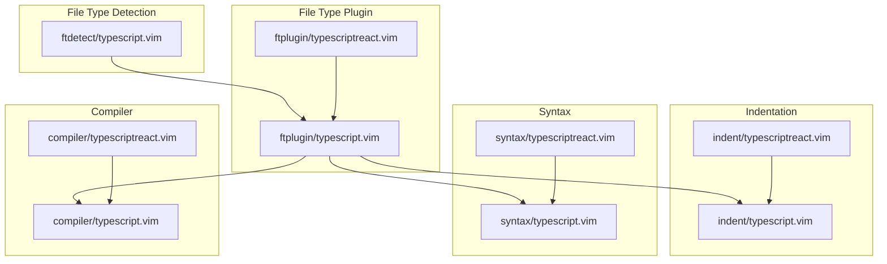
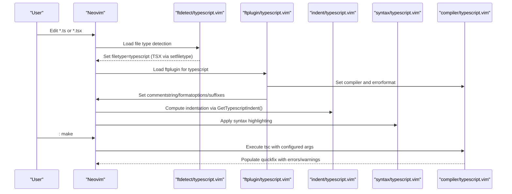
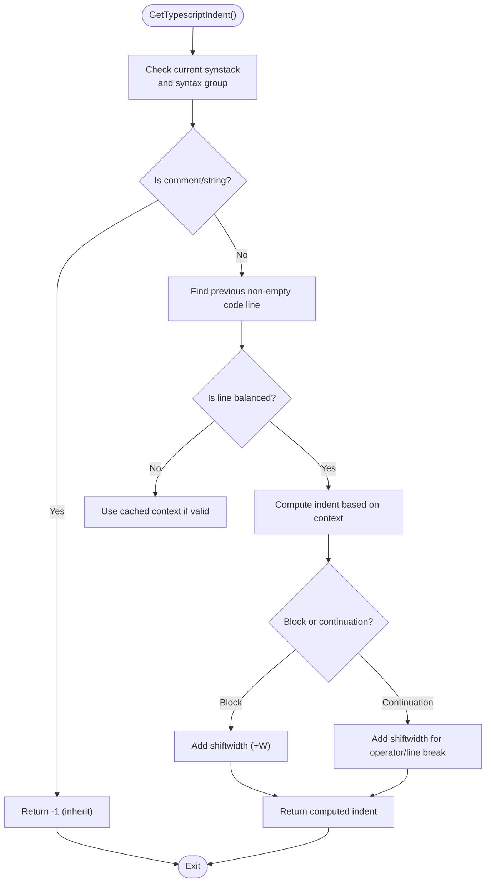
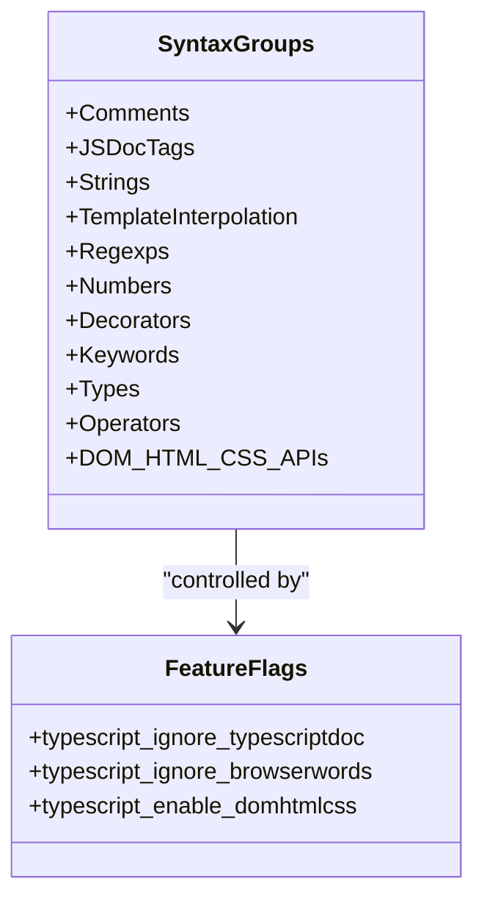
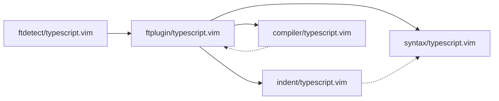

# TypeScript Language Support

<cite>
**Referenced Files in This Document**
- [init.vim](file://.config/nvim/init.vim)
- [typescript.vim](file://.local/share/nvim/plugged/typescript-vim/ftdetect/typescript.vim)
- [typescript.vim](file://.local/share/nvim/plugged/typescript-vim/ftplugin/typescript.vim)
- [typescriptreact.vim](file://.local/share/nvim/plugged/typescript-vim/ftplugin/typescriptreact.vim)
- [typescript.vim](file://.local/share/nvim/plugged/typescript-vim/indent/typescript.vim)
- [typescriptreact.vim](file://.local/share/nvim/plugged/typescript-vim/indent/typescriptreact.vim)
- [typescript.vim](file://.local/share/nvim/plugged/typescript-vim/syntax/typescript.vim)
- [typescriptreact.vim](file://.local/share/nvim/plugged/typescript-vim/syntax/typescriptreact.vim)
- [typescript.vim](file://.local/share/nvim/plugged/typescript-vim/compiler/typescript.vim)
- [typescriptreact.vim](file://.local/share/nvim/plugged/typescript-vim/compiler/typescriptreact.vim)
- [README.md](file://.local/share/nvim/plugged/typescript-vim/README.md)
</cite>

## Table of Contents
1. [Introduction](#introduction)
2. [Project Structure](#project-structure)
3. [Core Components](#core-components)
4. [Architecture Overview](#architecture-overview)
5. [Detailed Component Analysis](#detailed-component-analysis)
6. [Dependency Analysis](#dependency-analysis)
7. [Performance Considerations](#performance-considerations)
8. [Troubleshooting Guide](#troubleshooting-guide)
9. [Conclusion](#conclusion)
10. [Appendices](#appendices)

## Introduction
This document explains how TypeScript and TSX/JSX are supported in Neovim via the leafgarland/typescript-vim plugin. It covers file type detection, syntax highlighting, indentation rules, compiler integration, and configuration options. It also provides guidance on handling modern JavaScript/TypeScript features, troubleshooting highlighting issues, and optimizing workflows.

## Project Structure
The TypeScript support is organized into discrete Vim runtime components:
- File type detection: associates .ts and .tsx files with the typescript filetype
- File type plugin: sets compiler, comment string, format options, and suffixes for TypeScript buffers
- Indentation: custom indentation logic for TypeScript and TSX/JSX
- Syntax: comprehensive syntax rules for keywords, types, decorators, strings, comments, and optional DOM/HTML/CSS highlights
- Compiler: integrates tsc with quickfix errorformat

**Diagram sources**
- [typescript.vim](file://.local/share/nvim/plugged/typescript-vim/ftdetect/typescript.vim#L1-L5)
- [typescript.vim](file://.local/share/nvim/plugged/typescript-vim/ftplugin/typescript.vim#L1-L22)
- [typescriptreact.vim](file://.local/share/nvim/plugged/typescript-vim/ftplugin/typescriptreact.vim#L1-L2)
- [typescript.vim](file://.local/share/nvim/plugged/typescript-vim/indent/typescript.vim#L1-L361)
- [typescriptreact.vim](file://.local/share/nvim/plugged/typescript-vim/indent/typescriptreact.vim#L1-L2)
- [typescript.vim](file://.local/share/nvim/plugged/typescript-vim/syntax/typescript.vim#L1-L337)
- [typescriptreact.vim](file://.local/share/nvim/plugged/typescript-vim/syntax/typescriptreact.vim#L1-L2)
- [typescript.vim](file://.local/share/nvim/plugged/typescript-vim/compiler/typescript.vim#L1-L31)
- [typescriptreact.vim](file://.local/share/nvim/plugged/typescript-vim/compiler/typescriptreact.vim#L1-L2)

**Section sources**
- [typescript.vim](file://.local/share/nvim/plugged/typescript-vim/ftdetect/typescript.vim#L1-L5)
- [typescript.vim](file://.local/share/nvim/plugged/typescript-vim/ftplugin/typescript.vim#L1-L22)
- [typescriptreact.vim](file://.local/share/nvim/plugged/typescript-vim/ftplugin/typescriptreact.vim#L1-L2)
- [typescript.vim](file://.local/share/nvim/plugged/typescript-vim/indent/typescript.vim#L1-L361)
- [typescriptreact.vim](file://.local/share/nvim/plugged/typescript-vim/indent/typescriptreact.vim#L1-L2)
- [typescript.vim](file://.local/share/nvim/plugged/typescript-vim/syntax/typescript.vim#L1-L337)
- [typescriptreact.vim](file://.local/share/nvim/plugged/typescript-vim/syntax/typescriptreact.vim#L1-L2)
- [typescript.vim](file://.local/share/nvim/plugged/typescript-vim/compiler/typescript.vim#L1-L31)
- [typescriptreact.vim](file://.local/share/nvim/plugged/typescript-vim/compiler/typescriptreact.vim#L1-L2)

## Core Components
- File type detection: associates .ts with filetype=typescript and .tsx with filetype=typescript (without overriding other plugins)
- File type plugin: loads the typescript compiler, sets commentstring, formatoptions, and suffixes for TypeScript buffers
- Indentation: custom GetTypescriptIndent() with support for parentheses, braces, ternary expressions, labels, and chained method calls
- Syntax: extensive keyword groups, JSDoc support, decorators, template interpolation, browser/DOM/AJAX APIs, and optional DOM/HTML/CSS highlighting
- Compiler: sets makeprg and errorformat for tsc, with configurable binary and default options

**Section sources**
- [typescript.vim](file://.local/share/nvim/plugged/typescript-vim/ftdetect/typescript.vim#L1-L5)
- [typescript.vim](file://.local/share/nvim/plugged/typescript-vim/ftplugin/typescript.vim#L1-L22)
- [typescript.vim](file://.local/share/nvim/plugged/typescript-vim/indent/typescript.vim#L261-L356)
- [typescript.vim](file://.local/share/nvim/plugged/typescript-vim/syntax/typescript.vim#L1-L337)
- [typescript.vim](file://.local/share/nvim/plugged/typescript-vim/compiler/typescript.vim#L1-L31)

## Architecture Overview
The plugin’s architecture is layered:
- Detection triggers the loading of the typescript filetype
- The ftplugin initializes compiler, commentstring, formatoptions, and suffixes
- Indentation and syntax are applied independently
- Compiler integration enables invoking tsc and displaying diagnostics

**Diagram sources**
- [typescript.vim](file://.local/share/nvim/plugged/typescript-vim/ftdetect/typescript.vim#L1-L5)
- [typescript.vim](file://.local/share/nvim/plugged/typescript-vim/ftplugin/typescript.vim#L1-L22)
- [typescript.vim](file://.local/share/nvim/plugged/typescript-vim/indent/typescript.vim#L261-L356)
- [typescript.vim](file://.local/share/nvim/plugged/typescript-vim/syntax/typescript.vim#L1-L337)
- [typescript.vim](file://.local/share/nvim/plugged/typescript-vim/compiler/typescript.vim#L1-L31)

## Detailed Component Analysis

### File Type Detection
- Associates .ts with filetype=typescript
- Associates .tsx with filetype=typescript using setfiletype to avoid overriding other plugins

**Section sources**
- [typescript.vim](file://.local/share/nvim/plugged/typescript-vim/ftdetect/typescript.vim#L1-L5)

### File Type Plugin
- Loads the typescript compiler
- Sets commentstring to C++-style line comments
- Configures formatoptions for comment wrapping and leader insertion
- Adds .ts and .tsx to suffixesadd for improved completion behavior

**Section sources**
- [typescript.vim](file://.local/share/nvim/plugged/typescript-vim/ftplugin/typescript.vim#L1-L22)

### Indentation Rules
- Uses a custom indentexpr GetTypescriptIndent() with:
  - Parentheses/brackets/braces balancing
  - Continuation detection for operators and line breaks
  - Ternary operator column inference
  - Label and block detection
  - Chained method call indentation support
- Provides a mechanism to disable indentation globally via a flag

**Diagram sources**
- [typescript.vim](file://.local/share/nvim/plugged/typescript-vim/indent/typescript.vim#L261-L356)

**Section sources**
- [typescript.vim](file://.local/share/nvim/plugged/typescript-vim/indent/typescript.vim#L1-L361)

### Syntax Highlighting
- Comprehensive keyword coverage: statements, types, operators, reserved words, exceptions, and more
- JSDoc support with tags and parameter highlighting
- Decorators, template literals with interpolation, regular expressions, numbers, strings, and comments
- Optional DOM/HTML/CSS highlighting controlled by a feature flag
- Browser/DOM/AJAX API tokens controlled by a separate flag

**Diagram sources**
- [typescript.vim](file://.local/share/nvim/plugged/typescript-vim/syntax/typescript.vim#L1-L337)

**Section sources**
- [typescript.vim](file://.local/share/nvim/plugged/typescript-vim/syntax/typescript.vim#L1-L337)

### Compiler Integration
- Sets makeprg to invoke tsc with configurable binary and default options
- Defines errorformat compatible with tsc output
- Supports overriding compiler settings per buffer

**Section sources**
- [typescript.vim](file://.local/share/nvim/plugged/typescript-vim/compiler/typescript.vim#L1-L31)

### TSX/JSX Support
- TSX files are detected as typescript
- TSX/JSX indentation and syntax are inherited from TypeScript rules
- React/JSX-specific syntax is handled by the same TypeScript syntax engine

**Section sources**
- [typescript.vim](file://.local/share/nvim/plugged/typescript-vim/ftdetect/typescript.vim#L1-L5)
- [typescriptreact.vim](file://.local/share/nvim/plugged/typescript-vim/indent/typescriptreact.vim#L1-L2)
- [typescriptreact.vim](file://.local/share/nvim/plugged/typescript-vim/syntax/typescriptreact.vim#L1-L2)
- [typescriptreact.vim](file://.local/share/nvim/plugged/typescript-vim/ftplugin/typescriptreact.vim#L1-L2)
- [typescriptreact.vim](file://.local/share/nvim/plugged/typescript-vim/compiler/typescriptreact.vim#L1-L2)

## Dependency Analysis
- File type detection depends on Neovim’s filetype plugin/indent on
- File type plugin depends on the compiler definition and sets buffer-local options
- Indentation relies on syntax awareness and caching for performance
- Syntax highlighting depends on the main syntax engine and optional feature flags
- Compiler integration depends on tsc availability and configured options

**Diagram sources**
- [typescript.vim](file://.local/share/nvim/plugged/typescript-vim/ftdetect/typescript.vim#L1-L5)
- [typescript.vim](file://.local/share/nvim/plugged/typescript-vim/ftplugin/typescript.vim#L1-L22)
- [typescript.vim](file://.local/share/nvim/plugged/typescript-vim/indent/typescript.vim#L1-L361)
- [typescript.vim](file://.local/share/nvim/plugged/typescript-vim/syntax/typescript.vim#L1-L337)
- [typescript.vim](file://.local/share/nvim/plugged/typescript-vim/compiler/typescript.vim#L1-L31)

**Section sources**
- [typescript.vim](file://.local/share/nvim/plugged/typescript-vim/ftdetect/typescript.vim#L1-L5)
- [typescript.vim](file://.local/share/nvim/plugged/typescript-vim/ftplugin/typescript.vim#L1-L22)
- [typescript.vim](file://.local/share/nvim/plugged/typescript-vim/indent/typescript.vim#L1-L361)
- [typescript.vim](file://.local/share/nvim/plugged/typescript-vim/syntax/typescript.vim#L1-L337)
- [typescript.vim](file://.local/share/nvim/plugged/typescript-vim/compiler/typescript.vim#L1-L31)

## Performance Considerations
- Indentation caches context to avoid repeated expensive lookups
- Syntax synchronization is configured to reduce overhead
- Using setlocal indentkeys can improve chained method call indentation behavior during typing

**Section sources**
- [typescript.vim](file://.local/share/nvim/plugged/typescript-vim/indent/typescript.vim#L261-L356)
- [typescript.vim](file://.local/share/nvim/plugged/typescript-vim/syntax/typescript.vim#L24-L24)

## Troubleshooting Guide
Common issues and resolutions:
- Indentation does not match expectations
  - Disable the custom indenter globally by setting the appropriate flag
  - Adjust operator-first regex for continuation lines
- Syntax highlighting missing certain constructs
  - Enable optional DOM/HTML/CSS highlighting via the documented flag
  - Enable JSDoc highlighting by ensuring the ignore flag is not set
- Compiler errors not appearing in quickfix
  - Verify tsc is available and on PATH
  - Confirm makeprg and errorformat are set by the compiler plugin
  - Optionally override makeprg per buffer if needed

Recommended steps:
- Temporarily disable the indenter to isolate indentation problems
- Toggle optional DOM/HTML/CSS highlighting to reduce noise
- Run :make and use quickfix navigation to review diagnostics

**Section sources**
- [README.md](file://.local/share/nvim/plugged/typescript-vim/README.md#L60-L147)
- [typescript.vim](file://.local/share/nvim/plugged/typescript-vim/indent/typescript.vim#L6-L6)
- [typescript.vim](file://.local/share/nvim/plugged/typescript-vim/syntax/typescript.vim#L158-L181)
- [typescript.vim](file://.local/share/nvim/plugged/typescript-vim/compiler/typescript.vim#L1-L31)

## Conclusion
The leafgarland/typescript-vim plugin provides a robust foundation for TypeScript editing in Neovim, covering file type detection, indentation, syntax highlighting, and compiler integration. While it predates newer tooling, it remains useful for basic editing tasks. For advanced language server features, consider integrating a dedicated LSP client alongside this plugin.

## Appendices

### Configuration Options Summary
- Indentation
  - Disable indenter globally
  - Adjust operator-first continuation regex
- Compiler
  - Override compiler binary and default options
  - Customize makeprg per buffer
- Syntax
  - Toggle JSDoc highlighting
  - Toggle browser/DOM/AJAX API highlighting
  - Enable DOM/HTML/CSS highlighting

**Section sources**
- [README.md](file://.local/share/nvim/plugged/typescript-vim/README.md#L60-L147)
- [typescript.vim](file://.local/share/nvim/plugged/typescript-vim/compiler/typescript.vim#L6-L12)
- [typescript.vim](file://.local/share/nvim/plugged/typescript-vim/syntax/typescript.vim#L41-L54)
- [typescript.vim](file://.local/share/nvim/plugged/typescript-vim/syntax/typescript.vim#L88-L107)
- [typescript.vim](file://.local/share/nvim/plugged/typescript-vim/syntax/typescript.vim#L158-L181)