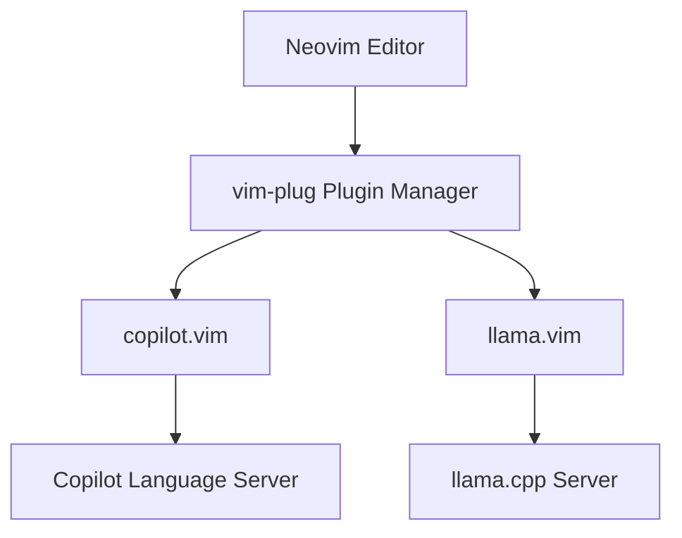
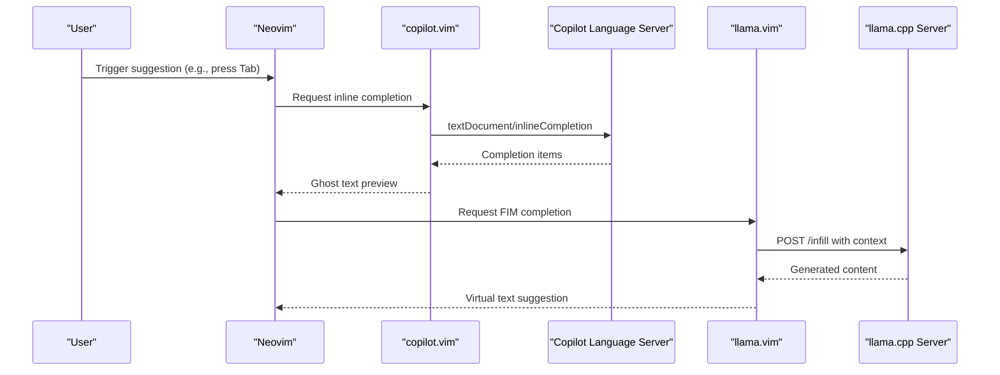
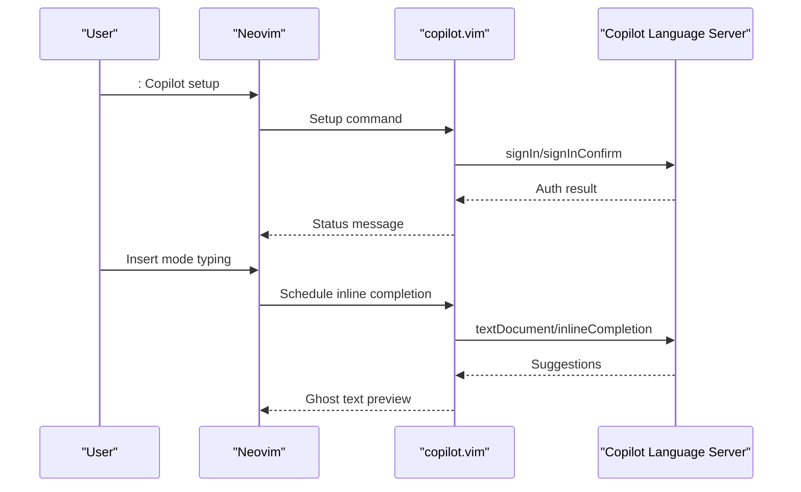
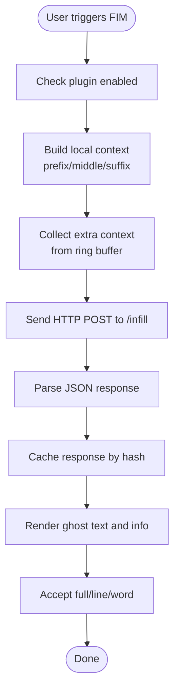
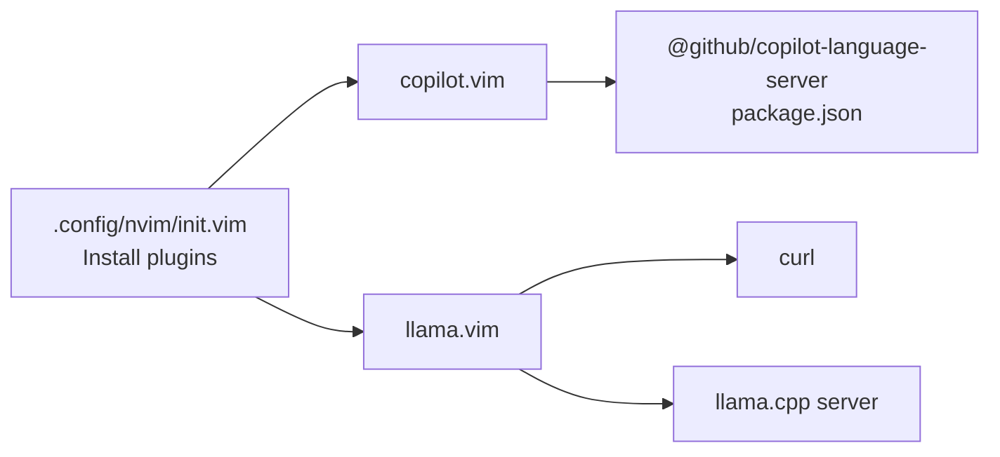

# AI Assistant Plugins

<cite>
**Referenced Files in This Document**
- [init.vim](file://.config/nvim/init.vim)
- [copilot.vim](file://.local/share/nvim/plugged/copilot.vim/plugin/copilot.vim)
- [copilot.txt](file://.local/share/nvim/plugged/copilot.vim/doc/copilot.txt)
- [_copilot.lua](file://.local/share/nvim/plugged/copilot.vim/lua/_copilot.lua)
- [package.json](file://.local/share/nvim/plugged/copilot.vim/copilot-language-server/package.json)
- [llama.vim](file://.local/share/nvim/plugged/llama.vim/plugin/llama.vim)
- [llama.txt](file://.local/share/nvim/plugged/llama.vim/doc/llama.txt)
- [llama.vim (autoload)](file://.local/share/nvim/plugged/llama.vim/autoload/llama.vim)
- [llama_debug.vim](file://.local/share/nvim/plugged/llama.vim/autoload/llama_debug.vim)
</cite>

## Table of Contents
1. [Introduction](#introduction)
2. [Project Structure](#project-structure)
3. [Core Components](#core-components)
4. [Architecture Overview](#architecture-overview)
5. [Detailed Component Analysis](#detailed-component-analysis)
6. [Dependency Analysis](#dependency-analysis)
7. [Performance Considerations](#performance-considerations)
8. [Troubleshooting Guide](#troubleshooting-guide)
9. [Conclusion](#conclusion)

## Introduction
This document explains how AI assistant plugins are integrated in the Neovim environment configured in this repository. It focuses on:
- GitHub Copilot integration: installation, authentication, configuration, and panel management
- Local Llama.cpp integration via llama.vim: model selection, inference settings, and performance tuning
- Differences between cloud-based Copilot and local Llama models
- Troubleshooting common issues such as authentication failures, model loading problems, and performance bottlenecks

## Project Structure
The Neovim configuration installs and initializes two AI assistant plugins:
- copilot.vim: integrates GitHub Copilot via a language server
- llama.vim: integrates a local Llama.cpp server for offline completion and instruction-based editing

**Diagram sources**
- [init.vim](file://.config/nvim/init.vim#L137-L161)
- [copilot.vim](file://.local/share/nvim/plugged/copilot.vim/plugin/copilot.vim#L1-L115)
- [llama.vim](file://.local/share/nvim/plugged/llama.vim/plugin/llama.vim#L1-L2)

**Section sources**
- [.config/nvim/init.vim](file://.config/nvim/init.vim#L137-L161)

## Core Components
- GitHub Copilot (copilot.vim)
  - Provides inline completions, suggestion cycling, acceptance, and a panel for browsing suggestions
  - Uses a language server started via Node.js and managed by the plugin
  - Offers commands for setup, status, model selection, panel, and version
- llama.vim
  - Integrates with a local llama.cpp server for fill-in-middle (FIM) completions and instruction-based editing
  - Provides configurable endpoints, model names, sampling parameters, and a debug pane
  - Supports Neovim virtual text and Vim text properties for inline hints

**Section sources**
- [copilot.txt](file://.local/share/nvim/plugged/copilot.vim/doc/copilot.txt#L1-L229)
- [llama.txt](file://.local/share/nvim/plugged/llama.vim/doc/llama.txt#L1-L279)

## Architecture Overview
The AI assistant architecture combines cloud-based Copilot and a local Llama.cpp server. Both rely on Neovim’s LSP client capabilities and plugin autocommands.

**Diagram sources**
- [copilot.vim](file://.local/share/nvim/plugged/copilot.vim/plugin/copilot.vim#L45-L69)
- [_copilot.lua](file://.local/share/nvim/plugged/copilot.vim/lua/_copilot.lua#L12-L53)
- [llama.vim (autoload)](file://.local/share/nvim/plugged/llama.vim/autoload/llama.vim#L800-L891)

## Detailed Component Analysis

### GitHub Copilot Integration
- Installation and activation
  - The configuration installs copilot.vim via vim-plug and initializes it on startup.
- Authentication and setup
  - Use the setup command to authenticate with GitHub Copilot. The plugin handles device code flow and opens the browser when needed.
- Panel management
  - The panel command opens a window to browse multiple suggestions for the current buffer.
- Keyboard shortcuts and maps
  - The plugin defines maps for dismissing suggestions, cycling, requesting suggestions, and accepting words/lines.
- Configuration options
  - Version pinning or latest for the language server
  - Filetype enable/disable lists
  - Buffer-level enable/disable overrides
  - Node binary path selection
  - Enterprise URI and proxy settings
  - Workspace folders for context
- Language server architecture
  - The plugin starts and manages the Copilot Language Server using Node.js and LSP APIs.

**Diagram sources**
- [copilot.txt](file://.local/share/nvim/plugged/copilot.vim/doc/copilot.txt#L19-L49)
- [copilot.vim](file://.local/share/nvim/plugged/copilot.vim/plugin/copilot.vim#L45-L69)
- [_copilot.lua](file://.local/share/nvim/plugged/copilot.vim/lua/_copilot.lua#L12-L53)

**Section sources**
- [copilot.txt](file://.local/share/nvim/plugged/copilot.vim/doc/copilot.txt#L1-L229)
- [copilot.vim](file://.local/share/nvim/plugged/copilot.vim/plugin/copilot.vim#L1-L115)
- [_copilot.lua](file://.local/share/nvim/plugged/copilot.vim/lua/_copilot.lua#L1-L105)
- [package.json](file://.local/share/nvim/plugged/copilot.vim/copilot-language-server/package.json#L1-L49)

### Local Llama.cpp Integration (llama.vim)
- Requirements and defaults
  - Requires Neovim/Vim 9.1+, curl, a running llama.cpp server, FIM-compatible and instruct-compatible models.
- Default shortcuts and commands
  - Accept suggestion (full/line/word), trigger FIM/instruction, toggle debug pane, and toggles for enabling/disabling and auto-FIM.
- Commands
  - LlamaEnable/LlamaDisable/LlamaToggle/LlamaToggleAutoFim
  - LlamaInstruct for instruction-based editing
  - LlamaDebugToggle/LlamaDebugClear for debug pane
- How to start the server
  - Example llama-server invocation with port, GPU offload, batch sizes, context size, and cache reuse parameters.
- Configuration
  - Endpoint URLs for FIM and instruction modes
  - Model names for FIM and instruction
  - Sampling and prediction parameters (n_predict, stop strings, timing caps)
  - Inline info visibility and auto-FIM behavior
  - Ring buffer parameters for extra context reuse
  - Keymap customization for triggers and accept actions
- Debug pane
  - A dedicated scratch buffer with foldable sections and timestamps for diagnostics.

**Diagram sources**
- [llama.txt](file://.local/share/nvim/plugged/llama.vim/doc/llama.txt#L65-L99)
- [llama.vim (autoload)](file://.local/share/nvim/plugged/llama.vim/autoload/llama.vim#L700-L891)
- [llama.vim (autoload)](file://.local/share/nvim/plugged/llama.vim/autoload/llama.vim#L1019-L1246)

**Section sources**
- [llama.txt](file://.local/share/nvim/plugged/llama.vim/doc/llama.txt#L1-L279)
- [llama.vim](file://.local/share/nvim/plugged/llama.vim/plugin/llama.vim#L1-L2)
- [llama.vim (autoload)](file://.local/share/nvim/plugged/llama.vim/autoload/llama.vim#L1-L1889)
- [llama_debug.vim](file://.local/share/nvim/plugged/llama.vim/autoload/llama_debug.vim#L1-L140)

### Conceptual Overview
- Cloud-based Copilot vs. local Llama
  - Copilot relies on GitHub’s hosted language server and account authentication; llama.vim runs entirely locally against a llama.cpp server.
  - Copilot offers broader language support and enterprise features; llama.vim prioritizes privacy and local resource usage.

[No sources needed since this section doesn't analyze specific files]

## Dependency Analysis
- Plugin dependencies
  - copilot.vim depends on Node.js and the Copilot Language Server distribution
  - llama.vim depends on curl and a running llama.cpp server
- Autoload and runtime behavior
  - Both plugins use Neovim LSP client APIs and define autocommands for insert mode and buffer events
- Configuration coupling
  - copilot.vim configuration affects LSP startup and proxy/version behavior
  - llama.vim configuration affects HTTP endpoints, model names, and inference parameters

**Diagram sources**
- [init.vim](file://.config/nvim/init.vim#L137-L161)
- [package.json](file://.local/share/nvim/plugged/copilot.vim/copilot-language-server/package.json#L1-L49)

**Section sources**
- [init.vim](file://.config/nvim/init.vim#L137-L161)
- [package.json](file://.local/share/nvim/plugged/copilot.vim/copilot-language-server/package.json#L1-L49)

## Performance Considerations
- Copilot
  - Use g:copilot_version to pin or allow updates; “latest” may introduce instability
  - Proxy strict SSL verification can be relaxed for corporate environments
  - Workspace folders can improve suggestion quality but do not directly impact performance
- llama.vim
  - Tune batch sizes and micro-batches for throughput vs. latency
  - Reduce ctx-size or cache-reuse to fit memory constraints
  - Limit ring buffer size and chunk scope to avoid excessive context
  - Increase n_predict cautiously; long generations increase latency
  - Use stop strings to cut off early when appropriate
  - Prefer single-line FIM for faster responses when needed

[No sources needed since this section provides general guidance]

## Troubleshooting Guide
- Authentication failures (Copilot)
  - Run :Copilot status to diagnose startup errors or warnings
  - Re-run :Copilot setup; ensure the browser opens and the device code is entered
  - If the language server fails to start, restart with :Copilot restart
- Model loading problems (llama.vim)
  - Verify the llama.cpp server is reachable at the configured endpoint
  - Confirm model names match the loaded models on the server
  - Check curl availability and network connectivity
- Performance bottlenecks (llama.vim)
  - Reduce n_predict and stop strings to shorten generation
  - Lower ctx-size or disable cache reuse if memory constrained
  - Adjust ring_n_chunks and ring_chunk_size to balance context reuse and memory
  - Use the debug pane to inspect timings and cache metrics
- General tips
  - Use :Copilot panel to review suggestions when inline previews are not visible
  - Toggle auto-FIM in llama.vim for manual control when needed

**Section sources**
- [copilot.txt](file://.local/share/nvim/plugged/copilot.vim/doc/copilot.txt#L25-L49)
- [llama.txt](file://.local/share/nvim/plugged/llama.vim/doc/llama.txt#L100-L182)
- [llama_debug.vim](file://.local/share/nvim/plugged/llama.vim/autoload/llama_debug.vim#L106-L140)

## Conclusion
This repository configures Neovim with both cloud-based Copilot and a local Llama.cpp stack. copilot.vim provides seamless inline completions with a panel and robust authentication, while llama.vim delivers flexible, privacy-preserving completions and instruction-based editing with extensive tuning knobs. Use the troubleshooting steps and performance guidance to tailor the setup to your environment and workflow.