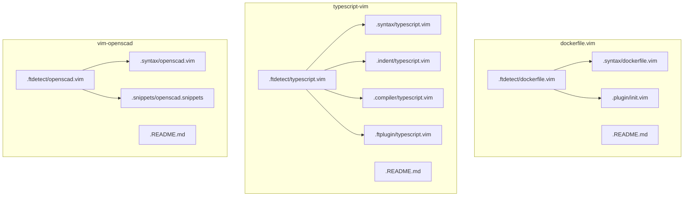
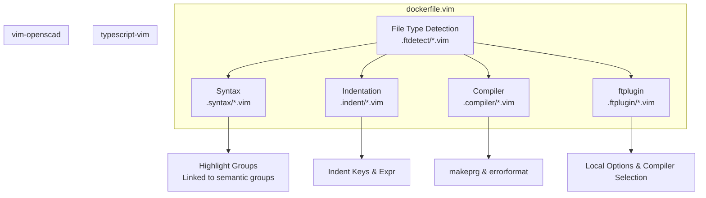
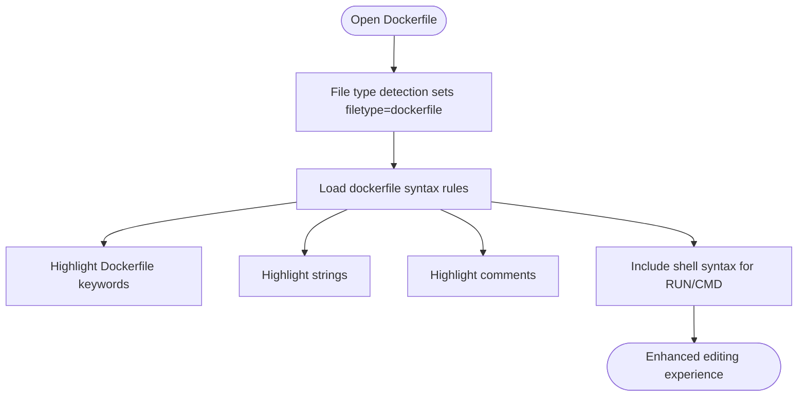
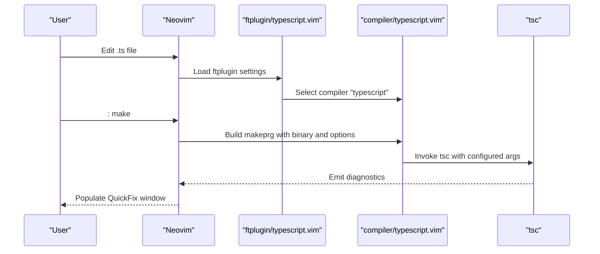
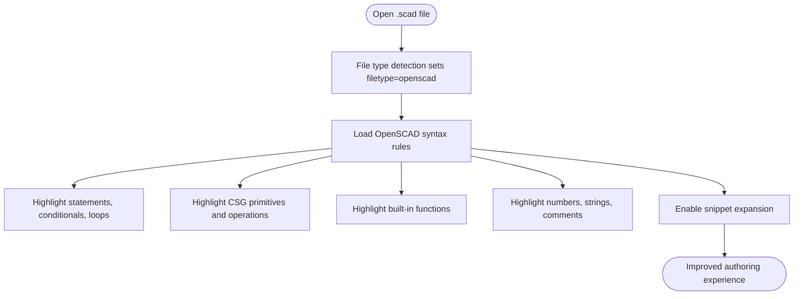
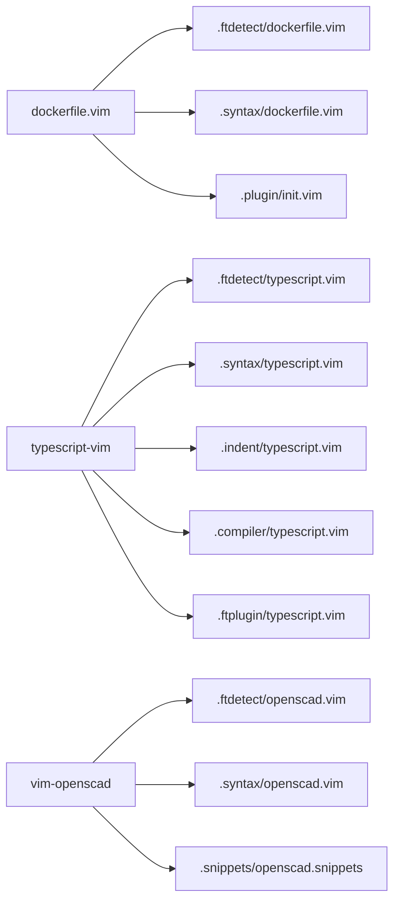

# Language Support Plugins

<cite>
**Referenced Files in This Document**
- [dockerfile.vim README](file://.local/share/nvim/plugged/dockerfile.vim/README.md)
- [dockerfile.vim init plugin](file://.local/share/nvim/plugged/dockerfile.vim/plugin/init.vim)
- [dockerfile.vim syntax](file://.local/share/nvim/plugged/dockerfile.vim/syntax/dockerfile.vim)
- [dockerfile.vim file detection](file://.local/share/nvim/plugged/dockerfile.vim/ftdetect/dockerfile.vim)
- [typescript-vim README](file://.local/share/nvim/plugged/typescript-vim/README.md)
- [typescript-vim compiler](file://.local/share/nvim/plugged/typescript-vim/compiler/typescript.vim)
- [typescript-vim indent](file://.local/share/nvim/plugged/typescript-vim/indent/typescript.vim)
- [typescript-vim ftplugin](file://.local/share/nvim/plugged/typescript-vim/ftplugin/typescript.vim)
- [vim-openscad README](file://.local/share/nvim/plugged/vim-openscad/README.md)
- [vim-openscad syntax](file://.local/share/nvim/plugged/vim-openscad/syntax/openscad.vim)
- [vim-openscad snippets](file://.local/share/nvim/plugged/vim-openscad/snippets/openscad.snippets)
- [vim-openscad file detection](file://.local/share/nvim/plugged/vim-openscad/ftdetect/openscad.vim)
</cite>

## Table of Contents
1. [Introduction](#introduction)
2. [Project Structure](#project-structure)
3. [Core Components](#core-components)
4. [Architecture Overview](#architecture-overview)
5. [Detailed Component Analysis](#detailed-component-analysis)
6. [Dependency Analysis](#dependency-analysis)
7. [Performance Considerations](#performance-considerations)
8. [Troubleshooting Guide](#troubleshooting-guide)
9. [Conclusion](#conclusion)

## Introduction
This document explains three language-specific support plugins integrated into the Neovim environment:
- dockerfile.vim: Dockerfile syntax highlighting, basic completion hooks, and optional integration with external tools.
- typescript-vim: Multi-language TypeScript/JavaScript support including compiler integration, syntax highlighting, and indentation rules.
- vim-openscad: OpenSCAD language support with syntax highlighting and snippet integration.

It covers features, configuration examples, and practical guidance for enhancing the editing experience for each language, along with limitations and workarounds.

## Project Structure
Each plugin is organized as a standard Vim/Neovim runtime plugin with dedicated directories for file type detection, syntax, indentation, compiler settings, and snippets.

**Diagram sources**
- [dockerfile.vim file detection](file://.local/share/nvim/plugged/dockerfile.vim/ftdetect/dockerfile.vim#L1-L2)
- [dockerfile.vim syntax](file://.local/share/nvim/plugged/dockerfile.vim/syntax/dockerfile.vim#L1-L32)
- [dockerfile.vim init plugin](file://.local/share/nvim/plugged/dockerfile.vim/plugin/init.vim#L1-L8)
- [typescript-vim compiler](file://.local/share/nvim/plugged/typescript-vim/compiler/typescript.vim#L1-L31)
- [typescript-vim indent](file://.local/share/nvim/plugged/typescript-vim/indent/typescript.vim#L1-L361)
- [typescript-vim ftplugin](file://.local/share/nvim/plugged/typescript-vim/ftplugin/typescript.vim#L1-L22)
- [vim-openscad file detection](file://.local/share/nvim/plugged/vim-openscad/ftdetect/openscad.vim#L1-L3)
- [vim-openscad syntax](file://.local/share/nvim/plugged/vim-openscad/syntax/openscad.vim#L1-L90)
- [vim-openscad snippets](file://.local/share/nvim/plugged/vim-openscad/snippets/openscad.snippets#L1-L25)

**Section sources**
- [dockerfile.vim README](file://.local/share/nvim/plugged/dockerfile.vim/README.md#L1-L34)
- [typescript-vim README](file://.local/share/nvim/plugged/typescript-vim/README.md#L1-L147)
- [vim-openscad README](file://.local/share/nvim/plugged/vim-openscad/README.md#L1-L35)

## Core Components
- Dockerfile support
  - File type detection matches Dockerfiles automatically.
  - Syntax highlights Dockerfile keywords, strings, comments, and integrates shell syntax for RUN/CMD regions.
  - Optional NERDTree delimiter customization for improved navigation.
- TypeScript/JavaScript support
  - File type detection for .ts and related files.
  - Syntax highlighting tailored for TypeScript.
  - Indentation rules optimized for chained method calls and complex expressions.
  - Compiler integration to invoke tsc and populate QuickFix.
  - ftplugin configuration for comment string, formatting, and suffix handling.
- OpenSCAD support
  - File type detection for .scad files.
  - Syntax highlighting for statements, conditionals, loops, CSG primitives, transforms, built-ins, numbers, strings, and comments.
  - Snippet integration for common constructs.

**Section sources**
- [dockerfile.vim file detection](file://.local/share/nvim/plugged/dockerfile.vim/ftdetect/dockerfile.vim#L1-L2)
- [dockerfile.vim syntax](file://.local/share/nvim/plugged/dockerfile.vim/syntax/dockerfile.vim#L10-L31)
- [dockerfile.vim init plugin](file://.local/share/nvim/plugged/dockerfile.vim/plugin/init.vim#L1-L8)
- [typescript-vim ftplugin](file://.local/share/nvim/plugged/typescript-vim/ftplugin/typescript.vim#L9-L18)
- [typescript-vim indent](file://.local/share/nvim/plugged/typescript-vim/indent/typescript.vim#L12-L16)
- [typescript-vim compiler](file://.local/share/nvim/plugged/typescript-vim/compiler/typescript.vim#L21-L27)
- [typescript-vim README](file://.local/share/nvim/plugged/typescript-vim/README.md#L54-L147)
- [vim-openscad file detection](file://.local/share/nvim/plugged/vim-openscad/ftdetect/openscad.vim#L1-L2)
- [vim-openscad syntax](file://.local/share/nvim/plugged/vim-openscad/syntax/openscad.vim#L21-L76)
- [vim-openscad snippets](file://.local/share/nvim/plugged/vim-openscad/snippets/openscad.snippets#L1-L25)

## Architecture Overview
The plugins rely on Neovim’s runtime plugin model:
- File type detection assigns the appropriate language.
- Syntax files define highlighting rules.
- Indentation and compiler files integrate with Neovim’s indentation engine and make command.
- ftplugin applies per-file-type settings and compiler selection.
- Snippets provide templated expansions.

**Diagram sources**
- [dockerfile.vim file detection](file://.local/share/nvim/plugged/dockerfile.vim/ftdetect/dockerfile.vim#L1-L2)
- [dockerfile.vim syntax](file://.local/share/nvim/plugged/dockerfile.vim/syntax/dockerfile.vim#L10-L31)
- [typescript-vim indent](file://.local/share/nvim/plugged/typescript-vim/indent/typescript.vim#L12-L16)
- [typescript-vim compiler](file://.local/share/nvim/plugged/typescript-vim/compiler/typescript.vim#L21-L27)
- [typescript-vim ftplugin](file://.local/share/nvim/plugged/typescript-vim/ftplugin/typescript.vim#L9-L18)
- [vim-openscad file detection](file://.local/share/nvim/plugged/vim-openscad/ftdetect/openscad.vim#L1-L2)
- [vim-openscad syntax](file://.local/share/nvim/plugged/vim-openscad/syntax/openscad.vim#L21-L76)

## Detailed Component Analysis

### dockerfile.vim
- Purpose: Syntax highlighting for Dockerfiles and optional integration with external shell syntax for RUN/CMD.
- Highlights:
  - Dockerfile keywords (e.g., FROM, RUN, CMD, EXPOSE, ENV, ADD, ENTRYPOINT, VOLUME, USER, WORKDIR, COPY).
  - Strings and comments.
  - Embedded shell syntax for RUN/CMD lines.
- File type detection: Automatically sets filetype=dockerfile for files named Dockerfile*.
- Optional NERDTree delimiter customization for improved navigation in file explorers.

**Diagram sources**
- [dockerfile.vim file detection](file://.local/share/nvim/plugged/dockerfile.vim/ftdetect/dockerfile.vim#L1-L2)
- [dockerfile.vim syntax](file://.local/share/nvim/plugged/dockerfile.vim/syntax/dockerfile.vim#L10-L31)

Configuration examples
- Enable/disable NERDTree delimiter for Dockerfiles:
  - Example path: [dockerfile.vim init plugin](file://.local/share/nvim/plugged/dockerfile.vim/plugin/init.vim#L1-L8)
- Customize shell syntax inclusion for RUN/CMD:
  - Example path: [dockerfile.vim syntax](file://.local/share/nvim/plugged/dockerfile.vim/syntax/dockerfile.vim#L22-L29)

Limitations and workarounds
- The plugin is archived and superseded by upstream Vim/Neovim syntax. For advanced Dockerfile features, consider external tooling or newer community plugins.
- Embedded shell syntax coverage depends on the availability of the shell syntax file.

**Section sources**
- [dockerfile.vim README](file://.local/share/nvim/plugged/dockerfile.vim/README.md#L1-L34)
- [dockerfile.vim file detection](file://.local/share/nvim/plugged/dockerfile.vim/ftdetect/dockerfile.vim#L1-L2)
- [dockerfile.vim syntax](file://.local/share/nvim/plugged/dockerfile.vim/syntax/dockerfile.vim#L10-L31)
- [dockerfile.vim init plugin](file://.local/share/nvim/plugged/dockerfile.vim/plugin/init.vim#L1-L8)

### typescript-vim
- Purpose: Multi-language TypeScript/JavaScript support with syntax, indentation, and compiler integration.
- Highlights:
  - Syntax highlighting for TypeScript constructs.
  - Indentation rules tuned for chained method calls and continuation lines.
  - Compiler integration to run tsc and show diagnostics in QuickFix.
  - ftplugin settings for comment string, formatting, and suffix handling.

**Diagram sources**
- [typescript-vim ftplugin](file://.local/share/nvim/plugged/typescript-vim/ftplugin/typescript.vim#L9-L18)
- [typescript-vim compiler](file://.local/share/nvim/plugged/typescript-vim/compiler/typescript.vim#L21-L27)
- [typescript-vim README](file://.local/share/nvim/plugged/typescript-vim/README.md#L94-L135)

Configuration examples
- Disable custom indenter:
  - Example path: [typescript-vim README](file://.local/share/nvim/plugged/typescript-vim/README.md#L60-L92)
- Customize compiler binary and default options:
  - Example path: [typescript-vim README](file://.local/share/nvim/plugged/typescript-vim/README.md#L94-L127)
- Auto-open QuickFix on errors:
  - Example path: [typescript-vim README](file://.local/share/nvim/plugged/typescript-vim/README.md#L128-L135)
- Customize syntax highlighting behavior:
  - Example path: [typescript-vim README](file://.local/share/nvim/plugged/typescript-vim/README.md#L136-L147)

Limitations and workarounds
- The plugin’s syntax is legacy; modern setups often prefer upstream Vim/Neovim syntax or tree-sitter grammars.
- Indenter may require adjustments for complex chaining; adjust indentkeys or disable the custom indenter as needed.

**Section sources**
- [typescript-vim README](file://.local/share/nvim/plugged/typescript-vim/README.md#L1-L147)
- [typescript-vim compiler](file://.local/share/nvim/plugged/typescript-vim/compiler/typescript.vim#L1-L31)
- [typescript-vim indent](file://.local/share/nvim/plugged/typescript-vim/indent/typescript.vim#L1-L361)
- [typescript-vim ftplugin](file://.local/share/nvim/plugged/typescript-vim/ftplugin/typescript.vim#L1-L22)

### vim-openscad
- Purpose: OpenSCAD language support with syntax highlighting and snippet integration.
- Highlights:
  - Keywords for statements, conditionals, loops, CSG operations, transforms, primitives, imports, and built-in functions.
  - Numbers, strings, inline/block comments, vectors, and blocks.
  - Special variables and modifiers.
- Snippets:
  - Templated expansions for common constructs (variables, transforms, primitives, and boolean operations).

**Diagram sources**
- [vim-openscad file detection](file://.local/share/nvim/plugged/vim-openscad/ftdetect/openscad.vim#L1-L2)
- [vim-openscad syntax](file://.local/share/nvim/plugged/vim-openscad/syntax/openscad.vim#L21-L76)
- [vim-openscad snippets](file://.local/share/nvim/plugged/vim-openscad/snippets/openscad.snippets#L1-L25)

Configuration examples
- Adjust syntax highlighting for whitespace errors:
  - Example path: [vim-openscad syntax](file://.local/share/nvim/plugged/vim-openscad/syntax/openscad.vim#L80-L87)

Limitations and workarounds
- The plugin does not provide error detection for unmatched blocks or parentheses; consider integrating external tools for validation.

**Section sources**
- [vim-openscad README](file://.local/share/nvim/plugged/vim-openscad/README.md#L1-L35)
- [vim-openscad syntax](file://.local/share/nvim/plugged/vim-openscad/syntax/openscad.vim#L1-L90)
- [vim-openscad snippets](file://.local/share/nvim/plugged/vim-openscad/snippets/openscad.snippets#L1-L25)
- [vim-openscad file detection](file://.local/share/nvim/plugged/vim-openscad/ftdetect/openscad.vim#L1-L2)

## Dependency Analysis
- dockerfile.vim
  - Depends on file type detection to activate syntax.
  - Includes shell syntax for RUN/CMD regions to improve highlighting fidelity.
- typescript-vim
  - Uses ftplugin to select the compiler and configure local options.
  - Compiler integration defines makeprg and errorformat for tsc.
  - Indentation relies on Neovim’s indentexpr and indentkeys.
- vim-openscad
  - Uses file type detection and syntax files.
  - Snippets depend on a snippet engine (e.g., UltiSnip) to expand templates.

**Diagram sources**
- [dockerfile.vim file detection](file://.local/share/nvim/plugged/dockerfile.vim/ftdetect/dockerfile.vim#L1-L2)
- [dockerfile.vim syntax](file://.local/share/nvim/plugged/dockerfile.vim/syntax/dockerfile.vim#L10-L31)
- [dockerfile.vim init plugin](file://.local/share/nvim/plugged/dockerfile.vim/plugin/init.vim#L1-L8)
- [typescript-vim compiler](file://.local/share/nvim/plugged/typescript-vim/compiler/typescript.vim#L1-L31)
- [typescript-vim indent](file://.local/share/nvim/plugged/typescript-vim/indent/typescript.vim#L1-L361)
- [typescript-vim ftplugin](file://.local/share/nvim/plugged/typescript-vim/ftplugin/typescript.vim#L1-L22)
- [vim-openscad file detection](file://.local/share/nvim/plugged/vim-openscad/ftdetect/openscad.vim#L1-L2)
- [vim-openscad syntax](file://.local/share/nvim/plugged/vim-openscad/syntax/openscad.vim#L1-L90)
- [vim-openscad snippets](file://.local/share/nvim/plugged/vim-openscad/snippets/openscad.snippets#L1-L25)

**Section sources**
- [dockerfile.vim syntax](file://.local/share/nvim/plugged/dockerfile.vim/syntax/dockerfile.vim#L10-L31)
- [typescript-vim compiler](file://.local/share/nvim/plugged/typescript-vim/compiler/typescript.vim#L21-L27)
- [typescript-vim indent](file://.local/share/nvim/plugged/typescript-vim/indent/typescript.vim#L12-L16)
- [typescript-vim ftplugin](file://.local/share/nvim/plugged/typescript-vim/ftplugin/typescript.vim#L9-L18)
- [vim-openscad syntax](file://.local/share/nvim/plugged/vim-openscad/syntax/openscad.vim#L21-L76)
- [vim-openscad snippets](file://.local/share/nvim/plugged/vim-openscad/snippets/openscad.snippets#L1-L25)

## Performance Considerations
- dockerfile.vim
  - Syntax includes shell syntax for RUN/CMD; ensure shell syntax is available to avoid repeated catch blocks and fallbacks.
- typescript-vim
  - Custom indentation can be computationally intensive on very large files; disabling the custom indenter may improve responsiveness.
  - Compiler invocation runs tsc synchronously; consider configuring tsserver or external linters for real-time feedback.
- vim-openscad
  - Syntax highlighting covers many keywords and regions; snippet expansion performance depends on the snippet engine.

## Troubleshooting Guide
- Dockerfile highlighting not applied
  - Verify file type detection is active for Dockerfile*.
  - Confirm syntax loading order and that the file is recognized as filetype=dockerfile.
  - Example path: [dockerfile.vim file detection](file://.local/share/nvim/plugged/dockerfile.vim/ftdetect/dockerfile.vim#L1-L2)
- TypeScript compiler not found or wrong arguments
  - Check compiler binary and default options.
  - Example path: [typescript-vim compiler](file://.local/share/nvim/plugged/typescript-vim/compiler/typescript.vim#L6-L12)
- TypeScript indentation issues
  - Disable the custom indenter or adjust indentkeys for chained calls.
  - Example path: [typescript-vim README](file://.local/share/nvim/plugged/typescript-vim/README.md#L60-L92)
- OpenSCAD snippets not expanding
  - Ensure a snippet engine is installed and configured; verify snippet file location.
  - Example path: [vim-openscad snippets](file://.local/share/nvim/plugged/vim-openscad/snippets/openscad.snippets#L1-L25)

**Section sources**
- [dockerfile.vim file detection](file://.local/share/nvim/plugged/dockerfile.vim/ftdetect/dockerfile.vim#L1-L2)
- [typescript-vim compiler](file://.local/share/nvim/plugged/typescript-vim/compiler/typescript.vim#L6-L12)
- [typescript-vim README](file://.local/share/nvim/plugged/typescript-vim/README.md#L60-L92)
- [vim-openscad snippets](file://.local/share/nvim/plugged/vim-openscad/snippets/openscad.snippets#L1-L25)

## Conclusion
These plugins deliver targeted enhancements for Dockerfiles, TypeScript/JavaScript, and OpenSCAD:
- dockerfile.vim provides essential Dockerfile syntax highlighting and shell integration.
- typescript-vim offers robust compiler integration, indentation, and ftplugin configuration for TypeScript development.
- vim-openscad supplies comprehensive syntax highlighting and snippet support for OpenSCAD modeling.

While the TypeScript plugin’s syntax is legacy, its compiler integration and indentation remain useful. For advanced needs, consider modern alternatives such as upstream Vim/Neovim syntax or tree-sitter grammars. For OpenSCAD, combine syntax highlighting with external validation tools to address structural checks.