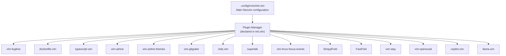
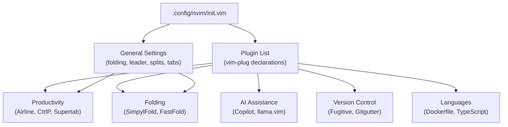
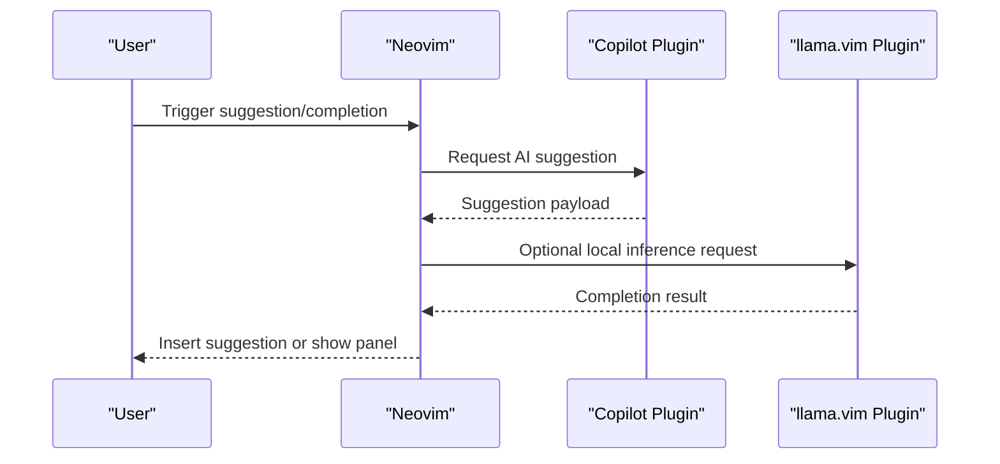
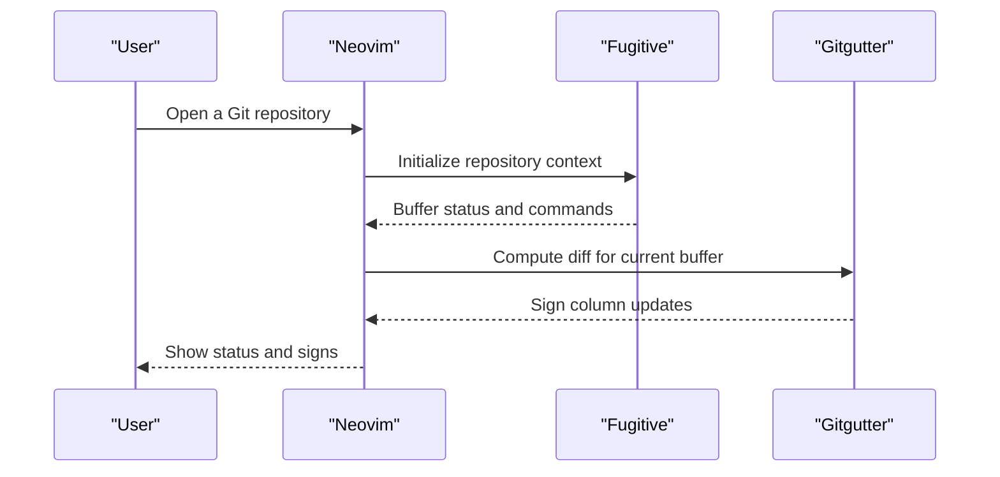
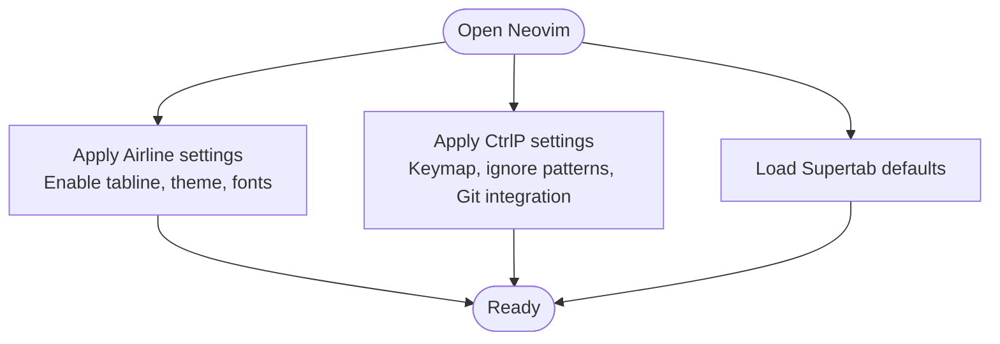
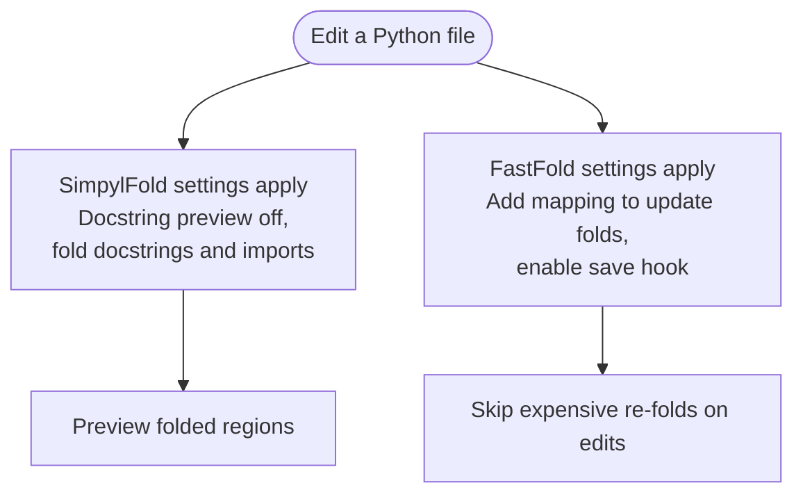
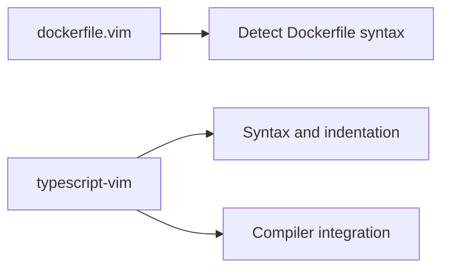
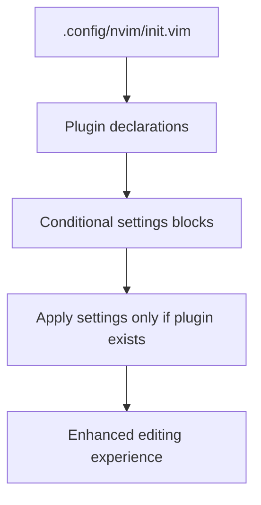

# Plugin Ecosystem

<cite>
**Referenced Files in This Document**
- [.config/nvim/init.vim](file://.config/nvim/init.vim)
- [.config/nvim/plugged/copilot.vim/README.md](file://.config/nvim/plugged/copilot.vim/README.md)
- [.config/nvim/plugged/llama.vim/README.md](file://.config/nvim/plugged/llama.vim/README.md)
- [.config/nvim/plugged/vim-fugitive/README.markdown](file://.config/nvim/plugged/vim-fugitive/README.markdown)
- [.config/nvim/plugged/vim-gitgutter/README.mkd](file://.config/nvim/plugged/vim-gitgutter/README.mkd)
- [.config/nvim/plugged/vim-airline/README.md](file://.config/nvim/plugged/vim-airline/README.md)
- [.config/nvim/plugged/ctrlp.vim/readme.md](file://.config/nvim/plugged/ctrlp.vim/readme.md)
- [.config/nvim/plugged/supertab/README.rst](file://.config/nvim/plugged/supertab/README.rst)
- [.config/nvim/plugged/SimpylFold/README.md](file://.config/nvim/plugged/SimpylFold/README.md)
- [.config/nvim/plugged/FastFold/README.md](file://.config/nvim/plugged/FastFold/README.md)
- [.config/nvim/plugged/dockerfile.vim/README.md](file://.config/nvim/plugged/dockerfile.vim/README.md)
- [.config/nvim/plugged/typescript-vim/README.md](file://.config/nvim/plugged/typescript-vim/README.md)
</cite>

## Table of Contents
1. [Introduction](#introduction)
2. [Project Structure](#project-structure)
3. [Core Components](#core-components)
4. [Architecture Overview](#architecture-overview)
5. [Detailed Component Analysis](#detailed-component-analysis)
6. [Dependency Analysis](#dependency-analysis)
7. [Performance Considerations](#performance-considerations)
8. [Troubleshooting Guide](#troubleshooting-guide)
9. [Conclusion](#conclusion)

## Introduction
This document describes the Neovim plugin ecosystem configured in this repository. It covers installation, configuration patterns, and customization options for 20+ plugins grouped into categories such as AI assistance (Copilot, llama.vim), version control integration (Fugitive, Gitgutter), productivity tools (Airline, CtrlP, Supertab), syntax highlighting and folding (SimpylFold, FastFold), and language support (Dockerfile, TypeScript). The guide also includes setup instructions, troubleshooting, and performance optimization tips tailored to the provided configuration.

## Project Structure
The Neovim configuration is centralized in a single initialization file that declares plugin dependencies and applies per-plugin settings. Plugins are managed via a plugin manager and live under the Neovim data directory. The configuration enables general editor behavior, folds, leader mappings, splits, tabs, and integrates with external tools.

**Diagram sources**
- [.config/nvim/init.vim](file://.config/nvim/init.vim#L137-L161)

**Section sources**
- [.config/nvim/init.vim](file://.config/nvim/init.vim#L1-L352)

## Core Components
This section outlines the primary plugin categories and their roles, derived from the configuration and plugin metadata.

- AI assistance
  - Copilot: GitHub’s AI pair programmer integration.
  - llama.vim: Local LLM client for Neovim using a llama.cpp server.
- Version control integration
  - Fugitive: Git wrapper for Neovim.
  - Gitgutter: Signs for tracked changes in the gutter.
- Productivity tools
  - Airline: Status/tab line enhancement.
  - CtrlP: Fuzzy file, buffer, MRU finder.
  - Supertab: Flexible completion using Tab.
- Syntax highlighting and folding
  - SimpylFold: Python folding improvements.
  - FastFold: Speeds up folding for large files.
- Language support
  - Dockerfile: Syntax and detection for Dockerfiles.
  - TypeScript: Syntax, indentation, and compiler support.

**Section sources**
- [.config/nvim/init.vim](file://.config/nvim/init.vim#L137-L161)
- [.config/nvim/init.vim](file://.config/nvim/init.vim#L273-L351)

## Architecture Overview
The plugin architecture centers on a declarative plugin list and targeted configuration blocks. Each plugin block checks for the plugin’s presence before applying settings, ensuring compatibility across environments. General editor behavior (folding, leader mappings, splits, tabs) is configured globally and interacts with plugins that extend navigation and productivity.

**Diagram sources**
- [.config/nvim/init.vim](file://.config/nvim/init.vim#L1-L352)

## Detailed Component Analysis

### AI Assistance
- Copilot
  - Purpose: Integrates GitHub Copilot suggestions into Neovim.
  - Installation: Declared via the plugin manager in the main configuration.
  - Configuration: No explicit overrides are applied in the configuration; defaults are used.
  - Customization: Review the plugin’s documentation for keymaps, status display, and account setup.
- llama.vim
  - Purpose: Provides local AI assistance using a llama.cpp server.
  - Installation: Declared via the plugin manager in the main configuration.
  - Configuration: The configuration includes a note indicating endpoint behavior; adjust endpoint and info visibility according to the plugin’s documentation.

**Diagram sources**
- [.config/nvim/init.vim](file://.config/nvim/init.vim#L155-L158)
- [.config/nvim/plugged/copilot.vim/README.md](file://.config/nvim/plugged/copilot.vim/README.md)
- [.config/nvim/plugged/llama.vim/README.md](file://.config/nvim/plugged/llama.vim/README.md)

**Section sources**
- [.config/nvim/init.vim](file://.config/nvim/init.vim#L155-L158)
- [.config/nvim/init.vim](file://.config/nvim/init.vim#L344-L351)
- [.config/nvim/plugged/copilot.vim/README.md](file://.config/nvim/plugged/copilot.vim/README.md)
- [.config/nvim/plugged/llama.vim/README.md](file://.config/nvim/plugged/llama.vim/README.md)

### Version Control Integration
- Fugitive
  - Purpose: Full Git wrapper for Neovim buffers and windows.
  - Installation: Declared via the plugin manager in the main configuration.
  - Configuration: No explicit overrides are applied in the configuration; defaults are used.
  - Customization: Explore the plugin’s documentation for commands, mappings, and status enhancements.
- Gitgutter
  - Purpose: Shows markers for added, modified, and removed lines in the sign column.
  - Installation: Declared via the plugin manager in the main configuration.
  - Configuration: No explicit overrides are applied in the configuration; defaults are used.
  - Customization: Review the plugin’s documentation for customizing signs and update triggers.

**Diagram sources**
- [.config/nvim/init.vim](file://.config/nvim/init.vim#L139-L146)
- [.config/nvim/plugged/vim-fugitive/README.markdown](file://.config/nvim/plugged/vim-fugitive/README.markdown)
- [.config/nvim/plugged/vim-gitgutter/README.mkd](file://.config/nvim/plugged/vim-gitgutter/README.mkd)

**Section sources**
- [.config/nvim/init.vim](file://.config/nvim/init.vim#L139-L146)
- [.config/nvim/plugged/vim-fugitive/README.markdown](file://.config/nvim/plugged/vim-fugitive/README.markdown)
- [.config/nvim/plugged/vim-gitgutter/README.mkd](file://.config/nvim/plugged/vim-gitgutter/README.mkd)

### Productivity Tools
- Airline
  - Purpose: Enhanced status line and tab line.
  - Installation: Declared via the plugin manager in the main configuration.
  - Configuration: Enables tabline extension, sets a theme, and activates powerline fonts.
  - Customization: Choose among included themes and configure separators and sections.
- CtrlP
  - Purpose: Fuzzy finder for files, buffers, and MRU items.
  - Installation: Declared via the plugin manager in the main configuration.
  - Configuration: Sets keybinding, ignores common binary and cache files, and integrates with Git.
  - Customization: Adjust ignore patterns and command mapping per project needs.
- Supertab
  - Purpose: Unified completion using Tab across different sources.
  - Installation: Declared via the plugin manager in the main configuration.
  - Configuration: No explicit overrides are applied in the configuration; defaults are used.
  - Customization: Review the plugin’s documentation for completion order and behavior.

**Diagram sources**
- [.config/nvim/init.vim](file://.config/nvim/init.vim#L291-L298)
- [.config/nvim/init.vim](file://.config/nvim/init.vim#L273-L289)
- [.config/nvim/init.vim](file://.config/nvim/init.vim#L291-L298)

**Section sources**
- [.config/nvim/init.vim](file://.config/nvim/init.vim#L291-L298)
- [.config/nvim/init.vim](file://.config/nvim/init.vim#L273-L289)
- [.config/nvim/init.vim](file://.config/nvim/init.vim#L291-L298)
- [.config/nvim/plugged/vim-airline/README.md](file://.config/nvim/plugged/vim-airline/README.md)
- [.config/nvim/plugged/ctrlp.vim/readme.md](file://.config/nvim/plugged/ctrlp.vim/readme.md)
- [.config/nvim/plugged/supertab/README.rst](file://.config/nvim/plugged/supertab/README.rst)

### Syntax Highlighting and Folding
- SimpylFold
  - Purpose: Improves Python folding behavior.
  - Installation: Declared via the plugin manager in the main configuration.
  - Configuration: Disables docstring preview, enables folding docstrings and imports.
  - Customization: Adjust folding granularity and preview behavior in the plugin’s documentation.
- FastFold
  - Purpose: Speeds up folding for large files.
  - Installation: Declared via the plugin manager in the main configuration.
  - Configuration: Adds a mapping to update folds and enables saving fold state.
  - Customization: Tune update intervals and caching behavior per project size.

**Diagram sources**
- [.config/nvim/init.vim](file://.config/nvim/init.vim#L323-L329)
- [.config/nvim/init.vim](file://.config/nvim/init.vim#L331-L336)

**Section sources**
- [.config/nvim/init.vim](file://.config/nvim/init.vim#L323-L329)
- [.config/nvim/init.vim](file://.config/nvim/init.vim#L331-L336)
- [.config/nvim/plugged/SimpylFold/README.md](file://.config/nvim/plugged/SimpylFold/README.md)
- [.config/nvim/plugged/FastFold/README.md](file://.config/nvim/plugged/FastFold/README.md)

### Language Support
- Dockerfile
  - Purpose: Syntax highlighting and detection for Dockerfiles.
  - Installation: Declared via the plugin manager in the main configuration.
  - Configuration: No explicit overrides are applied in the configuration; defaults are used.
  - Customization: Review the plugin’s documentation for additional syntax groups and detection rules.
- TypeScript
  - Purpose: Syntax, indentation, and compiler integration for TypeScript.
  - Installation: Declared via the plugin manager in the main configuration.
  - Configuration: No explicit overrides are applied in the configuration; defaults are used.
  - Customization: Consult the plugin’s documentation for compiler options and indentation preferences.

**Diagram sources**
- [.config/nvim/init.vim](file://.config/nvim/init.vim#L140-L141)
- [.config/nvim/init.vim](file://.config/nvim/init.vim#L140-L141)

**Section sources**
- [.config/nvim/init.vim](file://.config/nvim/init.vim#L140-L141)
- [.config/nvim/init.vim](file://.config/nvim/init.vim#L140-L141)
- [.config/nvim/plugged/dockerfile.vim/README.md](file://.config/nvim/plugged/dockerfile.vim/README.md)
- [.config/nvim/plugged/typescript-vim/README.md](file://.config/nvim/plugged/typescript-vim/README.md)

## Dependency Analysis
The plugin list is declared centrally and loaded conditionally by the plugin manager. Each plugin block checks for the plugin’s presence before applying settings, reducing errors when plugins are missing. Global editor settings (folding, leader mappings, splits, tabs) interact with productivity and folding plugins to improve usability.

**Diagram sources**
- [.config/nvim/init.vim](file://.config/nvim/init.vim#L137-L161)
- [.config/nvim/init.vim](file://.config/nvim/init.vim#L273-L351)

**Section sources**
- [.config/nvim/init.vim](file://.config/nvim/init.vim#L137-L161)
- [.config/nvim/init.vim](file://.config/nvim/init.vim#L273-L351)

## Performance Considerations
- Disable unused providers to reduce startup overhead.
- Use FastFold for large files to avoid slow re-folds during editing.
- Limit CtrlP ignore lists to relevant directories to keep scans efficient.
- Prefer theme and font settings that minimize redraw work.
- Keep plugin settings minimal and only enable features you actively use.

[No sources needed since this section provides general guidance]

## Troubleshooting Guide
- Plugins not loading
  - Ensure the plugin manager is installed and the plugin list is evaluated.
  - Verify plugin directories exist under the Neovim data directory.
- Copilot issues
  - Confirm account setup and network connectivity for suggestions.
  - Check plugin-specific keymaps and status indicators.
- llama.vim endpoint problems
  - Validate the local server endpoint and port.
  - Review plugin logs and adjust info visibility settings.
- Fugitive/Gitgutter not showing signs
  - Confirm the buffer is inside a Git repository.
  - Ensure Git is installed and accessible from Neovim.
- CtrlP not finding files
  - Verify ignore patterns and Git integration settings.
  - Rebuild CtrlP cache if necessary.
- Airline theme rendering
  - Confirm fonts support powerline glyphs.
  - Try a different theme if conflicts occur.

**Section sources**
- [.config/nvim/init.vim](file://.config/nvim/init.vim#L72-L81)
- [.config/nvim/init.vim](file://.config/nvim/init.vim#L344-L351)
- [.config/nvim/plugged/copilot.vim/README.md](file://.config/nvim/plugged/copilot.vim/README.md)
- [.config/nvim/plugged/llama.vim/README.md](file://.config/nvim/plugged/llama.vim/README.md)
- [.config/nvim/plugged/vim-fugitive/README.markdown](file://.config/nvim/plugged/vim-fugitive/README.markdown)
- [.config/nvim/plugged/vim-gitgutter/README.mkd](file://.config/nvim/plugged/vim-gitgutter/README.mkd)
- [.config/nvim/plugged/ctrlp.vim/readme.md](file://.config/nvim/plugged/ctrlp.vim/readme.md)
- [.config/nvim/plugged/vim-airline/README.md](file://.config/nvim/plugged/vim-airline/README.md)

## Conclusion
This Neovim setup organizes a robust plugin ecosystem around AI assistance, version control, productivity, folding, and language support. The configuration follows a modular pattern with conditional settings and a central plugin list. By understanding each plugin’s role and tuning its settings, users can optimize their editing workflow for speed, clarity, and collaboration.