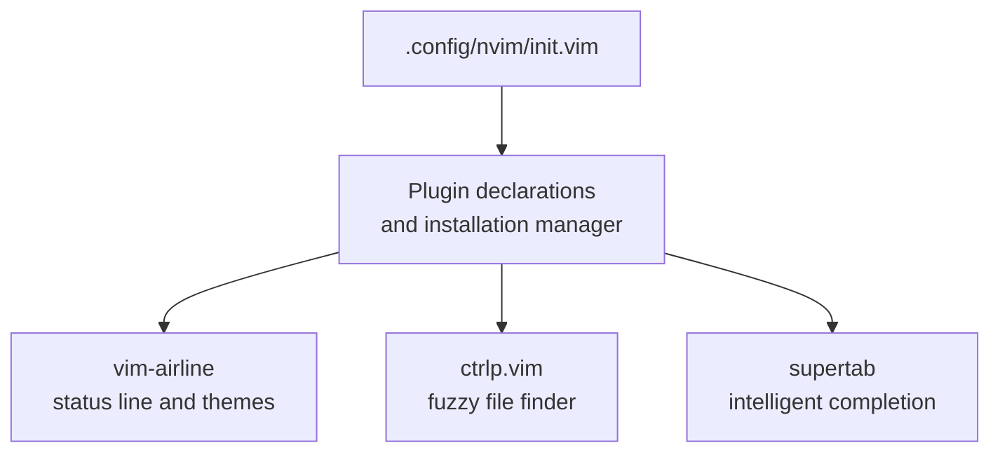
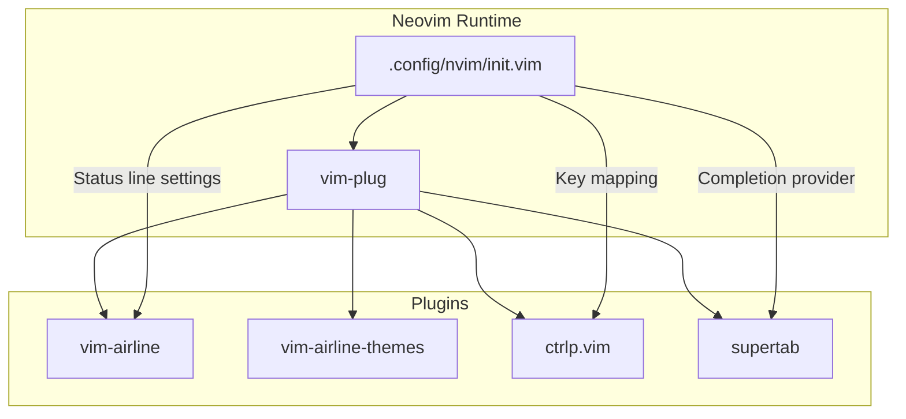
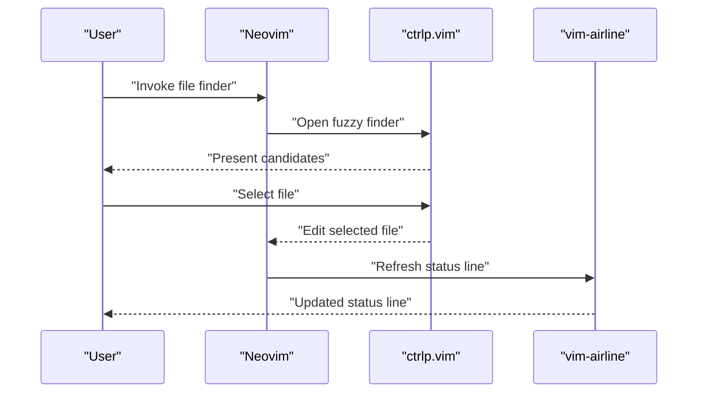
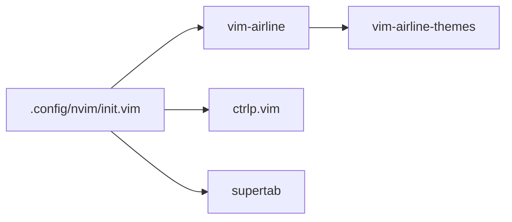

# Productivity Enhancement Plugins

<cite>
**Referenced Files in This Document**
- [.config/nvim/init.vim](file://.config/nvim/init.vim)
</cite>

## Table of Contents
1. [Introduction](#introduction)
2. [Project Structure](#project-structure)
3. [Core Components](#core-components)
4. [Architecture Overview](#architecture-overview)
5. [Detailed Component Analysis](#detailed-component-analysis)
6. [Dependency Analysis](#dependency-analysis)
7. [Performance Considerations](#performance-considerations)
8. [Troubleshooting Guide](#troubleshooting-guide)
9. [Conclusion](#conclusion)

## Introduction
This document explains how three productivity plugins integrate into a cohesive editing workflow:
- vim-airline: status line customization with theme support and extension integration
- ctrlp.vim: fuzzy file finding with custom ignore patterns and performance optimization
- supertab: intelligent completion with configurable priorities

It consolidates configuration examples, interaction patterns, and optimization tips for large codebases, grounded in the repository’s Neovim configuration.

## Project Structure
The Neovim configuration enables and tunes the plugins via a layered approach:
- Plugin declaration and installation management
- Global editor settings and mappings
- Per-plugin configuration blocks

**Diagram sources**
- [.config/nvim/init.vim](file://.config/nvim/init.vim#L137-L161)

**Section sources**
- [.config/nvim/init.vim](file://.config/nvim/init.vim#L137-L161)

## Core Components
- vim-airline
  - Enables tabline extension and sets a theme
  - Integrates with powerline-style fonts for enhanced visuals
  - Reference: [Airline configuration block](file://.config/nvim/init.vim#L291-L298)

- ctrlp.vim
  - Defines a key mapping and command
  - Configures ignored directories and file types
  - Uses .gitignore-aware scanning for performance
  - Reference: [CtrlP configuration block](file://.config/nvim/init.vim#L273-L289)

- supertab
  - Declared for installation; configuration is not present in this repository snapshot
  - Reference: [Supertab declaration](file://.config/nvim/init.vim#L147-L148)

**Section sources**
- [.config/nvim/init.vim](file://.config/nvim/init.vim#L147-L148)
- [.config/nvim/init.vim](file://.config/nvim/init.vim#L273-L289)
- [.config/nvim/init.vim](file://.config/nvim/init.vim#L291-L298)

## Architecture Overview
The plugins participate in a unified productivity pipeline:
- Status line (vim-airline) surfaces contextual information and theme
- File navigation (ctrlp.vim) accelerates opening files
- Completion (supertab) streamlines typing and snippet insertion

**Diagram sources**
- [.config/nvim/init.vim](file://.config/nvim/init.vim#L137-L161)
- [.config/nvim/init.vim](file://.config/nvim/init.vim#L262-L265)
- [.config/nvim/init.vim](file://.config/nvim/init.vim#L273-L289)
- [.config/nvim/init.vim](file://.config/nvim/init.vim#L291-L298)

## Detailed Component Analysis

### vim-airline: Status Line and Theme
- Tabline extension enabled with a unique-tail improved formatter
- Powerline-style fonts enabled for enhanced separators and glyphs
- Theme selected via a base16 palette variant

Configuration anchors:
- Tabline enable and formatter: [Tabline settings](file://.config/nvim/init.vim#L293-L294)
- Powerline fonts toggle: [Powerline fonts](file://.config/nvim/init.vim#L295)
- Theme selection: [Theme](file://.config/nvim/init.vim#L296)

Integration notes:
- The theme is loaded from the companion vim-airline-themes plugin, which is declared alongside vim-airline.
- Status line appearance is further influenced by global status line behavior and laststatus settings.

References:
- Status line behavior: [Status line settings](file://.config/nvim/init.vim#L262-L265)
- Plugin declarations: [Plugin list](file://.config/nvim/init.vim#L137-L161)

**Section sources**
- [.config/nvim/init.vim](file://.config/nvim/init.vim#L262-L265)
- [.config/nvim/init.vim](file://.config/nvim/init.vim#L291-L298)
- [.config/nvim/init.vim](file://.config/nvim/init.vim#L137-L161)

### ctrlp.vim: Fuzzy File Finding
- Key mapping and command configured for quick invocation
- Ignored entries include temporary directories, compiled binaries, and Python cache artifacts
- Custom ignore patterns target version control and binary files
- Git-aware scanning leverages .gitignore to avoid unnecessary traversal

Configuration anchors:
- Key mapping and command: [Key mapping](file://.config/nvim/init.vim#L275-L277)
- Wildignore entries: [Wildignore](file://.config/nvim/init.vim#L279-L280)
- Custom ignore dictionary: [Custom ignore](file://.config/nvim/init.vim#L281-L284)
- Git-aware user command: [Gitignore scanning](file://.config/nvim/init.vim#L286-L288)

Optimization for large codebases:
- Prefer .gitignore-aware scanning to skip irrelevant subtrees
- Keep wildignore and custom ignore concise to reduce candidate set
- Limit recursion depth by narrowing search scope (e.g., project root)

**Section sources**
- [.config/nvim/init.vim](file://.config/nvim/init.vim#L273-L289)

### supertab: Intelligent Completion
- Declared for installation via vim-plug
- No explicit configuration is present in this repository snapshot; defaults apply

Configuration anchors:
- Declaration: [Supertab declaration](file://.config/nvim/init.vim#L147-L148)

Note:
- Completion behavior depends on upstream defaults and any additional configuration not included here.

**Section sources**
- [.config/nvim/init.vim](file://.config/nvim/init.vim#L147-L148)

### Interaction Between Plugins
- Status line context: vim-airline informs the current file, branch, and mode, aiding orientation during CtrlP searches and after file edits.
- File navigation: ctrlp.vim opens files quickly; vim-airline updates to reflect the new buffer and tab context.
- Completion: supertab integrates with existing completion providers; vim-airline remains passive, while CtrlP focuses on file-level navigation.

**Diagram sources**
- [.config/nvim/init.vim](file://.config/nvim/init.vim#L273-L289)
- [.config/nvim/init.vim](file://.config/nvim/init.vim#L291-L298)

## Dependency Analysis
- Plugin dependencies
  - vim-airline depends on vim-airline-themes for theme availability
  - ctrlp.vim is independent but benefits from .gitignore-aware scanning
  - supertab is a completion provider; its behavior is independent of the others

- Coupling and cohesion
  - The configuration keeps each plugin’s settings localized and minimal
  - Global status line and laststatus settings influence vim-airline rendering

**Diagram sources**
- [.config/nvim/init.vim](file://.config/nvim/init.vim#L137-L161)
- [.config/nvim/init.vim](file://.config/nvim/init.vim#L291-L298)

**Section sources**
- [.config/nvim/init.vim](file://.config/nvim/init.vim#L137-L161)
- [.config/nvim/init.vim](file://.config/nvim/init.vim#L291-L298)

## Performance Considerations
- ctrlp.vim
  - Use .gitignore-aware scanning to avoid traversing ignored subtrees
  - Maintain minimal wildignore and custom ignore lists to reduce candidate generation
  - Narrow search scope to project roots to minimize filesystem IO

- vim-airline
  - Keep laststatus at 2 for consistent status line presence
  - Avoid overly complex status line customizations that trigger frequent redraws

- supertab
  - Defaults apply when no explicit configuration is present; tune completion priorities externally if needed

[No sources needed since this section provides general guidance]

## Troubleshooting Guide
- vim-airline
  - If the status line does not render, verify laststatus and ensure the plugin is installed
  - If theme colors appear incorrect, confirm the selected theme exists and powerline fonts are enabled

- ctrlp.vim
  - If CtrlP does not open, check the key mapping and command assignment
  - If ignored files still appear, review wildignore and custom ignore patterns and ensure .gitignore scanning is active

- supertab
  - If completion does not trigger, confirm the plugin is installed and that upstream completion providers are configured

- General
  - After installing plugins, reload the configuration to apply changes

**Section sources**
- [.config/nvim/init.vim](file://.config/nvim/init.vim#L262-L265)
- [.config/nvim/init.vim](file://.config/nvim/init.vim#L273-L289)
- [.config/nvim/init.vim](file://.config/nvim/init.vim#L291-L298)

## Conclusion
The repository demonstrates a focused, practical setup for productivity plugins:
- vim-airline enhances situational awareness with a clean theme and tabline
- ctrlp.vim accelerates file navigation with efficient ignore patterns and Git-aware scanning
- supertab is ready for intelligent completion with defaults applied

Together, they form a streamlined workflow optimized for speed and clarity, with straightforward configuration anchors and clear separation of concerns.