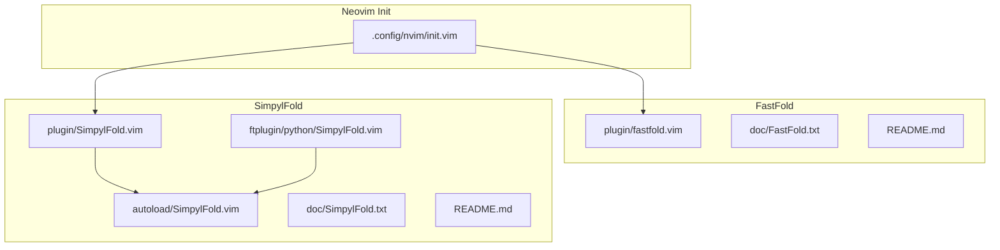
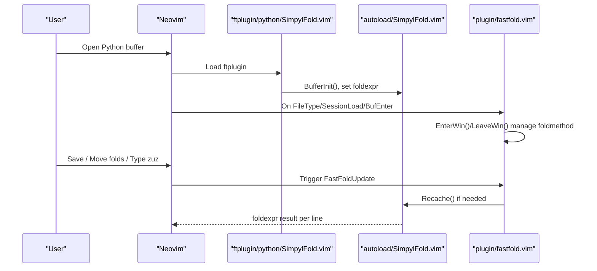
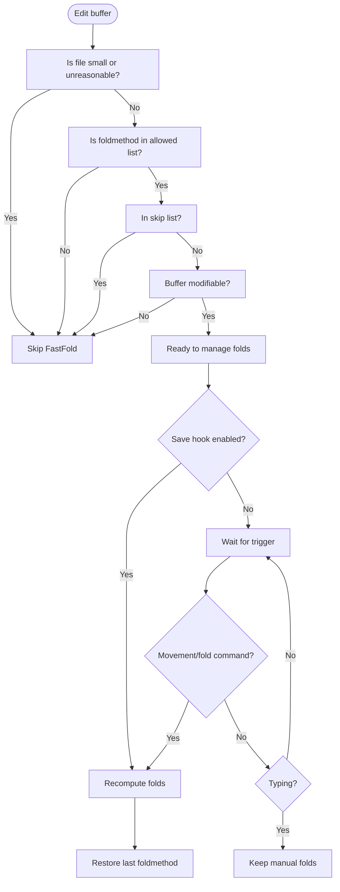
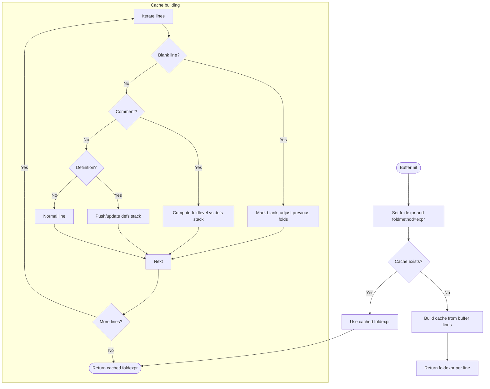
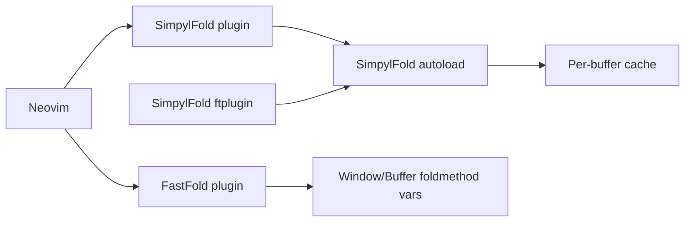

# Syntax Highlighting and Folding

<cite>
**Referenced Files in This Document**
- [fastfold.vim](file://.local/share/nvim/plugged/FastFold/plugin/fastfold.vim)
- [FastFold.txt](file://.local/share/nvim/plugged/FastFold/doc/FastFold.txt)
- [README.md](file://.local/share/nvim/plugged/FastFold/README.md)
- [SimpylFold.vim (plugin)](file://.local/share/nvim/plugged/SimpylFold/plugin/SimpylFold.vim)
- [SimpylFold.vim (autoload)](file://.local/share/nvim/plugged/SimpylFold/autoload/SimpylFold.vim)
- [SimpylFold.vim (ftplugin)](file://.local/share/nvim/plugged/SimpylFold/ftplugin/python/SimpylFold.vim)
- [SimpylFold.txt](file://.local/share/nvim/plugged/SimpylFold/doc/SimpylFold.txt)
- [README.md](file://.local/share/nvim/plugged/SimpylFold/README.md)
- [init.vim](file://.config/nvim/init.vim)
</cite>

## Table of Contents
1. [Introduction](#introduction)
2. [Project Structure](#project-structure)
3. [Core Components](#core-components)
4. [Architecture Overview](#architecture-overview)
5. [Detailed Component Analysis](#detailed-component-analysis)
6. [Dependency Analysis](#dependency-analysis)
7. [Performance Considerations](#performance-considerations)
8. [Troubleshooting Guide](#troubleshooting-guide)
9. [Conclusion](#conclusion)
10. [Appendices](#appendices)

## Introduction
This document explains how syntax highlighting and code folding integrate in Neovim with two focused plugins:
- FastFold: a performance-oriented folding engine that keeps folds static during editing and recomputes them only on specific triggers. It manages foldmethod lifecycles and integrates with save and movement events to minimize overhead.
- SimpylFold: a Python-specific folding plugin that computes fold expressions based on indentation and language-aware heuristics, caching parsed state for efficiency.

We cover FastFold’s cache management and fold expression optimization, SimpylFold’s indentation-based folding and language-aware logic, and how these interact with syntax highlighting and performance. We also provide configuration examples, performance tuning tips, and troubleshooting guidance for choosing the optimal folding strategy per file type and size.

## Project Structure
The relevant components are organized as follows:
- FastFold plugin: registers global settings, mappings, and autocommands; sets buffer/window-local foldmethod to manual during editing and restores it when needed.
- SimpylFold plugin: exposes commands to toggle folding options and delegates fold computation to an autoload module.
- SimpylFold autoload: builds a per-buffer cache of line classifications and computes fold expressions efficiently.
- SimpylFold ftplugin: initializes buffer-local options and sets foldmethod=expr with foldexpr bound to the autoload function.
- Neovim init: enables FastFold and SimpylFold and sets global defaults for foldmethod and language-specific folding.

**Diagram sources**
- [fastfold.vim](file://.local/share/nvim/plugged/FastFold/plugin/fastfold.vim#L1-L244)
- [FastFold.txt](file://.local/share/nvim/plugged/FastFold/doc/FastFold.txt#L1-L193)
- [README.md](file://.local/share/nvim/plugged/FastFold/README.md#L1-L161)
- [SimpylFold.vim (plugin)](file://.local/share/nvim/plugged/SimpylFold/plugin/SimpylFold.vim#L1-L8)
- [SimpylFold.vim (autoload)](file://.local/share/nvim/plugged/SimpylFold/autoload/SimpylFold.vim#L1-L397)
- [SimpylFold.vim (ftplugin)](file://.local/share/nvim/plugged/SimpylFold/ftplugin/python/SimpylFold.vim#L1-L17)
- [SimpylFold.txt](file://.local/share/nvim/plugged/SimpylFold/doc/SimpylFold.txt#L1-L72)
- [README.md](file://.local/share/nvim/plugged/SimpylFold/README.md#L1-L83)
- [init.vim](file://.config/nvim/init.vim#L47-L53)
- [init.vim](file://.config/nvim/init.vim#L323-L336)

**Section sources**
- [fastfold.vim](file://.local/share/nvim/plugged/FastFold/plugin/fastfold.vim#L1-L244)
- [SimpylFold.vim (plugin)](file://.local/share/nvim/plugged/SimpylFold/plugin/SimpylFold.vim#L1-L8)
- [SimpylFold.vim (autoload)](file://.local/share/nvim/plugged/SimpylFold/autoload/SimpylFold.vim#L1-L397)
- [SimpylFold.vim (ftplugin)](file://.local/share/nvim/plugged/SimpylFold/ftplugin/python/SimpylFold.vim#L1-L17)
- [init.vim](file://.config/nvim/init.vim#L47-L53)
- [init.vim](file://.config/nvim/init.vim#L323-L336)

## Core Components
- FastFold
  - Keeps foldmethod=manual during editing and switches to the last used non-manual foldmethod when needed.
  - Triggers recomputation on save, fold commands, movement, and a dedicated mapping.
  - Provides configuration for which triggers to enable and which filetypes to skip.
- SimpylFold
  - Initializes buffer-local folding options and sets foldmethod=expr with a foldexpr bound to an autoload function.
  - Computes fold levels based on indentation and language constructs, caching parsed state for performance.
  - Offers commands to toggle docstring and import folding and to recache.

**Section sources**
- [fastfold.vim](file://.local/share/nvim/plugged/FastFold/plugin/fastfold.vim#L27-L42)
- [fastfold.vim](file://.local/share/nvim/plugged/FastFold/plugin/fastfold.vim#L168-L184)
- [fastfold.vim](file://.local/share/nvim/plugged/FastFold/plugin/fastfold.vim#L186-L239)
- [SimpylFold.vim (plugin)](file://.local/share/nvim/plugged/SimpylFold/plugin/SimpylFold.vim#L1-L8)
- [SimpylFold.vim (ftplugin)](file://.local/share/nvim/plugged/SimpylFold/ftplugin/python/SimpylFold.vim#L6-L12)
- [SimpylFold.vim (autoload)](file://.local/share/nvim/plugged/SimpylFold/autoload/SimpylFold.vim#L15-L36)
- [SimpylFold.vim (autoload)](file://.local/share/nvim/plugged/SimpylFold/autoload/SimpylFold.vim#L354-L367)

## Architecture Overview
FastFold orchestrates when folds are computed, minimizing re-computation during editing. SimpylFold provides the fold expression and caching logic for Python. Together they ensure efficient folding for large files and smooth editing performance.

**Diagram sources**
- [SimpylFold.vim (ftplugin)](file://.local/share/nvim/plugged/SimpylFold/ftplugin/python/SimpylFold.vim#L6-L12)
- [SimpylFold.vim (autoload)](file://.local/share/nvim/plugged/SimpylFold/autoload/SimpylFold.vim#L15-L36)
- [SimpylFold.vim (autoload)](file://.local/share/nvim/plugged/SimpylFold/autoload/SimpylFold.vim#L354-L367)
- [fastfold.vim](file://.local/share/nvim/plugged/FastFold/plugin/fastfold.vim#L186-L239)

## Detailed Component Analysis

### FastFold: Performance-Focused Folding Engine
FastFold reduces CPU overhead by switching foldmethod to manual during editing and recomputing folds only on specific triggers. It also manages window-local foldmethod lifecycles and integrates with save and movement events.

Key behaviors:
- Global defaults and customization:
  - g:fastfold_savehook, g:fastfold_fdmhook, g:fastfold_foldmethods, g:fastfold_skip_filetypes, g:fastfold_minlines, g:fastfold_fold_command_suffixes, g:fastfold_fold_movement_commands.
- Lifecycle management:
  - EnterWin/LeaveWin adjust foldmethod per window and buffer.
  - UpdateBuf/UpdateTab propagate changes across windows/buffers.
- Triggers:
  - Save hook, fold command suffixes, movement commands, and a dedicated mapping zuz.

**Diagram sources**
- [fastfold.vim](file://.local/share/nvim/plugged/FastFold/plugin/fastfold.vim#L138-L166)
- [fastfold.vim](file://.local/share/nvim/plugged/FastFold/plugin/fastfold.vim#L186-L239)

**Section sources**
- [fastfold.vim](file://.local/share/nvim/plugged/FastFold/plugin/fastfold.vim#L27-L42)
- [fastfold.vim](file://.local/share/nvim/plugged/FastFold/plugin/fastfold.vim#L44-L73)
- [fastfold.vim](file://.local/share/nvim/plugged/FastFold/plugin/fastfold.vim#L104-L128)
- [fastfold.vim](file://.local/share/nvim/plugged/FastFold/plugin/fastfold.vim#L168-L184)
- [fastfold.vim](file://.local/share/nvim/plugged/FastFold/plugin/fastfold.vim#L186-L239)
- [FastFold.txt](file://.local/share/nvim/plugged/FastFold/doc/FastFold.txt#L24-L130)
- [README.md](file://.local/share/nvim/plugged/FastFold/README.md#L21-L114)

### SimpylFold: Python-Specific Folding with Indentation and Heuristics
SimpylFold sets foldmethod=expr and computes fold levels based on indentation and language constructs. It caches a per-line classification and fold expression to avoid repeated parsing.

Key behaviors:
- Buffer initialization:
  - Defines language-specific definition patterns and sets buffer-local folding options.
- Indentation calculation:
  - Computes indentation considering softtabstop/shiftwidth/tabstop and adjusts for special cases.
- Caching and fold expression:
  - Builds a cache of line attributes (blank/comment/definition/indent) and foldexpr values.
  - foldexpr returns cached fold levels; Recache invalidates cache.
- Language-aware heuristics:
  - Recognizes docstrings, imports, multiline strings, and continuation lines.
  - Adjusts fold levels for blanks/comments and prunes definitions stack based on indentation.

**Diagram sources**
- [SimpylFold.vim (ftplugin)](file://.local/share/nvim/plugged/SimpylFold/ftplugin/python/SimpylFold.vim#L6-L12)
- [SimpylFold.vim (autoload)](file://.local/share/nvim/plugged/SimpylFold/autoload/SimpylFold.vim#L15-L36)
- [SimpylFold.vim (autoload)](file://.local/share/nvim/plugged/SimpylFold/autoload/SimpylFold.vim#L174-L352)
- [SimpylFold.vim (autoload)](file://.local/share/nvim/plugged/SimpylFold/autoload/SimpylFold.vim#L354-L367)

**Section sources**
- [SimpylFold.vim (ftplugin)](file://.local/share/nvim/plugged/SimpylFold/ftplugin/python/SimpylFold.vim#L1-L17)
- [SimpylFold.vim (autoload)](file://.local/share/nvim/plugged/SimpylFold/autoload/SimpylFold.vim#L15-L36)
- [SimpylFold.vim (autoload)](file://.local/share/nvim/plugged/SimpylFold/autoload/SimpylFold.vim#L38-L46)
- [SimpylFold.vim (autoload)](file://.local/share/nvim/plugged/SimpylFold/autoload/SimpylFold.vim#L48-L59)
- [SimpylFold.vim (autoload)](file://.local/share/nvim/plugged/SimpylFold/autoload/SimpylFold.vim#L61-L71)
- [SimpylFold.vim (autoload)](file://.local/share/nvim/plugged/SimpylFold/autoload/SimpylFold.vim#L73-L100)
- [SimpylFold.vim (autoload)](file://.local/share/nvim/plugged/SimpylFold/autoload/SimpylFold.vim#L174-L352)
- [SimpylFold.vim (autoload)](file://.local/share/nvim/plugged/SimpylFold/autoload/SimpylFold.vim#L354-L367)
- [SimpylFold.txt](file://.local/share/nvim/plugged/SimpylFold/doc/SimpylFold.txt#L24-L61)

### Relationship Between Syntax Highlighting and Folding Performance
- Syntax highlighting and folding are separate systems in Neovim. Syntax highlighting determines colors; folding determines which regions collapse.
- Automatic fold methods (expr/syntax) compute fold levels on demand. In insert mode, frequent recomputation can cause noticeable lag.
- FastFold mitigates this by keeping foldmethod=manual during editing and recomputing folds only on specific triggers, reducing CPU usage and improving responsiveness.
- SimpylFold’s cache ensures foldexpr evaluation remains fast even for moderately large Python files.

**Section sources**
- [FastFold.txt](file://.local/share/nvim/plugged/FastFold/doc/FastFold.txt#L7-L22)
- [README.md](file://.local/share/nvim/plugged/FastFold/README.md#L3-L19)
- [SimpylFold.vim (autoload)](file://.local/share/nvim/plugged/SimpylFold/autoload/SimpylFold.vim#L174-L352)

## Dependency Analysis
FastFold depends on Neovim’s autocmd system and window/buffer variables to coordinate foldmethod transitions. SimpylFold depends on its autoload module for fold expression computation and on ftplugin for initialization and event hooks.

**Diagram sources**
- [fastfold.vim](file://.local/share/nvim/plugged/FastFold/plugin/fastfold.vim#L186-L239)
- [SimpylFold.vim (plugin)](file://.local/share/nvim/plugged/SimpylFold/plugin/SimpylFold.vim#L1-L8)
- [SimpylFold.vim (autoload)](file://.local/share/nvim/plugged/SimpylFold/autoload/SimpylFold.vim#L15-L36)
- [SimpylFold.vim (ftplugin)](file://.local/share/nvim/plugged/SimpylFold/ftplugin/python/SimpylFold.vim#L6-L12)

**Section sources**
- [fastfold.vim](file://.local/share/nvim/plugged/FastFold/plugin/fastfold.vim#L186-L239)
- [SimpylFold.vim (ftplugin)](file://.local/share/nvim/plugged/SimpylFold/ftplugin/python/SimpylFold.vim#L6-L12)
- [SimpylFold.vim (autoload)](file://.local/share/nvim/plugged/SimpylFold/autoload/SimpylFold.vim#L15-L36)

## Performance Considerations
- Prefer expr/syntax folding only when necessary:
  - FastFold keeps foldmethod=manual during editing to avoid expensive recomputation.
  - Use FastFold’s triggers (save, fold commands, movement, mapping) to update folds when needed.
- Tune thresholds:
  - Increase g:fastfold_minlines to apply FastFold to smaller files if desired.
  - Customize g:fastfold_foldmethods to include expr when needed.
- Optimize Python folding:
  - Enable docstring and import folding selectively via buffer-local variables.
  - Recache only when text changes significantly (TextChanged/InsertLeave).
- Large files:
  - FastFold’s window-local foldmethod management prevents unnecessary recomputation.
  - SimpylFold’s cache avoids repeated parsing; keep foldmethod=expr for Python.

[No sources needed since this section provides general guidance]

## Troubleshooting Guide
Common issues and resolutions:
- Manual folds overwritten on save:
  - Ensure g:fastfold_skip_filetypes excludes the filetype or set foldmethod=manual upon entry.
  - Consider session options adjustments to avoid overriding folds.
- Folds not updating:
  - Verify save hook and movement/fold command suffixes are enabled.
  - Use the zuz mapping to force an update.
- Python folds incorrect:
  - Toggle docstring/import folding with buffer-local commands.
  - Recache after major structural changes.
- Conflicts with other plugins:
  - Disable g:fastfold_fdmhook if it interferes with OptionSet handlers.

**Section sources**
- [FastFold.txt](file://.local/share/nvim/plugged/FastFold/doc/FastFold.txt#L169-L180)
- [README.md](file://.local/share/nvim/plugged/FastFold/README.md#L115-L125)
- [SimpylFold.txt](file://.local/share/nvim/plugged/SimpylFold/doc/SimpylFold.txt#L68-L72)
- [SimpylFold.vim (plugin)](file://.local/share/nvim/plugged/SimpylFold/plugin/SimpylFold.vim#L6-L7)
- [SimpylFold.vim (ftplugin)](file://.local/share/nvim/plugged/SimpylFold/ftplugin/python/SimpylFold.vim#L10-L12)

## Conclusion
FastFold and SimpylFold together deliver a robust, performance-conscious folding experience:
- FastFold minimizes recomputation by keeping folds static during editing and recomputing only on targeted events.
- SimpylFold provides accurate, language-aware folding for Python with caching for efficiency.
By combining these approaches and tuning configuration variables, you can achieve responsive folding across file sizes and types.

[No sources needed since this section summarizes without analyzing specific files]

## Appendices

### Configuration Examples
- Enable FastFold globally and customize triggers:
  - Map zuz to a preferred key.
  - Enable save hook and configure fold command suffixes and movement commands.
  - Optionally force expr/syntax folding for specific filetypes.
- Enable SimpylFold for Python and tune folding options:
  - Enable docstring and import folding.
  - Optionally preview docstrings in fold text.
  - Toggle folding options per buffer with provided commands.

**Section sources**
- [init.vim](file://.config/nvim/init.vim#L47-L53)
- [init.vim](file://.config/nvim/init.vim#L323-L336)
- [FastFold.txt](file://.local/share/nvim/plugged/FastFold/doc/FastFold.txt#L41-L130)
- [README.md](file://.local/share/nvim/plugged/FastFold/README.md#L21-L114)
- [SimpylFold.txt](file://.local/share/nvim/plugged/SimpylFold/doc/SimpylFold.txt#L24-L61)
- [README.md](file://.local/share/nvim/plugged/SimpylFold/README.md#L34-L68)

### Choosing the Optimal Folding Strategy
- Small files (< threshold):
  - Manual or expr/syntax folding may suffice; FastFold’s triggers still help avoid unnecessary recomputation.
- Medium files:
  - Use expr/syntax folding with FastFold triggers to balance responsiveness and correctness.
- Large files:
  - Prefer expr/syntax folding with FastFold’s window-local foldmethod management and SimpylFold’s cache for Python.
- Mixed content:
  - Keep foldmethod=manual during editing; rely on FastFold triggers to update folds when needed.
- Python-specific:
  - Use SimpylFold’s expr-based folding with docstring/import toggles for readability.

[No sources needed since this section provides general guidance]