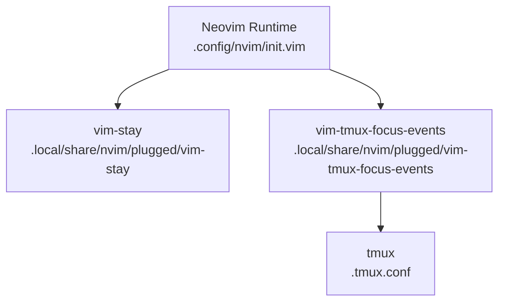
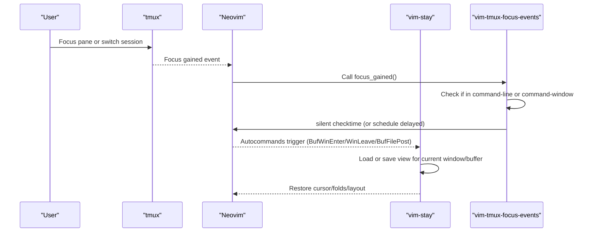
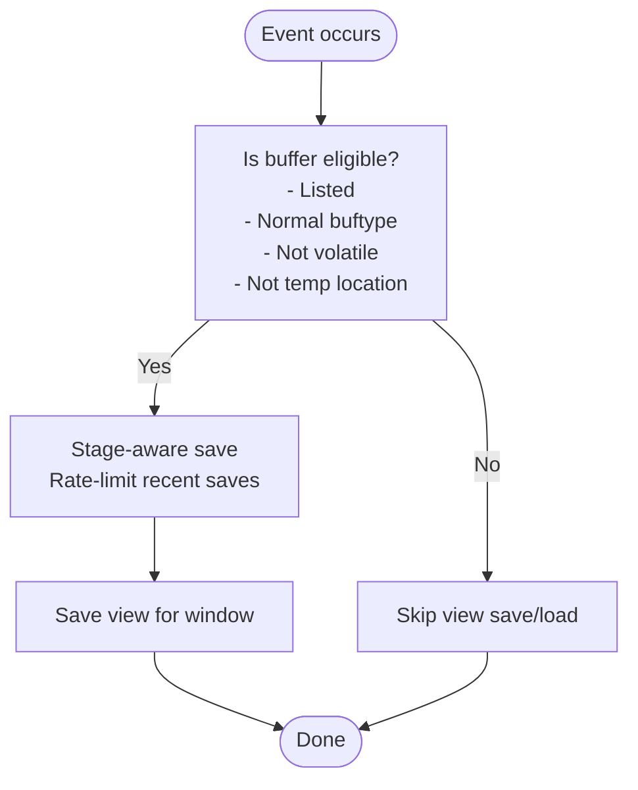
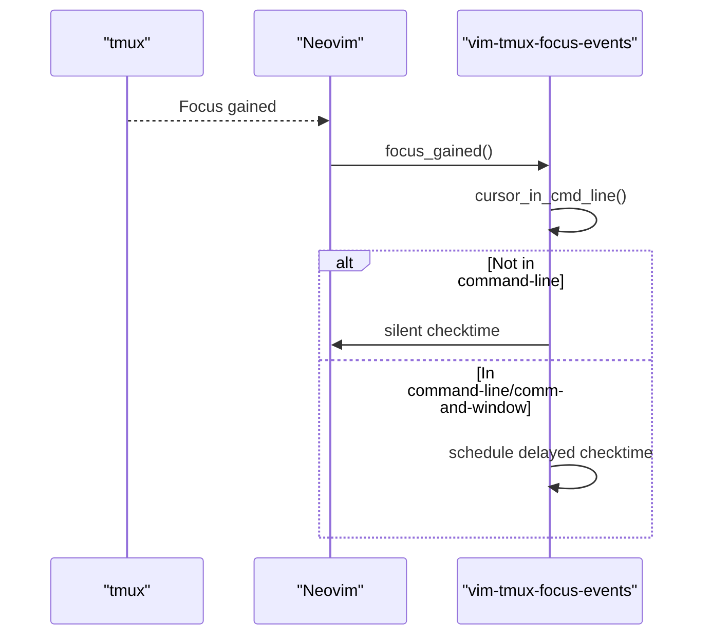
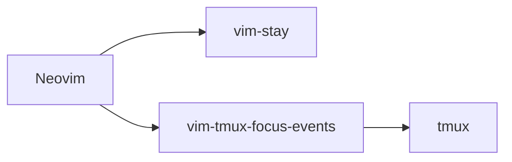

# Terminal Integration Plugins

<cite>
**Referenced Files in This Document**
- [init.vim](file://.config/nvim/init.vim)
- [.tmux.conf](file://.tmux.conf)
- [stay.vim](file://.local/share/nvim/plugged/vim-stay/plugin/stay.vim)
- [stay.vim](file://.local/share/nvim/plugged/vim-stay/autoload/stay.vim)
- [tmux_focus_events.vim](file://.local/share/nvim/plugged/vim-tmux-focus-events/autoload/tmux_focus_events.vim)
</cite>

## Table of Contents
1. [Introduction](#introduction)
2. [Project Structure](#project-structure)
3. [Core Components](#core-components)
4. [Architecture Overview](#architecture-overview)
5. [Detailed Component Analysis](#detailed-component-analysis)
6. [Dependency Analysis](#dependency-analysis)
7. [Performance Considerations](#performance-considerations)
8. [Troubleshooting Guide](#troubleshooting-guide)
9. [Conclusion](#conclusion)

## Introduction
This document explains two terminal-focused Neovim plugins integrated in this configuration:
- vim-stay: a session persistence system that maintains window layouts and file positions across Neovim restarts.
- vim-tmux-focus-events: a plugin that integrates Neovim with tmux by responding to focus changes, enabling pane management and clipboard sharing behaviors.

These plugins improve developer productivity in terminal-based workflows by reducing context switching and keeping editing state consistent across sessions and terminal environments.

## Project Structure
The Neovim configuration enables both plugins and sets minimal integration options. Tmux is configured separately with plugins for session restoration and clipboard sharing.

**Diagram sources**
- [init.vim](file://.config/nvim/init.vim#L137-L161)
- [stay.vim](file://.local/share/nvim/plugged/vim-stay/plugin/stay.vim#L136-L137)
- [tmux_focus_events.vim](file://.local/share/nvim/plugged/vim-tmux-focus-events/autoload/tmux_focus_events.vim#L1-L41)
- [.tmux.conf](file://.tmux.conf#L56-L68)

**Section sources**
- [init.vim](file://.config/nvim/init.vim#L137-L161)
- [.tmux.conf](file://.tmux.conf#L56-L68)

## Core Components
- vim-stay
  - Automatically saves and restores window layout and cursor/fold state for persistent buffers.
  - Uses autocommands to capture views on buffer/window changes and load them on buffer visibility.
  - Provides cleanup and reload commands for view directories.
- vim-tmux-focus-events
  - Responds to focus gained events to trigger Neovim’s file change detection safely.
  - Integrates with tmux to keep Neovim synchronized with external file changes and clipboard sharing.

Configuration highlights in this repository:
- vim-stay is enabled and tuned to persist cursor, folds, slashes, and Unix-specific options.
- vim-tmux-focus-events is installed and ready to handle focus events.

**Section sources**
- [init.vim](file://.config/nvim/init.vim#L338-L342)
- [stay.vim](file://.local/share/nvim/plugged/vim-stay/plugin/stay.vim#L77-L108)
- [tmux_focus_events.vim](file://.local/share/nvim/plugged/vim-tmux-focus-events/autoload/tmux_focus_events.vim#L27-L40)

## Architecture Overview
The terminal integration architecture connects Neovim with tmux and its ecosystem. vim-stay operates purely inside Neovim to preserve editing state. vim-tmux-focus-events bridges Neovim and tmux by reacting to focus changes and invoking Neovim’s change detection.

**Diagram sources**
- [tmux_focus_events.vim](file://.local/share/nvim/plugged/vim-tmux-focus-events/autoload/tmux_focus_events.vim#L27-L40)
- [stay.vim](file://.local/share/nvim/plugged/vim-stay/plugin/stay.vim#L86-L101)

## Detailed Component Analysis

### vim-stay: Session Persistence
vim-stay captures and restores window and buffer views automatically. It decides whether a buffer is eligible for persistence and ensures views are saved and loaded at appropriate times.

Key behaviors:
- Eligibility checks exclude volatile file types, preview/diff windows, and temporary locations.
- Autocommands:
  - On buffer/window enter: load view if present.
  - On leaving a window: save view.
  - On buffer file post/write: save view.
- Utility commands:
  - CleanViewdir: cleans stale view files.
  - StayReload: reloads plugin setup and integrations.

**Diagram sources**
- [stay.vim](file://.local/share/nvim/plugged/vim-stay/plugin/stay.vim#L38-L60)
- [stay.vim](file://.local/share/nvim/plugged/vim-stay/autoload/stay.vim#L10-L33)

Implementation notes:
- Persistence options are configured to include cursor, folds, slash, and Unix-specific settings.
- Volatile file types (e.g., commit/edit windows) are excluded by default.

**Section sources**
- [stay.vim](file://.local/share/nvim/plugged/vim-stay/plugin/stay.vim#L11-L27)
- [stay.vim](file://.local/share/nvim/plugged/vim-stay/plugin/stay.vim#L77-L108)
- [stay.vim](file://.local/share/nvim/plugged/vim-stay/autoload/stay.vim#L10-L33)
- [init.vim](file://.config/nvim/init.vim#L338-L342)

### vim-tmux-focus-events: tmux Integration
This plugin listens for focus gained events and triggers Neovim’s file change detection safely, avoiding conflicts with command-line windows.

Key behaviors:
- Detects if the cursor is in the command-line or command-window.
- Runs silent checktime immediately if not in command-line contexts.
- Schedules delayed checktime if invoked from command-line contexts.

**Diagram sources**
- [tmux_focus_events.vim](file://.local/share/nvim/plugged/vim-tmux-focus-events/autoload/tmux_focus_events.vim#L8-L25)
- [tmux_focus_events.vim](file://.local/share/nvim/plugged/vim-tmux-focus-events/autoload/tmux_focus_events.vim#L27-L40)

Integration with tmux:
- The tmux configuration enables plugins for session restoration and clipboard sharing, complementing vim-stay’s Neovim-side persistence.

**Section sources**
- [tmux_focus_events.vim](file://.local/share/nvim/plugged/vim-tmux-focus-events/autoload/tmux_focus_events.vim#L1-L41)
- [.tmux.conf](file://.tmux.conf#L56-L68)

## Dependency Analysis
- vim-stay depends on Neovim’s session/view mechanisms and autocommands. It does not depend on tmux.
- vim-tmux-focus-events depends on tmux focus events and Neovim’s checktime mechanism. It does not depend on vim-stay.
- Both plugins are initialized by Neovim’s plugin manager and are configured minimally in this repository.

**Diagram sources**
- [init.vim](file://.config/nvim/init.vim#L137-L161)
- [stay.vim](file://.local/share/nvim/plugged/vim-stay/plugin/stay.vim#L136-L137)
- [tmux_focus_events.vim](file://.local/share/nvim/plugged/vim-tmux-focus-events/autoload/tmux_focus_events.vim#L1-L41)
- [.tmux.conf](file://.tmux.conf#L56-L68)

**Section sources**
- [init.vim](file://.config/nvim/init.vim#L137-L161)
- [stay.vim](file://.local/share/nvim/plugged/vim-stay/plugin/stay.vim#L136-L137)
- [tmux_focus_events.vim](file://.local/share/nvim/plugged/vim-tmux-focus-events/autoload/tmux_focus_events.vim#L1-L41)
- [.tmux.conf](file://.tmux.conf#L56-L68)

## Performance Considerations
- vim-stay rate-limits frequent view saves to avoid excessive disk writes during rapid buffer/window changes.
- Eligibility checks filter out non-persistent buffers (e.g., volatile file types, preview/diff windows) to reduce unnecessary work.
- vim-tmux-focus-events avoids blocking operations by scheduling delayed checktime when invoked from command-line contexts.

[No sources needed since this section provides general guidance]

## Troubleshooting Guide
Common issues and resolutions:
- Focus events not triggering checktime
  - Ensure Neovim’s autoread is enabled so checktime can run.
  - Verify focus gained is reaching Neovim (e.g., tmux focus settings).
  - Confirm the plugin is loaded and focus_gained is callable.
- Views not loading after restart
  - Confirm buffers are eligible for persistence (listed, normal buftype, not volatile, not temp).
  - Verify view files exist for the current window/buffer.
  - Use the StayReload command to refresh plugin setup if needed.
- Cleaning stale views
  - Use the CleanViewdir command to remove outdated view files.

**Section sources**
- [tmux_focus_events.vim](file://.local/share/nvim/plugged/vim-tmux-focus-events/autoload/tmux_focus_events.vim#L27-L40)
- [stay.vim](file://.local/share/nvim/plugged/vim-stay/plugin/stay.vim#L104-L107)
- [stay.vim](file://.local/share/nvim/plugged/vim-stay/autoload/stay.vim#L10-L33)

## Conclusion
vim-stay and vim-tmux-focus-events together streamline terminal-based development:
- vim-stay preserves your editing context across Neovim restarts.
- vim-tmux-focus-events keeps Neovim synchronized with tmux focus changes and external file updates.

With minimal configuration in this repository, both plugins are ready to enhance your workflow in terminal environments.