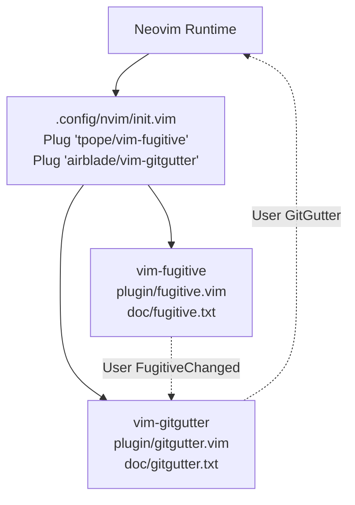
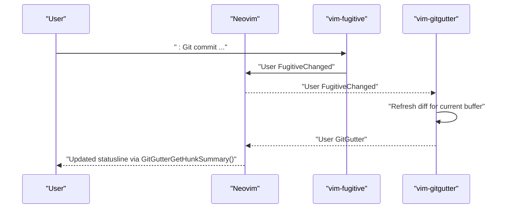
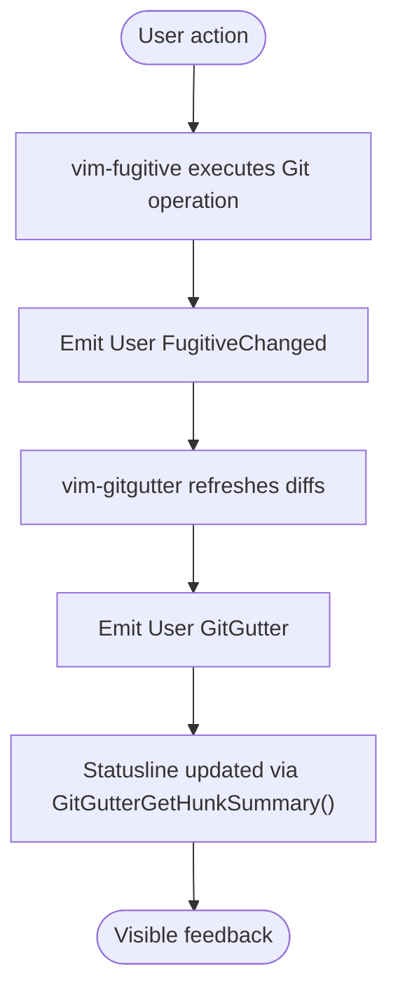
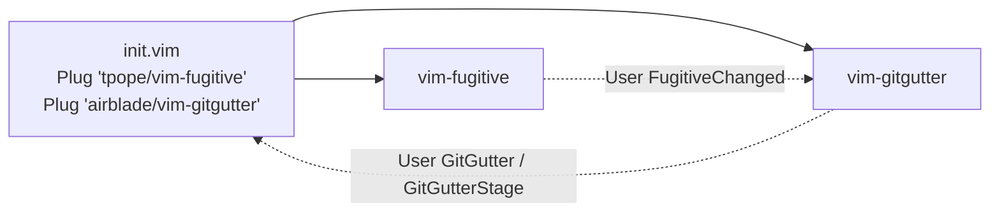

# Version Control Integration

<cite>
**Referenced Files in This Document**
- [init.vim](file://.config/nvim/init.vim)
- [fugitive.vim](file://.local/share/nvim/plugged/vim-fugitive/plugin/fugitive.vim)
- [fugitive.txt](file://.local/share/nvim/plugged/vim-fugitive/doc/fugitive.txt)
- [gitgutter.vim](file://.local/share/nvim/plugged/vim-gitgutter/plugin/gitgutter.vim)
- [gitgutter.txt](file://.local/share/nvim/plugged/vim-gitgutter/doc/gitgutter.txt)
- [autoload/gitgutter.vim](file://.local/share/nvim/plugged/vim-gitgutter/autoload/gitgutter.vim)
- [fugitive.vim](file://.local/share/nvim/plugged/vim-fugitive/autoload/fugitive.vim)
</cite>

## Table of Contents
1. [Introduction](#introduction)
2. [Project Structure](#project-structure)
3. [Core Components](#core-components)
4. [Architecture Overview](#architecture-overview)
5. [Detailed Component Analysis](#detailed-component-analysis)
6. [Dependency Analysis](#dependency-analysis)
7. [Performance Considerations](#performance-considerations)
8. [Troubleshooting Guide](#troubleshooting-guide)
9. [Conclusion](#conclusion)
10. [Appendices](#appendices)

## Introduction
This document explains how vim-fugitive and vim-gitgutter integrate to provide a powerful Git workflow inside Neovim. Together they offer:
- A Git wrapper with a broad set of commands and maps for committing, branching, diffing, blaming, and stashing
- Real-time change tracking with visual indicators in the sign column, plus hunk navigation and staging workflows
- Seamless interoperability through shared events and status-line integration

The configuration in this repository enables both plugins and demonstrates how to wire them together for efficient daily development.

## Project Structure
The relevant pieces are:
- Neovim configuration enabling the plugins and basic environment
- vim-fugitive plugin providing Git commands and maps
- vim-gitgutter plugin providing real-time diff signs and hunk operations

**Diagram sources**
- [init.vim](file://.config/nvim/init.vim#L137-L161)
- [fugitive.vim](file://.local/share/nvim/plugged/vim-fugitive/plugin/fugitive.vim#L315-L315)
- [gitgutter.vim](file://.local/share/nvim/plugged/vim-gitgutter/plugin/gitgutter.vim#L315-L315)

**Section sources**
- [init.vim](file://.config/nvim/init.vim#L137-L161)

## Core Components
- vim-fugitive
  - Provides the :Git command family and object-based editing (blobs, commits, trees)
  - Offers staging/unstaging, committing, merging, rebasing, browsing, and blame
  - Integrates with the statusline via FugitiveStatusline()
- vim-gitgutter
  - Shows signs for added/modified/deleted lines
  - Provides hunk navigation, preview, staging, and undo
  - Emits User GitGutter and User GitGutterStage events for integration

Key integration points:
- Both plugins emit User events that can drive status lines and other integrations
- vim-fugitive’s :Git commands trigger User FugitiveChanged, which vim-gitgutter listens to refresh diffs

**Section sources**
- [fugitive.txt](file://.local/share/nvim/plugged/vim-fugitive/doc/fugitive.txt#L646-L654)
- [gitgutter.txt](file://.local/share/nvim/plugged/vim-gitgutter/doc/gitgutter.txt#L244-L252)
- [gitgutter.txt](file://.local/share/nvim/plugged/vim-gitgutter/doc/gitgutter.txt#L256-L259)

## Architecture Overview
The two plugins coordinate primarily through Neovim’s User autocommands and status-line functions.

**Diagram sources**
- [fugitive.vim](file://.local/share/nvim/plugged/vim-fugitive/plugin/fugitive.vim#L315-L315)
- [gitgutter.vim](file://.local/share/nvim/plugged/vim-gitgutter/plugin/gitgutter.vim#L315-L315)
- [gitgutter.txt](file://.local/share/nvim/plugged/vim-gitgutter/doc/gitgutter.txt#L320-L330)

## Detailed Component Analysis

### vim-fugitive: Git Wrapper and Operations
vim-fugitive exposes a comprehensive Git interface:
- Command surface
  - :Git (and :G) for arbitrary Git invocations
  - :Gstatus (deprecated) superseded by :Git with no args
  - :Gdiffsplit, :Gvdiffsplit, :Ghdiffsplit for side-by-side diffs
  - :Gblame for blame with maps
  - :Ggrep, :Glgrep for git-aware grepping
  - :Gclog, :Gllog for commit history
  - :GMove, :GRename, :GDelete, :GRemove for file operations
  - :GBrowse for opening files/commits on hosted providers
- Maps for staging/unstaging, diffing, navigation, committing, branching, stashing, and rebasing
- Statusline integration via FugitiveStatusline()

Practical usage patterns:
- Committing staged changes: :Git commit (or :G commit ...)
- Viewing file history: :Gclog or :Gllog
- Resolving merge conflicts: :Gdiffsplit! or :Git mergetool
- Managing stashes: :Git stash push/pop/apply

Configuration hooks:
- Statusline integration: add %{FugitiveStatusline()} to statusline
- Disable global maps: set g:fugitive_no_maps

**Section sources**
- [fugitive.txt](file://.local/share/nvim/plugged/vim-fugitive/doc/fugitive.txt#L13-L51)
- [fugitive.txt](file://.local/share/nvim/plugged/vim-fugitive/doc/fugitive.txt#L56-L108)
- [fugitive.txt](file://.local/share/nvim/plugged/vim-fugitive/doc/fugitive.txt#L116-L146)
- [fugitive.txt](file://.local/share/nvim/plugged/vim-fugitive/doc/fugitive.txt#L279-L596)
- [fugitive.txt](file://.local/share/nvim/plugged/vim-fugitive/doc/fugitive.txt#L646-L654)

### vim-gitgutter: Change Tracking and Hunk Workflows
vim-gitgutter provides:
- Real-time diff signs in the sign column
- Hunk navigation with [c and ]c
- Preview, stage, and undo per hunk
- Optional line and line-number highlights
- Quickfix/location-list population of hunks
- Diff-against-working-tree vs index behavior
- Integration with Fugitive when viewing historical revisions

Key commands and mappings:
- :GitGutter, :GitGutterAll for manual refresh
- :GitGutterNextHunk, :GitGutterPrevHunk
- <Leader>hp (preview), <Leader>hs (stage), <Leader>hu (undo)
- :GitGutterQuickFix and :GitGutterQuickFixCurrentFile
- :GitGutterFold for folding unchanged lines

Integration with vim-fugitive:
- When viewing a previous version (e.g., via :0Gclog), gitgutter sets the diff base to the parent of the current revision
- The plugin emits User GitGutter after updating signs and User GitGutterStage after staging

Status-line integration:
- Call GitGutterGetHunkSummary() from your statusline to show [+added ~modified -removed]

**Section sources**
- [gitgutter.txt](file://.local/share/nvim/plugged/vim-gitgutter/doc/gitgutter.txt#L28-L39)
- [gitgutter.txt](file://.local/share/nvim/plugged/vim-gitgutter/doc/gitgutter.txt#L94-L247)
- [gitgutter.txt](file://.local/share/nvim/plugged/vim-gitgutter/doc/gitgutter.txt#L317-L330)
- [gitgutter.txt](file://.local/share/nvim/plugged/vim-gitgutter/doc/gitgutter.txt#L445-L464)

### Integration Between vim-fugitive and vim-gitgutter
- Event-driven refresh: vim-fugitive emits User FugitiveChanged after Git operations; vim-gitgutter listens to refresh diffs
- Status-line integration: FugitiveStatusline() and GitGutterGetHunkSummary() can be combined in the statusline
- Viewing history: when using Fugitive to view prior revisions, gitgutter adapts its diff base accordingly

**Diagram sources**
- [fugitive.vim](file://.local/share/nvim/plugged/vim-fugitive/plugin/fugitive.vim#L315-L315)
- [gitgutter.vim](file://.local/share/nvim/plugged/vim-gitgutter/plugin/gitgutter.vim#L315-L315)
- [gitgutter.txt](file://.local/share/nvim/plugged/vim-gitgutter/doc/gitgutter.txt#L320-L330)

**Section sources**
- [gitgutter.vim](file://.local/share/nvim/plugged/vim-gitgutter/plugin/gitgutter.vim#L315-L315)
- [gitgutter.txt](file://.local/share/nvim/plugged/vim-gitgutter/doc/gitgutter.txt#L439-L443)

## Dependency Analysis
- Plugin loading
  - Both plugins are enabled via vim-plug in Neovim init
- Runtime dependencies
  - vim-fugitive requires Git and modern Vim/Neovim
  - vim-gitgutter requires Vim signs and optionally async job support
- Event dependencies
  - vim-gitgutter depends on User FugitiveChanged to stay in sync
  - vim-gitgutter emits User GitGutter and User GitGutterStage for external integrations

**Diagram sources**
- [init.vim](file://.config/nvim/init.vim#L137-L161)
- [fugitive.vim](file://.local/share/nvim/plugged/vim-fugitive/plugin/fugitive.vim#L315-L315)
- [gitgutter.vim](file://.local/share/nvim/plugged/vim-gitgutter/plugin/gitgutter.vim#L315-L315)

**Section sources**
- [init.vim](file://.config/nvim/init.vim#L137-L161)

## Performance Considerations
- vim-gitgutter
  - updatetime: Controls how often signs update; lower values (e.g., 100 ms) reduce latency at the cost of CPU
  - sign column: Keep it enabled to avoid frequent toggling overhead
  - max_signs: Defaults vary by environment; consider raising or lowering based on repository size
  - async: Enabled by default; disable only if needed
- vim-fugitive
  - Prefer :Git! for long-running operations to avoid blocking the UI
  - Use :Git --paginate for commands that would otherwise spawn pagers

[No sources needed since this section provides general guidance]

## Troubleshooting Guide
- vim-gitgutter
  - No signs appear: verify git availability, Vim signs support, and that the file is tracked
  - Slow updates: reduce updatetime; ensure terminal reports focus events or set g:gitgutter_terminal_reports_focus=0
  - Unexpected “whole file added”: check shell-specific behaviors (e.g., zsh CDPATH)
- vim-fugitive
  - “working directory does not belong to a Git repository” errors indicate the current buffer is outside a repo
  - “core.worktree is required when using an external Git dir” suggests missing core.worktree configuration

**Section sources**
- [gitgutter.txt](file://.local/share/nvim/plugged/vim-gitgutter/doc/gitgutter.txt#L714-L776)
- [fugitive.txt](file://.local/share/nvim/plugged/vim-fugitive/doc/fugitive.txt#L107-L116)

## Conclusion
vim-fugitive and vim-gitgutter together deliver a cohesive Git experience in Neovim:
- vim-fugitive handles Git operations and integrates with the editor’s buffers and maps
- vim-gitgutter provides immediate visual feedback on changes and supports precise hunk-level workflows
- Their event-driven integration keeps the UI synchronized and the status line informative

[No sources needed since this section summarizes without analyzing specific files]

## Appendices

### Practical Workflows
- Committing staged changes
  - Use :Git commit (or :G commit ...) to open the editor for the commit message
  - After committing, vim-fugitive emits User FugitiveChanged; vim-gitgutter refreshes diffs and emits User GitGutter
- Viewing file history
  - Use :Gclog or :Gllog to load commit history into quickfix or location list
- Resolving merge conflicts
  - Use :Gdiffsplit! to three-way diff against “ours” and “theirs”
  - Stage hunks with :GitGutterStageHunk or by applying changes in the diff buffer and writing
- Managing stashes
  - Use :Git stash push/apply/pop from vim-fugitive
  - Use :GitGutterQuickFix to review all hunks across the working tree

**Section sources**
- [fugitive.txt](file://.local/share/nvim/plugged/vim-fugitive/doc/fugitive.txt#L116-L146)
- [fugitive.txt](file://.local/share/nvim/plugged/vim-fugitive/doc/fugitive.txt#L506-L547)
- [gitgutter.txt](file://.local/share/nvim/plugged/vim-gitgutter/doc/gitgutter.txt#L162-L247)

### Configuration Options
- vim-fugitive
  - g:fugitive_no_maps: disable global maps
  - FugitiveStatusline(): integrate branch and commit info into statusline
- vim-gitgutter
  - g:gitgutter_enabled, g:gitgutter_signs, g:gitgutter_highlight_lines, g:gitgutter_highlight_linenrs
  - g:gitgutter_diff_relative_to, g:gitgutter_diff_base
  - g:gitgutter_git_args, g:gitgutter_diff_args
  - g:gitgutter_map_keys, g:gitgutter_async, g:gitgutter_log
  - g:gitgutter_use_location_list, g:gitgutter_show_msg_on_hunk_jumping
  - g:gitgutter_terminal_reports_focus

**Section sources**
- [fugitive.txt](file://.local/share/nvim/plugged/vim-fugitive/doc/fugitive.txt#L609-L613)
- [fugitive.txt](file://.local/share/nvim/plugged/vim-fugitive/doc/fugitive.txt#L646-L654)
- [gitgutter.txt](file://.local/share/nvim/plugged/vim-gitgutter/doc/gitgutter.txt#L334-L606)