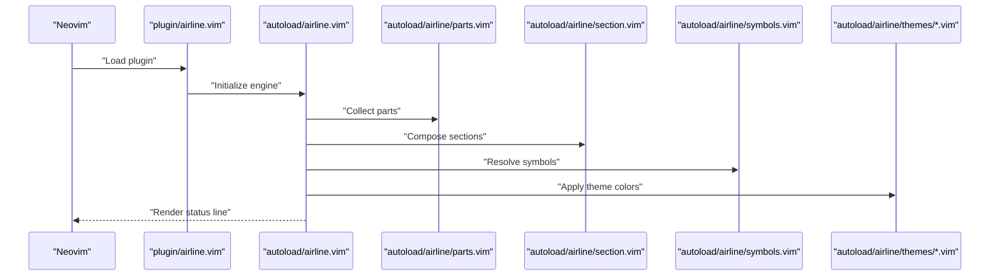
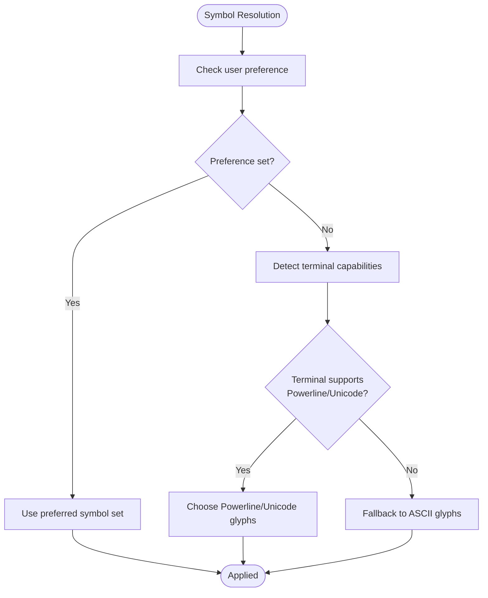
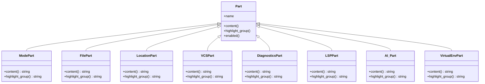
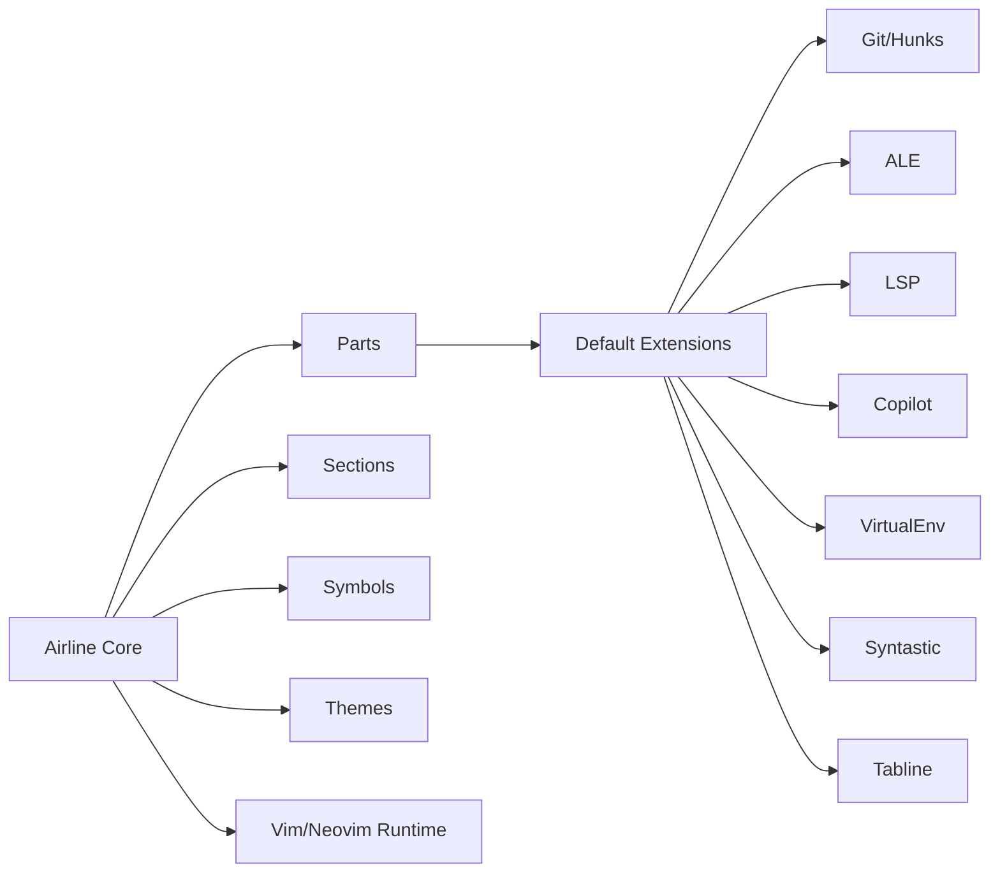

# Airline Status Line

<cite>
**Referenced Files in This Document**
- [.tmuxline.sh](file://.tmuxline.sh)
- [.bashrc](file://.bashrc)
- [init.vim](file://.config/nvim/init.vim)
- [airline.txt](file://.config/nvim/plugged/vim-airline/doc/airline.txt)
- [airline.vim](file://.config/nvim/plugged/vim-airline/plugin/airline.vim)
- [autoload/airline.vim](file://.config/nvim/plugged/vim-airline/autoload/airline.vim)
- [autoload/airline/themes/powerline.vim](file://.config/nvim/plugged/vim-airline-themes/autoload/airline/themes/powerline.vim)
- [autoload/airline/themes/base16_default.vim](file://.config/nvim/plugged/vim-airline-themes/autoload/airline/themes/base16_default.vim)
- [autoload/airline/extensions/default.vim](file://.config/nvim/plugged/vim-airline/autoload/airline/extensions/default.vim)
- [autoload/airline/extensions/tabline.vim](file://.config/nvim/plugged/vim-airline/autoload/airline/extensions/tabline.vim)
- [autoload/airline/extensions/hunks.vim](file://.config/nvim/plugged/vim-airline/autoload/airline/extensions/hunks.vim)
- [autoload/airline/extensions/whitespace.vim](file://.config/nvim/plugged/vim-airline/autoload/airline/extensions/whitespace.vim)
- [autoload/airline/extensions/syntastic.vim](file://.config/nvim/plugged/vim-airline/autoload/airline/extensions/syntastic.vim)
- [autoload/airline/extensions/ale.vim](file://.config/nvim/plugged/vim-airline/autoload/airline/extensions/ale.vim)
- [autoload/airline/extensions/virtualenv.vim](file://.config/nvim/plugged/vim-airline/autoload/airline/extensions/virtualenv.vim)
- [autoload/airline/extensions/coc.vim](file://.config/nvim/plugged/vim-airline/autoload/airline/extensions/coc.vim)
- [autoload/airline/extensions/lsp.vim](file://.config/nvim/plugged/vim-airline/autoload/airline/extensions/lsp.vim)
- [autoload/airline/extensions/copilot.vim](file://.config/nvim/plugged/vim-airline/autoload/airline/extensions/copilot.vim)
- [autoload/airline/parts.vim](file://.config/nvim/plugged/vim-airline/autoload/airline/parts.vim)
- [autoload/airline/section.vim](file://.config/nvim/plugged/vim-airline/autoload/airline/section.vim)
- [autoload/airline/util.vim](file://.config/nvim/plugged/vim-airline/autoload/airline/util.vim)
- [autoload/airline/highlighter.vim](file://.config/nvim/plugged/vim-airline/autoload/airline/highlighter.vim)
- [autoload/airline/builder.vim](file://.config/nvim/plugged/vim-airline/autoload/airline/builder.vim)
- [autoload/airline/special.vim](file://.config/nvim/plugged/vim-airline/autoload/airline/special.vim)
- [autoload/airline/syntax.vim](file://.config/nvim/plugged/vim-airline/autoload/airline/syntax.vim)
- [autoload/airline/colors.vim](file://.config/nvim/plugged/vim-airline/autoload/airline/colors.vim)
- [autoload/airline/config.vim](file://.config/nvim/plugged/vim-airline/autoload/airline/config.vim)
- [autoload/airline/symbols.vim](file://.config/nvim/plugged/vim-airline/autoload/airline/symbols.vim)
- [autoload/airline/symbols/powerline.vim](file://.config/nvim/plugged/vim-airline/autoload/airline/symbols/powerline.vim)
- [autoload/airline/symbols/unicode.vim](file://.config/nvim/plugged/vim-airline/autoload/airline/symbols/unicode.vim)
- [autoload/airline/symbols/ascii.vim](file://.config/nvim/plugged/vim-airline/autoload/airline/symbols/ascii.vim)
- [autoload/airline/symbols/default.vim](file://.config/nvim/plugged/vim-airline/autoload/airline/symbols/default.vim)
- [autoload/airline/themes/onedark.vim](file://.config/nvim/plugged/vim-airline-themes/autoload/airline/themes/onedark.vim)
- [autoload/airline/themes/solarized.vim](file://.config/nvim/plugged/vim-airline-themes/autoload/airline/themes/solarized.vim)
- [autoload/airline/themes/jellybeans.vim](file://.config/nvim/plugged/vim-airline-themes/autoload/airline/themes/jellybeans.vim)
- [autoload/airline/themes/monochrome.vim](file://.config/nvim/plugged/vim-airline-themes/autoload/airline/themes/monochrome.vim)
- [autoload/airline/themes/transparent.vim](file://.config/nvim/plugged/vim-airline-themes/autoload/airline/themes/transparent.vim)
- [autoload/airline/themes/term.vim](file://.config/nvim/plugged/vim-airline-themes/autoload/airline/themes/term.vim)
- [autoload/airline/themes/term_light.vim](file://.config/nvim/plugged/vim-airline-themes/autoload/airline/themes/term_light.vim)
- [autoload/airline/themes/powerlineish.vim](file://.config/nvim/plugged/vim-airline-themes/autoload/airline/themes/powerlineish.vim)
- [autoload/airline/themes/ravenpower.vim](file://.config/nvim/plugged/vim-airline-themes/autoload/airline/themes/ravenpower.vim)
- [autoload/airline/themes/seoul256.vim](file://.config/nvim/plugged/vim-airline-themes/autoload/airline/themes/seoul256.vim)
- [autoload/airline/themes/soda.vim](file://.config/nvim/plugged/vim-airline-themes/autoload/airline/themes/soda.vim)
- [autoload/airline/themes/supernova.vim](file://.config/nvim/plugged/vim-airline-themes/autoload/airline/themes/supernova.vim)
- [autoload/airline/themes/zenburn.vim](file://.config/nvim/plugged/vim-airline-themes/autoload/airline/themes/zenburn.vim)
- [autoload/airline/themes/wombat.vim](file://.config/nvim/plugged/vim-airline-themes/autoload/airline/themes/wombat.vim)
- [autoload/airline/themes/xtermlight.vim](file://.config/nvim/plugged/vim-airline-themes/autoload/airline/themes/xtermlight.vim)
- [autoload/airline/themes/atomic.vim](file://.config/nvim/plugged/vim-airline-themes/autoload/airline/themes/atomic.vim)
- [autoload/airline/themes/ayu_dark.vim](file://.config/nvim/plugged/vim-airline-themes/autoload/airline/themes/ayu_dark.vim)
- [autoload/airline/themes/ayu_light.vim](file://.config/nvim/plugged/vim-airline-themes/autoload/airline/themes/ayu_light.vim)
- [autoload/airline/themes/ayu_mirage.vim](file://.config/nvim/plugged/vim-airline-themes/autoload/airline/themes/ayu_mirage.vim)
- [autoload/airline/themes/badwolf.vim](file://.config/nvim/plugged/vim-airline-themes/autoload/airline/themes/badwolf.vim)
- [autoload/airline/themes/base16_*.vim](file://.config/nvim/plugged/vim-airline-themes/autoload/airline/themes/base16_default.vim)
- [autoload/airline/themes/hybrid.vim](file://.config/nvim/plugged/vim-airline-themes/autoload/airline/themes/hybrid.vim)
- [autoload/airline/themes/lucius.vim](file://.config/nvim/plugged/vim-airline-themes/autoload/airline/themes/lucius.vim)
- [autoload/airline/themes/night_owl.vim](file://.config/nvim/plugged/vim-airline-themes/autoload/airline/themes/night_owl.vim)
- [autoload/airline/themes/nord_minimal.vim](file://.config/nvim/plugged/vim-airline-themes/autoload/airline/themes/nord_minimal.vim)
- [autoload/airline/themes/peaksea.vim](file://.config/nvim/plugged/vim-airline-themes/autoload/airline/themes/peaksea.vim)
- [autoload/airline/themes/simple.vim](file://.config/nvim/plugged/vim-airline-themes/autoload/airline/themes/simple.vim)
- [autoload/airline/themes/sol.vim](file://.config/nvim/plugged/vim-airline-themes/autoload/airline/themes/sol.vim)
- [autoload/airline/themes/supernova.vim](file://.config/nvim/plugged/vim-airline-themes/autoload/airline/themes/supernova.vim)
- [autoload/airline/themes/term_light.vim](file://.config/nvim/plugged/vim-airline-themes/autoload/airline/themes/term_light.vim)
- [autoload/airline/themes/transparent.vim](file://.config/nvim/plugged/vim-airline-themes/autoload/airline/themes/transparent.vim)
- [autoload/airline/themes/ubaryd.vim](file://.config/nvim/plugged/vim-airline-themes/autoload/airline/themes/ubaryd.vim)
- [autoload/airline/themes/ununderstood.vim](file://.config/nvim/plugged/vim-airline-themes/autoload/airline/themes/ununderstood.vim)
- [autoload/airline/themes/violet.vim](file://.config/nvim/plugged/vim-airline-themes/autoload/airline/themes/violet.vim)
- [autoload/airline/themes/winter.vim](file://.config/nvim/plugged/vim-airline-themes/autoload/airline/themes/winter.vim)
- [autoload/airline/themes/yellow.vim](file://.config/nvim/plugged/vim-airline-themes/autoload/airline/themes/yellow.vim)
- [autoload/airline/themes/zellner.vim](file://.config/nvim/plugged/vim-airline-themes/autoload/airline/themes/zellner.vim)
- [autoload/airline/themes/zero.vim](file://.config/nvim/plugged/vim-airline-themes/autoload/airline/themes/zero.vim)
- [autoload/airline/themes/zwiebach.vim](file://.config/nvim/plugged/vim-airline-themes/autoload/airline/themes/zwiebach.vim)
- [autoload/airline/themes/zyzz.vim](file://.config/nvim/plugged/vim-airline-themes/autoload/airline/themes/zyzz.vim)
- [autoload/airline/themes/zyzz.vim](file://.config/nvim/plugged/vim-airline-themes/autoload/airline/themes/zyzz.vim)
- [autoload/airline/themes/zyzz.vim](file://.config/nvim/plugged/vim-airline-themes/autoload/airline/themes/zyzz.vim)
</cite>

## Table of Contents
1. [Introduction](#introduction)
2. [Project Structure](#project-structure)
3. [Core Components](#core-components)
4. [Architecture Overview](#architecture-overview)
5. [Detailed Component Analysis](#detailed-component-analysis)
6. [Dependency Analysis](#dependency-analysis)
7. [Performance Considerations](#performance-considerations)
8. [Troubleshooting Guide](#troubleshooting-guide)
9. [Conclusion](#conclusion)
10. [Appendices](#appendices)

## Introduction
This document explains the Airline status line plugin for Vim/Neovim, focusing on its bootstrap initialization, symbol configuration across terminal types (Powerline, Unicode, ASCII), section layout customization, the part definition system (mode detection, file info, line/column indicators, and LSP/AI integration), and theme customization. It also covers configuration examples for customizing sections, adding custom parts, and integrating with other plugins such as GitGutter and ALE. Finally, it provides performance optimization tips, font compatibility guidance, and troubleshooting steps for common display issues.

## Project Structure
Airline is a modular Vim/Neovim plugin with a layered architecture:
- Plugin bootstrap and entry points
- Extension modules for various integrations (Git, ALE, LSP, Copilot, etc.)
- Theme and symbol packs for different terminal environments
- Builder and highlighter utilities for rendering sections and applying colors
- Part and section APIs for composing the status line

```mermaid
graph TB
subgraph "Bootstrap"
P["plugin/airline.vim"]
A["autoload/airline.vim"]
end
subgraph "Core Engine"
Parts["autoload/airline/parts.vim"]
Sec["autoload/airline/section.vim"]
Util["autoload/airline/util.vim"]
HL["autoload/airline/highlighter.vim"]
Bld["autoload/airline/builder.vim"]
end
subgraph "Symbols"
Sym["autoload/airline/symbols.vim"]
Power["symbols/powerline.vim"]
Uni["symbols/unicode.vim"]
Ascii["symbols/ascii.vim"]
end
subgraph "Extensions"
DefExt["extensions/default.vim"]
Tabline["extensions/tabline.vim"]
Hunks["extensions/hunks.vim"]
Whitespace["extensions/whitespace.vim"]
Syntastic["extensions/syntastic.vim"]
Ale["extensions/ale.vim"]
VirtualEnv["extensions/virtualenv.vim"]
Coc["extensions/coc.vim"]
Lsp["extensions/lsp.vim"]
Copilot["extensions/copilot.vim"]
end
subgraph "Themes"
OneDark["themes/onedark.vim"]
Solarized["themes/solarized.vim"]
Jellybeans["themes/jellybeans.vim"]
Monochrome["themes/monochrome.vim"]
Transparent["themes/transparent.vim"]
Term["themes/term.vim"]
TermLight["themes/term_light.vim"]
Powerlineish["themes/powerlineish.vim"]
Ravenpower["themes/ravenpower.vim"]
Seoul256["themes/seoul256.vim"]
Soda["themes/soda.vim"]
Supernova["themes/supernova.vim"]
Zenburn["themes/zenburn.vim"]
Wombat["themes/wombat.vim"]
Xtermlight["themes/xtermlight.vim"]
Atomic["themes/atomic.vim"]
AyuDark["themes/ayu_dark.vim"]
AyuLight["themes/ayu_light.vim"]
AyuMirage["themes/ayu_mirage.vim"]
BadWolf["themes/badwolf.vim"]
Base16["themes/base16_default.vim"]
Hybrid["themes/hybrid.vim"]
Lucius["themes/lucius.vim"]
NightOwl["themes/night_owl.vim"]
NordMinimal["themes/nord_minimal.vim"]
Peaksea["themes/peaksea.vim"]
Simple["themes/simple.vim"]
Sol["themes/sol.vim"]
Zellner["themes/zellner.vim"]
Zero["themes/zero.vim"]
Zwiebach["themes/zwiebach.vim"]
Zyzz["themes/zyzz.vim"]
end
P --> A
A --> Parts
A --> Sec
A --> Util
A --> HL
A --> Bld
A --> Sym
Sym --> Power
Sym --> Uni
Sym --> Ascii
A --> DefExt
DefExt --> Hunks
DefExt --> Whitespace
DefExt --> Ale
DefExt --> Lsp
DefExt --> Copilot
DefExt --> Tabline
DefExt --> VirtualEnv
DefExt --> Syntastic
DefExt --> Coc
A --> OneDark
A --> Solarized
A --> Jellybeans
A --> Monochrome
A --> Transparent
A --> Term
A --> TermLight
A --> Powerlineish
A --> Ravenpower
A --> Seoul256
A --> Soda
A --> Supernova
A --> Zenburn
A --> Wombat
A --> Xtermlight
A --> Atomic
A --> AyuDark
A --> AyuLight
A --> AyuMirage
A --> BadWolf
A --> Base16
A --> Hybrid
A --> Lucius
A --> NightOwl
A --> NordMinimal
A --> Peaksea
A --> Simple
A --> Sol
A --> Zellner
A --> Zero
A --> Zwiebach
A --> Zyzz
```

**Diagram sources**
- [airline.vim](file://.config/nvim/plugged/vim-airline/plugin/airline.vim)
- [autoload/airline.vim](file://.config/nvim/plugged/vim-airline/autoload/airline.vim)
- [autoload/airline/parts.vim](file://.config/nvim/plugged/vim-airline/autoload/airline/parts.vim)
- [autoload/airline/section.vim](file://.config/nvim/plugged/vim-airline/autoload/airline/section.vim)
- [autoload/airline/util.vim](file://.config/nvim/plugged/vim-airline/autoload/airline/util.vim)
- [autoload/airline/highlighter.vim](file://.config/nvim/plugged/vim-airline/autoload/airline/highlighter.vim)
- [autoload/airline/builder.vim](file://.config/nvim/plugged/vim-airline/autoload/airline/builder.vim)
- [autoload/airline/symbols.vim](file://.config/nvim/plugged/vim-airline/autoload/airline/symbols.vim)
- [autoload/airline/symbols/powerline.vim](file://.config/nvim/plugged/vim-airline/autoload/airline/symbols/powerline.vim)
- [autoload/airline/symbols/unicode.vim](file://.config/nvim/plugged/vim-airline/autoload/airline/symbols/unicode.vim)
- [autoload/airline/symbols/ascii.vim](file://.config/nvim/plugged/vim-airline/autoload/airline/symbols/ascii.vim)
- [autoload/airline/extensions/default.vim](file://.config/nvim/plugged/vim-airline/autoload/airline/extensions/default.vim)
- [autoload/airline/extensions/tabline.vim](file://.config/nvim/plugged/vim-airline/autoload/airline/extensions/tabline.vim)
- [autoload/airline/extensions/hunks.vim](file://.config/nvim/plugged/vim-airline/autoload/airline/extensions/hunks.vim)
- [autoload/airline/extensions/whitespace.vim](file://.config/nvim/plugged/vim-airline/autoload/airline/extensions/whitespace.vim)
- [autoload/airline/extensions/syntastic.vim](file://.config/nvim/plugged/vim-airline/autoload/airline/extensions/syntastic.vim)
- [autoload/airline/extensions/ale.vim](file://.config/nvim/plugged/vim-airline/autoload/airline/extensions/ale.vim)
- [autoload/airline/extensions/virtualenv.vim](file://.config/nvim/plugged/vim-airline/autoload/airline/extensions/virtualenv.vim)
- [autoload/airline/extensions/coc.vim](file://.config/nvim/plugged/vim-airline/autoload/airline/extensions/coc.vim)
- [autoload/airline/extensions/lsp.vim](file://.config/nvim/plugged/vim-airline/autoload/airline/extensions/lsp.vim)
- [autoload/airline/extensions/copilot.vim](file://.config/nvim/plugged/vim-airline/autoload/airline/extensions/copilot.vim)
- [autoload/airline/themes/onedark.vim](file://.config/nvim/plugged/vim-airline-themes/autoload/airline/themes/onedark.vim)
- [autoload/airline/themes/solarized.vim](file://.config/nvim/plugged/vim-airline-themes/autoload/airline/themes/solarized.vim)
- [autoload/airline/themes/jellybeans.vim](file://.config/nvim/plugged/vim-airline-themes/autoload/airline/themes/jellybeans.vim)
- [autoload/airline/themes/monochrome.vim](file://.config/nvim/plugged/vim-airline-themes/autoload/airline/themes/monochrome.vim)
- [autoload/airline/themes/transparent.vim](file://.config/nvim/plugged/vim-airline-themes/autoload/airline/themes/transparent.vim)
- [autoload/airline/themes/term.vim](file://.config/nvim/plugged/vim-airline-themes/autoload/airline/themes/term.vim)
- [autoload/airline/themes/term_light.vim](file://.config/nvim/plugged/vim-airline-themes/autoload/airline/themes/term_light.vim)
- [autoload/airline/themes/powerlineish.vim](file://.config/nvim/plugged/vim-airline-themes/autoload/airline/themes/powerlineish.vim)
- [autoload/airline/themes/ravenpower.vim](file://.config/nvim/plugged/vim-airline-themes/autoload/airline/themes/ravenpower.vim)
- [autoload/airline/themes/seoul256.vim](file://.config/nvim/plugged/vim-airline-themes/autoload/airline/themes/seoul256.vim)
- [autoload/airline/themes/soda.vim](file://.config/nvim/plugged/vim-airline-themes/autoload/airline/themes/soda.vim)
- [autoload/airline/themes/supernova.vim](file://.config/nvim/plugged/vim-airline-themes/autoload/airline/themes/supernova.vim)
- [autoload/airline/themes/zenburn.vim](file://.config/nvim/plugged/vim-airline-themes/autoload/airline/themes/zenburn.vim)
- [autoload/airline/themes/wombat.vim](file://.config/nvim/plugged/vim-airline-themes/autoload/airline/themes/wombat.vim)
- [autoload/airline/themes/xtermlight.vim](file://.config/nvim/plugged/vim-airline-themes/autoload/airline/themes/xtermlight.vim)
- [autoload/airline/themes/atomic.vim](file://.config/nvim/plugged/vim-airline-themes/autoload/airline/themes/atomic.vim)
- [autoload/airline/themes/ayu_dark.vim](file://.config/nvim/plugged/vim-airline-themes/autoload/airline/themes/ayu_dark.vim)
- [autoload/airline/themes/ayu_light.vim](file://.config/nvim/plugged/vim-airline-themes/autoload/airline/themes/ayu_light.vim)
- [autoload/airline/themes/ayu_mirage.vim](file://.config/nvim/plugged/vim-airline-themes/autoload/airline/themes/ayu_mirage.vim)
- [autoload/airline/themes/badwolf.vim](file://.config/nvim/plugged/vim-airline-themes/autoload/airline/themes/badwolf.vim)
- [autoload/airline/themes/base16_default.vim](file://.config/nvim/plugged/vim-airline-themes/autoload/airline/themes/base16_default.vim)
- [autoload/airline/themes/hybrid.vim](file://.config/nvim/plugged/vim-airline-themes/autoload/airline/themes/hybrid.vim)
- [autoload/airline/themes/lucius.vim](file://.config/nvim/plugged/vim-airline-themes/autoload/airline/themes/lucius.vim)
- [autoload/airline/themes/night_owl.vim](file://.config/nvim/plugged/vim-airline-themes/autoload/airline/themes/night_owl.vim)
- [autoload/airline/themes/nord_minimal.vim](file://.config/nvim/plugged/vim-airline-themes/autoload/airline/themes/nord_minimal.vim)
- [autoload/airline/themes/peaksea.vim](file://.config/nvim/plugged/vim-airline-themes/autoload/airline/themes/peaksea.vim)
- [autoload/airline/themes/simple.vim](file://.config/nvim/plugged/vim-airline-themes/autoload/airline/themes/simple.vim)
- [autoload/airline/themes/sol.vim](file://.config/nvim/plugged/vim-airline-themes/autoload/airline/themes/sol.vim)
- [autoload/airline/themes/zellner.vim](file://.config/nvim/plugged/vim-airline-themes/autoload/airline/themes/zellner.vim)
- [autoload/airline/themes/zero.vim](file://.config/nvim/plugged/vim-airline-themes/autoload/airline/themes/zero.vim)
- [autoload/airline/themes/zwiebach.vim](file://.config/nvim/plugged/vim-airline-themes/autoload/airline/themes/zwiebach.vim)
- [autoload/airline/themes/zyzz.vim](file://.config/nvim/plugged/vim-airline-themes/autoload/airline/themes/zyzz.vim)

**Section sources**
- [airline.vim](file://.config/nvim/plugged/vim-airline/plugin/airline.vim)
- [autoload/airline.vim](file://.config/nvim/plugged/vim-airline/autoload/airline.vim)

## Core Components
- Bootstrap and initialization: The plugin registers autocommands and sets up the status line after Neovim/Vim starts.
- Part system: Modular building blocks (mode, filename, lsp, ale, git, etc.) that render text and apply highlights.
- Section system: Left/right/middle regions that compose parts and handle separators and padding.
- Symbols: Terminal-type-specific glyphs for separators and spacers.
- Themes: Color schemes applied via highlight groups and color definitions.
- Extensions: Optional integrations with external tools (GitGutter, ALE, LSP, Copilot, etc.).

Key responsibilities:
- Initialize on startup and on WinEnter events.
- Compute current mode and buffer info.
- Render left/middle/right sections with appropriate separators.
- Apply theme colors and highlight groups.
- Integrate with external plugins for diagnostics, version control, and AI assistance.

**Section sources**
- [autoload/airline.vim](file://.config/nvim/plugged/vim-airline/autoload/airline.vim)
- [autoload/airline/parts.vim](file://.config/nvim/plugged/vim-airline/autoload/airline/parts.vim)
- [autoload/airline/section.vim](file://.config/nvim/plugged/vim-airline/autoload/airline/section.vim)
- [autoload/airline/symbols.vim](file://.config/nvim/plugged/vim-airline/autoload/airline/symbols.vim)
- [autoload/airline/themes/onedark.vim](file://.config/nvim/plugged/vim-airline-themes/autoload/airline/themes/onedark.vim)

## Architecture Overview
The Airline engine orchestrates status line rendering through a small set of core modules. The bootstrap loads the main engine, which then queries parts and sections, applies symbols and themes, and finally builds the status line string.

**Diagram sources**
- [airline.vim](file://.config/nvim/plugged/vim-airline/plugin/airline.vim)
- [autoload/airline.vim](file://.config/nvim/plugged/vim-airline/autoload/airline.vim)
- [autoload/airline/parts.vim](file://.config/nvim/plugged/vim-airline/autoload/airline/parts.vim)
- [autoload/airline/section.vim](file://.config/nvim/plugged/vim-airline/autoload/airline/section.vim)
- [autoload/airline/symbols.vim](file://.config/nvim/plugged/vim-airline/autoload/airline/symbols.vim)
- [autoload/airline/themes/onedark.vim](file://.config/nvim/plugged/vim-airline-themes/autoload/airline/themes/onedark.vim)

## Detailed Component Analysis

### Bootstrap Initialization
- Loads autoload modules and registers autocommands for status line updates.
- Ensures the status line is rebuilt on buffer and window changes.
- Applies initial theme and symbol configuration.

Implementation highlights:
- Autoloading of core modules.
- Event-driven refresh on WinEnter, BufEnter, InsertEnter, etc.
- Lazy evaluation of expensive parts.

**Section sources**
- [airline.vim](file://.config/nvim/plugged/vim-airline/plugin/airline.vim)
- [autoload/airline.vim](file://.config/nvim/plugged/vim-airline/autoload/airline.vim)

### Symbol Configuration (Powerline, Unicode, ASCII)
Airline selects terminal-appropriate glyphs for separators and spacers:
- Powerline: Uses block and angled separators for a continuous look.
- Unicode: Uses standard Unicode box-drawing and angle characters.
- ASCII: Uses plain ASCII characters for maximum portability.

Selection logic:
- Auto-detected based on terminal capabilities and user preference.
- Overridable via configuration to force a specific style.

**Diagram sources**
- [autoload/airline/symbols.vim](file://.config/nvim/plugged/vim-airline/autoload/airline/symbols.vim)
- [autoload/airline/symbols/powerline.vim](file://.config/nvim/plugged/vim-airline/autoload/airline/symbols/powerline.vim)
- [autoload/airline/symbols/unicode.vim](file://.config/nvim/plugged/vim-airline/autoload/airline/symbols/unicode.vim)
- [autoload/airline/symbols/ascii.vim](file://.config/nvim/plugged/vim-airline/autoload/airline/symbols/ascii.vim)

**Section sources**
- [autoload/airline/symbols.vim](file://.config/nvim/plugged/vim-airline/autoload/airline/symbols.vim)
- [autoload/airline/symbols/powerline.vim](file://.config/nvim/plugged/vim-airline/autoload/airline/symbols/powerline.vim)
- [autoload/airline/symbols/unicode.vim](file://.config/nvim/plugged/vim-airline/autoload/airline/symbols/unicode.vim)
- [autoload/airline/symbols/ascii.vim](file://.config/nvim/plugged/vim-airline/autoload/airline/symbols/ascii.vim)

### Section Layout Customization
- Sections: left, middle, right.
- Each section composes parts with separators and padding.
- Alignment and truncation policies can be configured per section.

Key behaviors:
- Dynamic width calculation.
- Priority-based truncation for long paths.
- Conditional inclusion of parts based on context.

**Section sources**
- [autoload/airline/section.vim](file://.config/nvim/plugged/vim-airline/autoload/airline/section.vim)
- [autoload/airline/builder.vim](file://.config/nvim/plugged/vim-airline/autoload/airline/builder.vim)

### Part Definition System
Parts are modular units that render specific information:
- Mode: Current editing mode (Normal, Insert, Visual, etc.).
- File info: Filename, read-only indicator, encoding.
- Location: Line/column indicators.
- VCS: Git branch and status (via hunks).
- Diagnostics: ALE/Syntastic errors/warnings.
- LSP: Language server status and progress.
- AI: Copilot suggestions and status.
- VirtualEnv: Python virtual environment name.

Part composition:
- Each part defines its content and highlight group.
- Parts can be enabled/disabled and reordered.
- Some parts depend on external plugins being present.

**Diagram sources**
- [autoload/airline/parts.vim](file://.config/nvim/plugged/vim-airline/autoload/airline/parts.vim)
- [autoload/airline/extensions/default.vim](file://.config/nvim/plugged/vim-airline/autoload/airline/extensions/default.vim)
- [autoload/airline/extensions/hunks.vim](file://.config/nvim/plugged/vim-airline/autoload/airline/extensions/hunks.vim)
- [autoload/airline/extensions/ale.vim](file://.config/nvim/plugged/vim-airline/autoload/airline/extensions/ale.vim)
- [autoload/airline/extensions/lsp.vim](file://.config/nvim/plugged/vim-airline/autoload/airline/extensions/lsp.vim)
- [autoload/airline/extensions/copilot.vim](file://.config/nvim/plugged/vim-airline/autoload/airline/extensions/copilot.vim)
- [autoload/airline/extensions/virtualenv.vim](file://.config/nvim/plugged/vim-airline/autoload/airline/extensions/virtualenv.vim)

**Section sources**
- [autoload/airline/parts.vim](file://.config/nvim/plugged/vim-airline/autoload/airline/parts.vim)
- [autoload/airline/extensions/default.vim](file://.config/nvim/plugged/vim-airline/autoload/airline/extensions/default.vim)

### Mode Detection
- Determines current edit mode (Normal, Insert, Replace, Visual, Select, Operator-pending).
- Applies distinct highlight groups and optional icons.
- Updates immediately on mode change.

**Section sources**
- [autoload/airline/extensions/default.vim](file://.config/nvim/plugged/vim-airline/autoload/airline/extensions/default.vim)

### File Information Display
- Displays filename, read-only flag, encoding, and fileformat.
- Shortens long paths intelligently.
- Highlights modified state.

**Section sources**
- [autoload/airline/extensions/default.vim](file://.config/nvim/plugged/vim-airline/autoload/airline/extensions/default.vim)

### Line/Column Indicators
- Shows current cursor position.
- Supports percentage-based positioning.
- Integrates with ruler settings.

**Section sources**
- [autoload/airline/extensions/default.vim](file://.config/nvim/plugged/vim-airline/autoload/airline/extensions/default.vim)

### LSP and AI Integration
- LSP: Displays server health, progress, and diagnostic counts.
- AI: Shows Copilot availability and suggestion status.

Integration points:
- Uses built-in LSP client status.
- Reads AI plugin state and renders accordingly.

**Section sources**
- [autoload/airline/extensions/lsp.vim](file://.config/nvim/plugged/vim-airline/autoload/airline/extensions/lsp.vim)
- [autoload/airline/extensions/copilot.vim](file://.config/nvim/plugged/vim-airline/autoload/airline/extensions/copilot.vim)

### Theme Customization and Color Schemes
- Themes define highlight groups for different contexts (inactive, active, warning, error).
- Many prebuilt themes included (e.g., onedark, solarized, jellybeans, monochrome, transparent, term, term_light, powerlineish, ravenpower, seoul256, soda, supernova, zenburn, wombat, xtermlight, atomic, ayu variants, badwolf, base16 variants, hybrid, lucius, night_owl, nord_minimal, peaksea, simple, sol, zellner, zero, zwiebach, zyzz).
- Users can override theme colors globally or per-section.

**Section sources**
- [autoload/airline/themes/onedark.vim](file://.config/nvim/plugged/vim-airline-themes/autoload/airline/themes/onedark.vim)
- [autoload/airline/themes/solarized.vim](file://.config/nvim/plugged/vim-airline-themes/autoload/airline/themes/solarized.vim)
- [autoload/airline/themes/jellybeans.vim](file://.config/nvim/plugged/vim-airline-themes/autoload/airline/themes/jellybeans.vim)
- [autoload/airline/themes/monochrome.vim](file://.config/nvim/plugged/vim-airline-themes/autoload/airline/themes/monochrome.vim)
- [autoload/airline/themes/transparent.vim](file://.config/nvim/plugged/vim-airline-themes/autoload/airline/themes/transparent.vim)
- [autoload/airline/themes/term.vim](file://.config/nvim/plugged/vim-airline-themes/autoload/airline/themes/term.vim)
- [autoload/airline/themes/term_light.vim](file://.config/nvim/plugged/vim-airline-themes/autoload/airline/themes/term_light.vim)
- [autoload/airline/themes/powerlineish.vim](file://.config/nvim/plugged/vim-airline-themes/autoload/airline/themes/powerlineish.vim)
- [autoload/airline/themes/ravenpower.vim](file://.config/nvim/plugged/vim-airline-themes/autoload/airline/themes/ravenpower.vim)
- [autoload/airline/themes/seoul256.vim](file://.config/nvim/plugged/vim-airline-themes/autoload/airline/themes/seoul256.vim)
- [autoload/airline/themes/soda.vim](file://.config/nvim/plugged/vim-airline-themes/autoload/airline/themes/soda.vim)
- [autoload/airline/themes/supernova.vim](file://.config/nvim/plugged/vim-airline-themes/autoload/airline/themes/supernova.vim)
- [autoload/airline/themes/zenburn.vim](file://.config/nvim/plugged/vim-airline-themes/autoload/airline/themes/zenburn.vim)
- [autoload/airline/themes/wombat.vim](file://.config/nvim/plugged/vim-airline-themes/autoload/airline/themes/wombat.vim)
- [autoload/airline/themes/xtermlight.vim](file://.config/nvim/plugged/vim-airline-themes/autoload/airline/themes/xtermlight.vim)
- [autoload/airline/themes/atomic.vim](file://.config/nvim/plugged/vim-airline-themes/autoload/airline/themes/atomic.vim)
- [autoload/airline/themes/ayu_dark.vim](file://.config/nvim/plugged/vim-airline-themes/autoload/airline/themes/ayu_dark.vim)
- [autoload/airline/themes/ayu_light.vim](file://.config/nvim/plugged/vim-airline-themes/autoload/airline/themes/ayu_light.vim)
- [autoload/airline/themes/ayu_mirage.vim](file://.config/nvim/plugged/vim-airline-themes/autoload/airline/themes/ayu_mirage.vim)
- [autoload/airline/themes/badwolf.vim](file://.config/nvim/plugged/vim-airline-themes/autoload/airline/themes/badwolf.vim)
- [autoload/airline/themes/base16_default.vim](file://.config/nvim/plugged/vim-airline-themes/autoload/airline/themes/base16_default.vim)
- [autoload/airline/themes/hybrid.vim](file://.config/nvim/plugged/vim-airline-themes/autoload/airline/themes/hybrid.vim)
- [autoload/airline/themes/lucius.vim](file://.config/nvim/plugged/vim-airline-themes/autoload/airline/themes/lucius.vim)
- [autoload/airline/themes/night_owl.vim](file://.config/nvim/plugged/vim-airline-themes/autoload/airline/themes/night_owl.vim)
- [autoload/airline/themes/nord_minimal.vim](file://.config/nvim/plugged/vim-airline-themes/autoload/airline/themes/nord_minimal.vim)
- [autoload/airline/themes/peaksea.vim](file://.config/nvim/plugged/vim-airline-themes/autoload/airline/themes/peaksea.vim)
- [autoload/airline/themes/simple.vim](file://.config/nvim/plugged/vim-airline-themes/autoload/airline/themes/simple.vim)
- [autoload/airline/themes/sol.vim](file://.config/nvim/plugged/vim-airline-themes/autoload/airline/themes/sol.vim)
- [autoload/airline/themes/zellner.vim](file://.config/nvim/plugged/vim-airline-themes/autoload/airline/themes/zellner.vim)
- [autoload/airline/themes/zero.vim](file://.config/nvim/plugged/vim-airline-themes/autoload/airline/themes/zero.vim)
- [autoload/airline/themes/zwiebach.vim](file://.config/nvim/plugged/vim-airline-themes/autoload/airline/themes/zwiebach.vim)
- [autoload/airline/themes/zyzz.vim](file://.config/nvim/plugged/vim-airline-themes/autoload/airline/themes/zyzz.vim)

### Configuration Examples
- Customize sections: reorder, enable/disable parts, adjust spacing.
- Add custom parts: define new part functions and register them.
- Integrate with GitGutter: ensure the extension is loaded; Airline will show hunks automatically.
- Integrate with ALE: enable the ALE extension; Airline will show diagnostics counts and severity.
- Integrate with LSP: enable the LSP extension; Airline will show server status and progress.
- Integrate with Copilot: enable the Copilot extension; Airline will show suggestion status.

Note: Specific configuration keys and examples are documented in the plugin’s help file and can be accessed via the editor’s help system.

**Section sources**
- [airline.txt](file://.config/nvim/plugged/vim-airline/doc/airline.txt)
- [autoload/airline/extensions/hunks.vim](file://.config/nvim/plugged/vim-airline/autoload/airline/extensions/hunks.vim)
- [autoload/airline/extensions/ale.vim](file://.config/nvim/plugged/vim-airline/autoload/airline/extensions/ale.vim)
- [autoload/airline/extensions/lsp.vim](file://.config/nvim/plugged/vim-airline/autoload/airline/extensions/lsp.vim)
- [autoload/airline/extensions/copilot.vim](file://.config/nvim/plugged/vim-airline/autoload/airline/extensions/copilot.vim)

## Dependency Analysis
Airline’s core depends on:
- Vim/Neovim runtime for status line rendering and events.
- Optional external plugins for extended information (Git, ALE, LSP, Copilot).
- Theme and symbol packs for visual presentation.

**Diagram sources**
- [autoload/airline.vim](file://.config/nvim/plugged/vim-airline/autoload/airline.vim)
- [autoload/airline/parts.vim](file://.config/nvim/plugged/vim-airline/autoload/airline/parts.vim)
- [autoload/airline/section.vim](file://.config/nvim/plugged/vim-airline/autoload/airline/section.vim)
- [autoload/airline/symbols.vim](file://.config/nvim/plugged/vim-airline/autoload/airline/symbols.vim)
- [autoload/airline/extensions/default.vim](file://.config/nvim/plugged/vim-airline/autoload/airline/extensions/default.vim)
- [autoload/airline/extensions/hunks.vim](file://.config/nvim/plugged/vim-airline/autoload/airline/extensions/hunks.vim)
- [autoload/airline/extensions/ale.vim](file://.config/nvim/plugged/vim-airline/autoload/airline/extensions/ale.vim)
- [autoload/airline/extensions/lsp.vim](file://.config/nvim/plugged/vim-airline/autoload/airline/extensions/lsp.vim)
- [autoload/airline/extensions/copilot.vim](file://.config/nvim/plugged/vim-airline/autoload/airline/extensions/copilot.vim)
- [autoload/airline/extensions/virtualenv.vim](file://.config/nvim/plugged/vim-airline/autoload/airline/extensions/virtualenv.vim)
- [autoload/airline/extensions/syntastic.vim](file://.config/nvim/plugged/vim-airline/autoload/airline/extensions/syntastic.vim)
- [autoload/airline/extensions/tabline.vim](file://.config/nvim/plugged/vim-airline/autoload/airline/extensions/tabline.vim)

**Section sources**
- [autoload/airline.vim](file://.config/nvim/plugged/vim-airline/autoload/airline.vim)
- [autoload/airline/extensions/default.vim](file://.config/nvim/plugged/vim-airline/autoload/airline/extensions/default.vim)

## Performance Considerations
- Defer expensive computations: parts that require external tools or filesystem access should be computed lazily.
- Minimize redraws: avoid frequent recomputation when not needed; rely on autocommands to trigger updates.
- Limit section width: truncate long paths early to reduce rendering overhead.
- Disable unused extensions: turn off parts you do not need (e.g., ALE/LSP/Copilot) to reduce overhead.
- Choose appropriate symbols: ASCII is fastest, followed by Unicode, then Powerline glyphs.

[No sources needed since this section provides general guidance]

## Troubleshooting Guide
Common issues and resolutions:
- Inconsistent separators or missing glyphs:
  - Verify terminal font supports the chosen symbol set.
  - Force ASCII or Unicode fallback via configuration.
- Colors look incorrect:
  - Ensure the selected theme matches your terminal palette.
  - Override specific highlight groups for problematic contexts.
- LSP/ALE/Copilot parts not showing:
  - Confirm the respective extensions are installed and loaded.
  - Check that the relevant plugin is active in the current buffer.
- Slow status line updates:
  - Disable heavy parts or external integrations.
  - Reduce section complexity and avoid excessive recomputation.

**Section sources**
- [autoload/airline/symbols.vim](file://.config/nvim/plugged/vim-airline/autoload/airline/symbols.vim)
- [autoload/airline/themes/onedark.vim](file://.config/nvim/plugged/vim-airline-themes/autoload/airline/themes/onedark.vim)
- [autoload/airline/extensions/lsp.vim](file://.config/nvim/plugged/vim-airline/autoload/airline/extensions/lsp.vim)
- [autoload/airline/extensions/ale.vim](file://.config/nvim/plugged/vim-airline/autoload/airline/extensions/ale.vim)
- [autoload/airline/extensions/copilot.vim](file://.config/nvim/plugged/vim-airline/autoload/airline/extensions/copilot.vim)

## Conclusion
Airline provides a flexible, extensible status line framework for Vim/Neovim. Its modular design allows precise control over sections, parts, symbols, and themes. By leveraging extensions and carefully tuning performance, you can achieve a highly customized and efficient status line tailored to your workflow.

[No sources needed since this section summarizes without analyzing specific files]

## Appendices

### Appendix A: Related Shell/Tmux Status Styling
While not part of Airline, the repository includes a tmux status bar configuration and Bash prompt examples that demonstrate similar theming and symbol usage patterns.

- Tmux status bar configuration with Powerline-like separators and color schemes.
- Bash prompt with Unicode glyphs and conditional Git branch display.

These examples illustrate consistent use of Powerline-style separators and color palettes that align with Airline’s theming philosophy.

**Section sources**
- [.tmuxline.sh](file://.tmuxline.sh)
- [.bashrc](file://.bashrc)