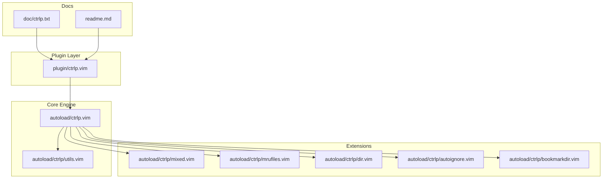
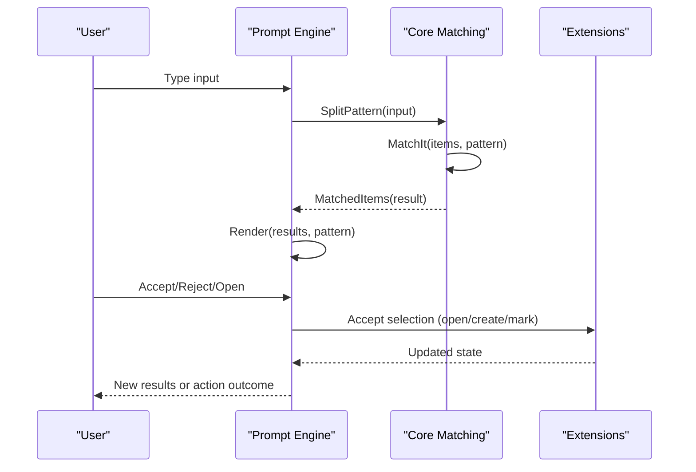
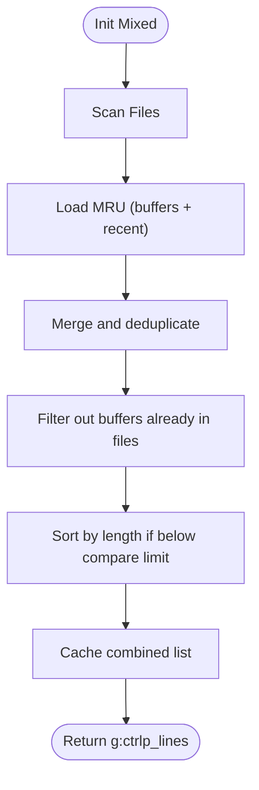
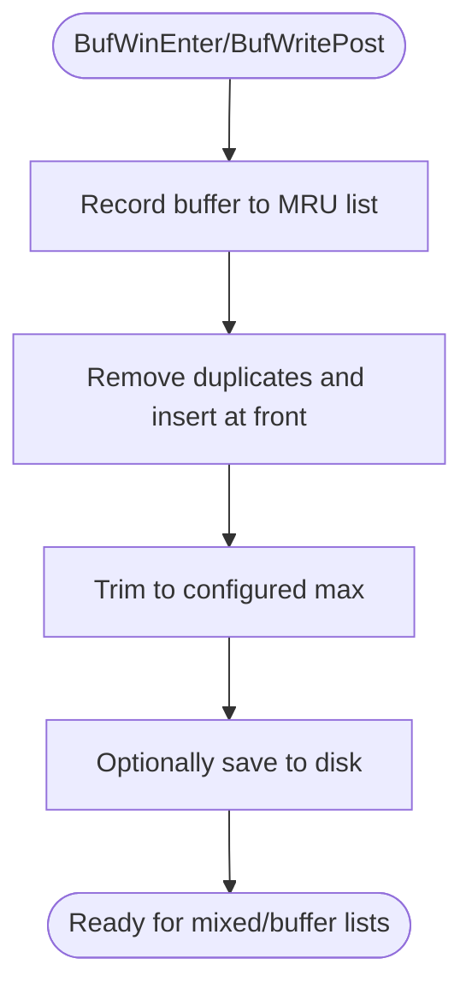
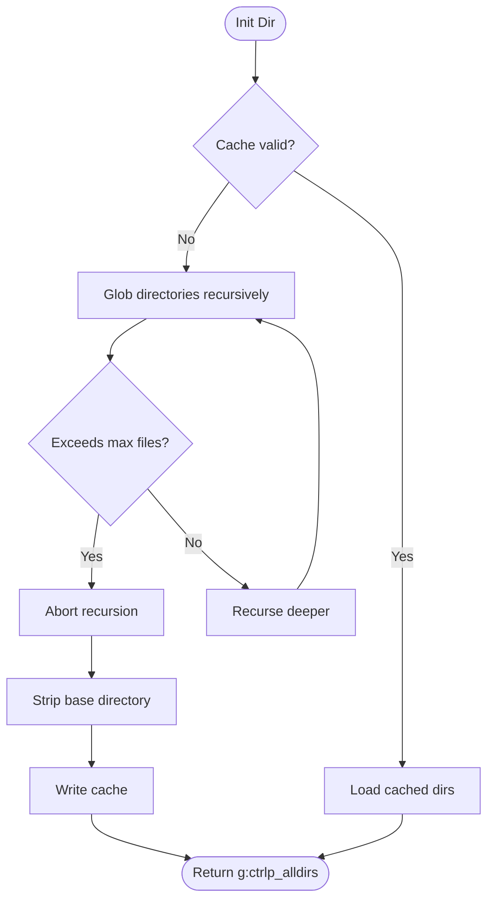
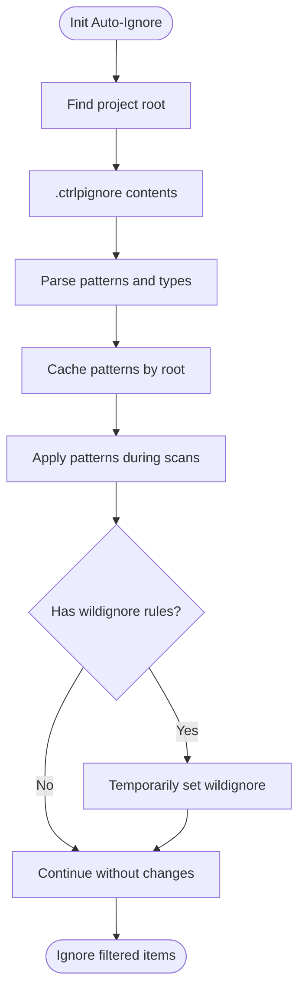
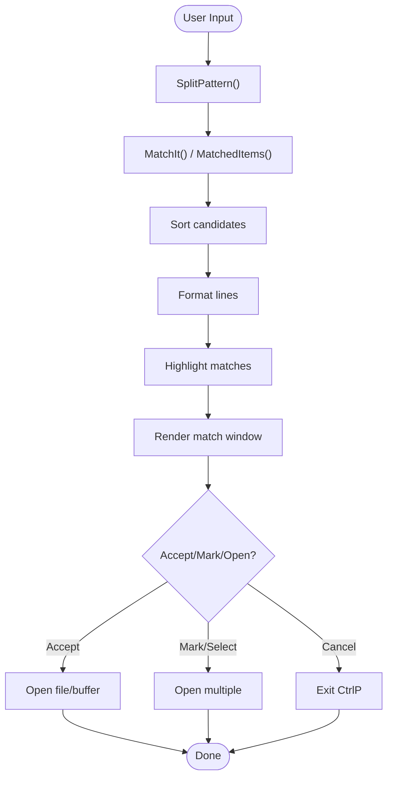
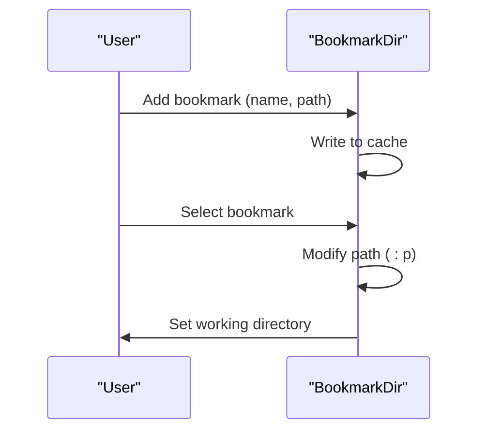
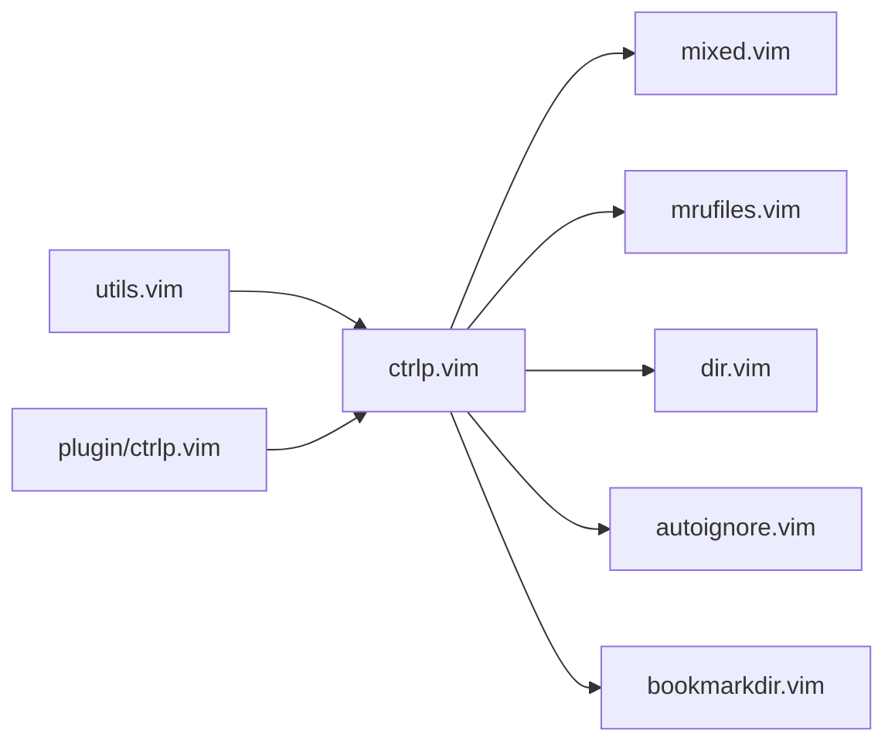

# CtrlP File Finder

<cite>
**Referenced Files in This Document**
- [plugin/ctrlp.vim](file://.local/share/nvim/plugged/ctrlp.vim/plugin/ctrlp.vim)
- [autoload/ctrlp.vim](file://.local/share/nvim/plugged/ctrlp.vim/autoload/ctrlp.vim)
- [autoload/ctrlp/mixed.vim](file://.local/share/nvim/plugged/ctrlp.vim/autoload/ctrlp/mixed.vim)
- [autoload/ctrlp/mrufiles.vim](file://.local/share/nvim/plugged/ctrlp.vim/autoload/ctrlp/mrufiles.vim)
- [autoload/ctrlp/dir.vim](file://.local/share/nvim/plugged/ctrlp.vim/autoload/ctrlp/dir.vim)
- [autoload/ctrlp/autoignore.vim](file://.local/share/nvim/plugged/ctrlp.vim/autoload/ctrlp/autoignore.vim)
- [autoload/ctrlp/utils.vim](file://.local/share/nvim/plugged/ctrlp.vim/autoload/ctrlp/utils.vim)
- [autoload/ctrlp/bookmarkdir.vim](file://.local/share/nvim/plugged/ctrlp.vim/autoload/ctrlp/bookmarkdir.vim)
- [doc/ctrlp.txt](file://.local/share/nvim/plugged/ctrlp.vim/doc/ctrlp.txt)
- [readme.md](file://.local/share/nvim/plugged/ctrlp.vim/readme.md)
</cite>

## Table of Contents
1. [Introduction](#introduction)
2. [Project Structure](#project-structure)
3. [Core Components](#core-components)
4. [Architecture Overview](#architecture-overview)
5. [Detailed Component Analysis](#detailed-component-analysis)
6. [Dependency Analysis](#dependency-analysis)
7. [Performance Considerations](#performance-considerations)
8. [Troubleshooting Guide](#troubleshooting-guide)
9. [Conclusion](#conclusion)
10. [Appendices](#appendices)

## Introduction
CtrlP is a fuzzy file, buffer, and MRU (Most Recently Used) file finder for Vim. It provides a fast, keyboard-driven interface to locate files, switch buffers, and open recent files. A key strength is its mixed mode, which combines files, buffers, and MRU files in a single searchable interface. The plugin supports directory navigation, configurable ignore patterns, flexible fuzzy matching, and performance optimizations for large codebases.

## Project Structure
The CtrlP plugin is organized into:
- Plugin entry point: registers commands and mappings
- Core engine: handles fuzzy matching, rendering, and user interaction
- Extensions: MRU, mixed mode, directories, bookmarks, and auto-ignore
- Utilities: caching, path handling, and file system helpers
- Documentation: user guide and option reference

**Diagram sources**
- [plugin/ctrlp.vim](file://.local/share/nvim/plugged/ctrlp.vim/plugin/ctrlp.vim#L1-L73)
- [autoload/ctrlp.vim](file://.local/share/nvim/plugged/ctrlp.vim/autoload/ctrlp.vim#L1-L120)
- [autoload/ctrlp/mixed.vim](file://.local/share/nvim/plugged/ctrlp.vim/autoload/ctrlp/mixed.vim#L1-L89)
- [autoload/ctrlp/mrufiles.vim](file://.local/share/nvim/plugged/ctrlp.vim/autoload/ctrlp/mrufiles.vim#L1-L159)
- [autoload/ctrlp/dir.vim](file://.local/share/nvim/plugged/ctrlp.vim/autoload/ctrlp/dir.vim#L1-L96)
- [autoload/ctrlp/autoignore.vim](file://.local/share/nvim/plugged/ctrlp.vim/autoload/ctrlp/autoignore.vim#L1-L174)
- [autoload/ctrlp/bookmarkdir.vim](file://.local/share/nvim/plugged/ctrlp.vim/autoload/ctrlp/bookmarkdir.vim#L1-L148)
- [autoload/ctrlp/utils.vim](file://.local/share/nvim/plugged/ctrlp.vim/autoload/ctrlp/utils.vim#L1-L120)
- [doc/ctrlp.txt](file://.local/share/nvim/plugged/ctrlp.vim/doc/ctrlp.txt#L1-L200)
- [readme.md](file://.local/share/nvim/plugged/ctrlp.vim/readme.md#L1-L118)

**Section sources**
- [plugin/ctrlp.vim](file://.local/share/nvim/plugged/ctrlp.vim/plugin/ctrlp.vim#L1-L73)
- [autoload/ctrlp.vim](file://.local/share/nvim/plugged/ctrlp.vim/autoload/ctrlp.vim#L1-L120)

## Core Components
- Mixed mode: Combines files, buffers, and MRU lists into one searchable list
- MRU tracking: Maintains and refreshes a persistent list of recently used files
- Directory mode: Lists directories recursively with configurable depth and limits
- Auto-ignore: Loads project-specific ignore patterns from .ctrlpignore
- Utilities: Caching, path normalization, and safe file system operations

**Section sources**
- [autoload/ctrlp/mixed.vim](file://.local/share/nvim/plugged/ctrlp.vim/autoload/ctrlp/mixed.vim#L1-L89)
- [autoload/ctrlp/mrufiles.vim](file://.local/share/nvim/plugged/ctrlp.vim/autoload/ctrlp/mrufiles.vim#L1-L159)
- [autoload/ctrlp/dir.vim](file://.local/share/nvim/plugged/ctrlp.vim/autoload/ctrlp/dir.vim#L1-L96)
- [autoload/ctrlp/autoignore.vim](file://.local/share/nvim/plugged/ctrlp.vim/autoload/ctrlp/autoignore.vim#L1-L174)
- [autoload/ctrlp/utils.vim](file://.local/share/nvim/plugged/ctrlp.vim/autoload/ctrlp/utils.vim#L1-L120)

## Architecture Overview
CtrlP’s runtime architecture centers on a prompt-driven loop that updates results as the user types. The core engine:
- Reads and merges lists from files, buffers, and MRU
- Applies fuzzy matching and optional regular expressions
- Renders a configurable match window with highlighting
- Handles actions like opening, creating, and multi-selecting files

**Diagram sources**
- [autoload/ctrlp.vim](file://.local/share/nvim/plugged/ctrlp.vim/autoload/ctrlp.vim#L704-L801)
- [autoload/ctrlp.vim](file://.local/share/nvim/plugged/ctrlp.vim/autoload/ctrlp.vim#L656-L702)
- [autoload/ctrlp.vim](file://.local/share/nvim/plugged/ctrlp.vim/autoload/ctrlp.vim#L734-L783)

## Detailed Component Analysis

### Mixed Mode: Files + Buffers + MRU
Mixed mode aggregates three data sources:
- Files: Scanned via internal globbing or external command
- Buffers: Current open buffers with optional filtering
- MRU: Persistent list of recently used files

**Diagram sources**
- [autoload/ctrlp/mixed.vim](file://.local/share/nvim/plugged/ctrlp.vim/autoload/ctrlp/mixed.vim#L33-L81)

Key behaviors:
- Uses a per-session cache keyed by current working directory and timestamps of file/MRU caches
- Removes duplicates by comparing normalized basenames when appropriate
- Sorts by path length when the combined list is small enough to improve perceived relevance

**Section sources**
- [autoload/ctrlp/mixed.vim](file://.local/share/nvim/plugged/ctrlp.vim/autoload/ctrlp/mixed.vim#L1-L89)

### MRU Tracking and Persistence
MRU maintains:
- An in-memory list of recently accessed buffers
- A persistent cache stored in the cache directory
- Filters for inclusion/exclusion and case sensitivity
- Optional relative display mode

**Diagram sources**
- [autoload/ctrlp/mrufiles.vim](file://.local/share/nvim/plugged/ctrlp.vim/autoload/ctrlp/mrufiles.vim#L59-L90)

Operational highlights:
- Tracks buffers and filters by readability and buffer type
- Supports case-sensitive or case-insensitive matching
- Can save on update for immediate persistence
- Provides refresh and removal utilities

**Section sources**
- [autoload/ctrlp/mrufiles.vim](file://.local/share/nvim/plugged/ctrlp.vim/autoload/ctrlp/mrufiles.vim#L1-L159)

### Directory Navigation and Listing
Directory mode builds a list of directories recursively with:
- Depth limiting
- File count limiting
- Optional caching
- Base directory stripping for compact display

**Diagram sources**
- [autoload/ctrlp/dir.vim](file://.local/share/nvim/plugged/ctrlp.vim/autoload/ctrlp/dir.vim#L48-L92)

**Section sources**
- [autoload/ctrlp/dir.vim](file://.local/share/nvim/plugged/ctrlp.vim/autoload/ctrlp/dir.vim#L1-L96)

### Auto-Ignore and Project-Specific Rules
Auto-ignore reads .ctrlpignore from the project root and applies:
- Syntax-aware patterns (regexp or wildignore)
- Per-type filtering (dir/file/link)
- Caching of loaded patterns per project
- Temporary adjustment of wildignore during scans

**Diagram sources**
- [autoload/ctrlp/autoignore.vim](file://.local/share/nvim/plugged/ctrlp.vim/autoload/ctrlp/autoignore.vim#L57-L160)

**Section sources**
- [autoload/ctrlp/autoignore.vim](file://.local/share/nvim/plugged/ctrlp.vim/autoload/ctrlp/autoignore.vim#L1-L174)

### Fuzzy Matching and Rendering Pipeline
The core matching pipeline:
- Splits input into a pattern (supports filename vs full-path modes)
- Applies a customizable matcher or the built-in algorithm
- Sorts and renders results in a configurable window
- Highlights matches and supports multi-select and batch operations

**Diagram sources**
- [autoload/ctrlp.vim](file://.local/share/nvim/plugged/ctrlp.vim/autoload/ctrlp.vim#L704-L732)
- [autoload/ctrlp.vim](file://.local/share/nvim/plugged/ctrlp.vim/autoload/ctrlp.vim#L656-L702)
- [autoload/ctrlp.vim](file://.local/share/nvim/plugged/ctrlp.vim/autoload/ctrlp.vim#L734-L783)

**Section sources**
- [autoload/ctrlp.vim](file://.local/share/nvim/plugged/ctrlp.vim/autoload/ctrlp.vim#L656-L801)

### Bookmarked Directories
Bookmarks provide quick access to frequently visited directories with:
- Persistent storage in cache
- Name and path pairs
- Accept handlers to change working directory

**Diagram sources**
- [autoload/ctrlp/bookmarkdir.vim](file://.local/share/nvim/plugged/ctrlp.vim/autoload/ctrlp/bookmarkdir.vim#L95-L144)

**Section sources**
- [autoload/ctrlp/bookmarkdir.vim](file://.local/share/nvim/plugged/ctrlp.vim/autoload/ctrlp/bookmarkdir.vim#L1-L148)

## Dependency Analysis
CtrlP’s extension model is modular. The core depends on utilities for caching and path handling, while extensions depend on the core APIs for initialization, listing, and acceptance.

**Diagram sources**
- [autoload/ctrlp/utils.vim](file://.local/share/nvim/plugged/ctrlp.vim/autoload/ctrlp/utils.vim#L1-L120)
- [autoload/ctrlp.vim](file://.local/share/nvim/plugged/ctrlp.vim/autoload/ctrlp.vim#L1-L120)
- [autoload/ctrlp/mixed.vim](file://.local/share/nvim/plugged/ctrlp.vim/autoload/ctrlp/mixed.vim#L1-L89)
- [autoload/ctrlp/mrufiles.vim](file://.local/share/nvim/plugged/ctrlp.vim/autoload/ctrlp/mrufiles.vim#L1-L159)
- [autoload/ctrlp/dir.vim](file://.local/share/nvim/plugged/ctrlp.vim/autoload/ctrlp/dir.vim#L1-L96)
- [autoload/ctrlp/autoignore.vim](file://.local/share/nvim/plugged/ctrlp.vim/autoload/ctrlp/autoignore.vim#L1-L174)
- [autoload/ctrlp/bookmarkdir.vim](file://.local/share/nvim/plugged/ctrlp.vim/autoload/ctrlp/bookmarkdir.vim#L1-L148)
- [plugin/ctrlp.vim](file://.local/share/nvim/plugged/ctrlp.vim/plugin/ctrlp.vim#L1-L73)

**Section sources**
- [plugin/ctrlp.vim](file://.local/share/nvim/plugged/ctrlp.vim/plugin/ctrlp.vim#L1-L73)
- [autoload/ctrlp.vim](file://.local/share/nvim/plugged/ctrlp.vim/autoload/ctrlp.vim#L1-L120)

## Performance Considerations
- Caching: Per-session and cross-session caches reduce repeated scans. Use cache controls to refresh when needed.
- Limits: Max files and depth prevent scanning very large trees. Adjust for your project size.
- External commands: Use VCS-native listing commands for speed in large repositories.
- Lazy updates: Debounce updates while typing for responsiveness.
- Sorting thresholds: Built-in checks avoid expensive sorts when lists exceed a configurable limit.
- Async globbing: When supported, asynchronous file discovery prevents blocking the UI.

Practical tips:
- Enable cross-session caching to persist MRU and file caches across Vim sessions.
- Configure max files and depth to match your typical project sizes.
- Prefer VCS-based listing commands for large repos to leverage native indexing.
- Keep ignore patterns minimal and precise to reduce filesystem traversal.

[No sources needed since this section provides general guidance]

## Troubleshooting Guide
Common issues and resolutions:
- No results or missing files
  - Verify ignore patterns and wildignore settings
  - Use the cache purge key to rebuild caches
  - Confirm external command correctness and availability
- Slow startup in large projects
  - Increase max files and depth gradually
  - Use VCS-based listing commands
  - Enable async globbing if available
- MRU not updating
  - Ensure MRU auto-commands are active
  - Check MRU save-on-update setting
- Mixed mode duplicates
  - The mixed mode intentionally removes duplicates; verify buffer and file lists

**Section sources**
- [autoload/ctrlp.vim](file://.local/share/nvim/plugged/ctrlp.vim/autoload/ctrlp.vim#L363-L375)
- [autoload/ctrlp/mrufiles.vim](file://.local/share/nvim/plugged/ctrlp.vim/autoload/ctrlp/mrufiles.vim#L92-L104)
- [autoload/ctrlp/dir.vim](file://.local/share/nvim/plugged/ctrlp.vim/autoload/ctrlp/dir.vim#L48-L74)

## Conclusion
CtrlP delivers a powerful, extensible fuzzy finder tailored for efficient file, buffer, and MRU navigation. Its mixed mode consolidates multiple sources into a unified interface, while robust configuration options and performance features accommodate diverse workflows and large codebases. By leveraging caching, external scanners, and project-specific ignore rules, CtrlP remains responsive and accurate across varied environments.

[No sources needed since this section summarizes without analyzing specific files]

## Appendices

### Configuration Examples and Best Practices
- Basic invocation and modes
  - Use the default mapping and commands to open CtrlP in file, buffer, MRU, or mixed modes
- Working directory and root detection
  - Configure working path mode to align with your project layout
  - Extend root markers for non-standard repositories
- Ignoring files and directories
  - Combine wildignore and custom ignore patterns
  - Use project-specific .ctrlpignore with syntax-aware rules
- External scanners for large repos
  - Use VCS-native listing commands for speed
  - Consider fallback commands for non-repository scans
- MRU customization
  - Tune max entries, include/exclude patterns, and relative display
- Batch operations
  - Mark multiple files and open them with a single action
- Performance tuning
  - Adjust max files and depth
  - Enable async globbing and lazy updates
  - Use cross-session caching

**Section sources**
- [readme.md](file://.local/share/nvim/plugged/ctrlp.vim/readme.md#L25-L109)
- [doc/ctrlp.txt](file://.local/share/nvim/plugged/ctrlp.vim/doc/ctrlp.txt#L101-L400)
- [autoload/ctrlp/autoignore.vim](file://.local/share/nvim/plugged/ctrlp.vim/autoload/ctrlp/autoignore.vim#L57-L160)
- [autoload/ctrlp/mrufiles.vim](file://.local/share/nvim/plugged/ctrlp.vim/autoload/ctrlp/mrufiles.vim#L11-L25)