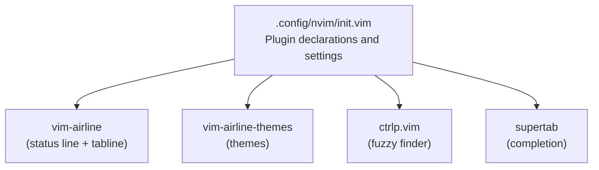
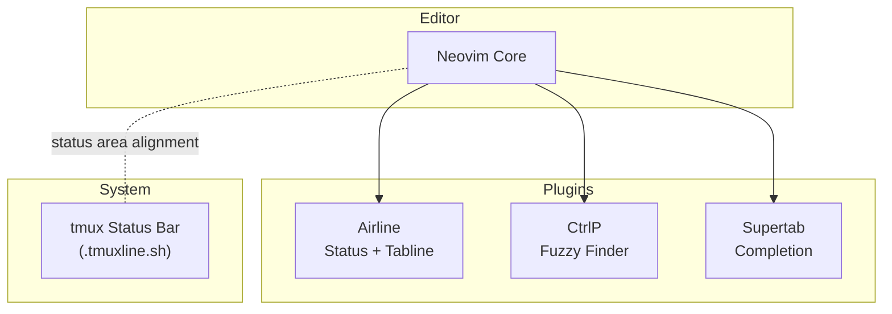
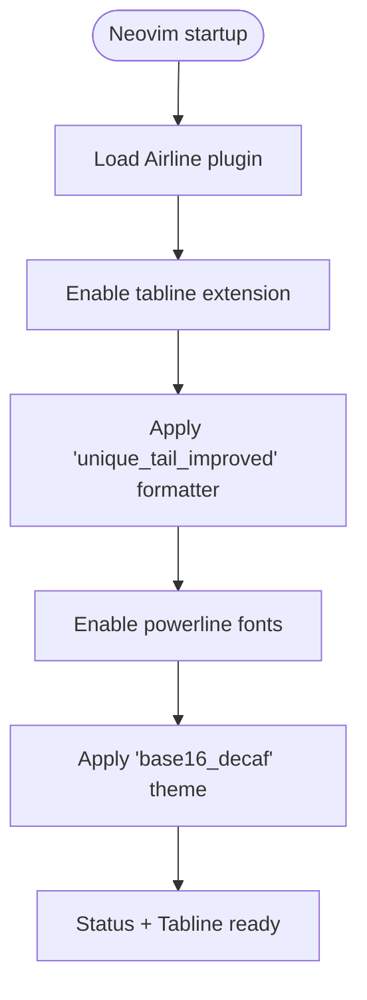
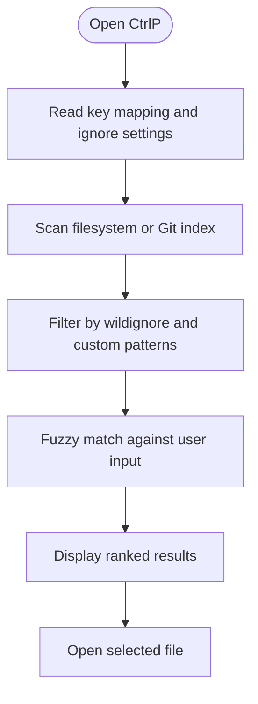
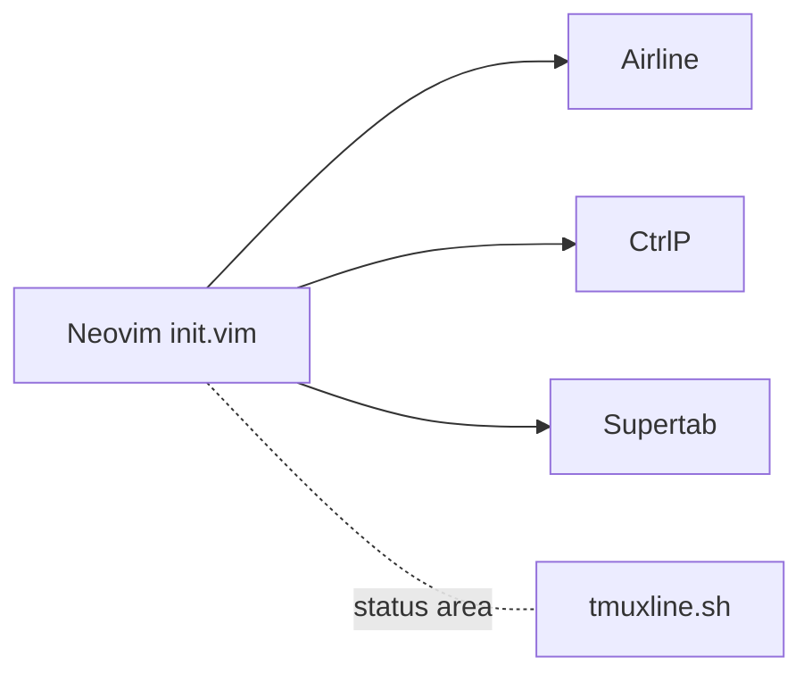

# Productivity Enhancements

<cite>
**Referenced Files in This Document**
- [init.vim](file://.config/nvim/init.vim)
- [.tmuxline.sh](file://.tmuxline.sh)
- [README.md](file://README.md)
</cite>

## Table of Contents
1. [Introduction](#introduction)
2. [Project Structure](#project-structure)
3. [Core Components](#core-components)
4. [Architecture Overview](#architecture-overview)
5. [Detailed Component Analysis](#detailed-component-analysis)
6. [Dependency Analysis](#dependency-analysis)
7. [Performance Considerations](#performance-considerations)
8. [Troubleshooting Guide](#troubleshooting-guide)
9. [Conclusion](#conclusion)

## Introduction
This document explains productivity enhancements enabled by three Neovim plugins configured in this repository: Airline for enhanced status lines and integrated tab management, CtrlP for fuzzy file finding with performance-focused ignore patterns, and Supertab for intelligent completion. It consolidates configuration examples, theme customization, performance tuning, and integration patterns visible in the repository’s Neovim configuration. It also outlines common usage patterns and advanced tips for power users.

## Project Structure
The Neovim configuration declares and enables the three plugins and applies their settings. The repository also includes a tmux status bar configuration that complements the editor’s status area.

**Diagram sources**
- [init.vim](file://.config/nvim/init.vim#L137-L161)
- [init.vim](file://.config/nvim/init.vim#L291-L297)
- [init.vim](file://.config/nvim/init.vim#L273-L288)

**Section sources**
- [init.vim](file://.config/nvim/init.vim#L137-L161)
- [.tmuxline.sh](file://.tmuxline.sh#L1-L21)

## Core Components
- Airline: Provides a highly configurable status line and integrates with tab management. Enabled and themed in the Neovim configuration.
- CtrlP: Offers fuzzy file, buffer, and MRU (most recently used) navigation with customizable ignore patterns and Git-aware scanning.
- Supertab: Extends Tab completion to intelligently select completions based on context and supports snippet triggers.

These components are declared and configured in the Neovim init file and complement each other to streamline file navigation, completion, and visual feedback.

**Section sources**
- [init.vim](file://.config/nvim/init.vim#L144-L148)
- [init.vim](file://.config/nvim/init.vim#L273-L297)

## Architecture Overview
The productivity stack centers on Neovim with three plugins layered on top of the editor’s core capabilities. Airline enhances visibility and navigation via status and tab lines. CtrlP accelerates file discovery with fuzzy matching and efficient ignore lists. Supertab improves typing velocity by offering context-aware completion.

**Diagram sources**
- [init.vim](file://.config/nvim/init.vim#L291-L297)
- [init.vim](file://.config/nvim/init.vim#L273-L288)
- [.tmuxline.sh](file://.tmuxline.sh#L1-L21)

## Detailed Component Analysis

### Airline: Enhanced Status Lines and Tab Management
Airline is enabled and customized to integrate with tab management and use a Powerline-style theme.

Key configuration highlights:
- Tabline extension enabled with a formatter optimized for unique tail display.
- Powerline fonts enabled for seamless glyphs.
- Theme selection applied.

Common usage patterns:
- The tabline shows open buffers and supports navigation between tabs.
- Status line displays contextual information such as file encoding, line endings, and cursor position.

Advanced tips:
- Choose among the included themes or create a custom theme by adding a new file under the themes directory.
- Adjust the formatter to balance compactness and readability for your workflow.

**Diagram sources**
- [init.vim](file://.config/nvim/init.vim#L291-L297)

**Section sources**
- [init.vim](file://.config/nvim/init.vim#L291-L297)

### CtrlP: Fuzzy File Finding, Ignore Patterns, and Performance
CtrlP is configured for rapid file discovery with performance-conscious ignore patterns and Git-aware scanning.

Key configuration highlights:
- Key mapping bound to a convenient shortcut.
- Wildignore extended to skip temporary and compiled artifacts.
- Custom ignore patterns for directories and files.
- Git-aware command to exclude ignored files and untracked content.

Common usage patterns:
- Open the fuzzy finder and type partial paths or file names to narrow results quickly.
- Use the Git-aware mode to avoid irrelevant files during large projects.

Performance tuning:
- Keep ignore lists minimal and precise to reduce scanning overhead.
- Prefer Git-aware mode for large repositories to leverage .gitignore and tracked files.

**Diagram sources**
- [init.vim](file://.config/nvim/init.vim#L273-L288)

**Section sources**
- [init.vim](file://.config/nvim/init.vim#L273-L288)

### Supertab: Intelligent Completion and Workflow Acceleration
Supertab extends Tab completion to intelligently select completions based on context. It is declared in the plugin list and can be combined with snippet engines to accelerate editing.

Common usage patterns:
- Press Tab after typing a partial word to cycle through context-appropriate completions.
- Combine with snippet triggers to move through placeholders efficiently.

Integration tips:
- Pair with external completion providers or LSP clients for richer suggestions.
- Configure preferred completion sources and priorities to align with your language stack.

**Section sources**
- [init.vim](file://.config/nvim/init.vim#L147-L148)

## Dependency Analysis
The Neovim configuration declares the three plugins and applies their settings. There is no explicit dependency graph among the plugins themselves; they operate independently. The tmux status bar configuration exists separately and can complement the editor’s status area.

**Diagram sources**
- [init.vim](file://.config/nvim/init.vim#L137-L161)
- [.tmuxline.sh](file://.tmuxline.sh#L1-L21)

**Section sources**
- [init.vim](file://.config/nvim/init.vim#L137-L161)
- [.tmuxline.sh](file://.tmuxline.sh#L1-L21)

## Performance Considerations
- CtrlP performance depends heavily on ignore patterns and scan scope. Keep ignore lists focused to minimize IO.
- Use Git-aware scanning to avoid traversing ignored or untracked files.
- Airline rendering is generally lightweight; keep theme and glyph sets appropriate for your terminal emulator.
- Avoid enabling heavy extensions or frequent redraws unnecessarily.

[No sources needed since this section provides general guidance]

## Troubleshooting Guide
- Plugins not loading: Ensure the plugin manager is installed and the plugin directories exist. The repository references plugin installation steps.
- CtrlP ignores too much or too little: Adjust wildignore and custom ignore patterns to match your project layout.
- Airline glyphs missing: Confirm powerline fonts are enabled and available in your terminal.
- Status line not visible: Verify the status line is enabled and the theme is applied.

**Section sources**
- [README.md](file://README.md#L7-L13)
- [init.vim](file://.config/nvim/init.vim#L273-L297)

## Conclusion
This repository configures three productivity plugins—Airline, CtrlP, and Supertab—to enhance Neovim’s status awareness, file navigation, and completion workflow. By leveraging the provided settings, ignore patterns, and theme choices, users can achieve a fast, responsive, and visually coherent editing environment. Advanced users can further tailor the configuration by selecting alternative themes, refining ignore lists, and integrating completion providers.