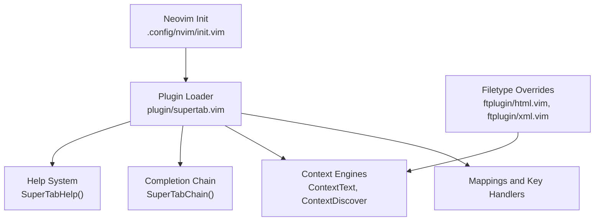
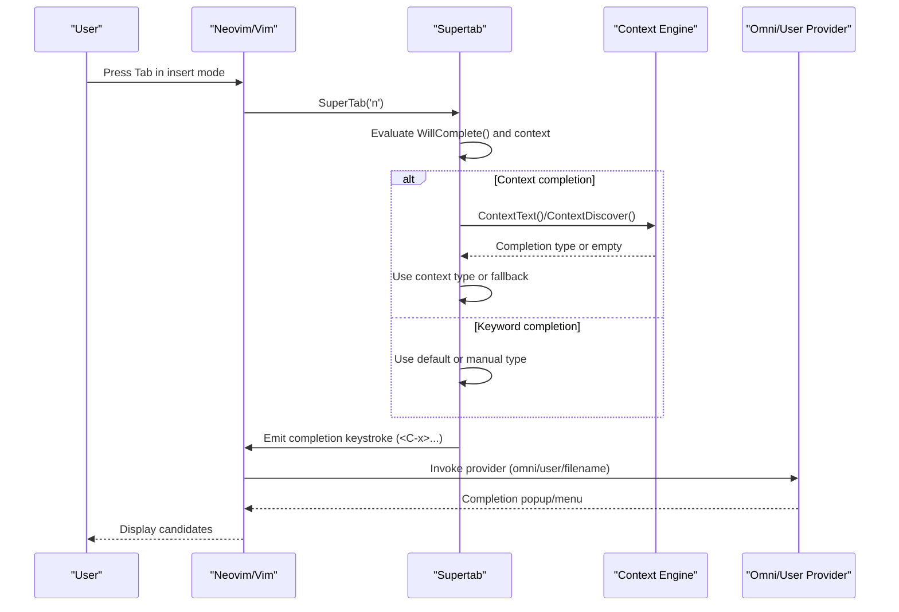
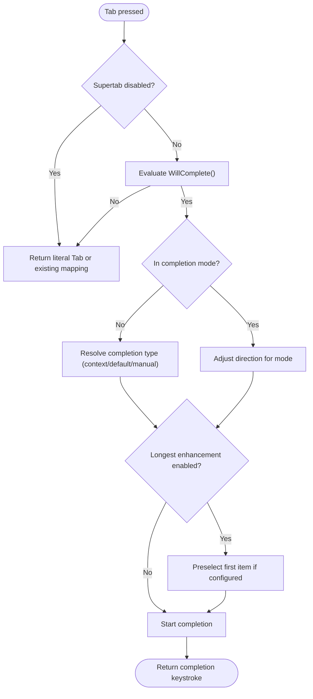
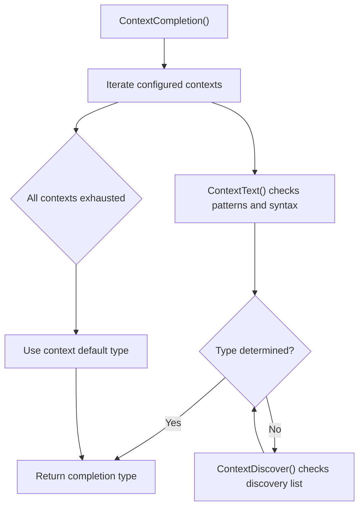
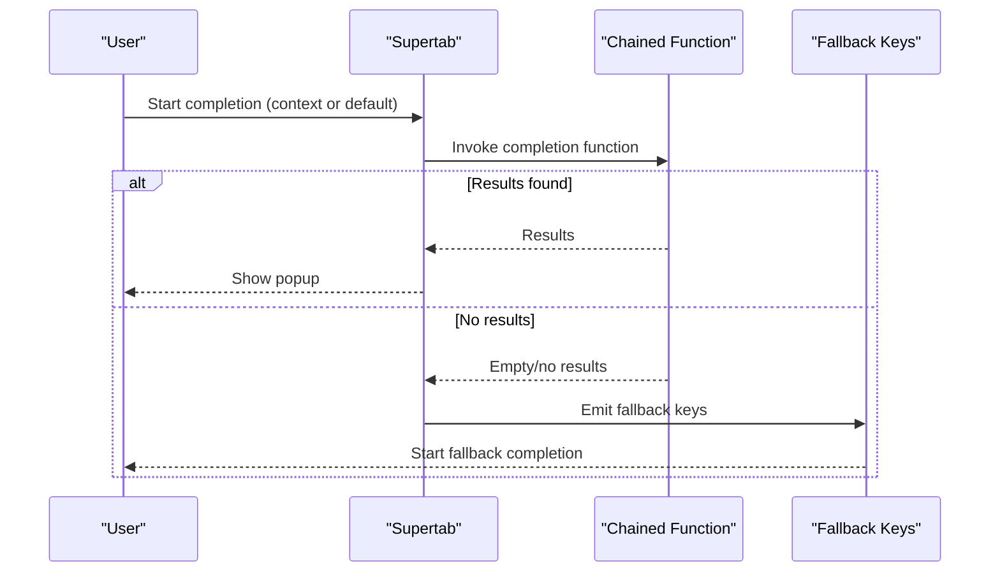
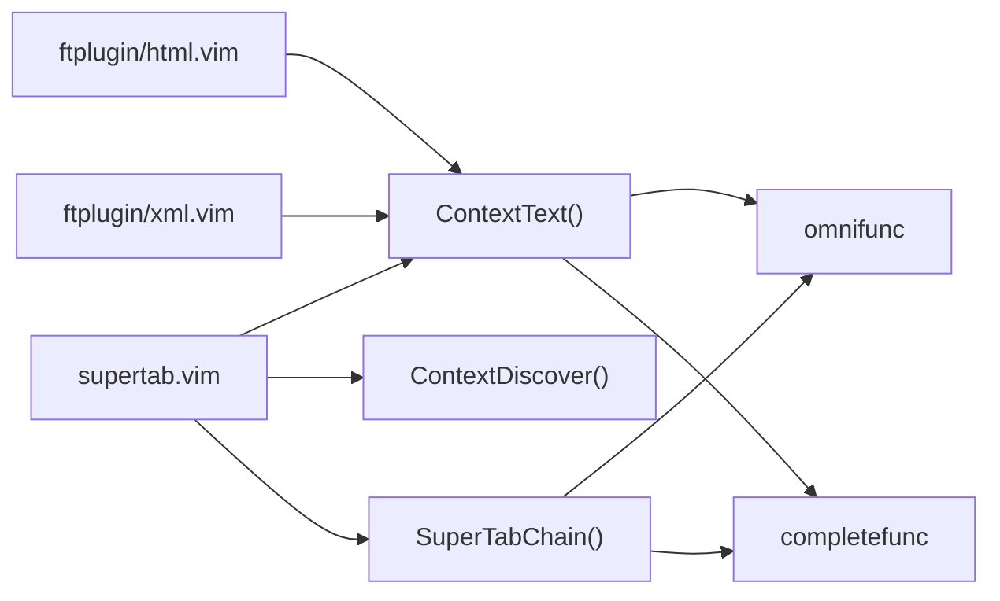

# Supertab Intelligent Completion

<cite>
**Referenced Files in This Document**
- [supertab.vim](file://.local/share/nvim/plugged/supertab/plugin/supertab.vim)
- [supertab.txt](file://.local/share/nvim/plugged/supertab/doc/supertab.txt)
- [html.vim](file://.local/share/nvim/plugged/supertab/ftplugin/html.vim)
- [xml.vim](file://.local/share/nvim/plugged/supertab/ftplugin/xml.vim)
- [init.vim](file://.config/nvim/init.vim)
</cite>

## Table of Contents
1. [Introduction](#introduction)
2. [Project Structure](#project-structure)
3. [Core Components](#core-components)
4. [Architecture Overview](#architecture-overview)
5. [Detailed Component Analysis](#detailed-component-analysis)
6. [Dependency Analysis](#dependency-analysis)
7. [Performance Considerations](#performance-considerations)
8. [Troubleshooting Guide](#troubleshooting-guide)
9. [Conclusion](#conclusion)
10. [Appendices](#appendices)

## Introduction
Supertab is a Neovim/Vim plugin that enhances the Tab key in insert mode to provide intelligent, context-aware completion. Instead of relying solely on Vim’s default insert-mode completion (<C-n>/<C-p>), Supertab lets you use Tab (and Shift-Tab) to cycle through completions, automatically selecting the most appropriate completion type based on the editing context (for example, file paths, member access, or omni/user completion). It supports:
- Context-aware completion (text patterns, member access, file paths)
- Omni completion and user-defined completion integration
- Completion chaining (fallback from one completion type to another)
- Extensive configuration for behavior, trigger characters, and retention
- Compatibility with modern completion workflows and external providers

## Project Structure
Supertab is organized as a standard Vim plugin with:
- A main plugin script that defines mappings, completion logic, and configuration
- A help document detailing options and usage
- Filetype-specific overrides for HTML/XML behavior
- An example Neovim init file showing Supertab integration

**Diagram sources**
- [supertab.vim](file://.local/share/nvim/plugged/supertab/plugin/supertab.vim#L950-L1079)
- [html.vim](file://.local/share/nvim/plugged/supertab/ftplugin/html.vim#L38-L59)
- [xml.vim](file://.local/share/nvim/plugged/supertab/ftplugin/xml.vim#L38-L43)
- [init.vim](file://.config/nvim/init.vim#L148)

**Section sources**
- [supertab.vim](file://.local/share/nvim/plugged/supertab/plugin/supertab.vim#L1-L120)
- [supertab.txt](file://.local/share/nvim/plugged/supertab/doc/supertab.txt#L1-L40)
- [html.vim](file://.local/share/nvim/plugged/supertab/ftplugin/html.vim#L1-L62)
- [xml.vim](file://.local/share/nvim/plugged/supertab/ftplugin/xml.vim#L1-L46)
- [init.vim](file://.config/nvim/init.vim#L137-L161)

## Core Components
- Tab key enhancement: Remaps Tab and Shift-Tab to cycle through completions intelligently, with optional preselection and longest-match enhancement.
- Context engines: Built-in logic to detect member access, file paths, and HTML/XML tag patterns, and to select omni/user completion accordingly.
- Completion chaining: Allows chaining a completion function (omni or user) with a fallback key sequence for seamless fallback behavior.
- Help system: Interactive help to switch completion types manually.
- Filetype overrides: Buffer-local defaults for HTML/XML to prioritize omni completion and adjust member patterns.

Key configuration globals and buffers:
- Default completion type and context default
- Completion contexts list
- Trigger prevention lists (before/after)
- Mapping keys for forward/backward/tab literal
- Longest match enhancement and highlight behavior
- CR mapping behavior and preview window handling
- Case handling for keyword completion

**Section sources**
- [supertab.vim](file://.local/share/nvim/plugged/supertab/plugin/supertab.vim#L71-L146)
- [supertab.txt](file://.local/share/nvim/plugged/supertab/doc/supertab.txt#L64-L123)
- [supertab.txt](file://.local/share/nvim/plugged/supertab/doc/supertab.txt#L125-L233)

## Architecture Overview
Supertab’s runtime flow integrates with Vim’s insert completion subsystem. When you press Tab, Supertab decides whether to start a completion or insert a literal tab, based on context and configuration. It can:
- Start keyword completion (<C-x><C-n> or <C-x><C-p>)
- Start omni completion (<C-x><C-o>) or user completion (<C-x><C-u>)
- Start filename completion (<C-x><C-f>) for path-like contexts
- Chain completion functions with fallbacks
- Honor longest-match and menu preselection options

**Diagram sources**
- [supertab.vim](file://.local/share/nvim/plugged/supertab/plugin/supertab.vim#L387-L546)
- [supertab.vim](file://.local/share/nvim/plugged/supertab/plugin/supertab.vim#L798-L874)
- [supertab.txt](file://.local/share/nvim/plugged/supertab/doc/supertab.txt#L144-L233)

## Detailed Component Analysis

### Tab Key Enhancement and Cycle Navigation
- Forward and backward mappings route to a central handler that:
  - Checks if completion should start at the current cursor position
  - Manages longest-match enhancement and menu preselection
  - Handles cycling direction and inversion when in <C-p> mode
  - Supports undo-break behavior and case handling for keyword completion
- Literal Tab insertion is supported via a dedicated mapping.

**Diagram sources**
- [supertab.vim](file://.local/share/nvim/plugged/supertab/plugin/supertab.vim#L387-L546)
- [supertab.vim](file://.local/share/nvim/plugged/supertab/plugin/supertab.vim#L643-L701)

**Section sources**
- [supertab.vim](file://.local/share/nvim/plugged/supertab/plugin/supertab.vim#L387-L546)
- [supertab.txt](file://.local/share/nvim/plugged/supertab/doc/supertab.txt#L280-L320)

### Context-Aware Completion Engines
- Text context: Detects member access patterns (.), (::), or (->), and file paths. It can prioritize omni completion or user completion based on configuration.
- Discover context: Uses a discovery list to pick a completion type based on the presence of specific options (for example, omnifunc or completefunc).
- HTML/XML overrides: Adjusts member patterns and omni precedence for tag and attribute completion.

**Diagram sources**
- [supertab.vim](file://.local/share/nvim/plugged/supertab/plugin/supertab.vim#L798-L835)
- [supertab.vim](file://.local/share/nvim/plugged/supertab/plugin/supertab.vim#L837-L874)
- [html.vim](file://.local/share/nvim/plugged/supertab/ftplugin/html.vim#L38-L59)
- [xml.vim](file://.local/share/nvim/plugged/supertab/ftplugin/xml.vim#L38-L43)

**Section sources**
- [supertab.vim](file://.local/share/nvim/plugged/supertab/plugin/supertab.vim#L798-L874)
- [supertab.txt](file://.local/share/nvim/plugged/supertab/doc/supertab.txt#L144-L233)
- [html.vim](file://.local/share/nvim/plugged/supertab/ftplugin/html.vim#L38-L59)
- [xml.vim](file://.local/share/nvim/plugged/supertab/ftplugin/xml.vim#L38-L43)

### Completion Chaining (Omni/User + Fallback)
Supertab can chain a completion function (omni or user) with a fallback key sequence. When the chained function yields no results, Supertab falls back to the configured fallback (for example, keyword completion).

**Diagram sources**
- [supertab.vim](file://.local/share/nvim/plugged/supertab/plugin/supertab.vim#L886-L939)
- [supertab.txt](file://.local/share/nvim/plugged/supertab/doc/supertab.txt#L402-L472)

**Section sources**
- [supertab.vim](file://.local/share/nvim/plugged/supertab/plugin/supertab.vim#L886-L939)
- [supertab.txt](file://.local/share/nvim/plugged/supertab/doc/supertab.txt#L402-L472)

### Help System and Manual Completion Types
Supertab provides an interactive help buffer to manually select a completion type. It also supports entering manual completion types via <C-x> followed by a completion key.

**Section sources**
- [supertab.vim](file://.local/share/nvim/plugged/supertab/plugin/supertab.vim#L548-L576)
- [supertab.vim](file://.local/share/nvim/plugged/supertab/plugin/supertab.vim#L310-L365)
- [supertab.txt](file://.local/share/nvim/plugged/supertab/doc/supertab.txt#L36-L109)

## Dependency Analysis
- Internal dependencies:
  - Context engines depend on buffer-local and global configuration for patterns and precedence.
  - Completion chaining depends on the availability of a completion function and a fallback key sequence.
- External dependencies:
  - Omnidictionary and external LSP/omni providers integrate via Vim’s omnifunc.
  - User completion providers integrate via completefunc.
  - Filetype plugins override defaults for HTML/XML.

**Diagram sources**
- [supertab.vim](file://.local/share/nvim/plugged/supertab/plugin/supertab.vim#L798-L939)
- [html.vim](file://.local/share/nvim/plugged/supertab/ftplugin/html.vim#L38-L59)
- [xml.vim](file://.local/share/nvim/plugged/supertab/ftplugin/xml.vim#L38-L43)

**Section sources**
- [supertab.vim](file://.local/share/nvim/plugged/supertab/plugin/supertab.vim#L798-L939)
- [html.vim](file://.local/share/nvim/plugged/supertab/ftplugin/html.vim#L38-L59)
- [xml.vim](file://.local/share/nvim/plugged/supertab/ftplugin/xml.vim#L38-L43)

## Performance Considerations
- Longest match enhancement: When enabled, Supertab captures keypresses during completion to refine the longest match dynamically. This adds minor overhead but improves usability.
- Menu preselection: Preselecting the first candidate reduces the number of keystrokes needed to accept a suggestion.
- Preview window handling: Optionally closing the preview window on popup close avoids visual clutter and keeps the editor responsive.
- Case handling: Temporarily adjusting ignorecase for keyword completion avoids unnecessary filtering and speeds up result retrieval.

Recommendations:
- Enable longest enhancement only when using completeopt longest and menu.
- Prefer chaining omni completion with a fallback to reduce repeated invocations of slower providers.
- Keep trigger prevention lists concise to avoid excessive pattern matching.

**Section sources**
- [supertab.vim](file://.local/share/nvim/plugged/supertab/plugin/supertab.vim#L643-L701)
- [supertab.vim](file://.local/share/nvim/plugged/supertab/plugin/supertab.vim#L942-L947)
- [supertab.txt](file://.local/share/nvim/plugged/supertab/doc/supertab.txt#L322-L397)

## Troubleshooting Guide
Common issues and resolutions:
- Conflicts with other plugins:
  - DelimitMate: Supertab disables its CR mapping to avoid interference.
  - SmartTabs: Supertab detects and cooperates with SmartTabs when Tab is remapped.
- Literal Tab insertion:
  - Use the tab literal mapping to insert a real tab when completion would otherwise start.
- Completion not triggering:
  - Review g:SuperTabNoCompleteBefore and g:SuperTabNoCompleteAfter to ensure they do not block your cursor position.
- CR mapping conflicts:
  - If a user expression mapping or abbreviation contains CR, Supertab disables its CR mapping to avoid duplication.
- Preview window remains open:
  - Enable g:SuperTabClosePreviewOnPopupClose to auto-close the preview window when the popup closes.

**Section sources**
- [supertab.vim](file://.local/share/nvim/plugged/supertab/plugin/supertab.vim#L998-L1077)
- [supertab.txt](file://.local/share/nvim/plugged/supertab/doc/supertab.txt#L365-L373)
- [supertab.txt](file://.local/share/nvim/plugged/supertab/doc/supertab.txt#L307-L320)

## Conclusion
Supertab transforms the Tab key into a powerful, context-aware completion engine. By combining intelligent context detection, omni/user completion integration, and completion chaining, it streamlines the editing workflow across multiple file types. With flexible configuration options and careful handling of edge cases, it integrates smoothly with modern completion ecosystems and external providers.

## Appendices

### Configuration Options Reference
- Default completion type and context default
- Completion contexts list
- Member patterns and omni precedence
- Trigger prevention lists (before/after)
- Mapping keys for forward/backward/tab literal
- Longest match enhancement and highlight behavior
- CR mapping behavior and preview window handling
- Case handling for keyword completion

For detailed descriptions and examples, refer to the help document.

**Section sources**
- [supertab.txt](file://.local/share/nvim/plugged/supertab/doc/supertab.txt#L57-L473)

### Example Setup Strategies
- General default: Set a global default completion type and context default for fallback.
- Language-specific strategies:
  - HTML/XML: Prioritize omni completion and adjust member patterns for tag/attribute completion.
  - Other languages: Use context completion to detect member access and file paths, falling back to keyword completion.
- External provider integration:
  - Chain omni completion with a fallback to keyword completion for seamless fallback behavior.
  - Configure omni/user precedence to align with your provider stack.

**Section sources**
- [supertab.txt](file://.local/share/nvim/plugged/supertab/doc/supertab.txt#L78-L123)
- [html.vim](file://.local/share/nvim/plugged/supertab/ftplugin/html.vim#L38-L59)
- [xml.vim](file://.local/share/nvim/plugged/supertab/ftplugin/xml.vim#L38-L43)
- [supertab.txt](file://.local/share/nvim/plugged/supertab/doc/supertab.txt#L402-L472)
- [init.vim](file://.config/nvim/init.vim#L148)