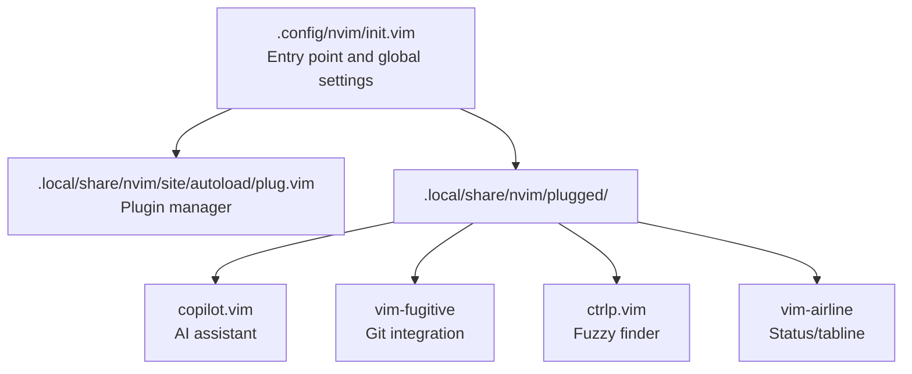
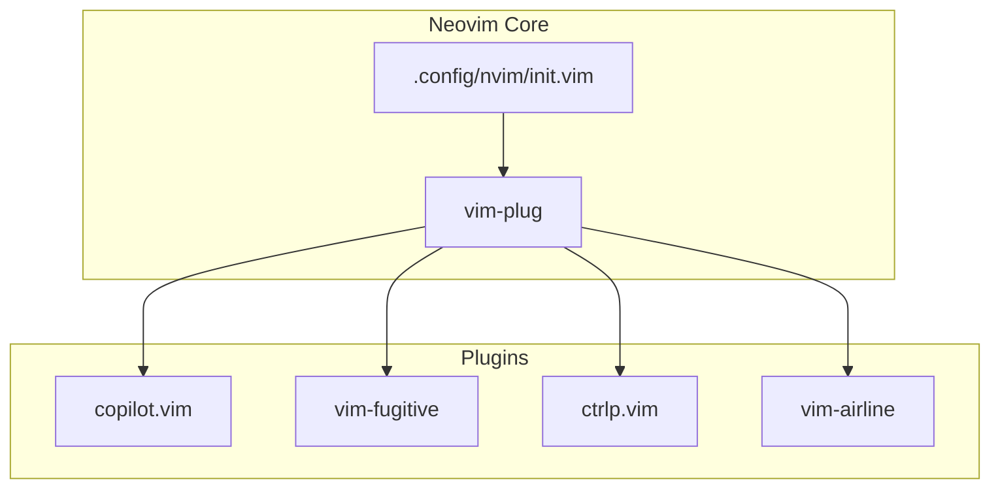
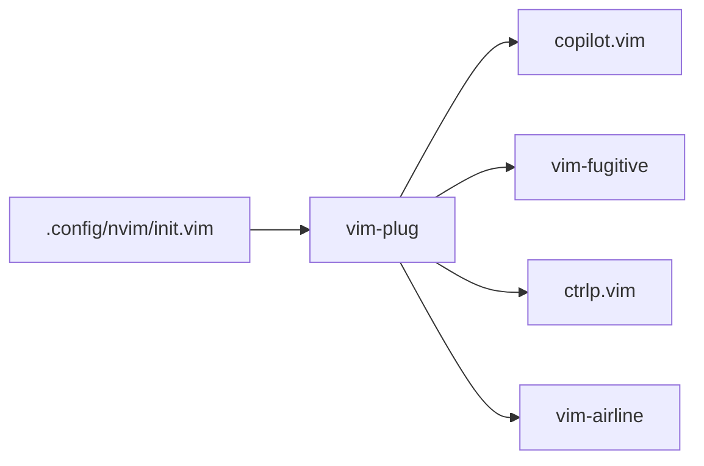

# Text Editor Setup (Neovim)

<cite>
**Referenced Files in This Document**
- [init.vim](file://.config/nvim/init.vim)
- [copilot.vim](file://.local/share/nvim/plugged/copilot.vim/plugin/copilot.vim)
- [fugitive.vim](file://.local/share/nvim/plugged/vim-fugitive/plugin/fugitive.vim)
- [ctrlp.vim](file://.local/share/nvim/plugged/ctrlp.vim/plugin/ctrlp.vim)
- [airline.vim](file://.local/share/nvim/plugged/vim-airline/plugin/airline.vim)
</cite>

## Table of Contents
1. [Introduction](#introduction)
2. [Project Structure](#project-structure)
3. [Core Components](#core-components)
4. [Architecture Overview](#architecture-overview)
5. [Detailed Component Analysis](#detailed-component-analysis)
6. [Dependency Analysis](#dependency-analysis)
7. [Performance Considerations](#performance-considerations)
8. [Troubleshooting Guide](#troubleshooting-guide)
9. [Conclusion](#conclusion)

## Introduction
This document explains the Neovim configuration and its extensive plugin ecosystem. It covers the core configuration architecture, plugin management with vim-plug, and integrations with external AI assistants. The setup includes:
- General editor behavior and UI preferences
- Plugin management and installation
- AI assistance via Copilot
- Version control integration via Fugitive
- Productivity enhancements via CtrlP and vim-airline
- Folding and language-specific support
- Practical workflows, key mappings, and customization options

## Project Structure
Neovim reads its configuration from a single entry point and dynamically loads plugins managed by vim-plug. The repository organizes Neovim under ~/.config/nvim and stores third-party plugins under ~/.local/share/nvim/plugged. The primary configuration file declares plugin dependencies and sets global defaults and key mappings.

**Diagram sources**
- [.config/nvim/init.vim](file://.config/nvim/init.vim#L135-L161)
- [.local/share/nvim/site/autoload/plug.vim](file://.local/share/nvim/site/autoload/plug.vim)

**Section sources**
- [.config/nvim/init.vim](file://.config/nvim/init.vim#L1-L352)

## Core Components
- Global editor settings: syntax, indentation, search, folds, listchars, backup/swap, and provider selection
- Plugin management: vim-plug block defines 20+ plugins including AI, version control, folding, and productivity
- Leader-based key mappings: quick actions for saving, folding, navigation, tabs, and background switching
- Status line and theme: airline enabled with tabline and a selected theme
- File-type-specific behavior: custom tabstops and detection for various languages and formats

Key configuration anchors:
- General settings and folds: lines 5–53
- Backup and swap: lines 86–131
- Plugin block and AI/LLM integrations: lines 135–161
- Leader mappings: lines 199–242
- Status line: line 264
- File-type settings: lines 171–197

**Section sources**
- [.config/nvim/init.vim](file://.config/nvim/init.vim#L5-L53)
- [.config/nvim/init.vim](file://.config/nvim/init.vim#L86-L131)
- [.config/nvim/init.vim](file://.config/nvim/init.vim#L135-L161)
- [.config/nvim/init.vim](file://.config/nvim/init.vim#L199-L242)
- [.config/nvim/init.vim](file://.config/nvim/init.vim#L264)
- [.config/nvim/init.vim](file://.config/nvim/init.vim#L171-L197)

## Architecture Overview
Neovim initializes with global defaults, then loads vim-plug to manage plugins. Each plugin contributes commands, mappings, and UI updates. The AI assistant integrates via Copilot, while version control is handled by Fugitive. Productivity is improved by CtrlP for fuzzy finding and vim-airline for status/tabline.

**Diagram sources**
- [.config/nvim/init.vim](file://.config/nvim/init.vim#L135-L161)
- [.local/share/nvim/plugged/copilot.vim/plugin/copilot.vim](file://.local/share/nvim/plugged/copilot.vim/plugin/copilot.vim#L1-L115)
- [.local/share/nvim/plugged/vim-fugitive/plugin/fugitive.vim](file://.local/share/nvim/plugged/vim-fugitive/plugin/fugitive.vim#L547-L637)
- [.local/share/nvim/plugged/ctrlp.vim/plugin/ctrlp.vim](file://.local/share/nvim/plugged/ctrlp.vim/plugin/ctrlp.vim#L1-L73)
- [.local/share/nvim/plugged/vim-airline/plugin/airline.vim](file://.local/share/nvim/plugged/vim-airline/plugin/airline.vim#L1-L321)

## Detailed Component Analysis

### Plugin Management (vim-plug)
- Declares plugin dependencies and enables them at startup
- Supports AI/assistant plugins (Copilot), version control (Fugitive), fuzzy finder (CtrlP), status/tabline (Airline), folding helpers (FastFold/SimpylFold), and others
- Ensures plugin directory exists before loading

Practical steps:
- Install vim-plug if missing
- Open Neovim and run the plugin installation command to fetch declared plugins
- Update plugins periodically using the plugin manager’s update mechanism

**Section sources**
- [.config/nvim/init.vim](file://.config/nvim/init.vim#L135-L161)

### AI Assistant Integration (Copilot)
- Provides insert-mode mappings for accepting suggestions and navigating suggestions
- Registers commands and autocmds for initialization and lifecycle events
- Defines suggestion highlighting and fallback behavior for Tab key

Workflow tips:
- Use configured insert-mode shortcuts to accept word/line or navigate suggestions
- Ensure the Copilot language server is running and accessible
- Customize mappings if they conflict with existing ones

**Section sources**
- [.local/share/nvim/plugged/copilot.vim/plugin/copilot.vim](file://.local/share/nvim/plugged/copilot.vim/plugin/copilot.vim#L23-L109)

### Version Control (Fugitive)
- Exposes Git commands and buffers through convenient Ex commands
- Detects Git repositories and adjusts behavior accordingly
- Provides commands for status, log, diff, browse, and file operations

Typical usage:
- Use :Git commands to stage, commit, push, pull, and inspect logs
- Open a Git-aware status buffer to review changes
- Browse commits and files directly from the editor

**Section sources**
- [.local/share/nvim/plugged/vim-fugitive/plugin/fugitive.vim](file://.local/share/nvim/plugged/vim-fugitive/plugin/fugitive.vim#L547-L637)

### Productivity Enhancements (CtrlP)
- Fuzzy finder for files, buffers, MRU, tags, and more
- Configurable ignores and custom Git-aware scanning
- Remaps a leader key to open the finder

Usage:
- Trigger the finder with the mapped leader key
- Narrow results by typing patterns
- Select items to jump to or operate on

**Section sources**
- [.local/share/nvim/plugged/ctrlp.vim/plugin/ctrlp.vim](file://.local/share/nvim/plugged/ctrlp.vim/plugin/ctrlp.vim#L17-L40)
- [.config/nvim/init.vim](file://.config/nvim/init.vim#L274-L288)

### Status and Tabline (vim-airline)
- Enables tabline with unique file formatting and Powerline-style glyphs
- Loads themes and reacts to color scheme changes
- Integrates with other extensions and updates statusline/tabline on events

Customization:
- Choose a theme and enable tabline features
- Adjust statusline parts and separators as needed

**Section sources**
- [.local/share/nvim/plugged/vim-airline/plugin/airline.vim](file://.local/share/nvim/plugged/vim-airline/plugin/airline.vim#L14-L48)
- [.config/nvim/init.vim](file://.config/nvim/init.vim#L291-L298)

### Folding and Language Support
- Default fold method set to syntax with initial fold level
- Language-specific folding toggles for JavaScript, XML, and shell
- Additional folding plugins installed (FastFold, SimpylFold) for performance and preview

Workflow:
- Toggle fold methods via leader shortcuts
- Use folding plugins to improve responsiveness in large files

**Section sources**
- [.config/nvim/init.vim](file://.config/nvim/init.vim#L47-L53)
- [.config/nvim/init.vim](file://.config/nvim/init.vim#L323-L336)

### Leader-Based Workflows and Key Mappings
Common leader shortcuts include:
- Save with sudo, clear search highlights, redraw screen, reload buffer
- Switch background, toggle fold methods, open file explorer
- Execute current Python file, yank to system clipboard
- Split navigation and tab management

Navigation and tabs:
- Use leader-based splits and tabs for efficient multi-file workflows

**Section sources**
- [.config/nvim/init.vim](file://.config/nvim/init.vim#L199-L260)

### Backup and Swap Files
- Per-project backup and swap directories organized by file path
- Hooks to create backups and swap files in structured locations before writing

**Section sources**
- [.config/nvim/init.vim](file://.config/nvim/init.vim#L86-L131)

### File-Type Specific Behavior
- Adds filetype-specific tab settings for JavaScript, HTML, CSS, JSON, Markdown, Shell, and Robot
- Treats certain files as specific types (e.g., Kivy atlas as JSON, KV as YAML, MD as Markdown)

**Section sources**
- [.config/nvim/init.vim](file://.config/nvim/init.vim#L171-L197)

## Dependency Analysis
The configuration declares a curated set of plugins and relies on vim-plug for lifecycle management. Each plugin contributes distinct capabilities:
- Copilot depends on a running language server and integrates via insert-mode mappings
- Fugitive depends on Git availability and exposes a rich command set
- CtrlP depends on fuzzy matching and ignores configured via .gitignore
- vim-airline depends on themes and reacts to color scheme changes

**Diagram sources**
- [.config/nvim/init.vim](file://.config/nvim/init.vim#L135-L161)

**Section sources**
- [.config/nvim/init.vim](file://.config/nvim/init.vim#L135-L161)

## Performance Considerations
- Folding: Prefer syntax-based folding with initial fold level; use FastFold/SimpylFold for large files
- Search: Smart case and incremental search reduce accidental matches and improve responsiveness
- Provider selection: Disable heavy language providers and configure Python host path for speed
- Status line: vim-airline updates on events; keep extensions minimal for faster redraws
- Finder: CtrlP ignores compiled and temporary files to reduce scanning overhead

[No sources needed since this section provides general guidance]

## Troubleshooting Guide
- Plugins not loading:
  - Ensure vim-plug is present and run the plugin installation/update command
  - Verify plugin directories exist under ~/.local/share/nvim/plugged
- Copilot not responding:
  - Confirm the Copilot language server is reachable
  - Check insert-mode mappings and conflicts with other plugins
- Fugitive commands unavailable:
  - Ensure Git is installed and accessible
  - Verify repository detection and buffer types
- CtrlP ignores not applied:
  - Confirm .gitignore presence and user command configuration
- Status line not updating:
  - Reinitialize vim-airline or switch themes
  - Ensure color scheme change events are firing

**Section sources**
- [.config/nvim/init.vim](file://.config/nvim/init.vim#L135-L161)
- [.local/share/nvim/plugged/copilot.vim/plugin/copilot.vim](file://.local/share/nvim/plugged/copilot.vim/plugin/copilot.vim#L23-L109)
- [.local/share/nvim/plugged/vim-fugitive/plugin/fugitive.vim](file://.local/share/nvim/plugged/vim-fugitive/plugin/fugitive.vim#L547-L637)
- [.local/share/nvim/plugged/ctrlp.vim/plugin/ctrlp.vim](file://.local/share/nvim/plugged/ctrlp.vim/plugin/ctrlp.vim#L17-L40)
- [.local/share/nvim/plugged/vim-airline/plugin/airline.vim](file://.local/share/nvim/plugged/vim-airline/plugin/airline.vim#L14-L48)

## Conclusion
This Neovim setup provides a robust foundation for development with a curated plugin ecosystem. It balances productivity (fuzzy finder, status line), version control (Git integration), AI assistance (Copilot), and maintainability (structured backups, folding, and provider tuning). By following the installation and customization steps outlined here, you can tailor the environment to your workflow while leveraging the included key mappings and file-type behaviors.