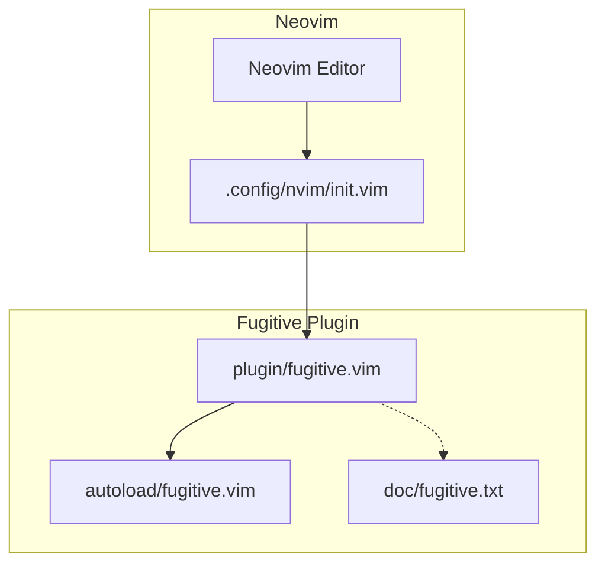
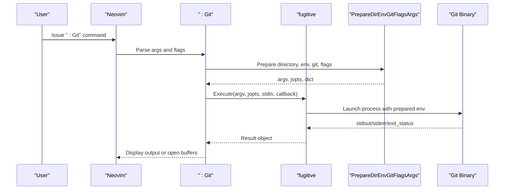
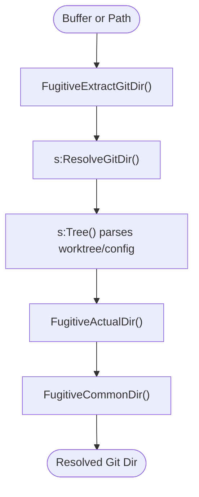
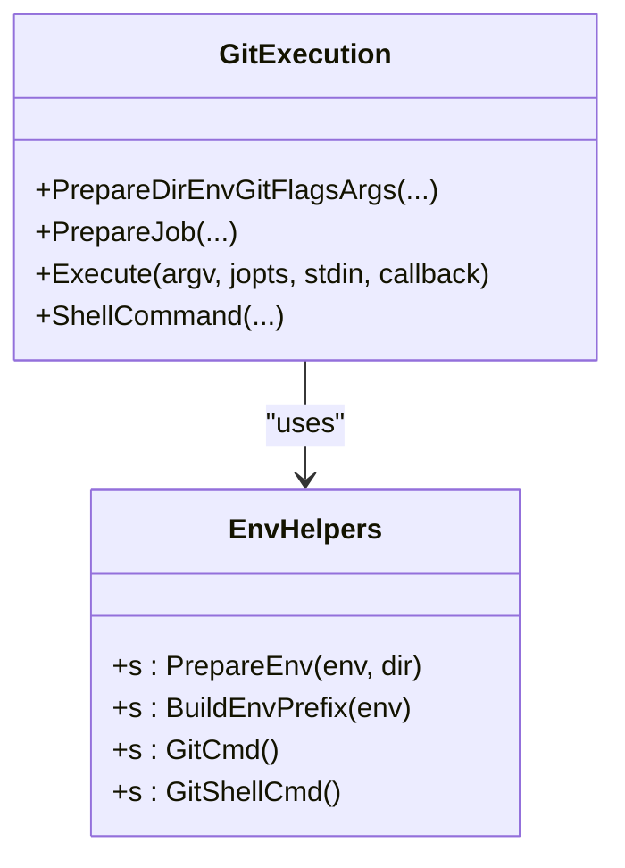
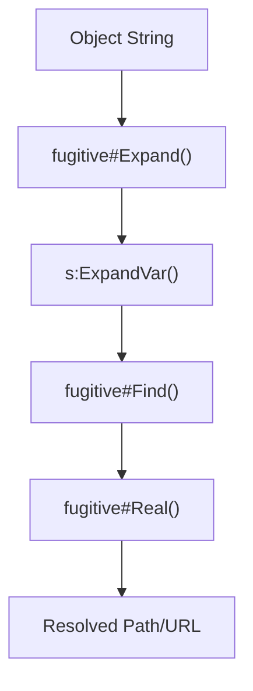
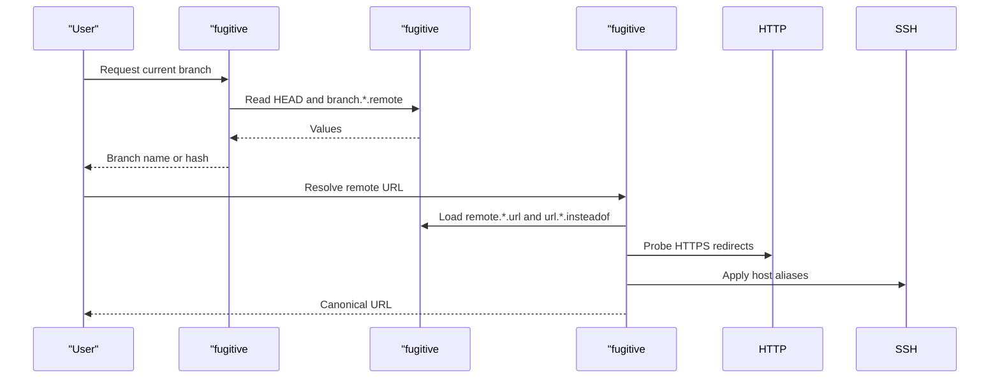
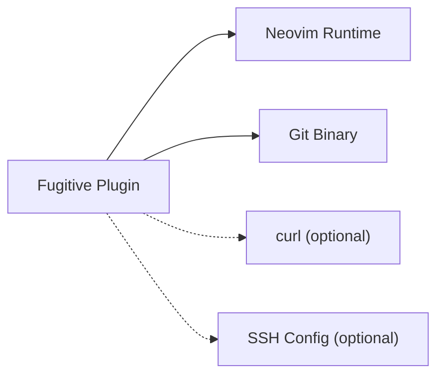

# Fugitive Git Integration

<cite>
**Referenced Files in This Document**
- [fugitive.vim](file://.local/share/nvim/plugged/vim-fugitive/plugin/fugitive.vim)
- [fugitive autoload](file://.local/share/nvim/plugged/vim-fugitive/autoload/fugitive.vim)
- [fugitive documentation](file://.local/share/nvim/plugged/vim-fugitive/doc/fugitive.txt)
- [neovim init](file://.config/nvim/init.vim)
</cite>

## Table of Contents
1. [Introduction](#introduction)
2. [Project Structure](#project-structure)
3. [Core Components](#core-components)
4. [Architecture Overview](#architecture-overview)
5. [Detailed Component Analysis](#detailed-component-analysis)
6. [Dependency Analysis](#dependency-analysis)
7. [Performance Considerations](#performance-considerations)
8. [Troubleshooting Guide](#troubleshooting-guide)
9. [Conclusion](#conclusion)

## Introduction
This document explains the Fugitive plugin's Git integration for Neovim. It covers repository detection, Git command execution, staging and committing, branch and remote handling, and the plugin's command structure. It also documents configuration options for customizing the Git executable, editor integration, and environment variable handling, along with advanced topics such as worktree support and integration with other Git tools.

## Project Structure
Fugitive is installed as a Neovim plugin and exposes a Git wrapper with:
- A plugin module that defines commands and autocommands
- An autoload module that implements core Git operations
- Documentation describing commands, mappings, and behaviors
- Optional user configuration in Neovim initialization

**Diagram sources**
- [fugitive.vim](file://.local/share/nvim/plugged/vim-fugitive/plugin/fugitive.vim#L547-L596)
- [fugitive autoload](file://.local/share/nvim/plugged/vim-fugitive/autoload/fugitive.vim#L824-L844)
- [fugitive documentation](file://.local/share/nvim/plugged/vim-fugitive/doc/fugitive.txt#L1-L748)
- [neovim init](file://.config/nvim/init.vim#L139-L161)

**Section sources**
- [fugitive.vim](file://.local/share/nvim/plugged/vim-fugitive/plugin/fugitive.vim#L547-L596)
- [fugitive autoload](file://.local/share/nvim/plugged/vim-fugitive/autoload/fugitive.vim#L824-L844)
- [fugitive documentation](file://.local/share/nvim/plugged/vim-fugitive/doc/fugitive.txt#L1-L748)
- [neovim init](file://.config/nvim/init.vim#L139-L161)

## Core Components
- Repository detection and path resolution
- Git command execution and environment handling
- Object and path expansion for Git revisions and files
- Statusline integration and buffer mappings
- Remote URL parsing and HTTP header probing
- Quickfix integration for log and grep operations

Key responsibilities:
- Detect Git repository boundaries and worktree roots
- Build and execute Git commands with proper environment and pathspecs
- Provide object notation for commits, blobs, and worktree paths
- Offer convenient commands for staging, committing, branching, and browsing

**Section sources**
- [fugitive.vim](file://.local/share/nvim/plugged/vim-fugitive/plugin/fugitive.vim#L18-L470)
- [fugitive autoload](file://.local/share/nvim/plugged/vim-fugitive/autoload/fugitive.vim#L462-L822)
- [fugitive autoload](file://.local/share/nvim/plugged/vim-fugitive/autoload/fugitive.vim#L1015-L1040)
- [fugitive autoload](file://.local/share/nvim/plugged/vim-fugitive/autoload/fugitive.vim#L1489-L1505)

## Architecture Overview
Fugitive integrates with Neovim through:
- Command definitions that delegate to autoload functions
- Autocommands that initialize repository context and buffer behavior
- A central API for Git operations, environment preparation, and path resolution

**Diagram sources**
- [fugitive.vim](file://.local/share/nvim/plugged/vim-fugitive/plugin/fugitive.vim#L547-L596)
- [fugitive autoload](file://.local/share/nvim/plugged/vim-fugitive/autoload/fugitive.vim#L800-L844)
- [fugitive autoload](file://.local/share/nvim/plugged/vim-fugitive/autoload/fugitive.vim#L824-L844)
- [fugitive autoload](file://.local/share/nvim/plugged/vim-fugitive/autoload/fugitive.vim#L846-L906)

## Detailed Component Analysis

### Repository Detection and Worktree Support
Fugitive detects the Git directory and resolves worktrees:
- Extracts Git directory from buffer path or environment
- Resolves symbolic links and external gitdirs
- Supports worktrees via config parsing and commondir resolution
- Provides functions to detect bare repos and resolve actual gitdir

**Diagram sources**
- [fugitive.vim](file://.local/share/nvim/plugged/vim-fugitive/plugin/fugitive.vim#L423-L470)
- [fugitive.vim](file://.local/share/nvim/plugged/vim-fugitive/plugin/fugitive.vim#L340-L386)
- [fugitive.vim](file://.local/share/nvim/plugged/vim-fugitive/plugin/fugitive.vim#L272-L306)

**Section sources**
- [fugitive.vim](file://.local/share/nvim/plugged/vim-fugitive/plugin/fugitive.vim#L18-L470)
- [fugitive.vim](file://.local/share/nvim/plugged/vim-fugitive/plugin/fugitive.vim#L308-L386)

### Git Command Execution and Environment
Fugitive builds robust command invocations:
- Parses flags and arguments, supports stdin injection
- Prepares environment variables and pathspecs
- Handles worktree-specific environment and GIT_INDEX_FILE
- Executes via job APIs or system fallback

**Diagram sources**
- [fugitive autoload](file://.local/share/nvim/plugged/vim-fugitive/autoload/fugitive.vim#L800-L844)
- [fugitive autoload](file://.local/share/nvim/plugged/vim-fugitive/autoload/fugitive.vim#L824-L906)
- [fugitive autoload](file://.local/share/nvim/plugged/vim-fugitive/autoload/fugitive.vim#L462-L537)

**Section sources**
- [fugitive autoload](file://.local/share/nvim/plugged/vim-fugitive/autoload/fugitive.vim#L800-L906)
- [fugitive autoload](file://.local/share/nvim/plugged/vim-fugitive/autoload/fugitive.vim#L462-L537)

### Object and Path Expansion
Fugitive supports a rich object notation:
- Expands commit specs, worktree-relative paths, and index stages
- Converts between virtual fugitive URLs and real paths
- Handles globbing within repository trees

**Diagram sources**
- [fugitive autoload](file://.local/share/nvim/plugged/vim-fugitive/autoload/fugitive.vim#L2079-L2083)
- [fugitive autoload](file://.local/share/nvim/plugged/vim-fugitive/autoload/fugitive.vim#L1968-L2083)
- [fugitive autoload](file://.local/share/nvim/plugged/vim-fugitive/autoload/fugitive.vim#L1802-L1916)

**Section sources**
- [fugitive autoload](file://.local/share/nvim/plugged/vim-fugitive/autoload/fugitive.vim#L1802-L1916)
- [fugitive autoload](file://.local/share/nvim/plugged/vim-fugitive/autoload/fugitive.vim#L1939-L2083)

### Branch and Remote Handling
- Head detection with caching and short-hash support
- Remote URL resolution with HTTP redirects and SSH host aliasing
- Config-driven URL rewriting via "insteadOf" patterns

**Diagram sources**
- [fugitive autoload](file://.local/share/nvim/plugged/vim-fugitive/autoload/fugitive.vim#L1015-L1040)
- [fugitive autoload](file://.local/share/nvim/plugged/vim-fugitive/autoload/fugitive.vim#L1211-L1221)
- [fugitive autoload](file://.local/share/nvim/plugged/vim-fugitive/autoload/fugitive.vim#L1489-L1505)
- [fugitive autoload](file://.local/share/nvim/plugged/vim-fugitive/autoload/fugitive.vim#L1323-L1338)

**Section sources**
- [fugitive autoload](file://.local/share/nvim/plugged/vim-fugitive/autoload/fugitive.vim#L1015-L1040)
- [fugitive autoload](file://.local/share/nvim/plugged/vim-fugitive/autoload/fugitive.vim#L1489-L1505)
- [fugitive autoload](file://.local/share/nvim/plugged/vim-fugitive/autoload/fugitive.vim#L1323-L1338)

### Command Structure and Practical Usage
Fugitive exposes a concise command set:
- :Git with optional flags for paging, background execution, and temp file handling
- :G shorthand for :Git
- Object-aware commands (:Gedit, :Gread, :Gwrite, :Gdiffsplit, etc.)
- Navigation and staging maps in summary and object buffers
- Quickfix integration for log and grep operations

Practical usage patterns:
- Stage/unstage changes with s/u/- mappings
- Commit with cc, amend with ca/cv
- View blame with :Git blame and navigate with o/O/p
- Browse upstream with :GBrowse
- Search with :Ggrep and :Glgrep

**Section sources**
- [fugitive documentation](file://.local/share/nvim/plugged/vim-fugitive/doc/fugitive.txt#L13-L748)
- [fugitive.vim](file://.local/share/nvim/plugged/vim-fugitive/plugin/fugitive.vim#L547-L637)

### Configuration Examples
Customize Fugitive behavior via Neovim configuration:
- Git executable path and flags
- Editor integration and environment variables
- Statusline integration

Examples (descriptive):
- Override the Git executable path globally
- Set flags to pass to Git commands
- Configure environment variables for editors and tools
- Add repository status to the statusline

Note: Replace placeholders with your environment and preferences.

**Section sources**
- [fugitive autoload](file://.local/share/nvim/plugged/vim-fugitive/autoload/fugitive.vim#L462-L537)
- [fugitive documentation](file://.local/share/nvim/plugged/vim-fugitive/doc/fugitive.txt#L646-L654)

## Dependency Analysis
Fugitive depends on:
- Neovim runtime features (jobs, channels, autocommands)
- Git binary availability and version compatibility
- Optional tools for HTTP probing and SSH configuration

**Diagram sources**
- [fugitive autoload](file://.local/share/nvim/plugged/vim-fugitive/autoload/fugitive.vim#L1323-L1338)
- [fugitive autoload](file://.local/share/nvim/plugged/vim-fugitive/autoload/fugitive.vim#L1273-L1302)

**Section sources**
- [fugitive autoload](file://.local/share/nvim/plugged/vim-fugitive/autoload/fugitive.vim#L1323-L1338)
- [fugitive autoload](file://.local/share/nvim/plugged/vim-fugitive/autoload/fugitive.vim#L1273-L1302)

## Performance Considerations
- Caching of HEAD and config data reduces repeated Git calls
- Streaming and background execution minimize UI blocking
- Pathspec handling avoids unnecessary filesystem scans
- Quickfix operations can be expensive with large datasets; prefer streaming modes

## Troubleshooting Guide
Common issues and resolutions:
- Git not found or incompatible version: Ensure Git 1.8.5+ is installed and discoverable
- Working tree errors with external gitdirs: Provide core.worktree when using external .git
- No repository detected: Verify buffer path is within a Git-controlled directory
- Remote URL resolution failures: Confirm network connectivity and SSH config

Diagnostic tips:
- Use :Git --paginate to capture output for inspection
- Check last command result via FugitiveResult()
- Review messages for explicit error hints

**Section sources**
- [fugitive autoload](file://.local/share/nvim/plugged/vim-fugitive/autoload/fugitive.vim#L102-L119)
- [fugitive autoload](file://.local/share/nvim/plugged/vim-fugitive/autoload/fugitive.vim#L121-L133)
- [fugitive documentation](file://.local/share/nvim/plugged/vim-fugitive/doc/fugitive.txt#L693-L697)

## Conclusion
Fugitive provides a powerful, seamless Git integration for Neovim. Its repository detection, robust command execution, object notation, and buffer mappings enable efficient Git workflows directly from the editor. With configurable Git executables, environment handling, and advanced features like remote resolution and quickfix integration, Fugitive adapts to diverse development environments and practices.