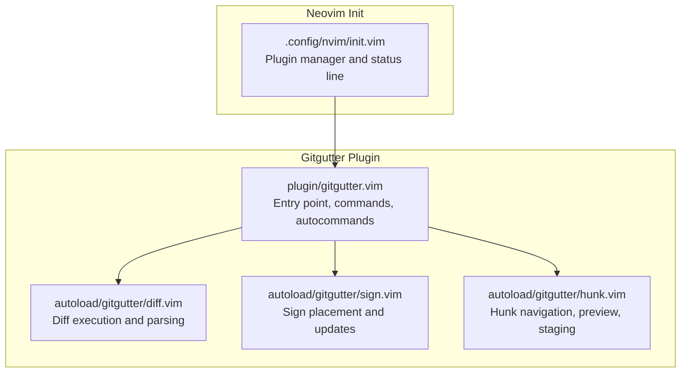
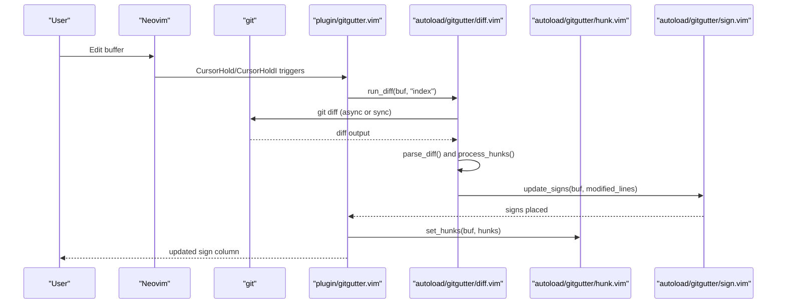
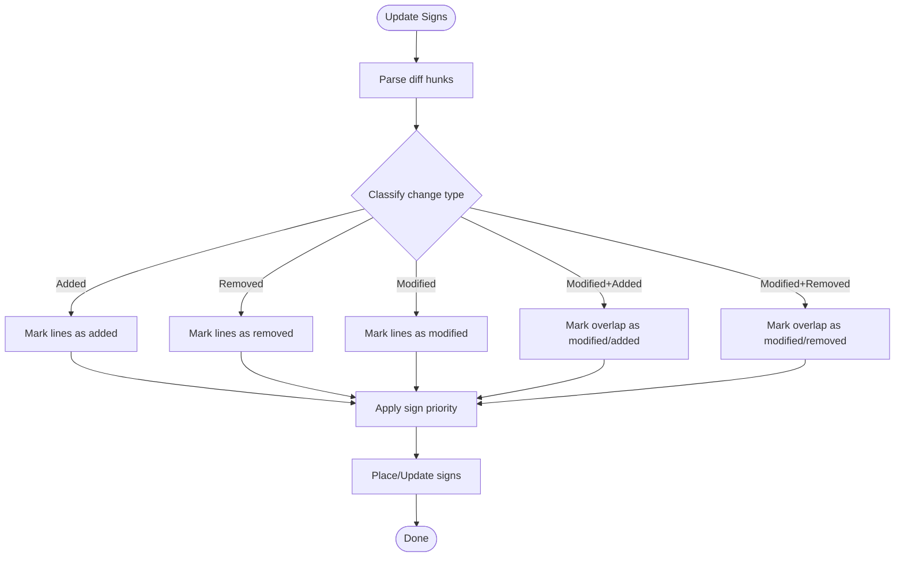
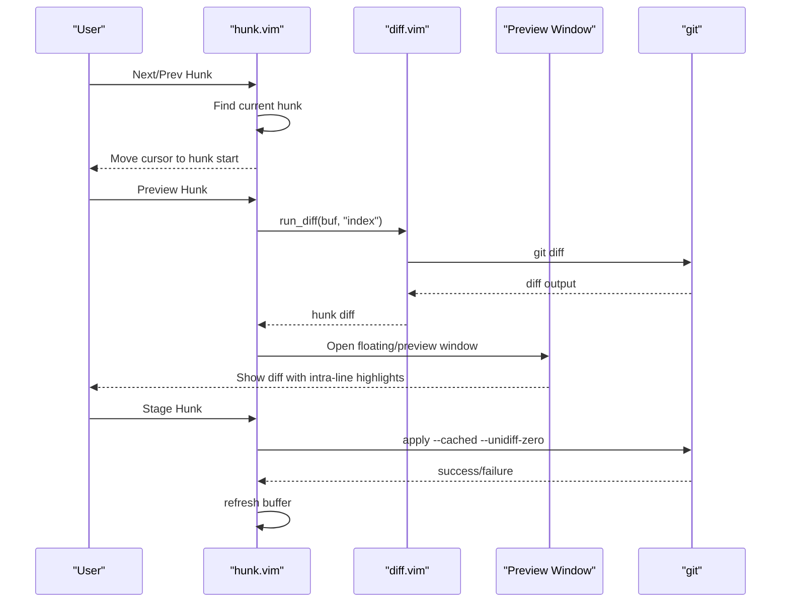
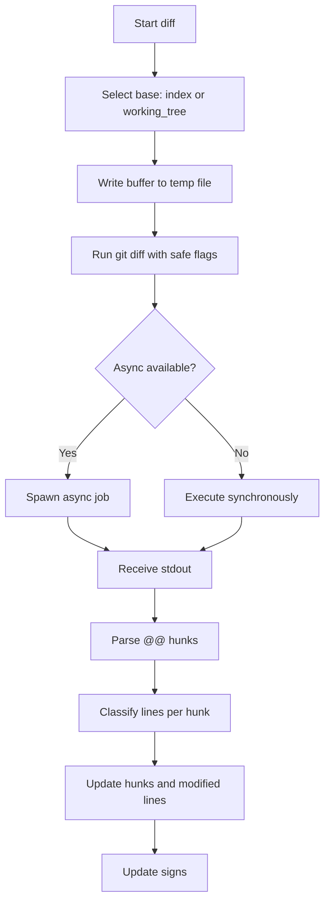
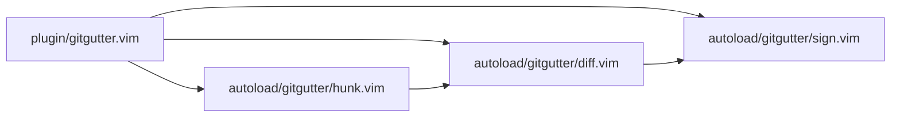

# Gitgutter Visual Change Tracking

<cite>
**Referenced Files in This Document**
- [init.vim](file://.config/nvim/init.vim)
- [gitgutter.vim](file://.local/share/nvim/plugged/vim-gitgutter/plugin/gitgutter.vim)
- [sign.vim](file://.local/share/nvim/plugged/vim-gitgutter/autoload/gitgutter/sign.vim)
- [hunk.vim](file://.local/share/nvim/plugged/vim-gitgutter/autoload/gitgutter/hunk.vim)
- [diff.vim](file://.local/share/nvim/plugged/vim-gitgutter/autoload/gitgutter/diff.vim)
- [README.mkd](file://.local/share/nvim/plugged/vim-gitgutter/README.mkd)
</cite>

## Table of Contents
1. [Introduction](#introduction)
2. [Project Structure](#project-structure)
3. [Core Components](#core-components)
4. [Architecture Overview](#architecture-overview)
5. [Detailed Component Analysis](#detailed-component-analysis)
6. [Dependency Analysis](#dependency-analysis)
7. [Performance Considerations](#performance-considerations)
8. [Troubleshooting Guide](#troubleshooting-guide)
9. [Conclusion](#conclusion)
10. [Appendices](#appendices)

## Introduction
This document explains how the Gitgutter plugin renders Git modifications in Neovim’s sign column, integrates with the status line for change counts and branch information, and provides hunk management features such as jumping between hunks, previewing changes, and staging/unstaging partial hunks. It also covers configuration options for customizing sign symbols, colors, and update triggers, along with practical usage scenarios for code review, conflict resolution, and understanding code evolution.

## Project Structure
Gitgutter is installed via vim-plug and consists of:
- A plugin entry that initializes defaults, defines commands, and wires autocommands
- An autoload subsystem for diff computation and hunk parsing
- An autoload subsystem for sign placement and updates
- An autoload subsystem for hunk navigation, preview, and staging
- Documentation and README with extensive configuration and usage guidance

**Diagram sources**
- [init.vim](file://.config/nvim/init.vim#L137-L161)
- [gitgutter.vim](file://.local/share/nvim/plugged/vim-gitgutter/plugin/gitgutter.vim#L1-L350)
- [diff.vim](file://.local/share/nvim/plugged/vim-gitgutter/autoload/gitgutter/diff.vim#L1-L407)
- [sign.vim](file://.local/share/nvim/plugged/vim-gitgutter/autoload/gitgutter/sign.vim#L1-L251)
- [hunk.vim](file://.local/share/nvim/plugged/vim-gitgutter/autoload/gitgutter/hunk.vim#L1-L667)

**Section sources**
- [.config/nvim/init.vim](file://.config/nvim/init.vim#L137-L161)
- [.local/share/nvim/plugged/vim-gitgutter/plugin/gitgutter.vim](file://.local/share/nvim/plugged/vim-gitgutter/plugin/gitgutter.vim#L1-L350)

## Core Components
- Sign rendering engine: places and updates Git gutter signs for added, modified, and removed lines, with support for overlapping or clobbering other plugins’ signs.
- Hunk management: computes hunks, navigates between them, previews changes in a dedicated window or floating window, stages/undoes hunks, and supports partial staging.
- Diff pipeline: executes git diff against index or working tree, parses hunks, and updates the UI.
- Status line integration: exposes a function to retrieve per-buffer change summaries for display in the status line.

Key behaviors:
- Realtime updates driven by autocommands and optional asynchronous execution.
- Preservation or clobbering of non-GitGutter signs configurable via options.
- Hunk preview supports both traditional preview window and modern floating windows on Neovim.

**Section sources**
- [.local/share/nvim/plugged/vim-gitgutter/autoload/gitgutter/sign.vim](file://.local/share/nvim/plugged/vim-gitgutter/autoload/gitgutter/sign.vim#L53-L94)
- [.local/share/nvim/plugged/vim-gitgutter/autoload/gitgutter/hunk.vim](file://.local/share/nvim/plugged/vim-gitgutter/autoload/gitgutter/hunk.vim#L47-L108)
- [.local/share/nvim/plugged/vim-gitgutter/autoload/gitgutter/diff.vim](file://.local/share/nvim/plugged/vim-gitgutter/autoload/gitgutter/diff.vim#L56-L153)
- [.local/share/nvim/plugged/vim-gitgutter/README.mkd](file://.local/share/nvim/plugged/vim-gitgutter/README.mkd#L277-L289)

## Architecture Overview
The plugin orchestrates updates through a combination of autocommands and asynchronous jobs. The flow below maps the actual code paths used during typical edits and focus changes.

**Diagram sources**
- [.local/share/nvim/plugged/vim-gitgutter/plugin/gitgutter.vim](file://.local/share/nvim/plugged/vim-gitgutter/plugin/gitgutter.vim#L300-L305)
- [.local/share/nvim/plugged/vim-gitgutter/autoload/gitgutter/diff.vim](file://.local/share/nvim/plugged/vim-gitgutter/autoload/gitgutter/diff.vim#L56-L153)
- [.local/share/nvim/plugged/vim-gitgutter/autoload/gitgutter/sign.vim](file://.local/share/nvim/plugged/vim-gitgutter/autoload/gitgutter/sign.vim#L53-L94)
- [.local/share/nvim/plugged/vim-gitgutter/autoload/gitgutter/hunk.vim](file://.local/share/nvim/plugged/vim-gitgutter/autoload/gitgutter/hunk.vim#L5-L12)

## Detailed Component Analysis

### Sign Rendering Engine
Responsibilities:
- Compute modified lines per hunk category (added, modified, removed, modified+removed).
- Place/update signs with configurable priority and symbol sets.
- Support removal of all signs or selective updates to minimize redraw overhead.
- Handle special cases like “removed-first-line” and “removed above and below”.

**Diagram sources**
- [.local/share/nvim/plugged/vim-gitgutter/autoload/gitgutter/diff.vim](file://.local/share/nvim/plugged/vim-gitgutter/autoload/gitgutter/diff.vim#L214-L254)
- [.local/share/nvim/plugged/vim-gitgutter/autoload/gitgutter/sign.vim](file://.local/share/nvim/plugged/vim-gitgutter/autoload/gitgutter/sign.vim#L53-L94)

**Section sources**
- [.local/share/nvim/plugged/vim-gitgutter/autoload/gitgutter/sign.vim](file://.local/share/nvim/plugged/vim-gitgutter/autoload/gitgutter/sign.vim#L53-L94)
- [.local/share/nvim/plugged/vim-gitgutter/autoload/gitgutter/diff.vim](file://.local/share/nvim/plugged/vim-gitgutter/autoload/gitgutter/diff.vim#L214-L254)

### Hunk Management
Capabilities:
- Jump between hunks forward/backward with configurable mappings.
- Preview current hunk in a floating or preview window with intra-line change highlighting.
- Stage or undo the current hunk; stage partial hunks by selecting lines and staging.
- Retrieve hunk list and compute per-buffer summaries for status line integration.

**Diagram sources**
- [.local/share/nvim/plugged/vim-gitgutter/autoload/gitgutter/hunk.vim](file://.local/share/nvim/plugged/vim-gitgutter/autoload/gitgutter/hunk.vim#L47-L108)
- [.local/share/nvim/plugged/vim-gitgutter/autoload/gitgutter/hunk.vim](file://.local/share/nvim/plugged/vim-gitgutter/autoload/gitgutter/hunk.vim#L220-L296)
- [.local/share/nvim/plugged/vim-gitgutter/autoload/gitgutter/diff.vim](file://.local/share/nvim/plugged/vim-gitgutter/autoload/gitgutter/diff.vim#L56-L153)

**Section sources**
- [.local/share/nvim/plugged/vim-gitgutter/autoload/gitgutter/hunk.vim](file://.local/share/nvim/plugged/vim-gitgutter/autoload/gitgutter/hunk.vim#L47-L108)
- [.local/share/nvim/plugged/vim-gitgutter/autoload/gitgutter/hunk.vim](file://.local/share/nvim/plugged/vim-gitgutter/autoload/gitgutter/hunk.vim#L220-L296)
- [.local/share/nvim/plugged/vim-gitgutter/autoload/gitgutter/hunk.vim](file://.local/share/nvim/plugged/vim-gitgutter/autoload/gitgutter/hunk.vim#L361-L377)

### Diff Pipeline
Key steps:
- Determine diff base: index (default) or working tree.
- Write buffer contents to temporary files with correct encoding and line endings.
- Run git diff with safe flags to avoid noisy stderr and race conditions.
- Parse @@ hunks and classify each line into added/modified/removed categories.
- Update hunk metadata and trigger sign updates.

**Diagram sources**
- [.local/share/nvim/plugged/vim-gitgutter/autoload/gitgutter/diff.vim](file://.local/share/nvim/plugged/vim-gitgutter/autoload/gitgutter/diff.vim#L56-L153)
- [.local/share/nvim/plugged/vim-gitgutter/autoload/gitgutter/diff.vim](file://.local/share/nvim/plugged/vim-gitgutter/autoload/gitgutter/diff.vim#L188-L220)

**Section sources**
- [.local/share/nvim/plugged/vim-gitgutter/autoload/gitgutter/diff.vim](file://.local/share/nvim/plugged/vim-gitgutter/autoload/gitgutter/diff.vim#L56-L153)
- [.local/share/nvim/plugged/vim-gitgutter/autoload/gitgutter/diff.vim](file://.local/share/nvim/plugged/vim-gitgutter/autoload/gitgutter/diff.vim#L188-L220)

### Status Line Integration (Airline)
Gitgutter provides a function to retrieve a per-buffer summary of changes that can be embedded into the status line. The README documents how to integrate with the status line and mentions built-in integration with vim-airline.

Practical usage:
- Call the summary function from your status line to display counts of added, modified, and removed lines.
- The configuration section documents how to customize the status line integration.

**Section sources**
- [.local/share/nvim/plugged/vim-gitgutter/README.mkd](file://.local/share/nvim/plugged/vim-gitgutter/README.mkd#L277-L289)
- [.local/share/nvim/plugged/vim-gitgutter/plugin/gitgutter.vim](file://.local/share/nvim/plugged/vim-gitgutter/plugin/gitgutter.vim#L190-L195)

## Dependency Analysis
High-level dependencies:
- plugin/gitgutter.vim depends on autoload modules for diff, sign, and hunk operations.
- autoload/gitgutter/diff.vim depends on utility helpers for file and git operations.
- autoload/gitgutter/sign.vim depends on Neovim/Vim sign APIs and handles compatibility across versions.
- autoload/gitgutter/hunk.vim depends on diff parsing and preview window management.

**Diagram sources**
- [.local/share/nvim/plugged/vim-gitgutter/plugin/gitgutter.vim](file://.local/share/nvim/plugged/vim-gitgutter/plugin/gitgutter.vim#L1-L350)
- [.local/share/nvim/plugged/vim-gitgutter/autoload/gitgutter/diff.vim](file://.local/share/nvim/plugged/vim-gitgutter/autoload/gitgutter/diff.vim#L1-L407)
- [.local/share/nvim/plugged/vim-gitgutter/autoload/gitgutter/sign.vim](file://.local/share/nvim/plugged/vim-gitgutter/autoload/gitgutter/sign.vim#L1-L251)
- [.local/share/nvim/plugged/vim-gitgutter/autoload/gitgutter/hunk.vim](file://.local/share/nvim/plugged/vim-gitgutter/autoload/gitgutter/hunk.vim#L1-L667)

**Section sources**
- [.local/share/nvim/plugged/vim-gitgutter/plugin/gitgutter.vim](file://.local/share/nvim/plugged/vim-gitgutter/plugin/gitgutter.vim#L1-L350)

## Performance Considerations
- Asynchronous diffs: Enabled by default when supported; reduces UI blocking during diff computation.
- Update throttling: The README recommends lowering updatetime to improve responsiveness; this affects both swap writes and diff triggers.
- Sign limits: On older Vim versions, a maximum number of signs can be enforced to prevent UI slowdown; configurable via a threshold.
- Terminal focus: If focus events are not reported, consider disabling focus-based updates or adjusting terminal settings.

Practical tips:
- Reduce updatetime to a small value (e.g., 100 ms) for snappier updates.
- Disable asynchronous mode if you encounter issues with your environment.
- Use the max-signs threshold to cap UI updates when reviewing very large diffs.

**Section sources**
- [.local/share/nvim/plugged/vim-gitgutter/README.mkd](file://.local/share/nvim/plugged/vim-gitgutter/README.mkd#L80-L85)
- [.local/share/nvim/plugged/vim-gitgutter/README.mkd](file://.local/share/nvim/plugged/vim-gitgutter/README.mkd#L152-L159)
- [.local/share/nvim/plugged/vim-gitgutter/plugin/gitgutter.vim](file://.local/share/nvim/plugged/vim-gitgutter/plugin/gitgutter.vim#L78-L83)

## Troubleshooting Guide
Common issues and remedies:
- No signs appear at all:
  - Verify git availability and that the file is tracked by Git.
  - Check whether signs are placed but invisible (compare highlight groups).
  - Enable logging to inspect diff execution.
- Signs appear but are incorrect:
  - Confirm the diff base (index vs working tree) and any extra git diff arguments.
  - Ensure encoding and line ending conversions are handled correctly.
- Delayed or missing updates:
  - Lower updatetime to reduce latency.
  - Ensure FocusGained/FocusLost events are firing (terminal focus settings).
- Conflicts with other plugins using signs:
  - Configure sign clobbering behavior to preserve or override other plugins’ signs.

**Section sources**
- [.local/share/nvim/plugged/vim-gitgutter/README.mkd](file://.local/share/nvim/plugged/vim-gitgutter/README.mkd#L706-L731)
- [.local/share/nvim/plugged/vim-gitgutter/autoload/gitgutter/diff.vim](file://.local/share/nvim/plugged/vim-gitgutter/autoload/gitgutter/diff.vim#L136-L153)

## Conclusion
Gitgutter provides a robust, configurable system for visualizing Git changes in Neovim. Its sign-based rendering, hunk-aware preview and staging, and flexible integration points make it suitable for daily code review, conflict resolution, and understanding code evolution. With careful tuning of update triggers, sign behavior, and status line integration, teams can achieve a smooth and informative editing experience.

## Appendices

### Practical Usage Scenarios
- Code review:
  - Use hunk navigation to quickly move between changes.
  - Preview each hunk to assess impact before committing.
- Conflict resolution:
  - Stage partial hunks to resolve conflicts incrementally.
  - Use the hunk text object to operate on entire hunks efficiently.
- Understanding evolution:
  - Toggle folds to focus on changed regions.
  - Integrate change counts into the status line for a quick overview.

**Section sources**
- [.local/share/nvim/plugged/vim-gitgutter/README.mkd](file://.local/share/nvim/plugged/vim-gitgutter/README.mkd#L161-L247)
- [.local/share/nvim/plugged/vim-gitgutter/README.mkd](file://.local/share/nvim/plugged/vim-gitgutter/README.mkd#L277-L289)

### Configuration Options (Selected)
- Sign column and symbols:
  - Customize sign symbols and background behavior.
- Highlights:
  - Adjust colors for added, modified, and removed lines; optionally link to diff groups.
- Update behavior:
  - Control asynchronous execution, max signs, and default enablement.
- Preview window:
  - Choose floating or preview window, and configure appearance and escape behavior.
- Mappings:
  - Enable or disable default key mappings; remap hunk navigation and actions.

For the authoritative list and examples, refer to the customization section in the README.

**Section sources**
- [.local/share/nvim/plugged/vim-gitgutter/README.mkd](file://.local/share/nvim/plugged/vim-gitgutter/README.mkd#L291-L544)