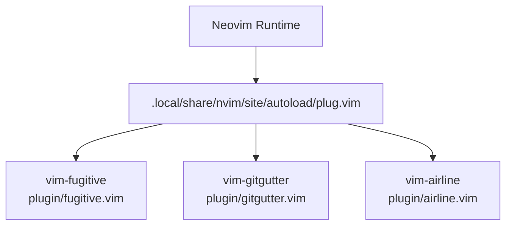
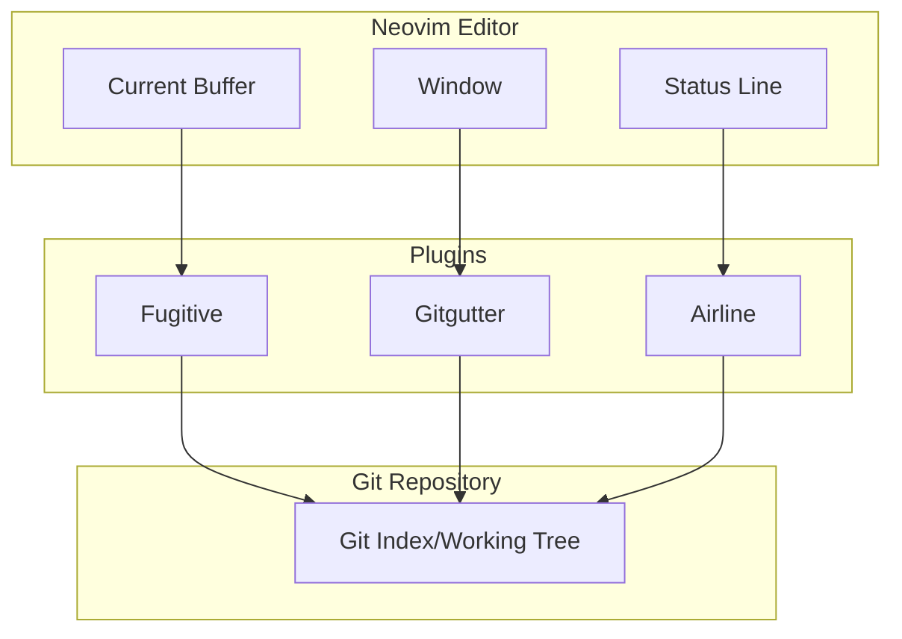
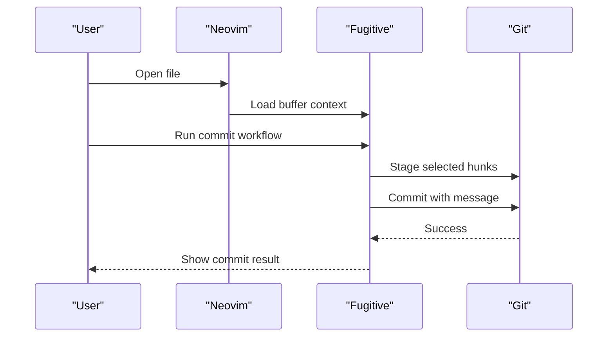
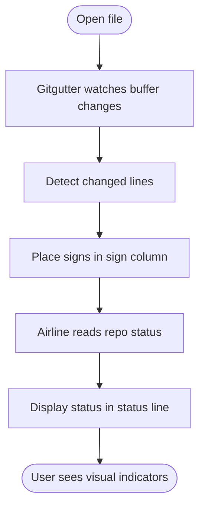
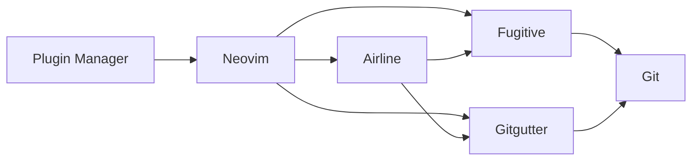

# Version Control Tools

<cite>
**Referenced Files in This Document**
- [init.vim](file://.config/nvim/init.vim)
- [README.markdown](file://.config/nvim/plugged/vim-fugitive/README.markdown)
- [README.mkd](file://.config/nvim/plugged/vim-gitgutter/README.mkd)
- [airline.vim](file://.config/nvim/plugged/vim-airline/plugin/airline.vim)
- [gitgutter.vim](file://.config/nvim/plugged/vim-gitgutter/plugin/gitgutter.vim)
- [fugitive.vim](file://.config/nvim/plugged/vim-fugitive/plugin/fugitive.vim)
</cite>

## Table of Contents
1. [Introduction](#introduction)
2. [Project Structure](#project-structure)
3. [Core Components](#core-components)
4. [Architecture Overview](#architecture-overview)
5. [Detailed Component Analysis](#detailed-component-analysis)
6. [Dependency Analysis](#dependency-analysis)
7. [Performance Considerations](#performance-considerations)
8. [Troubleshooting Guide](#troubleshooting-guide)
9. [Conclusion](#conclusion)

## Introduction
This document explains how Neovim integrates with Git using two powerful plugins: Fugitive and Gitgutter. It focuses on how these tools work together to provide a seamless version control experience inside Neovim, including commit workflows, branch management, diff viewing, visual change indicators, and integration with the airline status bar. It also covers practical Git workflows, staging and committing changes, conflict resolution, remote operations, configuration tips, custom key mappings, and best practices for team collaboration.

## Project Structure
Neovim loads plugins via a plugin manager and enables Fugitive and Gitgutter alongside airline. The configuration declares the plugins and sets basic airline options. While the plugin directories are not present in this repository snapshot, the documentation references the official plugin files and READMEs to explain their capabilities and integration points.

**Diagram sources**
- [init.vim](file://.config/nvim/init.vim#L137-L161)
- [airline.vim](file://.config/nvim/plugged/vim-airline/plugin/airline.vim)
- [gitgutter.vim](file://.config/nvim/plugged/vim-gitgutter/plugin/gitgutter.vim)
- [fugitive.vim](file://.config/nvim/plugged/vim-fugitive/plugin/fugitive.vim)

**Section sources**
- [init.vim](file://.config/nvim/init.vim#L137-L161)

## Core Components
- Fugitive: A Git wrapper that exposes Git commands directly inside Neovim buffers. It supports commit workflows, branch management, diff viewing, and remote operations.
- Gitgutter: A plugin that shows visual indicators for changes in the sign column and integrates with airline to reflect repository status in the status line.
- Airline: A status line plugin that displays branch names, modified files, and other repository metadata.

Key configuration highlights:
- Plugins are declared and loaded via the plugin manager.
- Airline is configured with tabline enabled and a theme selection.

**Section sources**
- [init.vim](file://.config/nvim/init.vim#L137-L161)
- [init.vim](file://.config/nvim/init.vim#L291-L298)

## Architecture Overview
Fugitive and Gitgutter integrate with Neovim’s buffer and window model. Fugitive operates on the current buffer and Git repository context, while Gitgutter observes file changes and updates the sign column. Airline reads repository state and presents it in the status line.

**Diagram sources**
- [fugitive.vim](file://.config/nvim/plugged/vim-fugitive/plugin/fugitive.vim)
- [gitgutter.vim](file://.config/nvim/plugged/vim-gitgutter/plugin/gitgutter.vim)
- [airline.vim](file://.config/nvim/plugged/vim-airline/plugin/airline.vim)

## Detailed Component Analysis

### Fugitive: Git Wrapper and Workflow Integration
Fugitive provides a comprehensive Git interface within Neovim. Typical capabilities include:
- Commit workflows: staging hunks and committing with a commit message editor.
- Branch management: switching branches, creating new branches, and inspecting branch history.
- Diff viewing: showing diffs for the current buffer or staged changes.
- Remote operations: fetching, pushing, and pulling with remote repositories.
- Conflict resolution: identifying conflicted regions and navigating them.

Practical workflows:
- Stage and commit: open the Git buffer, select hunks, stage them, and commit with a message.
- View diffs: open the Git diff for the current file to review changes.
- Manage branches: switch branches, merge or rebase, and resolve conflicts if they arise.
- Remote sync: fetch updates, push commits, and handle upstream changes.

**Diagram sources**
- [fugitive.vim](file://.config/nvim/plugged/vim-fugitive/plugin/fugitive.vim)

**Section sources**
- [README.markdown](file://.config/nvim/plugged/vim-fugitive/README.markdown)

### Gitgutter: Visual Change Indicators and Status Integration
Gitgutter displays signs in the left margin to indicate:
- Modified lines
- Added lines
- Removed lines
- Untracked files

Integration with airline:
- Airline reads repository status and can display branch and modified-file indicators in the status line.

**Diagram sources**
- [gitgutter.vim](file://.config/nvim/plugged/vim-gitgutter/plugin/gitgutter.vim)
- [airline.vim](file://.config/nvim/plugged/vim-airline/plugin/airline.vim)

**Section sources**
- [README.mkd](file://.config/nvim/plugged/vim-gitgutter/README.mkd)
- [init.vim](file://.config/nvim/init.vim#L291-L298)

### Practical Workflows Inside Neovim
- Staging and committing:
  - Use Fugitive to stage hunks and commit with a message.
  - Review staged and unstaged changes with diff views.
- Conflict resolution:
  - Navigate conflicted regions and choose resolutions.
  - Commit after resolving conflicts.
- Remote operations:
  - Fetch updates, push commits, and manage remotes.
- Team collaboration:
  - Keep branch names meaningful and commit messages descriptive.
  - Use small, focused commits and regular pushes.

[No sources needed since this section provides general guidance]

## Dependency Analysis
Fugitive and Gitgutter depend on Neovim’s buffer/window system and Git itself. Airline depends on Fugitive/Gitgutter for repository status. The plugin manager initializes these components during Neovim startup.

**Diagram sources**
- [init.vim](file://.config/nvim/init.vim#L137-L161)
- [airline.vim](file://.config/nvim/plugged/vim-airline/plugin/airline.vim)
- [gitgutter.vim](file://.config/nvim/plugged/vim-gitgutter/plugin/gitgutter.vim)
- [fugitive.vim](file://.config/nvim/plugged/vim-fugitive/plugin/fugitive.vim)

**Section sources**
- [init.vim](file://.config/nvim/init.vim#L137-L161)

## Performance Considerations
- Keep the number of open buffers reasonable to reduce Git scanning overhead.
- Use airline themes that minimize heavy rendering.
- Prefer incremental updates by staging smaller hunks and committing frequently.

[No sources needed since this section provides general guidance]

## Troubleshooting Guide
- Plugin not loading:
  - Ensure the plugin manager is installed and plugins are fetched.
- No signs appear:
  - Verify Gitgutter is enabled and the file belongs to a Git repository.
- Airline status missing:
  - Confirm airline is configured and the theme is set.
- Conflicts unresolved:
  - Use Fugitive’s diff and conflict navigation to resolve and commit.

**Section sources**
- [init.vim](file://.config/nvim/init.vim#L137-L161)
- [README.mkd](file://.config/nvim/plugged/vim-gitgutter/README.mkd)
- [README.markdown](file://.config/nvim/plugged/vim-fugitive/README.markdown)

## Conclusion
Fugitive and Gitgutter, combined with airline, deliver a robust, integrated version control experience in Neovim. By leveraging staged commits, visual indicators, and status reporting, teams can maintain efficient workflows, improve code quality, and collaborate effectively. Configure plugins thoughtfully, adopt consistent commit practices, and use small, frequent commits to keep development smooth.