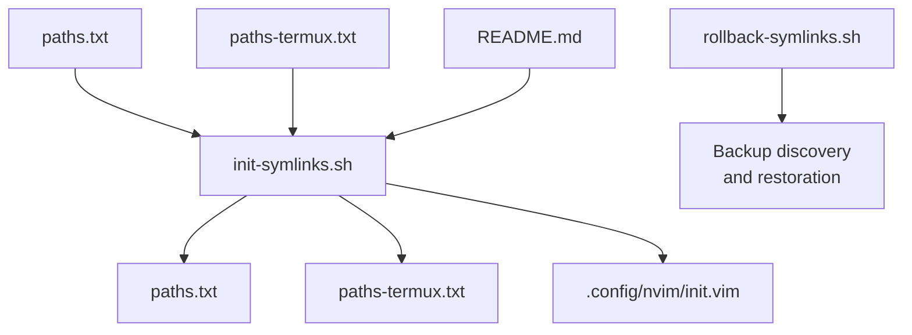
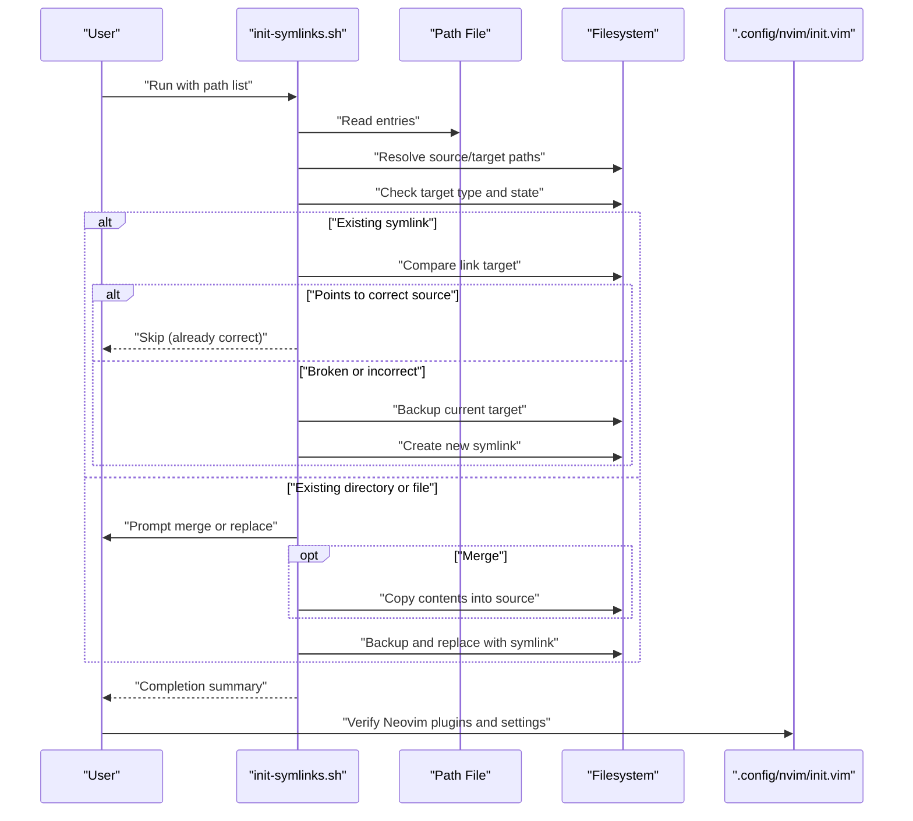
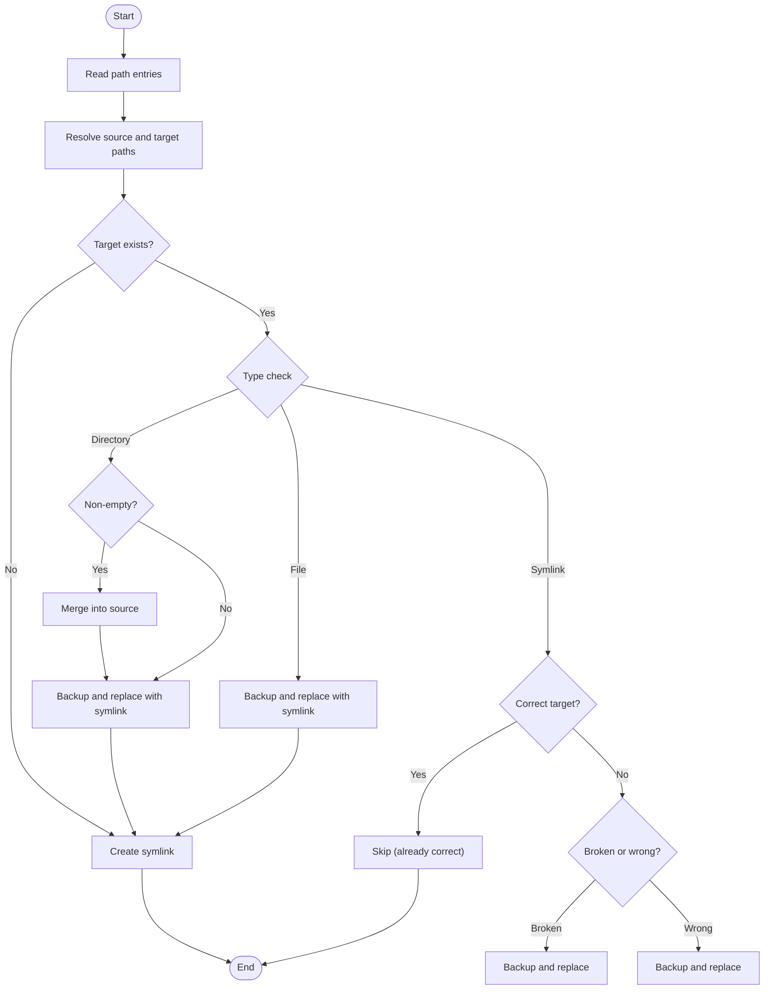
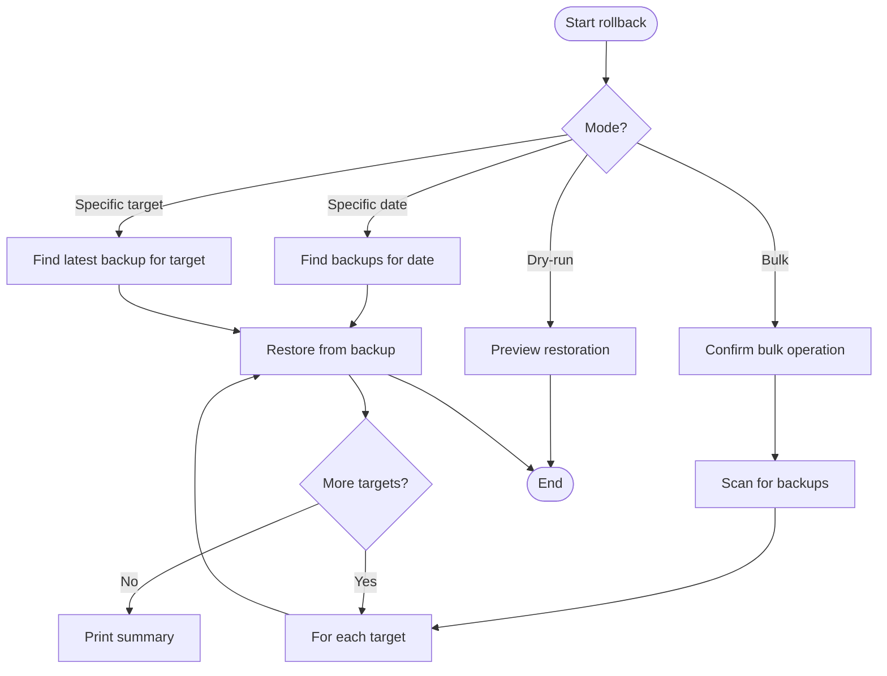
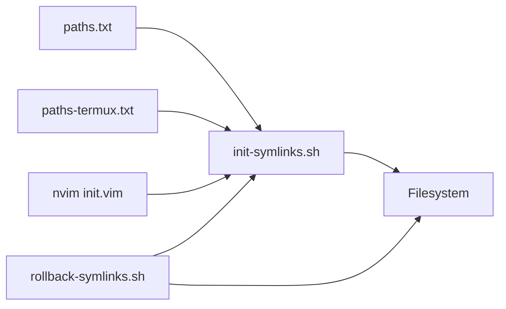

# Troubleshooting and Maintenance

<cite>
**Referenced Files in This Document**
- [rollback-symlinks.sh](file://rollback-symlinks.sh)
- [init-symlinks.sh](file://init-symlinks.sh)
- [paths.txt](file://paths.txt)
- [paths-termux.txt](file://paths-termux.txt)
- [.config/nvim/init.vim](file://.config/nvim/init.vim)
- [README.md](file://README.md)
</cite>

## Table of Contents
1. [Introduction](#introduction)
2. [Project Structure](#project-structure)
3. [Core Components](#core-components)
4. [Architecture Overview](#architecture-overview)
5. [Detailed Component Analysis](#detailed-component-analysis)
6. [Dependency Analysis](#dependency-analysis)
7. [Performance Considerations](#performance-considerations)
8. [Troubleshooting Guide](#troubleshooting-guide)
9. [Conclusion](#conclusion)
10. [Appendices](#appendices)

## Introduction
This document provides comprehensive troubleshooting and maintenance guidance for deploying and sustaining dotfiles across environments. It focuses on:
- Deployment workflows using symlink initialization
- Configuration recovery and rollback using rollback-symlinks.sh
- Conflict resolution strategies for overlapping or mismatched symlinks
- Emergency recovery procedures
- Diagnostic approaches for deployment failures, plugin installation issues, and configuration conflicts
- Preventive maintenance, backup verification, and system health monitoring
- Practical troubleshooting workflows and best practices for stable configurations across desktop and Termux environments

## Project Structure
The repository centers around two primary operational scripts and supporting configuration files:
- Deployment and symlink management: init-symlinks.sh
- Rollback and recovery: rollback-symlinks.sh
- Environment-specific path lists: paths.txt (desktop) and paths-termux.txt (Termux)
- Neovim configuration and plugin ecosystem: .config/nvim/init.vim
- High-level setup guidance: README.md

**Diagram sources**
- [init-symlinks.sh](file://init-symlinks.sh#L1-L347)
- [rollback-symlinks.sh](file://rollback-symlinks.sh#L1-L316)
- [paths.txt](file://paths.txt#L1-L16)
- [paths-termux.txt](file://paths-termux.txt#L1-L12)
- [.config/nvim/init.vim](file://.config/nvim/init.vim#L1-L352)
- [README.md](file://README.md#L1-L35)

**Section sources**
- [README.md](file://README.md#L1-L35)
- [init-symlinks.sh](file://init-symlinks.sh#L1-L347)
- [rollback-symlinks.sh](file://rollback-symlinks.sh#L1-L316)
- [paths.txt](file://paths.txt#L1-L16)
- [paths-termux.txt](file://paths-termux.txt#L1-L12)
- [.config/nvim/init.vim](file://.config/nvim/init.vim#L1-L352)

## Core Components
- init-symlinks.sh: Orchestrates symlink creation and replacement, handles existing targets (symlinks, directories, files), generates timestamped backups, and supports batch mode.
- rollback-symlinks.sh: Scans for timestamped backups and restores them selectively or en masse, with dry-run previews and optional targeting by date or path.
- paths.txt and paths-termux.txt: Define which files/directories to symlink under $HOME for desktop and Termux environments respectively.
- .config/nvim/init.vim: Central Neovim configuration that integrates plugins and sets environment expectations.

Key capabilities:
- Safe replacement of conflicting or broken symlinks with timestamped backups
- Selective or bulk rollback with preview
- Environment-aware path resolution for desktop and Termux

**Section sources**
- [init-symlinks.sh](file://init-symlinks.sh#L1-L347)
- [rollback-symlinks.sh](file://rollback-symlinks.sh#L1-L316)
- [paths.txt](file://paths.txt#L1-L16)
- [paths-termux.txt](file://paths-termux.txt#L1-L12)
- [.config/nvim/init.vim](file://.config/nvim/init.vim#L1-L352)

## Architecture Overview
The deployment and maintenance architecture consists of:
- Path list ingestion to resolve source and target locations
- Existence and type checks for targets (symlink, directory, file)
- Conflict resolution with user prompts or batch decisions
- Timestamped backup generation prior to replacements
- Symlink creation and post-processing verification
- Rollback scanning and selective restoration with dry-run safety

**Diagram sources**
- [init-symlinks.sh](file://init-symlinks.sh#L1-L347)
- [paths.txt](file://paths.txt#L1-L16)
- [paths-termux.txt](file://paths-termux.txt#L1-L12)
- [.config/nvim/init.vim](file://.config/nvim/init.vim#L1-L352)

## Detailed Component Analysis

### init-symlinks.sh: Deployment and Conflict Resolution
Responsibilities:
- Parse path list files to compute source and target paths
- Detect existing targets and resolve conflicts (broken symlinks, wrong targets, non-empty directories)
- Generate timestamped backups for safe replacements
- Create symlinks and provide progress feedback
- Support batch mode to avoid interactive prompts

Conflict resolution strategies:
- Broken symlinks: Detected via readlink; replaced after moving to a timestamped backup
- Wrong-target symlinks: Prompted for replacement; backup created before replacement
- Existing directories: Optionally merged into the source before replacing with a symlink
- Existing files: Prompted for replacement; backup created before replacement

Batch mode:
- Disables interactive prompts; automatically proceeds with replacements and merges

Timestamped backups:
- Generated using the current date and optional numeric suffix to avoid collisions

**Diagram sources**
- [init-symlinks.sh](file://init-symlinks.sh#L1-L347)

**Section sources**
- [init-symlinks.sh](file://init-symlinks.sh#L1-L347)
- [paths.txt](file://paths.txt#L1-L16)
- [paths-termux.txt](file://paths-termux.txt#L1-L12)

### rollback-symlinks.sh: Rollback and Recovery
Responsibilities:
- Discover backups by scanning for files with timestamped suffixes
- Restore targets from the latest or a specific-date backup
- Support dry-run previews and targeted rollbacks
- Provide summary statistics and safety prompts for bulk operations

Rollback modes:
- Dry-run: Preview what would be restored without making changes
- Specific date: Restore backups matching a given date pattern
- Specific target: Restore a single path only
- Bulk: Scan and restore all discovered backups with user confirmation

Safety and validation:
- Validates backup existence and path correctness
- Removes current target (file, directory, or symlink) before restoration
- Uses mv for atomic replacement where applicable

**Diagram sources**
- [rollback-symlinks.sh](file://rollback-symlinks.sh#L1-L316)

**Section sources**
- [rollback-symlinks.sh](file://rollback-symlinks.sh#L1-L316)

### Neovim Configuration (.config/nvim/init.vim): Plugin and Environment Expectations
Highlights:
- General editor settings and UI preferences
- Backup and swap directories configured with daily-minute granularity
- Plugin management via vim-plug with a curated set of plugins
- Filetype-specific settings and leader-key mappings
- Environment-specific provider selection and optional external tools

Maintenance implications:
- Backup and swap directories must be writable and organized
- Plugins require network access and may depend on external servers (e.g., LLM endpoints)
- Leader-key and filetype mappings can conflict with other setups; verify compatibility

**Section sources**
- [.config/nvim/init.vim](file://.config/nvim/init.vim#L1-L352)

## Dependency Analysis
- init-symlinks.sh depends on:
  - paths.txt or paths-termux.txt for target definitions
  - .config/nvim/init.vim for environment expectations
  - Shell utilities for path resolution, linking, and filesystem operations
- rollback-symlinks.sh depends on:
  - Timestamped backup files created by init-symlinks.sh
  - Filesystem layout consistent with backup naming conventions

**Diagram sources**
- [init-symlinks.sh](file://init-symlinks.sh#L1-L347)
- [rollback-symlinks.sh](file://rollback-symlinks.sh#L1-L316)
- [paths.txt](file://paths.txt#L1-L16)
- [paths-termux.txt](file://paths-termux.txt#L1-L12)
- [.config/nvim/init.vim](file://.config/nvim/init.vim#L1-L352)

**Section sources**
- [init-symlinks.sh](file://init-symlinks.sh#L1-L347)
- [rollback-symlinks.sh](file://rollback-symlinks.sh#L1-L316)
- [paths.txt](file://paths.txt#L1-L16)
- [paths-termux.txt](file://paths-termux.txt#L1-L12)
- [.config/nvim/init.vim](file://.config/nvim/init.vim#L1-L352)

## Performance Considerations
- Batch mode in init-symlinks.sh reduces interactive overhead for large path lists
- Directory merges copy potentially large amounts of data; prefer incremental sync for very large directories
- Backup scans in rollback-symlinks.sh traverse home directories; restrict scope with specific targets for speed
- Neovim plugin loading can be slow if many plugins are enabled; disable unused plugins for performance-sensitive environments

## Troubleshooting Guide

### Deployment Failures
Common symptoms:
- Symlink creation fails due to permission errors
- Target already exists as a non-empty directory
- Source path does not exist

Resolution steps:
- Verify permissions on target directories and ensure write access
- Use batch mode to bypass prompts and automate replacements
- Confirm source paths exist; fix path lists if entries are missing
- For non-empty directories, choose merge to preserve existing content before replacing with a symlink

**Section sources**
- [init-symlinks.sh](file://init-symlinks.sh#L1-L347)
- [paths.txt](file://paths.txt#L1-L16)
- [paths-termux.txt](file://paths-termux.txt#L1-L12)

### Plugin Installation Problems (Neovim)
Common symptoms:
- Plugins fail to load or report missing providers
- Network-dependent plugins cannot connect to endpoints
- Leader-key or filetype mappings conflict with other configurations

Resolution steps:
- Ensure vim-plug is installed and run plugin installation inside Neovim
- Verify environment-specific providers (e.g., Python host) are available and correctly configured
- Confirm external services (e.g., LLM endpoints) are reachable if required by plugins
- Adjust leader-key and filetype mappings to avoid conflicts across environments

**Section sources**
- [.config/nvim/init.vim](file://.config/nvim/init.vim#L1-L352)

### Configuration Conflicts
Common symptoms:
- Multiple dotfiles repositories or manual edits cause conflicting symlinks
- Broken symlinks point to stale locations
- Environment-specific differences (desktop vs Termux) lead to mismatches

Resolution steps:
- Use rollback-symlinks.sh with dry-run to preview conflicts and confirm changes
- Restore specific targets to known-good backups
- Re-run init-symlinks.sh with the appropriate path list for the environment
- For Termux, use paths-termux.txt to avoid desktop-only entries

**Section sources**
- [rollback-symlinks.sh](file://rollback-symlinks.sh#L1-L316)
- [init-symlinks.sh](file://init-symlinks.sh#L1-L347)
- [paths-termux.txt](file://paths-termux.txt#L1-L12)

### Emergency Recovery Procedures
Steps:
- Preview with dry-run: Use rollback-symlinks.sh with --dry-run to review all planned changes
- Targeted rollback: Use --target to restore a specific file or directory quickly
- Bulk rollback with caution: Use --date to restore to a known-good date; confirm with interactive prompt unless using --dry-run
- Verify Neovim: After rollback, re-install plugins and verify configuration

**Section sources**
- [rollback-symlinks.sh](file://rollback-symlinks.sh#L1-L316)
- [.config/nvim/init.vim](file://.config/nvim/init.vim#L1-L352)

### Diagnostic Approaches
- Symlink health: Inspect targets with readlink and compare against expected sources
- Backup presence: Confirm timestamped backups exist for targets before relying on rollback
- Environment parity: Validate that the correct path list is used for desktop vs Termux
- Neovim diagnostics: Check plugin availability, provider paths, and leader-key mappings

**Section sources**
- [init-symlinks.sh](file://init-symlinks.sh#L1-L347)
- [rollback-symlinks.sh](file://rollback-symlinks.sh#L1-L316)
- [.config/nvim/init.vim](file://.config/nvim/init.vim#L1-L352)

### Preventive Maintenance Practices
- Regularly back up critical configuration directories outside the home tree
- Use timestamped backups generated by init-symlinks.sh as the baseline for recovery
- Periodically audit symlink targets and remove stale entries from path lists
- Keep Neovim plugin lists minimal and pinned to known-good versions when possible
- Maintain separate path lists for desktop and Termux to prevent cross-contamination

**Section sources**
- [init-symlinks.sh](file://init-symlinks.sh#L1-L347)
- [paths.txt](file://paths.txt#L1-L16)
- [paths-termux.txt](file://paths-termux.txt#L1-L12)
- [.config/nvim/init.vim](file://.config/nvim/init.vim#L1-L352)

### Backup Verification Procedures
- Confirm backup directories exist and are writable (Neovim backup and swap directories)
- Validate that timestamped backups are present for recently modified files
- Test rollback on a subset of targets using --dry-run before bulk operations
- After rollback, re-run init-symlinks.sh to re-establish symlinks and regenerate fresh backups

**Section sources**
- [.config/nvim/init.vim](file://.config/nvim/init.vim#L86-L131)
- [rollback-symlinks.sh](file://rollback-symlinks.sh#L1-L316)
- [init-symlinks.sh](file://init-symlinks.sh#L1-L347)

### System Health Monitoring
- Monitor symlink integrity periodically using readlink and diff against expected sources
- Track Neovim plugin load times and error logs
- Validate environment-specific settings (e.g., Termux vs desktop) to catch mismatches early
- Maintain a log of recent changes (manual edits, plugin updates) to aid rollback decisions

**Section sources**
- [init-symlinks.sh](file://init-symlinks.sh#L1-L347)
- [.config/nvim/init.vim](file://.config/nvim/init.vim#L1-L352)

## Conclusion
By combining init-symlinks.sh for safe deployment and conflict resolution with rollback-symlinks.sh for reliable recovery, you can maintain stable configurations across diverse environments. Use dry-run previews, environment-specific path lists, and timestamped backups to minimize risk. Regular audits, targeted rollbacks, and careful plugin management ensure long-term system health and rapid recovery from failures.

## Appendices

### Quick Reference: Common Commands
- Initialize symlinks (desktop): run with paths.txt
- Initialize symlinks (Termux): run with paths-termux.txt
- Dry-run rollback: preview changes without applying them
- Rollback to a specific date: restore backups matching a given date
- Rollback a specific target: restore a single file or directory
- Reinstall Neovim plugins: open Neovim and install plugins managed by vim-plug

**Section sources**
- [init-symlinks.sh](file://init-symlinks.sh#L1-L347)
- [rollback-symlinks.sh](file://rollback-symlinks.sh#L1-L316)
- [paths.txt](file://paths.txt#L1-L16)
- [paths-termux.txt](file://paths-termux.txt#L1-L12)
- [.config/nvim/init.vim](file://.config/nvim/init.vim#L1-L352)